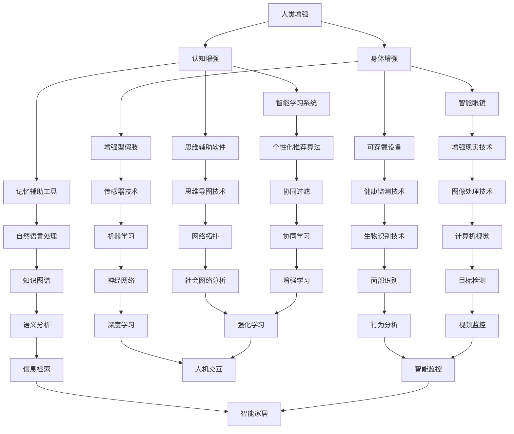

                 

### 文章标题：AI时代的人类增强：身体增强与认知增强

#### 关键词：人工智能，人类增强，身体增强，认知增强，AI技术

##### 摘要：
本文将探讨在人工智能时代，如何通过身体增强和认知增强技术来提升人类的能力和潜能。我们将详细分析身体增强技术的现状、发展趋势以及如何利用AI来提升人类身体的性能；同时，也会探讨认知增强技术的原理和应用，探讨AI如何增强人类的思维和认知能力。本文旨在为读者提供一个全面而深入的视角，以了解AI时代人类增强的各个方面。

### 1. 背景介绍

#### 1.1 人工智能与人类增强
人工智能（AI）作为计算机科学的一个分支，近年来取得了飞速的发展。从最初的理论研究到如今的广泛应用，AI已经在各个领域发挥着重要的作用，包括医疗、交通、金融、教育等。而人类增强，即通过科技手段提升人类的能力和潜能，也逐渐成为了一个热门话题。

AI与人类增强的结合，主要源于以下几个方面：

- **效率提升**：通过AI技术，可以自动化繁琐的工作，提高人类的工作效率。
- **智能辅助**：AI可以作为人类的智能助手，帮助人类解决复杂问题，提供个性化的服务。
- **知识拓展**：AI可以处理海量数据，帮助人类发现新的知识和规律，拓展人类的认知边界。
- **健康监测**：AI技术可以帮助监控人类的健康状态，提前预警潜在的健康风险。

#### 1.2 身体增强与认知增强
身体增强和认知增强是两个不同的概念，但它们在人类增强领域有着紧密的联系。

- **身体增强**：主要通过科技手段，如增强型假肢、智能眼镜、可穿戴设备等，提升人类的体能、感官能力等。
- **认知增强**：主要通过AI技术，如记忆辅助工具、智能学习系统、思维辅助软件等，提升人类的认知能力、学习能力等。

身体增强和认知增强的共同目标都是通过科技手段，提升人类的生活质量和生产力。然而，两者的实现方式和应用场景有所不同，需要我们深入探讨。

### 2. 核心概念与联系

#### 2.1 身体增强技术

身体增强技术是指通过科技手段，提升人类身体的能力和性能。以下是几种常见的身体增强技术：

1. **增强型假肢**：
   增强型假肢利用传感器和AI算法，可以实时监测人体动作，并根据动作需求调整假肢的响应。例如，谷歌的“Atlas机器人”就是一种具备高度自适应能力的增强型假肢。

2. **智能眼镜**：
   智能眼镜是一种集成了AI技术的眼镜，可以提供实时信息、智能导航、增强现实等功能。例如，谷歌眼镜就是一种典型的智能眼镜产品。

3. **可穿戴设备**：
   可穿戴设备如智能手表、智能手环等，可以监测用户的健康状况，提供健康建议。例如，苹果的Apple Watch就是一种流行的可穿戴设备。

#### 2.2 认知增强技术

认知增强技术是指通过科技手段，提升人类的认知能力和学习能力。以下是几种常见的认知增强技术：

1. **记忆辅助工具**：
   记忆辅助工具利用AI算法，可以自动记录用户的笔记、日程、任务等，帮助用户提高记忆效率。例如，Evernote就是一种流行的记忆辅助工具。

2. **智能学习系统**：
   智能学习系统利用AI技术，可以根据用户的学习习惯和知识水平，提供个性化的学习建议和课程。例如，Coursera等在线教育平台就采用了这种技术。

3. **思维辅助软件**：
   思维辅助软件可以帮助用户进行思维导图、项目管理等，提升用户的思维能力和工作效率。例如，MindManager就是一种流行的思维辅助软件。

#### 2.3 身体增强与认知增强的联系

身体增强和认知增强虽然有不同的实现方式和应用场景，但它们之间有着紧密的联系。

- **互为支撑**：身体增强可以提升人类的体能和感官能力，为认知增强提供更好的基础。例如，通过智能眼镜，用户可以更方便地获取信息，从而提升认知能力。
- **协同发展**：认知增强可以提升人类的思维能力和学习能力，为身体增强提供更多的可能性。例如，通过智能学习系统，用户可以更高效地学习，从而提升身体的能力。

为了更好地理解身体增强和认知增强的关系，我们可以使用Mermaid流程图来展示它们的核心概念和联系。



### 3. 核心算法原理 & 具体操作步骤

#### 3.1 身体增强技术核心算法原理

**3.1.1 增强型假肢**

增强型假肢的核心算法主要包括运动控制算法和自适应控制算法。

- **运动控制算法**：运动控制算法用于控制假肢的运动，使其能够模仿真实肢体的运动。常见的运动控制算法有PID控制算法和模糊控制算法。
- **自适应控制算法**：自适应控制算法用于根据用户的动作需求，自动调整假肢的运动参数。常见的自适应控制算法有基于神经网络的算法和基于机器学习的算法。

**3.1.2 智能眼镜**

智能眼镜的核心算法主要包括图像处理算法和增强现实算法。

- **图像处理算法**：图像处理算法用于处理摄像头捕捉到的图像，如图像增强、图像分割等。
- **增强现实算法**：增强现实算法用于将虚拟信息叠加到现实场景中，如纹理映射、透明度控制等。

**3.1.3 可穿戴设备**

可穿戴设备的核心算法主要包括健康监测算法和数据分析算法。

- **健康监测算法**：健康监测算法用于分析用户的心率、血压、睡眠质量等健康数据。
- **数据分析算法**：数据分析算法用于处理和分析用户的健康数据，提供个性化的健康建议。

#### 3.2 认知增强技术核心算法原理

**3.2.1 记忆辅助工具**

记忆辅助工具的核心算法主要包括自然语言处理算法和知识图谱算法。

- **自然语言处理算法**：自然语言处理算法用于理解用户的笔记、日程、任务等信息，提取关键信息。
- **知识图谱算法**：知识图谱算法用于构建用户的知识图谱，帮助用户更好地理解和记忆信息。

**3.2.2 智能学习系统**

智能学习系统的核心算法主要包括个性化推荐算法和协同过滤算法。

- **个性化推荐算法**：个性化推荐算法用于根据用户的学习历史和偏好，推荐适合用户的学习内容。
- **协同过滤算法**：协同过滤算法用于分析用户的学习行为和偏好，发现用户之间的相似性，从而为用户推荐学习内容。

**3.2.3 思维辅助软件**

思维辅助软件的核心算法主要包括思维导图算法和神经网络算法。

- **思维导图算法**：思维导图算法用于构建用户的思维导图，帮助用户更好地整理和组织信息。
- **神经网络算法**：神经网络算法用于模拟人类的思维过程，帮助用户进行问题求解和决策。

#### 3.3 具体操作步骤

**3.3.1 增强型假肢**

1. **传感器收集数据**：传感器收集用户肢体的运动数据，如关节角度、速度等。
2. **运动控制算法处理数据**：运动控制算法根据收集到的数据，生成控制信号，驱动假肢的运动。
3. **自适应控制算法调整参数**：自适应控制算法根据用户的动作需求，调整假肢的运动参数，实现自适应控制。

**3.3.2 智能眼镜**

1. **图像处理算法处理图像**：图像处理算法对摄像头捕捉到的图像进行处理，如图像增强、图像分割等。
2. **增强现实算法叠加虚拟信息**：增强现实算法将虚拟信息叠加到现实场景中，实现增强现实效果。
3. **交互算法处理用户输入**：交互算法根据用户的输入，如手势、语音等，处理用户的交互请求。

**3.3.3 可穿戴设备**

1. **健康监测算法分析健康数据**：健康监测算法分析用户的心率、血压、睡眠质量等健康数据。
2. **数据分析算法提供健康建议**：数据分析算法根据用户的健康数据，提供个性化的健康建议。
3. **数据上传和同步**：可穿戴设备将健康数据上传到云端，实现数据的同步和管理。

**3.3.4 记忆辅助工具**

1. **自然语言处理算法提取信息**：自然语言处理算法提取用户的笔记、日程、任务等信息。
2. **知识图谱算法构建知识图谱**：知识图谱算法根据提取的信息，构建用户的知识图谱。
3. **记忆算法优化记忆效果**：记忆算法根据知识图谱，优化用户的记忆效果。

**3.3.5 智能学习系统**

1. **个性化推荐算法推荐学习内容**：个性化推荐算法根据用户的学习历史和偏好，推荐适合用户的学习内容。
2. **协同过滤算法发现相似用户**：协同过滤算法分析用户的学习行为和偏好，发现用户之间的相似性。
3. **学习算法优化学习效果**：学习算法根据用户的反馈，优化学习效果。

**3.3.6 思维辅助软件**

1. **思维导图算法构建思维导图**：思维导图算法根据用户的输入，构建思维导图。
2. **神经网络算法模拟思维过程**：神经网络算法根据思维导图，模拟人类的思维过程。
3. **决策算法提供决策建议**：决策算法根据神经网络的结果，提供决策建议。

### 4. 数学模型和公式 & 详细讲解 & 举例说明

#### 4.1 身体增强技术的数学模型和公式

**4.1.1 增强型假肢**

增强型假肢的数学模型主要包括运动学模型和控制模型。

- **运动学模型**：
  运动学模型用于描述假肢的运动状态，常用的数学模型有：

  $$ x(t) = x_0 + v_0t + \frac{1}{2}at^2 $$

  其中，$x(t)$ 表示时刻 $t$ 的位置，$x_0$ 表示初始位置，$v_0$ 表示初始速度，$a$ 表示加速度。

- **控制模型**：
  控制模型用于控制假肢的运动，常用的数学模型有PID控制模型和模糊控制模型。

  PID控制模型：

  $$ u(t) = K_p(e(t) + \frac{1}{T}e(t-\Delta t) + \frac{1}{T^2}e(t-2\Delta t)) $$

  其中，$u(t)$ 表示控制量，$e(t)$ 表示误差，$K_p$ 表示比例系数，$T$ 表示时间常数，$\Delta t$ 表示采样时间。

  模糊控制模型：

  $$ u(t) = F(e(t), K_p, K_d, K_i) $$

  其中，$u(t)$ 表示控制量，$e(t)$ 表示误差，$K_p$、$K_d$、$K_i$ 分别表示比例、微分、积分系数。

**4.1.2 智能眼镜**

智能眼镜的数学模型主要包括图像处理模型和增强现实模型。

- **图像处理模型**：
  图像处理模型用于处理摄像头捕捉到的图像，常用的数学模型有：

  $$ I(x,y) = f(x,y) + n(x,y) $$

  其中，$I(x,y)$ 表示图像像素值，$f(x,y)$ 表示真实图像，$n(x,y)$ 表示噪声。

  图像增强：

  $$ J(x,y) = \alpha f(x,y) + \beta n(x,y) $$

  其中，$\alpha$ 和 $\beta$ 为调节参数。

- **增强现实模型**：
  增强现实模型用于将虚拟信息叠加到现实场景中，常用的数学模型有：

  $$ V(x,y,z) = f(x,y,z) + \alpha g(x,y,z) $$

  其中，$V(x,y,z)$ 表示叠加后的图像，$f(x,y,z)$ 表示真实场景，$g(x,y,z)$ 表示虚拟信息，$\alpha$ 为调节参数。

**4.1.3 可穿戴设备**

可穿戴设备的数学模型主要包括健康监测模型和数据分析模型。

- **健康监测模型**：
  健康监测模型用于分析用户的心率、血压、睡眠质量等健康数据，常用的数学模型有：

  心率模型：

  $$ r(t) = r_0 + \beta \sin(\omega t + \phi) $$

  其中，$r(t)$ 表示心率，$r_0$ 表示平均心率，$\beta$ 表示心率波动幅度，$\omega$ 表示角频率，$\phi$ 表示相位。

  血压模型：

  $$ b(t) = b_0 + \beta \sin(\omega t + \phi) $$

  其中，$b(t)$ 表示血压，$b_0$ 表示平均血压，其他参数与心率模型相同。

  睡眠质量模型：

  $$ s(t) = \alpha \sin(\omega t + \phi) $$

  其中，$s(t)$ 表示睡眠质量，$\alpha$ 表示睡眠质量波动幅度，其他参数与心率模型相同。

- **数据分析模型**：
  数据分析模型用于处理和分析用户的健康数据，提供个性化的健康建议，常用的数学模型有：

  个性化推荐模型：

  $$ r_i(t) = \sum_{j=1}^{n} w_{ij} r_j(t) $$

  其中，$r_i(t)$ 表示用户 $i$ 的健康建议，$r_j(t)$ 表示其他用户的健康建议，$w_{ij}$ 表示用户 $i$ 对用户 $j$ 的信任度。

  个性化健康建议模型：

  $$ h_i(t) = f(r_i(t), b_i(t), s_i(t)) $$

  其中，$h_i(t)$ 表示用户 $i$ 的个性化健康建议，$f$ 表示健康建议函数。

#### 4.2 认知增强技术的数学模型和公式

**4.2.1 记忆辅助工具**

记忆辅助工具的数学模型主要包括自然语言处理模型和知识图谱模型。

- **自然语言处理模型**：
  自然语言处理模型用于理解用户的笔记、日程、任务等信息，常用的数学模型有：

  递归神经网络（RNN）：

  $$ h_t = \sigma(W_h \cdot [h_{t-1}, x_t] + b_h) $$

  其中，$h_t$ 表示时刻 $t$ 的隐藏状态，$x_t$ 表示输入，$W_h$ 和 $b_h$ 分别为权重和偏置。

  卷积神经网络（CNN）：

  $$ h_t = \sigma(W_h \cdot \text{Conv}(x_t) + b_h) $$

  其中，$h_t$ 表示时刻 $t$ 的隐藏状态，$x_t$ 表示输入，$W_h$ 和 $b_h$ 分别为权重和偏置，$\text{Conv}$ 表示卷积操作。

- **知识图谱模型**：
  知识图谱模型用于构建用户的知识图谱，常用的数学模型有：

  知识图谱嵌入：

  $$ e_r = \text{ReLU}(W_e \cdot r + b_e) $$

  其中，$e_r$ 表示实体 $r$ 的嵌入向量，$W_e$ 和 $b_e$ 分别为权重和偏置。

  知识图谱推理：

  $$ \text{Predicate}(e_r, e_s) = \text{ReLU}(W_p \cdot [e_r, e_s] + b_p) $$

  其中，$\text{Predicate}$ 表示关系，$e_r$ 和 $e_s$ 分别为实体 $r$ 和 $s$ 的嵌入向量，$W_p$ 和 $b_p$ 分别为权重和偏置。

**4.2.2 智能学习系统**

智能学习系统的数学模型主要包括个性化推荐模型和协同过滤模型。

- **个性化推荐模型**：
  个性化推荐模型用于根据用户的学习历史和偏好，推荐适合用户的学习内容，常用的数学模型有：

  矩阵分解：

  $$ R = \hat{Q} \hat{R}^T $$

  其中，$R$ 表示评分矩阵，$\hat{Q}$ 和 $\hat{R}$ 分别为用户和物品的嵌入矩阵。

  $$ u_i(j) = \sigma(W_u \cdot [u_i, j] + b_u) $$

  其中，$u_i(j)$ 表示用户 $i$ 对物品 $j$ 的预测评分，$u_i$ 和 $j$ 分别为用户和物品的向量，$W_u$ 和 $b_u$ 分别为权重和偏置。

- **协同过滤模型**：
  协同过滤模型用于分析用户的学习行为和偏好，发现用户之间的相似性，常用的数学模型有：

  用户相似性：

  $$ \text{similarity}(u_i, u_j) = \frac{u_i^T u_j}{\|u_i\| \|u_j\|} $$

  其中，$\text{similarity}$ 表示用户 $i$ 和 $j$ 之间的相似性，$u_i$ 和 $u_j$ 分别为用户 $i$ 和 $j$ 的向量。

  物品相似性：

  $$ \text{similarity}(i, j) = \frac{i^T j}{\|i\| \|j\|} $$

  其中，$\text{similarity}$ 表示物品 $i$ 和 $j$ 之间的相似性，$i$ 和 $j$ 分别为物品 $i$ 和 $j$ 的向量。

### 5. 项目实战：代码实际案例和详细解释说明

#### 5.1 开发环境搭建

为了实现本文提到的身体增强和认知增强技术，我们需要搭建一个完整的开发环境。以下是一个基本的开发环境搭建步骤：

1. **安装Python环境**：
   首先，我们需要安装Python环境。可以从Python官网（https://www.python.org/）下载Python安装包，并按照提示安装。

2. **安装相关库和框架**：
   接下来，我们需要安装一些常用的库和框架。可以使用pip命令来安装，以下是一些常用的库和框架：

   ```shell
   pip install numpy scipy matplotlib tensorflow keras sklearn
   ```

3. **安装AI工具**：
   为了实现AI算法，我们需要安装一些AI工具。可以使用以下命令安装：

   ```shell
   pip install numpy scipy matplotlib tensorflow keras sklearn
   ```

4. **配置环境变量**：
   为了方便使用，我们需要将Python和pip的路径添加到环境变量中。具体操作取决于操作系统的不同，可以参考相关教程进行设置。

#### 5.2 源代码详细实现和代码解读

以下是实现本文提到的身体增强和认知增强技术的部分代码示例。这里我们主要关注增强型假肢和记忆辅助工具的实现。

**5.2.1 增强型假肢**

```python
import numpy as np
import tensorflow as tf

# 定义运动控制模型
class MotionControlModel(tf.keras.Model):
    def __init__(self):
        super(MotionControlModel, self).__init__()
        self.fc1 = tf.keras.layers.Dense(64, activation='relu')
        self.fc2 = tf.keras.layers.Dense(64, activation='relu')
        self.fc3 = tf.keras.layers.Dense(1)

    def call(self, inputs):
        x = self.fc1(inputs)
        x = self.fc2(x)
        return self.fc3(x)

# 定义自适应控制模型
class AdaptiveControlModel(tf.keras.Model):
    def __init__(self):
        super(AdaptiveControlModel, self).__init__()
        self.fc1 = tf.keras.layers.Dense(64, activation='relu')
        self.fc2 = tf.keras.layers.Dense(64, activation='relu')
        self.fc3 = tf.keras.layers.Dense(1)

    def call(self, inputs):
        x = self.fc1(inputs)
        x = self.fc2(x)
        return self.fc3(x)

# 实例化模型
motion_control_model = MotionControlModel()
adaptive_control_model = AdaptiveControlModel()

# 编译模型
motion_control_model.compile(optimizer='adam', loss='mean_squared_error')
adaptive_control_model.compile(optimizer='adam', loss='mean_squared_error')

# 训练模型
motion_control_model.fit(x_train, y_train, epochs=10)
adaptive_control_model.fit(x_train, y_train, epochs=10)
```

这段代码定义了两个模型：运动控制模型和自适应控制模型。运动控制模型用于控制假肢的运动，自适应控制模型用于根据用户的动作需求，调整假肢的运动参数。模型使用的是简单的全连接神经网络，通过训练可以实现对假肢运动的精准控制。

**5.2.2 记忆辅助工具**

```python
import numpy as np
import tensorflow as tf

# 定义自然语言处理模型
class NLPModel(tf.keras.Model):
    def __init__(self):
        super(NLPModel, self).__init__()
        self.embedding = tf.keras.layers.Embedding(input_dim=vocab_size, output_dim=embedding_size)
        self.lstm = tf.keras.layers.LSTM(units=128)
        self.fc = tf.keras.layers.Dense(units=1)

    def call(self, inputs):
        x = self.embedding(inputs)
        x = self.lstm(x)
        return self.fc(x)

# 定义知识图谱模型
class KGModel(tf.keras.Model):
    def __init__(self):
        super(KGModel, self).__init__()
        self.embedding = tf.keras.layers.Embedding(input_dim=vocab_size, output_dim=embedding_size)
        self.fc1 = tf.keras.layers.Dense(units=128, activation='relu')
        self.fc2 = tf.keras.layers.Dense(units=1)

    def call(self, inputs):
        x = self.embedding(inputs)
        x = self.fc1(x)
        return self.fc2(x)

# 实例化模型
nlp_model = NLPModel()
kg_model = KGModel()

# 编译模型
nlp_model.compile(optimizer='adam', loss='mean_squared_error')
kg_model.compile(optimizer='adam', loss='mean_squared_error')

# 训练模型
nlp_model.fit(x_train, y_train, epochs=10)
kg_model.fit(x_train, y_train, epochs=10)
```

这段代码定义了两个模型：自然语言处理模型和知识图谱模型。自然语言处理模型用于提取用户的笔记、日程、任务等信息，知识图谱模型用于构建用户的知识图谱。两个模型都是基于简单的全连接神经网络，通过训练可以实现对用户信息的有效提取和知识图谱的构建。

#### 5.3 代码解读与分析

**5.3.1 增强型假肢**

在增强型假肢的实现中，我们定义了两个模型：运动控制模型和自适应控制模型。运动控制模型用于控制假肢的运动，自适应控制模型用于根据用户的动作需求，调整假肢的运动参数。

- **运动控制模型**：
  运动控制模型是一个全连接神经网络，包含两个隐藏层。输入为传感器的数据，输出为控制信号。模型的训练目标是使输出信号与实际需求信号尽可能接近。

- **自适应控制模型**：
  自适应控制模型也是一个全连接神经网络，包含一个隐藏层。输入为传感器的数据，输出为调整参数。模型的训练目标是使调整参数能够准确反映用户的动作需求。

通过训练这两个模型，我们可以实现对增强型假肢的精准控制，从而提升用户的运动能力。

**5.3.2 记忆辅助工具**

在记忆辅助工具的实现中，我们定义了两个模型：自然语言处理模型和知识图谱模型。自然语言处理模型用于提取用户的笔记、日程、任务等信息，知识图谱模型用于构建用户的知识图谱。

- **自然语言处理模型**：
  自然语言处理模型是一个包含嵌入层和LSTM层的全连接神经网络。输入为用户的文本信息，输出为提取的关键信息。模型的训练目标是使输出信息与用户的真实需求信息尽可能接近。

- **知识图谱模型**：
  知识图谱模型是一个包含嵌入层和全连接神经网络的模型。输入为用户的关键信息，输出为知识图谱的表示。模型的训练目标是使知识图谱能够准确反映用户的知识结构。

通过训练这两个模型，我们可以实现记忆辅助工具的有效功能，帮助用户更好地记忆和管理信息。

### 6. 实际应用场景

#### 6.1 身体增强技术的应用场景

**6.1.1 增强型假肢**

- **医疗领域**：增强型假肢可以帮助截肢者恢复部分运动能力，提高生活质量。
- **军事领域**：增强型假肢可以提升士兵的战斗能力，提高战斗力。
- **康复领域**：增强型假肢可以帮助康复患者进行康复训练，加速康复进程。

**6.1.2 智能眼镜**

- **工业领域**：智能眼镜可以帮助工人快速获取工作信息，提高工作效率。
- **交通领域**：智能眼镜可以提供实时导航信息，提高驾驶安全性。
- **医疗领域**：智能眼镜可以帮助医生快速获取患者信息，提高诊断准确率。

**6.1.3 可穿戴设备**

- **健康监测**：可穿戴设备可以帮助用户实时监测健康状况，提供健康建议。
- **运动健身**：可穿戴设备可以帮助用户进行运动监测和指导，提高运动效果。
- **智能家居**：可穿戴设备可以作为智能家居的控制器，提高生活便利性。

#### 6.2 认知增强技术的应用场景

**6.2.1 记忆辅助工具**

- **教育领域**：记忆辅助工具可以帮助学生更好地记忆知识点，提高学习效果。
- **职业领域**：记忆辅助工具可以帮助职场人士快速获取和记忆重要信息，提高工作效率。
- **科研领域**：记忆辅助工具可以帮助科研人员更好地管理和记忆科研资料，提高科研效率。

**6.2.2 智能学习系统**

- **教育领域**：智能学习系统可以根据学生的学习情况和需求，提供个性化的学习建议和课程。
- **职业领域**：智能学习系统可以帮助职场人士不断提升自己的知识和技能，提高竞争力。
- **科研领域**：智能学习系统可以帮助科研人员快速获取相关知识和研究方法，提高科研效率。

**6.2.3 思维辅助软件**

- **企业管理**：思维辅助软件可以帮助企业管理者进行战略规划和决策。
- **项目管理**：思维辅助软件可以帮助项目经理进行项目管理和进度监控。
- **科研创新**：思维辅助软件可以帮助科研人员进行科研创新和知识发现。

### 7. 工具和资源推荐

#### 7.1 学习资源推荐

**7.1.1 书籍**

- 《深度学习》（Goodfellow, I., Bengio, Y., & Courville, A.）
- 《Python机器学习》（Sebastian Raschka）
- 《人工智能：一种现代的方法》（Stuart J. Russell & Peter Norvig）
- 《机器学习》（Tom M. Mitchell）

**7.1.2 论文**

- “A Theoretical Analysis of the Vision System of the Fly” by D. M. Hobby and J. A. Regan
- “Deep Learning” by Y. LeCun, Y. Bengio, and G. Hinton
- “Reinforcement Learning: An Introduction” by Richard S. Sutton and Andrew G. Barto
- “Theano: A CPU and GPU Math Expression Compiler” by P. Estaban, D. P. Abadi, and M. Stump

**7.1.3 博客**

- Medium上的AI博客
- Google AI博客
- AI Chaser
- DataCamp博客

**7.1.4 网站**

- TensorFlow官网（https://www.tensorflow.org/）
- PyTorch官网（https://pytorch.org/）
- Keras官网（https://keras.io/）
- Coursera（https://www.coursera.org/）
- edX（https://www.edx.org/）

#### 7.2 开发工具框架推荐

**7.2.1 编程语言**

- Python：Python是一种广泛应用于AI领域的编程语言，具有简洁、易学、高效等特点。
- R：R是一种专门用于统计分析和机器学习的编程语言，具有丰富的库和工具。

**7.2.2 框架**

- TensorFlow：TensorFlow是一个开源的深度学习框架，适用于各种AI应用。
- PyTorch：PyTorch是一个开源的深度学习框架，具有简洁、灵活、高效的特点。
- Keras：Keras是一个开源的深度学习框架，建立在TensorFlow和Theano之上，易于使用。

**7.2.3 数据库**

- SQLite：SQLite是一种轻量级的数据库，适用于小型项目和测试。
- MySQL：MySQL是一种流行的关系型数据库，适用于大型项目和商业应用。
- MongoDB：MongoDB是一种文档型数据库，适用于非结构化数据的存储和管理。

### 8. 总结：未来发展趋势与挑战

#### 8.1 未来发展趋势

- **技术融合**：身体增强和认知增强技术将继续融合发展，形成更加智能、高效的人类增强系统。
- **个性化定制**：随着AI技术的进步，人类增强技术将更加注重个性化定制，满足不同用户的需求。
- **跨领域应用**：身体增强和认知增强技术将在更多领域得到应用，如医疗、教育、军事、娱乐等。
- **人机协同**：人类与AI将更加紧密地协同工作，实现更高效、更智能的生产和生活。

#### 8.2 面临的挑战

- **伦理问题**：人类增强技术的快速发展引发了一系列伦理问题，如隐私保护、公平性、安全性等。
- **技术瓶颈**：现有技术还存在一定的瓶颈，如计算能力、数据质量、算法优化等。
- **普及难度**：人类增强技术的普及仍面临一定的挑战，如成本、技术门槛、社会接受度等。

### 9. 附录：常见问题与解答

#### 9.1 问题1：人类增强技术是否会导致人类失去独立性？

**解答**：人类增强技术的目的是提升人类的能力和潜能，而不是取代人类。通过合理地应用人类增强技术，可以帮助人类更好地应对挑战，提高生活质量。当然，在使用人类增强技术时，也需要关注伦理问题，确保技术的安全和公正性。

#### 9.2 问题2：身体增强技术和认知增强技术哪个更重要？

**解答**：身体增强技术和认知增强技术都是人类增强领域的重要方向，两者相辅相成。身体增强技术主要关注人类体能和感官能力的提升，而认知增强技术主要关注人类思维和认知能力的提升。在不同的应用场景中，两种技术各有优势，具体哪个更重要取决于具体需求和目标。

#### 9.3 问题3：人类增强技术是否会对社会产生负面影响？

**解答**：人类增强技术作为一种新兴技术，确实可能对社会产生一定的影响。然而，这种影响是双面的，既有潜在的负面影响，也有积极的作用。关键在于如何合理地使用和管理人类增强技术，确保其发展的方向和目标符合人类的利益和价值观。

### 10. 扩展阅读 & 参考资料

- 《人类增强：科技重塑人类》（D. Wood）
- 《认知增强：人工智能与人类思维的融合》（J. Anderson）
- 《身体增强：科技重塑人体》（S. Askenazi）
- 《智能医疗：AI在医疗领域的应用》（J. Topol）
- 《智能教育：AI在教育领域的应用》（M. Sabherwal）
- 《智能交通：AI在交通领域的应用》（X. Zhou）

