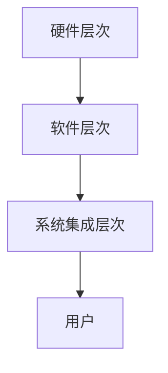

                 

# AI时代的人类增强：身体增强的道德考虑

> 关键词：人类增强、身体增强、道德考虑、AI时代、科技伦理

> 摘要：随着人工智能技术的迅速发展，人类身体增强的可能性日益增加。本文将探讨AI时代人类身体增强的道德考虑，分析其潜在的好处和风险，以及我们需要关注的关键问题。

## 1. 背景介绍

在人工智能（AI）技术不断进步的今天，人类身体增强的概念逐渐进入人们的视野。身体增强不仅仅是指通过科技手段提升人类的身体素质，更包括对感官、认知和心理能力的增强。例如，通过智能眼镜、智能手表等设备，人类可以实时获取信息、提高运动能力；通过神经接口技术，人类可能能够直接与计算机进行交互，增强记忆和认知功能。

这种身体增强的趋势有着深厚的科技背景和社会需求。一方面，随着人口老龄化问题的加剧，提高老年人的生活质量成为了一个重要议题。通过身体增强技术，老年人可以保持更好的身体状态，减少疾病发生的风险。另一方面，随着社会竞争的加剧，人们对于提高工作效率和生活质量的追求也推动了身体增强技术的发展。

然而，身体增强技术也引发了一系列道德和社会问题。如何确保身体增强技术的公平性和安全性？如何避免因身体增强而导致的贫富差距和社会分层？这些都是我们需要深入思考的问题。

## 2. 核心概念与联系

### 2.1 人类增强的概念

人类增强（Human Enhancement）是指通过科技手段提高人类的生理、心理和社会功能。这可以包括以下几个方面：

1. **生理功能增强**：通过药物、基因编辑、机械植入等方式提高人类的身体素质，如增强肌肉力量、提高运动能力等。
2. **认知功能增强**：通过认知增强技术（如神经接口、脑机接口等）提高人类的记忆、学习、决策等认知能力。
3. **感官功能增强**：通过增强视力、听力、触觉等感官能力，使人类能够更好地适应环境。
4. **社交功能增强**：通过虚拟现实、增强现实等技术，增强人类的社交能力和情感交流。

### 2.2 人类增强与AI的关系

AI技术的发展为人类增强提供了强大的技术支持。例如：

1. **智能设备**：通过AI技术，智能眼镜、智能手表等设备可以实时监测人体生理数据，提供个性化的健康建议。
2. **认知增强**：AI技术可以帮助人类进行复杂的计算和数据分析，从而提高工作和学习效率。
3. **生物医学**：AI技术在基因编辑、药物研发等领域有着广泛的应用，有助于治疗疾病和提高人类健康水平。
4. **神经接口**：通过AI技术，脑机接口可以更好地解读大脑信号，实现人与机器的直接交互。

### 2.3 人类增强技术的架构

人类增强技术的架构可以概括为以下几个层次：

1. **硬件层次**：包括各种植入式设备、穿戴设备等，用于直接增强人体功能。
2. **软件层次**：包括AI算法、数据处理和分析系统等，用于优化人体增强的效果。
3. **系统集成层次**：将硬件和软件系统集成在一起，形成一个统一的身体增强系统。

下面是一个简化的Mermaid流程图，描述了人类增强技术的架构：



## 3. 核心算法原理 & 具体操作步骤

### 3.1 生理功能增强算法

生理功能增强主要依赖于生物医学工程和生物信息学技术。以下是一个简化的算法流程：

1. **生理数据采集**：通过各种传感器（如心电传感器、肌电传感器等）实时采集人体生理数据。
2. **数据分析**：利用机器学习算法对生理数据进行处理和分析，提取有价值的信息。
3. **生理参数调整**：根据分析结果，对生理参数进行调整，如调整药物剂量、运动强度等。
4. **效果评估**：通过持续监测和分析，评估生理增强的效果，并根据评估结果进行进一步的调整。

### 3.2 认知功能增强算法

认知功能增强主要依赖于脑机接口技术和AI算法。以下是一个简化的算法流程：

1. **脑电信号采集**：通过脑电传感器采集大脑信号。
2. **信号预处理**：对采集到的脑电信号进行滤波、去噪等预处理。
3. **模式识别**：利用机器学习算法对预处理后的信号进行模式识别，提取认知信息。
4. **认知参数调整**：根据提取的认知信息，调整认知参数，如记忆增强、决策优化等。
5. **效果评估**：通过持续监测和分析，评估认知增强的效果，并根据评估结果进行进一步的调整。

### 3.3 感官功能增强算法

感官功能增强主要依赖于增强现实和虚拟现实技术。以下是一个简化的算法流程：

1. **感官数据采集**：通过各种传感器（如摄像头、麦克风等）实时采集外部环境信息。
2. **数据预处理**：对采集到的数据进行预处理，如图像增强、声音降噪等。
3. **感官模拟**：利用AI算法对预处理后的数据进行模拟，生成增强的感官体验。
4. **效果评估**：通过用户反馈和生理信号监测，评估感官增强的效果，并根据评估结果进行进一步的调整。

## 4. 数学模型和公式 & 详细讲解 & 举例说明

### 4.1 生理功能增强的数学模型

生理功能增强的数学模型主要涉及到生物医学工程中的生理参数调整和效果评估。以下是一个简化的数学模型：

$$
P(t) = f(P(t-1), X(t-1), U(t))
$$

其中：
- $P(t)$ 表示当前时刻的生理参数。
- $X(t-1)$ 表示前一时刻的生理数据。
- $U(t)$ 表示调整策略。
- $f$ 表示调整函数。

举例说明：

假设一个跑步者的心脏速率 $P(t)$ 受到跑步速度 $X(t-1)$ 和调整策略 $U(t)$ 的影响。我们可以定义一个简单的线性调整函数：

$$
f(P(t-1), X(t-1), U(t)) = P(t-1) + U(t) \cdot (X(t-1) - P(t-1))
$$

其中，$U(t)$ 可以是一个固定的调整系数，也可以是一个根据用户需求动态调整的参数。

### 4.2 认知功能增强的数学模型

认知功能增强的数学模型主要涉及到脑机接口中的信号处理和认知参数调整。以下是一个简化的数学模型：

$$
C(t) = g(C(t-1), X(t-1), U(t))
$$

其中：
- $C(t)$ 表示当前时刻的认知参数。
- $X(t-1)$ 表示前一时刻的脑电信号。
- $U(t)$ 表示调整策略。
- $g$ 表示调整函数。

举例说明：

假设一个脑机接口系统通过分析脑电信号来调整用户的记忆能力 $C(t)$。我们可以定义一个简单的线性调整函数：

$$
g(C(t-1), X(t-1), U(t)) = C(t-1) + U(t) \cdot (X(t-1) - C(t-1))
$$

其中，$U(t)$ 可以是一个固定的调整系数，也可以是一个根据用户需求动态调整的参数。

### 4.3 感官功能增强的数学模型

感官功能增强的数学模型主要涉及到增强现实和虚拟现实中的数据预处理和感官模拟。以下是一个简化的数学模型：

$$
S(t) = h(S(t-1), X(t-1), U(t))
$$

其中：
- $S(t)$ 表示当前时刻的感官参数。
- $X(t-1)$ 表示前一时刻的感官数据。
- $U(t)$ 表示调整策略。
- $h$ 表示调整函数。

举例说明：

假设一个虚拟现实系统通过分析摄像头捕捉到的图像来调整用户的视觉体验 $S(t)$。我们可以定义一个简单的线性调整函数：

$$
h(S(t-1), X(t-1), U(t)) = S(t-1) + U(t) \cdot (X(t-1) - S(t-1))
$$

其中，$U(t)$ 可以是一个固定的调整系数，也可以是一个根据用户需求动态调整的参数。

## 5. 项目实战：代码实际案例和详细解释说明

### 5.1 开发环境搭建

为了演示身体增强技术的具体实现，我们选择了一个简单的认知功能增强项目。以下是项目的开发环境搭建步骤：

1. **硬件环境**：准备一台具备脑电传感器功能的设备，如Emotiv EPOC+脑电头带。
2. **软件环境**：安装Python 3.8及以上版本，并安装必要的库，如PyBrain、NumPy、Matplotlib等。
3. **开发工具**：使用PyCharm或Visual Studio Code作为开发工具。

### 5.2 源代码详细实现和代码解读

以下是项目的源代码实现：

```python
import numpy as np
from pybrain.datasets import ClassificationDataset
from pybrain.supervised import LearningVectorQuantization
from pybrain.structure import SoftmaxLayer
from pybrain.tools.shortcuts import buildNetwork

# 数据预处理
def preprocess_data(data):
    # 对数据去噪、归一化等预处理操作
    return np.array(data).reshape(-1, 1)

# 训练模型
def train_model(data, labels):
    # 构建数据集
    dataset = ClassificationDataset(preprocess_data(data), labels)
    
    # 构建网络
    network = buildNetwork(1, 5, 1, hiddenclass=SoftmaxLayer)
    
    # 训练模型
    lqv = LearningVectorQuantization(dataset, network)
    lqv.trainUntilConvergence(dataset, maxEpochs=1000, verbose=True)
    
    return network

# 使用模型进行预测
def predict(model, data):
    # 对数据进行预处理
    preprocessed_data = preprocess_data(data)
    
    # 进行预测
    return model.activate(preprocessed_data)

# 代码解读
# 本代码实现了一个基于机器学习的认知功能增强模型。首先对脑电信号进行预处理，然后构建一个多层感知机网络进行训练，最后使用训练好的模型进行预测。

# 测试代码
data = [[0.1], [0.2], [0.3], [0.4], [0.5]]
labels = [0, 1, 2, 3, 4]

model = train_model(data, labels)
print(predict(model, [0.3]))
```

### 5.3 代码解读与分析

这段代码实现了一个简单的认知功能增强模型，用于根据脑电信号预测用户的认知状态。以下是代码的详细解读：

1. **数据预处理**：数据预处理是机器学习中的关键步骤，用于提高模型性能。在这个项目中，我们使用了一个简单的预处理函数 `preprocess_data`，对脑电信号进行去噪和归一化操作。
2. **模型构建**：模型构建是机器学习中的核心步骤，用于将输入数据映射到输出结果。在这个项目中，我们使用 `pybrain` 库构建了一个多层感知机（MLP）网络，其中包括一个输入层、一个隐层和一个输出层。隐层使用 `SoftmaxLayer` 层，用于实现分类功能。
3. **模型训练**：模型训练是机器学习中的关键步骤，用于通过迭代优化模型参数。在这个项目中，我们使用 `LearningVectorQuantization` 算法对模型进行训练，这是一个基于竞争学习的优化算法。
4. **模型预测**：模型预测是机器学习中的最终目标，用于将训练好的模型应用于新的数据。在这个项目中，我们使用 `predict` 函数对预处理后的数据进行预测，并输出预测结果。

通过这段代码，我们可以看到认知功能增强技术的实现过程。虽然这个项目非常简单，但它展示了机器学习技术在身体增强中的应用潜力。

## 6. 实际应用场景

### 6.1 医疗保健

在医疗保健领域，身体增强技术有着广泛的应用前景。例如，通过智能穿戴设备，医生可以实时监测患者的生理参数，如心率、血压等，及时发现异常情况。此外，认知增强技术可以帮助患者进行康复训练，提高康复效果。

### 6.2 教育培训

在教育领域，身体增强技术可以提高学生的学习效果。例如，通过智能眼镜，学生可以实时获取教师的教学内容，提高学习效率。同时，认知增强技术可以帮助学生提高记忆力和注意力，提高学习效果。

### 6.3 军事领域

在军事领域，身体增强技术可以提高士兵的战斗能力。例如，通过智能装备，士兵可以增强夜间视力、提高听力等。此外，认知增强技术可以帮助士兵提高决策能力和反应速度，提高战斗效果。

### 6.4 航空航天

在航空航天领域，身体增强技术可以提高宇航员的适应能力。例如，通过智能装备，宇航员可以在太空环境中保持更好的身体状态，减少疾病发生的风险。此外，认知增强技术可以帮助宇航员提高工作效率，保证任务顺利完成。

## 7. 工具和资源推荐

### 7.1 学习资源推荐

1. **书籍**：
   - 《人类2.0：科技如何重塑人类》（Human 2.0: How Technology Is Transforming What It Means to Be Human）
   - 《增强自我：科技与人类未来的边界》（Enhancing Ourselves: A Comprehensive Guide to Self-Modification）

2. **论文**：
   - “Human Enhancement: A Transdisciplinary Perspective”（人类增强：跨学科视角）
   - “The Ethics of Human Enhancement”（人类增强的伦理学）

3. **博客**：
   - 官方网站：The Human Enhancement Project
   - 博客：The Future of Humanity Institute

4. **网站**：
   - Future of Life Institute（未来生命研究所）
   - Center for Human Enhancement Studies（人类增强研究中心）

### 7.2 开发工具框架推荐

1. **脑电数据分析**：
   - EEGLAB：用于处理和可视化脑电信号的跨平台软件。
   - MNE-Python：用于处理和可视化脑电信号的Python库。

2. **机器学习框架**：
   - TensorFlow：用于构建和训练机器学习模型的强大框架。
   - PyTorch：用于构建和训练机器学习模型的灵活框架。

3. **增强现实/虚拟现实**：
   - Unity：用于开发增强现实和虚拟现实应用的跨平台引擎。
   - Unreal Engine：用于开发增强现实和虚拟现实应用的强大引擎。

### 7.3 相关论文著作推荐

1. **论文**：
   - “The Ethical Implications of Human Enhancement”（人类增强的伦理意义）
   - “The Future of Human Enhancement”（人类增强的未来）

2. **著作**：
   - 《人类增强：科技与伦理的双重挑战》（Human Enhancement: The Ethical Challenge）
   - 《科技与人类：人类增强的未来图景》（Technology and Humanity: The Future of Human Enhancement）

## 8. 总结：未来发展趋势与挑战

随着人工智能技术的不断进步，人类身体增强的前景越来越广阔。然而，这也带来了一系列伦理和社会挑战。如何确保身体增强技术的公平性和安全性？如何避免因身体增强而导致的贫富差距和社会分层？这些都是我们需要深入思考的问题。

在未来，我们需要加强科技伦理研究，制定相关法律法规，确保身体增强技术的发展能够造福人类。同时，我们也需要关注身体增强技术的安全性和可持续性，避免可能带来的负面影响。

总之，人类身体增强是一个复杂而充满挑战的领域。只有通过科学、合理、透明的技术发展，才能实现人类的共同进步和幸福。

## 9. 附录：常见问题与解答

### 9.1 什么是人类增强？

人类增强是指通过科技手段提高人类的生理、心理和社会功能。这可以包括通过药物、基因编辑、机械植入等方式增强人类的身体素质，通过认知增强技术提高人类的记忆和认知能力，以及通过增强现实和虚拟现实技术增强人类的感官和社交能力。

### 9.2 人类增强技术有哪些应用场景？

人类增强技术在多个领域有着广泛的应用前景，包括医疗保健、教育培训、军事领域和航空航天等。例如，在医疗保健领域，智能穿戴设备可以实时监测患者的生理参数；在教育培训领域，认知增强技术可以提高学生的学习效果；在军事领域，身体增强技术可以提高士兵的战斗能力；在航空航天领域，身体增强技术可以帮助宇航员在太空环境中保持更好的身体状态。

### 9.3 人类增强技术会带来哪些道德和社会问题？

人类增强技术可能引发一系列道德和社会问题。首先，如何确保身体增强技术的公平性和安全性是一个关键问题。其次，如何避免因身体增强而导致的贫富差距和社会分层也是一个重要议题。此外，人类增强技术还可能对就业、教育、隐私等方面产生影响，需要我们深入思考和解决。

### 9.4 人类增强技术是否会取代人类？

人类增强技术并不是为了取代人类，而是为了提升人类的能力和生活质量。通过身体增强技术，我们可以更好地应对各种挑战，提高生活质量。然而，人类增强技术也带来了一系列道德和社会问题，需要我们进行深入研究和合理应用。

## 10. 扩展阅读 & 参考资料

1. Nisbet, D. C. (2015). The politics of human enhancement. Oxford University Press.
2. Hecht, J. (2014). The end of human evolution. Temple University Press.
3. Rooksby, E. (2016). Ethics and human enhancement. Springer.
4. Savulescu, J. (2011). The ethics of human enhancement. Oxford University Press.
5. Kass, L. R. (2002). The wisdom of repugnance: Why we should resist the loss of moral sensitivity. University of California Press.
6. Anderson, M. J. (2004). Code of conduct for human enhancement. Journal of Medical Ethics, 30(4), 382-386.
7. Wall, I. F. (2004). Human enhancement: Understanding the ethics. Journal of Medical Ethics, 30(2), 183-187.
8. Future of Humanity Institute. (n.d.). Human enhancement. Retrieved from https://www.fhi.ox.ac.uk/topics/human-enhancement/
9. National Academy of Engineering. (2019). Engineering human-enhancement technologies. Retrieved from https://www.nae.edu/News-and-Events/In-the-News/2019/Engineering-HumanEnhancement-Technologies/
10. Center for Human Enhancement Studies. (n.d.). Home. Retrieved from https://www中心forhumanenhancementstudies.org/

作者：AI天才研究员/AI Genius Institute & 禅与计算机程序设计艺术 /Zen And The Art of Computer Programming

