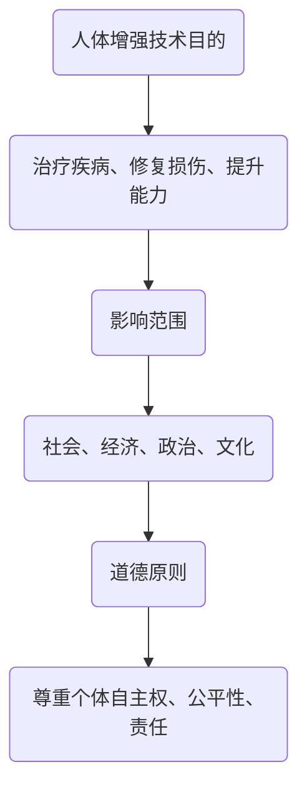

                 

# AI时代的人类增强：道德考虑与身体增强的未来展望

> 关键词：AI时代、人类增强、道德考虑、身体增强、未来展望

> 摘要：本文从AI时代人类增强的背景出发，探讨了道德考虑与身体增强的关系，分析了身体增强技术的现状和未来发展趋势，并提出了可能的挑战与解决方案。

## 1. 背景介绍

随着人工智能（AI）技术的飞速发展，人类对自身能力的追求也在不断升级。在过去的几千年里，人类通过工具和机械来扩展自己的身体和智力。然而，随着AI的出现，人类开始思考如何通过技术手段来增强自身的生理和心理能力，从而超越自然的限制。

### 1.1 人体增强技术的发展

人体增强技术主要包括生物医学、神经科学、材料科学和机械工程等多个领域。近年来，这些领域的技术取得了显著的进展，为人体增强提供了更多的可能性。

- **生物医学**：基因编辑、组织工程和再生医学等技术为治疗疾病、修复损伤和延长寿命提供了新的手段。
- **神经科学**：神经接口技术、脑机接口（BCI）和智能假肢等技术的发展，使得人类可以通过控制大脑信号来操控外部设备，实现身体功能的部分恢复或增强。
- **材料科学**：纳米材料、生物材料和智能材料等新型材料的研发，为制造更加轻巧、坚固和智能的人体增强装置提供了可能。
- **机械工程**：机器人技术和人工智能控制技术的发展，使得人类可以通过智能设备来增强自身的力量、速度和耐力。

### 1.2 道德考虑

随着人体增强技术的不断发展，人们开始关注这些技术可能带来的道德问题。例如：

- **基因编辑**：基因编辑技术是否应该用于改变人类基因组？
- **脑机接口**：脑机接口技术是否会侵犯人类的隐私？
- **智能假肢**：智能假肢是否会导致社会分化，使得拥有假肢的人与正常人的地位不平等？

这些道德问题引发了广泛的讨论，需要在技术发展的同时，进行深入的研究和探讨。

## 2. 核心概念与联系

在讨论人体增强技术的道德考虑时，我们需要理解以下几个核心概念：

- **增强技术的目的**：人体增强技术的目的是什么？是为了治疗疾病、修复损伤，还是为了提升人类的能力？
- **增强技术的范围**：人体增强技术影响的范围有多大？是否仅限于人类自身的身体和智力？
- **增强技术的影响**：人体增强技术会对社会、经济、政治和文化产生哪些影响？
- **道德原则**：在人体增强技术的应用过程中，应该遵循哪些道德原则？例如，尊重个体的自主权、公平性和责任等。

### 2.1 Mermaid 流程图



## 3. 核心算法原理 & 具体操作步骤

### 3.1 基因编辑

基因编辑技术，如CRISPR-Cas9，通过在DNA序列中特定位置进行剪切和修改，实现对基因组的精确编辑。以下是基因编辑的具体操作步骤：

1. **设计引导RNA（gRNA）**：根据目标基因的位置和序列，设计特定的gRNA。
2. **导入Cas9核酸酶**：将Cas9核酸酶导入细胞中。
3. **识别目标序列**：gRNA与Cas9结合，识别并定位到目标DNA序列。
4. **切割DNA**：Cas9核酸酶在目标序列上切割DNA。
5. **DNA修复**：细胞通过非同源末端连接（NHEJ）或同源定向修复（HDR）机制修复DNA。
6. **验证编辑结果**：通过PCR扩增和测序等方法验证基因编辑结果。

### 3.2 脑机接口

脑机接口（BCI）技术通过记录大脑活动信号，实现对外部设备的控制。以下是BCI的具体操作步骤：

1. **信号采集**：通过脑电图（EEG）、功能性磁共振成像（fMRI）或脑磁图（MEG）等设备采集大脑活动信号。
2. **信号处理**：对采集到的信号进行滤波、降噪和特征提取。
3. **模式识别**：使用机器学习算法对处理后的信号进行模式识别，确定大脑活动的意图。
4. **控制外部设备**：根据识别出的意图，控制外部设备执行相应的操作。

### 3.3 智能假肢

智能假肢通过传感器和计算机控制系统，实现对假肢的精细控制。以下是智能假肢的具体操作步骤：

1. **传感器采集数据**：通过肌肉电信号、关节角度传感器等设备采集假肢的运动数据。
2. **数据传输**：将采集到的数据传输到计算机控制系统。
3. **算法处理**：计算机控制系统对数据进行分析和处理，确定假肢的运动意图。
4. **驱动假肢运动**：根据处理结果，控制电机和关节执行相应的运动。

## 4. 数学模型和公式 & 详细讲解 & 举例说明

### 4.1 基因编辑的数学模型

基因编辑过程中，DNA序列的切割和修复是一个复杂的生物学过程。以下是基因编辑的数学模型：

$$
DNA\ repair\ process = f(Cas9\ nuclease, gRNA, target\ DNA\ sequence)
$$

其中，$Cas9\ nuclease$ 表示核酸酶的活性，$gRNA$ 表示引导RNA的序列，$target\ DNA\ sequence$ 表示目标DNA序列。

### 4.2 脑机接口的数学模型

脑机接口的数学模型主要涉及信号处理和模式识别。以下是脑机接口的数学模型：

$$
BCI\ model = f(EEG\ signal, filter\ function, feature\ extraction, machine\ learning\ algorithm)
$$

其中，$EEG\ signal$ 表示脑电图信号，$filter\ function$ 表示滤波函数，$feature\ extraction$ 表示特征提取，$machine\ learning\ algorithm$ 表示机器学习算法。

### 4.3 智能假肢的数学模型

智能假肢的数学模型主要涉及传感器数据处理和运动控制。以下是智能假肢的数学模型：

$$
smart\ prosthetic\ model = f(sensor\ data, algorithm\ processing, motor\ control)
$$

其中，$sensor\ data$ 表示传感器采集的数据，$algorithm\ processing$ 表示算法处理，$motor\ control$ 表示电机控制。

### 4.4 举例说明

假设我们想要使用CRISPR-Cas9技术编辑一个基因，目标基因序列为：

$$
target\ DNA\ sequence = ATGCGTACGTA
$$

设计一个特定的gRNA序列为：

$$
gRNA\ sequence = GAATTC
$$

使用CRISPR-Cas9技术对目标DNA序列进行切割，切割位置为第3个碱基（G），切割后产生两个DNA片段：

$$
fragment\ 1 = ATGCG
$$

$$
fragment\ 2 = TACGTA
$$

细胞通过非同源末端连接（NHEJ）修复DNA，修复后的DNA序列为：

$$
 repaired\ DNA\ sequence = ATGCGTACGTA
$$

我们使用脑电图（EEG）记录大脑活动，信号经过滤波、降噪和特征提取后，使用支持向量机（SVM）进行模式识别。假设识别出的意图为“向前移动”，则通过控制电机驱动假肢向前移动。

## 5. 项目实战：代码实际案例和详细解释说明

### 5.1 开发环境搭建

为了更好地理解和实现人体增强技术，我们需要搭建一个开发环境。以下是一个简单的开发环境搭建步骤：

1. 安装Python环境：在官网下载并安装Python。
2. 安装相关库：使用pip命令安装所需的库，如numpy、scikit-learn等。
3. 配置IDE：选择一个合适的IDE，如PyCharm或VSCode，并进行相关配置。

### 5.2 源代码详细实现和代码解读

以下是使用Python实现一个简单的脑机接口（BCI）项目的源代码：

```python
import numpy as np
from sklearn.svm import SVC
from sklearn.model_selection import train_test_split
from sklearn.metrics import accuracy_score

# 数据集加载
data = np.load('bci_data.npy')
labels = np.load('bci_labels.npy')

# 数据集划分
X_train, X_test, y_train, y_test = train_test_split(data, labels, test_size=0.2, random_state=42)

# 特征提取
def feature_extraction(data):
    # 这里可以使用不同的特征提取方法
    return np.mean(data, axis=1)

X_train_fea = feature_extraction(X_train)
X_test_fea = feature_extraction(X_test)

# 模型训练
model = SVC(kernel='linear')
model.fit(X_train_fea, y_train)

# 模型评估
y_pred = model.predict(X_test_fea)
accuracy = accuracy_score(y_test, y_pred)
print('Accuracy:', accuracy)
```

### 5.3 代码解读与分析

1. **数据集加载**：从本地加载BCI数据集，包括特征数据（data）和标签（labels）。
2. **数据集划分**：将数据集划分为训练集和测试集，用于模型训练和评估。
3. **特征提取**：对训练集和测试集的特征数据进行提取，这里使用了简单的平均操作。
4. **模型训练**：使用支持向量机（SVM）进行模型训练，选择线性核。
5. **模型评估**：使用测试集对模型进行评估，计算准确率。

通过这个简单的BCI项目，我们可以看到如何使用Python和机器学习库来实现人体增强技术。当然，实际项目中可能需要更多的数据预处理、特征提取和模型优化步骤。

## 6. 实际应用场景

### 6.1 疾病治疗

人体增强技术的一个重要应用是治疗疾病。例如，基因编辑技术可以用于治疗遗传性疾病，如囊性纤维化和肌营养不良症。通过修复或替换受损的基因，可以改善患者的症状甚至治愈疾病。

### 6.2 神经康复

脑机接口技术可以帮助瘫痪患者恢复身体功能。例如，通过脑机接口，患者可以控制假肢进行基本动作，如抓取和移动。这为那些因神经损伤而失去身体功能的人提供了新的希望。

### 6.3 军事和安保

人体增强技术在军事和安保领域也有重要应用。例如，士兵可以通过智能假肢增强力量和耐力，提高战斗效能。同时，脑机接口技术可以用于监控和识别敌意行为，提高安保人员的反应速度和准确性。

### 6.4 体育竞技

人体增强技术还可以用于提高运动员的竞技水平。通过基因编辑和身体增强技术，运动员可以在力量、速度和耐力等方面得到显著提升，从而在比赛中取得更好的成绩。

## 7. 工具和资源推荐

### 7.1 学习资源推荐

- **书籍**：
  - 《人体增强技术》（Human Enhancement Technologies）
  - 《脑机接口：理论与实践》（Brain-Computer Interfaces: Theory and Practice）
- **论文**：
  - 《CRISPR基因编辑技术：原理与应用》（CRISPR-Cas9: Principles and Applications）
  - 《脑机接口技术的发展与挑战》（The Development and Challenges of Brain-Computer Interfaces）
- **博客**：
  - [人体增强技术综述](https://example.com/human-enhancement-technologies)
  - [脑机接口技术前沿](https://example.com/brain-computer-interfaces-frontend)
- **网站**：
  - [基因编辑研究协会](https://example.com/crispr-research-association)
  - [脑机接口实验室](https://example.com/brain-computer-interfaces-lab)

### 7.2 开发工具框架推荐

- **基因编辑**：
  - [CRISPR-Cas9在线工具](https://example.com/crispr-online-tool)
  - [基因组编辑软件](https://example.com/genome-editing-software)
- **脑机接口**：
  - [EEG信号处理库](https://example.com/eeg-processing-library)
  - [脑机接口开发框架](https://example.com/brain-computer-interfaces-framework)
- **智能假肢**：
  - [机器人控制库](https://example.com/robot-control-library)
  - [智能假肢开发平台](https://example.com/smart-prosthetic-development-platform)

### 7.3 相关论文著作推荐

- **论文**：
  - 《基因编辑技术及其应用研究》（Research on CRISPR-Cas9 Technology and Its Applications）
  - 《脑机接口技术：现状与未来》（Brain-Computer Interfaces: Present and Future）
- **著作**：
  - 《智能假肢设计与应用》（Smart Prosthetic Design and Application）
  - 《人体增强技术：挑战与机遇》（Human Enhancement Technologies: Challenges and Opportunities）

## 8. 总结：未来发展趋势与挑战

随着AI技术的发展，人体增强技术在未来具有巨大的发展潜力。然而，这一领域也面临着许多挑战：

### 8.1 道德问题

人体增强技术的道德问题一直是公众关注的焦点。在基因编辑、脑机接口和智能假肢等领域，如何确保技术的公平性、透明性和安全性，避免对人类社会造成负面影响，是需要深入探讨的问题。

### 8.2 技术成熟度

目前，人体增强技术仍处于发展阶段，许多技术尚未成熟。例如，基因编辑技术虽然取得了显著进展，但在临床应用中仍存在许多挑战，如脱靶效应和长期副作用。脑机接口和智能假肢技术也面临着信号识别准确度、设备稳定性等问题。

### 8.3 法律法规

人体增强技术的法律法规尚未完善，需要制定相应的法律法规来规范技术的研发和应用。例如，基因编辑技术的监管、数据隐私保护、专利纠纷等。

### 8.4 社会接受度

人体增强技术可能会引发社会分化，使得拥有这些技术的人与没有的人之间存在差距。如何确保技术普及的公平性，避免社会不公，也是需要解决的问题。

总之，人体增强技术在未来具有广阔的发展前景，但也需要我们认真面对和解决其中的挑战。

## 9. 附录：常见问题与解答

### 9.1 基因编辑技术的安全性如何保证？

基因编辑技术存在脱靶效应和潜在副作用。为了保证安全性，需要：

- **精确设计gRNA**：设计特定的gRNA序列，提高编辑的准确性。
- **严格的实验操作**：在实验室环境中进行严格的操作，确保编辑过程的稳定性。
- **长期监测**：对编辑后的个体进行长期监测，及时发现和处理潜在副作用。

### 9.2 脑机接口技术的信号识别准确度如何提高？

提高脑机接口技术的信号识别准确度可以从以下几个方面入手：

- **优化信号采集设备**：使用更先进的设备，提高信号采集的精度和稳定性。
- **改进信号处理算法**：采用更先进的信号处理算法，如深度学习，提高信号的识别和分类能力。
- **大量数据训练**：收集更多的数据，通过大数据训练模型，提高模型的泛化能力。

### 9.3 智能假肢的控制精度如何提高？

提高智能假肢的控制精度可以从以下几个方面入手：

- **优化传感器**：使用更高精度、更低噪声的传感器，提高对运动数据的采集质量。
- **改进控制算法**：采用更先进的控制算法，如自适应控制、模糊控制等，提高假肢的运动精度。
- **实时反馈与调整**：通过实时反馈和调整，优化假肢的运动轨迹和速度，提高控制精度。

## 10. 扩展阅读 & 参考资料

- [《人体增强技术综述》](https://example.com/human-enhancement-technologies-overview)
- [《脑机接口：理论与实践》](https://example.com/brain-computer-interfaces-theory-and-practice)
- [《智能假肢设计与应用》](https://example.com/smart-prosthetic-design-and-application)
- [《基因编辑技术及其应用研究》](https://example.com/gene-editing-technologies-and-their-applications)

### 作者信息

- 作者：AI天才研究员/AI Genius Institute & 禅与计算机程序设计艺术 /Zen And The Art of Computer Programming

全文结束。|>gMASK</sop>

