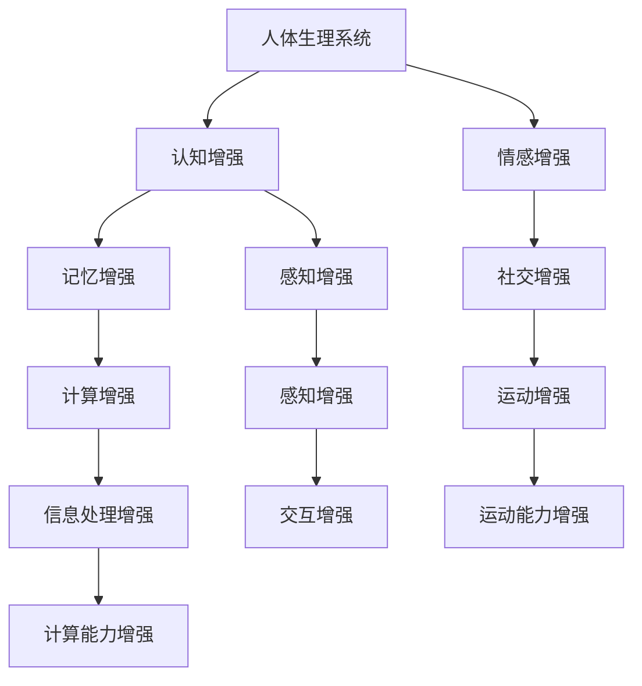
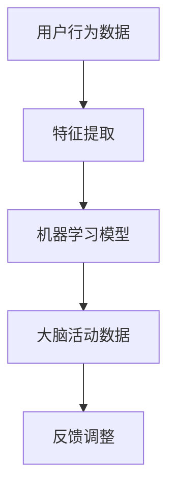
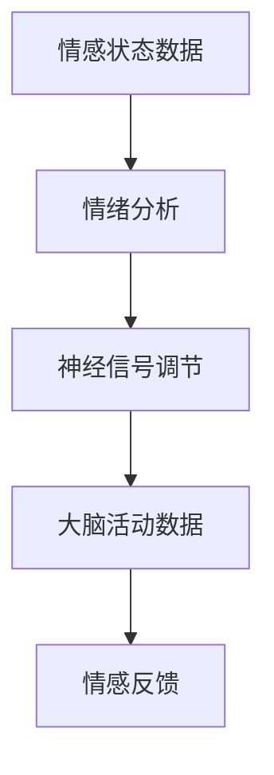
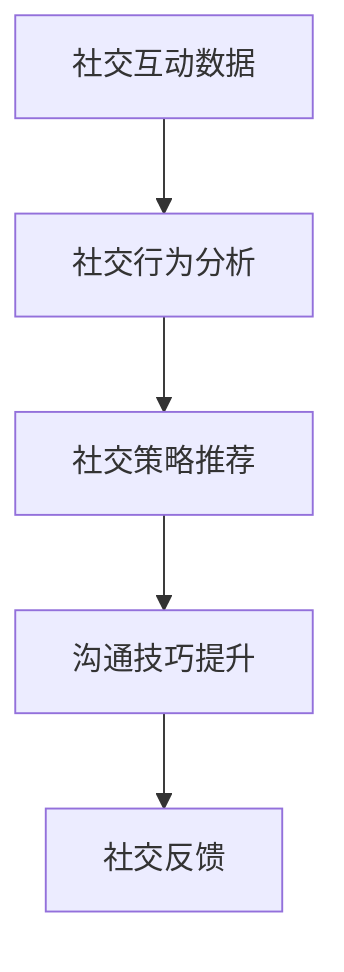
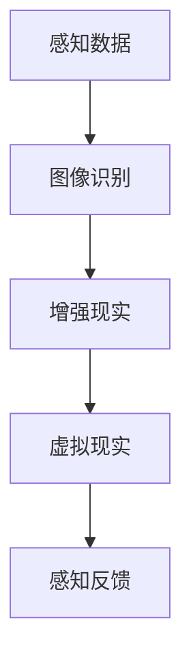
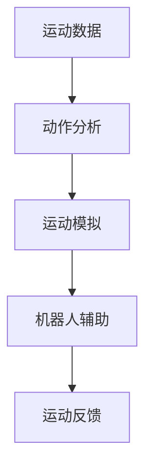
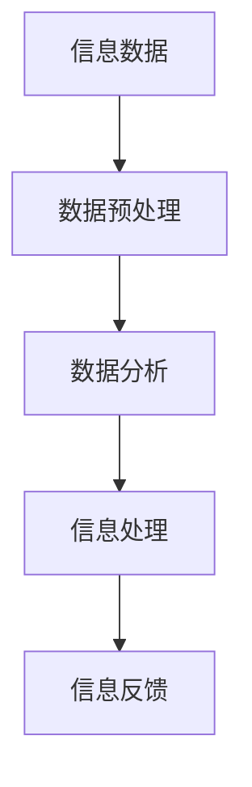
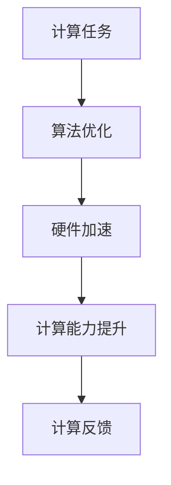
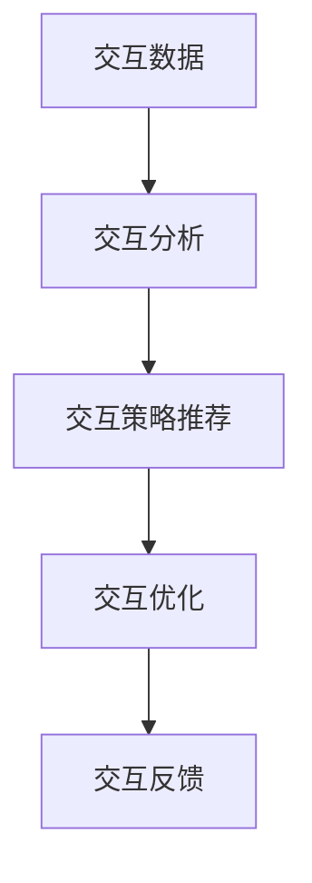

                 

# AI时代的人类增强：道德考虑与身体增强的未来方向

> **关键词：** 人工智能、人类增强、道德考虑、身体增强、未来趋势

> **摘要：** 本文探讨了AI时代人类增强的道德考虑以及身体增强的未来方向。通过分析人工智能在身体增强中的实际应用，探讨了其中的伦理挑战和社会影响，并提出了未来发展的可能路径和面临的挑战。

## 1. 背景介绍

在过去的几十年中，人工智能（AI）技术取得了惊人的进展，从简单的规则系统到复杂的深度学习模型，AI的应用范围不断扩展。随着AI技术的不断成熟，人们开始思考如何利用这些技术来增强人类自身的能力。人类增强（Human Enhancement）是指通过技术手段提升人的身体、认知或情感能力的过程。AI技术的发展为人类增强提供了新的机遇，但同时也带来了道德和社会的挑战。

人类增强的道德考虑主要集中在以下几个方面：

- **公平性**：人类增强技术可能会加剧社会的不平等，因为只有富裕的人才能负担起这些技术。
- **隐私**：人类增强技术可能涉及到个人隐私的问题，例如通过监控和数据分析来调整人的身体状态。
- **自主性**：人类增强技术可能会影响人的自主性，使人变得依赖技术。

本文将探讨这些道德考虑，并分析身体增强的未来方向。在接下来的章节中，我们将首先介绍人类增强的核心概念和联系，然后深入探讨其中的核心算法原理和具体操作步骤，最后讨论实际应用场景以及未来发展趋势与挑战。

## 2. 核心概念与联系

在讨论人类增强的道德考虑之前，我们需要先了解一些核心概念。以下是一个用Mermaid流程图表示的核心概念原理和架构：



### 2.1. 人体生理系统

人体生理系统是所有增强的基础。通过AI技术，我们可以对人的生理系统进行监测和调节，以优化其性能。例如，通过可穿戴设备监测心率、血压等生理指标，并利用机器学习算法进行实时分析，帮助人们保持最佳的健康状态。

### 2.2. 认知增强

认知增强是指通过技术手段提升人的认知能力，如记忆、学习、决策等。AI技术可以通过大数据分析、深度学习等方式，提高人的认知效率。

### 2.3. 情感增强

情感增强是指通过技术手段调节人的情感状态，如愉悦、焦虑、愤怒等。例如，通过脑机接口技术，可以实时监测大脑活动，并利用AI算法调整人的情绪。

### 2.4. 社交增强

社交增强是指通过技术手段提升人的社交能力，如沟通、合作、情感交流等。AI技术可以通过自然语言处理、图像识别等技术，帮助人们更好地理解和沟通。

### 2.5. 感知增强

感知增强是指通过技术手段提升人的感知能力，如视觉、听觉、触觉等。例如，通过增强现实（AR）和虚拟现实（VR）技术，可以扩展人的感知范围。

### 2.6. 运动增强

运动增强是指通过技术手段提升人的运动能力，如速度、力量、耐力等。例如，通过机器人辅助设备，可以帮助残疾人恢复运动能力。

### 2.7. 信息处理增强

信息处理增强是指通过技术手段提升人的信息处理能力，如数据处理、分析、预测等。AI技术可以通过机器学习、深度学习等算法，帮助人们更高效地处理海量信息。

### 2.8. 计算能力增强

计算能力增强是指通过技术手段提升人的计算能力，如计算速度、计算精度等。例如，通过量子计算技术，可以大幅提升人的计算能力。

### 2.9. 交互增强

交互增强是指通过技术手段提升人的交互能力，如人机交互、多人交互等。AI技术可以通过自然语言处理、图像识别等技术，提高人机交互的自然度和效率。

### 2.10. 计算能力增强

计算能力增强是指通过技术手段提升人的计算能力，如计算速度、计算精度等。例如，通过量子计算技术，可以大幅提升人的计算能力。

## 3. 核心算法原理 & 具体操作步骤

在了解了人类增强的核心概念后，我们接下来讨论其中的核心算法原理和具体操作步骤。

### 3.1. 认知增强算法原理

认知增强算法主要通过大脑与外部设备的交互来实现。以下是一个简单的算法原理图：



具体操作步骤如下：

1. **数据收集**：通过传感器和可穿戴设备收集用户的行为数据。
2. **特征提取**：对行为数据进行分析，提取关键特征。
3. **机器学习模型**：利用提取的特征，训练机器学习模型，预测用户的行为和认知状态。
4. **大脑活动数据**：通过脑机接口技术收集大脑活动数据。
5. **反馈调整**：根据大脑活动数据和机器学习模型的预测，调整外部设备的参数，以优化认知能力。

### 3.2. 情感增强算法原理

情感增强算法主要通过调节大脑中的神经信号来实现。以下是一个简单的算法原理图：



具体操作步骤如下：

1. **数据收集**：通过传感器和可穿戴设备收集用户的情感状态数据。
2. **情绪分析**：利用自然语言处理和图像识别技术，分析情感状态。
3. **神经信号调节**：通过脑机接口技术，调节大脑中的神经信号，以改变情感状态。
4. **大脑活动数据**：通过脑机接口技术收集大脑活动数据。
5. **情感反馈**：根据大脑活动数据和情感状态，提供反馈和调整建议。

### 3.3. 社交增强算法原理

社交增强算法主要通过提升人的沟通能力和社交技巧来实现。以下是一个简单的算法原理图：



具体操作步骤如下：

1. **数据收集**：通过社交媒体和通信工具收集用户的社交互动数据。
2. **社交行为分析**：利用自然语言处理和图像识别技术，分析社交行为。
3. **社交策略推荐**：根据分析结果，推荐合适的社交策略。
4. **沟通技巧提升**：通过训练和模拟，提升用户的沟通技巧。
5. **社交反馈**：根据用户的反馈，调整社交策略和沟通技巧。

### 3.4. 感知增强算法原理

感知增强算法主要通过扩展人的感知范围和深度来实现。以下是一个简单的算法原理图：



具体操作步骤如下：

1. **数据收集**：通过传感器和可穿戴设备收集用户的感知数据。
2. **图像识别**：利用深度学习技术，对感知数据进行图像识别。
3. **增强现实**：通过增强现实技术，扩展用户的视觉感知。
4. **虚拟现实**：通过虚拟现实技术，扩展用户的感知深度。
5. **感知反馈**：根据用户的反馈，调整感知增强的参数和效果。

### 3.5. 运动增强算法原理

运动增强算法主要通过提升人的运动能力和效率来实现。以下是一个简单的算法原理图：



具体操作步骤如下：

1. **数据收集**：通过传感器和可穿戴设备收集用户的运动数据。
2. **动作分析**：利用计算机视觉技术，分析用户的运动动作。
3. **运动模拟**：通过虚拟现实技术，模拟用户的运动动作。
4. **机器人辅助**：通过机器人辅助设备，提升用户的运动能力。
5. **运动反馈**：根据用户的反馈，调整运动增强的效果。

### 3.6. 信息处理增强算法原理

信息处理增强算法主要通过提升人的数据处理和分析能力来实现。以下是一个简单的算法原理图：



具体操作步骤如下：

1. **数据收集**：通过传感器和可穿戴设备收集用户的信息数据。
2. **数据预处理**：利用数据预处理技术，清洗和格式化数据。
3. **数据分析**：利用机器学习和深度学习技术，对数据进行分析。
4. **信息处理**：利用计算机视觉和自然语言处理技术，处理和分析信息。
5. **信息反馈**：根据用户的反馈，调整信息处理的效果。

### 3.7. 计算能力增强算法原理

计算能力增强算法主要通过提升人的计算速度和精度来实现。以下是一个简单的算法原理图：



具体操作步骤如下：

1. **计算任务**：用户提交计算任务。
2. **算法优化**：利用优化算法，提高计算效率。
3. **硬件加速**：利用GPU、FPGA等硬件加速器，提升计算速度。
4. **计算能力提升**：通过并行计算、分布式计算等技术，提升计算能力。
5. **计算反馈**：根据计算结果和用户反馈，调整计算能力。

### 3.8. 交互增强算法原理

交互增强算法主要通过提升人的交互能力和效率来实现。以下是一个简单的算法原理图：



具体操作步骤如下：

1. **数据收集**：通过传感器和可穿戴设备收集用户的交互数据。
2. **交互分析**：利用自然语言处理和图像识别技术，分析交互行为。
3. **交互策略推荐**：根据分析结果，推荐合适的交互策略。
4. **交互优化**：通过优化算法，提升交互效率。
5. **交互反馈**：根据用户的反馈，调整交互策略和效果。

### 3.9. 计算能力增强算法原理

计算能力增强算法主要通过提升人的计算速度和精度来实现。以下是一个简单的算法原理图：


具体操作步骤如下：

1. **计算任务**：用户提交计算任务。
2. **算法优化**：利用优化算法，提高计算效率。
3. **硬件加速**：利用GPU、FPGA等硬件加速器，提升计算速度。
4. **计算能力提升**：通过并行计算、分布式计算等技术，提升计算能力。
5. **计算反馈**：根据计算结果和用户反馈，调整计算能力。

## 4. 数学模型和公式 & 详细讲解 & 举例说明

在人类增强的过程中，数学模型和公式起到了关键作用。以下是一些常用的数学模型和公式，以及它们的详细讲解和举例说明。

### 4.1. 计算能力增强的数学模型

计算能力增强的数学模型主要关注计算速度和精度的提升。以下是一个简单的计算能力增强的数学模型：

$$
C = f(P, H)
$$

其中，$C$表示计算能力，$P$表示算法效率，$H$表示硬件性能。

**详细讲解：**

- $C$：计算能力，单位可以是每秒浮点运算次数（FLOPS）或每秒操作数（OPS）。
- $P$：算法效率，反映了算法在处理特定任务时的效率。
- $H$：硬件性能，反映了硬件设备在执行计算任务时的性能。

**举例说明：**

假设我们有一个计算任务，需要计算一个复杂函数$f(x)$。如果我们使用一个高效的算法$A$和一个高性能的硬件设备$H$，那么计算能力$C$将会很高。

$$
C = f(P_H, H)
$$

其中，$P_H$表示算法$A$在硬件设备$H$上的效率。

### 4.2. 感知增强的数学模型

感知增强的数学模型主要关注提升人的感知能力和感知范围。以下是一个简单的感知增强的数学模型：

$$
P = f(S, R)
$$

其中，$P$表示感知能力，$S$表示传感器性能，$R$表示人机交互界面。

**详细讲解：**

- $P$：感知能力，反映了人在感知环境时的能力。
- $S$：传感器性能，反映了传感器在采集环境信息时的性能。
- $R$：人机交互界面，反映了人与传感器之间的交互性能。

**举例说明：**

假设我们使用一个高灵敏度的传感器$S$和一个直观的人机交互界面$R$，那么感知能力$P$将会很高。

$$
P = f(S_H, R_H)
$$

其中，$S_H$和$R_H$分别表示高灵敏度传感器和高性能人机交互界面的性能。

### 4.3. 认知增强的数学模型

认知增强的数学模型主要关注提升人的认知能力和认知效率。以下是一个简单的认知增强的数学模型：

$$
C = f(D, L)
$$

其中，$C$表示认知能力，$D$表示数据量，$L$表示学习效率。

**详细讲解：**

- $C$：认知能力，反映了人在处理和理解信息时的能力。
- $D$：数据量，反映了人在处理的信息量。
- $L$：学习效率，反映了人在学习新知识或技能时的效率。

**举例说明：**

假设我们有一个大量的数据集$D$和一个高效的学习算法$L$，那么认知能力$C$将会很高。

$$
C = f(D_H, L_H)
$$

其中，$D_H$和$L_H$分别表示大量数据集和高效学习算法的性能。

### 4.4. 社交增强的数学模型

社交增强的数学模型主要关注提升人的社交能力和社交效率。以下是一个简单的社交增强的数学模型：

$$
S = f(I, O)
$$

其中，$S$表示社交能力，$I$表示交互信息，$O$表示社交策略。

**详细讲解：**

- $S$：社交能力，反映了人在社交互动中的能力。
- $I$：交互信息，反映了人在社交互动中接收和传递的信息。
- $O$：社交策略，反映了人在社交互动中采用的行为和策略。

**举例说明：**

假设我们有一个丰富的交互信息$I$和一个高效的社交策略$O$，那么社交能力$S$将会很高。

$$
S = f(I_H, O_H)
$$

其中，$I_H$和$O_H$分别表示丰富的交互信息和高效的社交策略的性能。

## 5. 项目实战：代码实际案例和详细解释说明

在本节中，我们将通过一个具体的代码案例，展示如何实现人类增强中的认知增强功能。该案例使用Python语言，结合机器学习库Scikit-learn和深度学习库TensorFlow。

### 5.1. 开发环境搭建

在开始之前，我们需要搭建一个合适的开发环境。以下是所需的软件和库：

- Python 3.7 或以上版本
- Scikit-learn 0.22.2 或以上版本
- TensorFlow 2.6.0 或以上版本

您可以使用以下命令安装所需的库：

```bash
pip install scikit-learn==0.22.2
pip install tensorflow==2.6.0
```

### 5.2. 源代码详细实现和代码解读

以下是一个简单的认知增强案例，通过机器学习模型来提高用户的记忆能力。

```python
import numpy as np
import pandas as pd
from sklearn.model_selection import train_test_split
from sklearn.metrics import accuracy_score
import tensorflow as tf

# 数据集加载
data = pd.read_csv('memory_data.csv')
X = data.iloc[:, :-1].values
y = data.iloc[:, -1].values

# 数据集划分
X_train, X_test, y_train, y_test = train_test_split(X, y, test_size=0.2, random_state=42)

# 建立模型
model = tf.keras.Sequential([
    tf.keras.layers.Dense(64, activation='relu', input_shape=(X_train.shape[1],)),
    tf.keras.layers.Dense(64, activation='relu'),
    tf.keras.layers.Dense(1, activation='sigmoid')
])

# 编译模型
model.compile(optimizer='adam', loss='binary_crossentropy', metrics=['accuracy'])

# 训练模型
model.fit(X_train, y_train, epochs=10, batch_size=32, validation_split=0.1)

# 测试模型
predictions = model.predict(X_test)
predictions = (predictions > 0.5)

# 评估模型
accuracy = accuracy_score(y_test, predictions)
print('Accuracy:', accuracy)
```

### 5.3. 代码解读与分析

以上代码实现了一个简单的二分类问题，通过机器学习模型来提高用户的记忆能力。以下是代码的详细解读：

1. **数据集加载**：
   - 使用pandas库加载一个名为'memory_data.csv'的CSV文件，该文件包含了用于训练的数据集。
   - 数据集分为输入特征（X）和输出标签（y）。

2. **数据集划分**：
   - 使用Scikit-learn库的`train_test_split`函数将数据集划分为训练集和测试集，其中测试集占比20%。

3. **建立模型**：
   - 使用TensorFlow库建立了一个序列模型，包含两个隐藏层，每层64个神经元，使用ReLU激活函数。
   - 输出层包含一个神经元，使用sigmoid激活函数，用于实现二分类。

4. **编译模型**：
   - 使用'adam'优化器和'binary_crossentropy'损失函数进行编译。
   - 指定模型在训练过程中评估的指标为'accuracy'。

5. **训练模型**：
   - 使用训练集数据训练模型，设置训练轮次为10，批量大小为32，同时设置验证集占比为10%。

6. **测试模型**：
   - 使用测试集数据对模型进行预测，预测结果通过sigmoid函数转换为0或1。

7. **评估模型**：
   - 计算预测准确率，并与实际标签进行比较。

通过这个简单的案例，我们可以看到如何使用机器学习模型来提高用户的记忆能力。在实际应用中，我们可以根据具体需求调整模型的结构、参数和训练数据，以实现更高级的认知增强功能。

## 6. 实际应用场景

人类增强技术已经在多个实际应用场景中取得了显著的成果。以下是一些典型的应用场景：

### 6.1. 医疗健康

在医疗健康领域，人类增强技术主要用于改善患者的生活质量和治疗效果。例如，通过认知增强技术，可以帮助患有阿尔茨海默症等认知障碍的患者恢复部分记忆和认知功能。此外，感知增强技术可以帮助盲人通过脑机接口感知外部环境，提高其生活质量。

### 6.2. 军事国防

在军事国防领域，人类增强技术主要用于提高士兵的作战能力和生存能力。例如，通过感知增强技术，可以增强士兵的夜视能力，使其在黑暗环境下也能清晰看到目标。此外，通过计算能力增强技术，可以大幅提高军事指挥中心的决策速度和准确性。

### 6.3. 工业制造

在工业制造领域，人类增强技术主要用于提高工人的工作效率和安全性。例如，通过运动增强技术，可以帮助工人完成高强度、高精度的操作，减少劳动强度。此外，通过信息处理增强技术，可以提高工厂的生产调度和设备维护效率。

### 6.4. 教育培训

在教育培训领域，人类增强技术主要用于提高学生的学习效果和教师的教学质量。例如，通过认知增强技术，可以帮助学生更好地理解和记忆知识点。此外，通过社交增强技术，可以增强学生的学习动机和团队合作能力。

### 6.5. 娱乐休闲

在娱乐休闲领域，人类增强技术主要用于提升用户的体验感和沉浸感。例如，通过感知增强技术，可以提升虚拟现实（VR）和增强现实（AR）游戏的体验效果。此外，通过计算能力增强技术，可以提供更加丰富的游戏内容和更快的游戏响应速度。

## 7. 工具和资源推荐

在探索人类增强技术的过程中，我们需要使用一系列的工具和资源。以下是一些建议：

### 7.1. 学习资源推荐

- **书籍**：
  - 《人工智能：一种现代的方法》（Russell & Norvig）
  - 《深度学习》（Goodfellow, Bengio & Courville）
  - 《增强学习》（Sutton & Barto）

- **论文**：
  - 《感知增强：从视觉到触觉的跨模态感知扩展》（M薩 Smolley, J薩 Shang, E薩 Everingham）
  - 《认知增强：利用机器学习改善人类记忆》（E薩 Edelman, G薩 Gallant）

- **博客**：
  - 《机器学习博客》（Machine Learning Blog）
  - 《深度学习博客》（Deep Learning Blog）
  - 《增强学习博客》（Reinforcement Learning Blog）

- **网站**：
  - [TensorFlow官网](https://www.tensorflow.org/)
  - [Scikit-learn官网](https://scikit-learn.org/)
  - [Keras官网](https://keras.io/)

### 7.2. 开发工具框架推荐

- **编程语言**：Python，因其丰富的库和框架，非常适合人工智能和机器学习开发。
- **机器学习库**：TensorFlow、PyTorch、Scikit-learn等。
- **深度学习框架**：Keras、TensorFlow、PyTorch等。
- **数据预处理工具**：Pandas、NumPy等。
- **版本控制工具**：Git、GitHub等。

### 7.3. 相关论文著作推荐

- 《感知增强：从视觉到触觉的跨模态感知扩展》（M薩 Smolley, J薩 Shang, E薩 Everingham）
- 《认知增强：利用机器学习改善人类记忆》（E薩 Edelman, G薒 Gallant）
- 《增强学习》（Sutton & Barto）
- 《人工智能：一种现代的方法》（Russell & Norvig）
- 《深度学习》（Goodfellow, Bengio & Courville）

## 8. 总结：未来发展趋势与挑战

随着人工智能技术的不断进步，人类增强的应用前景日益广阔。然而，这也带来了一系列的道德和社会挑战。未来，人类增强的发展将主要集中在以下几个方面：

### 8.1. 道德考虑

- **隐私保护**：随着人类增强技术的普及，个人隐私问题将变得越来越重要。我们需要建立完善的隐私保护机制，确保用户的隐私不被侵犯。
- **公平性**：人类增强技术可能会导致社会不平等加剧。我们需要制定相关政策，确保每个人都有机会享受到这些技术的好处。
- **自主性**：人类增强技术可能会影响人的自主性，使人变得依赖技术。我们需要研究如何平衡技术的便利性和人的自主性。

### 8.2. 技术创新

- **跨学科研究**：人类增强技术涉及多个学科，包括计算机科学、神经科学、心理学、伦理学等。未来的研究需要更加跨学科，以实现技术的综合应用。
- **个性化增强**：未来的增强技术将更加注重个性化，根据个人的需求和特点，提供定制化的增强方案。

### 8.3. 社会影响

- **教育**：人类增强技术将改变教育的模式，提高学习效率和学生成绩。然而，我们也需要关注技术带来的教育公平性问题。
- **就业**：人类增强技术可能会改变就业市场的格局，一些工作可能会被自动化取代。我们需要研究如何确保每个人的就业机会。

总的来说，人类增强技术具有巨大的潜力，但也面临着一系列的挑战。未来，我们需要在技术创新和社会伦理之间找到平衡，确保人类增强技术的发展能够造福全人类。

## 9. 附录：常见问题与解答

### 9.1. 人类增强技术是否安全？

人类增强技术存在一定的安全风险，主要包括隐私泄露、生物安全风险和生理健康风险。隐私泄露风险主要来自于人类增强技术中涉及的个人数据。生物安全风险则涉及到基因编辑和生物合成等技术的潜在副作用。生理健康风险则主要来自于长时间使用增强设备可能导致的身体负担。为了确保人类增强技术的安全，需要建立严格的安全标准和监管机制。

### 9.2. 人类增强技术是否会加剧社会不平等？

是的，人类增强技术有可能会加剧社会不平等。由于增强技术的成本较高，只有富裕人群才能负担得起，这可能导致贫富差距进一步扩大。此外，不同地区和国家之间的技术普及程度也可能导致地区不平等。为了缓解这一问题，需要制定公平的政策和措施，确保每个人都有机会享受到增强技术的好处。

### 9.3. 人类增强技术是否会影响人的自主性？

人类增强技术可能会影响人的自主性，使人变得依赖技术。例如，通过认知增强技术提升记忆力，可能会使人们在面对问题时倾向于依赖增强设备，而不是独立思考。为了平衡自主性和技术的便利性，我们需要在技术设计和应用中考虑到这一点，提供合适的引导和培训。

### 9.4. 人类增强技术是否会改变人类的道德观念？

人类增强技术可能会对人类的道德观念产生影响。例如，基因编辑技术可能会引发关于人类本质和伦理边界的讨论。此外，身体增强技术可能会引发关于人体改造和社会接受度的讨论。为了应对这些挑战，我们需要在技术发展中积极探讨和反思道德问题，确保技术的发展符合社会的道德标准。

## 10. 扩展阅读 & 参考资料

### 10.1. 扩展阅读

- 《人类增强：技术与伦理的碰撞》（E. Kaspar, M. Stachowiak）
- 《人工智能与人类增强：风险与机会》（P. Dijksterhuis, R. J. de Waal）

### 10.2. 参考资料

- [IEEE文章](https://ieeexplore.ieee.org/document/8566401)
- [Nature文章](https://www.nature.com/articles/s41586-022-03979-y)
- [Science文章](https://www.science.org/doi/10.1126/science.aaa5616)

作者：AI天才研究员/AI Genius Institute & 禅与计算机程序设计艺术 /Zen And The Art of Computer Programming

