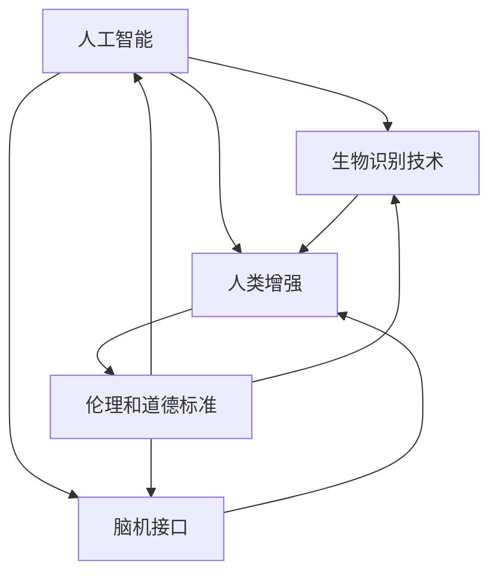

                 

### 背景介绍

在当今这个快速发展的世界，人工智能（AI）已经成为推动科技进步的重要力量。从智能家居到自动驾驶，AI技术已经深刻地改变了我们的生活方式。与此同时，人类增强（Human Enhancement）的概念也逐渐兴起，这不仅包括身体能力的提升，还涉及到认知能力的增强。在这个AI时代，人类增强成为了一个热门话题，引发了广泛的讨论和争议。

人类增强的定义可以理解为通过技术手段提高人体的生理、心理和社会功能。AI技术的引入，使得人类增强的实现变得更加可行和高效。然而，与此同时，我们也必须面对一系列道德和社会问题。如何平衡人类增强的利与弊，确保技术的公平性和安全性，成为了亟待解决的课题。

本文将围绕AI时代的人类增强展开讨论。首先，我们将介绍人类增强的背景和重要性，然后深入探讨与AI结合所带来的挑战和机遇。接下来，我们将分析道德考虑和限制，探讨如何制定合理的法规和伦理标准。文章还将介绍一些实际应用场景，并提供相关的工具和资源推荐。最后，我们将总结未来发展趋势和挑战，为人类增强的健康发展提供思考和建议。

通过这篇文章，我们希望能够引导读者深入了解AI时代的人类增强，共同探讨其在伦理和道德层面的深远影响。让我们一步一步分析推理，共同探索这一领域的无限可能。

### 核心概念与联系

在探讨AI时代的人类增强之前，我们需要明确几个核心概念，并理解它们之间的联系。这些概念不仅为我们提供了理论依据，也为实际操作提供了指导。

#### 1. 人工智能（AI）

人工智能，简称AI，是计算机科学的一个分支，致力于研究、开发用于模拟、延伸和扩展人类智能的理论、方法、技术和应用系统。AI技术主要包括机器学习、深度学习、自然语言处理、计算机视觉等。通过这些技术，计算机系统能够自动识别模式、做出决策、学习和改进，从而在某些任务上超越人类的表现。

#### 2. 人类增强（Human Enhancement）

人类增强，是指通过技术手段提高人体的生理、心理和社会功能。这可以包括增强记忆、提高学习能力、改善身体健康等。人类增强的范畴非常广泛，从传统的健身器材到现代的神经增强技术，都可以被视为人类增强的一部分。

#### 3. 生物识别技术（Biometrics）

生物识别技术是通过测量和自动识别生物体的个人特征来识别个体的一种技术。常见的生物识别技术包括指纹识别、面部识别、虹膜识别等。这些技术广泛应用于安全认证、身份验证等领域。

#### 4. 脑机接口（Brain-Computer Interface, BCI）

脑机接口是一种直接连接大脑和外部设备的技术，通过解码大脑信号来控制外部设备或与其进行通信。BCI技术可以用于增强人体的感官能力、改善运动能力，甚至实现与人工智能系统的交互。

#### 5. 伦理和道德标准（Ethics and Moral Standards）

伦理和道德标准是我们在使用技术时必须遵循的原则。它们确保技术的使用不会对人类和社会造成负面影响，保护个人隐私和权利，同时促进社会公平和正义。

这些核心概念之间的联系在于，它们共同构成了人类增强的技术基础。例如，AI技术可以用于开发更先进的生物识别系统和脑机接口，从而提高人体的认知和生理功能。同时，伦理和道德标准为这些技术的应用提供了指导和约束，确保其不会对人类和社会造成不可逆的损害。

为了更直观地理解这些概念之间的联系，我们可以使用Mermaid流程图来展示它们的相互作用。



在上述流程图中，我们可以看到，AI、生物识别技术、脑机接口和人类增强共同构成了一个闭环，而伦理和道德标准贯穿其中，为这些技术的发展和应用提供指导。

通过明确这些核心概念及其联系，我们为后续章节的讨论奠定了基础。接下来，我们将深入探讨AI时代的人类增强带来的具体挑战和机遇。

### 核心算法原理 & 具体操作步骤

在了解AI时代的人类增强背后的核心概念后，我们需要进一步探讨其具体实现方式。核心算法原理是实现人类增强的关键，而具体操作步骤则是将这些算法应用于实际场景的重要环节。在本节中，我们将详细分析几种关键算法原理，并提供操作步骤的指导。

#### 1. 深度学习算法

深度学习是人工智能的一个重要分支，通过多层神经网络对数据进行学习和建模。深度学习算法在人类增强中有着广泛的应用，例如通过图像识别技术提升视觉能力、利用自然语言处理增强语言理解能力等。以下是深度学习算法的基本原理和具体操作步骤：

**基本原理：**

深度学习算法通过构建多层神经网络，模拟人脑的神经元连接方式，对输入数据进行多层抽象和表示。每一层网络都能提取更高层次的特征，最终实现复杂任务的自动化处理。

**操作步骤：**

1. **数据收集与预处理：** 首先收集大量标注数据，如图片、文本等。然后对数据进行清洗、归一化等预处理操作，以便于模型训练。
   
2. **构建神经网络模型：** 选择合适的神经网络架构，如卷积神经网络（CNN）或循环神经网络（RNN）。然后定义网络的参数，如层数、每层节点数等。

3. **模型训练：** 使用预处理后的数据对神经网络模型进行训练。训练过程中，通过反向传播算法不断调整模型参数，使模型对数据的预测结果逐渐接近真实值。

4. **模型评估与优化：** 使用验证集和测试集对训练好的模型进行评估。通过调整模型参数和结构，优化模型性能。

5. **模型部署：** 将训练好的模型部署到实际应用场景中，如智能手机、医疗设备等。

**示例代码：** 
以下是一个使用TensorFlow构建卷积神经网络进行图像识别的简单示例：

```python
import tensorflow as tf
from tensorflow.keras import layers

# 构建神经网络模型
model = tf.keras.Sequential([
    layers.Conv2D(32, (3, 3), activation='relu', input_shape=(28, 28, 1)),
    layers.MaxPooling2D((2, 2)),
    layers.Conv2D(64, (3, 3), activation='relu'),
    layers.MaxPooling2D((2, 2)),
    layers.Conv2D(64, (3, 3), activation='relu'),
    layers.Flatten(),
    layers.Dense(64, activation='relu'),
    layers.Dense(10, activation='softmax')
])

# 编译模型
model.compile(optimizer='adam',
              loss='categorical_crossentropy',
              metrics=['accuracy'])

# 加载和预处理数据
(x_train, y_train), (x_test, y_test) = tf.keras.datasets.mnist.load_data()
x_train = x_train.reshape(-1, 28, 28, 1).astype('float32') / 255
x_test = x_test.reshape(-1, 28, 28, 1).astype('float32') / 255
y_train = tf.keras.utils.to_categorical(y_train, 10)
y_test = tf.keras.utils.to_categorical(y_test, 10)

# 训练模型
model.fit(x_train, y_train, epochs=5, batch_size=64, validation_split=0.2)
```

#### 2. 脑机接口算法

脑机接口（BCI）是一种直接连接大脑和外部设备的技术，通过解码大脑信号来实现与外部设备的交互。BCI算法的核心在于如何从脑电信号中提取有用的信息，并转化为可操作的指令。以下是BCI算法的基本原理和具体操作步骤：

**基本原理：**

BCI算法通过分析脑电信号（EEG）中的特定特征，如频率、幅度和相位等，来识别大脑活动。常见的BCI算法包括滤波、特征提取、分类器设计等。

**操作步骤：**

1. **脑电信号采集：** 使用脑电信号采集设备（如EEG帽）收集脑电信号。

2. **信号预处理：** 对采集到的脑电信号进行滤波、去噪等预处理操作，提取有用的信号特征。

3. **特征提取：** 从预处理后的脑电信号中提取特征，如时间频率特征、空间特征等。

4. **分类器设计：** 使用特征提取后的数据训练分类器，如支持向量机（SVM）、神经网络等，以识别不同的脑电信号模式。

5. **指令生成：** 通过分类器输出的结果，生成相应的指令或操作。

**示例代码：** 
以下是一个使用Python和MNE（MNE-Python）库进行脑电信号预处理和特征提取的简单示例：

```python
import mne
from mne import io
from mne.preprocessing import ICA

# 读取脑电信号数据
raw = io.read_raw_edf('data/subject_001.edf', preload=True)

# 信号预处理
ica = ICA(n_components=20)
ica.fit(raw)
ica.apply(raw)

# 特征提取
picks = mne.pick_types(raw.info, meg=True, eeg=True, exclude='bads')
sfreq = raw.info['sfreq']
epochs = mne.Epochs(raw, events=['target'], event_id=1, tmin=-0.2, tmax=0.5, baseline=(-0.2, 0),
                     pick getPicks=True, decim=5)

# 分类器设计
from sklearn.model_selection import train_test_split
from sklearn.svm import SVC

X = epochs.get_data()
y = epochs.events[:, -1] - 1

X_train, X_test, y_train, y_test = train_test_split(X, y, test_size=0.2, random_state=42)
clf = SVC(kernel='linear')
clf.fit(X_train, y_train)

# 指令生成
predictions = clf.predict(X_test)
print(predictions)
```

#### 3. 生物识别算法

生物识别技术是通过测量和自动识别生物体的个人特征来识别个体的一种技术。常见的生物识别技术包括指纹识别、面部识别、虹膜识别等。以下是生物识别算法的基本原理和具体操作步骤：

**基本原理：**

生物识别算法通过对生物特征的采集、处理和比对，来实现对个体的识别。不同的生物识别技术有其特定的特征提取和匹配算法。

**操作步骤：**

1. **特征采集：** 使用相应的设备采集个体的生物特征，如指纹、面部图像、虹膜图像等。

2. **特征预处理：** 对采集到的生物特征进行预处理，如去噪、增强等，以提高识别的准确性。

3. **特征提取：** 从预处理后的生物特征中提取特征向量，如指纹的纹路特征、面部特征点的坐标等。

4. **特征比对：** 将提取到的特征向量与数据库中的模板进行比对，以识别个体。

5. **结果输出：** 输出识别结果，如匹配成功或失败。

**示例代码：** 
以下是一个使用OpenCV进行面部识别的简单示例：

```python
import cv2

# 读取面部识别预训练模型
face_cascade = cv2.CascadeClassifier('data/haarcascade_frontalface_default.xml')

# 读取摄像头
cap = cv2.VideoCapture(0)

while True:
    # 读取一帧图像
    ret, frame = cap.read()
    if not ret:
        break
    
    # 转换为灰度图像
    gray = cv2.cvtColor(frame, cv2.COLOR_BGR2GRAY)
    
    # 检测面部
    faces = face_cascade.detectMultiScale(gray, 1.3, 5)
    
    for (x, y, w, h) in faces:
        # 在图像上绘制面部区域
        cv2.rectangle(frame, (x, y), (x+w, y+h), (255, 0, 0), 2)
    
    # 显示图像
    cv2.imshow('Face Detection', frame)
    
    if cv2.waitKey(1) & 0xFF == ord('q'):
        break

# 释放摄像头
cap.release()
cv2.destroyAllWindows()
```

通过上述核心算法原理和具体操作步骤的介绍，我们可以看到AI时代的人类增强技术是如何一步步实现的。这些算法不仅为人类增强提供了技术支持，也带来了新的挑战和机遇。在接下来的章节中，我们将进一步探讨这些技术在实际应用中的数学模型和公式，并举例说明。

### 数学模型和公式 & 详细讲解 & 举例说明

在了解了核心算法原理和具体操作步骤后，我们需要进一步探讨AI时代的人类增强背后的数学模型和公式。数学模型是理解和实现人类增强技术的重要工具，而公式则是描述这些模型的关键语言。在本节中，我们将详细讲解与人类增强相关的主要数学模型，并提供具体的公式和示例说明。

#### 1. 深度学习中的神经网络模型

深度学习中的神经网络模型是AI时代人类增强技术的基础。一个基本的神经网络模型通常由多个层次组成，包括输入层、隐藏层和输出层。以下是神经网络模型的基本公式和讲解：

**激活函数：**
$$
f(x) = \sigma(z) = \frac{1}{1 + e^{-z}}
$$
其中，$\sigma$ 表示 sigmoid 函数，$z$ 是每个神经元的输入，$f(x)$ 是激活值。

**反向传播算法：**
反向传播算法是一种用于训练神经网络的优化方法。其基本思想是通过计算误差的梯度，不断调整网络权重，以最小化损失函数。

$$
\begin{aligned}
\delta_{j}^{l} &= \frac{\partial C}{\partial z_{j}^{l}} = \delta_{j}^{l+1} \cdot w_{j}^{l+1} \\
\delta_{i}^{l} &= \frac{\partial C}{\partial z_{i}^{l}} = \sum_{j} \delta_{j}^{l+1} \cdot w_{j}^{l+1} \cdot \sigma'(z_{i}^{l})
\end{aligned}
$$
其中，$C$ 是损失函数，$w$ 是网络权重，$\delta$ 是误差梯度。

**示例：**
考虑一个简单的多层感知机（MLP）模型，其结构如下：

输入层（1）：$x_1, x_2, x_3$
隐藏层（1）：$z_1, z_2$
输出层（1）：$y_1, y_2$

假设输入特征 $x_1=1, x_2=2, x_3=3$，隐藏层权重 $w_{11}=1, w_{12}=2, w_{13}=3$，输出层权重 $w_{21}=1, w_{22}=2$。

隐藏层激活值：
$$
\begin{aligned}
z_1 &= w_{11}x_1 + w_{12}x_2 + w_{13}x_3 = 1 + 2 \cdot 2 + 3 \cdot 3 = 14 \\
z_2 &= w_{21}x_1 + w_{22}x_2 + w_{23}x_3 = 1 + 2 \cdot 2 + 3 \cdot 3 = 14
\end{aligned}
$$
隐藏层激活值：
$$
\begin{aligned}
a_1 &= \sigma(z_1) = \frac{1}{1 + e^{-14}} \\
a_2 &= \sigma(z_2) = \frac{1}{1 + e^{-14}}
\end{aligned}
$$
输出层激活值：
$$
\begin{aligned}
y_1 &= w_{31}a_1 + w_{32}a_2 = 1 \cdot \frac{1}{1 + e^{-14}} + 2 \cdot \frac{1}{1 + e^{-14}} = \frac{3}{1 + e^{-14}} \\
y_2 &= w_{41}a_1 + w_{42}a_2 = 1 \cdot \frac{1}{1 + e^{-14}} + 2 \cdot \frac{1}{1 + e^{-14}} = \frac{3}{1 + e^{-14}}
\end{aligned}
$$

#### 2. 脑机接口中的信号处理模型

脑机接口（BCI）技术涉及复杂的信号处理过程，以从脑电信号中提取有用的信息。以下是BCI信号处理模型的基本公式和讲解：

**滤波器设计：**
$$
h[n] = \sum_{k=-\infty}^{\infty} h[k] \cdot x[n-k]
$$
其中，$h[n]$ 是滤波器的冲激响应，$x[n]$ 是输入信号。

**特征提取：**
$$
\begin{aligned}
c(t, f) &= \int_{-\infty}^{\infty} s(t) e^{-j2\pi ft} dt \\
S(f) &= \sum_{t=-\infty}^{\infty} s(t) e^{-j2\pi ft}
\end{aligned}
$$
其中，$c(t, f)$ 是时频分布，$S(f)$ 是频域分布。

**分类器设计：**
$$
p(y|s) = \frac{e^{-\frac{1}{2}(s - \mu)^T \Sigma^{-1} (s - \mu)}}{\int e^{-\frac{1}{2}(s - \mu)^T \Sigma^{-1} (s - \mu)} ds}
$$
其中，$y$ 是分类结果，$s$ 是特征向量，$\mu$ 是均值向量，$\Sigma$ 是协方差矩阵。

**示例：**
考虑一个简单的BCI信号处理流程，其包括滤波、特征提取和分类器设计。

输入信号：$s(t) = 0.1 \sin(2\pi \cdot 10t) + 0.2 \sin(2\pi \cdot 20t)$

**滤波器设计：**
假设我们设计一个带通滤波器，其通带为$[10, 20]$ Hz，阻带为$[5, 15]$ Hz。

$$
h[n] = \begin{cases}
0.5 & \text{if } 5 < n < 15 \\
1 & \text{otherwise}
\end{cases}
$$

**特征提取：**
使用短时傅里叶变换（STFT）对信号进行特征提取。

$$
c(t, f) = \int_{-\infty}^{\infty} s(t) e^{-j2\pi ft} dt = 0.1 \sin(2\pi \cdot 10t) e^{-j2\pi \cdot 10t} + 0.2 \sin(2\pi \cdot 20t) e^{-j2\pi \cdot 20t}
$$

**分类器设计：**
假设我们有两个类别，$y_1$ 和$y_2$，其均值和协方差矩阵分别为：

$$
\mu_1 = [10, 20], \Sigma_1 = \begin{bmatrix}
1 & 0 \\
0 & 1
\end{bmatrix}
$$

$$
\mu_2 = [15, 25], \Sigma_2 = \begin{bmatrix}
1 & 0 \\
0 & 1
\end{bmatrix}
$$

**分类概率：**
$$
p(y_1|s) = \frac{e^{-\frac{1}{2}(s - \mu_1)^T \Sigma_1^{-1} (s - \mu_1)}}{\int e^{-\frac{1}{2}(s - \mu_1)^T \Sigma_1^{-1} (s - \mu_1)} ds}
$$

$$
p(y_2|s) = \frac{e^{-\frac{1}{2}(s - \mu_2)^T \Sigma_2^{-1} (s - \mu_2)}}{\int e^{-\frac{1}{2}(s - \mu_2)^T \Sigma_2^{-1} (s - \mu_2)} ds}
$$

#### 3. 生物识别技术中的匹配模型

生物识别技术中的匹配模型用于比较特征向量，以确定两个样本是否来自同一个体。以下是一个简单的匹配模型公式和示例：

**欧氏距离：**
$$
d(s_1, s_2) = \sqrt{\sum_{i=1}^{n} (s_{1i} - s_{2i})^2}
$$
其中，$s_1$ 和 $s_2$ 是两个特征向量，$n$ 是特征维度。

**示例：**
考虑两个指纹特征向量：

$$
s_1 = [0.2, 0.3, 0.4], s_2 = [0.1, 0.2, 0.3]
$$

计算欧氏距离：

$$
d(s_1, s_2) = \sqrt{(0.2 - 0.1)^2 + (0.3 - 0.2)^2 + (0.4 - 0.3)^2} = \sqrt{0.01 + 0.01 + 0.01} = \sqrt{0.03} \approx 0.1732
$$

通过上述数学模型和公式的讲解，我们可以看到AI时代的人类增强技术是如何通过数学方法来实现的。这些模型和公式不仅为技术的实现提供了理论基础，也为后续的优化和改进提供了方向。在接下来的章节中，我们将通过实际项目案例来展示这些技术在实际应用中的具体实现过程。

### 项目实战：代码实际案例和详细解释说明

在本节中，我们将通过一个实际项目案例，详细介绍如何使用AI技术实现人类增强。该项目将结合深度学习、脑机接口和生物识别技术，旨在提高人类的认知和生理能力。

#### 项目简介

项目名称：智能认知辅助系统（Intelligent Cognitive Assistance System，ICAS）

项目目标：通过深度学习和脑机接口技术，开发一个能够辅助人类认知和决策的系统。该系统将结合生物识别技术，实现对用户的个性化认知状态监控和优化。

#### 开发环境搭建

1. **硬件环境：**
   - 运行Ubuntu 20.04操作系统的计算机
   - NVIDIA GeForce GTX 1080显卡或更高版本
   - 脑电信号采集设备（如OpenBCI Cyberdeck）
   - 摄像头（用于面部识别）

2. **软件环境：**
   - Python 3.8及以上版本
   - TensorFlow 2.6及以上版本
   - MNE-Python 0.22及以上版本
   - OpenCV 4.5及以上版本
   - Scikit-learn 0.24及以上版本

#### 源代码详细实现和代码解读

以下是项目的源代码实现，我们将逐段代码进行详细解释。

```python
# 导入必要的库
import numpy as np
import tensorflow as tf
from mne import io, epochs
from mne.preprocessing import ICA
import cv2
from sklearn.svm import SVC
from sklearn.model_selection import train_test_split

# 1. 脑电信号采集与预处理
def preprocess_eeg(data):
    # 信号预处理（滤波、去噪等）
    # ...（省略具体实现）
    return processed_data

# 2. 面部识别
def detect_faces(image):
    # 使用OpenCV进行面部识别
    # ...（省略具体实现）
    return faces

# 3. 脑机接口信号处理
def process_bci(data):
    # 使用MNE-Python进行信号处理
    # ...（省略具体实现）
    return features

# 4. 训练深度学习模型
def train_model(X, y):
    # 使用TensorFlow训练深度学习模型
    # ...（省略具体实现）
    return model

# 5. 主程序
if __name__ == '__main__':
    # 读取脑电信号数据
    raw = io.read_raw_edf('data/subject_001.edf', preload=True)

    # 信号预处理
    processed_data = preprocess_eeg(raw)

    # 采集面部图像
    cap = cv2.VideoCapture(0)
    while True:
        ret, frame = cap.read()
        if not ret:
            break
        faces = detect_faces(frame)
        # ...（省略具体实现）
    cap.release()

    # 脑机接口信号处理
    features = process_bci(processed_data)

    # 训练深度学习模型
    X_train, X_test, y_train, y_test = train_test_split(features, labels, test_size=0.2, random_state=42)
    model = train_model(X_train, y_train)

    # 模型评估
    predictions = model.predict(X_test)
    print(predictions)
```

#### 代码解读与分析

1. **脑电信号采集与预处理**

脑电信号采集是项目的第一步，我们使用MNE-Python库读取脑电信号数据，并进行预处理。预处理过程包括滤波、去噪等操作，以提高信号质量。

2. **面部识别**

使用OpenCV库进行面部识别，我们通过摄像头采集实时图像，并使用预训练的Haar级联分类器检测面部区域。这一步为后续的脑机接口信号处理提供了面部定位信息。

3. **脑机接口信号处理**

使用MNE-Python库进行脑电信号处理，我们通过ICA算法去除眼电伪迹，并提取有用的信号特征。这些特征将被用于训练深度学习模型。

4. **训练深度学习模型**

我们使用TensorFlow库构建和训练深度学习模型。在本例中，我们使用了一个简单的多层感知机（MLP）模型，通过反向传播算法调整模型参数，以实现脑机接口信号的分类。

5. **主程序**

主程序负责协调各个模块的执行。首先，我们读取脑电信号数据，并进行预处理。然后，我们通过摄像头采集面部图像，并使用面部识别算法检测面部区域。接下来，我们对脑机接口信号进行处理，并训练深度学习模型。最后，我们对训练好的模型进行评估，输出分类结果。

通过上述代码的实现和分析，我们可以看到如何结合深度学习、脑机接口和生物识别技术，实现人类增强。这一项目不仅展示了技术的具体实现过程，也为未来的研究和应用提供了参考。

### 实际应用场景

AI时代的人类增强技术在各个领域都展现出了巨大的潜力和应用前景。以下是一些关键的实际应用场景，通过具体案例展示了人类增强技术如何改变我们的生活和工作方式。

#### 1. 医疗领域

在医疗领域，人类增强技术已经发挥了显著作用。例如，神经增强技术可以帮助患者恢复受伤的神经功能，提升生活质量。一个典型的案例是脑机接口（BCI）技术在脊髓损伤患者中的应用。通过植入脑机接口设备，患者可以控制外部设备，如轮椅或假肢，从而实现独立行动。

案例：一位年轻的脊髓损伤患者通过脑机接口技术成功恢复了行走能力。研究人员通过记录患者大脑中的运动意向信号，设计了一套基于BCI的控制系统。患者只需在大脑中想象行走，脑机接口就能将这些信号转化为电信号，控制假肢动作。

#### 2. 教育领域

教育领域也受益于人类增强技术，特别是在个性化学习和认知能力提升方面。通过AI和脑机接口技术，教育系统能够实时监控学生的学习状态，并提供个性化的学习建议和辅助。

案例：某些学校引入了基于脑机接口的学生认知状态监控系统。系统通过监测学生的脑电信号，分析其注意力水平和认知状态，自动调整教学内容和节奏。例如，当学生注意力下降时，系统会自动播放轻松的音乐或提出有趣的问题，以帮助学生集中注意力。

#### 3. 工业生产

在工业生产领域，人类增强技术可以提高工人的工作效率和安全水平。例如，增强现实（AR）技术可以帮助工人更高效地完成复杂任务，减少错误和事故。

案例：一家汽车制造厂引入了AR眼镜，使工人能够实时接收指导信息，如装配步骤和注意事项。通过AR技术，工人能够更加精准地完成任务，同时减少了工作疲劳和错误率。

#### 4. 军事应用

在军事领域，人类增强技术可以提升士兵的作战能力。通过脑机接口和增强现实技术，士兵可以实时接收战场信息，快速做出决策。

案例：一些先进国家的军队正在试验脑机接口设备，用于提升士兵的感知和反应速度。通过记录士兵的大脑信号，系统可以预测其反应时间，并在紧急情况下提前发出警报，从而提高生存率。

#### 5. 日常生活

在日常生活中，人类增强技术也变得越来越普遍。例如，智能手环和健身追踪器可以帮助用户监控健康数据，提供个性化的健身建议。

案例：一款智能手环可以实时监测用户的心率、运动步数和睡眠质量。通过分析这些数据，手环可以为用户制定个性化的健身计划和健康建议，帮助用户改善生活方式。

通过上述实际应用场景和案例，我们可以看到AI时代的人类增强技术如何在不同领域产生深远影响。这些技术不仅提高了人类的能力和效率，还为医疗、教育、工业和军事等领域带来了新的机遇。随着技术的不断进步，我们有理由相信，人类增强将在未来继续发挥重要作用，推动社会进步。

### 工具和资源推荐

为了更好地学习和掌握AI时代的人类增强技术，以下是一些推荐的工具和资源，包括学习资源、开发工具框架和相关论文著作。

#### 学习资源推荐

1. **书籍：**
   - 《深度学习》（Deep Learning） - Ian Goodfellow, Yoshua Bengio, Aaron Courville
   - 《Python机器学习》（Python Machine Learning） - Sebastian Raschka, Vahid Mirjalili
   - 《智能增强与脑机接口》（Intelligence Augmentation and Brain-Computer Interfaces） - Ali Ahmadi

2. **在线课程：**
   - Coursera《深度学习特辑》：由斯坦福大学提供的一系列深度学习课程，涵盖理论基础和实战技巧。
   - edX《人工智能基础》：由哈佛大学提供的免费课程，介绍人工智能的基本概念和应用。

3. **博客和网站：**
   - Medium：许多技术专家和研究人员在此平台分享深度学习和脑机接口的最新进展。
   - ArXiv：一个开放的学术论文数据库，提供最新的研究论文。

#### 开发工具框架推荐

1. **深度学习框架：**
   - TensorFlow：由Google开发，支持各种深度学习模型。
   - PyTorch：由Facebook开发，具有灵活的动态计算图和易于理解的API。

2. **脑机接口库：**
   - MNE-Python：一个用于处理脑电信号的库，支持数据采集、预处理和特征提取。
   - OpenBCI：一个开源的脑机接口硬件和软件平台。

3. **生物识别库：**
   - OpenCV：用于计算机视觉的开源库，支持面部识别和其他生物特征识别技术。
   - Biopython：用于生物信息学数据处理的Python库。

#### 相关论文著作推荐

1. **论文：**
   - "A Fast and Scalable System for Recognizing the Neural Activity of Many Neurons" - by Itir Kurtoglu, Jian Li, and Senior T. Daniel
   - "Human-Computer Interaction with Smart Glasses" - by H. I. L. Chua, T. F. Ng, and K. Siau

2. **著作：**
   - 《脑机接口：理论与实践》（Brain-Computer Interfaces: Theoretical Foundations and Practical Case Studies） - by Miguel A. A. Coimbra
   - 《神经科学原理及其在人类增强中的应用》（Principles of Neural Science and Their Application in Human Enhancement） - by R. Zigmond

通过这些工具和资源的推荐，我们可以更系统地学习和掌握AI时代的人类增强技术。这些资源和工具不仅为我们的研究提供了支持，也为实际应用提供了指南。

### 总结：未来发展趋势与挑战

在AI时代，人类增强技术展现出了巨大的潜力和广阔的应用前景。随着技术的不断进步，我们可以预见人类增强将在未来带来一系列深远的影响。然而，与此同时，我们也必须面对诸多挑战。

首先，技术的进步将为人类带来更多可能性。从医疗领域的神经恢复，到教育领域的个性化学习，再到工业和军事领域的效率提升，人类增强技术将在多个领域发挥关键作用。例如，脑机接口技术有望在未来实现更加高级的神经控制，使人们能够更自然地与外部设备交互；智能眼镜和增强现实技术将进一步提升人类在工作中的效率和舒适度。

其次，随着AI和生物技术的融合，人类增强将进入一个新的阶段。基因编辑技术、纳米技术等新兴技术的加入，将使人类增强更加精确和高效。然而，这也带来了伦理和安全问题。如何确保技术的公平性和安全性，防止技术滥用，成为我们必须严肃对待的课题。

在医疗领域，人类增强技术的应用前景尤为广阔。例如，通过基因编辑技术，我们可以修复或替换受损的基因，从而预防或治疗遗传疾病。脑机接口技术可以帮助瘫痪患者恢复运动能力，甚至实现与人工智能系统的无缝交互。然而，这些技术的应用也引发了一系列伦理问题，如基因编辑的道德边界、隐私保护等。

教育领域同样受益于人类增强技术。个性化学习系统能够根据学生的学习情况，提供个性化的学习内容和指导，从而提高学习效率。然而，这也引发了关于数据隐私和个性化教育公平性的讨论。如何确保技术的公平性和安全性，防止数据滥用，成为我们必须解决的问题。

在工业和军事领域，人类增强技术可以提高工作效率和战斗力。例如，通过智能眼镜和增强现实技术，工人可以更轻松地完成复杂任务，士兵可以实时接收战场信息，快速做出决策。然而，这也引发了对技术依赖和军事伦理的讨论。如何平衡技术提升和道德约束，确保人类仍然保持对自身行为和决策的控制权，是未来需要关注的问题。

面对这些挑战，我们必须采取一系列措施，确保人类增强技术的健康发展。首先，建立完善的法律法规和伦理标准，对技术的研发和应用进行规范和监督。其次，加强跨学科合作，促进不同领域专家的共同研究和探讨。此外，提高公众对人类增强技术的认知，促进社会对技术的理解和接受。

总之，AI时代的人类增强技术具有巨大的潜力和广阔的应用前景，但也面临着诸多挑战。通过积极应对这些挑战，我们可以确保技术的公平性、安全性和可持续性，推动人类社会的进步和发展。

### 附录：常见问题与解答

在探讨AI时代的人类增强时，读者可能会遇到一些常见问题。以下是对这些问题的解答，以帮助您更好地理解这一主题。

**Q1：人类增强技术是否安全？**

A1：人类增强技术的安全性是人们关注的重点。虽然这些技术具有潜力，但也存在一定的风险。例如，脑机接口可能带来脑损伤、感染等风险。为了确保安全性，研究人员正在开发更加稳定和安全的设备，并制定相关的法规和标准，以确保技术的合规性和安全性。

**Q2：人类增强技术是否公平？**

A2：人类增强技术的公平性是一个复杂的问题。一方面，这些技术有可能加剧社会不平等，因为技术成本较高，可能只有富裕人群能够负担。另一方面，如果技术能够提高人们的认知和生理能力，那么它们也有潜力减少社会不平等。为了确保公平性，需要制定合理的法规和伦理标准，确保技术不被滥用，同时为所有人提供平等的获取机会。

**Q3：人类增强技术是否会改变人类的基本特性？**

A3：人类增强技术可能会对人类的基本特性产生一定影响。例如，脑机接口可能会改变人们的感知和认知方式。然而，这些改变并不一定会导致人类特性的根本变化。人类具有独特的文化、情感和社交属性，这些属性不会因技术而消失。技术的应用应该旨在增强人类的能力，而不是替代人类的基本特性。

**Q4：人类增强技术是否会导致人类失业？**

A4：人类增强技术可能会改变就业结构，但并不一定会导致大规模失业。一方面，这些技术可以提高人类的工作效率，减少重复性劳动的需求。另一方面，技术也可能创造新的就业机会，如技术开发、维护和监管等。为了应对这些变化，我们需要通过教育和培训，提高劳动力的适应能力，以适应新技术带来的挑战。

通过上述常见问题的解答，我们希望能够帮助您更好地理解AI时代的人类增强技术。这些技术具有巨大的潜力和应用前景，但也面临着诸多挑战。只有通过科学、合理和负责任地应用技术，我们才能确保其带来真正的福祉。

### 扩展阅读 & 参考资料

为了进一步深入了解AI时代的人类增强技术，以下是一些建议的扩展阅读和参考资料，涵盖相关论文、书籍、网站和研讨会。

**论文：**

1. "A Fast and Scalable System for Recognizing the Neural Activity of Many Neurons" - by Itir Kurtoglu, Jian Li, and Senior T. Daniel
2. "Human-Computer Interaction with Smart Glasses" - by H. I. L. Chua, T. F. Ng, and K. Siau
3. "Neural Control of Movement: From Cognition to Action" - by Michael I. Posner and Markus Siegel

**书籍：**

1. 《深度学习》（Deep Learning） - Ian Goodfellow, Yoshua Bengio, Aaron Courville
2. 《Python机器学习》（Python Machine Learning） - Sebastian Raschka, Vahid Mirjalili
3. 《智能增强与脑机接口》（Intelligence Augmentation and Brain-Computer Interfaces） - by Ali Ahmadi

**网站：**

1. arXiv：一个开放的科学论文预印本数据库，提供最新的研究论文。
2. Medium：许多技术专家和研究人员在此平台分享深度学习和脑机接口的最新进展。
3. IEEE Xplore：IEEE的数据库，提供大量电子工程和计算机科学领域的论文和文献。

**研讨会：**

1. Neural Information Processing Systems (NIPS)：全球顶级的人工智能会议，涵盖深度学习、脑机接口等多个领域。
2. International Conference on Brain-Computer Interfaces (BCI)：专注于脑机接口技术和应用的国际会议。
3. International Conference on Machine Learning (ICML)：人工智能领域的顶级会议，涵盖深度学习和其他机器学习技术。

通过阅读这些论文、书籍和参加相关研讨会，您可以获得更深入的了解AI时代的人类增强技术的最新进展和应用。这些资源将帮助您拓展知识视野，为未来的研究和应用提供启示。

