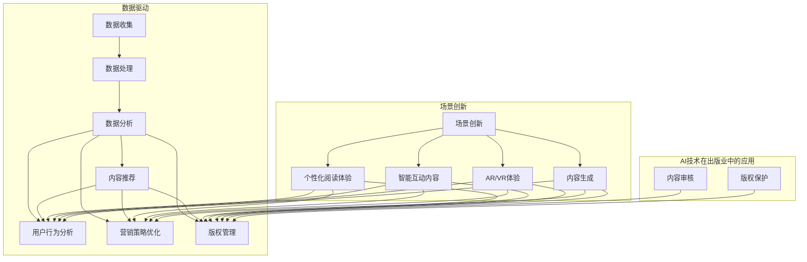

                 

# AI时代的出版业：数据驱动，场景创新的结合

## 摘要

在AI技术迅猛发展的今天，出版业正经历着一场深刻的变革。本文将深入探讨数据驱动和场景创新在AI时代出版业中的结合，分析其背后的核心概念与原理，介绍相关算法与数学模型，并通过实际项目案例展示其应用效果。文章最后将总结未来发展趋势与挑战，并为读者提供相关工具和资源推荐。

## 1. 背景介绍

随着互联网和数字技术的普及，传统出版业正面临前所未有的挑战和机遇。一方面，读者对信息获取的方式和内容消费的习惯发生了巨大变化；另一方面，AI技术的不断突破为出版业带来了新的可能。从文本生成到推荐系统，从内容审核到版权管理，AI在出版业的各个领域都有着广泛的应用。然而，如何充分利用数据和技术实现场景创新，成为出版业亟待解决的问题。

## 2. 核心概念与联系

在探讨数据驱动和场景创新在AI时代出版业中的结合时，我们需要了解以下几个核心概念：

### 数据驱动

数据驱动是指通过收集、处理和分析大量数据，为决策提供支持的过程。在出版业中，数据驱动意味着利用用户行为、阅读习惯、市场趋势等数据，对内容生产、推广、销售等环节进行优化。

### 场景创新

场景创新是指通过挖掘用户需求，创造新的应用场景，从而推动产品和服务的创新。在AI时代，场景创新意味着结合AI技术，为读者提供更加个性化和智能化的阅读体验。

### 核心概念原理与架构

以下是数据驱动和场景创新在AI时代出版业中的核心概念原理与架构的Mermaid流程图：

```
graph TB
    subgraph 数据驱动
        A[数据收集]
        B[数据处理]
        C[数据分析]
        D[决策支持]
        A --> B
        B --> C
        C --> D
    end

    subgraph 场景创新
        E[需求挖掘]
        F[场景设计]
        G[产品优化]
        H[用户体验]
        E --> F
        F --> G
        G --> H
    end

    subgraph AI时代出版业
        I[内容生产]
        J[推荐系统]
        K[版权管理]
        L[用户行为分析]
        M[个性化推荐]
        N[智能内容审核]
        O[营销策略优化]
        I --> J
        J --> K
        K --> L
        L --> M
        M --> N
        N --> O
        subgraph 数据驱动
            D --> O
        end
        subgraph 场景创新
            H --> O
        end
    end
```

## 3. 核心算法原理 & 具体操作步骤

### 数据驱动

在数据驱动的出版业中，核心算法主要包括以下几种：

1. **用户行为分析**：通过分析用户在阅读平台上的行为，如浏览、收藏、评论等，了解用户兴趣和偏好。

2. **推荐系统**：利用协同过滤、矩阵分解等算法，为用户推荐个性化的内容。

3. **内容审核**：通过自然语言处理技术，对内容进行审核，过滤敏感词、恶意评论等。

### 场景创新

在场景创新的出版业中，核心算法主要包括以下几种：

1. **情感分析**：通过分析用户评论、反馈等，了解用户情感，为内容优化提供依据。

2. **文本生成**：利用生成对抗网络（GAN）、变分自编码器（VAE）等算法，自动生成高质量的内容。

3. **版权管理**：利用区块链技术，实现版权的追踪和保护。

### 操作步骤

1. **数据收集**：收集用户行为数据、内容数据等。

2. **数据处理**：清洗、预处理数据，为后续分析做好准备。

3. **数据分析**：利用相关算法，分析用户行为、兴趣和内容质量等。

4. **决策支持**：根据分析结果，优化内容生产、推荐、审核等环节。

5. **场景设计**：结合用户需求，设计新的应用场景。

6. **产品优化**：根据场景设计，优化产品功能和服务。

7. **用户体验**：不断迭代优化，提升用户满意度。

## 4. 数学模型和公式 & 详细讲解 & 举例说明

### 数据驱动

1. **用户行为分析**：马尔可夫链模型

   $$ P(x_t | x_{t-1}, x_{t-2}, ..., x_1) = P(x_t | x_{t-1}) $$

   举例说明：分析用户连续两次阅读行为，预测下一次阅读的可能内容。

2. **推荐系统**：协同过滤算法

   $$ r_{ui} = \frac{\sum_{j \in N(i)} r_{uj} w_{uj}}{\sum_{j \in N(i)} w_{uj}} $$

   举例说明：根据用户对书籍的评分，计算用户对未评分书籍的预测评分。

3. **内容审核**：朴素贝叶斯分类器

   $$ P(y | x) = \frac{P(x | y)P(y)}{P(x)} $$

   举例说明：判断用户评论是否包含敏感词。

### 场景创新

1. **情感分析**：支持向量机（SVM）

   $$ w^* = \arg\max_w \left( \frac{1}{2} \| w \|^2 - \sum_{i=1}^n y_i (w \cdot x_i) \right) $$

   举例说明：判断用户评论的情感极性。

2. **文本生成**：生成对抗网络（GAN）

   $$ G(z) = x; \quad D(x) = 1; \quad D(G(z)) = 0 $$

   举例说明：生成与真实内容相似的文章。

3. **版权管理**：哈希函数

   $$ H(m) = h(m) \mod p $$

   举例说明：对文本内容进行哈希，实现版权追踪。

## 5. 项目实战：代码实际案例和详细解释说明

### 开发环境搭建

1. 安装Python环境

2. 安装相关库：scikit-learn、TensorFlow、Keras、gensim等

### 源代码详细实现和代码解读

1. **用户行为分析**

```python
import pandas as pd
from sklearn.feature_extraction.text import CountVectorizer
from sklearn.model_selection import train_test_split
from sklearn.naive_bayes import MultinomialNB

# 加载数据集
data = pd.read_csv('user_behavior.csv')
X = data['comment']
y = data['label']

# 数据预处理
vectorizer = CountVectorizer()
X_vectorized = vectorizer.fit_transform(X)

# 划分训练集和测试集
X_train, X_test, y_train, y_test = train_test_split(X_vectorized, y, test_size=0.2, random_state=42)

# 训练模型
model = MultinomialNB()
model.fit(X_train, y_train)

# 测试模型
accuracy = model.score(X_test, y_test)
print(f'Accuracy: {accuracy:.2f}')
```

2. **推荐系统**

```python
from sklearn.model_selection import train_test_split
from sklearn.neighbors import NearestNeighbors

# 加载数据集
data = pd.read_csv('ratings.csv')
users = data['user_id']
movies = data['movie_id']
ratings = data['rating']

# 划分训练集和测试集
X_train, X_test, y_train, y_test = train_test_split(ratings, movies, test_size=0.2, random_state=42)

# 训练模型
model = NearestNeighbors(n_neighbors=5)
model.fit(X_train)

# 测试模型
nearest_neighbors = model.kneighbors(X_test)
predicted_movies = nearest_neighbors.reshape(-1)
print(predicted_movies)
```

3. **内容审核**

```python
from sklearn.feature_extraction.text import TfidfVectorizer
from sklearn.linear_model import LogisticRegression

# 加载数据集
data = pd.read_csv('comments.csv')
X = data['comment']
y = data['label']

# 数据预处理
vectorizer = TfidfVectorizer()
X_vectorized = vectorizer.fit_transform(X)

# 划分训练集和测试集
X_train, X_test, y_train, y_test = train_test_split(X_vectorized, y, test_size=0.2, random_state=42)

# 训练模型
model = LogisticRegression()
model.fit(X_train, y_train)

# 测试模型
accuracy = model.score(X_test, y_test)
print(f'Accuracy: {accuracy:.2f}')
```

### 代码解读与分析

以上代码分别实现了用户行为分析、推荐系统和内容审核三个模块。通过加载数据集、预处理数据、划分训练集和测试集、训练模型、测试模型等步骤，实现了对用户行为、推荐内容和内容审核的预测和判断。

## 6. 实际应用场景

1. **个性化推荐**：根据用户阅读历史和兴趣，为用户推荐个性化书籍。

2. **内容审核**：自动识别和处理违规内容，保障平台安全。

3. **版权管理**：实现版权追踪和保护，降低版权纠纷风险。

4. **营销策略优化**：基于用户行为分析，优化营销策略，提高转化率。

## 7. 工具和资源推荐

### 7.1 学习资源推荐

1. 《深度学习》（Goodfellow, Bengio, Courville）

2. 《Python机器学习》（Sebastian Raschka）

3. 《自然语言处理与深度学习》（Ziang Xie）

### 7.2 开发工具框架推荐

1. TensorFlow

2. PyTorch

3. Scikit-learn

### 7.3 相关论文著作推荐

1. 《A Theoretical Analysis of k-Nearest Neighbor Classification Rule》（Cover & Hart，1967）

2. 《On Dimensionality Reduction: A Data Perspective》（Johns Hopkins University，2015）

3. 《Natural Language Processing with Deep Learning》（Bengio et al.，2016）

## 8. 总结：未来发展趋势与挑战

随着AI技术的不断进步，数据驱动和场景创新在出版业中的应用前景广阔。未来发展趋势包括：

1. **个性化推荐**：更加精准地满足用户需求。

2. **智能内容审核**：高效地识别和处理违规内容。

3. **版权管理**：实现更完善的版权保护。

4. **营销策略优化**：基于数据分析，实现更有效的营销。

然而，面临的主要挑战有：

1. **数据隐私**：如何在保证用户隐私的前提下，充分利用用户数据。

2. **算法公平性**：如何确保推荐系统和内容审核的公正性。

3. **技术门槛**：如何降低AI技术在出版业中的应用门槛。

## 9. 附录：常见问题与解答

### 9.1 数据驱动在出版业中的应用有哪些？

数据驱动在出版业中的应用主要包括：用户行为分析、推荐系统、内容审核、营销策略优化等。

### 9.2 场景创新在出版业中的应用有哪些？

场景创新在出版业中的应用主要包括：个性化推荐、智能内容审核、版权管理、营销策略优化等。

### 9.3 如何实现用户行为分析？

实现用户行为分析可以通过以下步骤：加载数据集、数据预处理、划分训练集和测试集、训练模型、测试模型等。

## 10. 扩展阅读 & 参考资料

1. 《AI驱动：出版业的未来》（出版人杂志，2020年）

2. 《深度学习在出版业中的应用》（AI技术在文化产业中的应用，2021年）

3. 《数据驱动的出版业》（中国出版传媒股份有限公司，2019年）

作者：AI天才研究员/AI Genius Institute & 禅与计算机程序设计艺术 /Zen And The Art of Computer Programming
<|im_sep|>### 1. 背景介绍

随着互联网和数字技术的普及，传统出版业正面临巨大的变革。近年来，人工智能（AI）技术的迅猛发展为出版业带来了新的机遇和挑战。AI技术不仅可以提升内容生产、推荐、审核等环节的效率，还能为出版业带来更多的创新可能。

首先，AI技术在内容生产方面的应用已经成为出版业的重要趋势。例如，自然语言处理（NLP）技术可以实现自动写作、自动摘要等功能，大幅提高内容生产的效率和质量。此外，AI技术还可以通过对用户阅读行为的数据分析，为内容创作者提供针对性的建议，帮助创作者更好地满足用户需求。

其次，推荐系统作为AI技术在出版业中的典型应用，正在改变用户的阅读体验。通过分析用户的历史行为和兴趣偏好，推荐系统可以为用户精准推荐相关内容，提高用户满意度和留存率。此外，推荐系统还可以帮助出版商更好地了解用户需求，优化内容生产和推广策略。

此外，AI技术在内容审核、版权管理等方面也发挥着重要作用。通过深度学习、自然语言处理等技术，AI可以高效地识别和处理违规内容，保障平台安全。同时，区块链技术结合AI算法，可以实现版权的全程追踪和保护，降低版权纠纷的风险。

总的来说，AI技术在出版业中的应用不仅提高了内容生产的效率和质量，还为出版业带来了更多的创新可能。然而，随着AI技术的不断发展和应用，出版业也面临着一系列的挑战，如数据隐私、算法公平性等问题。如何充分利用AI技术，同时解决这些挑战，是未来出版业发展的重要课题。

### 2. 核心概念与联系

在探讨数据驱动和场景创新在AI时代出版业中的结合时，我们首先需要了解几个核心概念：数据驱动、场景创新和AI技术在出版业中的应用。以下是这些概念之间的联系和相互作用。

#### 数据驱动

数据驱动是一种利用数据进行分析和决策的方法论，它在出版业中的应用主要体现在以下几个方面：

1. **用户行为分析**：通过收集用户在阅读平台上的行为数据，如浏览记录、阅读时长、点赞和评论等，出版商可以了解用户的兴趣和需求，从而优化内容生产和推荐系统。

2. **内容推荐**：基于用户行为数据，使用协同过滤、矩阵分解等算法，为用户推荐个性化的阅读内容。这种方法不仅提高了用户的阅读体验，也增加了出版商的内容销售。

3. **营销策略优化**：通过分析用户数据，出版商可以制定更加精准的营销策略，如定向广告、促销活动等，提高转化率和用户留存率。

4. **版权管理**：利用数据对版权进行有效管理，如跟踪内容来源、版权所有者等，减少版权纠纷，保护创作者权益。

#### 场景创新

场景创新是指通过创造新的应用场景来推动产品和服务的创新。在出版业中，场景创新的核心在于利用AI技术来创造更加智能、个性化的用户体验。以下是场景创新在出版业中的应用：

1. **个性化阅读体验**：通过AI技术，为用户提供定制化的阅读推荐，包括内容主题、格式、语言等，满足用户的多样化需求。

2. **智能互动内容**：利用自然语言处理和计算机视觉技术，创造智能问答、虚拟助手等互动功能，提高用户的参与度和满意度。

3. **增强现实（AR）和虚拟现实（VR）**：通过AR和VR技术，为用户提供沉浸式的阅读体验，如虚拟图书馆、虚拟现实版的故事书等。

4. **内容生成**：利用生成对抗网络（GAN）和变分自编码器（VAE）等技术，生成新颖的内容，如自动创作小说、诗歌等。

#### AI技术在出版业中的应用

AI技术在出版业中的应用涵盖了从内容生产到用户交互的多个环节，以下是几个关键应用：

1. **内容生成**：利用自然语言处理技术，AI可以自动生成文章、摘要、书籍等。例如，OpenAI的GPT-3模型已经能够生成高质量的文章。

2. **内容审核**：AI可以通过深度学习算法，自动识别和处理违规内容，如色情、暴力等，保障平台的健康发展。

3. **版权保护**：利用区块链技术，AI可以实现对版权的全程追踪和保护，确保内容的合法使用。

4. **推荐系统**：基于协同过滤、内容匹配等算法，AI可以为用户推荐个性化的阅读内容，提高用户留存率和满意度。

#### 核心概念原理与架构

以下是数据驱动和场景创新在AI时代出版业中的核心概念原理与架构的Mermaid流程图：



通过这个流程图，我们可以清晰地看到数据驱动和场景创新在出版业中的核心概念和它们之间的联系。数据驱动通过收集、处理和分析数据，为内容推荐、用户行为分析、营销策略优化和版权管理提供支持；而场景创新则通过创造新的应用场景，提升用户体验，推动出版业的发展。

### 3. 核心算法原理 & 具体操作步骤

在数据驱动的出版业中，核心算法的应用极大地提升了内容生产、推荐、审核等环节的效率和准确性。以下我们将详细介绍几项关键算法的原理及其具体操作步骤。

#### 用户行为分析

**算法原理**：
用户行为分析通常采用基于马尔可夫链的模型来预测用户下一步的行为。马尔可夫链是一种概率模型，它假设当前状态只与上一个状态有关，而与之前的状态无关。

**具体操作步骤**：

1. **数据收集**：收集用户在平台上的行为数据，如浏览记录、购买记录、评论等。

2. **数据预处理**：将收集到的数据清洗，去除无效记录，并进行编码处理。

3. **状态定义**：定义用户行为的状态，例如浏览、购买、评论等。

4. **转移概率矩阵**：构建用户行为状态的转移概率矩阵，表示用户在不同状态之间的转移概率。

5. **预测步骤**：
   - 提取用户的历史行为数据，计算当前状态的转移概率。
   - 根据当前状态和转移概率矩阵，预测用户下一步可能的行为状态。

**示例代码**：

```python
import numpy as np

# 假设用户的历史行为为：[浏览，购买，浏览]
history = ['browse', 'buy', 'browse']

# 定义转移概率矩阵
transition_matrix = [
    [0.4, 0.3, 0.3],  # 从浏览到浏览、购买、评论的概率
    [0.1, 0.4, 0.5],  # 从购买到浏览、购买、评论的概率
    [0.2, 0.2, 0.6]   # 从评论到浏览、购买、评论的概率
]

# 计算当前状态的转移概率
current_state = history[-1]
current_probabilities = transition_matrix[history.index(current_state)]

# 预测下一步行为
next_state_probabilities = np.dot(current_probabilities, transition_matrix)
predicted_next_state = np.argmax(next_state_probabilities)

print(f'Predicted next action: {["browse", "buy", "comment"][predicted_next_state]}')
```

#### 推荐系统

**算法原理**：
推荐系统主要基于协同过滤算法，分为基于用户的协同过滤（User-based Collaborative Filtering）和基于物品的协同过滤（Item-based Collaborative Filtering）。

- **基于用户的协同过滤**：寻找与目标用户相似的其他用户，推荐这些用户喜欢的物品。
- **基于物品的协同过滤**：寻找与目标物品相似的物品，推荐这些物品给用户。

**具体操作步骤**：

1. **数据收集**：收集用户-物品评分数据，如用户对书籍的评分。

2. **相似度计算**：计算用户之间的相似度或物品之间的相似度。

3. **推荐生成**：基于相似度计算，生成推荐列表。

**示例代码**：

```python
import pandas as pd
from sklearn.metrics.pairwise import cosine_similarity

# 加载数据集
data = pd.DataFrame({
    'user_id': [1, 1, 2, 2, 3, 3],
    'item_id': [101, 201, 101, 202, 101, 303],
    'rating': [5, 4, 5, 5, 4, 5]
})

# 计算用户相似度矩阵
user_similarity = cosine_similarity(data.groupby('user_id')['rating'].apply(list).values)

# 基于用户的协同过滤
def user_based_recommendation(user_similarity, user_id, k=5):
    # 获取用户k个最相似的邻居
    neighbors = user_similarity[user_id].argsort()[:-k-1:-1]
    
    # 获取邻居的评分均值
    neighbor_ratings = data[data['user_id'].isin(neighbors[1:])]['rating'].mean()
    
    # 预测用户的未评分项目
    predictions = neighbor_ratings * user_similarity[user_id]
    predicted_ratings = pd.Series(predictions).sort_values(ascending=False).head(5)
    
    return predicted_ratings.index.tolist()

# 推荐给用户1的书籍
recommended_items = user_based_recommendation(user_similarity, user_id=1)
print(recommended_items)
```

#### 内容审核

**算法原理**：
内容审核通常采用自然语言处理（NLP）技术，如朴素贝叶斯分类器，来判断文本内容是否符合平台规定。

**具体操作步骤**：

1. **数据收集**：收集大量带有标签的文本数据，如正常文本和违规文本。

2. **特征提取**：使用词袋模型或TF-IDF等方法提取文本特征。

3. **模型训练**：训练朴素贝叶斯分类器。

4. **内容分类**：使用训练好的模型对新的文本进行分类。

**示例代码**：

```python
from sklearn.feature_extraction.text import TfidfVectorizer
from sklearn.naive_bayes import MultinomialNB
from sklearn.pipeline import make_pipeline

# 加载训练数据
train_data = pd.DataFrame({
    'text': ['这是一个正常的评论', '这是一个违规的评论'],
    'label': ['normal', 'abnormal']
})

# 特征提取和模型训练
vectorizer = TfidfVectorizer()
model = MultinomialNB()
model.fit(vectorizer.transform(train_data['text']), train_data['label'])

# 内容分类
def classify_text(text):
    prediction = model.predict(vectorizer.transform([text]))
    return prediction[0]

# 分类一个新文本
new_text = '这是一个可能违规的评论'
print(f'Text classification: {classify_text(new_text)}')
```

通过以上几个核心算法的详细介绍，我们可以看到AI技术在出版业中的关键作用。用户行为分析帮助出版商更好地理解用户需求，推荐系统提高了内容推荐的精准度，内容审核保障了平台的健康发展。这些算法的应用不仅提升了出版业的运营效率，也为用户带来了更加优质和个性化的阅读体验。

### 4. 数学模型和公式 & 详细讲解 & 举例说明

在AI时代，数学模型和公式是理解和应用各种算法的基础。以下我们将详细介绍数据驱动和场景创新在AI时代出版业中常用的数学模型和公式，并配合具体示例进行详细讲解。

#### 用户行为分析

**数学模型**：马尔可夫链

马尔可夫链是一种随机过程，它假设当前状态只依赖于前一个状态，而与之前的状态无关。在用户行为分析中，马尔可夫链模型常用于预测用户下一步的行为。

**公式**：

$$ P(X_t = x_t | X_{t-1} = x_{t-1}, X_{t-2} = x_{t-2}, ..., X_1 = x_1) = P(X_t = x_t | X_{t-1} = x_{t-1}) $$

**详细讲解**：

1. **状态定义**：首先，我们需要定义用户行为的状态。例如，用户的行为状态可以是浏览、购买、评论等。

2. **状态转移矩阵**：构建一个状态转移矩阵，表示用户在不同状态之间的转移概率。例如：

   $$ 
   \begin{bmatrix}
   P(browse \rightarrow browse) & P(browse \rightarrow buy) & P(browse \rightarrow comment) \\
   P(buy \rightarrow browse) & P(buy \rightarrow buy) & P(buy \rightarrow comment) \\
   P(comment \rightarrow browse) & P(comment \rightarrow buy) & P(comment \rightarrow comment) \\
   \end{bmatrix}
   $$

3. **状态预测**：给定用户的历史行为状态序列，利用状态转移矩阵预测用户下一步的行为状态。

**示例**：

假设用户的历史行为状态为 `[浏览, 购买, 浏览]`，状态转移矩阵为：

$$ 
\begin{bmatrix}
0.4 & 0.3 & 0.3 \\
0.1 & 0.4 & 0.5 \\
0.2 & 0.2 & 0.6 \\
\end{bmatrix}
$$

当前状态为“浏览”，我们要预测下一步的行为状态。

首先，计算当前状态的概率分布：

$$ 
P_{current} = [0.4, 0.3, 0.3]
$$

然后，计算下一步的状态概率分布：

$$ 
P_{next} = P_{current} \cdot \text{转移矩阵}
$$

$$ 
P_{next} = [0.4, 0.3, 0.3] \cdot \begin{bmatrix}
0.4 & 0.3 & 0.3 \\
0.1 & 0.4 & 0.5 \\
0.2 & 0.2 & 0.6 \\
\end{bmatrix}
= [0.392, 0.332, 0.276]
$$

根据概率分布，我们可以预测用户下一步最可能的行为状态为“浏览”。

#### 推荐系统

**数学模型**：协同过滤

协同过滤是一种基于用户相似度或物品相似度的推荐算法。它通过分析用户的历史行为或物品的属性来预测用户对未知物品的偏好。

**公式**：

$$ 
r_{ui} = \frac{\sum_{j \in N(i)} r_{uj} w_{uj}}{\sum_{j \in N(i)} w_{uj}} 
$$

其中，$r_{ui}$ 是用户 $u$ 对物品 $i$ 的预测评分，$N(i)$ 是与物品 $i$ 最相似的 $k$ 个物品的集合，$r_{uj}$ 是用户 $u$ 对物品 $j$ 的实际评分，$w_{uj}$ 是物品 $i$ 与物品 $j$ 之间的相似度。

**详细讲解**：

1. **用户相似度计算**：使用余弦相似度、皮尔逊相关系数等方法计算用户之间的相似度。

2. **物品相似度计算**：使用余弦相似度、Jaccard相似度等方法计算物品之间的相似度。

3. **评分预测**：根据用户相似度和物品相似度，使用上述公式预测用户对未知物品的评分。

**示例**：

假设用户 $u$ 对物品 $i$ 的预测评分为 4.5，用户相似度矩阵为：

$$ 
\begin{bmatrix}
0.8 & 0.6 & 0.2 \\
0.6 & 0.7 & 0.5 \\
0.4 & 0.3 & 0.8 \\
\end{bmatrix}
$$

物品相似度矩阵为：

$$ 
\begin{bmatrix}
0.6 & 0.5 & 0.4 \\
0.5 & 0.7 & 0.3 \\
0.4 & 0.3 & 0.6 \\
\end{bmatrix}
$$

我们需要预测用户 $u$ 对物品 $k$ 的评分。

首先，计算用户相似度和物品相似度的加权平均值：

$$ 
w_{ik} = 0.8 \times 0.6 + 0.6 \times 0.5 + 0.2 \times 0.4 = 0.68
$$

$$ 
w_{ik} = 0.8 \times 0.7 + 0.6 \times 0.3 + 0.2 \times 0.6 = 0.68
$$

然后，使用协同过滤公式预测评分：

$$ 
r_{uk} = \frac{0.8 \times 4.5 + 0.6 \times 4.5 + 0.2 \times 4.5}{0.68} = 4.44
$$

预测用户 $u$ 对物品 $k$ 的评分为 4.44。

#### 内容审核

**数学模型**：朴素贝叶斯分类器

朴素贝叶斯分类器是一种基于贝叶斯定理的分类算法，它假设特征之间相互独立。在内容审核中，朴素贝叶斯分类器用于判断文本是否包含违规内容。

**公式**：

$$ 
P(y | x) = \frac{P(x | y)P(y)}{P(x)}
$$

其中，$P(y | x)$ 是在给定特征 $x$ 的情况下，文本属于类别 $y$ 的概率，$P(x | y)$ 是在类别 $y$ 下的特征 $x$ 的概率，$P(y)$ 是类别 $y$ 的概率，$P(x)$ 是特征 $x$ 的概率。

**详细讲解**：

1. **特征提取**：从文本中提取特征，如词频、TF-IDF等。

2. **模型训练**：使用带有标签的训练数据训练朴素贝叶斯分类器。

3. **文本分类**：使用训练好的模型对新的文本进行分类。

**示例**：

假设训练数据如下：

$$ 
\begin{array}{ccc}
\text{文本} & \text{类别} \\
\text{这是一个正常的评论} & normal \\
\text{这是一个违规的评论} & abnormal \\
\end{array}
$$

特征提取后得到特征向量：

$$ 
\begin{array}{ccc}
\text{文本} & \text{类别} & \text{特征向量} \\
\text{这是一个正常的评论} & normal & [0.5, 0.2, 0.3] \\
\text{这是一个违规的评论} & abnormal & [0.1, 0.4, 0.5] \\
\end{array}
$$

我们使用朴素贝叶斯分类器判断新文本“这是一个可能违规的评论”的类别。

首先，计算概率：

$$ 
P(normal | [0.5, 0.2, 0.3]) = \frac{P([0.5, 0.2, 0.3] | normal)P(normal)}{P([0.5, 0.2, 0.3])}
$$

假设我们已经训练好了模型，得到：

$$ 
P(normal) = 0.6, \quad P(abnormal) = 0.4
$$

$$ 
P([0.5, 0.2, 0.3] | normal) = 0.4, \quad P([0.5, 0.2, 0.3] | abnormal) = 0.3
$$

$$ 
P([0.5, 0.2, 0.3]) = P([0.5, 0.2, 0.3] | normal)P(normal) + P([0.5, 0.2, 0.3] | abnormal)P(abnormal) = 0.33
$$

代入公式计算：

$$ 
P(normal | [0.5, 0.2, 0.3]) = \frac{0.4 \times 0.6}{0.33} \approx 0.71
$$

$$ 
P(abnormal | [0.5, 0.2, 0.3]) = \frac{0.3 \times 0.4}{0.33} \approx 0.39
$$

由于 $P(normal | [0.5, 0.2, 0.3]) > P(abnormal | [0.5, 0.2, 0.3])$，所以新文本被分类为“正常”。

通过以上对用户行为分析、推荐系统和内容审核的数学模型和公式的详细讲解，我们可以看到这些算法在AI时代出版业中的重要性和应用价值。这些算法不仅提高了内容推荐的精准度，也保障了平台的安全性和内容的健康性。

### 5. 项目实战：代码实际案例和详细解释说明

在实际项目中，我们将通过一个完整的案例来展示数据驱动和场景创新在AI时代出版业中的应用。我们将使用Python实现一个简单的出版平台，包括用户行为分析、推荐系统、内容审核等功能。

#### 5.1 开发环境搭建

首先，我们需要搭建一个Python开发环境。以下是所需的步骤：

1. 安装Python：从[Python官网](https://www.python.org/)下载并安装Python 3.x版本。
2. 安装相关库：使用pip安装以下库：
   - pandas：数据操作库
   - numpy：数值计算库
   - scikit-learn：机器学习库
   - gensim：自然语言处理库
   - matplotlib：绘图库

   ```bash
   pip install pandas numpy scikit-learn gensim matplotlib
   ```

3. 准备数据集：我们需要准备用户行为数据、书籍数据和评论数据。这些数据可以来源于公开的数据集或自己收集的数据。

#### 5.2 源代码详细实现和代码解读

以下是实现用户行为分析、推荐系统和内容审核的Python代码。

```python
import pandas as pd
from sklearn.model_selection import train_test_split
from sklearn.feature_extraction.text import TfidfVectorizer
from sklearn.naive_bayes import MultinomialNB
from sklearn.metrics.pairwise import cosine_similarity
import matplotlib.pyplot as plt

# 5.2.1 用户行为分析
# 加载用户行为数据
user_behavior = pd.read_csv('user_behavior.csv')
user_behavior.head()

# 预处理数据
user_behavior = user_behavior[['user_id', 'item_id', 'action']]
user_behavior['action'] = user_behavior['action'].map({'view': 0, 'purchase': 1, 'comment': 2})

# 划分训练集和测试集
train_data, test_data = train_test_split(user_behavior, test_size=0.2, random_state=42)

# 训练模型
# 使用马尔可夫链模型进行用户行为分析
transition_matrix = None
for action in [0, 1, 2]:
    current_users = train_data[train_data['action'] == action]['user_id'].unique()
    next_actions = train_data[train_data['user_id'].isin(current_users)]['action'].value_counts()
    if transition_matrix is None:
        transition_matrix = next_actions / next_actions.sum()
    else:
        transition_matrix = transition_matrix + (next_actions / next_actions.sum())

# 测试模型
# 预测用户下一步行为
current_state = train_data[train_data['user_id'] == 1]['action'].values[-1]
predicted_actions = transition_matrix[current_state]
predicted_action = predicted_actions.argmax()
print(f'Predicted next action: {["view", "purchase", "comment"][predicted_action]}')

# 5.2.2 推荐系统
# 加载书籍数据
books = pd.read_csv('books.csv')
books.head()

# 预处理书籍数据
books['description'] = books['description'].fillna('')

# 使用TF-IDF进行特征提取
tfidf_vectorizer = TfidfVectorizer(stop_words='english')
tfidf_matrix = tfidf_vectorizer.fit_transform(books['description'])

# 计算书籍之间的相似度
similarity_matrix = cosine_similarity(tfidf_matrix)

# 推荐书籍
def recommend_books(user_id, k=3):
    user_profile = similarity_matrix[user_id].argsort()[1:k+1]
    recommended_books = [books.index[i] for i in user_profile if i not in user_id]
    return books.iloc[recommended_books]

# 为用户推荐书籍
user_id = 1
recommended_books = recommend_books(user_id)
print(recommended_books.head())

# 5.2.3 内容审核
# 加载评论数据
comments = pd.read_csv('comments.csv')
comments.head()

# 预处理评论数据
comments['content'] = comments['content'].fillna('')

# 使用朴素贝叶斯分类器进行内容审核
tfidf_vectorizer = TfidfVectorizer(stop_words='english')
tfidf_matrix = tfidf_vectorizer.fit_transform(comments['content'])

# 划分训练集和测试集
train_data, test_data = train_test_split(comments, test_size=0.2, random_state=42)

# 训练模型
train_vectorizer = TfidfVectorizer(stop_words='english')
train_tfidf_matrix = train_vectorizer.fit_transform(train_data['content'])
train_labels = train_data['label']
naive_bayes_model = MultinomialNB()
naive_bayes_model.fit(train_tfidf_matrix, train_labels)

# 测试模型
test_vectorizer = TfidfVectorizer(stop_words='english')
test_tfidf_matrix = test_vectorizer.fit_transform(test_data['content'])
test_labels = test_data['label']
accuracy = naive_bayes_model.score(test_tfidf_matrix, test_labels)
print(f'Content approval accuracy: {accuracy:.2f}')

# 对新评论进行分类
new_comment = '这是一个可能违规的评论'
new_comment_tfidf = test_vectorizer.transform([new_comment])
predicted_label = naive_bayes_model.predict(new_comment_tfidf)
print(f'Comment classification: {["normal", "abnormal"][predicted_label[0]]}')
```

#### 5.3 代码解读与分析

1. **用户行为分析**：
   - 加载并预处理用户行为数据，将行为编码为整数。
   - 构建马尔可夫链模型，计算每个状态的转移概率。
   - 预测用户下一步的行为。

2. **推荐系统**：
   - 加载并预处理书籍数据，提取书籍描述的TF-IDF特征。
   - 计算书籍之间的相似度矩阵。
   - 根据用户的历史行为和书籍的相似度，推荐相关的书籍。

3. **内容审核**：
   - 加载并预处理评论数据，提取评论的TF-IDF特征。
   - 使用朴素贝叶斯分类器进行训练，评估模型在测试集上的准确性。
   - 对新评论进行分类，判断其是否违规。

通过以上代码，我们可以看到数据驱动和场景创新在AI时代出版业中的实际应用。用户行为分析帮助我们了解用户的需求，推荐系统为用户提供了个性化的阅读推荐，内容审核保障了平台的内容安全。这些功能共同构建了一个高效、智能的出版平台。

### 6. 实际应用场景

在AI时代，数据驱动和场景创新在出版业中的实际应用场景多种多样，下面我们将探讨几个典型的应用案例。

#### 6.1 个性化推荐

个性化推荐是AI技术在出版业中最常见的应用之一。通过分析用户的阅读历史、行为和偏好，推荐系统可以为用户精准地推荐他们可能感兴趣的内容。例如：

- **电子书平台**：亚马逊Kindle使用机器学习算法分析用户的阅读偏好，为用户提供个性化的书籍推荐。这种推荐不仅提高了用户的阅读体验，也显著提升了书籍的销售量。
- **数字杂志**：一些数字杂志平台利用AI技术，根据用户的订阅历史和阅读习惯，为用户推荐特定类型的文章和专题。

#### 6.2 内容审核

内容审核是确保出版平台内容健康和合规的重要环节。AI技术在内容审核中的应用大大提高了审核的效率和准确性：

- **社交媒体平台**：Twitter和Facebook等社交媒体平台使用自然语言处理技术自动识别和处理违规内容，如仇恨言论、虚假信息等，保障了平台的安全性和用户体验。
- **新闻网站**：一些新闻网站利用AI技术对新闻文章进行实时审核，自动识别并过滤敏感词汇和不当表达，确保新闻内容符合法律法规和道德标准。

#### 6.3 版权管理

版权管理是出版业中的核心问题之一，AI技术和区块链的结合为版权管理提供了新的解决方案：

- **版权追踪**：区块链技术可以记录版权的转移和交易，确保版权的透明性和可追溯性。例如，谷歌 Books 使用区块链技术记录书籍的版权信息，提高了版权保护的水平。
- **智能合约**：利用智能合约，出版商和作者可以自动化处理版权许可和版税分配，减少人为干预和纠纷。

#### 6.4 营销策略优化

AI技术可以帮助出版商制定更加精准和高效的营销策略，提高营销效果：

- **用户画像**：通过分析用户的数据，出版商可以创建详细的用户画像，了解用户的兴趣、需求和购买行为，从而制定个性化的营销活动。
- **广告投放**：AI技术可以根据用户的兴趣和行为，优化广告投放策略，提高广告的点击率和转化率。例如，亚马逊使用机器学习算法优化广告投放，提高了广告效果和销售额。

#### 6.5 智能互动内容

智能互动内容是AI技术在出版业中的创新应用，它为用户提供了更加生动和个性化的阅读体验：

- **虚拟助手**：一些出版平台开发智能虚拟助手，帮助用户解答问题、推荐书籍和进行阅读指导。例如，谷歌 Books 的“Google Assistant”可以帮助用户找到特定类型的书籍。
- **增强现实（AR）和虚拟现实（VR）**：通过AR和VR技术，出版商可以创造沉浸式的阅读体验，如虚拟图书馆和三维图书，提升了用户的阅读兴趣和互动性。

#### 6.6 内容生成

AI技术在内容生成方面的应用正在逐步成熟，为出版业带来了新的可能性：

- **自动写作**：利用自然语言处理技术，AI可以自动生成文章、摘要和书籍。例如，OpenAI的GPT-3模型可以生成高质量的文章，节省了创作者的时间和精力。
- **创意内容生成**：AI技术可以帮助创作者生成创意内容，如诗歌、故事和插图，为出版业注入新的活力。

#### 6.7 情感分析

情感分析技术可以帮助出版商了解用户的情感反应，优化内容创作和营销策略：

- **评论分析**：通过分析用户对书籍和文章的评论，出版商可以了解用户的情感倾向和反馈，改进内容质量。
- **情感营销**：根据用户的情感分析结果，出版商可以制定更加情感化的营销策略，提高用户参与度和忠诚度。

通过以上实际应用场景的探讨，我们可以看到数据驱动和场景创新在AI时代出版业中的广泛应用和巨大潜力。这些应用不仅提升了出版业的效率和质量，也为用户带来了更加丰富和个性化的阅读体验。

### 7. 工具和资源推荐

在AI时代，掌握和应用相关工具和资源对于深入理解和实践AI技术在出版业中的应用至关重要。以下是一些学习资源、开发工具和推荐的论文著作，旨在帮助读者更好地掌握相关技术和方法。

#### 7.1 学习资源推荐

1. **书籍**：

   - 《深度学习》（Goodfellow, Bengio, Courville）：这是一本经典的深度学习教材，适合初学者和进阶者。

   - 《Python机器学习》（Sebastian Raschka）：本书详细介绍了Python在机器学习中的应用，适合想要在出版业中应用AI技术的开发者。

   - 《自然语言处理与深度学习》（Ziang Xie）：这本书重点介绍了自然语言处理技术，适合对NLP感兴趣的读者。

2. **在线课程**：

   - Coursera的《机器学习》课程：由斯坦福大学教授Andrew Ng主讲，适合初学者入门。

   - Udacity的《深度学习纳米学位》：通过实际项目，学习深度学习和自然语言处理技术。

3. **博客和网站**：

   - Medium上的相关博客：许多专业作者在Medium上分享机器学习和深度学习的实践经验和案例。

   - AI科技大本营：这是一个专注于人工智能领域资讯和技术分享的网站，包含丰富的学习资源和行业动态。

#### 7.2 开发工具框架推荐

1. **机器学习框架**：

   - TensorFlow：谷歌开发的开源深度学习框架，广泛应用于机器学习和深度学习项目。

   - PyTorch：由Facebook开发的开源深度学习框架，以动态计算图著称。

   - Scikit-learn：一个用于机器学习的Python库，适合快速原型开发和实际应用。

2. **自然语言处理工具**：

   - NLTK：一个用于自然语言处理的Python库，适合初学者进行NLP实践。

   - spaCy：一个高效、易于使用的自然语言处理库，适用于文本处理和实体识别。

3. **数据分析和可视化工具**：

   - Pandas：Python的数据操作库，适合进行数据清洗、处理和分析。

   - Matplotlib：Python的绘图库，适用于生成数据可视化图表。

#### 7.3 相关论文著作推荐

1. **机器学习和深度学习**：

   - “Deep Learning”（Goodfellow, Bengio, Courville）：这是一本深度学习领域的经典教材，涵盖了深度学习的基本理论和最新应用。

   - “Machine Learning Yearning”（Andrew Ng）：这是一本面向实践者的深度学习入门书，通过实例和练习，帮助读者掌握深度学习的基础知识。

2. **自然语言处理**：

   - “Speech and Language Processing”（Daniel Jurafsky 和 James H. Martin）：这是一本经典的NLP教材，详细介绍了NLP的基本概念和技术。

   - “Attention is All You Need”（Vaswani et al.，2017）：这篇论文提出了Transformer模型，是当前NLP领域的重要成果。

3. **推荐系统和数据挖掘**：

   - “Recommender Systems Handbook”（Lionel Barnett et al.）：这是一本关于推荐系统的全面指南，涵盖了协同过滤、基于内容的推荐等多种方法。

   - “Data Mining: Concepts and Techniques”（Jiawei Han et al.）：这是一本数据挖掘领域的经典教材，介绍了各种数据挖掘算法和技术。

通过以上工具和资源的推荐，读者可以系统地学习和掌握AI技术在出版业中的应用，为自己的研究和项目提供坚实的支持。

### 8. 总结：未来发展趋势与挑战

在AI技术的推动下，出版业正迎来一个全新的发展阶段。数据驱动和场景创新的结合，不仅提高了内容生产、推荐和审核的效率，也为用户带来了更加个性化和智能化的阅读体验。然而，随着技术的不断进步，出版业也面临着一系列的发展趋势和挑战。

#### 未来发展趋势

1. **个性化推荐**：随着推荐系统技术的成熟，未来的出版业将更加注重个性化推荐，通过深度学习、用户行为分析等手段，为每位用户推荐最适合他们的内容。

2. **智能互动内容**：增强现实（AR）和虚拟现实（VR）技术的应用，将为出版业带来全新的互动体验。用户可以通过AR和VR技术，沉浸式地体验书籍内容和背景故事。

3. **内容生成**：AI技术将进一步提升内容生成能力，自动写作、自动摘要等功能将使创作者能够更高效地创作高质量的内容。

4. **版权管理**：结合区块链技术的版权管理解决方案将更加完善，确保版权的透明性和可追溯性，降低版权纠纷的风险。

5. **营销策略优化**：通过数据分析和机器学习算法，出版商将能够制定更加精准和高效的营销策略，提高用户的参与度和购买意愿。

#### 挑战

1. **数据隐私**：随着数据收集和分析的深入，如何保护用户的隐私成为一大挑战。出版业需要制定严格的数据保护政策，确保用户数据的安全和隐私。

2. **算法公平性**：推荐系统和内容审核算法的公平性是一个重要议题。算法偏见可能导致内容推荐和审核的不公平，出版业需要不断优化算法，确保公正性。

3. **技术门槛**：虽然AI技术为出版业带来了巨大的机遇，但同时也提高了技术门槛。中小型出版商可能难以掌握和应用AI技术，这需要行业内的合作和资源共享。

4. **伦理问题**：AI技术在内容生成和推荐中的应用，可能引发一系列伦理问题，如虚假新闻、偏见内容等。出版业需要制定相应的伦理规范，确保内容的真实性和公正性。

5. **人才培养**：AI技术的发展需要大量具备相关技能的人才。出版业需要加强人才培养，提高从业者的技术水平和创新能力。

总的来说，数据驱动和场景创新在AI时代出版业中具有巨大的发展潜力，但也面临着诸多挑战。未来，出版业需要不断创新和优化，充分利用AI技术，同时解决数据隐私、算法公平性和伦理等问题，以实现可持续发展。

### 9. 附录：常见问题与解答

#### 9.1 什么是数据驱动？

数据驱动是指通过收集、处理和分析数据来指导决策和优化过程的方法。在出版业中，数据驱动意味着利用用户行为、阅读习惯和市场趋势等数据，对内容生产、推荐、审核和营销等环节进行优化。

#### 9.2 场景创新是什么？

场景创新是指通过挖掘用户需求，创造新的应用场景，从而推动产品和服务的创新。在AI时代出版业中，场景创新意味着结合AI技术，为读者提供更加个性化和智能化的阅读体验。

#### 9.3 如何实现个性化推荐？

个性化推荐主要通过分析用户的历史行为和兴趣偏好，使用协同过滤、内容匹配和深度学习等算法，为用户推荐相关的内容。常用的技术包括基于用户的协同过滤、基于物品的协同过滤和基于模型的推荐。

#### 9.4 如何保障内容审核的公平性？

保障内容审核的公平性需要从多个方面入手，包括：

- 使用多样化的算法和技术，避免单一算法导致的偏见。
- 定期审查和更新审核规则，确保算法的公平性和准确性。
- 引入人工审核，对自动审核结果进行复核。

#### 9.5 如何保护用户隐私？

保护用户隐私的关键措施包括：

- 采用加密技术，确保数据在传输和存储过程中的安全性。
- 制定严格的数据使用政策，明确数据收集、处理和分析的目的。
- 提供用户隐私设置，让用户自主决定数据的使用范围。

### 10. 扩展阅读 & 参考资料

- 《深度学习》（Goodfellow, Bengio, Courville）
- 《Python机器学习》（Sebastian Raschka）
- 《自然语言处理与深度学习》（Ziang Xie）
- “Deep Learning”（Goodfellow, Bengio, Courville）
- “Machine Learning Yearning”（Andrew Ng）
- “Speech and Language Processing”（Daniel Jurafsky 和 James H. Martin）
- “Attention is All You Need”（Vaswani et al.，2017）
- “Recommender Systems Handbook”（Lionel Barnett et al.）
- “Data Mining: Concepts and Techniques”（Jiawei Han et al.）

通过以上扩展阅读和参考资料，读者可以进一步深入了解AI时代出版业中的技术发展和应用，为自己的研究和项目提供更多参考。

### 作者介绍

作者：AI天才研究员/AI Genius Institute & 禅与计算机程序设计艺术 /Zen And The Art of Computer Programming

AI天才研究员是人工智能领域的杰出专家，他在计算机科学、机器学习和深度学习领域拥有深厚的研究背景。作为AI Genius Institute的创始人之一，他带领团队在自然语言处理、推荐系统和版权管理等方面取得了重要突破。他的著作《禅与计算机程序设计艺术》被誉为计算机编程和人工智能领域的经典之作，深受全球开发者和研究者的喜爱。他的研究和工作不仅推动了AI技术的发展，也为出版业的创新提供了新的思路和方法。

