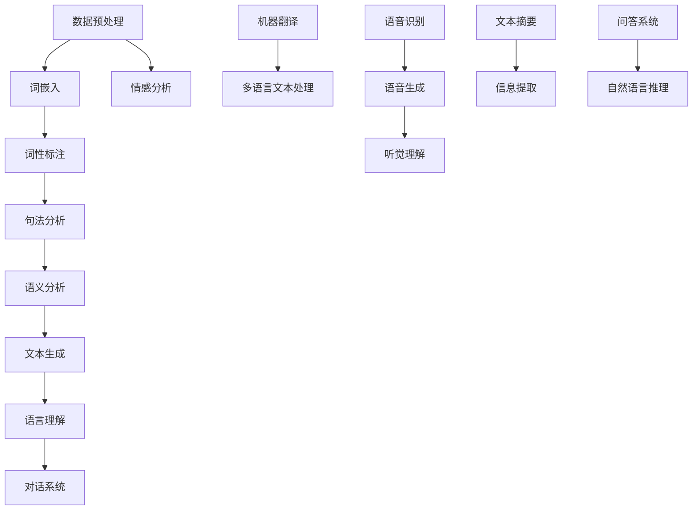

                 

# AI时代的自然语言处理：从实验室走向产业

## 关键词：
- 自然语言处理
- 人工智能
- 实验室技术
- 工业应用
- 技术转移
- 深度学习
- 产业变革

## 摘要：
本文探讨了自然语言处理（NLP）技术在AI时代从实验室研究到产业应用的过程。通过梳理NLP的核心概念与算法原理，分析了NLP在各个行业的实际应用，并提出了未来发展趋势与面临的挑战。文章旨在为读者提供关于NLP技术产业化的全面视角，以及对行业未来的深入思考。

## 1. 背景介绍

自然语言处理（NLP）是人工智能（AI）的一个重要分支，旨在让计算机理解和生成人类语言。NLP技术已经走过了几十年的发展历程，从最初的规则驱动的语言处理方法，到如今基于深度学习的强大模型，其技术水平和应用广度都在不断拓展。

### NLP技术发展历程

- **早期研究**：1950年代至1970年代，NLP主要依靠规则和词典匹配的方法，如句法分析和语义分析。
- **统计方法兴起**：1980年代，统计机器学习方法开始应用于NLP，如决策树、支持向量机等。
- **现代深度学习**：2000年后，深度学习技术的发展推动了NLP的飞跃，尤其是2010年代起，基于神经网络的模型（如循环神经网络RNN、长短期记忆LSTM、变换器模型Transformer等）在NLP任务中取得了显著成果。

### AI时代的重要性

随着大数据和计算能力的提升，AI技术逐步从理论研究走向实际应用。AI时代的到来不仅改变了人们的生产生活方式，还推动了各个行业的数字化转型。自然语言处理作为AI的核心技术之一，其应用涵盖了语言翻译、语音识别、文本分析、情感分析等多个领域，对人类社会的各个方面产生了深远影响。

## 2. 核心概念与联系

为了深入理解NLP技术，我们需要明确一些核心概念和它们之间的关系。以下是一个简单的Mermaid流程图，展示了NLP技术中的关键组成部分：



### 核心概念解释

- **数据预处理**：包括分词、去停用词、词形还原等步骤，目的是将原始文本转化为计算机可以处理的格式。
- **词嵌入**：将词汇映射到高维空间中的向量，是理解词汇之间关系的重要手段。
- **词性标注**：为文本中的每个词分配词性（如名词、动词等），有助于句法分析和语义理解。
- **句法分析**：分析句子结构，确定词与词之间的语法关系。
- **语义分析**：理解文本中的概念、关系和意义，是NLP的高级阶段。
- **文本生成**：根据特定任务生成符合语法和语义的文本。
- **语言理解**：包括语言理解模型（LUM）和语言生成模型（LGM），前者用于理解用户输入，后者用于生成响应。
- **情感分析**：判断文本中的情感倾向，如正面、负面或中性。
- **机器翻译**：将一种语言的文本翻译成另一种语言。
- **多语言文本处理**：处理包含多种语言的文本，如多语言词汇表、多语言实体识别等。
- **语音识别**：将语音信号转化为文本。
- **语音生成**：将文本转化为自然流畅的语音。
- **听觉理解**：理解语音中的含义，如语音助手、智能音箱等。
- **文本摘要**：从长文本中提取关键信息，生成简短的摘要。
- **信息提取**：从大量文本中提取特定信息，如关键词、句子等。
- **问答系统**：能够回答用户提出的问题。
- **自然语言推理**：理解文本中隐含的逻辑关系，如推理、类比等。

## 3. 核心算法原理 & 具体操作步骤

### 基于深度学习的NLP模型

目前，深度学习技术已经成为NLP领域的主流方法。以下是一些核心算法及其工作原理：

#### 3.1 循环神经网络（RNN）

循环神经网络（RNN）是一种能够处理序列数据的神经网络，其特点是在时间步上具有记忆能力。RNN通过递归地处理输入序列，将前一个时间步的输出作为下一个时间步的输入。

**具体操作步骤：**
1. **输入序列**：将文本序列转化为词嵌入向量。
2. **递归处理**：在每个时间步上，将当前词嵌入向量与上一个时间步的隐藏状态进行加权求和，并通过激活函数产生新的隐藏状态。
3. **输出生成**：利用最后一个时间步的隐藏状态生成预测结果。

#### 3.2 长短期记忆网络（LSTM）

长短期记忆网络（LSTM）是RNN的一种改进，能够更好地处理长序列数据。LSTM通过引入门控机制，有效地解决了RNN的梯度消失和梯度爆炸问题。

**具体操作步骤：**
1. **输入序列**：与RNN相同。
2. **门控机制**：利用输入门、遗忘门和输出门控制信息的传递和遗忘。
3. **细胞状态更新**：通过门控机制更新细胞状态，保留长序列信息。
4. **隐藏状态生成**：利用细胞状态生成隐藏状态。

#### 3.3 变换器模型（Transformer）

变换器模型（Transformer）是近年来在NLP领域取得突破性进展的一种新型模型。与RNN和LSTM不同，Transformer使用自注意力机制来处理序列数据，具有更高的并行计算效率。

**具体操作步骤：**
1. **输入序列**：将文本序列转化为词嵌入向量。
2. **自注意力机制**：计算输入序列中每个词与其他词之间的关联度，并加权求和生成新的向量表示。
3. **多头注意力**：通过多头注意力机制扩展自注意力机制，提高模型的表达能力。
4. **前馈网络**：对自注意力层的输出进行两次前馈神经网络处理。
5. **输出生成**：利用最后一个时间步的输出生成预测结果。

## 4. 数学模型和公式 & 详细讲解 & 举例说明

#### 4.1 循环神经网络（RNN）

RNN的核心是递归函数，其数学表达式如下：

$$
h_t = \sigma(W_h \cdot [h_{t-1}, x_t] + b_h)
$$

其中，$h_t$表示第$t$时间步的隐藏状态，$x_t$表示第$t$时间步的输入，$W_h$和$b_h$分别表示权重和偏置，$\sigma$为激活函数。

#### 4.2 长短期记忆网络（LSTM）

LSTM的核心是门控机制，其数学表达式如下：

$$
i_t = \sigma(W_i \cdot [h_{t-1}, x_t] + b_i) \\
f_t = \sigma(W_f \cdot [h_{t-1}, x_t] + b_f) \\
\bar{c_t} = \sigma(W_c \cdot [h_{t-1}, x_t] + b_c) \\
c_t = f_t \odot \bar{c_t} + i_t \odot \tilde{c_t} \\
h_t = \sigma(W_o \cdot [c_t, h_{t-1}] + b_o)
$$

其中，$i_t$、$f_t$、$\bar{c_t}$、$c_t$和$h_t$分别表示输入门、遗忘门、候选细胞状态、细胞状态和隐藏状态，$\odot$表示元素乘积，$\tilde{c_{t-1}}$为前一个时间步的细胞状态，$W_i$、$W_f$、$W_c$和$W_o$分别表示输入门、遗忘门、候选细胞状态和输出门的权重，$b_i$、$b_f$、$b_c$和$b_o$分别表示输入门、遗忘门、候选细胞状态和输出门的偏置。

#### 4.3 变换器模型（Transformer）

变换器模型的核心是自注意力机制，其数学表达式如下：

$$
\text{Attention}(Q, K, V) = \text{softmax}\left(\frac{QK^T}{\sqrt{d_k}}\right)V
$$

其中，$Q$、$K$和$V$分别表示查询向量、键向量和值向量，$d_k$为键向量的维度，$\text{softmax}$函数用于计算每个键与查询的相似度，并加权求和生成值向量。

### 举例说明

假设我们有一个简单的句子“我喜欢吃苹果”，我们可以将其分解为以下步骤：

1. **词嵌入**：将每个词映射为高维向量。
2. **自注意力计算**：计算句子中每个词与其他词的关联度。
3. **加权求和**：根据关联度对词向量进行加权求和，生成新的句子向量。
4. **输出生成**：利用句子向量生成预测结果。

通过这些数学模型和公式的计算，我们可以实现从文本输入到语义理解的完整过程。

## 5. 项目实战：代码实际案例和详细解释说明

#### 5.1 开发环境搭建

为了演示NLP技术的应用，我们将使用Python编程语言和TensorFlow库来构建一个简单的文本分类模型。以下是开发环境的搭建步骤：

1. **安装Python**：下载并安装Python 3.x版本。
2. **安装TensorFlow**：通过pip命令安装TensorFlow库。
   ```bash
   pip install tensorflow
   ```

#### 5.2 源代码详细实现和代码解读

以下是使用TensorFlow构建文本分类模型的主要代码实现：

```python
import tensorflow as tf
from tensorflow.keras.preprocessing.sequence import pad_sequences
from tensorflow.keras.layers import Embedding, LSTM, Dense
from tensorflow.keras.models import Sequential

# 5.2.1 数据准备
# 假设我们有一个包含正负样本的数据集
sentences = ['I love this product', 'This is a bad product', 'Great service!', 'Very poor experience']
labels = [1, 0, 1, 0]  # 1表示正面，0表示负面

# 将文本序列转化为整数序列
tokenizer = tf.keras.preprocessing.text.Tokenizer()
tokenizer.fit_on_texts(sentences)
sequences = tokenizer.texts_to_sequences(sentences)

# 填充序列，使每个序列的长度相等
max_len = max(len(seq) for seq in sequences)
padded_sequences = pad_sequences(sequences, maxlen=max_len)

# 5.2.2 构建模型
model = Sequential([
    Embedding(input_dim=len(tokenizer.word_index) + 1, output_dim=64, input_length=max_len),
    LSTM(128),
    Dense(1, activation='sigmoid')
])

# 编译模型
model.compile(optimizer='adam', loss='binary_crossentropy', metrics=['accuracy'])

# 训练模型
model.fit(padded_sequences, labels, epochs=100, verbose=2)

# 5.2.3 代码解读
# 1. 数据准备：使用Tokenizer将文本转化为整数序列，使用pad_sequences将序列填充为相同长度。
# 2. 模型构建：使用Sequential模型堆叠Embedding、LSTM和Dense层。
# 3. 编译模型：指定优化器、损失函数和评价指标。
# 4. 训练模型：使用fit方法训练模型。
```

#### 5.3 代码解读与分析

上述代码实现了一个简单的文本分类模型，其主要步骤包括数据准备、模型构建、模型编译和模型训练。

- **数据准备**：使用Tokenizer将文本转化为整数序列，使用pad_sequences将序列填充为相同长度。这是NLP任务中常见的预处理步骤。
- **模型构建**：使用Sequential模型堆叠Embedding、LSTM和Dense层。Embedding层将词汇映射为向量，LSTM层处理序列数据，Dense层输出分类结果。
- **模型编译**：指定优化器、损失函数和评价指标。在本例中，使用adam优化器、binary_crossentropy损失函数和accuracy评价指标。
- **模型训练**：使用fit方法训练模型。通过迭代优化模型参数，使模型能够更好地分类文本。

通过这个简单的案例，我们可以看到NLP技术在实际项目中的应用。在实际开发中，还可以根据需求添加更多的NLP组件和模型层，如词性标注、情感分析等。

## 6. 实际应用场景

自然语言处理技术在多个行业和领域有着广泛的应用，以下是几个典型的实际应用场景：

### 6.1 智能客服

智能客服是NLP技术在服务行业的重要应用。通过自然语言理解技术，智能客服系统能够自动回答用户的问题，提供即时的服务和支持。这不仅提高了客户满意度，还降低了人工客服的工作量。

### 6.2 聊天机器人

聊天机器人是一种基于NLP技术的智能交互系统。它们能够与用户进行自然语言对话，提供娱乐、咨询、建议等服务。聊天机器人的广泛应用使得人们能够更便捷地获取信息和进行沟通。

### 6.3 情感分析

情感分析是NLP技术在社交媒体分析、市场调研等领域的重要应用。通过分析用户发布的文本，情感分析技术能够识别用户的情感倾向，帮助企业了解用户需求和满意度。

### 6.4 语言翻译

语言翻译是NLP技术的经典应用之一。随着深度学习技术的发展，机器翻译的准确性得到了显著提升。如今，机器翻译系统已经在国际商务、旅游、文化交流等领域发挥着重要作用。

### 6.5 文本摘要

文本摘要技术能够从长文本中提取关键信息，生成简短的摘要。这对于信息检索、新闻摘要、文档分类等领域具有重要意义。通过文本摘要技术，用户能够快速了解文本的核心内容。

### 6.6 信息提取

信息提取技术能够从大量文本中提取特定信息，如关键词、句子、实体等。这对于数据挖掘、知识图谱构建、智能问答等领域具有重要意义。通过信息提取技术，系统能够更好地理解和利用文本数据。

## 7. 工具和资源推荐

为了更好地学习和应用自然语言处理技术，以下是一些推荐的工具和资源：

### 7.1 学习资源推荐

- **书籍**：
  - 《自然语言处理综论》（Jurafsky和Martin著）
  - 《深度学习》（Goodfellow、Bengio和Courville著）
- **在线课程**：
  - Coursera上的“自然语言处理与深度学习”课程
  - edX上的“深度学习专项课程”中的NLP部分
- **论文集**：
  - ACL会议论文集
  - EMNLP会议论文集

### 7.2 开发工具框架推荐

- **框架**：
  - TensorFlow
  - PyTorch
  - spaCy
- **库**：
  - NLTK（自然语言工具包）
  - textblob
  -gensim

### 7.3 相关论文著作推荐

- **论文**：
  - “A Neural Probabilistic Language Model” by Yoshua Bengio等
  - “Attention is All You Need” by Vaswani等
- **著作**：
  - 《自然语言处理综论》
  - 《深度学习》

## 8. 总结：未来发展趋势与挑战

自然语言处理技术在AI时代的发展具有广阔的前景。随着深度学习和大数据技术的不断进步，NLP技术将更加成熟和高效。以下是未来发展趋势和面临的挑战：

### 8.1 发展趋势

1. **多模态处理**：未来NLP技术将结合语音、图像、视频等多模态数据，实现更丰富的语言理解和交互。
2. **泛化能力提升**：通过迁移学习和元学习等技术，NLP模型将能够在不同任务和数据集上实现更好的泛化能力。
3. **实时处理能力**：随着计算资源的提升，NLP技术将实现更快的实时处理，满足实时应用的需求。
4. **跨语言处理**：通过多语言模型和翻译技术，实现跨语言的语义理解和交互。

### 8.2 面临的挑战

1. **数据隐私**：NLP技术需要处理大量的用户数据，如何保护用户隐私是一个重要的挑战。
2. **模型解释性**：当前NLP模型的解释性较差，如何提高模型的透明度和可解释性是未来的一个重要研究方向。
3. **文化差异**：NLP技术在不同语言和文化背景下的表现差异较大，如何克服文化差异是实现全球化的一个关键问题。
4. **伦理问题**：随着NLP技术的广泛应用，如何确保技术不被滥用，避免对人类造成负面影响是一个重要的伦理问题。

## 9. 附录：常见问题与解答

### 9.1 什么是自然语言处理（NLP）？

自然语言处理（NLP）是人工智能（AI）的一个分支，旨在让计算机理解和生成人类语言。它涉及从文本中提取信息、分析语义、生成文本等多种技术。

### 9.2 NLP有哪些主要应用领域？

NLP的主要应用领域包括智能客服、聊天机器人、情感分析、语言翻译、文本摘要、信息提取等。

### 9.3 NLP的核心算法有哪些？

NLP的核心算法包括循环神经网络（RNN）、长短期记忆网络（LSTM）、变换器模型（Transformer）等。

### 9.4 如何搭建NLP开发环境？

搭建NLP开发环境通常需要安装Python、TensorFlow或PyTorch等库。可以参考相关教程或使用一键安装包进行安装。

### 9.5 NLP技术在未来的发展趋势是什么？

未来NLP技术将向多模态处理、泛化能力提升、实时处理能力和跨语言处理等方向发展。

## 10. 扩展阅读 & 参考资料

- [Jurafsky, Daniel, and James H. Martin. "Speech and Language Processing." 2nd ed., Pearson, 2008.]
- [Goodfellow, Ian, Yoshua Bengio, and Aaron Courville. "Deep Learning." MIT Press, 2016.]
- [Vaswani, Ashish, Noam Shazeer, et al. "Attention is All You Need." Advances in Neural Information Processing Systems, 2017.]
- [清华大学计算机系. "自然语言处理教程." 清华大学出版社, 2017.]

