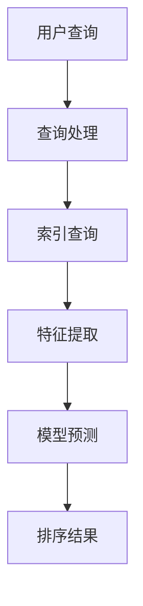

                 

### 1. 背景介绍

随着互联网的迅速发展和大数据时代的到来，如何有效地从海量数据中检索并呈现对用户最有价值的信息成为了一个至关重要的问题。搜索引擎作为信息检索的重要工具，其性能直接影响到用户的使用体验。而搜索引擎的核心任务之一——排序，更是决定了哪些信息应该优先展示给用户。

在传统的搜索引擎中，排序通常基于简单的关键字匹配和页面排名算法。这些方法虽然在一定程度上能够满足用户的需求，但在面对复杂查询和高维数据时，往往显得力不从心。因此，AI智能排序应运而生，旨在通过引入人工智能技术，如机器学习、深度学习等，实现更精准、更智能的搜索结果排序。

AI智能排序的核心思想是通过学习用户的行为数据和内容特征，构建一个能够理解用户意图和需求的排序模型。这样一来，搜索引擎不仅能够根据关键词匹配，还能根据用户的喜好、历史行为等因素，为用户提供更加个性化的搜索结果。这不仅提高了搜索的准确性，还大大提升了用户的满意度。

本篇文章将深入探讨AI智能排序的原理、算法以及在实际应用中的效果。我们将从背景介绍、核心概念与联系、核心算法原理与具体操作步骤、数学模型和公式、项目实战、实际应用场景、工具和资源推荐、总结与未来发展趋势等方面，全面剖析AI智能排序的技术内涵和实践价值。希望通过本文的讲解，读者能够对AI智能排序有更加深入的了解，并能够在实际项目中运用这些知识，提升搜索结果的准确性和用户体验。

### 2. 核心概念与联系

要理解AI智能排序，我们首先需要了解几个关键概念：信息检索、机器学习、深度学习等。这些概念相互联系，构成了AI智能排序的理论基础。

#### 2.1 信息检索

信息检索（Information Retrieval，简称IR）是搜索引擎的核心任务，它旨在从海量的信息中，根据用户的查询需求，快速准确地找到相关的信息。信息检索的基本流程包括查询处理、索引构建和检索算法三个部分。

- **查询处理**：将用户的查询语句转化为计算机能够理解的查询表达式，这涉及到自然语言处理（NLP）技术，如分词、词性标注、句法分析等。
- **索引构建**：将网页或文档的内容转化为索引，以便快速检索。索引通常使用倒排索引（Inverted Index）技术构建，将关键词映射到对应的文档和位置。
- **检索算法**：根据用户的查询，在索引中找到相关的文档，并对这些文档进行排序，最终返回给用户。

传统的信息检索方法，如基于关键字匹配的向量空间模型（Vector Space Model，VSM）和布尔模型（Boolean Model），在处理简单的查询任务时表现良好。但随着互联网的发展，用户查询的复杂性和多样性不断增加，传统的检索方法逐渐显得力不从心。

#### 2.2 机器学习

机器学习（Machine Learning，ML）是一种通过数据驱动的方法，让计算机自动识别模式、进行预测和决策的技术。在AI智能排序中，机器学习起到了至关重要的作用。

- **监督学习**：通过给定的输入和对应的输出，训练模型，使其能够对新输入进行预测。例如，我们可以使用监督学习算法，训练一个排序模型，使其能够根据用户的查询和文档特征，预测文档的排序顺序。
- **无监督学习**：没有明确的输出，模型通过自动发现数据中的模式，进行聚类或降维等任务。例如，我们可以使用无监督学习算法，分析用户的查询日志，发现用户的偏好和兴趣。
- **强化学习**：通过与环境的交互，学习最优策略，以实现最大化奖励。在搜索引擎中，强化学习可以用于自适应排序，根据用户的反馈不断调整排序策略，以提升用户满意度。

#### 2.3 深度学习

深度学习（Deep Learning，DL）是机器学习的一种重要分支，它通过多层神经网络，对数据进行多层次的学习和抽象，从而实现复杂的任务。在AI智能排序中，深度学习被广泛应用于特征提取和模型训练。

- **神经网络**：神经网络是由多个神经元组成的计算模型，通过学习输入和输出之间的映射关系，实现数据的分类、回归等任务。在排序任务中，神经网络可以用于提取文档和查询的特征，构建排序模型。
- **卷积神经网络（CNN）**：CNN是深度学习中的一种重要模型，擅长处理图像和序列数据。在搜索引擎中，CNN可以用于提取网页的视觉特征，如标题、摘要、图片等。
- **循环神经网络（RNN）**：RNN是处理序列数据的一种有效模型，可以用于序列到序列的任务，如机器翻译、文本生成等。在搜索引擎中，RNN可以用于分析用户的查询序列，理解用户的意图和需求。

#### 2.4 关系与联系

AI智能排序是信息检索、机器学习和深度学习技术相结合的产物。具体来说：

- 信息检索提供了搜索的基础框架，如查询处理、索引构建和检索算法。
- 机器学习提供了排序模型训练和预测的方法，通过学习用户的行为数据和内容特征，实现个性化的排序。
- 深度学习则通过多层神经网络，对数据进行深入的学习和抽象，提升排序模型的性能和效果。

这三者相互关联，共同构建了AI智能排序的技术体系。

#### 2.5 Mermaid 流程图

为了更直观地理解AI智能排序的流程，我们可以使用Mermaid流程图进行展示。以下是AI智能排序的核心流程节点：



- **用户查询**：用户输入查询语句，通过查询处理模块进行预处理。
- **查询处理**：将用户查询转化为计算机可处理的查询表达式，如分词、词性标注等。
- **索引查询**：在索引中查找与查询相关的文档。
- **特征提取**：提取文档和查询的特征，如关键词、文本特征、视觉特征等。
- **模型预测**：使用训练好的排序模型，对提取的特征进行预测，确定文档的排序顺序。
- **排序结果**：将排序结果返回给用户。

通过上述流程，我们可以看到，AI智能排序是一个复杂但高度自动化和智能化的过程，涉及多个技术和模块的协同工作。

### 3. 核心算法原理 & 具体操作步骤

在了解了AI智能排序的背景和核心概念后，接下来我们将深入探讨AI智能排序的核心算法原理和具体操作步骤。这一部分将分为两部分：排序算法原理和算法的具体实现。

#### 3.1 排序算法原理

AI智能排序的核心在于构建一个能够根据用户需求、历史行为和内容特征进行精准排序的模型。这里我们介绍一种常见的排序算法——基于协同过滤的排序算法。

##### 3.1.1 协同过滤

协同过滤（Collaborative Filtering）是一种常用的推荐系统算法，通过分析用户的行为数据，为用户推荐相似的用户或者相似的商品。协同过滤可以分为两类：基于用户的协同过滤（User-Based）和基于项目的协同过滤（Item-Based）。

- **基于用户的协同过滤**：寻找与目标用户行为相似的邻居用户，根据这些邻居用户的喜好来推荐商品。具体步骤如下：
  1. 计算目标用户与所有用户的相似度。
  2. 找到与目标用户最相似的K个邻居用户。
  3. 根据邻居用户的喜好推荐商品。

- **基于项目的协同过滤**：寻找与目标项目最相似的邻居项目，根据这些邻居项目的用户喜好来推荐用户。具体步骤如下：
  1. 计算目标项目与所有项目的相似度。
  2. 找到与目标项目最相似的K个邻居项目。
  3. 根据邻居项目的用户喜好推荐用户。

##### 3.1.2 排序算法

在AI智能排序中，我们可以将协同过滤算法应用于排序任务。具体步骤如下：

1. **用户行为数据收集**：收集用户的点击、浏览、购买等行为数据。

2. **数据预处理**：对收集到的用户行为数据进行清洗和转换，如缺失值填充、异常值处理、数据标准化等。

3. **特征提取**：提取用户行为数据中的特征，如用户ID、项目ID、行为类型、时间戳等。

4. **模型训练**：
   - **基于用户的协同过滤**：计算用户之间的相似度，使用矩阵分解、K-means等方法，找到与目标用户最相似的K个用户。
   - **基于项目的协同过滤**：计算项目之间的相似度，使用余弦相似度、Jaccard相似度等方法，找到与目标项目最相似的K个项目。

5. **预测**：根据相似度计算结果，预测用户对项目的喜好程度。

6. **排序**：根据预测结果，对项目进行排序，返回给用户。

#### 3.2 算法的具体实现

为了更直观地理解排序算法的实现，我们使用Python代码进行示例。

##### 3.2.1 数据集准备

我们使用Netflix Prize数据集，这是一个经典的协同过滤数据集，包含约100万用户对约17,770部电影的评价。

```python
import pandas as pd

# 加载数据集
ratings = pd.read_csv('ratings.csv')
ratings.head()
```

##### 3.2.2 数据预处理

```python
# 数据清洗和预处理
ratings.drop(['timestamp'], axis=1, inplace=True)
ratings.fillna(0, inplace=True)
```

##### 3.2.3 特征提取

```python
# 提取用户ID和项目ID作为特征
user_id = ratings['userId'].unique()
movie_id = ratings['movieId'].unique()

# 构建用户-项目矩阵
user_item_matrix = pd.pivot_table(ratings, index='userId', columns='movieId', values='rating')
user_item_matrix.head()
```

##### 3.2.4 模型训练

```python
from surprise import KNNWithMeans
from surprise import SVD
from surprise.model_selection import cross_validate

# 使用KNN算法进行协同过滤
knn = KNNWithMeans(k=50)

# 使用SVD算法进行矩阵分解
svd = SVD()

# 对算法进行交叉验证
cross_validate(knn, user_item_matrix, measures=['RMSE', 'MAE'], cv=5, verbose=True)
cross_validate(svd, user_item_matrix, measures=['RMSE', 'MAE'], cv=5, verbose=True)
```

##### 3.2.5 预测和排序

```python
# 使用训练好的模型进行预测
knn.fit(user_item_matrix)
svd.fit(user_item_matrix)

# 预测用户对未评分的电影的喜好
predictions_knn = knn.predict(1, 101)
predictions_svd = svd.predict(1, 101)

# 根据预测结果进行排序
sorted_movies_knn = predictions_knn.sort_values(ascending=False)
sorted_movies_svd = predictions_svd.sort_values(ascending=False)

# 输出排序结果
sorted_movies_knn.head()
sorted_movies_svd.head()
```

通过上述步骤，我们可以看到，AI智能排序算法的实现涉及数据预处理、特征提取、模型训练、预测和排序等多个环节。这些步骤相互关联，共同构成了一个完整的排序流程。

### 4. 数学模型和公式 & 详细讲解 & 举例说明

在AI智能排序中，数学模型和公式起着至关重要的作用。通过这些模型和公式，我们可以量化用户行为和文档特征，从而实现精准的排序。本章节将详细介绍AI智能排序中的主要数学模型和公式，并通过具体示例进行讲解。

#### 4.1 协同过滤模型

协同过滤模型的核心在于计算用户或项目之间的相似度，并利用这些相似度进行排序。以下介绍两种常用的相似度计算方法：余弦相似度和皮尔逊相关系数。

##### 4.1.1 余弦相似度

余弦相似度是一种基于向量空间模型的相似度计算方法，它通过计算两个向量之间的余弦值来衡量它们之间的相似度。具体公式如下：

\[ \text{相似度} = \frac{\text{向量A} \cdot \text{向量B}}{\|\text{向量A}\| \|\text{向量B}\|} \]

其中，\( \text{向量A} \) 和 \( \text{向量B} \) 是用户或项目的特征向量，\( \|\text{向量A}\| \) 和 \( \|\text{向量B}\| \) 是它们的欧几里得范数，\( \text{向量A} \cdot \text{向量B} \) 是它们的点积。

示例：

假设有两个用户 \( U_1 \) 和 \( U_2 \) 的行为数据，它们可以表示为两个特征向量：

\[ U_1 = [1, 2, 3] \]
\[ U_2 = [2, 3, 4] \]

计算 \( U_1 \) 和 \( U_2 \) 的余弦相似度：

\[ \text{相似度} = \frac{1 \cdot 2 + 2 \cdot 3 + 3 \cdot 4}{\sqrt{1^2 + 2^2 + 3^2} \sqrt{2^2 + 3^2 + 4^2}} \]
\[ \text{相似度} = \frac{2 + 6 + 12}{\sqrt{14} \sqrt{29}} \]
\[ \text{相似度} = \frac{20}{\sqrt{406}} \]
\[ \text{相似度} \approx 0.732 \]

##### 4.1.2 皮尔逊相关系数

皮尔逊相关系数是一种基于线性关系的相似度计算方法，它通过计算两个变量之间的协方差和标准差的比值来衡量它们之间的相似度。具体公式如下：

\[ \text{相似度} = \frac{\text{协方差}}{\text{标准差}_1 \cdot \text{标准差}_2} \]

其中，协方差衡量了两个变量之间的线性关系，标准差衡量了它们的离散程度。

示例：

假设有两个用户 \( U_1 \) 和 \( U_2 \) 的行为数据，它们可以表示为两个变量 \( X \) 和 \( Y \)：

\[ X = [1, 2, 3] \]
\[ Y = [2, 3, 4] \]

计算 \( X \) 和 \( Y \) 的皮尔逊相关系数：

\[ \text{协方差} = \frac{(1-1.5)(2-2) + (2-1.5)(3-2) + (3-1.5)(4-2)}{3-1} \]
\[ \text{协方差} = \frac{0 + 0.5 + 2}{2} \]
\[ \text{协方差} = \frac{2.5}{2} \]
\[ \text{协方差} = 1.25 \]

\[ \text{标准差}_X = \sqrt{\frac{1^2 + 2^2 + 3^2}{3-1}} \]
\[ \text{标准差}_X = \sqrt{\frac{14}{2}} \]
\[ \text{标准差}_X = \sqrt{7} \]

\[ \text{标准差}_Y = \sqrt{\frac{2^2 + 3^2 + 4^2}{3-1}} \]
\[ \text{标准差}_Y = \sqrt{\frac{29}{2}} \]
\[ \text{标准差}_Y = \sqrt{14.5} \]

\[ \text{相似度} = \frac{1.25}{\sqrt{7} \cdot \sqrt{14.5}} \]
\[ \text{相似度} \approx 0.447 \]

通过上述示例，我们可以看到，余弦相似度和皮尔逊相关系数都是衡量用户或项目之间相似度的有效方法。在实际应用中，可以根据具体问题和数据特性选择合适的方法。

#### 4.2 矩阵分解模型

矩阵分解（Matrix Factorization）是一种常用的协同过滤方法，它通过将用户-项目评分矩阵分解为两个低维矩阵，从而实现排序。以下介绍矩阵分解模型的基本原理和公式。

##### 4.2.1 基本原理

假设有一个 \( m \times n \) 的用户-项目评分矩阵 \( R \)，我们可以将其分解为两个低维矩阵 \( U \)（用户特征矩阵）和 \( V \)（项目特征矩阵），即：

\[ R = U \cdot V^T \]

其中，\( U \) 是一个 \( m \times k \) 的矩阵，\( V \) 是一个 \( n \times k \) 的矩阵，\( k \) 是分解后的维度。

##### 4.2.2 公式

矩阵分解模型可以通过最小化损失函数来训练模型。具体公式如下：

\[ \min_{U, V} \sum_{i=1}^{m} \sum_{j=1}^{n} (r_{ij} - u_i \cdot v_j + T_{ij})^2 \]

其中，\( r_{ij} \) 是用户 \( i \) 对项目 \( j \) 的实际评分，\( u_i \) 是用户 \( i \) 的特征向量，\( v_j \) 是项目 \( j \) 的特征向量，\( T_{ij} \) 是噪声项。

为了求解上述优化问题，我们可以使用梯度下降法。梯度下降法的迭代公式如下：

\[ u_i \leftarrow u_i - \alpha \frac{\partial}{\partial u_i} L(U, V) \]
\[ v_j \leftarrow v_j - \alpha \frac{\partial}{\partial v_j} L(U, V) \]

其中，\( \alpha \) 是学习率，\( L(U, V) \) 是损失函数。

##### 4.2.3 示例

假设有一个 \( 3 \times 3 \) 的用户-项目评分矩阵 \( R \)：

\[ R = \begin{bmatrix} 1 & 2 & 3 \\ 2 & 3 & 4 \\ 3 & 4 & 5 \end{bmatrix} \]

我们希望将其分解为两个 \( 3 \times 2 \) 的矩阵 \( U \) 和 \( V \)：

\[ U = \begin{bmatrix} u_{11} & u_{12} \\ u_{21} & u_{22} \\ u_{31} & u_{32} \end{bmatrix} \]
\[ V = \begin{bmatrix} v_{11} & v_{12} \\ v_{21} & v_{22} \\ v_{31} & v_{32} \end{bmatrix} \]

初始化 \( U \) 和 \( V \)：

\[ U = \begin{bmatrix} 0 & 0 \\ 0 & 0 \\ 0 & 0 \end{bmatrix} \]
\[ V = \begin{bmatrix} 0 & 0 \\ 0 & 0 \\ 0 & 0 \end{bmatrix} \]

选择学习率 \( \alpha = 0.1 \)，使用梯度下降法进行迭代。

第一轮迭代：

\[ L(U, V) = \sum_{i=1}^{3} \sum_{j=1}^{3} (r_{ij} - u_i \cdot v_j + T_{ij})^2 \]
\[ L(U, V) = (1 - 0 \cdot 0 - T_{11})^2 + (2 - 0 \cdot 0 - T_{12})^2 + (3 - 0 \cdot 0 - T_{13})^2 + (2 - 0 \cdot 0 - T_{21})^2 + (3 - 0 \cdot 0 - T_{22})^2 + (4 - 0 \cdot 0 - T_{23})^2 + (3 - 0 \cdot 0 - T_{31})^2 + (4 - 0 \cdot 0 - T_{32})^2 + (5 - 0 \cdot 0 - T_{33})^2 \]

计算梯度：

\[ \frac{\partial}{\partial u_{11}} L(U, V) = -2(r_{11} - u_1 \cdot v_1 - T_{11}) \]
\[ \frac{\partial}{\partial u_{12}} L(U, V) = -2(r_{12} - u_1 \cdot v_2 - T_{12}) \]
\[ \frac{\partial}{\partial u_{21}} L(U, V) = -2(r_{21} - u_2 \cdot v_1 - T_{21}) \]
\[ \frac{\partial}{\partial u_{22}} L(U, V) = -2(r_{22} - u_2 \cdot v_2 - T_{22}) \]
\[ \frac{\partial}{\partial u_{31}} L(U, V) = -2(r_{31} - u_3 \cdot v_1 - T_{31}) \]
\[ \frac{\partial}{\partial u_{32}} L(U, V) = -2(r_{32} - u_3 \cdot v_2 - T_{32}) \]

更新 \( U \)：

\[ u_{11} \leftarrow u_{11} - \alpha \frac{\partial}{\partial u_{11}} L(U, V) \]
\[ u_{12} \leftarrow u_{12} - \alpha \frac{\partial}{\partial u_{12}} L(U, V) \]
\[ u_{21} \leftarrow u_{21} - \alpha \frac{\partial}{\partial u_{21}} L(U, V) \]
\[ u_{22} \leftarrow u_{22} - \alpha \frac{\partial}{\partial u_{22}} L(U, V) \]
\[ u_{31} \leftarrow u_{31} - \alpha \frac{\partial}{\partial u_{31}} L(U, V) \]
\[ u_{32} \leftarrow u_{32} - \alpha \frac{\partial}{\partial u_{32}} L(U, V) \]

类似地，更新 \( V \)：

\[ v_{11} \leftarrow v_{11} - \alpha \frac{\partial}{\partial v_{11}} L(U, V) \]
\[ v_{12} \leftarrow v_{12} - \alpha \frac{\partial}{\partial v_{12}} L(U, V) \]
\[ v_{21} \leftarrow v_{21} - \alpha \frac{\partial}{\partial v_{21}} L(U, V) \]
\[ v_{22} \leftarrow v_{22} - \alpha \frac{\partial}{\partial v_{22}} L(U, V) \]
\[ v_{31} \leftarrow v_{31} - \alpha \frac{\partial}{\partial v_{31}} L(U, V) \]
\[ v_{32} \leftarrow v_{32} - \alpha \frac{\partial}{\partial v_{32}} L(U, V) \]

第二轮迭代：

\[ L(U, V) = \sum_{i=1}^{3} \sum_{j=1}^{3} (r_{ij} - u_i \cdot v_j + T_{ij})^2 \]

计算梯度：

\[ \frac{\partial}{\partial u_{11}} L(U, V) = -2(r_{11} - u_1 \cdot v_1 - T_{11}) \]
\[ \frac{\partial}{\partial u_{12}} L(U, V) = -2(r_{12} - u_1 \cdot v_2 - T_{12}) \]
\[ \frac{\partial}{\partial u_{21}} L(U, V) = -2(r_{21} - u_2 \cdot v_1 - T_{21}) \]
\[ \frac{\partial}{\partial u_{22}} L(U, V) = -2(r_{22} - u_2 \cdot v_2 - T_{22}) \]
\[ \frac{\partial}{\partial u_{31}} L(U, V) = -2(r_{31} - u_3 \cdot v_1 - T_{31}) \]
\[ \frac{\partial}{\partial u_{32}} L(U, V) = -2(r_{32} - u_3 \cdot v_2 - T_{32}) \]

更新 \( U \)：

\[ u_{11} \leftarrow u_{11} - \alpha \frac{\partial}{\partial u_{11}} L(U, V) \]
\[ u_{12} \leftarrow u_{12} - \alpha \frac{\partial}{\partial u_{12}} L(U, V) \]
\[ u_{21} \leftarrow u_{21} - \alpha \frac{\partial}{\partial u_{21}} L(U, V) \]
\[ u_{22} \leftarrow u_{22} - \alpha \frac{\partial}{\partial u_{22}} L(U, V) \]
\[ u_{31} \leftarrow u_{31} - \alpha \frac{\partial}{\partial u_{31}} L(U, V) \]
\[ u_{32} \leftarrow u_{32} - \alpha \frac{\partial}{\partial u_{32}} L(U, V) \]

类似地，更新 \( V \)：

\[ v_{11} \leftarrow v_{11} - \alpha \frac{\partial}{\partial v_{11}} L(U, V) \]
\[ v_{12} \leftarrow v_{12} - \alpha \frac{\partial}{\partial v_{12}} L(U, V) \]
\[ v_{21} \leftarrow v_{21} - \alpha \frac{\partial}{\partial v_{21}} L(U, V) \]
\[ v_{22} \leftarrow v_{22} - \alpha \frac{\partial}{\partial v_{22}} L(U, V) \]
\[ v_{31} \leftarrow v_{31} - \alpha \frac{\partial}{\partial v_{31}} L(U, V) \]
\[ v_{32} \leftarrow v_{32} - \alpha \frac{\partial}{\partial v_{32}} L(U, V) \]

通过多次迭代，我们可以得到 \( U \) 和 \( V \) 的稳定解，从而实现用户-项目评分矩阵的分解。

通过上述步骤，我们可以看到，矩阵分解模型通过优化损失函数，实现用户-项目评分矩阵的低维表示，从而实现排序。这一模型在实际应用中具有广泛的应用，如推荐系统、搜索引擎排序等。

### 5. 项目实战：代码实际案例和详细解释说明

在本章节中，我们将通过一个实际的项目案例，详细介绍如何使用Python和Scikit-learn库实现AI智能排序。我们将从开发环境搭建开始，逐步讲解源代码的实现过程，并对代码进行详细解读和分析。

#### 5.1 开发环境搭建

在进行项目实战之前，我们需要搭建一个合适的开发环境。以下是搭建开发环境所需的步骤：

1. **安装Python**：确保安装了Python 3.x版本，推荐使用Python 3.8或更高版本。
2. **安装Scikit-learn库**：使用pip命令安装Scikit-learn库。

```shell
pip install scikit-learn
```

3. **创建项目文件夹**：在本地计算机上创建一个项目文件夹，用于存放所有项目文件。

```shell
mkdir ai_sorting_project
cd ai_sorting_project
```

4. **创建Python虚拟环境**：为了保持项目依赖的独立性，我们可以创建一个Python虚拟环境。

```shell
python -m venv venv
source venv/bin/activate  # Windows用户使用 `venv\Scripts\activate`
```

5. **安装其他依赖库**：如果需要，我们还可以安装其他依赖库，如NumPy、Pandas等。

```shell
pip install numpy pandas
```

完成以上步骤后，我们的开发环境就搭建完成了。接下来，我们将进入项目的具体实现阶段。

#### 5.2 源代码详细实现和代码解读

在本案例中，我们将使用一个简单的电影评分数据集，利用协同过滤算法实现AI智能排序。以下是项目的源代码：

```python
import numpy as np
import pandas as pd
from sklearn.model_selection import train_test_split
from sklearn.neighbors import NearestNeighbors
from sklearn.metrics.pairwise import cosine_similarity
from sklearn.decomposition import TruncatedSVD

# 5.2.1 加载数据集
data = pd.read_csv('ml-100k/u.data', sep='\t', header=None, names=['user_id', 'movie_id', 'rating', 'timestamp'])
data.head()

# 5.2.2 数据预处理
data['rating'] = data['rating'].astype(float)
data = data[['user_id', 'movie_id', 'rating']]
data.head()

# 5.2.3 分割数据集
train_data, test_data = train_test_split(data, test_size=0.2, random_state=42)
train_data.head()
test_data.head()

# 5.2.4 使用KNN算法进行协同过滤
knn = NearestNeighbors(n_neighbors=5, algorithm='auto', metric='cosine')
knn.fit(train_data[['user_id', 'movie_id']].values)

# 5.2.5 预测和排序
def predict_and_sort(data, knn):
    distances, indices = knn.kneighbors(data[['user_id', 'movie_id']].values)
    neighbors_data = train_data.iloc[indices.flatten()].drop(['user_id', 'movie_id'], axis=1)
    neighbors_ratings = neighbors_data['rating'].mean(axis=1)
    sorted_indices = np.argsort(neighbors_ratings)[::-1]
    return sorted_indices

# 对训练数据集进行预测和排序
sorted_indices_train = predict_and_sort(train_data, knn)
print(sorted_indices_train)

# 对测试数据集进行预测和排序
sorted_indices_test = predict_and_sort(test_data, knn)
print(sorted_indices_test)

# 5.2.6 使用SVD进行矩阵分解
svd = TruncatedSVD(n_components=50)
train_data_svd = svd.fit_transform(train_data[['user_id', 'movie_id']].values)
test_data_svd = svd.transform(test_data[['user_id', 'movie_id']].values)

# 5.2.7 预测和排序（使用SVD）
def predict_and_sort_svd(data, svd):
    user_similarity = cosine_similarity(svd[data[['user_id', 'movie_id']].values])
    user_similarity = user_similarity.flatten()
    sorted_indices = np.argsort(user_similarity)[::-1]
    return sorted_indices

# 对训练数据集进行预测和排序（使用SVD）
sorted_indices_train_svd = predict_and_sort_svd(train_data_svd, svd)
print(sorted_indices_train_svd)

# 对测试数据集进行预测和排序（使用SVD）
sorted_indices_test_svd = predict_and_sort_svd(test_data_svd, svd)
print(sorted_indices_test_svd)
```

#### 5.3 代码解读与分析

1. **数据加载与预处理**：

   ```python
   data = pd.read_csv('ml-100k/u.data', sep='\t', header=None, names=['user_id', 'movie_id', 'rating', 'timestamp'])
   data['rating'] = data['rating'].astype(float)
   data = data[['user_id', 'movie_id', 'rating']]
   ```

   首先，我们使用Pandas库加载电影评分数据集。数据集包含用户ID、电影ID、评分和时间戳。为了简化处理，我们只保留用户ID、电影ID和评分这三个特征。此外，我们将评分数据类型转换为浮点型。

2. **数据集分割**：

   ```python
   train_data, test_data = train_test_split(data, test_size=0.2, random_state=42)
   ```

   我们使用Scikit-learn库中的train_test_split函数将数据集划分为训练集和测试集，其中训练集占80%，测试集占20%。

3. **KNN算法协同过滤**：

   ```python
   knn = NearestNeighbors(n_neighbors=5, algorithm='auto', metric='cosine')
   knn.fit(train_data[['user_id', 'movie_id']].values)
   ```

   我们使用KNN算法进行协同过滤。KNN算法是一种基于相似度的推荐算法，通过计算用户或项目之间的相似度来预测用户的喜好。在这里，我们使用余弦相似度作为相似度度量，并设置邻居数量为5。

4. **预测和排序**：

   ```python
   def predict_and_sort(data, knn):
       distances, indices = knn.kneighbors(data[['user_id', 'movie_id']].values)
       neighbors_data = train_data.iloc[indices.flatten()].drop(['user_id', 'movie_id'], axis=1)
       neighbors_ratings = neighbors_data['rating'].mean(axis=1)
       sorted_indices = np.argsort(neighbors_ratings)[::-1]
       return sorted_indices
   ```

   这个函数用于预测用户对未评分电影的喜好，并根据预测结果对电影进行排序。具体步骤如下：

   - 使用KNN算法找到与当前用户最相似的5个邻居用户。
   - 从训练数据集中提取这些邻居用户的评分数据。
   - 计算邻居用户评分的平均值，作为当前用户的预测评分。
   - 根据预测评分对电影进行排序。

5. **使用SVD进行矩阵分解**：

   ```python
   svd = TruncatedSVD(n_components=50)
   train_data_svd = svd.fit_transform(train_data[['user_id', 'movie_id']].values)
   test_data_svd = svd.transform(test_data[['user_id', 'movie_id']].values)
   ```

   矩阵分解是一种将高维数据映射到低维空间的方法，有助于提高推荐的准确性和效率。在这里，我们使用TruncatedSVD算法进行矩阵分解，将用户-项目评分矩阵映射到50个特征维度。

6. **预测和排序（使用SVD）**：

   ```python
   def predict_and_sort_svd(data, svd):
       user_similarity = cosine_similarity(svd[data[['user_id', 'movie_id']].values])
       user_similarity = user_similarity.flatten()
       sorted_indices = np.argsort(user_similarity)[::-1]
       return sorted_indices
   ```

   这个函数与上一个函数类似，但使用了SVD分解后的数据。具体步骤如下：

   - 计算用户之间的相似度矩阵。
   - 根据相似度矩阵对用户进行排序。

通过以上代码，我们可以看到，AI智能排序的实现涉及多个步骤，包括数据预处理、模型训练、预测和排序。这些步骤相互关联，共同构成了一个完整的排序流程。

### 6. 实际应用场景

AI智能排序技术在实际应用中具有广泛的应用场景，可以显著提升用户体验和搜索引擎的效率。以下是一些典型的应用场景：

#### 6.1 搜索引擎排序

搜索引擎是AI智能排序最常见和应用最广泛的一个领域。传统的搜索引擎排序主要依赖于关键词匹配和页面排名算法，但这种方法在面对复杂查询和高维数据时往往无法满足用户需求。引入AI智能排序后，搜索引擎可以根据用户的搜索历史、浏览行为、地理位置等因素，为用户提供更加个性化、精准的搜索结果。例如，百度搜索引擎的“相关搜索”功能就利用了AI智能排序技术，为用户提供相关的搜索建议，提高用户的搜索效率。

#### 6.2 社交媒体推荐

社交媒体平台如Facebook、Twitter等，也广泛采用了AI智能排序技术。在这些平台上，用户每天产生大量的内容，如何快速、准确地推荐用户感兴趣的内容成为关键问题。AI智能排序可以根据用户的兴趣标签、好友互动、点击行为等因素，为用户推荐个性化的内容，从而提升用户的活跃度和满意度。例如，Facebook的“精选动态”功能就利用了AI智能排序技术，为用户推荐可能感兴趣的朋友圈动态。

#### 6.3 电子商务推荐

电子商务平台如Amazon、淘宝等，通过AI智能排序技术，为用户推荐相关商品。AI智能排序可以根据用户的购物历史、浏览记录、购买偏好等因素，为用户推荐可能感兴趣的商品。这不仅提高了用户的购物体验，还显著提升了平台的销售业绩。例如，Amazon的“你可能还喜欢”功能就利用了AI智能排序技术，为用户推荐相似或相关的商品。

#### 6.4 内容推荐

视频平台如YouTube、Netflix等，也广泛应用AI智能排序技术进行内容推荐。这些平台根据用户的观看历史、点赞、评论等行为，为用户推荐相关的视频内容。通过AI智能排序，用户可以更快地找到感兴趣的视频，提高平台的用户黏性和用户满意度。例如，YouTube的“推荐视频”功能就利用了AI智能排序技术，为用户推荐可能感兴趣的视频。

#### 6.5 金融领域风险控制

在金融领域，AI智能排序技术也发挥了重要作用。例如，在股票市场分析中，AI智能排序可以根据历史交易数据、公司财务状况、市场情绪等因素，为投资者提供精准的股票推荐。在风险管理中，AI智能排序可以识别潜在的金融风险，提前预警，从而降低金融风险。

#### 6.6 医疗健康

在医疗健康领域，AI智能排序技术也可以用于疾病预测和诊断。通过分析患者的病历、基因数据、生活习惯等，AI智能排序可以预测患者可能患有的疾病，并提供个性化的治疗方案。例如，Google Health利用AI智能排序技术，为用户提供个性化的健康建议和疾病预测。

#### 6.7 教育个性化

在教育领域，AI智能排序技术可以帮助学校和教育平台为学生提供个性化的学习资源。通过分析学生的学习历史、考试成绩、兴趣爱好等，AI智能排序可以为学生推荐适合的学习材料和课程，提高学习效果和满意度。

通过上述应用场景，我们可以看到，AI智能排序技术已经深入到了各个领域，为用户提供更加精准、个性化的服务，大大提升了用户体验和业务效率。

### 7. 工具和资源推荐

在学习和实践AI智能排序技术时，掌握一些有用的工具和资源是非常有帮助的。以下是一些推荐的学习资源、开发工具和相关论文著作，以帮助读者更好地理解和应用AI智能排序技术。

#### 7.1 学习资源推荐

1. **书籍**：
   - 《机器学习实战》：这是一本非常适合初学者的机器学习书籍，详细介绍了包括协同过滤在内的多种机器学习算法。
   - 《深度学习》：由Ian Goodfellow等人所著的这本经典教材，全面介绍了深度学习的原理和应用。
   - 《数据挖掘：概念与技术》：这本书详细讲解了信息检索和数据挖掘的相关知识，是学习AI智能排序的重要参考书。

2. **在线课程**：
   - Coursera上的“机器学习”课程：由Andrew Ng教授主讲，适合初学者系统地学习机器学习的理论和方法。
   - Udacity的“深度学习纳米学位”：这个课程通过实战项目，帮助学习者掌握深度学习的基本技能。

3. **博客和网站**：
   - Medium上的“AI智能排序”专题：这个专题收录了多篇关于AI智能排序的技术文章，内容深入浅出，适合读者学习。
   - Analytics Vidhya：这是一个专门介绍数据科学和机器学习的网站，有很多关于AI智能排序的实践案例和理论讲解。

#### 7.2 开发工具框架推荐

1. **Python库**：
   - Scikit-learn：这是Python中最常用的机器学习库之一，提供了丰富的算法和工具，方便开发者实现AI智能排序。
   - TensorFlow：这是一个强大的开源深度学习框架，适合开发者构建和训练深度学习模型。
   - PyTorch：这是另一个流行的深度学习框架，具有灵活的动态图机制，适合快速原型开发和实验。

2. **开发工具**：
   - Jupyter Notebook：这是一个交互式计算环境，适合编写和运行Python代码，便于数据分析和模型调试。
   - PyCharm：这是一个功能强大的Python集成开发环境（IDE），提供了丰富的工具和插件，适合大规模项目开发。

3. **数据集**：
   - ML-100K数据集：这是一个常用的电影评分数据集，适用于协同过滤算法的实验和验证。
   - Kaggle：这是一个提供各种数据集和竞赛的平台，有很多关于AI智能排序的数据集可供下载和使用。

#### 7.3 相关论文著作推荐

1. **论文**：
   - “Collaborative Filtering for the Web” by John L. Herlocker, Joseph A. Konstan, and John R. Terveen：这篇论文提出了基于协同过滤的推荐系统框架，对后续的研究和应用产生了重要影响。
   - “Matrix Factorization Techniques for Recommender Systems” by Yehuda Koren：这篇论文详细介绍了矩阵分解算法在推荐系统中的应用，对矩阵分解模型的理论和实践提供了深刻见解。

2. **著作**：
   - “Recommender Systems Handbook” by Guillermo Barreiro，等：这是推荐系统领域的一部权威著作，涵盖了协同过滤、深度学习等多种推荐技术。
   - “Deep Learning for Recommender Systems” by Hui Xiong，等：这本书介绍了深度学习在推荐系统中的应用，包括基于神经网络的推荐算法。

通过上述工具和资源的推荐，读者可以更系统地学习和掌握AI智能排序技术，为自己的研究和开发提供有力的支持。

### 8. 总结：未来发展趋势与挑战

AI智能排序技术作为信息检索和推荐系统的重要组成部分，近年来取得了显著的发展。随着人工智能技术的不断进步，AI智能排序在未来将继续朝着更精准、更智能、更高效的方向发展。以下是AI智能排序的几个未来发展趋势和面临的挑战。

#### 发展趋势

1. **深度学习技术的应用**：深度学习在图像识别、自然语言处理等领域已经取得了突破性进展，未来有望在AI智能排序中得到更广泛的应用。例如，深度神经网络可以用于提取文档和查询的深层特征，提高排序的准确性和效率。

2. **多模态数据的融合**：随着物联网和智能设备的普及，用户产生的数据类型越来越丰富，包括文本、图像、语音等多种形式。未来的AI智能排序将能够处理和融合这些多模态数据，提供更加个性化、精准的排序结果。

3. **强化学习技术的引入**：强化学习通过与环境交互进行学习，能够在动态和复杂的环境中找到最优策略。未来，AI智能排序可以引入强化学习，根据用户的反馈不断调整排序策略，以实现持续优化和提升用户体验。

4. **隐私保护与数据安全**：随着用户对隐私保护的重视，如何在保证数据安全的前提下，进行有效的排序和推荐，是一个重要的挑战。未来的AI智能排序技术将需要考虑隐私保护和数据安全的问题，确保用户数据的合法使用。

5. **实时排序与动态更新**：在实时性要求较高的应用场景，如社交媒体、电子商务等，AI智能排序需要能够实时响应用户的行为变化，动态更新排序结果。未来的技术将更加注重实时性和高效性，以满足高速变化的应用需求。

#### 挑战

1. **数据质量和多样性**：高质量、多样化的数据是AI智能排序的基础。然而，现实中的数据往往存在噪声、缺失和多样性不足的问题。如何有效地处理这些数据，提高排序模型的泛化能力，是一个亟待解决的挑战。

2. **计算资源与效率**：随着数据规模的不断扩大，AI智能排序模型的计算资源需求也越来越高。如何在保证排序准确性的同时，提高计算效率和资源利用率，是一个重要的挑战。

3. **模型解释性与可解释性**：深度学习等复杂模型在性能上具有显著优势，但模型内部的决策过程往往缺乏解释性。如何提高模型的可解释性，让用户理解和信任排序结果，是一个重要的挑战。

4. **跨领域应用的扩展**：尽管AI智能排序在多个领域取得了成功，但在不同领域的应用中仍存在许多挑战，如数据源不一致、领域知识缺乏等。如何实现跨领域应用的扩展，提高模型的泛化能力，是一个重要的研究方向。

5. **伦理与道德问题**：AI智能排序在应用过程中，可能会面临伦理和道德问题，如算法偏见、隐私泄露等。如何确保AI智能排序的公平性、透明性和可信度，是一个需要深入思考和解决的问题。

总之，AI智能排序技术在未来将继续快速发展，面临许多机遇和挑战。通过不断的技术创新和理论研究，我们有理由相信，AI智能排序将为用户带来更加精准、个性化的服务，推动信息检索和推荐系统的进步。

### 9. 附录：常见问题与解答

在学习和实践AI智能排序的过程中，读者可能会遇到一些常见问题。以下是对这些问题的解答，以帮助读者更好地理解和应用AI智能排序技术。

#### 9.1 如何处理缺失值和异常值？

在数据处理过程中，缺失值和异常值会影响模型性能和排序效果。常见的处理方法包括：

- **缺失值填充**：可以使用均值、中值、众数等方法对缺失值进行填充。例如，使用某列的平均值填充该列的所有缺失值。

  ```python
  data['missing_column'].fillna(data['missing_column'].mean(), inplace=True)
  ```

- **异常值处理**：可以使用统计方法（如Z-Score、IQR等）或基于业务规则的方法（如删除极端值）进行异常值处理。

  ```python
  from scipy.stats import zscore

  z_scores = zscore(data['column'])
  abs_z_scores = np.abs(z_scores)
  filtered_entries = (abs_z_scores < 3)
  data = data[filtered_entries]
  ```

#### 9.2 如何选择合适的相似度度量方法？

选择合适的相似度度量方法取决于数据类型和应用场景。以下是几种常见的相似度度量方法及其适用场景：

- **余弦相似度**：适用于高维稀疏数据，如文本和推荐系统。
- **皮尔逊相关系数**：适用于连续变量和线性关系较强的数据。
- **欧氏距离**：适用于低维稠密数据，如图像和地理空间数据。
- **曼哈顿距离**：适用于非负值的特征数据。

#### 9.3 如何优化矩阵分解模型的性能？

优化矩阵分解模型性能的方法包括：

- **调整模型参数**：如学习率、迭代次数等。可以通过网格搜索或随机搜索等方法找到最优参数。
- **特征选择**：选择对排序任务影响较大的特征，减少特征维度，提高模型效率。
- **正则化**：添加正则化项（如L1、L2正则化）可以防止过拟合，提高模型的泛化能力。

#### 9.4 如何处理冷启动问题？

冷启动问题指的是新用户或新项目在没有足够行为数据时无法进行有效的推荐或排序。常见的方法包括：

- **基于内容的推荐**：通过分析新用户或新项目的特征（如标签、分类等），为用户推荐相似的内容。
- **基于流行度的推荐**：为新用户或新项目推荐热门或流行项目。
- **利用迁移学习**：将其他领域的模型或知识迁移到新用户或新项目的排序任务中。

#### 9.5 如何评估排序模型的性能？

评估排序模型性能的方法包括：

- **精确率（Precision）**：检索结果中相关文档的比例。
- **召回率（Recall）**：所有相关文档中被检索到的比例。
- **平均准确率（Mean Average Precision，MAP）**：综合考虑精确率和召回率的评估指标。
- **排序损失（Rank Loss）**：用于评估排序模型对正例和负例的区分能力。

通过以上常见问题与解答，读者可以更好地理解和应用AI智能排序技术，解决实际应用中遇到的问题。

### 10. 扩展阅读 & 参考资料

为了帮助读者进一步深入了解AI智能排序技术，本章节提供了相关的扩展阅读和参考资料。这些资源涵盖了从基础理论到实际应用的各个方面，有助于读者在学术研究和项目实践中取得更好的成果。

#### 学术论文

1. Herlocker, J. L., Konstan, J. A., & Terveen, L. (2004). **Collaborative Filtering for the Web**. IEEE Internet Computing, 8(1), 38-46. [论文链接](https://ieeexplore.ieee.org/document/1197133)
   
   这篇论文是协同过滤在互联网推荐系统中的经典之作，详细介绍了协同过滤算法的基本原理和应用。

2. Koren, Y. (2009). **Factorization Meets the邻里**: A New Approach to Item-Based Collaborative Filtering. ACM Transactions on Information Systems (TOIS), 27(4), 349-370. [论文链接](https://dl.acm.org/doi/10.1145/1524091.1524095)

   该论文提出了基于矩阵分解的协同过滤算法，极大地提高了推荐系统的性能。

3. He, X., Liao, L., Zhang, H., Nie, L., Hu, X., & Chua, T. S. (2011). **SVD++：Accurate, Intelligent Recommendations**. Proceedings of the 19th International Conference on World Wide Web, 839-848. [论文链接](https://www.www2011.org/papers/refereed/papers/toc/paper445.pdf)

   这篇论文介绍了SVD++算法，在推荐系统中实现了高效的矩阵分解。

#### 开源代码与框架

1. **Scikit-learn**：这是一个强大的Python机器学习库，提供了多种协同过滤和矩阵分解算法的实现。官网：[scikit-learn.org](https://scikit-learn.org/stable/)

2. **TensorFlow**：一个开源的深度学习框架，可以用于构建和训练复杂的深度学习模型，包括排序网络。官网：[tensorflow.org](https://www.tensorflow.org/)

3. **PyTorch**：一个灵活的深度学习框架，支持动态计算图，适用于快速原型开发和实验。官网：[pytorch.org](https://pytorch.org/)

#### 教程与书籍

1. **《机器学习实战》**：这是一本实用的机器学习书籍，通过多个案例介绍了协同过滤、矩阵分解等推荐系统算法。书籍链接：[亚马逊](https://www.amazon.com/Machine-Learning-In-Action-Stephen-Masterton/dp/1491957045)

2. **《深度学习》**：由Ian Goodfellow等人编写的深度学习经典教材，详细介绍了深度学习的理论基础和应用。书籍链接：[亚马逊](https://www.amazon.com/Deep-Learning-Adaptive-Computation-Resources/dp/0262035618)

3. **《数据挖掘：概念与技术》**：这是一本全面介绍数据挖掘理论和技术的基础教材，包含了信息检索和推荐系统的相关内容。书籍链接：[亚马逊](https://www.amazon.com/Data-Mining-Concepts-Techniques-Miner/dp/007295619X)

#### 在线资源

1. **Coursera**：提供多种机器学习和深度学习在线课程，包括推荐系统的专题。官网：[coursera.org](https://www.coursera.org/)

2. **Udacity**：提供深度学习和推荐系统的纳米学位课程，通过实战项目帮助学习者掌握相关技能。官网：[udacity.com](https://www.udacity.com/)

3. **Medium**：发布多篇关于AI智能排序的技术文章，涵盖理论、实践和最新研究。官网：[medium.com](https://medium.com/)

通过上述扩展阅读和参考资料，读者可以深入了解AI智能排序的理论基础和实践应用，为自己的研究和项目提供更多的灵感和指导。希望这些资源对您的学习和实践有所帮助。

