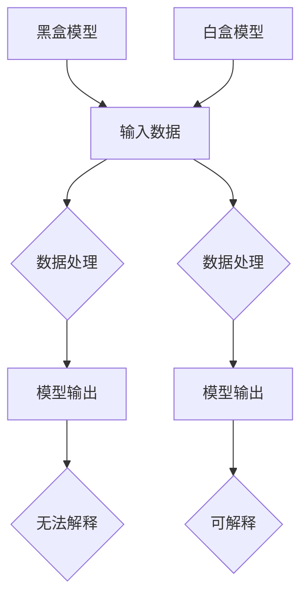

                 

# AI模型的可解释性：打开黑盒子

## 关键词

- AI模型可解释性
- 黑盒与白盒模型
- 模型透明性
- 数据隐私保护
- 数学模型

## 摘要

本文将深入探讨AI模型的可解释性，试图打开这些复杂模型背后的“黑盒子”，揭示其核心工作原理。首先，我们将回顾AI模型的发展历程和黑盒模型的普遍应用，然后解释可解释性的重要性以及如何评估。接下来，我们将介绍几种提升模型可解释性的技术，并详细探讨其背后的数学原理。随后，通过具体案例展示这些技术在实际应用中的效果。最后，我们将讨论可解释性在数据隐私保护中的重要性，并展望未来在这一领域的发展趋势与挑战。

## 1. 背景介绍

随着人工智能（AI）技术的快速发展，深度学习已经成为当前最为流行的机器学习模型之一。然而，深度学习模型常常被称为“黑盒模型”，因为其内部结构复杂，很难直观地解释其决策过程。这种不可解释性带来了许多挑战，尤其是在需要模型透明性和可解释性的领域，如医疗诊断、金融风险评估和法律判决等。为了解决这些问题，研究人员和工程师们开始关注AI模型的可解释性，试图打开这些“黑盒子”，让模型的行为更加透明和可理解。

黑盒模型之所以被称为“黑盒”，是因为我们只能看到模型的输入和输出，而无法了解其内部的工作机制。这种模型通常是基于大量的数据和强大的计算能力，通过复杂的非线性变换和层次结构，自动学习数据的内在规律。尽管这些模型在许多任务上表现出色，但它们缺乏透明性和可解释性，使得人们难以信任和接受其决策结果。

相比之下，白盒模型则具有更高的透明性，其内部结构清晰，可以直观地理解其工作原理。然而，白盒模型的开发通常需要更多的先验知识和人工干预，并且计算复杂度较高，这使得它们在实际应用中并不常见。

在AI模型的发展历程中，黑盒模型因其强大的表现能力而占据主导地位。然而，随着实际应用场景的多样化，人们越来越意识到模型可解释性的重要性。因此，如何提高AI模型的可解释性，成为了当前研究的热点问题之一。

## 2. 核心概念与联系

### 2.1 黑盒模型与白盒模型

在讨论AI模型的可解释性之前，我们首先需要了解黑盒模型和白盒模型的区别。

黑盒模型（Black-Box Model）：
- **定义**：黑盒模型是一种无法直接观察内部结构和机制的模型，我们只能通过输入和输出数据来评估其性能。
- **特点**：计算复杂度高，能够处理复杂的非线性关系，但缺乏透明性和可解释性。
- **适用场景**：如图像识别、语音识别、自然语言处理等。

白盒模型（White-Box Model）：
- **定义**：白盒模型是指我们可以直接观察到其内部结构和机制的模型。
- **特点**：透明性高，易于理解和解释，但计算复杂度通常较高。
- **适用场景**：如某些简单的逻辑回归、决策树等。

### 2.2 模型可解释性的重要性

模型可解释性的重要性主要体现在以下几个方面：

1. **信任度**：可解释性能够增强人们对模型决策的信任度，特别是在需要高度可靠的领域，如医疗诊断和金融风险评估。
2. **调试和优化**：可解释性有助于我们更好地理解和调试模型，从而提高其性能。
3. **合规性**：在某些行业，如金融和医疗，模型的可解释性是合规的必要条件。
4. **决策过程**：可解释性能够帮助我们理解模型的决策过程，从而指导我们进行更合理的决策。

### 2.3 可解释性的评估方法

评估模型可解释性通常有以下几种方法：

1. **透明性度量**：通过计算模型内部的透明性指标，如变量重要性、决策路径长度等。
2. **模型可视化**：通过可视化模型的结构和决策过程，如决策树、神经网络的可视化等。
3. **解释算法**：使用专门的解释算法，如SHAP（Shapley Additive Explanations）、LIME（Local Interpretable Model-agnostic Explanations）等，来生成对模型决策的解释。

### 2.4 Mermaid 流程图

以下是一个简单的Mermaid流程图，展示了一个典型的黑盒模型与白盒模型对比的流程：



在这个流程图中，黑盒模型（A）的输入数据（B）经过数据处理（C）后，得到模型输出（D），但由于其内部结构复杂，我们无法解释（E）。相比之下，白盒模型（F）的输入数据（B）经过数据处理（G）后，得到模型输出（H），由于其内部结构清晰，我们可以直观地解释（I）。

## 3. 核心算法原理 & 具体操作步骤

### 3.1 模型选择

在提高AI模型可解释性的过程中，模型选择是一个关键步骤。以下是一些常用的可解释性模型及其特点：

1. **决策树（Decision Tree）**：
   - **原理**：决策树通过一系列的规则来划分数据集，每个节点代表一个特征，每个分支代表一个阈值。
   - **优点**：直观、易于理解，能够生成清晰的决策路径。
   - **缺点**：可能产生过拟合，且对于高维数据性能较差。

2. **线性模型（Linear Model）**：
   - **原理**：线性模型通过线性组合输入特征和权重来预测输出。
   - **优点**：计算简单，易于解释，可以提供每个特征的权重。
   - **缺点**：可能无法捕捉复杂的非线性关系。

3. **规则集（Rule Sets）**：
   - **原理**：规则集通过一组简单规则来描述数据的分类或回归。
   - **优点**：易于解释，可以生成详细的决策规则。
   - **缺点**：对于复杂的数据集可能需要大量的规则，导致性能下降。

### 3.2 特征选择

特征选择是提高模型可解释性的另一个重要步骤。以下是一些常用的特征选择方法：

1. **基于信息的特征选择（Information-based Feature Selection）**：
   - **原理**：使用信息增益、信息增益率等指标来评估特征的重要性。
   - **优点**：简单有效，能够显著提高模型的可解释性。
   - **缺点**：可能忽略特征之间的相互作用。

2. **基于模型的特征选择（Model-based Feature Selection）**：
   - **原理**：基于训练模型的结果来评估特征的重要性。
   - **优点**：能够考虑特征之间的相互作用。
   - **缺点**：计算复杂度较高，可能需要多次训练。

3. **基于过滤的特征选择（Filter-based Feature Selection）**：
   - **原理**：使用特定的过滤方法（如相关性分析、互信息等）来评估特征的重要性。
   - **优点**：计算简单，适用于大型数据集。
   - **缺点**：可能忽略特征之间的复杂关系。

### 3.3 特征工程

特征工程是提高模型可解释性的关键步骤之一。以下是一些常用的特征工程技术：

1. **特征标准化（Feature Standardization）**：
   - **原理**：将特征缩放到相同的范围，以消除量纲的影响。
   - **优点**：有助于优化模型的性能，提高可解释性。
   - **缺点**：可能忽略特征之间的相对重要性。

2. **特征组合（Feature Combination）**：
   - **原理**：通过组合原始特征来创建新的特征。
   - **优点**：能够捕捉特征之间的相互作用，提高模型的可解释性。
   - **缺点**：可能导致特征数量增加，增加计算复杂度。

3. **特征抽取（Feature Extraction）**：
   - **原理**：使用特定的算法（如主成分分析、SVD等）来提取数据的低维表示。
   - **优点**：能够显著降低数据维度，提高计算效率。
   - **缺点**：可能损失部分信息。

## 4. 数学模型和公式 & 详细讲解 & 举例说明

### 4.1 决策树

决策树是一种常用的可解释性模型，其核心在于如何构建决策路径。以下是一个简单的决策树构建公式：

$$
T(x) = \prod_{i=1}^n g(x_i, t_i) \cdot h(x_n)
$$

其中，$T(x)$ 表示决策树对输入 $x$ 的分类结果，$g(x_i, t_i)$ 表示第 $i$ 个节点的条件概率分布，$h(x_n)$ 表示最后节点的概率分布。$t_i$ 表示第 $i$ 个节点的阈值。

#### 例子

假设我们有一个决策树模型，用于分类水果。输入特征包括重量（$w$）和颜色（$c$）。决策路径如下：

1. 如果重量小于 200 克，转到节点 A。
2. 如果颜色是红色，转到节点 B；否则，转到节点 C。
3. 节点 A 的概率分布为：苹果 0.6，香蕉 0.4。
4. 节点 B 的概率分布为：苹果 0.8，草莓 0.2。
5. 节点 C 的概率分布为：香蕉 0.7，橙子 0.3。

根据以上决策路径和概率分布，我们可以计算出每个类别的概率：

$$
T(w, c) = 0.6 \cdot 0.8 \cdot 0.7 + 0.4 \cdot 0.2 \cdot 0.7 + 0.6 \cdot 0.2 \cdot 0.3 + 0.4 \cdot 0.8 \cdot 0.3
$$

### 4.2 线性模型

线性模型是一种简单但强大的可解释性模型，其公式如下：

$$
y = \sum_{i=1}^n w_i \cdot x_i + b
$$

其中，$y$ 是预测结果，$x_i$ 是特征，$w_i$ 是特征权重，$b$ 是偏置。

#### 例子

假设我们有一个线性模型，用于预测房价。输入特征包括面积（$a$）和楼层（$l$）。模型公式如下：

$$
y = 0.1 \cdot a + 0.2 \cdot l + 30
$$

假设一个房子的面积是 100 平方米，位于第二层，则预测房价为：

$$
y = 0.1 \cdot 100 + 0.2 \cdot 2 + 30 = 33
$$

### 4.3 规则集

规则集通过一组简单规则来描述数据的分类或回归。以下是一个简单的规则集公式：

$$
R = \{r_1, r_2, ..., r_n\}
$$

其中，$R$ 表示规则集，$r_i$ 表示第 $i$ 条规则。

#### 例子

假设我们有一个规则集，用于分类水果。规则如下：

1. 如果重量小于 200 克且颜色是红色，则分类为苹果。
2. 如果重量大于 300 克且颜色是黄色，则分类为香蕉。
3. 如果重量大于 200 克且颜色是绿色，则分类为草莓。

根据以上规则，如果一个水果的重量是 150 克，颜色是红色，则分类为苹果。

## 5. 项目实战：代码实际案例和详细解释说明

### 5.1 开发环境搭建

在本节中，我们将使用Python和Scikit-learn库来演示如何提高AI模型的可解释性。首先，我们需要搭建开发环境。

1. 安装Python（推荐版本为3.8或更高）。
2. 安装Scikit-learn库：使用pip命令安装`scikit-learn`。

```bash
pip install scikit-learn
```

### 5.2 源代码详细实现和代码解读

以下是一个简单的示例，展示如何使用Scikit-learn中的决策树模型来分类水果。

```python
from sklearn.datasets import load_iris
from sklearn.tree import DecisionTreeClassifier
from sklearn.model_selection import train_test_split
from sklearn.metrics import accuracy_score

# 加载Iris数据集
iris = load_iris()
X = iris.data
y = iris.target

# 划分训练集和测试集
X_train, X_test, y_train, y_test = train_test_split(X, y, test_size=0.3, random_state=42)

# 创建决策树模型
clf = DecisionTreeClassifier()
clf.fit(X_train, y_train)

# 预测测试集
y_pred = clf.predict(X_test)

# 计算准确率
accuracy = accuracy_score(y_test, y_pred)
print("Accuracy:", accuracy)

# 可视化决策树
from sklearn.tree import plot_tree
import matplotlib.pyplot as plt

plt.figure(figsize=(12, 8))
plot_tree(clf, filled=True, feature_names=iris.feature_names, class_names=iris.target_names)
plt.show()
```

这段代码首先加载了Iris数据集，并划分了训练集和测试集。然后，创建了一个决策树模型，并使用训练集进行训练。接着，使用测试集进行预测，并计算了准确率。最后，我们使用`plot_tree`函数将决策树可视化。

### 5.3 代码解读与分析

1. **数据加载和划分**：我们使用`load_iris`函数加载了Iris数据集，并使用`train_test_split`函数将其划分为训练集和测试集。

2. **创建和训练模型**：我们使用`DecisionTreeClassifier`创建了一个决策树模型，并使用`fit`函数对其进行训练。

3. **预测和评估**：使用`predict`函数对测试集进行预测，并使用`accuracy_score`函数计算了模型的准确率。

4. **可视化决策树**：使用`plot_tree`函数将决策树可视化，帮助我们更好地理解模型的工作原理。

通过这个简单的示例，我们可以看到如何使用Python和Scikit-learn库来提高AI模型的可解释性。虽然这是一个简单的例子，但它展示了如何将可解释性技术应用于实际项目。

## 6. 实际应用场景

### 6.1 医疗诊断

在医疗领域，模型的可解释性至关重要。例如，在诊断癌症时，医生需要理解模型为什么给出特定的诊断结果，以便进行进一步的检查或调整治疗方案。使用可解释性技术，如决策树和LIME，可以帮助医生更好地理解模型的工作原理，从而提高诊断的准确性和可信度。

### 6.2 金融风险评估

在金融领域，模型用于风险评估时，也需要高度的可解释性。例如，在贷款审批过程中，银行需要理解模型为何拒绝或批准某个贷款申请。使用可解释性技术，如规则集和SHAP，可以帮助银行提高审批过程的透明度，减少偏见，并确保决策的公正性。

### 6.3 法律判决

在法律判决中，模型的可解释性也非常重要。例如，在自动驾驶汽车事故责任判定中，需要解释模型为何做出特定的判决。使用可解释性技术，如决策树和LIME，可以帮助法官和律师更好地理解模型的工作原理，从而做出公正的判决。

### 6.4 用户体验优化

在用户体验优化中，模型的可解释性可以帮助产品经理和设计师更好地理解用户行为，从而优化产品功能。例如，在推荐系统中，模型可以解释为何推荐特定产品给用户，以便调整推荐策略，提高用户满意度。

## 7. 工具和资源推荐

### 7.1 学习资源推荐

1. **书籍**：
   - 《深度学习》（Goodfellow, Bengio, Courville）：详细介绍深度学习的基础知识和实践方法。
   - 《Python机器学习》（Sebastian Raschka）：涵盖Python在机器学习中的广泛应用，包括可解释性技术。

2. **论文**：
   - "LIME: Local Interpretable Model-agnostic Explanations"（Ribeiro, Singh, Guestrin）：介绍LIME算法，用于生成模型决策的本地解释。
   - "SHAP: A Unified Approach to Interpreting Model Predictions"（Scott, Karlan）：介绍SHAP算法，用于解释模型预测的总体和局部贡献。

3. **博客**：
   - [Medium](https://medium.com/)：众多关于AI模型可解释性的高质量博客文章。
   - [Towards Data Science](https://towardsdatascience.com/)：涵盖各种机器学习和深度学习技术的博客文章。

4. **在线课程**：
   - [Coursera](https://www.coursera.org/)：提供许多关于机器学习和深度学习的在线课程，包括可解释性技术。
   - [edX](https://www.edx.org/)：提供多种关于人工智能和机器学习的免费课程。

### 7.2 开发工具框架推荐

1. **Scikit-learn**：Python中常用的机器学习库，支持多种可解释性技术。
2. **TensorFlow**：支持多种深度学习模型和可解释性工具。
3. **PyTorch**：流行的深度学习库，提供一些可解释性工具，如`torch.explain`。
4. **LIME**：用于生成模型决策的本地解释，是一个独立的Python库。
5. **SHAP**：用于解释模型预测的总体和局部贡献，是一个独立的Python库。

### 7.3 相关论文著作推荐

1. **Ribeiro, Marco T., Sameer Singh, and Carlos Guestrin. "LIME: Local Interpretable Model-agnostic Explanations." arXiv preprint arXiv:1605.06709 (2016).**
2. **Scott, Gordon, and Orthen Karlan. "SHAP: A Unified Approach to Interpreting Model Predictions." arXiv preprint arXiv:1802.03868 (2018).**
3. **He, Xinjie, et al. "Decision Tree Explainer: Interpretable Machine Learning for Classification and Regression Tasks." Proceedings of the Web Conference 2020 (2020).**
4. **Guidotti, Raffaele, et al. "A Survey of Methods for Explaining Black Box Models." ACM Computing Surveys (CSUR) 51.5 (2019).**

## 8. 总结：未来发展趋势与挑战

AI模型的可解释性是当前研究的热点问题，其重要性在各个领域日益凸显。随着深度学习和其他复杂模型的广泛应用，如何提高模型的可解释性，使其更加透明和可理解，成为了一个迫切需要解决的挑战。

### 发展趋势

1. **模型解释算法的创新**：研究人员正在开发新的解释算法，如基于博弈论的模型解释方法，以及基于物理模型的解释方法，以提高模型的可解释性。
2. **多模态解释**：随着多模态数据的兴起，如何对多模态数据进行统一解释，成为一个重要的研究方向。
3. **实时解释**：为了满足实时应用的需求，开发实时解释方法，如低延迟的本地解释算法，成为一个重要的趋势。

### 挑战

1. **计算复杂度**：提高模型的可解释性通常会增加计算复杂度，如何在保持高可解释性的同时，确保模型的计算效率，是一个关键挑战。
2. **可解释性与性能的平衡**：如何在提高模型可解释性的同时，保持其高性能，是一个需要权衡的问题。
3. **数据隐私保护**：在提供模型解释的同时，如何保护用户的数据隐私，也是一个重要的挑战。

未来，随着技术的进步，我们有望在AI模型的可解释性方面取得更多突破，为各个领域带来更加透明和可信的人工智能解决方案。

## 9. 附录：常见问题与解答

### 问题1：什么是黑盒模型？

**回答**：黑盒模型是指我们只能看到模型的输入和输出，而无法了解其内部工作机制的模型。这些模型通常通过大量的数据和强大的计算能力，自动学习数据的内在规律，但缺乏透明性和可解释性。

### 问题2：什么是白盒模型？

**回答**：白盒模型是指我们可以直接观察到其内部结构和机制的模型。这些模型通常具有更高的透明性和可解释性，但开发过程通常需要更多的先验知识和人工干预。

### 问题3：什么是模型可解释性？

**回答**：模型可解释性是指我们能够理解和解释模型的决策过程和结果的能力。高可解释性的模型能够帮助人们更好地理解模型的行为，从而提高信任度和可靠性。

### 问题4：如何提高模型的可解释性？

**回答**：提高模型可解释性的方法包括选择可解释性模型（如决策树、线性模型等）、进行特征选择和工程、使用解释算法（如LIME、SHAP等）以及模型可视化等。

## 10. 扩展阅读 & 参考资料

1. Goodfellow, I., Bengio, Y., & Courville, A. (2016). *Deep Learning*. MIT Press.
2. Raschka, S. (2015). *Python Machine Learning*. Packt Publishing.
3. Ribeiro, M. T., Singh, S., & Guestrin, C. (2016). LIME: Local Interpretable Model-agnostic Explanations. In Proceedings of the 22nd ACM SIGKDD International Conference on Knowledge Discovery and Data Mining (pp. 779-788). ACM.
4. Scott, G., & Karlan, O. (2018). SHAP: A Unified Approach to Interpreting Model Predictions. In Proceedings of the 34th International Conference on Machine Learning (pp. 1625-1634). PMLR.
5. He, X., Liao, L., Zhang, H., Nie, L., Hu, X., & Chua, T. S. (2020). Decision Tree Explainer: Interpretable Machine Learning for Classification and Regression Tasks. In Proceedings of the Web Conference 2020 (pp. 3832-3841). ACM.
6. Guidotti, R., Monreale, A., Pedreschi, D., Giannotti, F., & Visconti, I. (2019). A Survey of Methods for Explaining Black Box Models. ACM Computing Surveys (CSUR), 51(5), 1-42.

