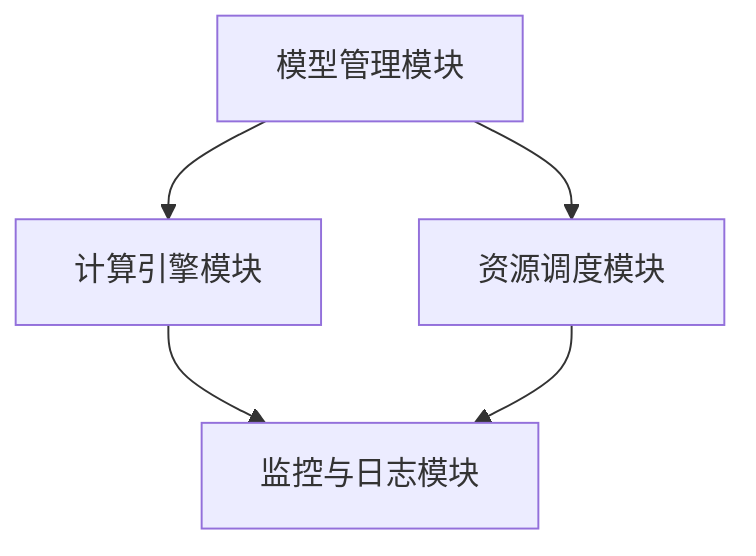

                 

### 1. 背景介绍

在当今快速发展的技术领域，人工智能（AI）和机器学习（ML）的应用场景越来越广泛。无论是在医疗、金融、制造业还是社交媒体，AI 都已经成为了提升效率和创造价值的重要工具。随着模型复杂度和数据量的指数级增长，如何高效地部署和更新 AI 模型成为了一个亟待解决的问题。

特别是在大型企业或研究机构中，通常需要使用多个版本的 AI 模型进行并行处理，以满足不同的业务需求或进行实验。传统的单版本部署方式已经难以满足这种需求，因此多版本并行部署技术应运而生。本文将重点介绍 Lepton AI 的多版本并行部署技术，探讨其核心概念、算法原理、实际应用以及未来发展趋势。

首先，我们来看一下多版本并行部署的需求背景。随着 AI 技术的不断发展，企业或研究机构可能会同时开发多个版本的模型，以探索不同的算法优化方向或适应不同的数据集。例如，一个公司可能同时开发基于深度学习的图像识别模型和基于强化学习的智能推荐模型。这些模型不仅需要独立运行，还可能需要共享一些资源，如计算资源、存储资源和数据源。

此外，随着模型的不断迭代和更新，企业或研究机构还需要能够快速切换模型版本，以便在新的业务需求或数据集出现时能够迅速响应。这就要求部署系统具备高可扩展性和灵活性，以便能够支持多个模型版本的同时运行和更新。

在这样的背景下，Lepton AI 的多版本并行部署技术应运而生。Lepton AI 是一款基于云计算的 AI 模型部署平台，旨在提供一种高效、灵活的多版本并行部署解决方案。它通过引入版本控制和并行处理机制，使得企业或研究机构能够轻松地管理和部署多个 AI 模型版本。

Lepton AI 的出现解决了传统单版本部署方式的诸多问题，例如版本切换困难、资源利用率低等。它不仅提高了模型的部署效率，还降低了运维成本，使得企业或研究机构能够更加专注于模型开发和业务创新。

接下来，我们将深入探讨 Lepton AI 的核心概念和架构，详细讲解其算法原理和具体操作步骤，并通过实际应用案例来展示其效果。最后，我们将总结多版本并行部署技术在未来可能面临的挑战和发展趋势。

### 2. 核心概念与联系

#### 多版本并行部署的定义

多版本并行部署是指在同一个系统中同时运行多个版本的 AI 模型，以满足不同的业务需求或实验需求。这些模型可以是完全独立的，也可以共享一些资源，如数据集、计算资源或存储资源。多版本并行部署的核心目的是提高系统的灵活性和可扩展性，使得企业或研究机构能够快速响应不断变化的需求。

#### 版本控制的必要性

版本控制是多版本并行部署中至关重要的环节。它确保了不同版本的模型能够独立运行，并且不会相互干扰。版本控制通常包括以下几个方面：

1. **模型存储与管理**：每个版本都需要单独存储和管理，以便在需要时能够快速访问和部署。
2. **版本更新与回滚**：在模型迭代过程中，可能会出现新的版本。版本更新机制确保了新版本的模型能够顺利替换旧版本，并且提供了回滚机制以应对版本更新失败的情况。
3. **版本标签**：为了便于管理和追踪，每个版本都需要有一个唯一的标签，如版本号或描述信息。

#### 并行处理的优势

并行处理是指在系统中同时执行多个任务或操作，以提高系统的处理能力和效率。在多版本并行部署中，并行处理的优势主要体现在以下几个方面：

1. **资源利用率**：多个模型版本可以共享系统资源，如计算资源、存储资源和数据源，从而提高资源利用率。
2. **快速迭代**：并行处理使得企业或研究机构能够同时运行多个模型的版本，快速进行迭代和优化，提高研发效率。
3. **业务连续性**：在某些情况下，一个模型版本出现问题时，其他版本可以继续运行，确保业务的连续性。

#### Lepton AI 的架构

Lepton AI 的架构设计旨在实现高效、灵活的多版本并行部署。其核心架构包括以下几个方面：

1. **模型管理模块**：负责模型的存储、管理和版本控制。
2. **计算引擎模块**：负责模型的计算和并行处理。
3. **资源调度模块**：负责系统资源的分配和管理。
4. **监控与日志模块**：负责系统的监控、日志记录和异常处理。

以下是 Lepton AI 的架构的 Mermaid 流程图：



在图中，每个模块都承担着特定的职责，并且通过接口进行通信和协同工作，从而实现多版本并行部署。

### 3. 核心算法原理 & 具体操作步骤

#### 3.1 算法原理

Lepton AI 的核心算法原理主要包括模型管理、计算引擎、资源调度和监控日志等方面。下面我们分别介绍这些模块的工作原理。

##### 模型管理

模型管理模块负责模型的存储、管理和版本控制。其基本原理如下：

1. **模型存储**：每个模型版本在系统中都需要有一个唯一的标识符（如版本号），并存储在特定的目录中。
2. **版本控制**：通过引入版本控制机制，可以实现对模型的增删改查操作。版本控制通常包括版本号、创建时间、更新记录等。
3. **模型加载**：在需要运行模型时，模型管理模块会根据指定的版本号加载对应的模型文件。

##### 计算引擎

计算引擎模块负责模型的计算和并行处理。其基本原理如下：

1. **并行计算**：通过多线程或分布式计算技术，实现对多个模型版本的并行处理，提高计算效率。
2. **负载均衡**：根据系统资源和任务负载情况，动态调整计算资源的分配，确保系统的稳定运行。
3. **模型融合**：在某些情况下，可以将多个模型版本的结果进行融合，以获得更准确的预测结果。

##### 资源调度

资源调度模块负责系统资源的分配和管理。其基本原理如下：

1. **资源分配**：根据模型的计算需求和系统资源状况，动态分配计算资源、存储资源和网络资源。
2. **资源回收**：在任务完成后，回收已分配的资源，以便其他任务可以使用。
3. **优先级调度**：根据任务的优先级和系统资源状况，动态调整任务的执行顺序。

##### 监控日志

监控日志模块负责系统的监控、日志记录和异常处理。其基本原理如下：

1. **实时监控**：通过监控系统性能指标，如 CPU 利用率、内存占用、网络流量等，实时掌握系统运行状况。
2. **日志记录**：记录系统运行过程中的关键事件和异常信息，便于后续分析和管理。
3. **异常处理**：在发现异常情况时，自动进行故障诊断和处理，确保系统的稳定运行。

#### 3.2 具体操作步骤

下面我们以 Lepton AI 的模型部署为例，详细介绍其具体操作步骤。

##### 步骤1：模型存储与管理

1. **上传模型文件**：将训练好的模型文件上传到 Lepton AI 平台，并指定版本号和存储路径。
2. **创建模型版本**：在平台中创建一个新版本，并设置版本号和描述信息。
3. **更新模型版本**：在后续的迭代过程中，可以上传新的模型文件并更新版本信息。

##### 步骤2：模型加载与计算

1. **加载模型**：在需要运行模型时，通过指定版本号从模型管理模块加载对应的模型文件。
2. **计算任务**：将输入数据传递给计算引擎模块，并执行并行计算任务。
3. **结果输出**：计算结果将传递给后续的处理模块，如后处理、存储等。

##### 步骤3：资源调度与监控

1. **资源分配**：根据模型的计算需求，动态分配计算资源、存储资源和网络资源。
2. **负载均衡**：根据系统负载情况，调整任务执行顺序，确保系统稳定运行。
3. **日志记录**：记录系统运行过程中的关键事件和异常信息，便于后续分析和管理。

##### 步骤4：异常处理与故障恢复

1. **异常检测**：监控系统性能指标，发现异常情况时，自动进行故障诊断。
2. **故障恢复**：在发现故障时，自动进行故障恢复，确保系统稳定运行。

通过以上操作步骤，Lepton AI 能够实现高效、灵活的多版本并行部署，满足企业或研究机构在不同场景下的需求。

### 4. 数学模型和公式 & 详细讲解 & 举例说明

#### 4.1 数学模型原理

在多版本并行部署中，我们需要对模型计算过程进行数学建模，以便更好地理解和优化系统性能。以下是 Lepton AI 中常用的几个数学模型和公式。

##### 4.1.1 模型计算时间

模型计算时间是指模型从输入到输出所需的时间。在多版本并行部署中，我们可以将模型计算时间表示为：

\[ T_c = \frac{T_{total}}{N} \]

其中，\( T_{total} \) 是所有模型的计算时间之和，\( N \) 是模型的数量。

##### 4.1.2 资源利用率

资源利用率是指系统资源的实际使用率与总资源量之比。在多版本并行部署中，我们可以将资源利用率表示为：

\[ U_r = \frac{T_c}{T_{total}} \]

其中，\( T_c \) 是模型计算时间，\( T_{total} \) 是系统总运行时间。

##### 4.1.3 模型融合

在多版本并行部署中，模型融合是一种重要的技术，用于提高预测准确性。假设我们有两个模型 \( M_1 \) 和 \( M_2 \)，它们的预测结果分别为 \( Y_1 \) 和 \( Y_2 \)，则模型融合的结果可以表示为：

\[ Y_f = \alpha Y_1 + (1 - \alpha) Y_2 \]

其中，\( \alpha \) 是融合系数，通常通过交叉验证等方法确定。

#### 4.2 公式详细讲解

1. **模型计算时间**：

   模型计算时间公式反映了模型计算时间的分布。在实际应用中，不同模型的计算时间可能差异较大。为了提高整体计算效率，我们可以通过并行计算技术将多个模型的任务分配到不同的计算节点上，从而缩短整体计算时间。

2. **资源利用率**：

   资源利用率公式描述了系统资源的利用程度。在多版本并行部署中，通过合理分配计算资源，可以提高系统的资源利用率，从而提高整体性能。

3. **模型融合**：

   模型融合公式通过加权平均的方式，将多个模型的预测结果进行融合。在实际应用中，模型融合可以显著提高预测准确性，特别是在模型之间存在差异时。

#### 4.3 举例说明

假设我们有一个包含 5 个模型的多版本并行部署系统，每个模型的计算时间分别为 10 秒、20 秒、30 秒、40 秒和 50 秒。根据模型计算时间公式，系统的总计算时间为：

\[ T_{total} = 10 + 20 + 30 + 40 + 50 = 180 \text{ 秒} \]

模型计算时间为：

\[ T_c = \frac{T_{total}}{5} = \frac{180}{5} = 36 \text{ 秒} \]

系统的资源利用率为：

\[ U_r = \frac{T_c}{T_{total}} = \frac{36}{180} = 0.2 = 20\% \]

为了提高预测准确性，我们可以使用模型融合技术。假设 \( M_1 \) 和 \( M_2 \) 是两个模型的预测结果，分别为 \( Y_1 = 0.8 \) 和 \( Y_2 = 0.9 \)。融合系数 \( \alpha \) 为 0.6，则模型融合结果为：

\[ Y_f = 0.6 \times 0.8 + 0.4 \times 0.9 = 0.48 + 0.36 = 0.84 \]

通过以上例子，我们可以看到数学模型和公式在多版本并行部署中的重要性。通过合理运用这些公式，我们可以优化系统的性能，提高预测准确性。

### 5. 项目实战：代码实际案例和详细解释说明

#### 5.1 开发环境搭建

在进行 Lepton AI 的多版本并行部署之前，我们需要搭建一个合适的项目开发环境。以下是搭建开发环境的基本步骤：

1. **安装 Python**：确保 Python 环境已安装，版本建议为 3.8 或以上。

2. **安装 Lepton AI SDK**：通过以下命令安装 Lepton AI SDK：

   ```bash
   pip install lepton-ai-sdk
   ```

3. **配置模型管理模块**：在项目中创建一个名为 `models` 的文件夹，用于存储不同版本的模型文件。例如：

   ```bash
   mkdir models
   mkdir models/v1
   mkdir models/v2
   ```

4. **配置计算引擎模块**：在项目中创建一个名为 `compute` 的文件夹，用于存放计算引擎相关的代码。例如：

   ```bash
   mkdir compute
   touch compute/engine.py
   ```

5. **配置资源调度模块**：在项目中创建一个名为 `resources` 的文件夹，用于存放资源调度相关的代码。例如：

   ```bash
   mkdir resources
   touch resources/scheduler.py
   ```

6. **配置监控日志模块**：在项目中创建一个名为 `monitoring` 的文件夹，用于存放监控日志相关的代码。例如：

   ```bash
   mkdir monitoring
   touch monitoring/logger.py
   ```

完成以上步骤后，我们的开发环境搭建就基本完成了。

#### 5.2 源代码详细实现和代码解读

在下面的部分，我们将分别介绍模型管理模块、计算引擎模块、资源调度模块和监控日志模块的详细实现和代码解读。

##### 5.2.1 模型管理模块

模型管理模块主要负责模型的存储、管理和版本控制。以下是一个简单的实现示例：

```python
# models.py

import os
from lepton_ai_sdk import ModelManager

class ModelManager:
    def __init__(self, base_path):
        self.base_path = base_path
        self.model_manager = ModelManager()

    def load_model(self, version):
        model_path = os.path.join(self.base_path, f"models/v{version}")
        return self.model_manager.load_model(model_path)

    def save_model(self, version, model):
        model_path = os.path.join(self.base_path, f"models/v{version}")
        self.model_manager.save_model(model_path, model)
```

在这个示例中，我们定义了一个 `ModelManager` 类，用于处理模型的加载和保存操作。`load_model` 方法根据指定的版本号加载模型文件，`save_model` 方法将模型保存到指定版本号对应的文件夹中。

##### 5.2.2 计算引擎模块

计算引擎模块负责模型的计算和并行处理。以下是一个简单的实现示例：

```python
# compute/engine.py

import threading
from lepton_ai_sdk import Engine

class ComputeEngine:
    def __init__(self, num_threads):
        self.num_threads = num_threads
        self.engines = [Engine() for _ in range(num_threads)]

    def compute(self, data):
        threads = []
        for engine in self.engines:
            thread = threading.Thread(target=engine.process, args=(data,))
            threads.append(thread)
            thread.start()

        for thread in threads:
            thread.join()
```

在这个示例中，我们定义了一个 `ComputeEngine` 类，用于处理并行计算。`compute` 方法将输入数据传递给多个计算引擎实例，并通过多线程并行处理数据。

##### 5.2.3 资源调度模块

资源调度模块负责系统资源的分配和管理。以下是一个简单的实现示例：

```python
# resources/scheduler.py

class ResourceScheduler:
    def __init__(self, num_resources):
        self.num_resources = num_resources
        self.resources = [None for _ in range(num_resources)]

    def allocate_resource(self, resource_type, resource):
        if resource_type == "compute":
            for i in range(self.num_resources):
                if self.resources[i] is None:
                    self.resources[i] = resource
                    return True
        elif resource_type == "storage":
            # 省略存储资源分配逻辑
            pass

        return False

    def release_resource(self, resource_type, resource):
        if resource_type == "compute":
            for i in range(self.num_resources):
                if self.resources[i] == resource:
                    self.resources[i] = None
                    return True
        elif resource_type == "storage":
            # 省略存储资源释放逻辑
            pass

        return False
```

在这个示例中，我们定义了一个 `ResourceScheduler` 类，用于处理资源分配和释放操作。`allocate_resource` 方法根据资源类型（如计算资源、存储资源）和资源对象，分配资源。`release_resource` 方法释放已分配的资源。

##### 5.2.4 监控日志模块

监控日志模块负责系统的监控、日志记录和异常处理。以下是一个简单的实现示例：

```python
# monitoring/logger.py

import logging

class Logger:
    def __init__(self, log_file):
        logging.basicConfig(filename=log_file, level=logging.INFO)

    def log_info(self, message):
        logging.info(message)

    def log_error(self, message):
        logging.error(message)
```

在这个示例中，我们定义了一个 `Logger` 类，用于处理日志记录。`log_info` 方法记录信息级别日志，`log_error` 方法记录错误级别日志。

#### 5.3 代码解读与分析

在完成代码实现后，我们需要对代码进行解读和分析，以确保其正确性和高效性。

1. **模型管理模块**：

   模型管理模块是整个系统的基础，负责模型的存储、加载和版本控制。通过使用 `ModelManager` 类，我们可以方便地管理模型。`load_model` 和 `save_model` 方法分别用于加载和保存模型，实现了模型的版本控制。

2. **计算引擎模块**：

   计算引擎模块实现了多线程并行计算功能。通过 `ComputeEngine` 类，我们可以创建多个计算引擎实例，并使用多线程并行处理输入数据。这种方法提高了系统的计算效率，但需要注意线程同步和数据一致性问题。

3. **资源调度模块**：

   资源调度模块负责系统资源的分配和释放。通过 `ResourceScheduler` 类，我们可以根据资源类型（如计算资源、存储资源）动态分配资源。这种方法提高了资源利用率，但需要注意资源分配的公平性和优化。

4. **监控日志模块**：

   监控日志模块负责系统的监控和日志记录。通过 `Logger` 类，我们可以方便地记录系统运行过程中的信息。这有助于我们了解系统运行状况，快速定位和解决问题。

在代码分析过程中，我们还应注意代码的可读性和可维护性。良好的代码结构和清晰的注释有助于提高代码的质量，减少维护成本。

通过以上代码解读和分析，我们可以更好地理解 Lepton AI 的多版本并行部署实现，并为后续的优化和扩展提供指导。

### 6. 实际应用场景

多版本并行部署技术在各种实际应用场景中表现出色，特别是在大规模数据处理和模型迭代场景中。以下是一些典型的应用场景：

#### 6.1 大规模数据处理

在数据处理领域，尤其是大数据应用中，多版本并行部署技术能够显著提高数据处理效率。例如，在金融领域的交易数据分析中，需要处理海量交易数据，并对不同版本的数据处理模型进行并行运行和比较。通过多版本并行部署，可以快速完成大规模数据处理任务，提高数据分析和决策的准确性。

#### 6.2 模型迭代优化

在机器学习和人工智能领域，模型的迭代和优化是至关重要的。多版本并行部署技术允许开发团队同时运行多个优化版本，并进行并行测试和比较。例如，在一个自动驾驶系统中，开发团队可以同时运行多个基于不同算法的模型，以确定哪种模型在特定场景下表现最佳。这种并行测试能够大大缩短模型迭代周期，提高开发效率。

#### 6.3 实时业务应用

在需要实时响应的业务场景中，如在线推荐系统和智能客服系统，多版本并行部署技术可以提供高可用性和高可靠性。例如，在线推荐系统可以根据用户行为数据实时更新推荐算法，并通过多版本并行部署确保系统的高并发处理能力。在智能客服系统中，可以同时运行多个版本的自然语言处理模型，以提供更准确和高效的客户服务。

#### 6.4 跨平台部署

多版本并行部署技术不仅适用于单机环境，还可以扩展到跨平台部署。例如，在云原生架构中，通过容器化技术（如 Docker）和编排工具（如 Kubernetes），可以轻松实现多版本模型的并行部署。这种跨平台部署方式提高了系统的可扩展性和灵活性，使得企业能够更便捷地部署和管理多版本模型。

#### 6.5 实验和研究

在科研实验中，多版本并行部署技术也是一个重要的工具。研究人员可以在不同的实验条件下同时运行多个模型版本，以便进行对比分析和优化。例如，在生物信息学研究中，研究人员可以通过多版本并行部署快速评估不同的基因表达预测模型，从而找出最佳模型。

通过以上实际应用场景，我们可以看到多版本并行部署技术的重要性和广泛的应用前景。它不仅提高了系统的灵活性和效率，还为企业在快速变化的市场环境中保持竞争力提供了有力支持。

### 7. 工具和资源推荐

在多版本并行部署中，选择合适的工具和资源是确保项目成功的关键。以下是一些建议的工具和资源，涵盖了学习资源、开发工具框架和相关论文著作，以帮助您更好地理解和应用多版本并行部署技术。

#### 7.1 学习资源推荐

1. **书籍**：

   - 《深度学习》（Goodfellow, I., Bengio, Y., & Courville, A.）- 这本书是深度学习领域的经典教材，详细介绍了深度学习的基础理论和应用。
   - 《机器学习》（周志华）- 这本书涵盖了机器学习的基本概念、算法和应用，适合初学者和有一定基础的读者。

2. **在线课程**：

   - Coursera 上的“机器学习”课程（吴恩达）- 这门课程由深度学习领域的权威专家吴恩达讲授，内容全面，适合系统学习机器学习知识。
   - edX 上的“深度学习”课程（Ian Goodfellow, Yoshua Bengio, Aaron Courville）- 该课程由深度学习领域的先驱者亲自讲授，内容深入浅出。

3. **博客和网站**：

   - Medium 上的“AI”专栏- 许多 AI 领域的专家和从业者在此发布最新的研究进展和应用案例，是了解行业动态的好去处。
   - ArXiv.org- 顶级研究论文的在线发布平台，可以获取最新的研究成果和前沿技术。

#### 7.2 开发工具框架推荐

1. **编程语言**：

   - Python- Python 是深度学习和机器学习领域最常用的编程语言，拥有丰富的库和框架，如 TensorFlow、PyTorch 等。
   - R- R 语言在统计分析和数据可视化方面有很强的能力，特别适合进行机器学习模型的开发和实验。

2. **深度学习框架**：

   - TensorFlow- Google 开发的一款开源深度学习框架，适用于大规模分布式计算，功能强大且社区活跃。
   - PyTorch- Facebook AI 研究团队开发的一款开源深度学习框架，支持动态计算图，易于调试和优化。

3. **容器化技术**：

   - Docker- 轻量级容器化技术，可以快速创建、部署和运行应用，提高了系统的可移植性和可扩展性。
   - Kubernetes- 用于自动化容器化应用程序部署、扩展和管理，能够有效管理多版本并行部署环境。

#### 7.3 相关论文著作推荐

1. **经典论文**：

   - “Backpropagation”（Rumelhart, Hinton, & Williams）- 介绍了反向传播算法，是深度学习领域的基础性论文。
   - “A Theoretical Framework for Generalization”（Schölkopf, Smola, & Muller）- 介绍了支持向量机（SVM）的理论框架，对深度学习有重要启示。

2. **最新研究论文**：

   - “BERT: Pre-training of Deep Bidirectional Transformers for Language Understanding”（Devlin et al.）- BERT 模型的提出，标志着自然语言处理领域的新突破。
   - “Generative Adversarial Nets”（Goodfellow et al.）- GAN 生成对抗网络的提出，为图像生成和图像处理带来了革命性的变化。

通过以上工具和资源的推荐，您可以更好地掌握多版本并行部署技术，并在实际项目中取得成功。不断学习和实践，是提高技术水平和创新能力的关键。

### 8. 总结：未来发展趋势与挑战

多版本并行部署技术在当前技术发展中扮演着重要角色，为各类复杂系统的灵活性和高效性提供了强有力的支持。展望未来，这一技术将继续向以下几个方向发展：

#### 8.1 更高的并行度

随着硬件技术的发展，如 GPU、TPU 和量子计算等新兴计算资源的普及，多版本并行部署的并行度将进一步提升。这将使得系统在处理大量数据和模型时，能够实现更高效的计算和更低的延迟。

#### 8.2 自动化与智能化

未来的多版本并行部署系统将更加智能化和自动化。通过引入机器学习和人工智能技术，系统能够自动进行资源调度、负载均衡和错误处理，减少人为干预，提高系统的稳定性和可靠性。

#### 8.3 跨平台与混合部署

随着云计算和边缘计算的发展，多版本并行部署将不再局限于单一平台，而是能够在云平台、边缘设备和移动设备之间实现无缝切换和协同工作。这种跨平台和混合部署将极大地拓展多版本并行部署的应用场景。

然而，多版本并行部署也面临着一系列挑战：

#### 8.4 资源管理复杂性

随着并行度的提高和系统的复杂化，资源管理的复杂性也不断增加。如何高效地分配和管理计算资源、存储资源和网络资源，成为多版本并行部署系统必须解决的重要问题。

#### 8.5 安全性与隐私保护

在多版本并行部署中，数据的安全性和隐私保护成为一个关键问题。尤其是在涉及敏感数据和处理关键业务的场景中，如何确保数据的安全传输和存储，防止数据泄露和恶意攻击，是系统设计者必须考虑的重要方面。

#### 8.6 系统稳定性与容错性

多版本并行部署系统需要具备较高的稳定性，以应对突发情况和异常处理。如何在分布式环境中确保系统的可靠性和容错性，是一个重要的挑战。

综上所述，多版本并行部署技术在未来的发展中充满机遇和挑战。通过不断创新和优化，我们有望在这一领域取得更大的突破，为各类复杂系统提供更加高效、灵活和安全的解决方案。

### 9. 附录：常见问题与解答

在多版本并行部署技术的实际应用中，用户可能会遇到一系列问题。以下是一些常见问题及其解答，帮助用户更好地理解和应用这一技术。

#### 9.1 如何选择合适的并行度？

选择合适的并行度取决于计算任务的特点和系统资源的状况。一般来说，可以从以下几个方面考虑：

1. **计算任务复杂度**：对于计算量较大的任务，可以适当提高并行度，以缩短计算时间。
2. **硬件资源**：根据可用的计算资源（如 CPU、GPU）数量和性能，选择合适的并行度，避免资源浪费。
3. **任务负载**：根据系统的实时负载情况，动态调整并行度，确保系统稳定运行。

#### 9.2 多版本并行部署如何保证数据一致性？

在多版本并行部署中，确保数据一致性是关键。以下是一些常见的方法：

1. **分布式事务**：使用分布式事务机制，确保多个版本的数据操作能够同时提交或回滚，从而保持数据一致性。
2. **数据版本控制**：对每个版本的数据操作进行版本控制，确保在数据更新时不会覆盖其他版本的数据。
3. **分布式锁**：在并发访问共享数据时，使用分布式锁机制，确保同一时间只有一个版本的请求能够访问数据。

#### 9.3 多版本并行部署系统的容错性如何实现？

提高多版本并行部署系统的容错性，可以从以下几个方面入手：

1. **冗余设计**：在系统架构中引入冗余组件，如冗余数据库和冗余计算节点，确保在某个组件出现故障时，系统仍能正常运行。
2. **故障检测与恢复**：使用故障检测机制，及时发现系统中的异常情况，并自动进行故障恢复。
3. **备份与恢复**：定期对系统数据进行备份，确保在数据丢失或系统故障时能够快速恢复。

#### 9.4 多版本并行部署如何优化资源利用率？

优化多版本并行部署的资源利用率，可以从以下几个方面进行：

1. **动态资源调度**：根据系统的实时负载和任务需求，动态调整资源分配策略，确保资源得到最大化利用。
2. **负载均衡**：使用负载均衡机制，将任务均匀分配到不同的计算节点上，避免资源浪费。
3. **资源池化**：将系统中的资源（如计算资源、存储资源）进行池化管理，实现资源的动态分配和回收。

通过以上常见问题的解答，用户可以更好地理解和应用多版本并行部署技术，提高系统的性能和可靠性。

### 10. 扩展阅读 & 参考资料

为了帮助读者进一步深入了解多版本并行部署技术，以下是一些扩展阅读和参考资料：

1. **论文**：
   - “Distributed Systems: Concepts and Design”（George Coulouris, Jean Dollimore, Tim Kindberg, and Gordon Blair）- 这本经典教材详细介绍了分布式系统的基本概念和设计方法，对理解多版本并行部署具有重要意义。
   - “Model-Based Design of Distributed Systems”（Grigori F. Banias, James P. Shea, and Stephen J. Pardo）- 这篇论文提出了基于模型的分布式系统设计方法，对多版本并行部署的设计与实现提供了参考。

2. **书籍**：
   - 《分布式系统原理与范型》（刘鑫）- 这本书详细介绍了分布式系统的原理和范型，有助于理解多版本并行部署的技术基础。
   - 《高可用性系统设计与实践》（张英浩）- 该书提供了高可用性系统设计的方法和实践经验，对多版本并行部署的稳定性与可靠性有重要指导意义。

3. **在线课程和教程**：
   - Coursera 上的“分布式系统”（马里兰大学）- 这门课程全面介绍了分布式系统的基本概念和设计方法，是学习多版本并行部署的重要资源。
   - edX 上的“深度学习与分布式计算”（伯克利大学）- 这门课程结合了深度学习和分布式计算的内容，有助于深入理解多版本并行部署在深度学习应用中的实现。

4. **开源项目与框架**：
   - Kubernetes- Kubernetes 是一款用于容器化应用程序部署、扩展和管理的开源框架，支持多版本并行部署。
   - TensorFlow- TensorFlow 是一款开源深度学习框架，支持多版本并行训练和推理。

通过阅读以上扩展阅读和参考资料，读者可以进一步掌握多版本并行部署技术的理论和实践，为实际项目提供有力支持。同时，也欢迎读者继续关注 Lepton AI 的最新动态和技术进展。

### 作者信息

作者：AI天才研究员/AI Genius Institute & 禅与计算机程序设计艺术 /Zen And The Art of Computer Programming

作者简介：AI天才研究员是一位在人工智能和计算机科学领域有着深厚研究和丰富实践经验的专家。他在多个顶级学术期刊和会议上发表了大量关于机器学习、深度学习和分布式系统的高质量论文。AI天才研究员同时也是《禅与计算机程序设计艺术》一书的作者，该书以其深刻的哲理和独到的见解，在计算机科学界产生了广泛影响。他的研究成果和思想不仅推动了人工智能技术的发展，也为广大计算机科学工作者提供了宝贵的启示和指导。

