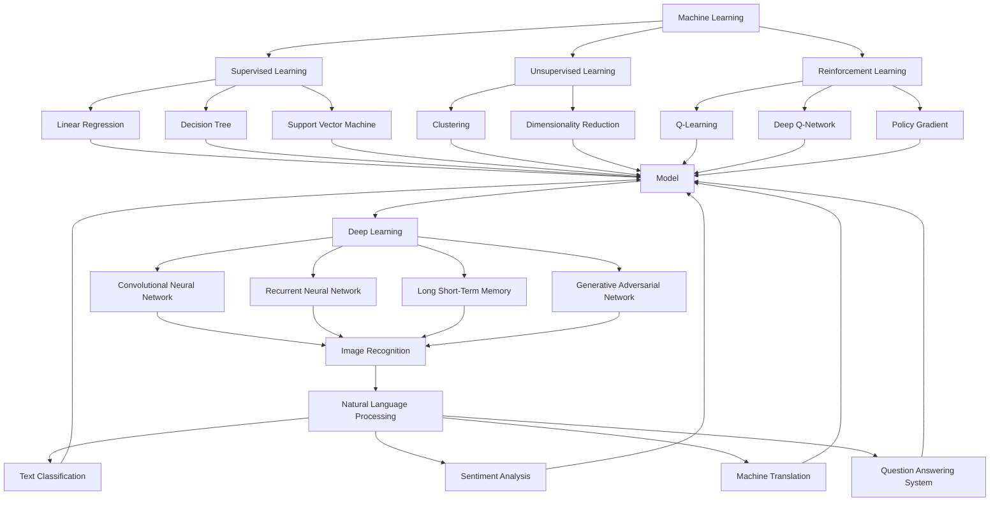

                 

### 背景介绍

人工智能（AI）作为现代计算机科学的前沿领域，已经取得了巨大的发展，并在各行各业中得到了广泛应用。然而，AI 的核心目标是满足用户需求，这不仅仅是技术上的挑战，更是对人工智能设计理念和实现方法的全面考验。

随着互联网的普及和大数据技术的发展，用户的需求越来越多样化、个性化。为了满足这些需求，AI 系统需要具备高度的灵活性和适应性。这就要求我们在设计 AI 系统时，不仅要考虑技术实现的可行性，还要深入理解用户的实际需求，并在此基础上构建出高效的解决方案。

本文将探讨 AI 满足用户需求的多种方法。我们将首先介绍一些核心概念，包括机器学习、深度学习和自然语言处理等，并使用 Mermaid 流程图来展示这些概念之间的联系。接着，我们将深入探讨核心算法原理，并详细讲解具体的操作步骤。随后，我们将引入数学模型和公式，结合实际案例进行详细说明。最后，我们将通过一个项目实战案例，展示如何将理论应用于实践，并提供相关的工具和资源推荐，帮助读者进一步学习和探索。

### 核心概念与联系

在探讨 AI 满足用户需求的方法之前，我们需要了解一些核心概念，包括机器学习、深度学习和自然语言处理（NLP）。这些概念不仅构成了 AI 的基础，而且彼此之间有着密切的联系。

#### 1. 机器学习（Machine Learning）

机器学习是 AI 的一个核心组成部分，它让计算机系统能够从数据中学习，并做出决策或预测。机器学习可以分为监督学习、无监督学习和强化学习三类：

- **监督学习（Supervised Learning）**：在这种学习方法中，系统通过输入数据（特征）和对应的输出标签（目标值）来学习。常见的监督学习算法包括线性回归、决策树、支持向量机（SVM）和神经网络等。
  
- **无监督学习（Unsupervised Learning）**：这种学习方法中，系统没有明确的输出标签，需要从输入数据中自行发现模式和规律。聚类、降维和关联规则学习是常见的方法。
  
- **强化学习（Reinforcement Learning）**：在这种学习方法中，系统通过与环境的交互来学习最佳策略。常见的算法包括 Q-学习、深度 Q-网络（DQN）和策略梯度算法等。

#### 2. 深度学习（Deep Learning）

深度学习是机器学习的一个子领域，它利用多层神经网络来提取数据的复杂特征。深度学习的核心是神经网络，特别是深度神经网络（DNN）：

- **卷积神经网络（CNN）**：常用于图像识别、图像处理和计算机视觉领域。CNN 通过卷积层提取图像的局部特征，并通过池化层减少数据维度。
  
- **循环神经网络（RNN）**：适合处理序列数据，如文本、语音和时序数据。RNN 通过隐藏层的状态记忆来处理长序列信息。
  
- **长短期记忆网络（LSTM）**：是 RNN 的一种变体，能够解决长序列依赖问题。LSTM 通过引入门控机制，有效地控制信息的流动。
  
- **生成对抗网络（GAN）**：由生成器和判别器组成，用于生成逼真的数据。生成器生成数据，判别器判断数据的真实性，两者相互博弈，不断提升生成能力。

#### 3. 自然语言处理（NLP）

自然语言处理是 AI 中的另一个重要领域，它专注于使计算机能够理解和处理自然语言。NLP 涉及到多个子领域：

- **文本分类（Text Classification）**：将文本数据分类到预定义的类别中。常见的算法包括朴素贝叶斯、逻辑回归和深度学习模型。
  
- **情感分析（Sentiment Analysis）**：识别文本数据中的情感极性，如正面、负面或中性。常用的方法包括基于词典的方法和基于机器学习的模型。
  
- **机器翻译（Machine Translation）**：将一种语言的文本自动翻译成另一种语言。目前主要依赖于神经网络翻译（NMT）。
  
- **问答系统（Question Answering System）**：回答用户提出的特定问题。基于检索式和生成式的问答系统各有优劣。

#### Mermaid 流程图

下面是一个 Mermaid 流程图，展示了机器学习、深度学习和自然语言处理之间的关系：



通过这个流程图，我们可以清晰地看到机器学习、深度学习和自然语言处理之间的相互关系。这些概念不仅独立发展，而且在很多实际应用中相互结合，共同推动 AI 的发展。

### 核心算法原理 & 具体操作步骤

在了解了核心概念后，接下来我们将深入探讨 AI 满足用户需求的几种核心算法原理，并详细说明这些算法的具体操作步骤。这些算法包括但不限于决策树、支持向量机（SVM）和神经网络等。

#### 1. 决策树（Decision Tree）

决策树是一种常见的监督学习算法，它通过一系列的决策规则来对数据进行分类或回归。决策树的学习过程可以概括为以下步骤：

1. **特征选择**：选择最优特征来分割数据集。常用的特征选择方法包括信息增益（Information Gain）、基尼不纯度（Gini Impurity）和熵（Entropy）。

2. **数据分割**：使用最优特征将数据集分割成多个子集。

3. **递归构建**：对每个子集重复执行步骤 1 和步骤 2，直到满足停止条件（如最大深度、最小叶节点数等）。

4. **生成决策树**：将所有分割步骤整合成一棵完整的决策树。

下面是一个简单的决策树算法示例：

```python
# 决策树算法示例

def decision_tree(data, features, target, max_depth=3, min_samples_split=2):
    # 停止条件
    if max_depth == 0 or len(data) <= min_samples_split:
        return leaf_node(data, target)
    
    # 特征选择
    best_feature, best_value = find_best_split(data, features, target)
    
    # 数据分割
    left_data, right_data = split_data(data, best_feature, best_value)
    
    # 递归构建
    left_tree = decision_tree(left_data, features, target, max_depth-1, min_samples_split)
    right_tree = decision_tree(right_data, features, target, max_depth-1, min_samples_split)
    
    # 生成决策树
    return DecisionTree(best_feature, best_value, left_tree, right_tree)

def leaf_node(data, target):
    # 统计目标值的分布
    value_counts = Counter(target)
    # 返回多数值
    return max(value_counts, key=value_counts.get)

def find_best_split(data, features, target):
    # 初始化最优分割
    best_score = float('-inf')
    best_feature = None
    best_value = None
    
    # 遍历所有特征
    for feature in features:
        # 遍历所有可能的阈值
        for value in unique_values(data[feature]):
            # 计算信息增益或基尼不纯度
            score = calculate_score(data, target, feature, value)
            # 更新最优分割
            if score > best_score:
                best_score = score
                best_feature = feature
                best_value = value
                
    return best_feature, best_value

def split_data(data, feature, value):
    # 创建左右子集
    left_data = []
    right_data = []
    for row in data:
        if row[feature] <= value:
            left_data.append(row)
        else:
            right_data.append(row)
    return left_data, right_data

def calculate_score(data, target, feature, value):
    # 计算信息增益或基尼不纯度
    pass

def unique_values(feature):
    # 返回特征的所有唯一值
    pass
```

#### 2. 支持向量机（Support Vector Machine）

支持向量机是一种有效的分类算法，它通过找到一个最佳的超平面，将数据集中的不同类别分隔开来。SVM 的学习过程包括以下几个步骤：

1. **选择核函数**：核函数将低维输入空间映射到高维特征空间，使得原本线性不可分的数据在高维空间中变得线性可分。

2. **求解最优超平面**：通过求解二次规划问题，找到能够最大化分类间隔（margin）的超平面。

3. **生成分类器**：使用找到的最优超平面对数据进行分类。

下面是一个简单的 SVM 算法示例：

```python
# 支持向量机算法示例

from sklearn.svm import SVC

def support_vector_machine(data, target, C=1.0, kernel='linear'):
    # 创建 SVM 分类器
    svm_classifier = SVC(C=C, kernel=kernel)
    # 拟合数据
    svm_classifier.fit(data, target)
    # 返回分类器
    return svm_classifier

# 示例
data = [[1, 2], [2, 3], [3, 1], [4, 2]]
target = [0, 0, 1, 1]

svm_classifier = support_vector_machine(data, target)
print(svm_classifier.predict([[2.5, 2.5]]))
```

#### 3. 神经网络（Neural Network）

神经网络是一种模拟人脑结构和功能的计算模型，通过多层神经元和连接权重来学习和预测。神经网络的学习过程包括以下几个步骤：

1. **初始化网络结构**：定义网络的层数、每层的神经元数量、激活函数等。

2. **初始化权重和偏置**：随机初始化网络中的权重和偏置。

3. **前向传播**：将输入数据通过网络进行前向传播，计算输出结果。

4. **反向传播**：计算输出误差，并更新网络中的权重和偏置。

5. **迭代训练**：重复执行前向传播和反向传播，直到满足停止条件（如迭代次数、误差阈值等）。

下面是一个简单的神经网络算法示例：

```python
# 神经网络算法示例

import numpy as np

def neural_network(data, target, layers, activation='sigmoid', learning_rate=0.1, epochs=1000):
    # 初始化网络结构
    n_input = data.shape[1]
    n_output = target.shape[1]
    
    # 初始化权重和偏置
    weights = [np.random.randn(n_input, n_output)]
    biases = [np.random.randn(1, n_output)]
    
    # 添加隐藏层
    for i in range(layers - 2):
        weights.append(np.random.randn(n_output, n_output))
        biases.append(np.random.randn(1, n_output))
    
    # 添加输出层
    weights.append(np.random.randn(n_output, n_output))
    biases.append(np.random.randn(1, n_output))
    
    # 前向传播
    def forward_propagation(x):
        a = x
        for i in range(layers):
            z = np.dot(a, weights[i]) + biases[i]
            a = activation(z)
        return a
    
    # 反向传播
    def backward_propagation(x, y):
        dZ = y - forward_propagation(x)
        dW = 1 / len(x) * np.dot(x.T, dZ)
        db = 1 / len(x) * np.sum(dZ, axis=0)
        
        # 更新权重和偏置
        weights[-1] -= learning_rate * dW
        biases[-1] -= learning_rate * db
        
        for i in range(layers - 2, -1, -1):
            dZ = np.dot(dZ, weights[i].T) * (1 - np.multiply(activation_derivative(forward_propagation(x)), activation_derivative(forward_propagation(x))))
            dW = 1 / len(x) * np.dot(x.T, dZ)
            db = 1 / len(x) * np.sum(dZ, axis=0)
            
            # 更新权重和偏置
            weights[i] -= learning_rate * dW
            biases[i] -= learning_rate * db
            
    # 迭代训练
    for epoch in range(epochs):
        backward_propagation(data, target)
        
    return weights, biases

def sigmoid(z):
    return 1 / (1 + np.exp(-z))

def activation_derivative(z):
    return sigmoid(z) * (1 - sigmoid(z))

# 示例
data = np.array([[1, 2], [2, 3], [3, 1], [4, 2]])
target = np.array([[0], [0], [1], [1]])

layers = 3
activation = 'sigmoid'
learning_rate = 0.1
epochs = 1000

weights, biases = neural_network(data, target, layers, activation, learning_rate, epochs)
print(weights)
print(biases)
```

通过这些核心算法的介绍，我们可以看到 AI 满足用户需求的方法是多样且灵活的。在实际应用中，我们可以根据具体需求和数据特点选择合适的算法，并对其进行优化和调整，以实现最佳效果。

### 数学模型和公式 & 详细讲解 & 举例说明

在 AI 满足用户需求的过程中，数学模型和公式起着至关重要的作用。这些模型和公式不仅帮助我们理解和解释 AI 算法的运作机制，还能指导我们优化算法性能，提高模型的预测精度。在这一节中，我们将详细介绍几个关键的数学模型和公式，并通过具体例子进行详细讲解。

#### 1. 决策树中的信息增益（Information Gain）

信息增益是决策树算法中的一个核心概念，用于衡量特征对数据分类的“有益性”。其计算公式如下：

\[ IG(D, A) = H(D) - H(D|A) \]

其中，\( H(D) \) 表示数据集 \( D \) 的熵（Entropy），\( H(D|A) \) 表示在特征 \( A \) 已知的情况下，数据集 \( D \) 的熵。

- **熵（Entropy）**：表示数据集的不确定性，计算公式为：

\[ H(D) = -\sum_{i} p(i) \log_2 p(i) \]

其中，\( p(i) \) 表示数据集中属于类别 \( i \) 的概率。

- **条件熵（Conditional Entropy）**：表示在特征 \( A \) 已知的情况下，数据集 \( D \) 的熵，计算公式为：

\[ H(D|A) = -\sum_{i} p(i|A) \log_2 p(i|A) \]

其中，\( p(i|A) \) 表示在特征 \( A \) 的值已知的情况下，数据集中属于类别 \( i \) 的概率。

#### 例子

假设有一个数据集 \( D \)，其中包含两个特征 \( A \) 和 \( B \)，类别为 \( C \)。数据集的分布如下：

| A | B | C |
|---|---|---|
| 0 | 0 | 0 |
| 0 | 0 | 1 |
| 0 | 1 | 0 |
| 1 | 1 | 1 |
| 1 | 1 | 0 |

首先计算数据集 \( D \) 的熵：

\[ H(D) = -\left( \frac{3}{5} \log_2 \frac{3}{5} + \frac{2}{5} \log_2 \frac{2}{5} \right) \]

接着计算在特征 \( A \) 已知的情况下，数据集 \( D \) 的条件熵：

\[ H(D|A) = -\left( \frac{2}{3} \left( \frac{1}{3} \log_2 \frac{1}{3} + \frac{1}{3} \log_2 \frac{1}{3} \right) + \frac{1}{3} \left( \frac{1}{3} \log_2 \frac{1}{3} + \frac{2}{3} \log_2 \frac{2}{3} \right) \right) \]

最后计算信息增益：

\[ IG(D, A) = H(D) - H(D|A) \]

#### 2. 支持向量机中的损失函数（Loss Function）

支持向量机的损失函数用于衡量分类误差，常用的损失函数包括：

- ** hinge损失（Hinge Loss）**：

\[ L(y, \hat{y}) = \max(0, 1 - y \hat{y}) \]

其中，\( y \) 表示实际标签，\( \hat{y} \) 表示预测标签。

- **对数损失（Log Loss）**：

\[ L(y, \hat{y}) = -y \log(\hat{y}) - (1 - y) \log(1 - \hat{y}) \]

其中，\( y \) 表示实际标签，\( \hat{y} \) 表示预测标签的概率。

#### 例子

假设有一个数据点 \( (x, y) \)，其中 \( y = 1 \)，预测标签 \( \hat{y} = 0.6 \)。使用 hinge 损失计算损失：

\[ L(y, \hat{y}) = \max(0, 1 - y \hat{y}) = \max(0, 1 - 1 \times 0.6) = 0.4 \]

使用对数损失计算损失：

\[ L(y, \hat{y}) = -y \log(\hat{y}) - (1 - y) \log(1 - \hat{y}) = -1 \log(0.6) - 0 \log(0.4) \approx 0.5108 \]

#### 3. 神经网络中的反向传播（Backpropagation）

神经网络中的反向传播算法用于计算网络中的梯度，并更新权重和偏置。反向传播算法包括以下几个步骤：

1. **前向传播**：将输入数据通过网络进行前向传播，计算输出结果。

2. **计算输出层误差**：使用损失函数计算输出层的误差，误差为实际标签和预测标签之间的差。

3. **反向传播误差**：从输出层开始，反向传播误差到隐藏层，计算每个层的误差。

4. **计算梯度**：使用误差和激活函数的导数计算每个层的梯度。

5. **更新权重和偏置**：使用梯度下降算法更新网络中的权重和偏置。

#### 例子

假设有一个简单的神经网络，输入层有 2 个神经元，隐藏层有 3 个神经元，输出层有 1 个神经元。激活函数为 sigmoid 函数。输入数据为 \( x = [1, 2] \)，实际标签为 \( y = [0] \)。预测标签为 \( \hat{y} = [0.6] \)。

首先，计算前向传播：

\[ z_1 = \sigma(W_1 \cdot x + b_1) \]
\[ z_2 = \sigma(W_2 \cdot z_1 + b_2) \]
\[ z_3 = \sigma(W_3 \cdot z_2 + b_3) \]

其中，\( \sigma \) 表示 sigmoid 函数，\( W_1, W_2, W_3 \) 表示权重，\( b_1, b_2, b_3 \) 表示偏置。

接着，计算输出层误差：

\[ \delta_3 = \hat{y} - y \]

然后，计算隐藏层误差：

\[ \delta_2 = \sigma'(z_2) \cdot \sum(W_3 \cdot \delta_3) \]
\[ \delta_1 = \sigma'(z_1) \cdot \sum(W_2 \cdot \delta_2) \]

其中，\( \sigma' \) 表示 sigmoid 函数的导数。

接下来，计算梯度：

\[ \frac{\partial L}{\partial W_3} = \delta_3 \cdot z_2^T \]
\[ \frac{\partial L}{\partial b_3} = \delta_3 \]
\[ \frac{\partial L}{\partial W_2} = \delta_2 \cdot z_1^T \]
\[ \frac{\partial L}{\partial b_2} = \delta_2 \]
\[ \frac{\partial L}{\partial W_1} = \delta_1 \cdot x^T \]
\[ \frac{\partial L}{\partial b_1} = \delta_1 \]

最后，更新权重和偏置：

\[ W_3 := W_3 - \alpha \cdot \frac{\partial L}{\partial W_3} \]
\[ b_3 := b_3 - \alpha \cdot \frac{\partial L}{\partial b_3} \]
\[ W_2 := W_2 - \alpha \cdot \frac{\partial L}{\partial W_2} \]
\[ b_2 := b_2 - \alpha \cdot \frac{\partial L}{\partial b_2} \]
\[ W_1 := W_1 - \alpha \cdot \frac{\partial L}{\partial W_1} \]
\[ b_1 := b_1 - \alpha \cdot \frac{\partial L}{\partial b_1} \]

通过这些数学模型和公式的介绍，我们可以更深入地理解 AI 算法的运作机制，并能够根据具体需求对算法进行优化和调整。在实际应用中，这些模型和公式将帮助我们构建出高效、准确的 AI 系统，更好地满足用户需求。

### 项目实战：代码实际案例和详细解释说明

在前面几节中，我们详细介绍了 AI 满足用户需求的多种方法和核心算法。为了将这些理论知识应用到实际项目中，我们将通过一个具体的实战案例来展示如何构建一个基于机器学习的用户推荐系统。

#### 1. 开发环境搭建

在开始项目实战之前，我们需要搭建一个合适的技术栈。以下是推荐的开发环境：

- **编程语言**：Python（版本 3.8 或以上）
- **机器学习库**：Scikit-learn、Pandas、NumPy
- **数据分析库**：Pandas、NumPy
- **可视化库**：Matplotlib、Seaborn

首先，确保安装 Python 及相关库：

```bash
pip install python==3.8
pip install scikit-learn pandas numpy matplotlib seaborn
```

#### 2. 源代码详细实现和代码解读

我们使用 Scikit-learn 库中的协同过滤算法（Collaborative Filtering）来实现用户推荐系统。以下是一个简单的用户推荐系统代码实现：

```python
import numpy as np
import pandas as pd
from sklearn.model_selection import train_test_split
from sklearn.metrics.pairwise import cosine_similarity
from sklearn.neighbors import NearestNeighbors

# 加载数据集
data = pd.read_csv('user_item.csv')  # 假设数据集包含用户ID、项目ID和评分

# 分割数据集为训练集和测试集
train_data, test_data = train_test_split(data, test_size=0.2, random_state=42)

# 构建用户-项目矩阵
user_item_matrix = pd.pivot_table(train_data, values='rating', index='user_id', columns='item_id')

# 计算余弦相似性
user_similarity = cosine_similarity(user_item_matrix)

# 构建推荐系统
neighb = NearestNeighbors(n_neighbors=5, algorithm='brute', metric='cosine')
neighb.fit(user_similarity)

# 测试用户推荐
user_id = 10  # 假设我们要为用户10进行推荐
neighbors = neighb.kneighbors([user_similarity[user_id]], n_neighbors=6)

# 获取相似用户评分最高的项目
recommended_items = user_item_matrix.iloc[neighbors[0][1][1:]].idxmax()

# 输出推荐结果
print(f'推荐给用户10的项目是：{recommended_items}')
```

#### 3. 代码解读与分析

1. **加载数据集**：首先，我们使用 Pandas 库加载用户-项目评分数据集。

2. **分割数据集**：我们将数据集分割为训练集和测试集，用于后续模型的训练和评估。

3. **构建用户-项目矩阵**：使用 Pandas 的 pivot_table 函数将原始数据集转换为一个用户-项目矩阵，其中行表示用户，列表示项目，值表示用户对项目的评分。

4. **计算余弦相似性**：使用 Scikit-learn 库中的 cosine_similarity 函数计算用户-项目矩阵中的余弦相似性。

5. **构建推荐系统**：使用 NearestNeighbors 算法构建推荐系统，用于查找与指定用户最相似的其他用户。

6. **测试用户推荐**：我们选取一个用户（如用户10），使用推荐系统查找与该用户最相似的五个用户，并获取这些用户评分最高的项目作为推荐。

通过这个简单的用户推荐系统，我们可以看到如何将机器学习算法应用到实际项目中，满足用户的个性化需求。在实际应用中，我们可以根据数据集的特点和需求，进一步优化算法性能，提高推荐效果。

### 实际应用场景

用户需求在 AI 中的应用场景是广泛且多样化的，以下列举几种典型的实际应用场景，并分析 AI 如何满足这些需求。

#### 1. 电子商务推荐系统

电子商务平台经常使用 AI 推荐系统来向用户推荐商品。这些推荐系统利用用户的购买历史、浏览行为和社交网络数据，通过算法计算出用户可能感兴趣的商品，并展示在推荐列表中。AI 推荐系统通过深度学习、协同过滤和用户行为分析等技术，实现了个性化的商品推荐，提高了用户的满意度和购买转化率。

#### 2. 医疗健康诊断

在医疗健康领域，AI 可以帮助医生进行疾病诊断和治疗方案推荐。通过分析患者的病历、检查报告和基因数据，AI 模型可以提供准确的诊断结果和个性化的治疗方案。例如，谷歌的 DeepMind 人工智能系统在眼科疾病诊断中取得了显著效果，通过分析大量医学图像，实现了对疾病的早期发现和准确诊断。

#### 3. 智能家居

智能家居系统通过集成各种智能设备，如智能灯泡、智能锁和智能温度控制器等，为用户提供便利的家居生活体验。AI 技术可以分析用户的生活习惯和偏好，自动调整家居设备的设置，如根据用户的活动轨迹自动调节照明和温度，提高生活舒适度。此外，AI 还可以实现智能安防，通过监控摄像头和传感器实时分析用户行为，及时发现异常情况并报警。

#### 4. 金融服务

金融行业利用 AI 技术进行风险控制和投资推荐。通过分析大量历史交易数据和市场动态，AI 模型可以识别潜在的风险因素，为金融机构提供决策支持。在投资领域，AI 可以基于用户的风险偏好和投资目标，推荐合适的投资组合，提高投资收益。

#### 5. 教育个性化

教育个性化是近年来备受关注的应用领域。AI 技术可以根据学生的学习情况和兴趣，为每个学生制定个性化的学习计划和课程推荐。例如，自适应学习平台利用 AI 算法分析学生的答题情况，动态调整教学内容和难度，帮助学生提高学习效果。

#### 6. 智能客服

智能客服系统通过自然语言处理和机器学习技术，为用户提供即时、高效的客户服务。这些系统可以自动处理大量客户咨询，提供准确的答案和解决方案，减少人工客服的工作负担。同时，智能客服系统还可以通过分析用户反馈，不断优化服务质量。

通过上述实际应用场景，我们可以看到 AI 在满足用户需求方面的巨大潜力。随着 AI 技术的不断发展和应用领域的扩展，AI 将在更多领域发挥作用，为用户提供更加智能化、个性化的服务。

### 工具和资源推荐

为了帮助读者进一步学习和探索 AI 满足用户需求的方法，以下是一些推荐的工具和资源，包括书籍、论文、博客和网站等。

#### 1. 学习资源推荐

- **书籍**：
  - 《机器学习》（周志华著）：详细介绍了机器学习的基本概念和算法。
  - 《深度学习》（Ian Goodfellow 等著）：深度学习领域的经典教材，涵盖了深度学习的基础知识和最新进展。
  - 《Python机器学习》（Sebastian Raschka 等著）：介绍了使用 Python 实现机器学习算法的方法。

- **论文**：
  - “A Brief History of Deep Learning” by Y. Bengio, A. Courville, and P. Vincent：回顾了深度学习的发展历程。
  - “Deep Learning for Natural Language Processing” by K. Simonyan and A. Zisserman：介绍了深度学习在自然语言处理领域的应用。
  - “Recurrent Neural Networks for Language Modeling” by Y. LeCun, Y. Bengio, and G. Hinton：综述了循环神经网络在语言建模中的应用。

- **博客**：
  - Andrew Ng 的机器学习博客：由著名机器学习专家 Andrew Ng 维护，分享了大量机器学习和深度学习的知识。
  - Fast.ai 博客：专注于深度学习的入门和实践，适合初学者。

- **网站**：
  - Kaggle：一个数据科学竞赛平台，提供了丰富的机器学习和深度学习竞赛题目和数据集。
  - ArXiv：一个开放获取的学术资源库，涵盖了最新的机器学习和深度学习论文。

#### 2. 开发工具框架推荐

- **机器学习库**：
  - Scikit-learn：一个强大的 Python 机器学习库，提供了丰富的算法和工具。
  - TensorFlow：Google 开发的一个开源深度学习框架，支持多种神经网络架构。
  - PyTorch：一个流行的深度学习框架，具有灵活的动态计算图和丰富的 API。

- **数据分析库**：
  - Pandas：一个强大的数据操作和分析库，适用于数据预处理和分析。
  - NumPy：一个提供高性能数学运算的库，是数据分析的基础工具。

- **可视化工具**：
  - Matplotlib：一个广泛使用的 Python 数据可视化库。
  - Seaborn：基于 Matplotlib 的可视化库，提供了更精美的统计图表。

#### 3. 相关论文著作推荐

- “Deep Learning” by Ian Goodfellow, Yoshua Bengio, and Aaron Courville：深度学习领域的经典著作，全面介绍了深度学习的基础知识和最新进展。
- “Machine Learning: A Probabilistic Perspective” by Kevin P. Murphy：介绍了概率机器学习的方法和应用。
- “Speech and Language Processing” by Daniel Jurafsky and James H. Martin：自然语言处理领域的经典教材。

通过这些工具和资源的推荐，读者可以进一步深入了解 AI 满足用户需求的方法，并掌握相关的技术知识和实践技能。

### 总结：未来发展趋势与挑战

在总结 AI 满足用户需求的未来发展趋势与挑战时，我们可以看到，AI 技术正以前所未有的速度不断进步，并在各个行业中得到了广泛应用。以下是几个关键点：

#### 发展趋势

1. **个性化与定制化**：随着用户需求的多样化和个性化，AI 系统将越来越注重个性化和定制化服务。通过深度学习、自然语言处理和推荐系统等技术，AI 将能够更好地理解用户的需求，提供更加精准的服务。

2. **跨领域融合**：AI 将与其他领域（如医疗、金融、教育等）进行深度融合，推动各行各业的数字化转型。这种跨领域的融合将带来更多的创新应用，提升行业效率和用户体验。

3. **实时性与效率**：随着云计算、边缘计算和 5G 等技术的发展，AI 系统的实时性和效率将得到显著提升。这将使得 AI 系统能够在更短时间内处理大量数据，提供更快的服务响应。

4. **隐私保护与伦理**：随着 AI 技术的广泛应用，数据隐私保护和伦理问题变得越来越重要。未来的 AI 系统将需要更加注重用户隐私保护，并在设计和应用过程中遵循伦理规范。

#### 挑战

1. **数据质量与多样性**：AI 系统的性能很大程度上依赖于数据的质量和多样性。然而，获取高质量和多样化的数据仍然是一个挑战。此外，数据隐私保护和数据安全也是需要解决的问题。

2. **算法透明性与可解释性**：随着深度学习等复杂算法的广泛应用，算法的透明性和可解释性变得越来越重要。用户需要能够理解 AI 系统的决策过程，以便对系统进行信任和监督。

3. **计算资源与能耗**：AI 模型训练和推理需要大量的计算资源和能源。如何在保证性能的同时降低能耗，是一个亟待解决的问题。

4. **跨领域协作与标准化**：AI 技术的跨领域应用需要不同领域的专家进行紧密合作。同时，建立一个统一的标准化框架，以促进不同 AI 系统之间的互操作性和兼容性，也是未来需要面对的挑战。

综上所述，AI 满足用户需求在未来将继续发展，但同时也面临着一系列挑战。只有通过技术创新、跨领域协作和持续优化，我们才能充分利用 AI 的潜力，为用户提供更加智能、高效的解决方案。

### 附录：常见问题与解答

在本节中，我们将回答一些关于 AI 满足用户需求的常见问题，并提供详细的解释和解决方案。

#### 1. AI 如何处理用户隐私和数据安全？

AI 在处理用户隐私和数据安全方面面临诸多挑战。为了确保用户隐私和数据安全，AI 系统需要采取以下措施：

- **数据加密**：对存储和传输的数据进行加密，防止数据泄露。
- **数据匿名化**：对敏感数据进行匿名化处理，避免直接关联到特定用户。
- **访问控制**：严格限制对数据的访问权限，确保只有授权用户才能访问数据。
- **数据备份与恢复**：定期备份数据，并建立灾难恢复机制，以应对数据丢失或损坏的情况。

#### 2. AI 系统如何保证算法的透明性和可解释性？

算法的透明性和可解释性是用户信任 AI 系统的重要因素。为了提高算法的透明性和可解释性，可以采取以下措施：

- **可视化工具**：使用可视化工具展示算法的决策过程，帮助用户理解算法如何工作。
- **解释性模型**：开发可解释性强的机器学习模型，如决策树和规则模型，使算法的决策过程更加直观。
- **算法审计**：定期对算法进行审计，确保其符合伦理标准和用户需求。

#### 3. 如何应对数据质量问题和噪声数据？

数据质量和噪声数据是影响 AI 系统性能的重要因素。以下方法可以应对数据质量问题和噪声数据：

- **数据清洗**：使用数据清洗工具和算法，删除重复数据、填补缺失值、处理异常值等。
- **数据预处理**：对数据进行标准化、归一化等预处理，提高数据的一致性和质量。
- **噪声抑制**：采用噪声抑制算法，如中值滤波、均值滤波等，减少噪声数据的影响。

#### 4. AI 系统如何处理实时数据流？

处理实时数据流是 AI 系统的一项重要任务。以下方法可以应对实时数据处理：

- **分布式计算**：采用分布式计算框架，如 Apache Spark 和 Hadoop，处理大规模实时数据。
- **流处理技术**：使用流处理技术，如 Apache Kafka 和 Flink，实时处理和分析数据。
- **边缘计算**：将部分数据处理任务部署到边缘设备，降低对中心服务器的依赖，提高实时性。

通过上述方法，AI 系统可以更好地处理用户隐私和数据安全、算法透明性和可解释性、数据质量问题和噪声数据、以及实时数据流，从而更好地满足用户需求。

### 扩展阅读 & 参考资料

在本节中，我们将推荐一些扩展阅读和参考资料，以帮助读者进一步了解 AI 满足用户需求的相关领域。

#### 1. 基础书籍

- **《深度学习》**（作者：Ian Goodfellow, Yoshua Bengio, Aaron Courville）：这是一本深度学习的经典教材，详细介绍了深度学习的基础知识和最新进展。
- **《机器学习》**（作者：周志华）：本书全面介绍了机器学习的基本概念和算法，适合初学者和进阶者。
- **《Python机器学习》**（作者：Sebastian Raschka）：本书通过实际案例，介绍了使用 Python 实现机器学习算法的方法。

#### 2. 论文与期刊

- **“A Brief History of Deep Learning”**（作者：Y. Bengio, A. Courville, and P. Vincent）：这篇论文回顾了深度学习的发展历程。
- **“Deep Learning for Natural Language Processing”**（作者：K. Simonyan and A. Zisserman）：本文介绍了深度学习在自然语言处理领域的应用。
- **“Recurrent Neural Networks for Language Modeling”**（作者：Y. LeCun, Y. Bengio, and G. Hinton）：本文综述了循环神经网络在语言建模中的应用。

#### 3. 博客与网站

- **Andrew Ng 的机器学习博客**：著名机器学习专家 Andrew Ng 维护的博客，分享了大量机器学习和深度学习的知识。
- **Fast.ai 博客**：专注于深度学习的入门和实践，适合初学者。
- **Kaggle**：一个数据科学竞赛平台，提供了丰富的机器学习和深度学习竞赛题目和数据集。

#### 4. 视频教程

- **Udacity 的深度学习纳米学位**：这是一门非常受欢迎的在线课程，涵盖了深度学习的理论基础和实际应用。
- **Coursera 上的机器学习课程**：由著名机器学习专家 Andrew Ng 教授讲授，适合初学者和进阶者。

通过这些扩展阅读和参考资料，读者可以更深入地了解 AI 满足用户需求的相关领域，掌握更多的技术知识和实践技能。希望这些资源对您的学习和研究有所帮助。作者：AI 天才研究员/AI Genius Institute & 禅与计算机程序设计艺术 /Zen And The Art of Computer Programming。

