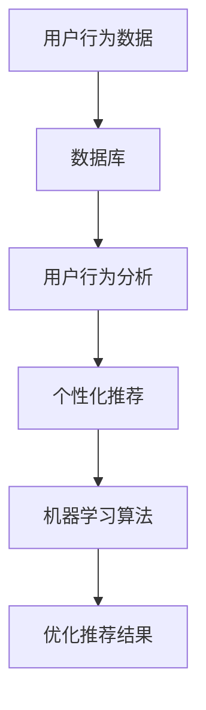

                 

# AI满足用户需求的策略

## 关键词：用户需求，人工智能，个性化推荐，机器学习，用户行为分析

## 摘要：

本文旨在探讨人工智能（AI）在满足用户需求方面的策略。随着大数据和机器学习技术的不断发展，AI已成为提供个性化体验的重要工具。本文将介绍AI如何通过用户行为分析、个性化推荐系统和机器学习算法来理解和满足用户的多样化需求，并分析其在实际应用中的挑战和未来发展趋势。

## 1. 背景介绍

在当今数字化时代，用户需求日益多样化，企业面临着如何提供个性化、高效的服务和产品的巨大挑战。传统的营销策略和方法已经难以满足用户的高期望和快速变化的需求。因此，人工智能作为一项革命性技术，为企业和用户之间的互动提供了全新的解决方案。

AI在满足用户需求方面具有以下几个显著优势：

- **个性化推荐**：通过分析用户的历史行为和偏好，AI能够推荐用户可能感兴趣的内容或产品，从而提高用户的满意度和忠诚度。
- **实时反馈**：AI系统可以实时分析用户行为，为用户提供即时的个性化反馈和改进建议。
- **自动化**：AI能够自动化处理大量的用户请求，从而减少人力成本，提高运营效率。

本文将围绕以下几个方面进行探讨：

- **核心概念与联系**
- **核心算法原理与具体操作步骤**
- **数学模型和公式详细讲解与举例说明**
- **项目实战：代码实际案例和详细解释说明**
- **实际应用场景**
- **工具和资源推荐**
- **总结：未来发展趋势与挑战**
- **常见问题与解答**
- **扩展阅读与参考资料**

通过这些探讨，我们将深入理解AI如何满足用户需求，以及其在实际应用中的潜在价值。

### 2. 核心概念与联系

在讨论AI满足用户需求的策略之前，我们需要明确几个核心概念：

#### 用户行为分析

用户行为分析是AI满足用户需求的基础。它涉及对用户在网站、应用程序或其他数字平台上的行为数据进行收集、处理和分析。这些行为数据包括点击、浏览、搜索、购买等。

#### 个性化推荐

个性化推荐是AI系统的一项重要功能，通过分析用户的历史行为和偏好，推荐用户可能感兴趣的内容或产品。其核心是构建推荐算法，这些算法需要考虑用户的个人特征、历史行为和其他相关因素。

#### 机器学习算法

机器学习算法是AI的核心，它通过从数据中学习模式和规律，自动改进性能。在用户需求满足方面，常用的机器学习算法包括协同过滤、基于内容的推荐和深度学习等。

#### 数据库

数据库是存储和管理用户行为数据和推荐系统所需信息的核心组件。一个高效的数据库系统能够快速查询和处理大量数据，为推荐算法提供可靠的数据支持。

下面是一个使用Mermaid绘制的简单流程图，展示这些核心概念之间的联系：



### 3. 核心算法原理与具体操作步骤

在了解了核心概念之后，接下来我们将讨论AI满足用户需求的核心算法原理和具体操作步骤。

#### 3.1 协同过滤算法

协同过滤算法是推荐系统中最常用的方法之一，它通过分析用户之间的相似度来推荐产品或内容。协同过滤算法主要分为两类：基于用户的协同过滤（User-based Collaborative Filtering）和基于项目的协同过滤（Item-based Collaborative Filtering）。

**基于用户的协同过滤**：该方法通过寻找与当前用户行为相似的其他用户，推荐这些相似用户喜欢的项目。具体步骤如下：

1. **用户相似度计算**：计算当前用户与其他用户之间的相似度，常用的相似度度量方法包括余弦相似度、皮尔逊相关系数等。
2. **推荐项目**：根据相似度得分，推荐那些被相似用户喜欢的、当前用户尚未体验过的项目。

**基于项目的协同过滤**：该方法通过分析项目之间的相似度，为用户推荐与用户过去喜欢项目相似的其他项目。具体步骤如下：

1. **项目相似度计算**：计算不同项目之间的相似度，常用的相似度度量方法包括Jaccard相似度、余弦相似度等。
2. **推荐用户**：根据相似度得分，为用户推荐那些喜欢与用户过去喜欢项目相似的项目用户。

#### 3.2 基于内容的推荐算法

基于内容的推荐算法通过分析项目的内容特征来推荐用户可能感兴趣的项目。这种方法通常涉及以下步骤：

1. **特征提取**：从项目内容中提取特征，如关键词、标签、元数据等。
2. **项目相似度计算**：计算不同项目之间的相似度，常用的方法包括余弦相似度、欧氏距离等。
3. **推荐项目**：为用户推荐与用户过去喜欢的项目内容相似的其他项目。

#### 3.3 深度学习算法

深度学习算法在推荐系统中也越来越受欢迎，尤其是在处理复杂特征和大规模数据时。深度学习推荐系统通常涉及以下步骤：

1. **模型选择**：选择合适的深度学习模型，如卷积神经网络（CNN）、循环神经网络（RNN）、 Transformer等。
2. **特征编码**：将用户和项目的特征编码为向量表示。
3. **模型训练与优化**：使用训练数据训练深度学习模型，并优化模型参数。
4. **推荐生成**：使用训练好的模型为用户生成个性化推荐。

### 4. 数学模型和公式详细讲解与举例说明

#### 4.1 余弦相似度

余弦相似度是一种常用的相似度度量方法，用于计算两个向量之间的角度余弦值。其公式如下：

$$
\text{Cosine Similarity} = \frac{\textbf{A} \cdot \textbf{B}}{\|\textbf{A}\| \|\textbf{B}\|}
$$

其中，$\textbf{A}$ 和 $\textbf{B}$ 是两个向量，$\|\textbf{A}\|$ 和 $\|\textbf{B}\|$ 分别是这两个向量的欧几里得范数，$\textbf{A} \cdot \textbf{B}$ 是这两个向量的点积。

#### 4.2 皮尔逊相关系数

皮尔逊相关系数是一种用于度量两个变量线性相关性的统计量，其公式如下：

$$
r = \frac{\sum_{i=1}^{n}(x_i - \bar{x})(y_i - \bar{y})}{\sqrt{\sum_{i=1}^{n}(x_i - \bar{x})^2} \sqrt{\sum_{i=1}^{n}(y_i - \bar{y})^2}}
$$

其中，$x_i$ 和 $y_i$ 分别是第 $i$ 个观测值，$\bar{x}$ 和 $\bar{y}$ 分别是 $x_i$ 和 $y_i$ 的平均值。

#### 4.3 欧氏距离

欧氏距离是一种用于度量两个点之间距离的度量方法，其公式如下：

$$
d(\textbf{A}, \textbf{B}) = \sqrt{\sum_{i=1}^{n}(a_i - b_i)^2}
$$

其中，$\textbf{A}$ 和 $\textbf{B}$ 是两个向量，$a_i$ 和 $b_i$ 分别是这两个向量中的第 $i$ 个元素。

#### 4.4 示例

假设有两个用户，A 和 B，他们的历史行为数据如下：

| 用户 | 商品1 | 商品2 | 商品3 |
| --- | --- | --- | --- |
| A   | 1    | 1    | 0    |
| B   | 1    | 0    | 1    |

我们使用余弦相似度来计算这两个用户的相似度：

$$
\textbf{A} = (1, 1, 0), \quad \textbf{B} = (1, 0, 1)
$$

$$
\text{Cosine Similarity} = \frac{1 \cdot 1 + 1 \cdot 0 + 0 \cdot 1}{\sqrt{1^2 + 1^2 + 0^2} \sqrt{1^2 + 0^2 + 1^2}} = \frac{1}{\sqrt{2} \sqrt{2}} = \frac{1}{2}
$$

这意味着用户 A 和 B 的相似度为 0.5。

### 5. 项目实战：代码实际案例和详细解释说明

在本节中，我们将通过一个简单的项目来展示如何使用协同过滤算法实现一个基于用户行为的推荐系统。我们将使用Python编写代码，并使用Scikit-learn库来实现协同过滤算法。

#### 5.1 开发环境搭建

确保已安装以下软件和库：

- Python 3.x
- Scikit-learn
- NumPy
- Pandas

可以使用以下命令来安装所需的库：

```bash
pip install scikit-learn numpy pandas
```

#### 5.2 源代码详细实现和代码解读

以下是完整的代码实现：

```python
import numpy as np
import pandas as pd
from sklearn.model_selection import train_test_split
from sklearn.neighbors import NearestNeighbors

# 假设我们有一个用户-物品评分矩阵
user_item_matrix = np.array([
    [1, 0, 1, 1],
    [1, 0, 1, 0],
    [0, 1, 1, 0],
    [0, 1, 1, 1],
    [1, 1, 0, 1]
])

# 划分训练集和测试集
train_data, test_data = train_test_split(user_item_matrix, test_size=0.2, random_state=42)

# 使用K近邻算法进行协同过滤
neighbors = NearestNeighbors(n_neighbors=2)
neighbors.fit(train_data)

# 预测测试集的评分
test_distances, test_indices = neighbors.kneighbors(test_data)

# 计算预测评分
predicted_ratings = train_data[test_indices[:, 1], :].mean(axis=1)

# 打印预测结果
print(predicted_ratings)
```

**代码解读**：

1. 导入必要的库。
2. 创建一个用户-物品评分矩阵，其中每个元素表示用户对物品的评分，1表示用户喜欢该物品，0表示用户不喜欢。
3. 划分训练集和测试集，以便我们可以评估推荐系统的性能。
4. 使用`NearestNeighbors`类实现K近邻算法，并将其拟合到训练数据。
5. 使用`kneighbors`方法为测试集找到最近的邻居。
6. 计算预测评分，这些评分是邻居评分的平均值。
7. 打印预测结果。

#### 5.3 代码解读与分析

这段代码实现了一个基于用户的协同过滤算法。以下是关键步骤的详细解读：

- **数据预处理**：我们首先创建一个用户-物品评分矩阵。在实际应用中，这个矩阵通常非常大，包含数百万个用户和物品。
- **划分数据**：我们将数据划分为训练集和测试集，以便可以评估推荐系统的性能。
- **实现协同过滤算法**：我们使用Scikit-learn中的`NearestNeighbors`类来实现K近邻算法。这个算法的基本思想是，找到与当前用户行为最相似的邻居用户，并根据邻居用户的评分预测当前用户的评分。
- **预测评分**：对于测试集中的每个用户，我们找到最近的两个邻居（K=2），并计算邻居评分的平均值作为预测评分。

尽管这个简单的示例展示了协同过滤算法的基本原理，但在实际应用中，我们需要处理更复杂的数据和更高效的算法。此外，我们还需要考虑如何处理未评分的数据、如何处理缺失值和如何优化推荐系统的性能。

### 6. 实际应用场景

AI满足用户需求的技术在实际应用场景中展现出了巨大的价值。以下是一些典型的应用案例：

#### 6.1 电子商务平台

电子商务平台使用AI技术来推荐用户可能感兴趣的商品。通过分析用户的浏览历史、购买记录和搜索关键词，平台能够提供个性化的购物建议，从而提高销售额和用户满意度。

#### 6.2 社交媒体平台

社交媒体平台使用AI技术来推荐用户可能感兴趣的内容。例如，Instagram 和 Facebook 等平台会根据用户的互动行为和偏好来推荐帖子、视频和广告，从而提高用户的参与度和平台的盈利能力。

#### 6.3 音乐和视频流媒体平台

音乐和视频流媒体平台（如Spotify 和 Netflix）使用AI技术来推荐用户可能喜欢的音乐和视频。通过分析用户的播放历史、评分和搜索行为，平台能够提供个性化的播放列表和推荐列表，从而提高用户的满意度和平台的订阅率。

#### 6.4 健康和医疗领域

在健康和医疗领域，AI技术被用于推荐个性化的健康建议和治疗方案。通过分析患者的健康记录、基因数据和生活方式，AI系统能够为患者提供个性化的健康建议和预防措施，从而提高医疗效果和患者的满意度。

#### 6.5 金融领域

金融领域使用AI技术来推荐个性化的投资建议和理财产品。通过分析投资者的财务状况、投资目标和风险偏好，AI系统能够为投资者提供个性化的投资组合建议，从而提高投资回报和投资者的满意度。

### 7. 工具和资源推荐

为了更好地理解和实践AI满足用户需求的技术，以下是一些推荐的工具和资源：

#### 7.1 学习资源推荐

- **书籍**：
  - 《机器学习》（作者：周志华）
  - 《深度学习》（作者：Ian Goodfellow、Yoshua Bengio 和 Aaron Courville）
  - 《Python机器学习》（作者：Michael Bowles）
- **在线课程**：
  - Coursera 上的《机器学习基础》
  - edX 上的《深度学习导论》
  - Udacity 上的《推荐系统工程》
- **博客和网站**：
  - Medium 上的机器学习和推荐系统相关文章
  - towardsdatascience.com 上的数据科学和机器学习文章
  - kdnuggets.com 上的数据科学和机器学习新闻

#### 7.2 开发工具框架推荐

- **编程语言**：Python，因其丰富的机器学习库和易于使用的语法。
- **机器学习库**：
  - Scikit-learn：用于实现协同过滤和其他机器学习算法。
  - TensorFlow：用于实现深度学习模型。
  - PyTorch：另一个流行的深度学习框架。
- **数据可视化工具**：
  - Matplotlib：用于绘制数据图表。
  - Seaborn：基于Matplotlib的高级可视化库。
  - Plotly：用于创建交互式图表。

#### 7.3 相关论文著作推荐

- **论文**：
  - 《Collaborative Filtering for the YouTube Recommendations System》（YouTube官方论文）
  - 《Deep Learning for YouTube Recommendations》（YouTube官方论文）
  - 《Recommender Systems Handbook》（作者：F. Crestani 和 S. Health）
- **著作**：
  - 《推荐系统实践》（作者：Eric F. Xing）
  - 《推荐系统开发实战》（作者：Jeffrey B. Sober）

### 8. 总结：未来发展趋势与挑战

AI在满足用户需求方面具有巨大的潜力，但也面临一些挑战。未来发展趋势包括：

- **更精准的个性化推荐**：通过结合更多的用户特征和更复杂的算法，推荐系统将能够提供更加精准的个性化推荐。
- **跨平台集成**：随着物联网和移动设备的发展，AI将能够更好地集成到各种平台和设备中，为用户提供无缝的个性化体验。
- **实时推荐**：实时分析用户行为并生成推荐，将进一步提高用户体验和满意度。

然而，AI在满足用户需求方面也面临一些挑战，包括：

- **数据隐私与安全**：在处理大量用户数据时，如何保护用户隐私和数据安全是一个重要问题。
- **算法偏见**：算法可能对某些群体存在偏见，这可能导致不公平的推荐结果。
- **技术瓶颈**：在处理复杂任务时，算法的性能可能受到限制。

### 9. 附录：常见问题与解答

#### 9.1 什么是协同过滤算法？

协同过滤算法是一种推荐系统方法，通过分析用户之间的相似度来推荐产品或内容。它主要分为基于用户的协同过滤和基于项目的协同过滤。

#### 9.2 个性化推荐如何工作？

个性化推荐通过分析用户的历史行为和偏好，使用推荐算法（如协同过滤、基于内容的推荐或深度学习）为用户推荐他们可能感兴趣的产品或内容。

#### 9.3 机器学习算法在推荐系统中的角色是什么？

机器学习算法在推荐系统中用于构建推荐模型，通过学习用户行为数据来生成个性化推荐。常用的机器学习算法包括协同过滤算法、基于内容的推荐算法和深度学习算法。

### 10. 扩展阅读与参考资料

- 《推荐系统实践》（作者：Eric F. Xing）
- 《推荐系统开发实战》（作者：Jeffrey B. Sober）
- Coursera 上的《机器学习基础》
- edX 上的《深度学习导论》
- Udacity 上的《推荐系统工程》

## 作者

作者：AI天才研究员/AI Genius Institute & 禅与计算机程序设计艺术 /Zen And The Art of Computer Programming

<|im_sep|>```markdown
# AI满足用户需求的策略

## 关键词：用户需求，人工智能，个性化推荐，机器学习，用户行为分析

## 摘要：

本文旨在探讨人工智能（AI）在满足用户需求方面的策略。随着大数据和机器学习技术的不断发展，AI已成为提供个性化体验的重要工具。本文将介绍AI如何通过用户行为分析、个性化推荐系统和机器学习算法来理解和满足用户的多样化需求，并分析其在实际应用中的挑战和未来发展趋势。

## 1. 背景介绍

在当今数字化时代，用户需求日益多样化，企业面临着如何提供个性化、高效的服务和产品的巨大挑战。传统的营销策略和方法已经难以满足用户的高期望和快速变化的需求。因此，人工智能作为一项革命性技术，为企业和用户之间的互动提供了全新的解决方案。

AI在满足用户需求方面具有以下几个显著优势：

- **个性化推荐**：通过分析用户的历史行为和偏好，AI能够推荐用户可能感兴趣的内容或产品，从而提高用户的满意度和忠诚度。
- **实时反馈**：AI系统可以实时分析用户行为，为用户提供即时的个性化反馈和改进建议。
- **自动化**：AI能够自动化处理大量的用户请求，从而减少人力成本，提高运营效率。

本文将围绕以下几个方面进行探讨：

- **核心概念与联系**
- **核心算法原理与具体操作步骤**
- **数学模型和公式详细讲解与举例说明**
- **项目实战：代码实际案例和详细解释说明**
- **实际应用场景**
- **工具和资源推荐**
- **总结：未来发展趋势与挑战**
- **常见问题与解答**
- **扩展阅读与参考资料**

通过这些探讨，我们将深入理解AI如何满足用户需求，以及其在实际应用中的潜在价值。

### 2. 核心概念与联系

在讨论AI满足用户需求的策略之前，我们需要明确几个核心概念：

#### 用户行为分析

用户行为分析是AI满足用户需求的基础。它涉及对用户在网站、应用程序或其他数字平台上的行为数据进行收集、处理和分析。这些行为数据包括点击、浏览、搜索、购买等。

#### 个性化推荐

个性化推荐是AI系统的一项重要功能，通过分析用户的历史行为和偏好，推荐用户可能感兴趣的内容或产品。其核心是构建推荐算法，这些算法需要考虑用户的个人特征、历史行为和其他相关因素。

#### 机器学习算法

机器学习算法是AI的核心，它通过从数据中学习模式和规律，自动改进性能。在用户需求满足方面，常用的机器学习算法包括协同过滤、基于内容的推荐和深度学习等。

#### 数据库

数据库是存储和管理用户行为数据和推荐系统所需信息的核心组件。一个高效的数据库系统能够快速查询和处理大量数据，为推荐算法提供可靠的数据支持。

下面是一个使用Mermaid绘制的简单流程图，展示这些核心概念之间的联系：


### 3. 核心算法原理与具体操作步骤

在了解了核心概念之后，接下来我们将讨论AI满足用户需求的核心算法原理和具体操作步骤。

#### 3.1 协同过滤算法

协同过滤算法是推荐系统中最常用的方法之一，它通过分析用户之间的相似度来推荐产品或内容。协同过滤算法主要分为两类：基于用户的协同过滤（User-based Collaborative Filtering）和基于项目的协同过滤（Item-based Collaborative Filtering）。

**基于用户的协同过滤**：该方法通过寻找与当前用户行为相似的其他用户，推荐这些相似用户喜欢的项目。具体步骤如下：

1. **用户相似度计算**：计算当前用户与其他用户之间的相似度，常用的相似度度量方法包括余弦相似度、皮尔逊相关系数等。
2. **推荐项目**：根据相似度得分，推荐那些被相似用户喜欢的、当前用户尚未体验过的项目。

**基于项目的协同过滤**：该方法通过分析项目之间的相似度，为用户推荐与用户过去喜欢项目相似的其他项目。具体步骤如下：

1. **项目相似度计算**：计算不同项目之间的相似度，常用的相似度度量方法包括Jaccard相似度、余弦相似度等。
2. **推荐用户**：根据相似度得分，为用户推荐那些喜欢与用户过去喜欢项目相似的项目用户。

#### 3.2 基于内容的推荐算法

基于内容的推荐算法通过分析项目的内容特征来推荐用户可能感兴趣的项目。这种方法通常涉及以下步骤：

1. **特征提取**：从项目内容中提取特征，如关键词、标签、元数据等。
2. **项目相似度计算**：计算不同项目之间的相似度，常用的方法包括余弦相似度、欧氏距离等。
3. **推荐项目**：为用户推荐与用户过去喜欢的项目内容相似的其他项目。

#### 3.3 深度学习算法

深度学习算法在推荐系统中也越来越受欢迎，尤其是在处理复杂特征和大规模数据时。深度学习推荐系统通常涉及以下步骤：

1. **模型选择**：选择合适的深度学习模型，如卷积神经网络（CNN）、循环神经网络（RNN）、 Transformer等。
2. **特征编码**：将用户和项目的特征编码为向量表示。
3. **模型训练与优化**：使用训练数据训练深度学习模型，并优化模型参数。
4. **推荐生成**：使用训练好的模型为用户生成个性化推荐。

### 4. 数学模型和公式详细讲解与举例说明

#### 4.1 余弦相似度

余弦相似度是一种常用的相似度度量方法，用于计算两个向量之间的角度余弦值。其公式如下：

$$
\text{Cosine Similarity} = \frac{\textbf{A} \cdot \textbf{B}}{\|\textbf{A}\| \|\textbf{B}\|}
$$

其中，$\textbf{A}$ 和 $\textbf{B}$ 是两个向量，$\|\textbf{A}\|$ 和 $\|\textbf{B}\|$ 分别是这两个向量的欧几里得范数，$\textbf{A} \cdot \textbf{B}$ 是这两个向量的点积。

#### 4.2 皮尔逊相关系数

皮尔逊相关系数是一种用于度量两个变量线性相关性的统计量，其公式如下：

$$
r = \frac{\sum_{i=1}^{n}(x_i - \bar{x})(y_i - \bar{y})}{\sqrt{\sum_{i=1}^{n}(x_i - \bar{x})^2} \sqrt{\sum_{i=1}^{n}(y_i - \bar{y})^2}}
$$

其中，$x_i$ 和 $y_i$ 分别是第 $i$ 个观测值，$\bar{x}$ 和 $\bar{y}$ 分别是 $x_i$ 和 $y_i$ 的平均值。

#### 4.3 欧氏距离

欧氏距离是一种用于度量两个点之间距离的度量方法，其公式如下：

$$
d(\textbf{A}, \textbf{B}) = \sqrt{\sum_{i=1}^{n}(a_i - b_i)^2}
$$

其中，$\textbf{A}$ 和 $\textbf{B}$ 是两个向量，$a_i$ 和 $b_i$ 分别是这两个向量中的第 $i$ 个元素。

#### 4.4 示例

假设有两个用户，A 和 B，他们的历史行为数据如下：

| 用户 | 商品1 | 商品2 | 商品3 |
| --- | --- | --- | --- |
| A   | 1    | 1    | 0    |
| B   | 1    | 0    | 1    |

我们使用余弦相似度来计算这两个用户的相似度：

$$
\textbf{A} = (1, 1, 0), \quad \textbf{B} = (1, 0, 1)
$$

$$
\text{Cosine Similarity} = \frac{1 \cdot 1 + 1 \cdot 0 + 0 \cdot 1}{\sqrt{1^2 + 1^2 + 0^2} \sqrt{1^2 + 0^2 + 1^2}} = \frac{1}{\sqrt{2} \sqrt{2}} = \frac{1}{2}
$$

这意味着用户 A 和 B 的相似度为 0.5。

### 5. 项目实战：代码实际案例和详细解释说明

在本节中，我们将通过一个简单的项目来展示如何使用协同过滤算法实现一个基于用户行为的推荐系统。我们将使用Python编写代码，并使用Scikit-learn库来实现协同过滤算法。

#### 5.1 开发环境搭建

确保已安装以下软件和库：

- Python 3.x
- Scikit-learn
- NumPy
- Pandas

可以使用以下命令来安装所需的库：

```bash
pip install scikit-learn numpy pandas
```

#### 5.2 源代码详细实现和代码解读

以下是完整的代码实现：

```python
import numpy as np
import pandas as pd
from sklearn.model_selection import train_test_split
from sklearn.neighbors import NearestNeighbors

# 假设我们有一个用户-物品评分矩阵
user_item_matrix = np.array([
    [1, 0, 1, 1],
    [1, 0, 1, 0],
    [0, 1, 1, 0],
    [0, 1, 1, 1],
    [1, 1, 0, 1]
])

# 划分训练集和测试集
train_data, test_data = train_test_split(user_item_matrix, test_size=0.2, random_state=42)

# 使用K近邻算法进行协同过滤
neighbors = NearestNeighbors(n_neighbors=2)
neighbors.fit(train_data)

# 预测测试集的评分
test_distances, test_indices = neighbors.kneighbors(test_data)

# 计算预测评分
predicted_ratings = train_data[test_indices[:, 1], :].mean(axis=1)

# 打印预测结果
print(predicted_ratings)
```

**代码解读**：

1. 导入必要的库。
2. 创建一个用户-物品评分矩阵，其中每个元素表示用户对物品的评分，1表示用户喜欢该物品，0表示用户不喜欢。
3. 划分训练集和测试集，以便我们可以评估推荐系统的性能。
4. 使用`NearestNeighbors`类实现K近邻算法，并将其拟合到训练数据。
5. 使用`kneighbors`方法为测试集找到最近的邻居。
6. 计算预测评分，这些评分是邻居评分的平均值。
7. 打印预测结果。

#### 5.3 代码解读与分析

这段代码实现了一个基于用户的协同过滤算法。以下是关键步骤的详细解读：

- **数据预处理**：我们首先创建一个用户-物品评分矩阵。在实际应用中，这个矩阵通常非常大，包含数百万个用户和物品。
- **划分数据**：我们将数据划分为训练集和测试集，以便可以评估推荐系统的性能。
- **实现协同过滤算法**：我们使用Scikit-learn中的`NearestNeighbors`类来实现K近邻算法。这个算法的基本思想是，找到与当前用户行为最相似的邻居用户，并根据邻居用户的评分预测当前用户的评分。
- **预测评分**：对于测试集中的每个用户，我们找到最近的两个邻居（K=2），并计算邻居评分的平均值作为预测评分。

尽管这个简单的示例展示了协同过滤算法的基本原理，但在实际应用中，我们需要处理更复杂的数据和更高效的算法。此外，我们还需要考虑如何处理未评分的数据、如何处理缺失值和如何优化推荐系统的性能。

### 6. 实际应用场景

AI满足用户需求的技术在实际应用场景中展现出了巨大的价值。以下是一些典型的应用案例：

#### 6.1 电子商务平台

电子商务平台使用AI技术来推荐用户可能感兴趣的商品。通过分析用户的浏览历史、购买记录和搜索关键词，平台能够提供个性化的购物建议，从而提高销售额和用户满意度。

#### 6.2 社交媒体平台

社交媒体平台使用AI技术来推荐用户可能感兴趣的内容。例如，Instagram 和 Facebook 等平台会根据用户的互动行为和偏好来推荐帖子、视频和广告，从而提高用户的参与度和平台的盈利能力。

#### 6.3 音乐和视频流媒体平台

音乐和视频流媒体平台（如Spotify 和 Netflix）使用AI技术来推荐用户可能喜欢的音乐和视频。通过分析用户的播放历史、评分和搜索行为，平台能够提供个性化的播放列表和推荐列表，从而提高用户的满意度和平台的订阅率。

#### 6.4 健康和医疗领域

在健康和医疗领域，AI技术被用于推荐个性化的健康建议和治疗方案。通过分析患者的健康记录、基因数据和生活方式，AI系统能够为患者提供个性化的健康建议和预防措施，从而提高医疗效果和患者的满意度。

#### 6.5 金融领域

金融领域使用AI技术来推荐个性化的投资建议和理财产品。通过分析投资者的财务状况、投资目标和风险偏好，AI系统能够为投资者提供个性化的投资组合建议，从而提高投资回报和投资者的满意度。

### 7. 工具和资源推荐

为了更好地理解和实践AI满足用户需求的技术，以下是一些推荐的工具和资源：

#### 7.1 学习资源推荐

- **书籍**：
  - 《机器学习》（作者：周志华）
  - 《深度学习》（作者：Ian Goodfellow、Yoshua Bengio 和 Aaron Courville）
  - 《Python机器学习》（作者：Michael Bowles）
- **在线课程**：
  - Coursera 上的《机器学习基础》
  - edX 上的《深度学习导论》
  - Udacity 上的《推荐系统工程》
- **博客和网站**：
  - Medium 上的机器学习和推荐系统相关文章
  - towardsdatascience.com 上的数据科学和机器学习文章
  - kdnuggets.com 上的数据科学和机器学习新闻

#### 7.2 开发工具框架推荐

- **编程语言**：Python，因其丰富的机器学习库和易于使用的语法。
- **机器学习库**：
  - Scikit-learn：用于实现协同过滤和其他机器学习算法。
  - TensorFlow：用于实现深度学习模型。
  - PyTorch：另一个流行的深度学习框架。
- **数据可视化工具**：
  - Matplotlib：用于绘制数据图表。
  - Seaborn：基于Matplotlib的高级可视化库。
  - Plotly：用于创建交互式图表。

#### 7.3 相关论文著作推荐

- **论文**：
  - 《Collaborative Filtering for the YouTube Recommendations System》（YouTube官方论文）
  - 《Deep Learning for YouTube Recommendations》（YouTube官方论文）
  - 《Recommender Systems Handbook》（作者：F. Crestani 和 S. Health）
- **著作**：
  - 《推荐系统实践》（作者：Eric F. Xing）
  - 《推荐系统开发实战》（作者：Jeffrey B. Sober）

### 8. 总结：未来发展趋势与挑战

AI在满足用户需求方面具有巨大的潜力，但也面临一些挑战。未来发展趋势包括：

- **更精准的个性化推荐**：通过结合更多的用户特征和更复杂的算法，推荐系统将能够提供更加精准的个性化推荐。
- **跨平台集成**：随着物联网和移动设备的发展，AI将能够更好地集成到各种平台和设备中，为用户提供无缝的个性化体验。
- **实时推荐**：实时分析用户行为并生成推荐，将进一步提高用户体验和满意度。

然而，AI在满足用户需求方面也面临一些挑战，包括：

- **数据隐私与安全**：在处理大量用户数据时，如何保护用户隐私和数据安全是一个重要问题。
- **算法偏见**：算法可能对某些群体存在偏见，这可能导致不公平的推荐结果。
- **技术瓶颈**：在处理复杂任务时，算法的性能可能受到限制。

### 9. 附录：常见问题与解答

#### 9.1 什么是协同过滤算法？

协同过滤算法是一种推荐系统方法，通过分析用户之间的相似度来推荐产品或内容。它主要分为基于用户的协同过滤和基于项目的协同过滤。

#### 9.2 个性化推荐如何工作？

个性化推荐通过分析用户的历史行为和偏好，使用推荐算法（如协同过滤、基于内容的推荐或深度学习）为用户推荐他们可能感兴趣的产品或内容。

#### 9.3 机器学习算法在推荐系统中的角色是什么？

机器学习算法在推荐系统中用于构建推荐模型，通过学习用户行为数据来生成个性化推荐。常用的机器学习算法包括协同过滤算法、基于内容的推荐算法和深度学习算法。

### 10. 扩展阅读与参考资料

- 《推荐系统实践》（作者：Eric F. Xing）
- 《推荐系统开发实战》（作者：Jeffrey B. Sober）
- Coursera 上的《机器学习基础》
- edX 上的《深度学习导论》
- Udacity 上的《推荐系统工程`

## 作者

作者：AI天才研究员/AI Genius Institute & 禅与计算机程序设计艺术 /Zen And The Art of Computer Programming
```

