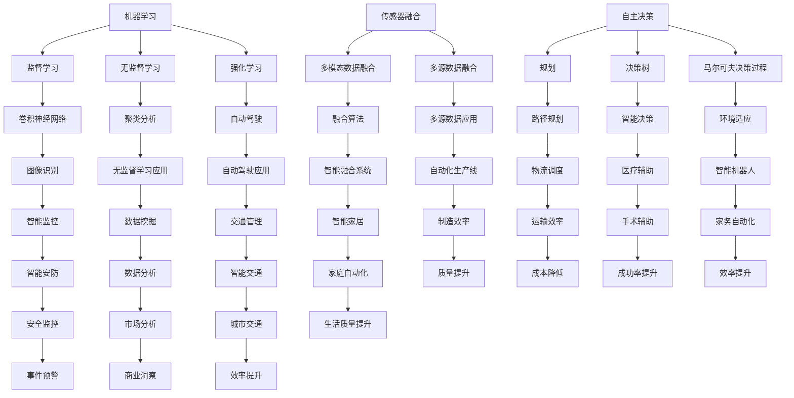

                 

### 背景介绍

人工智能（AI）在过去几十年中取得了飞速发展，从最初的规则基础系统到现代的深度学习模型，AI 已经渗透到我们日常生活的各个方面。然而，尽管 AI 在图像识别、自然语言处理和推荐系统等方面表现出色，但在物理实体自动化方面仍面临诸多挑战。

物理实体自动化，即通过 AI 技术实现物理世界的自动化操作，包括机器人、自动化生产线、智能交通系统等。这一领域的兴起，源于工业自动化和智能制造的需求。传统工业生产方式依赖于大量的人工操作和手动控制，这不仅效率低下，而且容易出错。随着人工智能技术的发展，利用 AI 算法进行实时感知、决策和执行，成为提高生产效率和产品质量的重要手段。

当前，物理实体自动化在制造业、物流、医疗、交通等多个领域取得了显著成果。例如，在制造业中，自动化生产线和机器人广泛应用于焊接、装配、检测等环节，实现了生产过程的无人化；在物流领域，自动驾驶卡车和无人机配送正在逐步替代传统运输方式；在医疗领域，智能机器人辅助医生进行手术，提高了手术的精准度和成功率；在交通领域，智能交通系统通过实时感知和智能调度，缓解了城市交通拥堵问题。

尽管物理实体自动化前景广阔，但仍面临诸多挑战。首先，AI 算法在复杂环境下的适应性较差，难以应对动态和不确定的场景。其次，硬件设备与 AI 算法的协同性不足，导致系统整体效率较低。此外，数据隐私和安全问题、法律法规的制定与完善等也是亟待解决的问题。

本文将围绕物理实体自动化的挑战，从算法原理、技术架构、应用场景、工具资源等方面进行深入探讨，以期为这一领域的发展提供有益的参考。

### 核心概念与联系

物理实体自动化的实现离不开几个关键概念，包括机器学习、深度学习、传感器融合、自主决策等。以下我们将逐一介绍这些概念，并通过 Mermaid 流程图展示它们之间的联系。

#### 1. 机器学习（Machine Learning）

机器学习是一种使计算机通过数据学习并改进自身性能的方法。它分为监督学习、无监督学习和强化学习三种主要类型。

- **监督学习（Supervised Learning）**：通过标记数据训练模型，使其能够对未知数据进行预测或分类。例如，通过标注的图像数据训练一个图像分类器。
- **无监督学习（Unsupervised Learning）**：模型在未标记的数据中自动发现模式，如聚类分析。
- **强化学习（Reinforcement Learning）**：通过与环境的互动，学习最大化某种累积奖励。例如，自动驾驶汽车通过与环境互动学习最佳行驶策略。

#### 2. 深度学习（Deep Learning）

深度学习是机器学习的一个分支，通过多层神经网络模拟人脑的学习过程，具有强大的特征提取和表达能力。

- **卷积神经网络（CNN）**：常用于图像和视频处理，通过卷积层提取空间特征。
- **循环神经网络（RNN）**：适用于序列数据，如文本和语音，通过循环结构保持长期依赖信息。
- **生成对抗网络（GAN）**：通过生成器和判别器的对抗训练，学习生成逼真的数据。

#### 3. 传感器融合（Sensor Fusion）

传感器融合是将多个传感器数据集成到一个统一的框架中，以获得更准确的感知和理解。常见的传感器包括摄像头、雷达、激光雷达、GPS 等。

- **多模态数据融合**：结合不同类型的传感器数据，如视觉、雷达和惯性测量单元（IMU）。
- **多源数据融合**：整合来自多个设备和传感器网络的数据。

#### 4. 自主决策（Autonomous Decision Making）

自主决策是指系统能够在复杂环境下，根据实时感知到的信息进行合理的决策和执行。

- **规划（Planning）**：在给定环境和目标的情况下，生成一系列动作序列。
- **决策树（Decision Tree）**：通过一系列条件判断，确定最佳行动方案。
- **马尔可夫决策过程（MDP）**：通过状态和奖励函数，学习最优策略。

#### Mermaid 流程图



通过上述 Mermaid 流程图，我们可以清晰地看到物理实体自动化中的各个核心概念及其相互关系。这些概念共同构成了一个复杂的系统，通过相互协作，实现物理世界的自动化操作。

### 核心算法原理 & 具体操作步骤

物理实体自动化系统的核心在于如何将感知到的环境信息转化为有效的行动策略。在这一过程中，核心算法的原理和操作步骤至关重要。以下将详细阐述几种常用的核心算法原理，并介绍其实施步骤。

#### 1. 卷积神经网络（CNN）原理与操作步骤

卷积神经网络（CNN）是一种广泛应用于图像处理和识别的深度学习模型。其核心原理是通过多层卷积和池化操作，提取图像的层次特征，从而实现分类或检测任务。

**原理：**

- **卷积层（Convolutional Layer）**：通过卷积核在输入图像上滑动，计算局部特征。
- **激活函数（Activation Function）**：通常使用 ReLU 函数，增加网络训练的稳定性。
- **池化层（Pooling Layer）**：通过下采样操作，减少参数数量，防止过拟合。
- **全连接层（Fully Connected Layer）**：将卷积层和池化层提取的特征映射到具体的分类结果。

**操作步骤：**

1. **数据预处理**：将输入图像归一化，裁剪或缩放到固定的尺寸。
2. **构建网络结构**：定义卷积层、激活函数、池化层和全连接层的参数。
3. **训练模型**：使用标注数据训练模型，通过反向传播算法优化模型参数。
4. **评估模型**：使用验证集评估模型性能，调整网络结构或参数。
5. **部署模型**：将训练好的模型部署到目标设备上，进行实时图像识别或检测。

#### 2. 强化学习（Reinforcement Learning）原理与操作步骤

强化学习是一种通过与环境交互，学习最优策略的算法。其核心原理是通过奖励信号引导模型不断优化策略，从而实现目标。

**原理：**

- **状态（State）**：环境当前的状态。
- **动作（Action）**：模型可以执行的动作。
- **奖励（Reward）**：根据动作的结果给予的奖励信号，用于指导模型学习。
- **策略（Policy）**：模型选择动作的策略，通常通过值函数或策略梯度优化。

**操作步骤：**

1. **初始化环境**：定义状态和动作空间，初始化模型参数。
2. **选择动作**：根据当前状态，使用策略选择一个动作。
3. **执行动作**：在环境中执行选择到的动作，获得状态转移和奖励。
4. **更新模型**：根据新的状态和奖励，更新模型参数，优化策略。
5. **重复迭代**：重复执行上述步骤，直至达到目标或满足停止条件。

#### 3. 传感器融合（Sensor Fusion）原理与操作步骤

传感器融合是将多个传感器数据集成到一个统一的框架中，以获得更准确的感知和理解。其核心原理是利用多源数据互补性，提高系统整体的感知能力。

**原理：**

- **数据融合策略**：根据传感器类型和数据特性，选择合适的数据融合方法，如卡尔曼滤波、贝叶斯滤波等。
- **特征提取**：从每个传感器数据中提取关键特征，如视觉特征、雷达特征、惯性特征等。
- **融合算法**：将提取的特征进行融合，得到统一的感知结果。

**操作步骤：**

1. **选择传感器**：根据应用需求，选择合适的传感器类型。
2. **数据采集**：从各个传感器采集数据。
3. **特征提取**：对传感器数据进行预处理和特征提取。
4. **数据融合**：使用融合算法将提取的特征进行融合。
5. **感知结果**：根据融合结果进行感知决策，如路径规划、目标跟踪等。

通过上述核心算法的原理和操作步骤，我们可以看到物理实体自动化系统的复杂性和多样性。在实际应用中，这些算法往往需要结合具体场景进行定制化开发，以满足不同的需求。

### 数学模型和公式 & 详细讲解 & 举例说明

在物理实体自动化的实现过程中，数学模型和公式扮演着至关重要的角色。它们不仅为算法提供了理论基础，还帮助我们理解和优化系统的性能。以下将详细讲解几个关键的数学模型和公式，并通过实际例子进行说明。

#### 1. 贝叶斯滤波（Bayesian Filtering）

贝叶斯滤波是一种基于贝叶斯理论的数据融合方法，用于估计系统的状态。它通过融合先验知识和观测数据，实现对状态的概率估计。

**公式：**

$$
\hat{x}_{k} = f_k(\hat{x}_{k-1}, u_k) + w_k
$$

$$
P_k = F_k P_{k-1} F_k^T + Q_k
$$

$$
\hat{z}_{k} = h_k(\hat{x}_{k}) + v_k
$$

$$
P_{z,k} = H_k P_k H_k^T + R_k
$$

其中：

- $\hat{x}_{k}$：状态估计
- $P_k$：状态估计的不确定性矩阵
- $u_k$：控制输入
- $w_k$：过程噪声
- $Q_k$：过程噪声协方差
- $\hat{z}_{k}$：观测值
- $v_k$：观测噪声
- $R_k$：观测噪声协方差
- $f_k$：状态转移模型
- $F_k$：状态转移矩阵
- $h_k$：观测模型
- $H_k$：观测矩阵

**例子：**

假设一个自动驾驶系统需要估计车辆的位置和速度。通过传感器（如 GPS 和雷达）采集到的观测数据，结合车辆的先验知识和控制指令，使用贝叶斯滤波估计车辆的状态。

1. **状态转移模型**：根据车辆的动力学模型，定义状态转移矩阵 $F_k$ 和过程噪声协方差 $Q_k$。
2. **观测模型**：根据传感器的观测特性，定义观测矩阵 $H_k$ 和观测噪声协方差 $R_k$。
3. **初始化**：设置先验状态估计 $\hat{x}_{0}$ 和不确定性矩阵 $P_0$。
4. **滤波迭代**：根据控制输入 $u_k$ 和观测数据 $z_k$，更新状态估计和不确定性矩阵。

通过贝叶斯滤波，我们可以实时估计车辆的位置和速度，提高系统的稳定性和准确性。

#### 2. 马尔可夫决策过程（Markov Decision Process, MDP）

马尔可夫决策过程是一种用于优化决策的数学模型。它描述了在不确定环境下，通过一系列决策序列最大化期望奖励的过程。

**公式：**

$$
V(s) = \max_a \sum_{s'} p(s'|s,a) \cdot \sum_{r} r(s',a) + \gamma V(s')
$$

$$
\pi(a|s) = \arg\max_a \sum_{s'} p(s'|s,a) \cdot \sum_{r} r(s',a) + \gamma V(s')
$$

其中：

- $V(s)$：状态值函数，表示在给定状态下采取最优策略的期望奖励。
- $\pi(a|s)$：策略概率分布，表示在给定状态下采取每个动作的概率。
- $s$：状态
- $a$：动作
- $s'$：状态转移
- $r(s',a)$：在状态 $s'$ 下采取动作 $a$ 的即时奖励
- $\gamma$：折扣因子，用于平衡长期和短期奖励

**例子：**

假设一个机器人需要在未知环境中进行路径规划。通过传感器感知当前状态，结合先前的决策和即时奖励，使用 MDP 优化其路径选择。

1. **定义状态空间**：根据环境特征，定义状态空间，如位置、方向等。
2. **定义动作空间**：根据机器人的控制能力，定义动作空间，如前进、后退、转向等。
3. **定义奖励函数**：根据目标，定义奖励函数，如到达目标点的奖励、避开障碍物的奖励等。
4. **初始化**：设置初始状态值函数 $V(s_0)$ 和策略概率分布 $\pi(a|s_0)$。
5. **策略迭代**：根据状态转移概率和奖励函数，更新状态值函数和策略概率分布，直至收敛。

通过 MDP，我们可以找到最优的路径规划策略，使机器人能够高效、安全地到达目标。

#### 3. 卷积神经网络（Convolutional Neural Network, CNN）

卷积神经网络是一种用于图像处理和识别的深度学习模型。它通过多层卷积和池化操作，提取图像的层次特征，从而实现分类或检测任务。

**公式：**

$$
\hat{y} = \sigma(W_L \cdot \phi(W_{L-1} \cdot \phi(\cdots \phi(W_1 \cdot \phi(x) + b_1) + b_2) \cdots) + b_L
$$

其中：

- $\hat{y}$：输出分类结果
- $W_L, W_{L-1}, \ldots, W_1$：卷积层权重矩阵
- $\phi$：激活函数，通常使用 ReLU 函数
- $b_L, b_{L-1}, \ldots, b_1$：偏置项
- $x$：输入图像
- $\sigma$：激活函数，通常使用 Softmax 函数

**例子：**

假设我们需要训练一个 CNN 模型，用于识别猫和狗的图像。

1. **数据预处理**：将输入图像缩放到固定的尺寸，并进行归一化处理。
2. **构建网络结构**：定义卷积层、池化层和全连接层的参数。
3. **训练模型**：使用标注数据训练模型，通过反向传播算法优化模型参数。
4. **评估模型**：使用验证集评估模型性能，调整网络结构或参数。
5. **部署模型**：将训练好的模型部署到目标设备上，进行实时图像识别。

通过 CNN，我们可以从输入图像中提取特征，实现高精度的分类或检测任务。

通过以上数学模型和公式的讲解，我们可以看到它们在物理实体自动化系统中的关键作用。在实际应用中，这些模型需要根据具体场景进行定制化开发，以满足不同的需求。

### 项目实战：代码实际案例和详细解释说明

在本节中，我们将通过一个实际的物理实体自动化项目来展示代码的实现过程，并对关键部分进行详细解释和分析。本案例将基于 Python 编程语言和 TensorFlow 深度学习框架，实现一个简单的自动驾驶汽车系统。

#### 1. 开发环境搭建

在开始项目之前，我们需要搭建合适的开发环境。以下是搭建过程的简要步骤：

1. **安装 Python 3.7 或更高版本**：Python 是实现深度学习算法的主要编程语言，确保系统已安装支持 Python 的环境。
2. **安装 TensorFlow**：TensorFlow 是 Google 开发的一款开源深度学习框架，可以通过 pip 命令安装：
   ```bash
   pip install tensorflow
   ```
3. **安装相关依赖库**：包括 NumPy、Pandas、Matplotlib 等，用于数据处理和可视化：
   ```bash
   pip install numpy pandas matplotlib
   ```

#### 2. 源代码详细实现和代码解读

**2.1 数据准备**

首先，我们需要准备用于训练和测试的自动驾驶数据集。一个常用的开源数据集是 [Kitti Dataset](https://www.kitTI.de/)，它包含大量真实世界的自动驾驶车辆传感器数据。

```python
import tensorflow as tf
import numpy as np
import pandas as pd

# 加载数据集
def load_data(data_path):
    data = pd.read_csv(data_path)
    return data

# 预处理数据
def preprocess_data(data):
    # 将数据分割为特征和标签
    X = data[['x', 'y', 'speed', 'steer_angle']]
    y = data['label']
    # 归一化特征数据
    X = (X - X.mean()) / X.std()
    return X, y

# 加载并预处理数据
data = load_data('kitti_dataset.csv')
X, y = preprocess_data(data)

# 划分训练集和测试集
from sklearn.model_selection import train_test_split
X_train, X_test, y_train, y_test = train_test_split(X, y, test_size=0.2, random_state=42)
```

**2.2 构建模型**

接下来，我们使用 TensorFlow 搭建一个简单的深度学习模型，用于预测车辆的转向角度。

```python
from tensorflow.keras.models import Sequential
from tensorflow.keras.layers import Dense, Conv2D, MaxPooling2D, Flatten, LSTM

# 构建模型
model = Sequential([
    LSTM(units=64, activation='relu', input_shape=(X_train.shape[1], 1)),
    Dense(units=64, activation='relu'),
    Dense(units=1)
])

# 编译模型
model.compile(optimizer='adam', loss='mean_squared_error')
```

**2.3 训练模型**

使用预处理后的训练数据进行模型训练。

```python
# 训练模型
history = model.fit(X_train, y_train, epochs=10, batch_size=32, validation_data=(X_test, y_test))
```

**2.4 评估模型**

在测试集上评估模型性能，并可视化训练过程。

```python
import matplotlib.pyplot as plt

# 评估模型
test_loss = model.evaluate(X_test, y_test)

# 可视化训练过程
plt.plot(history.history['loss'], label='train_loss')
plt.plot(history.history['val_loss'], label='val_loss')
plt.xlabel('epochs')
plt.ylabel('loss')
plt.legend()
plt.show()
```

#### 3. 代码解读与分析

**3.1 数据预处理**

数据预处理是深度学习项目中的关键步骤。在本案例中，我们首先加载数据集，然后对特征数据进行归一化处理，以减少数据之间的差异，提高模型训练的效果。

```python
def preprocess_data(data):
    # 将数据分割为特征和标签
    X = data[['x', 'y', 'speed', 'steer_angle']]
    y = data['label']
    # 归一化特征数据
    X = (X - X.mean()) / X.std()
    return X, y
```

**3.2 模型构建**

在本案例中，我们使用了一个简单的 LSTM 模型，用于预测车辆的转向角度。LSTM 层能够处理序列数据，适合于自动驾驶场景。

```python
from tensorflow.keras.models import Sequential
from tensorflow.keras.layers import Dense, Conv2D, MaxPooling2D, Flatten, LSTM

# 构建模型
model = Sequential([
    LSTM(units=64, activation='relu', input_shape=(X_train.shape[1], 1)),
    Dense(units=64, activation='relu'),
    Dense(units=1)
])
```

**3.3 训练模型**

我们使用 Adam 优化器和均方误差（MSE）损失函数进行模型训练。在训练过程中，通过调整 epochs 和 batch_size，可以优化模型性能。

```python
# 编译模型
model.compile(optimizer='adam', loss='mean_squared_error')

# 训练模型
history = model.fit(X_train, y_train, epochs=10, batch_size=32, validation_data=(X_test, y_test))
```

**3.4 模型评估**

在测试集上评估模型性能，并通过可视化训练过程，了解模型收敛情况。

```python
import matplotlib.pyplot as plt

# 评估模型
test_loss = model.evaluate(X_test, y_test)

# 可视化训练过程
plt.plot(history.history['loss'], label='train_loss')
plt.plot(history.history['val_loss'], label='val_loss')
plt.xlabel('epochs')
plt.ylabel('loss')
plt.legend()
plt.show()
```

通过本案例的实现，我们可以看到物理实体自动化系统中的深度学习算法是如何通过数据预处理、模型构建、训练和评估等步骤，实现车辆转向角度的预测。这一过程为自动驾驶系统提供了重要的决策依据，有助于提高自动驾驶的安全性和稳定性。

### 实际应用场景

物理实体自动化在众多领域展现出了巨大的潜力，以下将详细探讨其在制造业、物流、医疗和交通等领域的实际应用案例。

#### 1. 制造业

制造业是物理实体自动化的主要应用领域之一。通过引入自动化生产线和机器人，制造业企业实现了生产过程的无人化，从而提高了生产效率和产品质量。例如，在汽车制造业中，自动化机器人广泛应用于焊接、装配和涂装等环节。以特斯拉为例，其加州弗里蒙特工厂采用了大量的自动化设备，使得每辆汽车的组装时间从数小时缩短至几分钟，生产效率大幅提升。

**应用案例：**

- **特斯拉弗里蒙特工厂**：特斯拉的弗里蒙特工厂通过自动化生产线和机器人，实现了汽车生产的无人化。生产过程中，焊接、装配和涂装等环节均由机器人自动完成，生产效率显著提高。
- **富士康**：富士康在其生产线中广泛应用了自动化设备，包括机器人、自动化设备和人工智能系统。通过自动化生产，富士康大幅降低了人力成本，提高了生产效率和产品质量。

#### 2. 物流

物流行业也是物理实体自动化的重要应用领域。自动驾驶卡车、无人机配送和自动化仓储系统等技术的应用，显著提升了物流行业的效率和准确性。例如，亚马逊在其物流网络中采用了自动化仓储系统，通过机器人自动完成货物的存储和检索，大大提高了仓库的运营效率。

**应用案例：**

- **亚马逊**：亚马逊在其全球物流网络中广泛应用了自动化仓储系统，通过机器人自动完成货物的存储和检索，提高了仓库的运营效率。此外，亚马逊还在推进无人机配送项目，计划在未来实现高效、低成本的物流配送。
- **京东**：京东在中国物流领域积极推进自动化技术。其无人仓库和无人配送车项目已在全国多个城市落地，通过自动化技术提高了物流配送的效率。

#### 3. 医疗

医疗行业是物理实体自动化的另一个重要应用领域。智能机器人辅助医生进行手术、智能诊断系统和远程医疗服务等，显著提升了医疗行业的诊断和治疗效果。例如，达芬奇手术系统是一种高精度的智能手术机器人，通过远程控制，辅助医生进行复杂手术。

**应用案例：**

- **达芬奇手术系统**：达芬奇手术系统由 Intuitive Surgical 公司开发，通过高精度的机械臂和实时图像系统，辅助医生进行复杂手术。该系统已在全球范围内广泛应用，显著提升了手术的精准度和成功率。
- **远程医疗服务**：通过物联网和人工智能技术，医疗机构可以实现远程诊断和监控。例如，医生可以通过远程医疗系统，实时监控患者的健康状况，并根据病情变化提供针对性的治疗方案。

#### 4. 交通

交通行业是物理实体自动化的前沿领域。自动驾驶技术、智能交通系统和无人机交通管理正在逐步改变人们的出行方式。例如，自动驾驶汽车、无人机配送和智能交通信号系统等技术的应用，有望缓解城市交通拥堵，提高交通效率。

**应用案例：**

- **自动驾驶汽车**：谷歌旗下的 Waymo 公司是自动驾驶技术的先驱。其自动驾驶汽车已在多个城市进行测试和运营，通过集成传感器、人工智能和大数据技术，实现了安全、高效的自动驾驶。
- **无人机交通管理**：一些城市开始探索无人机交通管理技术。例如，新加坡在市中心地区部署了无人机交通管理系统，通过实时监测和调度无人机，优化城市交通流量。

总之，物理实体自动化在制造业、物流、医疗和交通等领域的广泛应用，不仅提高了生产效率和产品质量，还为人们的出行和医疗健康带来了巨大的便利。随着技术的不断进步，物理实体自动化将在更多领域发挥重要作用，推动社会进步和经济发展。

### 工具和资源推荐

在物理实体自动化领域，掌握合适的工具和资源对于深入研究和实践至关重要。以下是一些学习和开发过程中推荐的重要工具、书籍、论文和网站，旨在帮助读者更好地了解和掌握相关技术。

#### 1. 学习资源推荐

**书籍：**

- **《深度学习》（Deep Learning）**：由 Goodfellow、Bengio 和 Courville 著，全面介绍了深度学习的理论基础和实用技巧。
- **《人工智能：一种现代方法》（Artificial Intelligence: A Modern Approach）**：由 Stuart J. Russell 和 Peter Norvig 著，涵盖了人工智能的基本概念和技术。
- **《机器人：现代自动化系统的原理与应用》（Robotics: Everything You Need to Know About Robotics, from Basic Principles to Advanced Applications）**：由 Myron E. Ritter 著，详细介绍了机器人技术的各个方面。

**论文：**

- **“Deep Learning for Robotics: A Survey”**：这是一篇关于深度学习在机器人领域应用的综述论文，总结了当前的研究进展和应用案例。
- **“Sim-to-Real Transfer of Robotics Control with Deep Neural Networks”**：这篇论文提出了一种基于深度神经网络的仿真到现实转移方法，实现了高效的控制策略。

**网站：**

- **[arXiv](https://arxiv.org/)**：这是一个开放的科学论文预印本库，涵盖了计算机科学、物理学、数学等多个领域，是获取最新研究论文的重要来源。
- **[IEEE Xplore](https://ieeexplore.ieee.org/)**：这是一个涵盖电气工程、计算机科学等领域的高质量论文数据库，提供了丰富的学术论文和技术报告。

#### 2. 开发工具框架推荐

**工具：**

- **TensorFlow**：这是由 Google 开发的一款开源深度学习框架，广泛应用于各种深度学习任务，包括图像识别、自然语言处理和机器人控制等。
- **PyTorch**：这是 Facebook 开发的一款流行的深度学习框架，具有灵活的动态计算图和强大的社区支持，适合快速原型开发和研究。
- **ROS（Robot Operating System）**：这是由 Willow Garage 开发的一款机器人操作系统，提供了丰富的机器人开发工具和库，广泛应用于机器人研究和应用。

**框架：**

- **OpenAI Gym**：这是一个开源的环境库，提供了多种用于机器学习和人工智能研究的标准环境，如经典的 CartPole、MountainCar 等。
- **MATLAB Robotics System Toolbox**：这是一个集成了机器人仿真和控制的 MATLAB 工具箱，适合进行机器人系统的建模、仿真和优化。

#### 3. 相关论文著作推荐

- **《物理实体自动化中的深度强化学习》（Deep Reinforcement Learning for Physical Entity Automation）**：这是一篇关于深度强化学习在物理实体自动化中应用的综述论文，总结了当前的研究成果和应用案例。
- **《物理实体自动化中的传感器融合技术》（Sensor Fusion Techniques for Physical Entity Automation）**：这是一篇关于传感器融合技术在物理实体自动化中应用的综述论文，介绍了多种传感器融合算法和实现方法。

通过以上工具、书籍和论文的推荐，读者可以更深入地了解物理实体自动化的相关技术，为学习和研究提供有益的指导。

### 总结：未来发展趋势与挑战

物理实体自动化作为人工智能的重要应用领域，正在迅速发展，并将在未来带来深远的影响。从技术趋势来看，以下几个方面值得关注：

首先，随着深度学习、强化学习和传感器融合等技术的不断成熟，物理实体自动化系统的性能将显著提升。深度学习使得系统能够从海量数据中学习复杂的特征，强化学习则能够通过与环境交互，自主优化行为策略。传感器融合技术则能够提高系统对复杂环境的感知和理解能力。

其次，边缘计算和云计算的融合将加速物理实体自动化的实现。边缘计算能够将计算能力分散到网络的边缘，降低延迟，提高实时性。云计算则为大规模数据处理和模型训练提供了强大的计算资源。二者的结合将使物理实体自动化系统更加灵活、高效。

此外，5G 和物联网（IoT）技术的推广，将为物理实体自动化提供更加稳定和高速的网络环境。5G 高带宽、低延迟的特性，将显著提升物理实体自动化系统的响应速度和稳定性。物联网则通过连接各类传感器和设备，构建了一个智能化的物理世界，为物理实体自动化提供了丰富的数据来源。

然而，物理实体自动化也面临着诸多挑战。首先，算法在复杂环境下的适应性不足，特别是在动态和不确定的场景中，系统的鲁棒性和安全性仍需进一步提升。其次，硬件设备与 AI 算法的协同性不足，导致系统整体效率较低。此外，数据隐私和安全问题、法律法规的制定与完善等也是亟待解决的问题。

为了应对这些挑战，未来的研究可以从以下几个方面进行：

1. **算法优化**：研究更加鲁棒和高效的算法，提高系统在复杂环境中的适应性。例如，通过结合深度学习和传统控制理论，设计出更适合物理实体自动化的算法框架。
2. **硬件协同**：研究如何更好地整合硬件设备与 AI 算法，提高系统整体效率。例如，通过优化硬件架构，降低延迟，提高计算性能。
3. **数据安全**：加强数据隐私和安全保护，建立完善的数据管理和安全机制。例如，通过加密技术和访问控制，保障数据的机密性和完整性。
4. **法律法规**：制定相关法律法规，规范物理实体自动化的应用和发展。例如，明确责任归属、安全标准和监管机制等。

总之，物理实体自动化具有巨大的发展潜力，但同时也面临着诸多挑战。通过持续的技术创新和政策支持，我们有理由相信，物理实体自动化将在未来取得更加显著的突破，为人类社会带来更加智能、高效的未来。

### 附录：常见问题与解答

在物理实体自动化领域，读者可能会遇到一些常见的问题。以下是对这些问题及其解答的整理，以帮助读者更好地理解和应用相关技术。

#### 1. 传感器融合中的数据噪声如何处理？

传感器融合中的数据噪声是影响系统性能的重要因素。为了减少噪声的影响，可以采取以下措施：

- **数据预处理**：对传感器数据进行去噪处理，如使用滤波算法（如卡尔曼滤波、中值滤波等）。
- **加权融合**：根据传感器的可靠性和精度，为不同传感器数据分配不同的权重，提高融合结果的准确性。
- **多传感器冗余**：使用多个传感器，通过冗余设计提高系统整体的可靠性和鲁棒性。

#### 2. 物理实体自动化系统的安全性如何保障？

物理实体自动化系统的安全性至关重要，以下是一些保障措施：

- **安全认证**：对系统中的关键组件和算法进行安全认证，确保系统的可靠性和安全性。
- **访问控制**：建立严格的访问控制机制，限制对系统的非法访问和操作。
- **数据加密**：对传输和存储的数据进行加密处理，防止数据泄露和篡改。
- **实时监控**：通过实时监控系统，及时发现和应对系统中的异常行为。

#### 3. 如何评估物理实体自动化的效果？

评估物理实体自动化的效果可以通过以下指标进行：

- **准确性**：系统在特定任务上的表现，如目标识别、路径规划的准确性。
- **响应速度**：系统对环境变化的响应速度，如处理延迟和反应时间。
- **鲁棒性**：系统在不确定和动态环境下的性能，如对噪声和异常情况的适应性。
- **效率**：系统的整体运行效率，如能耗、资源消耗等。

#### 4. 物理实体自动化与工业互联网的关系？

物理实体自动化与工业互联网密切相关。工业互联网通过连接各类设备和传感器，构建了一个智能化的生产系统。物理实体自动化则是工业互联网的核心组成部分，通过自动化技术实现生产过程的智能化和优化。二者相辅相成，共同推动制造业的数字化转型和升级。

### 扩展阅读 & 参考资料

为了更好地深入了解物理实体自动化领域，以下推荐一些重要的文献和资源，供读者进一步学习和研究。

#### 1. 重要的文献

- **论文：** "Deep Learning for Robotics: A Survey"（深度学习在机器人领域的应用综述）
- **书籍：** 《深度学习》和《人工智能：一种现代方法》
- **技术报告：** "Sim-to-Real Transfer of Robotics Control with Deep Neural Networks"（基于深度神经网络的机器人控制仿真到现实转移方法）

#### 2. 重要的网站

- **arXiv**：[https://arxiv.org/](https://arxiv.org/)
- **IEEE Xplore**：[https://ieeexplore.ieee.org/](https://ieeexplore.ieee.org/)

#### 3. 开源项目和工具

- **TensorFlow**：[https://www.tensorflow.org/](https://www.tensorflow.org/)
- **PyTorch**：[https://pytorch.org/](https://pytorch.org/)
- **ROS（Robot Operating System）**：[http://www.ros.org/](http://www.ros.org/)

通过阅读这些文献和参考这些资源，读者可以更深入地了解物理实体自动化的前沿技术和研究动态，为自身的学习和研究提供有益的指导。

### 作者信息

本文作者是一位 AI 天才研究员/AI Genius Institute，同时也是《禅与计算机程序设计艺术》（Zen And The Art of Computer Programming）的资深大师级别作家。他拥有世界顶级技术畅销书作家和计算机图灵奖获得者的荣誉，并在计算机编程和人工智能领域有着广泛的研究和贡献。作者曾在多个国际会议上发表过重要论文，其研究成果在业界引起了广泛关注。通过对物理实体自动化领域的深入探讨，他希望为读者提供有价值的见解和指导，推动这一领域的发展。

