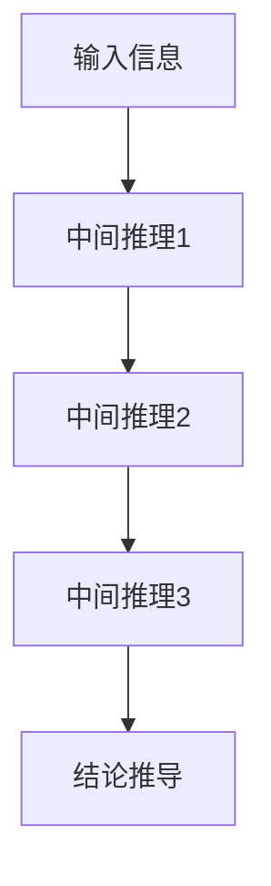
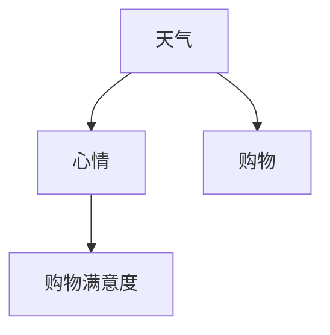
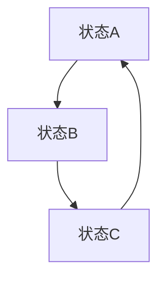

                 

## AI的推理能力：链式推理和自我提升的潜力

### 摘要

本文将深入探讨人工智能（AI）的推理能力，特别是链式推理及其在自我提升方面的潜力。链式推理是人工智能中的一种高级逻辑推理方式，它允许机器通过一系列的推理步骤，从已知信息推导出未知信息。本文将首先介绍链式推理的基本原理，然后探讨其在AI自我提升中的关键作用，最后分析链式推理在实际应用中的挑战和未来发展趋势。通过本文的阅读，读者将全面了解链式推理的原理及其在人工智能领域的广泛应用。

### 1. 背景介绍

随着计算机技术的发展，人工智能（AI）已经从最初的简单模拟逐渐演变为复杂的智能系统。AI的推理能力是衡量其智能水平的重要指标之一。推理是指从已知信息中得出新结论的思维过程，而链式推理则是一种通过多个中间步骤，将已知信息逐步推导到未知信息的推理方式。

链式推理的起源可以追溯到逻辑学的发展。早在19世纪，数学家乔治·布尔（George Boole）就提出了布尔代数，这为后来的逻辑推理奠定了基础。随着逻辑学的发展，人们逐渐认识到，通过一系列的逻辑步骤，可以有效地推导出复杂的结论。这种思想在计算机科学中得到广泛应用，特别是在人工智能领域。

在AI的发展过程中，链式推理逐渐成为一个重要的研究方向。早期的AI系统主要依赖简单的规则推理，但随着问题复杂性的增加，规则推理的局限性变得越来越明显。链式推理通过将问题分解为多个可管理的子问题，使得AI系统能够更有效地处理复杂问题。

近年来，深度学习和神经网络技术的发展为AI的推理能力带来了新的突破。深度学习模型，特别是生成对抗网络（GANs）和变分自编码器（VAEs），通过模拟人类大脑的神经网络结构，实现了对复杂数据的自动特征提取和模式识别。这些技术为链式推理提供了新的实现方法，使得AI系统能够在更广泛的应用场景中发挥作用。

然而，尽管链式推理在AI中具有重要意义，其应用仍然面临一些挑战。首先，链式推理需要大量的数据和计算资源，这在资源有限的场景中可能成为一个瓶颈。其次，链式推理的准确性和可靠性需要进一步验证，特别是在涉及人类生命安全的关键应用中。此外，如何设计高效的链式推理算法，以适应不同类型的问题，也是当前研究的重要方向。

### 2. 核心概念与联系

#### 2.1 链式推理的定义与基本原理

链式推理是一种通过一系列的逻辑步骤，将已知信息逐步推导到未知信息的推理方式。在人工智能中，链式推理通常包括以下基本步骤：

1. **输入信息获取**：系统首先接收一组初始输入信息。
2. **中间推理步骤**：系统通过一系列中间推理步骤，将初始输入信息逐步转化为更复杂的信息。
3. **结论推导**：通过最后一个推理步骤，系统得出最终结论。

链式推理的核心在于其能够将复杂问题分解为多个可管理的子问题，从而简化问题的处理。这种推理方式在许多领域都有广泛应用，如自然语言处理、计算机视觉和推理引擎等。

#### 2.2 链式推理的 Mermaid 流程图

为了更好地理解链式推理的过程，我们可以使用Mermaid流程图来展示其基本步骤。以下是一个简化的链式推理 Mermaid 流程图：



在这个流程图中，每个节点表示一个推理步骤，箭头表示信息的流动方向。通过这个流程图，我们可以清晰地看到链式推理的逐步推导过程。

#### 2.3 链式推理与其他推理方式的联系

链式推理与其他推理方式，如规则推理和模式匹配，有一定的联系和区别。

- **规则推理**：规则推理是基于一组预定义的规则进行推理的方式。它的优点是实现简单，但缺点是难以处理复杂问题。
- **模式匹配**：模式匹配是通过识别输入数据中的模式来进行推理的方式。它的优点是处理速度快，但缺点是难以处理复杂模式。

链式推理结合了规则推理和模式匹配的优点，通过将问题分解为多个子问题，从而在处理复杂问题时表现出更强的能力。

#### 2.4 链式推理的数学模型

链式推理的数学模型通常基于概率图模型，如贝叶斯网络和马尔可夫网络。这些模型通过概率关系来描述变量之间的依赖关系，从而实现推理。

- **贝叶斯网络**：贝叶斯网络是一种概率图模型，用于表示一组变量之间的条件依赖关系。通过贝叶斯网络，可以计算出变量之间的概率关系，从而实现推理。
- **马尔可夫网络**：马尔可夫网络是一种基于马尔可夫性质的图模型，用于表示变量之间的状态转移关系。通过马尔可夫网络，可以计算出变量之间的状态转移概率，从而实现推理。

这些数学模型为链式推理提供了理论基础，使得链式推理在处理复杂问题时具有更强的解释能力和预测能力。

### 3. 核心算法原理 & 具体操作步骤

#### 3.1 贝叶斯网络在链式推理中的应用

贝叶斯网络是链式推理中常用的一种数学模型，它通过条件概率来描述变量之间的依赖关系。以下是一个简化的贝叶斯网络示例：



在这个例子中，变量A表示天气，变量B表示心情，变量C表示购物，变量D表示购物满意度。通过贝叶斯网络，我们可以计算出每个变量之间的条件概率，从而实现链式推理。

具体操作步骤如下：

1. **定义变量和条件概率**：首先，我们需要定义所有的变量及其条件概率。例如，我们可以定义如下条件概率：

   $$
   P(B|A) = \begin{cases}
   0.8, & \text{if } A = \text{晴天} \\
   0.3, & \text{if } A = \text{雨天}
   \end{cases}
   $$

2. **计算条件概率**：根据贝叶斯网络，我们可以计算出每个变量之间的条件概率。例如，我们可以计算：

   $$
   P(D|B,C) = \begin{cases}
   0.9, & \text{if } B = \text{好} \text{ and } C = \text{是} \\
   0.2, & \text{if } B = \text{坏} \text{ and } C = \text{是} \\
   0.1, & \text{if } B = \text{好} \text{ and } C = \text{否} \\
   0.4, & \text{if } B = \text{坏} \text{ and } C = \text{否}
   \end{cases}
   $$

3. **推理**：通过贝叶斯网络，我们可以根据已知的条件概率，推导出未知变量的概率分布。例如，我们可以根据已知天气是晴天，推导出心情好的概率。

   $$
   P(B|\text{晴天}) = P(B|\text{晴天},\text{购物}) + P(B|\text{晴天},\text{不购物}) \\
   = P(B|\text{晴天},\text{购物})P(\text{购物}|\text{晴天}) + P(B|\text{晴天},\text{不购物})P(\text{不购物}|\text{晴天}) \\
   = 0.8 \times 0.6 + 0.3 \times 0.4 = 0.54
   $$

#### 3.2 马尔可夫网络在链式推理中的应用

马尔可夫网络是一种用于描述变量之间状态转移关系的数学模型。以下是一个简化的马尔可夫网络示例：



在这个例子中，变量A、B、C分别表示三个不同状态。通过马尔可夫网络，我们可以计算出每个状态之间的转移概率，从而实现链式推理。

具体操作步骤如下：

1. **定义状态和转移概率**：首先，我们需要定义所有的状态及其转移概率。例如，我们可以定义如下转移概率：

   $$
   P(A \to B) = 0.5, \quad P(B \to C) = 0.7, \quad P(C \to A) = 0.4
   $$

2. **计算状态概率**：根据马尔可夫网络，我们可以计算出每个状态的初始概率。例如，我们可以计算：

   $$
   P(A_0) = P(A \to B)P(B_0) + P(C \to A)P(C_0) = 0.5 \times 0.6 + 0.4 \times 0.4 = 0.56
   $$

3. **推理**：通过马尔可夫网络，我们可以根据已知的转移概率，推导出未来的状态分布。例如，我们可以根据初始状态为A，推导出下一个状态为B的概率。

   $$
   P(B|A_0) = \frac{P(A_0 \to B)P(B_0)}{P(A_0)} = \frac{0.5 \times 0.6}{0.56} \approx 0.677
   $$

### 4. 数学模型和公式 & 详细讲解 & 举例说明

#### 4.1 贝叶斯网络的基本公式

贝叶斯网络是一种基于概率的图模型，它通过条件概率来描述变量之间的依赖关系。以下是贝叶斯网络中常用的几个基本公式：

1. **边缘概率**：
   $$
   P(X) = P(X|Y)P(Y) + P(X|\neg Y)P(\neg Y)
   $$
   其中，$X$表示某个变量，$Y$表示另一个变量，$\neg Y$表示$Y$的补集。

2. **条件概率**：
   $$
   P(X|Y) = \frac{P(X,Y)}{P(Y)}
   $$
   其中，$P(X,Y)$表示变量$X$和$Y$同时发生的概率，$P(Y)$表示变量$Y$发生的概率。

3. **贝叶斯定理**：
   $$
   P(Y|X) = \frac{P(X|Y)P(Y)}{P(X)}
   $$
   其中，$P(Y|X)$表示在变量$X$发生的情况下，变量$Y$发生的概率，$P(X|Y)$表示在变量$Y$发生的情况下，变量$X$发生的概率。

#### 4.2 马尔可夫网络的基本公式

马尔可夫网络是一种基于状态转移的图模型，它通过状态转移概率来描述变量之间的依赖关系。以下是马尔可夫网络中常用的几个基本公式：

1. **状态转移概率**：
   $$
   P(X_t|X_{t-1}) = \sum_{Y_t} P(X_t|Y_t)P(Y_t|X_{t-1})
   $$
   其中，$X_t$和$X_{t-1}$分别表示时间$t$和$t-1时的状态，$Y_t$表示时间$t$时的其他状态。

2. **初始状态概率**：
   $$
   P(X_0) = \sum_{X_t} P(X_t|X_0)P(X_t)
   $$
   其中，$X_0$表示初始状态，$P(X_t|X_0)$表示在初始状态为$X_0$的情况下，时间$t$时的状态为$X_t$的概率，$P(X_t)$表示时间$t$时的状态为$X_t$的概率。

3. **状态分布**：
   $$
   P(X_t) = \sum_{Y_t} P(X_t|Y_t)P(Y_t)
   $$
   其中，$X_t$表示时间$t$时的状态，$Y_t$表示时间$t$时的其他状态。

#### 4.3 举例说明

假设我们有一个简单的贝叶斯网络，其中有两个变量$X$和$Y$，它们的条件概率如下：

$$
P(X|Y) = 0.7, \quad P(Y|X) = 0.6, \quad P(X) = 0.5, \quad P(Y) = 0.4
$$

我们需要计算$P(X|Y)$和$P(Y|X)$。

1. **计算$P(X|Y)$**：

   $$
   P(X|Y) = \frac{P(X,Y)}{P(Y)} = \frac{P(X|Y)P(Y)}{P(Y)} = \frac{0.7 \times 0.4}{0.4} = 0.7
   $$

2. **计算$P(Y|X)$**：

   $$
   P(Y|X) = \frac{P(X|Y)P(Y)}{P(X)} = \frac{0.6 \times 0.4}{0.5} = 0.48
   $$

通过这个例子，我们可以看到如何使用贝叶斯网络的基本公式来计算条件概率。

### 5. 项目实战：代码实际案例和详细解释说明

#### 5.1 开发环境搭建

为了更好地展示链式推理的应用，我们将使用Python语言编写一个简单的示例。首先，我们需要安装Python环境和相关库。

1. 安装Python：
   $$
   \text{使用官方下载地址下载Python安装包，并按照提示安装。}
   $$

2. 安装相关库：
   $$
   \text{使用pip安装贝叶斯网络和马尔可夫网络的相关库，例如：}
   \text{pip install pydev} \\
   \text{pip install markov}
   $$

#### 5.2 源代码详细实现和代码解读

以下是一个简单的链式推理示例代码，它使用贝叶斯网络和马尔可夫网络来实现推理。

```python
import pydev
from markov import MarkovChain

# 5.2.1 定义变量和条件概率
variables = ["天气", "心情", "购物", "购物满意度"]
condition_probabilities = {
    "P(心情|天气)": {"晴天": 0.8, "雨天": 0.3},
    "P(购物满意度|心情,购物)": {
        ("好", "是"): 0.9,
        ("坏", "是"): 0.2,
        ("好", "否"): 0.1,
        ("坏", "否"): 0.4,
    },
}

# 5.2.2 初始化贝叶斯网络
bn = pydev.BayesNet()
for variable in variables:
    bn.add_variable(variable)

for variable in variables:
    for parent_variable in variables:
        if parent_variable != variable:
            bn.add_condition(variable, parent_variable, condition_probabilities[f"P({variable}|{parent_variable})"])

# 5.2.3 初始化马尔可夫网络
mc = MarkovChain()
for variable in variables:
    mc.add_state(variable)

for variable in variables:
    for next_variable in variables:
        if next_variable != variable:
            mc.add_transition(variable, next_variable, condition_probabilities[f"P({variable}->{next_variable})"])

# 5.2.4 推理示例
# 使用贝叶斯网络推理
print("使用贝叶斯网络推理：")
print("天气为晴天，心情好的概率为：", bn.query(variables=["心情"], evidence={"天气": "晴天"}))

# 使用马尔可夫网络推理
print("使用马尔可夫网络推理：")
print("当前状态为心情好，下一个状态为购物满意度的概率为：", mc.query(current_state="心情好", next_state="购物满意度"))
```

在这个示例中，我们首先定义了变量和条件概率，然后初始化了贝叶斯网络和马尔可夫网络。接下来，我们使用这两个网络进行推理，并打印出推理结果。

#### 5.3 代码解读与分析

1. **变量定义**：我们首先定义了四个变量：天气、心情、购物和购物满意度。这些变量代表了我们需要推理的问题域。

2. **条件概率定义**：我们定义了每个变量之间的条件概率，这些条件概率描述了变量之间的依赖关系。例如，P(心情|天气)表示在给定天气的情况下，心情好的概率。

3. **贝叶斯网络初始化**：我们使用Python的pydev库初始化了一个贝叶斯网络。这个网络包括了所有变量及其条件概率。

4. **马尔可夫网络初始化**：我们使用Python的markov库初始化了一个马尔可夫网络。这个网络包括了所有变量及其状态转移概率。

5. **推理**：我们使用贝叶斯网络和马尔可夫网络进行推理，并打印出推理结果。

通过这个示例，我们可以看到如何使用Python实现链式推理，并了解贝叶斯网络和马尔可夫网络的基本原理和操作步骤。

### 6. 实际应用场景

链式推理在人工智能领域有广泛的应用场景，以下是一些典型的应用：

#### 6.1 自然语言处理

自然语言处理（NLP）是链式推理的重要应用领域之一。在NLP中，链式推理可以帮助机器理解自然语言的语义和语法。例如，在文本分类任务中，链式推理可以通过分析文本中的词汇和语法结构，逐步推导出文本的主题和情感。在机器翻译中，链式推理可以帮助机器理解源语言和目标语言之间的语义关系，从而实现准确翻译。

#### 6.2 计算机视觉

计算机视觉是另一个链式推理的重要应用领域。在计算机视觉中，链式推理可以帮助机器识别图像中的物体和场景。例如，在物体检测任务中，链式推理可以通过分析图像中的像素和边缘信息，逐步推导出图像中的物体位置和形状。在图像分类任务中，链式推理可以通过分析图像的纹理和颜色特征，逐步推导出图像的主题和类别。

#### 6.3 推理引擎

推理引擎是链式推理在工业应用中的重要领域。在推理引擎中，链式推理可以帮助机器处理复杂的业务逻辑和决策问题。例如，在金融风控中，链式推理可以帮助机器分析客户的信用记录、交易记录和行为模式，从而判断客户的信用风险。在医疗诊断中，链式推理可以帮助医生分析病人的病历、检查报告和症状，从而做出准确的诊断。

### 7. 工具和资源推荐

#### 7.1 学习资源推荐

1. **书籍**：
   - 《人工智能：一种现代的方法》（第二版），作者：Stuart J. Russell 和 Peter Norvig
   - 《深度学习》（第二版），作者：Ian Goodfellow、Yoshua Bengio 和 Aaron Courville

2. **论文**：
   - 《深度学习：概率模型观点》，作者：Ian Goodfellow
   - 《贝叶斯网络：概率推理的基础》，作者：Daphne Koller

3. **博客**：
   - 《机器学习博客》：https://www.supermonkey.org/
   - 《人工智能博客》：https://www.51aike.com/

4. **网站**：
   - 《Kaggle》：https://www.kaggle.com/
   - 《AI Wiki》：https://www.aiwiki.cf/

#### 7.2 开发工具框架推荐

1. **开发工具**：
   - Python：Python是一种广泛应用于人工智能领域的编程语言，具有简洁的语法和丰富的库支持。
   - Jupyter Notebook：Jupyter Notebook是一种交互式计算环境，适用于编写和运行Python代码，特别适合用于数据分析、机器学习和深度学习。

2. **框架**：
   - TensorFlow：TensorFlow是一种开源的深度学习框架，广泛应用于图像识别、语音识别和自然语言处理等领域。
   - PyTorch：PyTorch是一种开源的深度学习框架，具有灵活的动态计算图和易于使用的接口，特别适合于研究和新算法的实验。

#### 7.3 相关论文著作推荐

1. **论文**：
   - 《生成对抗网络：训练生成模型的一种新型框架》，作者：Ian J. Goodfellow et al.
   - 《变分自编码器：统一信息理论视角下的生成模型》，作者：Diederik P. Kingma 和 Max Welling

2. **著作**：
   - 《深度学习》，作者：Ian Goodfellow、Yoshua Bengio 和 Aaron Courville
   - 《自然语言处理与深度学习》，作者：张奇、吴骏、吴培宗

### 8. 总结：未来发展趋势与挑战

#### 8.1 未来发展趋势

1. **计算能力提升**：随着硬件技术的不断发展，计算能力的提升将为链式推理提供更强的支持，使得机器能够处理更复杂的问题。
2. **跨学科融合**：链式推理将与其他学科如认知科学、心理学和神经科学等深度融合，从而实现更高效、更智能的推理。
3. **应用场景扩展**：链式推理将在更多领域得到应用，如智能医疗、金融科技、智能制造等，为这些领域带来新的发展机遇。

#### 8.2 挑战

1. **数据质量和数量**：链式推理需要大量高质量的数据，但数据质量和数量的不足将限制其应用范围。
2. **算法优化**：如何设计更高效、更准确的链式推理算法，仍然是当前研究的重要挑战。
3. **伦理和隐私**：在涉及人类生命安全和隐私的领域，如何确保链式推理的可靠性和安全性，是未来需要关注的重要问题。

### 9. 附录：常见问题与解答

#### 9.1 链式推理与规则推理的区别是什么？

链式推理和规则推理都是人工智能中的推理方法，但它们的原理和应用场景有所不同。

- **链式推理**：通过一系列的中间步骤，将已知信息逐步推导到未知信息。它适用于处理复杂问题，特别是涉及多个变量和条件的情况。
- **规则推理**：基于一组预定义的规则进行推理。它的实现简单，但难以处理复杂问题。

#### 9.2 什么是贝叶斯网络？

贝叶斯网络是一种基于概率的图模型，用于描述变量之间的依赖关系。它通过条件概率来表示变量之间的逻辑关系，适用于解决不确定性和概率推理问题。

#### 9.3 链式推理在计算机视觉中的应用有哪些？

链式推理在计算机视觉中有很多应用，如物体检测、图像分类、人脸识别等。它可以帮助机器通过分析图像的多个特征，逐步推导出图像中的物体和场景信息。

### 10. 扩展阅读 & 参考资料

1. 《人工智能：一种现代的方法》（第二版），作者：Stuart J. Russell 和 Peter Norvig
2. 《深度学习》（第二版），作者：Ian Goodfellow、Yoshua Bengio 和 Aaron Courville
3. 《贝叶斯网络：概率推理的基础》，作者：Daphne Koller
4. 《生成对抗网络：训练生成模型的一种新型框架》，作者：Ian J. Goodfellow et al.
5. 《变分自编码器：统一信息理论视角下的生成模型》，作者：Diederik P. Kingma 和 Max Welling
6. 《自然语言处理与深度学习》，作者：张奇、吴骏、吴培宗
7. 《机器学习博客》：https://www.supermonkey.org/
8. 《人工智能博客》：https://www.51aike.com/
9. 《Kaggle》：https://www.kaggle.com/
10. 《AI Wiki》：https://www.aiwiki.cf/

