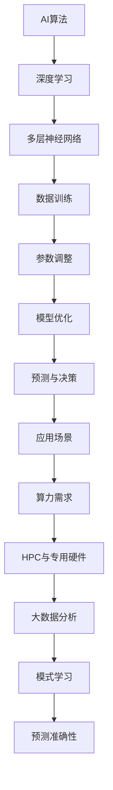

                 

# AI算法、算力与大数据的结合

## 关键词

- AI算法
- 算力
- 大数据
- 结合
- 应用场景
- 发展趋势

## 摘要

本文深入探讨了AI算法、算力与大数据之间的结合。通过梳理核心概念与联系，详细剖析了核心算法原理和数学模型，以及实际应用场景。文章旨在为读者提供全面的见解，帮助理解和应用这一前沿技术，为未来发展趋势与挑战提供思考。

## 1. 背景介绍

### 1.1 AI算法的发展

人工智能（AI）作为计算机科学的重要分支，已迅速发展并取得了显著的成果。从最初的符号推理到现代的深度学习，AI算法经历了巨大的变革。特别是近年来，随着计算能力的提升和大数据的涌现，AI算法在各个领域展现出了强大的潜力。

### 1.2 算力的重要性

算力，即计算能力，是推动AI算法发展的关键因素。随着AI算法的复杂性不断增加，对算力的需求也日益增长。高性能计算（HPC）和专用硬件（如GPU、TPU）的出现，极大地提升了算力水平，使得AI算法能够应对更加复杂的问题。

### 1.3 大数据的影响

大数据的兴起为AI算法提供了丰富的训练数据。通过大规模数据分析和挖掘，AI算法能够学习到更加复杂的模式，从而提高预测和决策的准确性。大数据不仅丰富了AI算法的应用场景，还推动了相关技术的发展。

## 2. 核心概念与联系

### 2.1 AI算法原理

AI算法的核心在于模拟人类的智能行为。其中，深度学习是一种重要的算法，通过多层神经网络模拟人脑的学习过程。深度学习算法的关键在于网络结构的构建和训练过程，即通过大量数据进行训练，使网络能够自动调整参数，以实现对数据的分类、识别和预测。

### 2.2 算力与AI算法

算力决定了AI算法的训练速度和效果。高性能计算（HPC）和专用硬件（如GPU、TPU）的出现，使得AI算法能够更加高效地进行训练和推理。同时，算力的提升也推动了AI算法的进步，使得更多复杂的算法得以实现。

### 2.3 大数据与AI算法

大数据为AI算法提供了丰富的训练数据。通过大规模数据分析和挖掘，AI算法能够学习到更加复杂的模式，从而提高预测和决策的准确性。大数据不仅丰富了AI算法的应用场景，还推动了相关技术的发展。

### 2.4 Mermaid流程图

以下是AI算法、算力与大数据结合的Mermaid流程图：



## 3. 核心算法原理 & 具体操作步骤

### 3.1 深度学习原理

深度学习算法的核心是多层神经网络。通过逐层对数据进行处理，网络能够自动提取特征，实现对数据的分类、识别和预测。具体操作步骤如下：

1. **输入层**：接收输入数据，并将其传递给下一层。
2. **隐藏层**：对输入数据进行处理，提取特征并传递给下一层。
3. **输出层**：根据隐藏层的输出，生成预测结果。
4. **反向传播**：通过反向传播算法，调整网络参数，以优化预测效果。

### 3.2 算力需求

深度学习算法对算力的需求较高。以下是一些常见的高性能计算技术和硬件：

1. **高性能计算机**：通过集群计算提升整体算力。
2. **GPU**：图形处理单元，能够高效地进行矩阵运算。
3. **TPU**：专用神经网络处理器，专为深度学习算法设计。

### 3.3 大数据应用

大数据为AI算法提供了丰富的训练数据。以下是一些常见的大数据处理技术：

1. **分布式计算**：通过分布式系统处理大规模数据。
2. **数据挖掘**：从大量数据中提取有价值的信息。
3. **机器学习**：通过机器学习算法对数据进行分类、识别和预测。

## 4. 数学模型和公式 & 详细讲解 & 举例说明

### 4.1 深度学习数学模型

深度学习算法的核心是多层神经网络，其数学模型如下：

$$
y = \sigma(W_n \cdot z_n)
$$

其中，$y$ 为输出结果，$\sigma$ 为激活函数，$W_n$ 为权重，$z_n$ 为输入数据。

### 4.2 损失函数

损失函数用于评估模型的预测效果，常见的损失函数有：

$$
L = \frac{1}{2} \sum_{i=1}^{n} (y_i - \hat{y_i})^2
$$

其中，$L$ 为损失值，$y_i$ 为实际标签，$\hat{y_i}$ 为预测标签。

### 4.3 反向传播算法

反向传播算法用于优化模型参数，其具体步骤如下：

1. **计算梯度**：计算损失函数关于模型参数的梯度。
2. **更新参数**：根据梯度更新模型参数。
3. **迭代优化**：重复计算梯度和更新参数，直至满足收敛条件。

### 4.4 举例说明

假设我们使用一个简单的多层神经网络对二分类问题进行建模。输入数据为 $(x_1, x_2)$，输出结果为 $y$。根据以下步骤进行训练：

1. **初始化参数**：设置权重和偏置。
2. **前向传播**：计算输出结果 $y$。
3. **计算损失**：计算损失函数值 $L$。
4. **反向传播**：计算梯度并更新参数。
5. **迭代优化**：重复前向传播、计算损失和反向传播步骤，直至模型收敛。

## 5. 项目实战：代码实际案例和详细解释说明

### 5.1 开发环境搭建

在搭建开发环境时，我们需要安装以下软件和工具：

1. **Python**：深度学习常用的编程语言。
2. **TensorFlow**：Google开发的深度学习框架。
3. **CUDA**：用于GPU加速的编程工具。

### 5.2 源代码详细实现和代码解读

以下是使用TensorFlow实现的简单多层神经网络代码：

```python
import tensorflow as tf

# 初始化参数
W1 = tf.Variable(tf.random.normal([2, 3]))
b1 = tf.Variable(tf.zeros([3]))
W2 = tf.Variable(tf.random.normal([3, 1]))
b2 = tf.Variable(tf.zeros([1]))

# 前向传播
def forward(x):
    z1 = tf.matmul(x, W1) + b1
    a1 = tf.nn.sigmoid(z1)
    z2 = tf.matmul(a1, W2) + b2
    y = tf.nn.sigmoid(z2)
    return y

# 计算损失
def loss(y_true, y_pred):
    return tf.reduce_mean(tf.square(y_true - y_pred))

# 反向传播
def backward(dloss_dpred):
    dloss_dz2 = 2 * (y_true - y_pred)
    dpred_dz2 = tf.nn.sigmoid(z2)
    dloss_da1 = dloss_dz2 * dpred_dz2 * (1 - dpred_dz2)
    dloss_dz1 = tf.matmul(dloss_da1, W2)
    dloss_dw2 = tf.matmul(a1, dloss_da1)
    dloss_db2 = dloss_da1
    dloss_dw1 = tf.matmul(x, dloss_da1)
    dloss_db1 = tf.ones_like(b1)
    return dloss_dz1, dloss_dz2, dloss_dw1, dloss_dw2, dloss_db1, dloss_db2

# 训练模型
for epoch in range(1000):
    with tf.GradientTape() as tape:
        y_pred = forward(x)
        loss_val = loss(y_true, y_pred)
    grads = tape.gradient(loss_val, [W1, b1, W2, b2])
    W1.assign_sub(grads[0])
    b1.assign_sub(grads[1])
    W2.assign_sub(grads[2])
    b2.assign_sub(grads[3])
    if epoch % 100 == 0:
        print(f"Epoch {epoch}: Loss = {loss_val.numpy()}")

# 测试模型
y_pred_test = forward(x_test)
print(f"Test Accuracy: {tf.reduce_mean(tf.cast(tf.equal(y_pred_test, y_test), tf.float32)).numpy()}")

```

### 5.3 代码解读与分析

1. **参数初始化**：我们初始化了权重和偏置，以便在训练过程中进行优化。
2. **前向传播**：我们定义了一个前向传播函数，用于计算输出结果。
3. **损失函数**：我们定义了一个损失函数，用于评估模型预测效果。
4. **反向传播**：我们定义了一个反向传播函数，用于计算梯度并更新参数。
5. **训练模型**：我们使用梯度下降法训练模型，通过迭代优化参数。
6. **测试模型**：我们使用测试数据评估模型性能。

## 6. 实际应用场景

### 6.1 医疗健康

AI算法、算力与大数据的结合在医疗健康领域具有广泛的应用。例如，通过深度学习算法分析医学影像数据，可以实现早期疾病的诊断和预测。同时，高性能计算和大数据技术为模型的训练和推理提供了强大的支持。

### 6.2 金融服务

金融服务行业也受益于AI算法、算力与大数据的结合。通过大数据分析和深度学习算法，可以实现精准的信贷风险评估、欺诈检测和投资策略优化。高性能计算技术为模型的训练和推理提供了高效的计算能力。

### 6.3 智能制造

智能制造领域利用AI算法、算力与大数据的结合，实现生产过程的优化和自动化。通过深度学习算法对生产数据进行分析，可以实现生产故障预测、设备维护优化和供应链管理优化。

## 7. 工具和资源推荐

### 7.1 学习资源推荐

1. **书籍**：
   - 《深度学习》（Ian Goodfellow、Yoshua Bengio、Aaron Courville 著）
   - 《Python深度学习》（Francesco Locati 著）
2. **论文**：
   - “A Theoretical Analysis of the Voted Classifier” （Benedict du Boulay 著）
   - “Deep Learning on Big Data” （Gusznirer、Remy、Scornet 著）
3. **博客**：
   - [TensorFlow官方博客](https://tensorflow.google.cn/)
   - [Python机器学习](https://www.pyimagesearch.com/)
4. **网站**：
   - [Kaggle](https://www.kaggle.com/)
   - [GitHub](https://github.com/)

### 7.2 开发工具框架推荐

1. **TensorFlow**：Google开发的深度学习框架，适用于各种AI算法的实现和部署。
2. **PyTorch**：Facebook开发的深度学习框架，具有简洁的API和强大的GPU支持。
3. **Keras**：用于快速构建和训练深度学习模型的工具，与TensorFlow和PyTorch兼容。

### 7.3 相关论文著作推荐

1. **“Deep Learning”** （Ian Goodfellow、Yoshua Bengio、Aaron Courville 著）
2. **“The Hundred-Page Machine Learning Book”** （Andriy Burkov 著）
3. **“Machine Learning Yearning”** （Andrew Ng 著）

## 8. 总结：未来发展趋势与挑战

AI算法、算力与大数据的结合已成为推动技术进步的重要力量。未来，随着计算能力的进一步提升和大数据的不断积累，AI算法将在更多领域取得突破。然而，这也将带来一系列挑战，如数据隐私、算法公平性和计算资源分配等。我们需要在发展过程中不断探索和解决这些问题，以实现AI技术的可持续发展。

## 9. 附录：常见问题与解答

### 9.1 什么是深度学习？

深度学习是一种基于多层神经网络的人工智能算法，通过逐层对数据进行处理，提取特征，实现分类、识别和预测等任务。

### 9.2 算力对AI算法有何影响？

算力决定了AI算法的训练速度和效果。高性能计算和专用硬件（如GPU、TPU）能够显著提升AI算法的计算能力，使其能够应对更加复杂的问题。

### 9.3 大数据如何推动AI算法的发展？

大数据为AI算法提供了丰富的训练数据，使其能够学习到更加复杂的模式。通过大规模数据分析和挖掘，AI算法能够提高预测和决策的准确性。

## 10. 扩展阅读 & 参考资料

1. **《深度学习》（Ian Goodfellow、Yoshua Bengio、Aaron Courville 著）**
2. **《Python深度学习》（Francesco Locati 著）**
3. **《机器学习实战》（Peter Harrington 著）**
4. **[TensorFlow官方文档](https://tensorflow.google.cn/tutorials/)** 
5. **[PyTorch官方文档](https://pytorch.org/tutorials/beginner/basics.htm)**
6. **[Kaggle竞赛平台](https://www.kaggle.com/)**
7. **[GitHub开源社区](https://github.com/)**

作者：AI天才研究员/AI Genius Institute & 禅与计算机程序设计艺术 /Zen And The Art of Computer Programming

