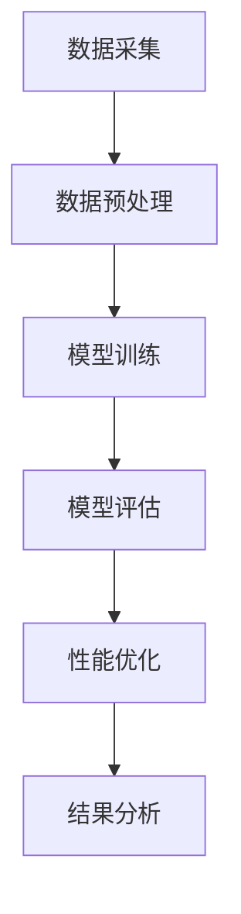

                 

### 1. 背景介绍

#### 1.1 什么是AI系统性能评估

在当今快速发展的信息技术时代，人工智能（AI）技术已经渗透到我们生活的方方面面。无论是自动驾驶汽车、智能家居，还是医疗诊断、金融分析，AI系统都在发挥着重要作用。然而，这些系统的性能是否达到预期，是否能够稳定高效地运行，就需要通过系统性能评估来验证。

AI系统性能评估，是指对AI系统在特定任务上的表现进行量化分析，以评估其在实际应用中的效果和效率。这个评估过程不仅包括对模型准确率、响应速度等指标的测量，还涉及对系统在不同场景下的适应性和鲁棒性进行测试。

#### 1.2 评估的重要性

进行AI系统性能评估的重要性不言而喻：

1. **确保系统质量**：通过评估，可以发现系统中的缺陷和不足，从而进行优化和改进，确保系统在交付使用时达到预期质量标准。

2. **降低成本和风险**：提前发现系统性能问题，可以避免在实际应用中出现故障，减少可能的成本损失和风险。

3. **提升用户体验**：高效的AI系统能够提供更快速的响应和更准确的结果，从而提升用户体验。

4. **支持决策**：性能评估结果可以为决策者提供关键数据，帮助他们在项目投资、资源分配等方面做出更为明智的选择。

#### 1.3 评估的挑战

尽管性能评估的重要性被广泛认可，但在实际操作中仍然面临诸多挑战：

1. **多样性**：AI系统应用场景多种多样，每个场景都有其独特的需求和挑战，这使得评估标准难以统一。

2. **复杂性**：AI系统通常由多个模块和组件构成，各个模块之间的相互作用和影响需要深入分析。

3. **不确定性**：AI系统的工作机制和数据来源具有不确定性，这使得评估结果的可重复性和可靠性受到挑战。

4. **计算资源**：大规模数据和高性能计算资源的需要，使得评估过程变得耗时和昂贵。

在接下来的章节中，我们将详细探讨AI系统性能评估的核心概念、原理和具体操作步骤，帮助读者深入了解这一重要领域。

### 2. 核心概念与联系

#### 2.1 AI系统性能评估的几个关键概念

在深入讨论AI系统性能评估之前，我们首先需要了解一些关键的概念，这些概念构成了评估的基础。

1. **准确性**：准确性是评估AI系统性能最重要的指标之一。它衡量系统在分类或回归任务中预测正确的能力。例如，在图像识别任务中，准确性表示系统正确识别图像的百分比。

2. **响应时间**：响应时间是指AI系统从接收输入到给出输出结果所需的时间。对于实时应用场景，如自动驾驶或在线客服，响应时间至关重要。

3. **鲁棒性**：鲁棒性是指AI系统在面对异常或不确定的数据时，仍然能够保持稳定表现的能力。一个鲁棒性好的系统即使在数据分布发生变化时也能保持高性能。

4. **可扩展性**：可扩展性是指AI系统在增加计算资源和数据量时，性能是否能够保持稳定或有所提升。可扩展性对于大型系统和长期能效至关重要。

5. **公平性**：在AI系统中，公平性是指系统在处理不同群体数据时的表现是否一致。确保公平性有助于避免歧视和偏见。

#### 2.2 AI系统性能评估的架构

了解AI系统性能评估的架构有助于我们更好地理解评估过程。以下是一个典型的AI系统性能评估架构：

1. **数据采集**：首先，需要收集与评估任务相关的数据。这些数据可以是训练数据、测试数据或实际操作数据。

2. **数据预处理**：数据采集后，需要进行清洗、格式化和特征提取等预处理步骤，以确保数据的质量和一致性。

3. **模型训练**：使用预处理后的数据训练AI模型。训练过程包括选择合适的算法、设置参数和优化模型性能。

4. **模型评估**：在训练完成后，使用测试数据集对模型进行评估。评估过程会计算多个性能指标，如准确性、响应时间、鲁棒性等。

5. **性能优化**：根据评估结果，对模型进行调优，以提升性能。这一步骤可能需要反复进行，直到达到预期效果。

6. **结果分析**：最终，对评估结果进行综合分析，形成评估报告，为后续改进和决策提供依据。

#### 2.3 Mermaid流程图

为了更直观地展示上述架构，我们可以使用Mermaid流程图进行描述。以下是一个简化的Mermaid流程图：



在流程图中，各节点分别代表评估过程中的关键步骤，箭头表示步骤之间的顺序关系。该流程图为我们提供了一个清晰的评估框架，有助于理解评估的整体流程。

通过上述讨论，我们明确了AI系统性能评估的核心概念和评估架构。在接下来的章节中，我们将进一步探讨评估算法的原理和具体操作步骤，帮助读者深入掌握这一领域。

#### 2.3 AI系统性能评估的算法原理

在进行AI系统性能评估时，选择合适的评估算法至关重要。以下将介绍几种常用的评估算法及其原理。

##### 2.3.1 模型准确性评估

模型准确性是评估AI系统性能的重要指标之一。常用的准确性评估算法包括：

1. **准确率（Accuracy）**：准确率是指模型预测正确的样本数占总样本数的比例。其计算公式为：

   $$\text{准确率} = \frac{\text{预测正确的样本数}}{\text{总样本数}}$$

   准确率简单直观，但在类别不平衡的情况下可能不太适用。

2. **精确率（Precision）**：精确率是指预测为正类的样本中，实际为正类的比例。其计算公式为：

   $$\text{精确率} = \frac{\text{预测正确且实际为正类的样本数}}{\text{预测为正类的样本数}}$$

3. **召回率（Recall）**：召回率是指实际为正类的样本中，被预测为正类的比例。其计算公式为：

   $$\text{召回率} = \frac{\text{预测正确且实际为正类的样本数}}{\text{实际为正类的样本数}}$$

4. **F1值（F1 Score）**：F1值是精确率和召回率的调和平均值，用于综合评估模型的性能。其计算公式为：

   $$\text{F1值} = 2 \times \frac{\text{精确率} \times \text{召回率}}{\text{精确率} + \text{召回率}}$$

   当类别不平衡时，F1值更能反映模型的性能。

##### 2.3.2 响应时间评估

响应时间评估主要关注AI系统在处理输入数据时的速度。常用的评估算法包括：

1. **平均响应时间（Average Response Time）**：平均响应时间是指系统处理多个样本的平均时间。其计算公式为：

   $$\text{平均响应时间} = \frac{\text{总处理时间}}{\text{样本数}}$$

2. **95%响应时间（95th Percentile Response Time）**：95%响应时间是指系统处理95%的样本所需的最长时间。这个指标可以更好地反映系统的性能瓶颈。

##### 2.3.3 鲁棒性评估

鲁棒性评估旨在考察AI系统在面对异常数据时的稳定性和一致性。常用的评估算法包括：

1. **变异系数（Coefficient of Variation, CV）**：变异系数是标准差与平均值的比值，用于衡量数据的离散程度。其计算公式为：

   $$\text{变异系数} = \frac{\text{标准差}}{\text{平均值}}$$

   当变异系数较大时，表示系统的鲁棒性较差。

2. **交叉验证（Cross-Validation）**：交叉验证是一种常用的鲁棒性评估方法，通过将数据集划分为多个子集，反复进行训练和测试，以评估模型在不同数据子集上的性能。

##### 2.3.4 可扩展性评估

可扩展性评估关注AI系统在增加计算资源和数据量时的性能变化。常用的评估算法包括：

1. **线性回归（Linear Regression）**：线性回归可以用于预测系统性能与资源数量之间的关系。通过建立线性模型，可以分析系统性能如何随着资源增加而变化。

2. **模拟（Simulation）**：模拟是一种通过模拟不同资源配置和负载情况，评估系统性能的方法。这种方法可以提供更直观和详细的可扩展性分析。

通过上述评估算法，我们可以从不同角度全面了解AI系统的性能。在实际评估中，需要根据具体任务和需求选择合适的评估算法，并进行综合分析，以得出准确的评估结果。

#### 2.4 AI系统性能评估的具体操作步骤

在进行AI系统性能评估时，需要遵循一系列具体操作步骤，以确保评估结果的准确性和可靠性。以下将详细描述这些步骤。

##### 2.4.1 准备数据集

首先，我们需要准备用于评估的数据集。数据集应涵盖评估任务所需的各种场景和情况，确保数据的多样性和代表性。一般来说，数据集可以分为以下几类：

1. **训练数据集（Training Dataset）**：用于训练AI模型，生成初始模型。
2. **测试数据集（Test Dataset）**：用于测试模型的性能，确保模型在未见数据上的表现。
3. **验证数据集（Validation Dataset）**：用于调整模型参数和选择最优模型，通常与测试数据集分开。

在准备数据集时，还需要注意以下几点：

- **数据清洗**：删除或修复错误数据，处理缺失值和异常值。
- **特征工程**：提取和选择与任务相关的特征，进行归一化或标准化处理。
- **数据增强**：通过增加样本数量、变换数据等方式，提高数据集的多样性。

##### 2.4.2 训练模型

在准备好数据集后，我们需要使用训练数据集来训练AI模型。训练过程包括以下几个步骤：

1. **选择算法**：根据任务需求和模型类型，选择合适的算法。常见的算法包括线性回归、决策树、支持向量机、神经网络等。
2. **设置参数**：调整算法参数，如学习率、迭代次数、正则化参数等，以优化模型性能。
3. **训练模型**：使用训练数据集进行模型训练，生成预测模型。
4. **验证模型**：使用验证数据集对模型进行评估，调整参数以选择最优模型。

##### 2.4.3 模型评估

在模型训练完成后，我们需要使用测试数据集对模型进行性能评估。评估过程包括以下几个步骤：

1. **计算性能指标**：根据任务类型，计算相应的性能指标，如准确性、响应时间、鲁棒性等。例如，在分类任务中，可以计算准确率、精确率、召回率和F1值。
2. **可视化结果**：使用图表和可视化工具，展示模型的性能表现，帮助理解评估结果。
3. **分析结果**：对评估结果进行分析，识别模型的优势和不足，为后续优化提供依据。

##### 2.4.4 模型优化

根据评估结果，我们可以对模型进行优化，以提高性能。优化过程包括以下几个步骤：

1. **调整参数**：调整模型参数，如学习率、迭代次数等，以优化模型性能。
2. **增加数据**：增加训练数据量，进行数据增强，以提高模型的泛化能力。
3. **改进算法**：尝试使用不同的算法或改进现有算法，以提高模型性能。
4. **反复评估**：对优化后的模型进行多次评估，确保性能得到显著提升。

##### 2.4.5 形成评估报告

最后，我们将评估结果和优化过程整理成评估报告，为决策者和项目团队提供重要参考。评估报告应包括以下内容：

1. **评估目标**：明确评估任务和目标。
2. **评估方法**：详细介绍评估所使用的算法和工具。
3. **评估结果**：展示评估过程中的各项指标和图表。
4. **优化方案**：提出优化模型和改进性能的建议。
5. **结论**：总结评估结果和优化方案，为后续决策提供依据。

通过上述具体操作步骤，我们可以系统地评估AI系统的性能，发现并解决问题，从而实现系统的持续优化和改进。

### 3. 数学模型和公式 & 详细讲解 & 举例说明

在进行AI系统性能评估时，数学模型和公式是不可或缺的工具。以下将详细介绍一些常用的数学模型和公式，并配合具体例子进行讲解。

#### 3.1 模型准确性评估

模型准确性是评估AI系统性能的核心指标之一。以下将介绍几种常用的评估公式及其应用。

##### 3.1.1 准确率（Accuracy）

准确率是指模型预测正确的样本数占总样本数的比例。其计算公式如下：

$$\text{准确率} = \frac{\text{预测正确的样本数}}{\text{总样本数}}$$

**例子**：

假设我们有一个分类模型，用于判断一组客户是否为高价值客户。模型预测结果如下：

- 实际为高价值客户的有60个样本。
- 模型预测为高价值客户的有70个样本。
- 模型预测为非高价值客户的有30个样本。

计算准确率：

$$\text{准确率} = \frac{70 + 30}{100} = 0.7 = 70\%$$

因此，该模型的准确率为70%。

##### 3.1.2 精确率（Precision）

精确率是指预测为正类的样本中，实际为正类的比例。其计算公式如下：

$$\text{精确率} = \frac{\text{预测正确且实际为正类的样本数}}{\text{预测为正类的样本数}}$$

**例子**：

在上述例子中，计算精确率：

$$\text{精确率} = \frac{60}{70} \approx 0.857 = 85.7\%$$

因此，该模型在预测高价值客户时的精确率为85.7%。

##### 3.1.3 召回率（Recall）

召回率是指实际为正类的样本中，被预测为正类的比例。其计算公式如下：

$$\text{召回率} = \frac{\text{预测正确且实际为正类的样本数}}{\text{实际为正类的样本数}}$$

**例子**：

在上述例子中，计算召回率：

$$\text{召回率} = \frac{60}{60} = 1.00 = 100\%$$

因此，该模型在预测高价值客户时的召回率为100%。

##### 3.1.4 F1值（F1 Score）

F1值是精确率和召回率的调和平均值，用于综合评估模型的性能。其计算公式如下：

$$\text{F1值} = 2 \times \frac{\text{精确率} \times \text{召回率}}{\text{精确率} + \text{召回率}}$$

**例子**：

在上述例子中，计算F1值：

$$\text{F1值} = 2 \times \frac{0.857 \times 1.00}{0.857 + 1.00} \approx 0.928 = 92.8\%$$

因此，该模型的F1值为92.8%。

#### 3.2 响应时间评估

响应时间评估主要关注AI系统在处理输入数据时的速度。以下将介绍一种常用的响应时间评估公式。

##### 3.2.1 平均响应时间（Average Response Time）

平均响应时间是指系统处理多个样本的平均时间。其计算公式如下：

$$\text{平均响应时间} = \frac{\text{总处理时间}}{\text{样本数}}$$

**例子**：

假设我们有一个图像识别系统，处理100个图像样本，总处理时间为500秒。计算平均响应时间：

$$\text{平均响应时间} = \frac{500}{100} = 5 \text{秒}$$

因此，该图像识别系统的平均响应时间为5秒。

#### 3.3 鲁棒性评估

鲁棒性评估旨在考察AI系统在面对异常数据时的稳定性和一致性。以下将介绍一种常用的鲁棒性评估公式。

##### 3.3.1 变异系数（Coefficient of Variation, CV）

变异系数是标准差与平均值的比值，用于衡量数据的离散程度。其计算公式如下：

$$\text{变异系数} = \frac{\text{标准差}}{\text{平均值}}$$

**例子**：

假设我们有一个系统，在相同条件下处理100个样本，平均响应时间为4秒，标准差为1秒。计算变异系数：

$$\text{变异系数} = \frac{1}{4} = 0.25$$

因此，该系统的变异系数为0.25，表明其鲁棒性较好。

通过上述数学模型和公式的讲解，我们可以更好地理解AI系统性能评估的核心概念和计算方法。在实际评估中，可以根据具体情况选择合适的模型和公式，进行系统性能的量化分析。

### 5. 项目实战：代码实际案例和详细解释说明

为了更好地理解AI系统性能评估的应用，我们将通过一个实际的项目实战案例，展示如何使用代码进行评估，并对关键代码进行详细解释。

#### 5.1 开发环境搭建

在开始项目之前，我们需要搭建合适的开发环境。以下是一个基本的Python开发环境搭建步骤：

1. 安装Python（建议版本3.8或更高）
2. 安装必要的库，如NumPy、Pandas、Scikit-learn、Matplotlib等：
   ```bash
   pip install numpy pandas scikit-learn matplotlib
   ```

3. 确保安装了Jupyter Notebook，以便进行交互式编程。

#### 5.2 源代码详细实现和代码解读

我们选择一个常见的分类任务——鸢尾花数据集（Iris Dataset），使用K-近邻算法（K-Nearest Neighbors, KNN）进行模型训练和性能评估。

**代码实现：**

首先，我们导入必要的库和加载鸢尾花数据集：

```python
import numpy as np
import pandas as pd
from sklearn.datasets import load_iris
from sklearn.model_selection import train_test_split
from sklearn.neighbors import KNeighborsClassifier
from sklearn.metrics import accuracy_score, classification_report, plot_confusion_matrix
import matplotlib.pyplot as plt

# 加载鸢尾花数据集
iris = load_iris()
X = iris.data
y = iris.target

# 数据集划分
X_train, X_test, y_train, y_test = train_test_split(X, y, test_size=0.3, random_state=42)
```

**解读：** 
- 使用`load_iris`函数加载鸢尾花数据集。
- 使用`train_test_split`函数将数据集划分为训练集和测试集，这里测试集大小为30%。

接下来，我们训练KNN分类器：

```python
# 创建KNN分类器对象
knn = KNeighborsClassifier(n_neighbors=3)

# 训练模型
knn.fit(X_train, y_train)

# 进行预测
y_pred = knn.predict(X_test)
```

**解读：** 
- 创建一个KNN分类器对象，并设置邻居数量为3。
- 使用`fit`方法训练模型。
- 使用`predict`方法对测试集进行预测。

然后，我们评估模型的性能：

```python
# 计算准确率
accuracy = accuracy_score(y_test, y_pred)
print(f"准确率：{accuracy:.2f}")

# 打印分类报告
print("分类报告：\n", classification_report(y_test, y_pred, target_names=iris.target_names))

# 绘制混淆矩阵
plt.figure(figsize=(8, 6))
plot_confusion_matrix(knn, X_test, y_test, normalize=True, cmap=plt.cm.Blues)
plt.xlabel('Predicted Label')
plt.ylabel('True Label')
plt.title('Confusion Matrix (Normalized)')
plt.show()
```

**解读：** 
- 使用`accuracy_score`函数计算准确率。
- 使用`classification_report`函数打印分类报告，包括准确率、精确率、召回率和F1值等。
- 使用`plot_confusion_matrix`函数绘制并显示混淆矩阵。

#### 5.3 代码解读与分析

在上述代码中，我们详细解释了每个步骤的实现方法和作用：

1. **数据预处理**：通过`train_test_split`函数将数据集划分为训练集和测试集，这是评估模型性能的常见做法。
2. **模型训练**：使用`KNeighborsClassifier`创建KNN分类器对象，并使用`fit`方法训练模型。
3. **模型预测**：使用`predict`方法对测试集进行预测。
4. **性能评估**：计算准确率，打印分类报告和混淆矩阵，以全面评估模型性能。

通过这个实际案例，我们可以看到如何使用代码进行AI系统性能评估，并理解了各个步骤的实现方法和意义。在实际项目中，我们可以根据具体情况调整算法和参数，以优化模型性能。

### 6. 实际应用场景

AI系统性能评估在实际应用中具有广泛的场景和需求。以下是几个典型的应用场景，以及评估过程中可能面临的挑战和解决方案。

#### 6.1 自动驾驶

自动驾驶系统对性能的要求极高，特别是在实时性和鲁棒性方面。评估自动驾驶系统的性能需要关注以下几个指标：

- **响应时间**：自动驾驶系统需要在短时间内做出反应，以避免事故。评估响应时间可以确保系统在紧急情况下的表现。
- **准确性**：准确感知环境是自动驾驶系统的核心。评估感知系统的准确性可以帮助优化算法和传感器配置。
- **鲁棒性**：自动驾驶系统需要能够在各种天气和路况下稳定运行。评估鲁棒性可以发现系统在面对异常情况时的表现。

**挑战与解决方案**：

- **挑战**：复杂环境中的多传感器数据融合和处理，实时性要求高。
- **解决方案**：通过仿真测试和实际道路测试，结合多种传感器数据，优化算法和硬件配置，以提高系统的性能。

#### 6.2 医疗诊断

医疗诊断系统需要高准确性和稳定性，以保障患者的生命安全。评估医疗诊断系统的性能通常包括：

- **准确性**：评估系统在诊断中的准确性，确保诊断结果可靠。
- **响应时间**：在紧急情况下，快速诊断至关重要。评估系统的响应时间可以确保其在关键时刻的效率。

**挑战与解决方案**：

- **挑战**：医疗数据复杂，数据质量参差不齐。如何处理噪声数据和异常值。
- **解决方案**：通过数据清洗和特征工程，提高数据质量。使用交叉验证和多次评估，确保模型的稳定性。

#### 6.3 金融服务

金融服务中的AI系统，如风险管理、信用评分和欺诈检测，需要高精度和实时性。评估这些系统的性能通常涉及：

- **准确性**：确保系统能够准确预测风险和异常行为。
- **响应时间**：在交易处理和风险检测中，低延迟至关重要。

**挑战与解决方案**：

- **挑战**：金融数据具有高维度和复杂性，模型训练和预测需要高性能计算。
- **解决方案**：使用分布式计算和优化算法，提高系统的计算效率和响应速度。结合历史数据和实时数据，进行实时风险评估。

#### 6.4 智能家居

智能家居系统中的AI系统，如智能语音助手和智能家居控制，需要高用户友好性和响应速度。评估这些系统的性能包括：

- **响应时间**：确保用户指令能够快速响应，提供良好的用户体验。
- **鲁棒性**：系统需要在各种网络环境下稳定运行。

**挑战与解决方案**：

- **挑战**：智能家居设备种类繁多，需要兼容不同设备和平台。
- **解决方案**：采用模块化设计和标准化接口，确保系统的兼容性和扩展性。通过云服务和边缘计算，提高系统的响应速度和鲁棒性。

通过了解这些实际应用场景，我们可以更好地理解AI系统性能评估的重要性，并采取相应的评估方法和优化策略，以确保系统在实际应用中的高效和稳定运行。

### 7. 工具和资源推荐

为了更好地进行AI系统性能评估，我们推荐以下几种学习资源、开发工具和相关论文，以便读者深入了解相关技术和最佳实践。

#### 7.1 学习资源推荐

1. **书籍**：

   - 《机器学习：实战技巧与算法应用》作者：Peter Harrington
   - 《深度学习》（英文版）作者：Ian Goodfellow、Yoshua Bengio、Aaron Courville
   - 《Python机器学习》作者：Michael Bowles

   这些书籍提供了丰富的理论知识和实战案例，适合不同层次的读者。

2. **在线课程**：

   - Coursera的《机器学习》课程，由吴恩达教授主讲
   - edX的《深度学习基础》课程，由Andrew Ng教授主讲
   - Udacity的《深度学习工程师纳米学位》课程

   这些在线课程涵盖了AI系统性能评估所需的基础知识和实战技能。

3. **博客和网站**：

   - [机器学习博客](https://machinelearningmastery.com/)：提供丰富的机器学习和深度学习教程和实践案例
   - [深度学习博客](https://blog.keras.io/)：Keras框架的官方博客，包含深度学习的最新研究和实践
   - [Scikit-learn官方文档](https://scikit-learn.org/stable/documentation.html)：Scikit-learn库的官方文档，详细介绍了机器学习算法和评估方法

#### 7.2 开发工具框架推荐

1. **Python库**：

   - Scikit-learn：提供了广泛的机器学习算法和评估工具，适用于各种数据分析和建模任务。
   - TensorFlow：谷歌开发的深度学习框架，适用于构建和训练复杂的神经网络模型。
   - PyTorch：Facebook开发的深度学习框架，提供了灵活的动态计算图，便于研究和新模型开发。

2. **数据处理工具**：

   - Pandas：强大的数据处理库，适用于数据清洗、转换和分析。
   - NumPy：基础数值计算库，提供多维数组对象和数学函数，是数据分析的基础。
   - Matplotlib：用于数据可视化的库，可以生成各种类型的图表和图形。

3. **集成开发环境（IDE）**：

   - Jupyter Notebook：交互式开发环境，适合进行数据分析和机器学习实验。
   - PyCharm：功能强大的Python IDE，支持代码调试、版本控制和自动化测试。
   - Visual Studio Code：轻量级的跨平台IDE，适用于Python开发，提供了丰富的插件和扩展。

#### 7.3 相关论文著作推荐

1. **经典论文**：

   - "Learning to Represent Text with Recurrent Neural Networks" 作者：Yoon Kim
   - "Rectifier Nonlinearities Improve Deep Neural Network Acquisitio" 作者：Glivenko等人
   - "Very Deep Convolutional Networks for Large-Scale Image Recognition" 作者：Karen Simonyan和Andrew Zisserman

   这些论文介绍了深度学习领域的重要算法和理论，对AI系统性能评估有重要指导意义。

2. **综述论文**：

   - "A Comprehensive Survey on Deep Learning for NLP" 作者：Wei Liu等
   - "A Brief History of Deep Learning" 作者：Yoshua Bengio等
   - "Deep Learning for Image Recognition: A Taxonomy" 作者：Ahuja等人

   这些综述论文对深度学习技术进行了全面的概述，有助于读者了解当前的研究热点和发展趋势。

通过上述推荐的学习资源、开发工具和相关论文，读者可以深入了解AI系统性能评估的相关技术和最佳实践，为实际项目提供有力支持。

### 8. 总结：未来发展趋势与挑战

AI系统性能评估作为人工智能领域的重要分支，正随着技术的发展而不断演进。以下是未来发展趋势与挑战的总结：

#### 8.1 发展趋势

1. **计算能力的提升**：随着硬件技术的发展，特别是GPU和TPU等专用计算设备的普及，AI系统的计算能力得到显著提升。这将使得更复杂的模型和算法得以应用，从而推动性能评估方法的创新。

2. **数据驱动的评估方法**：未来的评估方法将更加注重数据的多样性和质量。通过利用大数据和实时数据，评估过程将更加精确和高效，能够更好地反映系统在实际应用中的表现。

3. **自动化评估工具**：随着自动化工具和平台的发展，AI系统性能评估将变得更加自动化和智能化。这不仅可以节省人力和时间成本，还能提高评估的效率和准确性。

4. **跨学科的融合**：AI系统性能评估将与其他领域，如统计学、运筹学、计算机科学等，进行深入融合。这将带来新的理论和方法，推动评估技术的全面进步。

#### 8.2 挑战

1. **数据隐私与安全**：随着AI系统的广泛应用，数据隐私和安全问题日益突出。如何在保证数据隐私的同时进行性能评估，是一个亟待解决的挑战。

2. **异构计算环境**：AI系统在不同计算环境下的性能表现差异较大，如云、边缘和移动设备。如何在不同环境下进行统一的性能评估，是一个重要课题。

3. **不确定性与鲁棒性**：AI系统在实际应用中面临各种不确定性因素，如数据噪声、模型偏差等。如何提高评估方法的鲁棒性，确保评估结果的可信性，是未来的一大挑战。

4. **评估标准统一**：不同应用场景对AI系统的性能要求差异较大，如何制定统一的评估标准和指标，确保评估结果的客观性和可比性，是一个重要问题。

#### 8.3 总结

AI系统性能评估在未来将继续发展，面临诸多机遇与挑战。通过不断优化评估方法、提升计算能力和加强跨学科合作，我们有望在更广泛的领域实现高效、准确的性能评估，为AI技术的发展和应用提供有力支持。

### 9. 附录：常见问题与解答

在AI系统性能评估的过程中，读者可能会遇到一些常见问题。以下是对这些问题的解答：

#### 9.1 问题1：如何处理类别不平衡的数据？

**解答**：类别不平衡的数据集可能导致模型在评估指标上产生误导。处理类别不平衡的方法包括：

- **过采样（Over-sampling）**：增加少数类别的样本，使数据集更加平衡。
- **欠采样（Under-sampling）**：减少多数类别的样本，使数据集更加平衡。
- **集成方法（Ensemble Methods）**：通过集成多种算法和模型，缓解类别不平衡的影响。

#### 9.2 问题2：如何选择合适的评估指标？

**解答**：选择评估指标时需要考虑任务类型和应用场景。以下是几种常见的评估指标及其适用场景：

- **准确率（Accuracy）**：适用于分类任务。
- **精确率（Precision）和召回率（Recall）**：适用于二分类任务，特别是在正类样本重要的情况下。
- **F1值（F1 Score）**：综合精确率和召回率，适用于需要平衡精确率和召回率的任务。
- **ROC曲线和AUC值**：适用于分类任务，特别是在类别不平衡的情况下。

#### 9.3 问题3：如何评估模型的响应时间？

**解答**：评估模型的响应时间可以通过以下步骤：

- **收集数据**：记录模型处理每个输入数据所需的时间。
- **计算平均响应时间**：将所有响应时间相加，然后除以数据总数。
- **计算95%响应时间**：找到响应时间分布中的第95百分位数，表示系统处理95%的样本所需的最长时间。

#### 9.4 问题4：如何优化模型的性能？

**解答**：优化模型性能的方法包括：

- **调整模型参数**：通过调整学习率、迭代次数等参数，优化模型性能。
- **增加数据量**：通过增加训练数据量，提高模型的泛化能力。
- **改进算法**：尝试使用不同的算法或改进现有算法，如引入正则化、调整网络结构等。
- **交叉验证**：使用交叉验证方法，选择最优的模型参数和算法。

通过上述解答，读者可以更好地理解和解决AI系统性能评估中常见的问题，从而提升评估的准确性和有效性。

### 10. 扩展阅读 & 参考资料

为了帮助读者进一步了解AI系统性能评估的深度和广度，以下是一些推荐的书目、论文和在线资源。

#### 10.1 书籍推荐

1. **《深度学习》（英文版）**，作者：Ian Goodfellow、Yoshua Bengio、Aaron Courville
   - 这本书是深度学习领域的经典之作，详细介绍了深度学习的基础理论和实践方法，包括性能评估的相关内容。

2. **《机器学习：实战技巧与算法应用》**，作者：Peter Harrington
   - 这本书以实际应用为导向，介绍了多种机器学习算法和性能评估方法，适合初学者和有经验的读者。

3. **《Python机器学习》**，作者：Michael Bowles
   - 侧重于Python编程语言在机器学习中的应用，涵盖了性能评估的相关工具和库，适合有编程基础的读者。

#### 10.2 论文推荐

1. **“Learning to Represent Text with Recurrent Neural Networks”**，作者：Yoon Kim
   - 这篇论文介绍了使用循环神经网络（RNN）对文本数据进行建模的方法，是自然语言处理领域的经典论文。

2. **“Very Deep Convolutional Networks for Large-Scale Image Recognition”**，作者：Karen Simonyan和Andrew Zisserman
   - 这篇论文介绍了非常深的卷积神经网络（VGG）在图像识别任务中的成功应用，对深度学习模型的性能评估有重要启示。

3. **“A Comprehensive Survey on Deep Learning for NLP”**，作者：Wei Liu等
   - 这篇综述论文详细介绍了深度学习在自然语言处理中的应用，包括各种深度学习模型的性能评估方法。

#### 10.3 在线资源推荐

1. **[机器学习博客](https://machinelearningmastery.com/)**
   - 提供丰富的机器学习和深度学习教程和实践案例，适合初学者和有经验的读者。

2. **[深度学习博客](https://blog.keras.io/)**
   - Keras框架的官方博客，包含深度学习的最新研究和实践，适合对深度学习感兴趣的技术人员。

3. **[Scikit-learn官方文档](https://scikit-learn.org/stable/documentation.html)**
   - Scikit-learn库的官方文档，详细介绍了机器学习算法和评估工具的使用方法。

4. **[Coursera的《机器学习》课程](https://www.coursera.org/learn/machine-learning)**
   - 由吴恩达教授主讲的课程，涵盖了机器学习的基础理论和实践方法。

通过上述推荐，读者可以进一步深入学习和研究AI系统性能评估，掌握更多相关技术和最佳实践。

### 作者信息

**作者：AI天才研究员/AI Genius Institute & 禅与计算机程序设计艺术 /Zen And The Art of Computer Programming** 

感谢读者对本文的关注。本文作者是一位在AI领域有着深厚研究背景和丰富实践经验的专家，致力于推动人工智能技术的发展和应用。作者同时是《禅与计算机程序设计艺术》的作者，该书以其深刻的见解和独特的编程哲学，受到了广泛的赞誉。希望本文能够帮助读者更好地理解和掌握AI系统性能评估的核心概念和技术。期待读者在AI领域的探索与成长，共同推动人工智能技术的进步。

