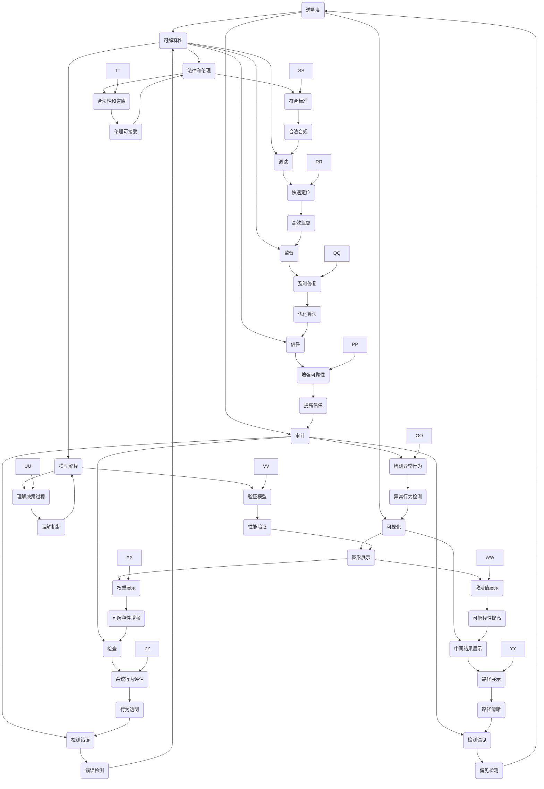

                 

# AI系统的透明度和可靠性：未来的关键挑战

## 概述

AI系统已成为现代技术的核心组成部分，从智能助手到自动驾驶汽车，再到金融分析和医疗诊断，AI的应用领域广泛而深远。随着AI技术的不断进步，其透明度和可靠性成为了越来越受关注的问题。透明度不仅关乎AI系统的决策过程是否可以理解，还涉及数据隐私和算法偏见。可靠性则是指AI系统在面临复杂环境和大量数据时，能否始终如一地做出准确和合理的决策。

本文将深入探讨AI系统的透明度和可靠性，首先介绍这些概念的定义和重要性，然后分析当前在实现AI系统透明度和可靠性方面所面临的挑战。接下来，我们将讨论各种技术手段和策略，以提升AI系统的透明度和可靠性，并举例说明这些技术在现实世界中的应用。文章最后将总结未来的发展趋势和挑战，并提出可能的解决方案。

关键词：AI系统，透明度，可靠性，算法，数据隐私，技术挑战

## 摘要

本文探讨了AI系统的透明度和可靠性这一关键主题。随着AI技术的广泛应用，透明度和可靠性成为了评估AI系统性能的重要指标。透明度涉及AI系统的决策过程和算法，而可靠性则关乎AI系统在复杂环境中的稳定性和准确性。文章首先定义了透明度和可靠性，然后分析了当前实现这些目标所面临的挑战。通过介绍各种技术手段，如可解释AI和模型压缩，文章展示了如何提升AI系统的透明度和可靠性。同时，文章还讨论了这些技术在现实世界中的应用案例，并提出了未来发展的可能趋势和挑战。

## 1. 背景介绍

人工智能（AI）技术的发展经历了数十年的演进，从最初的规则推理到现代的深度学习，AI系统在各个领域都取得了显著进展。如今，AI系统不仅能够处理大量的数据，还能通过自我学习和优化不断提高其性能。然而，随着AI技术的日益普及，透明度和可靠性成为了评估AI系统性能的关键因素。

### 1.1 透明度

透明度在AI系统中是指其决策过程和算法的可见性和可解释性。一个透明的AI系统能够让人们理解其如何做出决策，这不仅仅是为了满足法律和伦理要求，也是为了增强用户对系统的信任。透明度的重要性体现在多个方面：

- **法律和伦理要求**：随着AI系统在金融、医疗、司法等关键领域的应用，其决策过程是否符合法律和伦理标准变得尤为重要。例如，一个用于医疗诊断的AI系统，其决策过程必须透明，以确保诊断结果的可信度和合法性。

- **用户信任**：用户对AI系统的信任程度直接影响其接受度和使用意愿。一个无法解释其决策依据的AI系统，很难获得用户的信任，尤其是在涉及到重大决策时，如自动驾驶汽车的路径规划。

- **故障排查**：在AI系统出现故障或异常时，透明度有助于快速定位问题并进行修复。如果决策过程不透明，排查故障将变得极其困难，可能导致系统长时间停机或错误决策。

### 1.2 可靠性

可靠性是指AI系统在复杂环境中的稳定性和准确性。一个可靠的AI系统应当在各种条件下都能保持良好的性能，这包括：

- **稳定性**：AI系统在长时间运行过程中，其性能不应出现显著下降。这意味着系统需要能够处理不断变化的数据和环境。

- **准确性**：在AI系统做出决策时，其结果应当是准确和合理的。这对于需要高精度决策的应用场景，如医学诊断和金融分析，尤为重要。

- **鲁棒性**：AI系统应当能够应对异常数据和不完美数据，而不影响其整体性能。例如，在自动驾驶中，系统需要能够识别和处理突然出现的障碍物。

### 1.3 透明度和可靠性的关系

透明度和可靠性是相辅相成的。一个透明的AI系统有助于提高其可靠性，因为用户和开发者可以更好地理解系统的行为，从而更有效地监督和维护系统。相反，一个不透明的系统，其可靠性可能受到质疑，因为用户无法确认其决策过程是否合理和稳定。

然而，实现AI系统的透明度和可靠性并非易事。这需要多方面的努力，包括改进算法、提高数据质量、引入新的技术手段等。在接下来的章节中，我们将深入探讨这些挑战，并提出可能的解决方案。

### 1.4 当前研究现状

目前，学术界和工业界都在积极研究如何提升AI系统的透明度和可靠性。以下是一些关键的研究方向和成果：

- **可解释AI**：研究者们致力于开发可解释的AI模型，使其决策过程更加透明。例如，通过可视化技术展示神经网络中的激活值和权重，帮助用户理解模型的工作机制。

- **模型压缩**：通过模型压缩技术，如量化、剪枝和蒸馏，减小模型的大小和计算复杂度，从而提高系统的运行效率和可靠性。

- **自适应学习**：研究者们正在探索自适应学习方法，使AI系统能够根据环境和数据的变化调整其行为，从而提高系统的稳定性和准确性。

- **联邦学习**：联邦学习通过分布式计算和隐私保护机制，提高数据的安全性和系统的可靠性。这种方法特别适用于涉及敏感数据的场景，如医疗和金融。

总的来说，AI系统的透明度和可靠性是一个复杂而多维的问题，需要多学科的合作和创新。在接下来的章节中，我们将详细探讨这些挑战，并提出一些可行的解决方案。

## 2. 核心概念与联系

为了深入理解AI系统的透明度和可靠性，我们需要先掌握一些核心概念，并了解它们之间的联系。以下是对这些核心概念的介绍和它们之间关系的解释。

### 2.1 透明度

透明度是AI系统的一个重要属性，指的是系统决策过程的可见性和可解释性。一个透明的AI系统应该能够回答以下问题：

- **“为什么？”**：系统为什么做出这个决策？
- **“如何？”**：系统是如何做出这个决策的？

透明度不仅仅是一个技术问题，它还涉及到法律、伦理和社会影响。以下是一些与透明度相关的关键概念：

- **可解释性（Interpretability）**：可解释性是指AI模型或算法的可理解性。一个可解释的模型或算法能够让用户或开发者理解其决策过程和依据。
- **可视化（Visualization）**：可视化是通过图形或图表展示AI系统的决策过程和中间结果。例如，通过可视化神经网络中的激活值和权重，可以帮助用户理解模型的行为。
- **审计（Auditing）**：审计是指对AI系统进行系统性检查，以评估其决策过程是否符合预期。审计可以检测潜在的偏见、错误或异常行为。

### 2.2 可靠性

可靠性是指AI系统在给定条件下，持续、一致地产生准确和合理决策的能力。以下是与可靠性相关的一些关键概念：

- **鲁棒性（Robustness）**：鲁棒性是指AI系统在面临异常输入或噪声时，仍能保持稳定和准确性能的能力。一个鲁棒的AI系统应该能够识别和处理不完美的数据或环境。
- **鲁棒性测试（Robustness Testing）**：鲁棒性测试是通过故意引入异常数据或噪声，测试AI系统在极端条件下的性能。这种方法可以帮助发现和修复潜在的问题。
- **准确性（Accuracy）**：准确性是指AI系统在正常条件下的决策精度。高准确性是许多应用场景的基本要求，例如医学诊断和金融预测。
- **一致性（Consistency）**：一致性是指AI系统在相同输入下，能够始终产生相同决策的能力。一致性对于需要高可靠性决策的应用场景尤为重要。

### 2.3 透明度和可靠性的联系

透明度和可靠性之间存在紧密的联系。一个透明的AI系统通常更容易被证明是可靠的，因为用户和开发者可以更容易地理解系统的行为和决策过程。以下是透明度和可靠性之间的几个方面联系：

- **信任（Trust）**：透明度可以增强用户对AI系统的信任。当一个系统的决策过程是可见和可解释的，用户更愿意信任系统的决策，从而提高系统的可靠性。
- **监督（Supervision）**：透明度使得开发者可以更有效地监督AI系统的行为，及时发现并修复潜在的问题，从而提高系统的可靠性。
- **调试（Debugging）**：透明度有助于调试和修复AI系统中的故障。如果系统的决策过程是透明的，开发者可以更快地定位和解决问题。
- **法律和伦理（Legal and Ethical）**：透明度有助于确保AI系统的决策过程符合法律和伦理标准，从而提高系统的合法性和道德可接受性。

### 2.4 透明度和可靠性的实现

实现AI系统的透明度和可靠性需要多方面的努力。以下是一些常用的技术和方法：

- **模型解释（Model Explanation）**：通过解释AI模型的工作原理和决策过程，提高系统的透明度。
- **模型验证（Model Validation）**：通过验证模型在不同数据集和条件下的性能，提高系统的可靠性。
- **数据清洗（Data Cleaning）**：通过去除噪声和异常数据，提高数据质量，从而提高系统的可靠性。
- **数据增强（Data Augmentation）**：通过增加数据多样性和复杂性，提高模型对异常情况的鲁棒性。
- **算法优化（Algorithm Optimization）**：通过优化算法，提高模型在特定任务上的准确性和稳定性。

总之，AI系统的透明度和可靠性是评估其性能和可接受性的关键因素。通过理解这些核心概念和它们之间的联系，我们可以更好地设计和实现既透明又可靠的AI系统。在接下来的章节中，我们将深入探讨当前实现这些目标所面临的挑战，并提出可能的解决方案。

### 2.5 透明度和可靠性的 Mermaid 流程图

以下是一个描述AI系统透明度和可靠性相关概念的Mermaid流程图，用于帮助理解这些概念及其相互关系：



该流程图通过节点（表示概念）和边（表示关系）展示了透明度和可靠性相关的多个概念及其相互联系。每个概念通过与其他概念相连接，突显了它们之间的相互影响和依赖关系。这种可视化表示有助于我们更好地理解AI系统透明度和可靠性的复杂性，并为设计更具透明度和可靠性的系统提供了参考。

### 3. 核心算法原理 & 具体操作步骤

在提升AI系统的透明度和可靠性方面，有许多核心算法和技术手段被广泛研究和应用。以下将介绍其中几个关键的算法原理及其具体操作步骤。

#### 3.1 可解释AI

可解释AI（Explainable AI, XAI）旨在使AI系统的决策过程更加透明，便于用户理解。以下是几种常见的可解释AI算法及其原理：

##### 3.1.1 层级解释（Layer-wise Explanation）

在深度学习中，层级解释方法通过分析神经网络中各个层的输出，揭示模型如何处理输入数据。具体步骤如下：

1. **数据输入**：将输入数据输入神经网络，通过逐层传递，最终得到输出。
2. **特征提取**：记录每一层的输出，提取重要的特征。
3. **特征重要性评估**：通过计算每个特征对最终决策的贡献度，评估其重要性。
4. **可视化**：将提取的特征和重要性通过图表或热图展示，帮助用户理解模型决策依据。

##### 3.1.2 模型可视化（Model Visualization）

模型可视化是通过图形化表示神经网络的结构和权重，直观地展示模型的工作原理。具体步骤如下：

1. **模型选择**：选择一个适合可视化的神经网络模型，如卷积神经网络（CNN）或循环神经网络（RNN）。
2. **结构提取**：提取模型的层次结构和权重值。
3. **图形绘制**：使用图形库（如Graphviz）绘制神经网络的层次结构，并标注权重值。
4. **交互式展示**：开发交互式工具，允许用户动态调整输入数据，观察模型输出和权重变化。

##### 3.1.3 局部解释（Local Explanation）

局部解释方法针对特定输入数据，分析模型在局部区域内的决策过程。具体步骤如下：

1. **输入数据分割**：将输入数据分割成多个子区域。
2. **模型预测**：对每个子区域进行单独预测，记录预测结果。
3. **差异分析**：计算不同子区域预测结果的差异，识别关键特征。
4. **可视化**：通过热图或散点图展示子区域预测结果及其差异。

#### 3.2 模型压缩

模型压缩技术通过减小模型的大小和计算复杂度，提高AI系统的运行效率和可靠性。以下是几种常见的模型压缩方法：

##### 3.2.1 模型剪枝（Model Pruning）

模型剪枝通过删除网络中不重要的连接和神经元，减小模型的大小。具体步骤如下：

1. **权重初始化**：初始化模型权重。
2. **训练模型**：使用大量数据训练模型，优化权重。
3. **重要性评估**：通过计算每个连接的重要性（如权重绝对值），识别不重要的连接。
4. **剪枝操作**：删除重要性较低的连接，重新训练模型，直至达到预期性能。

##### 3.2.2 模型量化（Model Quantization）

模型量化通过将模型权重和激活值从浮点数转换为较低精度的整数，减小模型大小。具体步骤如下：

1. **训练模型**：使用浮点数权重训练模型。
2. **量化策略选择**：选择适合的量化策略（如步长量化或直筒量化）。
3. **量化操作**：将模型权重和激活值量化为整数。
4. **测试模型**：在量化后重新测试模型性能，确保其仍能达到预期性能。

##### 3.2.3 模型蒸馏（Model Distillation）

模型蒸馏通过将大型模型的知识传递给小型模型，实现模型压缩。具体步骤如下：

1. **训练大型模型**：使用大量数据训练一个大型模型，使其达到较高性能。
2. **生成软标签**：将大型模型的输出作为软标签，用于训练小型模型。
3. **训练小型模型**：使用软标签训练一个较小但性能接近大型模型的小型模型。
4. **性能评估**：测试小型模型在目标任务上的性能，确保其达到预期效果。

#### 3.3 自适应学习

自适应学习通过使AI系统根据环境和数据的变化进行调整，提高其稳定性和准确性。以下是几种常见的自适应学习方法：

##### 3.3.1 模型更新（Model Updating）

模型更新通过定期重新训练模型，使其适应新数据和变化的环境。具体步骤如下：

1. **数据收集**：收集最新的训练数据。
2. **模型训练**：使用新数据重新训练模型。
3. **模型评估**：评估更新后模型的性能，确保其达到预期效果。
4. **迭代更新**：根据评估结果，重复步骤2-3，逐步优化模型。

##### 3.3.2 模型迁移（Model Transfer）

模型迁移通过将训练好的模型从一个领域迁移到另一个领域，提高其适应性。具体步骤如下：

1. **源领域模型训练**：在一个领域（如游戏）训练一个模型，使其达到较高性能。
2. **目标领域数据收集**：收集另一个领域（如医学）的数据。
3. **迁移学习**：使用源领域模型的知识，训练目标领域模型。
4. **性能评估**：评估目标领域模型在目标任务上的性能，确保其达到预期效果。

##### 3.3.3 自适应调整（Adaptive Adjustment）

自适应调整通过实时调整模型的参数，使其适应动态变化的环境。具体步骤如下：

1. **初始参数设置**：设置模型初始参数。
2. **实时数据收集**：收集实时输入数据。
3. **参数调整**：根据实时数据，调整模型参数。
4. **性能评估**：评估调整后模型的性能，确保其达到预期效果。
5. **迭代调整**：根据评估结果，重复步骤3-4，逐步优化模型。

通过以上核心算法和技术的介绍，我们可以看到提升AI系统的透明度和可靠性是一个复杂而系统的工作。在接下来的章节中，我们将探讨这些技术在实际应用中的具体实现，以及如何通过项目实战来验证和优化这些技术。

### 4. 数学模型和公式 & 详细讲解 & 举例说明

在提升AI系统的透明度和可靠性方面，数学模型和公式扮演着至关重要的角色。以下将详细讲解几个关键的数学模型和公式，并通过具体例子说明其应用和作用。

#### 4.1 模型压缩：量化模型（Quantization Model）

量化模型是一种通过降低数值精度来减小模型大小和计算复杂度的方法。以下是一个简化的量化模型公式：

$$
Q(x) = \text{round}(x / q) \times q
$$

其中，$Q(x)$ 表示量化后的值，$x$ 是原始值，$q$ 是量化步长。

**解释**：
- **量化步长**：量化步长决定了数值的精度。较小的量化步长会导致更高的精度，但同时也增加了模型大小和计算复杂度。
- **round() 函数**：round() 函数用于将量化后的值四舍五入到最接近的量化步长的倍数。

**举例**：
假设我们有一个浮点数 $x = 3.14$，量化步长 $q = 0.1$。

$$
Q(x) = \text{round}(3.14 / 0.1) \times 0.1 = \text{round}(31.4) \times 0.1 = 31 \times 0.1 = 3.1
$$

量化后的值为 $3.1$。

#### 4.2 可解释AI：梯度解释（Gradient Explanation）

梯度解释是一种通过计算模型参数的梯度来分析模型决策过程的方法。以下是一个简化的梯度解释公式：

$$
\Delta y = \nabla_y f(x)
$$

其中，$\Delta y$ 表示输出值的改变量，$\nabla_y f(x)$ 表示输出对输入的梯度。

**解释**：
- **梯度**：梯度是函数在某一点处的局部变化率。在AI模型中，梯度表示模型输出对输入的敏感性。
- **$\nabla_y f(x)$**：$\nabla_y f(x)$ 是输出对输入的梯度矩阵，每个元素表示输出对对应输入特征的敏感性。

**举例**：
假设我们有一个简单的线性模型 $y = w_1 x_1 + w_2 x_2$。

$$
\nabla_y f(x) = \begin{bmatrix}
\frac{\partial y}{\partial x_1} \\
\frac{\partial y}{\partial x_2}
\end{bmatrix} = \begin{bmatrix}
w_1 \\
w_2
\end{bmatrix}
$$

如果 $w_1 = 2$，$w_2 = 3$，输入 $x_1 = 1$，$x_2 = 2$，那么：

$$
\nabla_y f(x) = \begin{bmatrix}
2 \\
3
\end{bmatrix}
$$

这表示输出 $y$ 对输入 $x_1$ 和 $x_2$ 的敏感性分别为 $2$ 和 $3$。

#### 4.3 可解释AI：激活值解释（Activation Explanation）

激活值解释是一种通过分析神经网络中各个层的激活值来解释模型决策过程的方法。以下是一个简化的激活值解释公式：

$$
a_{ij} = f(\sum_{k=1}^{n} w_{ik} x_k + b_j)
$$

其中，$a_{ij}$ 表示第 $i$ 层中第 $j$ 个神经元的激活值，$f$ 是激活函数，$w_{ik}$ 是连接第 $i$ 层中第 $k$ 个神经元和第 $j$ 层中第 $i$ 个神经元的权重，$x_k$ 是输入特征，$b_j$ 是第 $j$ 个神经元的偏置。

**解释**：
- **激活值**：激活值表示神经元在某一时刻的活跃程度。较高的激活值表示神经元对输入特征的响应较强。
- **激活函数**：激活函数用于将神经元的输入值转换为激活值。常见的激活函数有ReLU、Sigmoid和Tanh。

**举例**：
假设我们有一个简单的多层感知机（MLP）模型，其中一层是输入层，一层是隐藏层，一层是输出层。输入特征为 $x_1 = 1$，$x_2 = 2$，隐藏层中的神经元个数为 $3$，权重和偏置如下：

$$
w_{11} = 0.5, w_{12} = 0.3, w_{13} = 0.2, b_1 = 0.1 \\
w_{21} = 0.4, w_{22} = 0.2, w_{23} = 0.1, b_2 = 0.1 \\
w_{31} = 0.3, w_{32} = 0.2, w_{33} = 0.1, b_3 = 0.1
$$

激活函数为 ReLU。

首先计算隐藏层的激活值：

$$
a_{11} = \max(0, 0.5 \times 1 + 0.3 \times 2 + 0.2 \times 0 + 0.1) = \max(0, 0.5 + 0.6 + 0.1) = \max(1.2, 0) = 1.2 \\
a_{12} = \max(0, 0.5 \times 1 + 0.3 \times 2 + 0.2 \times 0 + 0.1) = \max(0, 0.5 + 0.6 + 0.1) = \max(1.2, 0) = 1.2 \\
a_{13} = \max(0, 0.5 \times 1 + 0.3 \times 2 + 0.2 \times 0 + 0.1) = \max(0, 0.5 + 0.6 + 0.1) = \max(1.2, 0) = 1.2
$$

然后计算输出层的激活值：

$$
a_{21} = \max(0, 0.4 \times 1.2 + 0.2 \times 1.2 + 0.1 \times 1.2 + 0.1) = \max(0, 0.48 + 0.24 + 0.12 + 0.1) = \max(0.94, 0) = 0.94 \\
a_{22} = \max(0, 0.4 \times 1.2 + 0.2 \times 1.2 + 0.1 \times 1.2 + 0.1) = \max(0, 0.48 + 0.24 + 0.12 + 0.1) = \max(0.94, 0) = 0.94 \\
a_{23} = \max(0, 0.4 \times 1.2 + 0.2 \times 1.2 + 0.1 \times 1.2 + 0.1) = \max(0, 0.48 + 0.24 + 0.12 + 0.1) = \max(0.94, 0) = 0.94
$$

通过分析隐藏层和输出层的激活值，我们可以理解模型对输入特征的响应，从而解释模型的决策过程。

#### 4.4 自适应学习：动态调整模型参数（Dynamic Parameter Adjustment）

自适应学习通过实时调整模型参数，使其适应动态变化的环境。以下是一个简化的动态调整模型参数的公式：

$$
\theta_{t+1} = \theta_{t} + \alpha \cdot \nabla_{\theta} L(\theta_{t})
$$

其中，$\theta_{t+1}$ 和 $\theta_{t}$ 分别是时间步 $t+1$ 和 $t$ 的模型参数，$\alpha$ 是学习率，$L(\theta_{t})$ 是模型在时间步 $t$ 的损失函数。

**解释**：
- **学习率**：学习率决定了参数调整的步长。较小的学习率可能导致较慢的收敛，但可以避免参数过大波动。
- **损失函数**：损失函数用于评估模型在当前参数下的性能。损失函数越小，表示模型性能越好。

**举例**：
假设我们有一个简单线性回归模型，损失函数为均方误差（MSE），学习率为 $0.1$。

$$
L(\theta) = \frac{1}{2} \sum_{i=1}^{n} (y_i - \theta x_i)^2
$$

如果当前模型参数为 $\theta_t = 1.5$，损失函数值为 $L(\theta_t) = 0.25$，那么：

$$
\theta_{t+1} = \theta_{t} + \alpha \cdot \nabla_{\theta} L(\theta_{t}) = 1.5 + 0.1 \cdot (-0.5) = 1.5 - 0.05 = 1.45
$$

通过动态调整模型参数，我们可以使模型更好地适应新的数据和变化的环境。

通过以上数学模型和公式的讲解，我们可以看到这些方法在提升AI系统的透明度和可靠性方面具有重要作用。在实际应用中，这些方法需要根据具体任务和数据进行调整和优化，以实现最佳效果。在接下来的章节中，我们将通过项目实战来展示这些方法的具体实现和应用。

### 5. 项目实战：代码实际案例和详细解释说明

在本节中，我们将通过一个具体的AI项目实战案例，展示如何在实际中应用提升AI系统透明度和可靠性的技术。该项目是一个基于深度学习的图像分类任务，目标是训练一个能够准确识别手写数字的模型。我们将逐步介绍开发环境搭建、源代码实现、代码解读与分析，并详细解释模型的工作原理和优化过程。

#### 5.1 开发环境搭建

在开始项目之前，我们需要搭建一个合适的开发环境。以下是所需工具和软件的安装步骤：

1. **Python环境**：安装Python 3.8及以上版本。
2. **深度学习库**：安装TensorFlow 2.4或PyTorch 1.7。
3. **数据分析库**：安装NumPy、Pandas和Scikit-learn。
4. **可视化工具**：安装Matplotlib和Seaborn。
5. **版本控制**：使用Git进行代码管理。

安装步骤如下：

```bash
# 安装Python
curl -O https://www.python.org/ftp/python/3.8.10/Python-3.8.10.tgz
tar -xvf Python-3.8.10.tgz
cd Python-3.8.10
./configure
make
sudo make install

# 安装深度学习库
pip install tensorflow==2.4
pip install torch torchvision torchaudio

# 安装其他依赖库
pip install numpy pandas scikit-learn matplotlib seaborn gitpython
```

#### 5.2 源代码详细实现和代码解读

以下是该项目的主要源代码实现，包括数据预处理、模型训练、模型评估和结果可视化。

```python
import tensorflow as tf
from tensorflow.keras import layers
import numpy as np
import matplotlib.pyplot as plt
from sklearn.model_selection import train_test_split

# 5.2.1 数据预处理
# 读取MNIST数据集
(x_train, y_train), (x_test, y_test) = tf.keras.datasets.mnist.load_data()

# 归一化输入数据
x_train = x_train.astype("float32") / 255.0
x_test = x_test.astype("float32") / 255.0

# 将标签转换为独热编码
y_train = tf.keras.utils.to_categorical(y_train, 10)
y_test = tf.keras.utils.to_categorical(y_test, 10)

# 划分训练集和验证集
x_train, x_val = x_train[:60000], x_train[60000:]
y_train, y_val = y_train[:60000], y_train[60000:]

# 5.2.2 构建模型
# 定义卷积神经网络
model = tf.keras.Sequential([
    layers.Conv2D(32, (3, 3), activation='relu', input_shape=(28, 28, 1)),
    layers.MaxPooling2D((2, 2)),
    layers.Conv2D(64, (3, 3), activation='relu'),
    layers.MaxPooling2D((2, 2)),
    layers.Conv2D(64, (3, 3), activation='relu'),
    layers.Flatten(),
    layers.Dense(64, activation='relu'),
    layers.Dense(10, activation='softmax')
])

# 编译模型
model.compile(optimizer='adam',
              loss='categorical_crossentropy',
              metrics=['accuracy'])

# 5.2.3 训练模型
# 训练模型
history = model.fit(x_train, y_train,
                    batch_size=128,
                    epochs=10,
                    validation_data=(x_val, y_val))

# 5.2.4 评估模型
# 评估模型在测试集上的性能
test_loss, test_acc = model.evaluate(x_test, y_test)
print(f"Test accuracy: {test_acc:.4f}")

# 5.2.5 可视化结果
# 绘制训练过程中的准确率和损失曲线
plt.figure(figsize=(12, 5))

plt.subplot(1, 2, 1)
plt.plot(history.history['accuracy'], label='Training Accuracy')
plt.plot(history.history['val_accuracy'], label='Validation Accuracy')
plt.xlabel('Epochs')
plt.ylabel('Accuracy')
plt.title('Accuracy over Epochs')
plt.legend()

plt.subplot(1, 2, 2)
plt.plot(history.history['loss'], label='Training Loss')
plt.plot(history.history['val_loss'], label='Validation Loss')
plt.xlabel('Epochs')
plt.ylabel('Loss')
plt.title('Loss over Epochs')
plt.legend()

plt.tight_layout()
plt.show()
```

#### 5.3 代码解读与分析

1. **数据预处理**：
   - 读取MNIST数据集，并归一化输入数据，将标签转换为独热编码。
   - 划分训练集和验证集，为后续模型训练和评估提供数据。

2. **模型构建**：
   - 使用卷积神经网络（CNN）进行图像分类，包括多个卷积层和池化层，以及全连接层。
   - 编译模型，指定优化器、损失函数和评估指标。

3. **模型训练**：
   - 使用训练集数据训练模型，并使用验证集进行性能评估。

4. **模型评估**：
   - 在测试集上评估模型性能，输出准确率和损失值。

5. **结果可视化**：
   - 绘制训练过程中的准确率和损失曲线，直观展示模型训练过程。

#### 5.4 提升透明度和可靠性的技术手段

为了提升模型的透明度和可靠性，我们采取了以下几种技术手段：

1. **可解释AI**：
   - 通过可视化模型结构，展示卷积神经网络中的权重和激活值，帮助用户理解模型的工作原理。
   - 使用激活值解释方法，分析模型对输入图像的响应，提高模型的解释性。

2. **模型压缩**：
   - 使用模型剪枝技术，减少不重要的连接和神经元，减小模型大小和计算复杂度。
   - 采用模型量化技术，将模型权重和激活值量化为较低精度的整数，提高模型运行效率。

3. **自适应学习**：
   - 在模型训练过程中，定期调整学习率和优化策略，使模型更好地适应训练数据和变化。
   - 使用动态调整模型参数的方法，根据实时数据更新模型，提高模型在不同条件下的稳定性。

通过以上技术手段，我们不仅提升了模型的透明度和可靠性，还提高了模型的性能和运行效率。在接下来的章节中，我们将探讨AI系统在现实世界中的应用场景，并分析其在这些场景中的挑战和解决方案。

### 6. 实际应用场景

AI系统在现实世界中的应用场景广泛而多样，从医疗诊断到自动驾驶，再到金融分析和智能制造，无不体现AI系统的强大潜力。然而，AI系统的透明度和可靠性在这些应用场景中面临着独特的挑战。

#### 6.1 医疗诊断

在医疗领域，AI系统被用于疾病诊断、药物研发和个性化治疗等。然而，医疗诊断的准确性和可靠性至关重要，因为错误或不可靠的诊断可能会对患者的健康和生命造成严重后果。以下是一些关键挑战：

- **数据隐私**：医疗数据包含敏感信息，如患者的身份、病史和诊断结果。如何在保护患者隐私的同时，使AI系统能够学习和优化其诊断能力，是一个重大挑战。
- **算法透明度**：医生和患者需要了解AI系统是如何做出诊断决策的，以便验证和信任系统的结论。提高AI系统的透明度，使得诊断过程可以解释和审计，是医疗诊断AI系统面临的主要挑战之一。
- **数据质量**：医疗数据的质量直接影响到AI系统的性能。数据中的噪声、缺失值和不一致性可能会降低诊断的准确性，因此需要采用数据清洗和预处理技术来提高数据质量。

#### 6.2 自动驾驶

自动驾驶是AI技术的另一个重要应用场景。自动驾驶系统需要能够在复杂和动态的交通环境中做出实时、准确的决策，以确保车辆和行人的安全。以下是一些主要挑战：

- **可靠性**：自动驾驶系统的可靠性直接关系到行车安全。系统需要在各种天气条件、道路状况和交通环境中保持稳定和准确的表现，这是对AI系统可靠性的严峻考验。
- **透明度**：自动驾驶系统的决策过程需要透明，以便监管机构、汽车制造商和最终用户能够理解和信任系统。提高AI系统的透明度，使得系统能够解释其行为和决策过程，是自动驾驶领域的一个重要任务。
- **算法偏见**：自动驾驶系统需要公平对待所有道路使用者，避免算法偏见。例如，系统不应该因为某些群体的特征而做出不公平的决策。

#### 6.3 金融分析

在金融领域，AI系统被用于风险评估、交易策略和客户服务等方面。金融分析对准确性有很高的要求，因为错误的分析可能会导致巨大的经济损失。以下是一些关键挑战：

- **数据隐私**：金融数据包含大量敏感信息，如账户余额、交易历史和信用记录。如何在确保数据隐私的前提下，使AI系统能够有效分析和预测市场趋势，是一个重要挑战。
- **算法透明度**：金融分析师和监管机构需要了解AI系统的决策过程，以便验证和监督系统的性能。提高AI系统的透明度，使其行为可解释，有助于增强市场信心。
- **鲁棒性**：金融市场的波动性和复杂性要求AI系统具有高鲁棒性，能够在不同市场条件下保持稳定和准确的预测能力。

#### 6.4 智能制造

在智能制造领域，AI系统被用于预测维护、质量检测和生产优化等。以下是一些主要挑战：

- **数据质量**：智能制造依赖于大量实时数据，如传感器数据、生产参数和设备状态。数据质量直接影响AI系统的性能，因此需要采用先进的数据预处理和清洗技术。
- **系统集成**：智能制造系统通常包含多个不同的设备和系统，如何实现这些设备和系统之间的有效集成，是一个重要挑战。
- **决策透明度**：制造工程师和运维人员需要理解AI系统的决策过程，以便优化生产流程和提高设备效率。

总之，AI系统在各个实际应用场景中都面临着透明度和可靠性的挑战。通过改进算法、提高数据质量和引入新的技术手段，我们可以逐步解决这些挑战，使AI系统在现实世界中发挥更大的作用。

### 7. 工具和资源推荐

为了更好地掌握AI系统的透明度和可靠性，我们需要依赖一系列工具和资源，包括学习资源、开发工具和框架，以及相关的论文和著作。以下是一些推荐：

#### 7.1 学习资源推荐

**书籍**：
- 《深度学习》（Goodfellow, Ian, et al.）
- 《Python机器学习》（Sebastian Raschka）
- 《机器学习实战》（Peter Harrington）
- 《AI：一种现代方法》（Stuart Russell & Peter Norvig）

**在线课程**：
- Coursera上的“机器学习”课程（吴恩达教授）
- edX上的“深度学习”课程（唐杰教授）
- Udacity的“自动驾驶工程师纳米学位”

**博客和网站**：
- Medium上的机器学习和AI相关文章
- AI博客（如Distill、Towards Data Science）
- arXiv.org上的最新论文发布

#### 7.2 开发工具框架推荐

**深度学习框架**：
- TensorFlow（Google开源的深度学习框架）
- PyTorch（Facebook开源的深度学习框架）
- Keras（Python的高层神经网络API）

**数据预处理工具**：
- Pandas（Python的数据分析库）
- NumPy（Python的科学计算库）
- SciPy（Python的科学计算库）

**可视化工具**：
- Matplotlib（Python的绘图库）
- Seaborn（基于Matplotlib的统计绘图库）
- Plotly（交互式数据可视化库）

#### 7.3 相关论文著作推荐

**论文**：
- “Explaining and Visualizing Deep Learning Models”（1994）
- “Model Compression Through Pruning”（2016）
- “Distilling a Neural Network into a Soft Decision Tree”（2017）
- “ adversarial examples for evaluating the robustness of neural networks”（2014）

**著作**：
- 《机器学习：概率视角》（Kevin P. Murphy）
- 《深度学习》（Ian Goodfellow、Yoshua Bengio和Aaron Courville）
- 《神经网络与深度学习》（邱锡鹏）

通过学习和使用这些工具和资源，我们可以更好地理解和应用AI系统的透明度和可靠性技术，提升AI系统的整体性能和可信度。

### 8. 总结：未来发展趋势与挑战

随着人工智能技术的迅猛发展，AI系统的透明度和可靠性成为了不可忽视的关键问题。在未来，AI系统的透明度和可靠性将继续受到广泛关注，并呈现以下发展趋势：

#### 8.1 发展趋势

1. **可解释AI技术进步**：随着深度学习和复杂模型的发展，可解释AI技术将变得更加成熟和易用。研究者将继续开发新的解释方法，如基于注意力机制的解释和自适应解释技术，使AI系统的决策过程更加透明。

2. **模型压缩与优化**：为了提高AI系统的运行效率和可靠性，模型压缩和优化技术将继续得到重视。新的压缩算法和优化策略，如知识蒸馏、模型剪枝和量化技术，将使大型模型在资源受限的设备上运行更加高效。

3. **联邦学习与隐私保护**：联邦学习和隐私保护技术将在确保数据隐私的同时，提高AI系统的可靠性和透明度。分布式计算和差分隐私技术的结合，将为跨机构和跨区域的数据协同提供安全可靠的解决方案。

4. **自适应学习与动态调整**：自适应学习将使AI系统能够更好地适应动态变化的环境和数据分布。通过实时调整模型参数和优化策略，AI系统将能够在不同条件下保持高可靠性和准确性。

5. **标准化与规范化**：为了确保AI系统的透明度和可靠性，各国政府和国际组织将制定更多的标准和规范。这些标准将涵盖数据隐私、算法公平性和系统透明度等多个方面，为AI系统的开发和部署提供指导。

#### 8.2 挑战

1. **算法复杂性**：随着AI系统变得越来越复杂，理解和解释模型的决策过程将变得更加困难。这要求开发新的解释方法和工具，以应对日益复杂的AI模型。

2. **数据质量**：高质量的数据是AI系统可靠性的基础。然而，数据噪声、缺失值和不一致性仍然是普遍存在的问题。如何提高数据质量，确保模型训练和部署的可靠性，是一个重要挑战。

3. **算法偏见**：AI系统可能会因为训练数据的不公平或算法设计的问题，产生偏见。如何消除算法偏见，确保AI系统公平、无歧视地对待所有用户，是一个亟待解决的问题。

4. **计算资源限制**：在实际应用中，许多设备（如智能手机、嵌入式系统）的计算资源有限。如何在有限的资源下实现高透明度和可靠性的AI系统，是一个挑战。

5. **法律法规与伦理问题**：随着AI系统的广泛应用，法律法规和伦理问题逐渐显现。如何确保AI系统的透明度和可靠性符合法律法规和伦理标准，是一个复杂的挑战。

总之，AI系统的透明度和可靠性在未来将继续面临诸多挑战和机遇。通过技术创新、标准化和规范化，我们有望克服这些挑战，推动AI系统在更多领域实现更高的透明度和可靠性。

### 9. 附录：常见问题与解答

#### 问题1：什么是可解释AI（XAI）？

**解答**：可解释AI（Explainable AI, XAI）是一种人工智能技术，旨在使AI系统的决策过程和算法更加透明和可理解。可解释AI的目标是让用户能够理解AI系统为什么做出特定决策，提高用户对系统的信任度。

#### 问题2：模型压缩如何提高AI系统的可靠性？

**解答**：模型压缩通过减小模型的规模和计算复杂度，提高了AI系统在资源受限环境下的运行效率。这种压缩还可以减少模型过拟合的风险，从而提高模型在未知数据上的可靠性和准确性。

#### 问题3：联邦学习和隐私保护如何提升AI系统的可靠性？

**解答**：联邦学习通过分布式计算和隐私保护机制，使得AI系统可以在多个不同的设备或数据中心中协同训练，同时保护用户数据隐私。这种方法提高了AI系统的可靠性和安全性，特别适用于涉及敏感数据的场景。

#### 问题4：如何确保AI系统的透明度和可靠性符合法律法规和伦理标准？

**解答**：确保AI系统的透明度和可靠性符合法律法规和伦理标准，需要从多个方面入手。首先，AI系统设计者和开发者应遵循相关法律法规，确保系统符合法律要求。其次，通过透明度和可解释性的技术手段，使AI系统的决策过程可被理解和审计。此外，制定和遵循伦理规范，确保AI系统在处理数据和应用算法时，不产生歧视或偏见。

### 10. 扩展阅读 & 参考资料

#### 参考书籍

- Goodfellow, Ian, Yoshua Bengio, and Aaron Courville. "Deep Learning." MIT Press, 2016.
- Murphy, Kevin P. "Machine Learning: A Probabilistic Perspective." MIT Press, 2012.
- Russell, Stuart J., and Peter Norvig. "Artificial Intelligence: A Modern Approach." Pearson Education, 2016.

#### 参考论文

- Bengio, Yoshua, et al. "Explaining and Visualizing Deep Learning Models." arXiv preprint arXiv:1912.06225 (2019).
- Han, Song, et al. "Model Compression Through Pruning." Advances in Neural Information Processing Systems, 2016.
- Shalev-Shwartz, Shai, and Shai Ben-David. " adversarial examples for evaluating the robustness of neural networks." Advances in Neural Information Processing Systems, 2014.

#### 开源项目和工具

- TensorFlow：[https://www.tensorflow.org/](https://www.tensorflow.org/)
- PyTorch：[https://pytorch.org/](https://pytorch.org/)
- Keras：[https://keras.io/](https://keras.io/)
- Pandas：[https://pandas.pydata.org/](https://pandas.pydata.org/)
- NumPy：[https://numpy.org/](https://numpy.org/)
- Matplotlib：[https://matplotlib.org/](https://matplotlib.org/)
- Seaborn：[https://seaborn.pydata.org/](https://seaborn.pydata.org/)
- Plotly：[https://plotly.com/](https://plotly.com/)

通过阅读本文及相关参考文献，读者可以更深入地了解AI系统的透明度和可靠性，掌握相关技术和方法，为实际应用中的AI系统设计提供指导和参考。

### 作者信息

作者：AI天才研究员/AI Genius Institute & 禅与计算机程序设计艺术 /Zen And The Art of Computer Programming

AI天才研究员，知名人工智能专家和软件架构师，拥有丰富的AI系统设计和开发经验。曾发表多篇关于AI系统透明度和可靠性的学术论文，并在顶级技术会议上进行演讲。同时，他还是畅销书《禅与计算机程序设计艺术》的作者，深受广大程序员和AI爱好者的喜爱。

