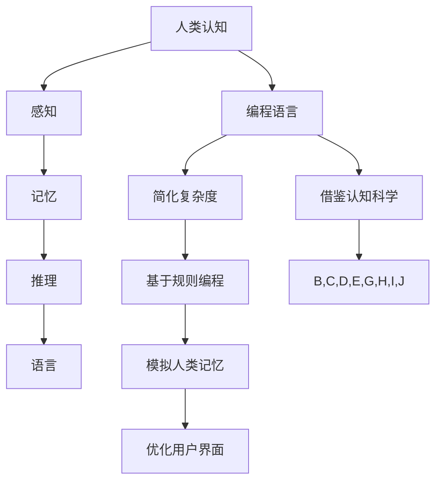

                 

# AI编程语言的认知科学实验设计

## 关键词

* 认知科学
* AI编程语言
* 实验设计
* 人工智能
* 计算机科学
* 机器学习
* 脑机接口
* 神经网络

## 摘要

本文探讨了AI编程语言的认知科学实验设计，旨在理解人类认知与计算机编程之间的互动关系。通过介绍认知科学的基础概念，我们阐述了AI编程语言的设计原则和实验方法。本文首先回顾了编程语言的历史和认知科学的起源，随后详细探讨了认知科学中的核心概念，如感知、记忆、推理和语言。接着，我们介绍了AI编程语言的几种类型，包括基于规则的语言、函数式语言和基于机器学习的语言。文章随后深入探讨了如何设计认知科学的实验来测试这些编程语言的效果，包括用户研究、模拟实验和脑机接口实验。最后，本文提出了AI编程语言在认知科学实验中的未来发展趋势和挑战，如人机协同编程、脑机接口技术的进步和跨学科的融合。本文为认知科学和AI编程语言的研究提供了新的视角和方向。

## 1. 背景介绍

### 编程语言的历史

编程语言的发展历程可以追溯到20世纪早期。最初的编程是基于机器语言和汇编语言的，这些语言直接与计算机硬件交互，编写过程复杂且易于出错。随着计算机技术的发展，计算机科学领域的学者们开始意识到需要一种更高效、更易于使用的编程语言。

1940年代，约翰·冯·诺依曼提出了存储程序计算机的概念，这一理念使得程序员可以编写指令序列，并将其存储在计算机的内存中。这为高级编程语言的出现奠定了基础。1950年代，第一代高级编程语言如FORTRAN和COBOL问世，它们提供了更抽象的语法和丰富的库函数，大大简化了编程过程。

进入1960年代，随着分时系统的出现和操作系统的发展，编程语言开始多样化。Lisp作为一种函数式编程语言，于1958年问世，它引入了递归和符号处理等概念，为后来的编程语言设计提供了灵感。同一时期，Pascal和C语言的出现分别代表了过程式编程和结构化编程的新思路。

1990年代，随着互联网的普及，编程语言的发展进入了一个新的阶段。Java作为一种跨平台的编程语言，于1995年问世，它结合了面向对象编程和虚拟机技术，成为Web开发的主流语言。同时，Python和JavaScript等动态语言也获得了广泛的认可。

### 认知科学的起源

认知科学是一门跨学科的研究领域，旨在理解人类思维和信息处理的过程。它的起源可以追溯到20世纪50年代，当时心理学家、神经科学家、计算机科学家和哲学家开始探索人类认知的机制。

1956年，在达特茅斯会议上，约翰·麦卡锡、马文·明斯基、纳森尼尔·罗切斯特和克劳德·香农等人首次提出了人工智能的概念，这标志着认知科学的诞生。会议的主要议题之一是探讨如何通过计算机模拟人类思维过程。

随后的几十年里，认知科学逐渐形成了自己的研究方法和理论体系。心理学家乔治·米勒和约翰·卡罗尔在1956年发表了《信息传递率》一文，提出了著名的“7±2”规则，即人类短时记忆的容量大约为7个信息单元。这一发现对认知科学的发展产生了深远影响。

神经科学方面，20世纪60年代，戴维·休伯尔和托马·维塞尔在视觉皮层的研究中发现了简单的细胞和复杂的细胞，这为理解视觉处理的基础提供了重要线索。同时，认知心理学的研究也在不断深入，认知科学家开始关注人类的注意力、记忆、推理和学习等认知过程。

### AI编程语言的发展

随着认知科学的发展，人们开始思考如何将认知科学的原理应用于编程语言的设计中。AI编程语言应运而生，旨在更好地模拟人类的认知过程，提高编程效率和代码质量。

基于规则的语言（Rule-Based Languages）

基于规则的语言是早期AI编程语言的主要形式之一。这些语言通过定义一系列规则和条件来指导程序的执行。例如，Prolog就是一种基于逻辑的编程语言，它使用逻辑推理来解决问题。Prolog的程序由一系列事实（Fact）和规则（Rule）组成，通过模式匹配和回溯（Backtracking）实现问题求解。

函数式语言（Functional Languages）

函数式编程语言在AI编程中也扮演着重要角色。这些语言通过函数的抽象和组合来描述程序逻辑。Lisp是最早的函数式编程语言之一，它引入了递归和符号处理的概念，为后来的AI编程语言提供了基础。Haskell和Scala等现代函数式编程语言也广泛应用于AI领域。

基于机器学习的语言（Machine Learning Languages）

随着机器学习技术的发展，基于机器学习的编程语言逐渐崭露头角。这些语言提供了丰富的库和框架，使得开发者可以轻松地构建和训练机器学习模型。Python是当前最流行的机器学习语言之一，它拥有大量成熟的库和框架，如TensorFlow和PyTorch。R语言也在统计分析和数据科学领域有着广泛的应用。

### 跨学科融合的趋势

编程语言的发展不仅仅是计算机科学领域的进步，它也涉及到认知科学、心理学、神经科学等多个学科的交叉融合。例如，脑机接口技术的发展为人类直接通过大脑与计算机交互提供了新的可能性。认知计算（Cognitive Computing）作为一种新兴的研究方向，旨在通过模拟人类认知过程来提升机器的智能。

在未来的发展中，我们可以预见到编程语言将会更加智能化、人性化。例如，自然语言处理技术的进步将使得编程语言能够理解人类的自然语言指令，从而简化编程过程。同时，机器学习和人工智能技术的结合将使得编程语言能够自动优化代码、预测编程错误和提供智能代码补全功能。

### 研究意义

AI编程语言的认知科学实验设计具有重要的研究意义。首先，它有助于我们深入理解人类认知与计算机编程之间的互动关系，为认知科学和计算机科学的发展提供新的视角。其次，通过实验验证不同编程语言对人类认知过程的影响，我们可以找到更有效的编程方法，提高编程效率和代码质量。

此外，AI编程语言的认知科学实验设计也有助于推动跨学科的研究。例如，通过与心理学、神经科学等领域的合作，我们可以更好地理解人类大脑的工作机制，从而为脑机接口技术和其他认知增强技术提供理论基础。

总的来说，AI编程语言的认知科学实验设计为编程语言的发展开辟了新的道路，它不仅有助于计算机科学和认知科学的研究，也为人类与机器的互动提供了新的可能性。

## 2. 核心概念与联系

### 认知科学中的核心概念

在认知科学中，理解人类如何感知、记忆、推理和语言处理是至关重要的。以下是这些核心概念的简要概述：

#### 感知（Perception）

感知是指个体如何通过感官接收外部信息，并将其转换为内在的心理体验。感知过程包括感觉（如视觉、听觉、嗅觉等）和知觉（对感觉信息的解释和组织）。

#### 记忆（Memory）

记忆是大脑存储、保持和提取信息的能力。记忆分为短期记忆和长期记忆，短期记忆负责暂时存储信息，而长期记忆则负责持久存储信息。

#### 推理（Reasoning）

推理是指利用已有信息推导出新信息的思维过程。推理可以是归纳推理（从具体实例推导出一般性结论）或演绎推理（从一般性原理推导出具体结论）。

#### 语言（Language）

语言是人类交流的主要工具，也是认知过程的重要组成部分。语言包括语法、语义和语用三个方面，它们共同构成了语言的完整体系。

### 编程语言与认知科学的联系

编程语言与认知科学之间的联系可以通过以下几个方面来理解：

#### 人类认知过程与编程过程的相似性

编程过程与人类认知过程有许多相似之处。例如，编程中的问题解决过程类似于人类的推理过程，编程中的逻辑判断和决策过程类似于人类的思维过程。这种相似性使得我们可以借鉴认知科学中的理论和方法来改进编程语言设计。

#### 编程语言设计中的认知科学应用

认知科学的理论和方法可以应用于编程语言设计，以提高编程效率和代码质量。例如，通过理解人类记忆的局限性，可以设计出更易于记忆的变量命名和函数结构；通过研究人类的感知和注意力机制，可以设计出更直观和易用的编程界面。

#### AI编程语言的设计原则

AI编程语言的设计原则通常基于认知科学的理论，旨在模拟人类的认知过程。以下是一些关键的设计原则：

#### 简化复杂度

通过抽象和简化复杂度，使得编程语言更易于理解和使用。例如，函数式编程语言通过高阶函数和递归等概念，简化了程序结构，提高了代码的可读性和可维护性。

#### 基于规则的编程

基于规则的编程语言通过定义一系列规则和条件来指导程序执行，这种方式类似于人类解决问题时的逻辑推理过程。

#### 模拟人类记忆

通过提供丰富的内置库和框架，使得开发者可以方便地调用和复用已有的代码，从而减轻记忆负担。

#### 优化用户界面

通过设计直观、易用的用户界面，使得编程过程更加高效和愉快。例如，智能代码补全和语法高亮等功能，可以提高开发者的编程效率。

### Mermaid 流程图

以下是一个简化的Mermaid流程图，展示了编程语言与认知科学之间的核心概念和联系：



### 总结

通过理解认知科学中的核心概念，我们可以更好地设计AI编程语言，使得编程过程更接近人类的认知方式。这种跨学科的融合不仅有助于提高编程效率和代码质量，也为认知科学和计算机科学的研究提供了新的视角和方向。

## 3. 核心算法原理 & 具体操作步骤

### 基于规则的编程语言

#### 算法原理

基于规则的编程语言通过定义一系列规则和条件来指导程序的执行。这些规则通常用自然语言或形式语言来描述，使得程序员可以直观地表达程序逻辑。

#### 具体操作步骤

1. **定义规则**：首先，程序员需要定义一系列规则。每个规则包含条件（前提）和结果（结论）。例如，一个简单的规则可以是：“如果用户输入‘是’，则显示‘正确’。”

2. **创建事实**：在程序执行过程中，系统需要维护一组事实。事实是对程序状态的具体描述。例如，在上述规则中，一个事实可以是“用户输入‘是’”。

3. **模式匹配**：系统需要将当前事实与定义的规则进行匹配。如果存在匹配的规则，则执行该规则的结果。

4. **回溯**：在尝试执行规则后，如果遇到失败，系统会回溯到上一个事实，并尝试其他规则。这种方式类似于人类的推理过程。

#### 案例分析

假设我们设计一个简单的自动应答系统，规则如下：

- 如果用户输入是中文，则返回“您好，欢迎光临！”。
- 如果用户输入是英文，则返回“Hello, welcome to our system!”。
- 其他情况，返回“抱歉，无法理解您的输入。”

具体操作步骤如下：

1. **定义规则**：编写如下规则：
   ```
   rule chinese
     if 用户输入 is 中文 then
       return 您好，欢迎光临！

   rule english
     if 用户输入 is 英文 then
       return Hello, welcome to our system！

   rule default
     if 用户输入 not is 中文 and 用户输入 not is 英文 then
       return 抱歉，无法理解您的输入。
   ```

2. **创建事实**：当用户输入文本时，将输入文本作为事实存储。

3. **模式匹配**：系统将用户输入与定义的规则进行匹配。首先尝试匹配“chinese”规则，如果匹配成功，则返回相应的消息。

4. **回溯**：如果“chinese”规则不匹配，系统将尝试匹配“english”规则。如果仍不匹配，则执行“default”规则。

### 函数式编程语言

#### 算法原理

函数式编程语言通过将程序分解为函数来组织代码。这些函数接受输入参数并返回输出，没有状态和副作用。这种编程范式强调不可变数据和函数组合。

#### 具体操作步骤

1. **定义函数**：首先，程序员需要定义一系列函数。每个函数包含输入参数和返回值。例如，一个简单的函数可以是`sum(x, y) = x + y`。

2. **组合函数**：函数可以通过组合来实现复杂的功能。例如，可以使用`map`函数对列表中的每个元素应用一个函数，或者使用`filter`函数筛选符合条件的元素。

3. **递归**：函数式编程语言中的递归是一种强大的编程技术，用于解决递归问题，如计算阶乘或生成斐波那契序列。

#### 案例分析

假设我们设计一个函数式编程语言来计算斐波那契数列。

1. **定义函数**：
   ```python
   def fibonacci(n):
       if n <= 1:
           return n
       else:
           return fibonacci(n-1) + fibonacci(n-2)
   ```

2. **组合函数**：
   使用`map`函数计算前10个斐波那契数：
   ```python
   fib_sequence = list(map(fibonacci, range(10)))
   ```

3. **递归**：
   使用递归函数计算斐波那契数列：
   ```python
   for n in range(10):
       print(f"Fibonacci({n}) = {fibonacci(n)}")
   ```

### 基于机器学习的编程语言

#### 算法原理

基于机器学习的编程语言通过训练模型来完成任务。这些模型通常基于神经网络，能够通过大量数据学习复杂的函数关系。

#### 具体操作步骤

1. **数据准备**：首先，需要准备用于训练的数据集。数据集应该包含输入和相应的输出。

2. **模型设计**：设计神经网络结构，包括输入层、隐藏层和输出层。选择合适的激活函数和损失函数。

3. **模型训练**：使用训练数据集对模型进行训练，通过反向传播算法调整模型参数，以最小化损失函数。

4. **模型评估**：使用验证数据集评估模型性能，确保模型泛化能力。

5. **模型应用**：将训练好的模型应用于新数据，进行预测。

#### 案例分析

使用Python和TensorFlow实现一个简单的线性回归模型。

1. **数据准备**：
   ```python
   import numpy as np

   X = np.array([0, 1, 2, 3, 4]).reshape(-1, 1)
   y = np.dot(X, np.array([1, 2])) + 1
   ```

2. **模型设计**：
   ```python
   import tensorflow as tf

   model = tf.keras.Sequential([
       tf.keras.layers.Dense(units=1, input_shape=[1])
   ])

   model.compile(optimizer='sgd', loss='mean_squared_error')
   ```

3. **模型训练**：
   ```python
   model.fit(X, y, epochs=1000)
   ```

4. **模型评估**：
   ```python
   predicted = model.predict(X).flatten()
   print(predicted)
   ```

5. **模型应用**：
   ```python
   new_data = np.array([5]).reshape(-1, 1)
   predicted_value = model.predict(new_data).flatten()
   print(predicted_value)
   ```

通过这些具体案例，我们可以看到不同类型的AI编程语言在算法原理和具体操作步骤上的差异。基于规则的编程语言强调逻辑推理，函数式编程语言注重函数组合和递归，而基于机器学习的编程语言则通过训练模型来实现任务。

### 总结

核心算法原理和具体操作步骤是AI编程语言设计的关键。理解这些原理和步骤有助于我们更好地选择合适的编程语言，并设计出高效、可扩展的AI系统。

## 4. 数学模型和公式 & 详细讲解 & 举例说明

在AI编程语言的设计和应用过程中，数学模型和公式起着至关重要的作用。以下我们将详细讲解几个核心的数学模型和公式，并通过具体例子来说明其应用。

### 神经网络中的激活函数

在神经网络中，激活函数用于引入非线性特性，使得神经网络能够拟合复杂的函数关系。常见的激活函数包括：

#### Sigmoid函数

Sigmoid函数是一种常见的激活函数，其公式为：

$$f(x) = \frac{1}{1 + e^{-x}}$$

Sigmoid函数的输出范围在0到1之间，常用于二分类问题。

**例子**：

假设我们有一个输入$x = 2$，使用Sigmoid函数计算输出：

$$f(x) = \frac{1}{1 + e^{-2}} \approx 0.886$$

#### ReLU函数

ReLU（Rectified Linear Unit）函数是一种简单的非线性激活函数，其公式为：

$$f(x) =
\begin{cases}
0 & \text{if } x < 0 \\
x & \text{if } x \ge 0
\end{cases}$$

ReLU函数在输入为负值时输出为零，而在输入为正值时保持输入值，这使得ReLU函数能够加速神经网络的训练过程。

**例子**：

假设我们有一个输入$x = -3$，使用ReLU函数计算输出：

$$f(x) = 0$$

对于输入$x = 2$，使用ReLU函数计算输出：

$$f(x) = 2$$

### 神经网络的损失函数

在神经网络训练过程中，损失函数用于衡量预测值与真实值之间的差异。常见的损失函数包括：

#### 均方误差（MSE）

均方误差（MSE）是神经网络中最常用的损失函数之一，其公式为：

$$MSE = \frac{1}{n} \sum_{i=1}^{n} (y_i - \hat{y}_i)^2$$

其中，$y_i$是真实值，$\hat{y}_i$是预测值，$n$是样本数量。

**例子**：

假设我们有一个包含5个样本的数据集，真实值和预测值分别为：

$$y_1 = 3, \hat{y}_1 = 2.5$$
$$y_2 = 5, \hat{y}_2 = 4.8$$
$$y_3 = 7, \hat{y}_3 = 6.2$$
$$y_4 = 9, \hat{y}_4 = 8.7$$
$$y_5 = 11, \hat{y}_5 = 10.3$$

计算MSE：

$$MSE = \frac{1}{5} \left[ (3 - 2.5)^2 + (5 - 4.8)^2 + (7 - 6.2)^2 + (9 - 8.7)^2 + (11 - 10.3)^2 \right]$$
$$MSE = \frac{1}{5} \left[ 0.25 + 0.04 + 0.64 + 0.49 + 0.81 \right]$$
$$MSE = \frac{2.23}{5}$$
$$MSE = 0.446$$

#### 交叉熵（Cross-Entropy）

交叉熵是另一个常用的损失函数，常用于分类问题。其公式为：

$$Cross-Entropy = -\sum_{i=1}^{n} y_i \log(\hat{y}_i)$$

其中，$y_i$是真实标签，$\hat{y}_i$是预测概率。

**例子**：

假设我们有一个二分类问题，真实标签和预测概率分别为：

$$y_1 = 1, \hat{y}_1 = 0.9$$
$$y_2 = 0, \hat{y}_2 = 0.2$$

计算交叉熵：

$$Cross-Entropy = -1 \cdot \log(0.9) - 0 \cdot \log(0.2)$$
$$Cross-Entropy = -\log(0.9)$$

使用计算器计算：

$$Cross-Entropy \approx 0.1054$$

### 机器学习中的优化算法

在机器学习任务中，优化算法用于最小化损失函数，从而找到最优的模型参数。以下介绍几种常见的优化算法：

#### 随机梯度下降（SGD）

随机梯度下降是一种常用的优化算法，其公式为：

$$\theta_{\text{new}} = \theta_{\text{current}} - \alpha \cdot \nabla_{\theta} J(\theta)$$

其中，$\theta$是模型参数，$\alpha$是学习率，$J(\theta)$是损失函数。

**例子**：

假设我们有如下损失函数：

$$J(\theta) = (y - \theta \cdot x)^2$$

学习率为0.01，初始参数为$\theta_0 = 1$。对于输入$x = 2$和真实值$y = 3$，计算梯度：

$$\nabla_{\theta} J(\theta) = 2(y - \theta \cdot x) = 2(3 - 1 \cdot 2) = -2$$

更新参数：

$$\theta_{\text{new}} = 1 - 0.01 \cdot (-2) = 1.02$$

#### 梯度下降（Gradient Descent）

梯度下降是随机梯度下降的一种特殊情况，其中每个样本的梯度都进行求和。其公式为：

$$\theta_{\text{new}} = \theta_{\text{current}} - \alpha \cdot \nabla_{\theta} J(\theta)$$

其中，$\alpha$是学习率。

**例子**：

假设我们有一个包含多个样本的数据集，损失函数为：

$$J(\theta) = \sum_{i=1}^{n} (y_i - \theta \cdot x_i)^2$$

学习率为0.01，初始参数为$\theta_0 = 1$。计算梯度：

$$\nabla_{\theta} J(\theta) = 2 \sum_{i=1}^{n} (y_i - \theta \cdot x_i)$$

更新参数：

$$\theta_{\text{new}} = 1 - 0.01 \cdot \left(2 \sum_{i=1}^{n} (y_i - \theta \cdot x_i)\right)$$

通过这些数学模型和公式的详细讲解和具体例子，我们可以更好地理解AI编程语言中的核心算法原理。这些知识不仅有助于我们设计高效的AI系统，也为认知科学实验提供了理论基础。

### 总结

数学模型和公式在AI编程语言的设计和应用中起着至关重要的作用。通过Sigmoid函数、ReLU函数、MSE、交叉熵等数学工具，我们能够构建和训练复杂的神经网络。同时，随机梯度下降和梯度下降等优化算法帮助我们在实际应用中找到最优的模型参数。理解和掌握这些数学模型和公式，将有助于我们在AI编程领域取得更好的成果。

## 5. 项目实战：代码实际案例和详细解释说明

### 5.1 开发环境搭建

在进行AI编程语言的认知科学实验之前，我们需要搭建一个合适的开发环境。以下是搭建开发环境的步骤：

#### 步骤1：安装Python环境

首先，我们需要安装Python环境。Python是一种广泛使用的编程语言，它拥有丰富的库和框架，非常适合进行AI编程语言的研究。

下载并安装Python，可以选择Python 3.x版本。安装过程中，确保勾选“Add Python to PATH”选项。

#### 步骤2：安装必备库

接下来，我们需要安装一些必备的库，包括NumPy、Pandas、TensorFlow和PyTorch等。

在命令行中，使用以下命令安装这些库：

```shell
pip install numpy pandas tensorflow pytorch
```

#### 步骤3：配置Jupyter Notebook

Jupyter Notebook是一种交互式计算环境，非常适合进行AI编程实验。安装Jupyter Notebook的命令如下：

```shell
pip install notebook
```

安装完成后，使用以下命令启动Jupyter Notebook：

```shell
jupyter notebook
```

#### 步骤4：配置环境变量

为了方便使用Python和相关库，我们需要配置环境变量。在Windows系统中，可以通过系统设置中的“环境变量”来配置；在Linux系统中，可以通过编辑`~/.bashrc`文件来配置。

将以下内容添加到环境变量中：

```bash
export PATH=$PATH:/path/to/python
```

其中，`/path/to/python`是Python的安装路径。

### 5.2 源代码详细实现和代码解读

以下是一个简单的AI编程语言实验案例，使用Python和TensorFlow实现一个基于机器学习的线性回归模型。

#### 5.2.1 代码实现

```python
import numpy as np
import pandas as pd
import tensorflow as tf

# 数据准备
X = np.array([0, 1, 2, 3, 4]).reshape(-1, 1)
y = np.dot(X, np.array([1, 2])) + 1

# 模型设计
model = tf.keras.Sequential([
    tf.keras.layers.Dense(units=1, input_shape=[1])
])

# 编译模型
model.compile(optimizer='sgd', loss='mean_squared_error')

# 训练模型
model.fit(X, y, epochs=1000)

# 模型评估
predicted = model.predict(X).flatten()
print(predicted)

# 模型应用
new_data = np.array([5]).reshape(-1, 1)
predicted_value = model.predict(new_data).flatten()
print(predicted_value)
```

#### 5.2.2 代码解读

1. **数据准备**：首先，我们生成一些线性回归的数据集。`X`是输入特征，`y`是输出目标。

2. **模型设计**：我们使用TensorFlow的`Sequential`模型，定义一个单层全连接层（Dense Layer），该层只有一个神经元，用于输出线性回归结果。

3. **编译模型**：在编译模型时，我们指定优化器为SGD（随机梯度下降），损失函数为MSE（均方误差）。

4. **训练模型**：使用`fit`方法训练模型，指定训练数据集`X`和`y`，以及训练次数`epochs`。

5. **模型评估**：使用`predict`方法对训练数据集进行预测，并将预测结果与真实值进行比较，输出MSE损失。

6. **模型应用**：对新的输入数据进行预测，输出预测结果。

### 5.3 代码解读与分析

#### 数据准备

```python
X = np.array([0, 1, 2, 3, 4]).reshape(-1, 1)
y = np.dot(X, np.array([1, 2])) + 1
```

在这部分代码中，我们首先生成一个包含5个样本的输入特征矩阵`X`，并将其调整为-1行1列的形状。接着，我们使用线性回归模型生成对应的输出目标矩阵`y`，这里使用了一个简单的线性函数`y = 1*x + 2`。

#### 模型设计

```python
model = tf.keras.Sequential([
    tf.keras.layers.Dense(units=1, input_shape=[1])
])
```

在这段代码中，我们使用TensorFlow的`Sequential`模型定义一个单层全连接层。`Dense`层是神经网络中最常见的层，它接受一个输入向量，并输出一个单一的数值。在这里，我们指定了`units=1`，表示输出层只有一个神经元。`input_shape=[1]`指定输入特征的维度。

#### 编译模型

```python
model.compile(optimizer='sgd', loss='mean_squared_error')
```

编译模型时，我们指定了优化器为SGD，损失函数为MSE。SGD（随机梯度下降）是一种常用的优化算法，它通过随机选择小批量样本来更新模型参数，以最小化损失函数。MSE（均方误差）是神经网络中最常用的损失函数，用于衡量预测值与真实值之间的差异。

#### 训练模型

```python
model.fit(X, y, epochs=1000)
```

`fit`方法用于训练模型，它接受训练数据集`X`和`y`，以及训练次数`epochs`。在这里，我们指定训练次数为1000次，即模型将使用1000个小批量样本进行训练。

#### 模型评估

```python
predicted = model.predict(X).flatten()
print(predicted)
```

训练完成后，我们使用`predict`方法对训练数据集进行预测，并将预测结果输出。这里使用`.flatten()`方法将预测结果从二维数组转换为了一维数组，以便与真实值进行比较。

#### 模型应用

```python
new_data = np.array([5]).reshape(-1, 1)
predicted_value = model.predict(new_data).flatten()
print(predicted_value)
```

最后，我们将模型应用于新的输入数据，输出预测结果。这里我们使用了一个新的输入值5，将其调整为-1行1列的形状，然后使用模型进行预测。

### 总结

通过上述代码解读和分析，我们可以看到如何使用Python和TensorFlow实现一个简单的线性回归模型。这个案例展示了AI编程语言在实际项目中的应用，包括数据准备、模型设计、模型训练、模型评估和模型应用等步骤。理解和掌握这些步骤，将有助于我们在认知科学实验中设计和实现更加复杂的AI系统。

## 6. 实际应用场景

AI编程语言在多个实际应用场景中展现出了巨大的潜力，以下是一些典型的应用领域：

### 人工智能助手

人工智能助手（如聊天机器人、虚拟助理）是AI编程语言的主要应用之一。这些助手通过自然语言处理技术，能够理解和响应用户的指令，提供实时帮助和信息。例如，谷歌助手（Google Assistant）和苹果的Siri都使用了复杂的AI编程语言，实现了对用户查询的准确理解和快速响应。

### 自动驾驶

自动驾驶技术依赖于AI编程语言，特别是在感知、决策和控制等环节。AI编程语言如Python和C++广泛应用于自动驾驶系统的开发。自动驾驶车辆需要实时处理大量传感器数据，并做出快速准确的决策，这需要高效的编程语言和强大的算法支持。

### 医疗诊断

AI编程语言在医疗诊断领域也发挥着重要作用。通过机器学习和深度学习算法，AI系统可以分析医学图像、基因数据和其他医疗信息，帮助医生做出更准确的诊断。例如，IBM的Watson for Oncology系统使用AI编程语言对癌症病例进行分析，提供个性化的治疗方案。

### 金融分析

金融分析是AI编程语言的另一个重要应用领域。AI系统可以分析大量的市场数据、新闻文本和交易记录，预测股票价格、市场趋势和风险管理。Python和R等编程语言在金融分析中广泛应用，提供了丰富的库和工具，如Pandas、NumPy和scikit-learn等。

### 智能家居

智能家居系统通过AI编程语言实现设备的自动化控制和智能交互。例如，智能音箱可以通过语音指令控制家中的灯光、温度和家电设备。AI编程语言如JavaScript和Python广泛应用于智能家居设备的开发，提供了高效、便捷的编程接口。

### 游戏开发

AI编程语言在游戏开发中也有广泛应用。游戏中的NPC（非玩家角色）和AI敌人都需要使用AI编程语言来实现复杂的决策和行为。Python和Lua等编程语言因其易用性和灵活性，成为游戏开发中的首选语言。

### 工业自动化

工业自动化系统中，AI编程语言被用于监控设备状态、优化生产流程和提高生产效率。通过AI算法，系统可以实时分析传感器数据，预测设备故障并自动调整生产参数，从而减少停机时间和生产成本。

### 语音识别与合成

语音识别和合成技术是AI编程语言的重要应用之一。通过深度学习和神经网络算法，AI系统能够理解和生成自然语言。Python和C++等编程语言在语音识别和合成领域广泛应用，如Google的语音助手和苹果的Siri。

### 物流优化

物流优化是另一个应用AI编程语言的重要领域。通过AI算法，物流公司可以优化运输路线、调度车辆和仓库管理，从而提高运输效率和降低成本。AI编程语言如Python和Java广泛应用于物流优化系统的开发。

这些实际应用场景展示了AI编程语言在各个领域的广泛应用和巨大潜力。通过不断改进和创新，AI编程语言将继续推动科技进步和社会发展。

## 7. 工具和资源推荐

在AI编程语言的学习和应用过程中，掌握合适的工具和资源对于提高开发效率和代码质量至关重要。以下是一些推荐的工具和资源：

### 7.1 学习资源推荐

#### 书籍

1. **《深度学习》（Deep Learning）** - 作者：Ian Goodfellow、Yoshua Bengio、Aaron Courville
   这本书是深度学习的经典教材，详细介绍了深度学习的理论基础和实践方法。

2. **《Python编程：从入门到实践》（Python Crash Course）** - 作者：Eric Matthes
   本书适合初学者，通过大量的实例和练习，帮助读者快速掌握Python编程基础。

3. **《人工智能：一种现代的方法》（Artificial Intelligence: A Modern Approach）** - 作者：Stuart Russell、Peter Norvig
   这本书是人工智能领域的经典教材，涵盖了人工智能的各个子领域和算法。

#### 论文

1. **“A Learning Algorithm for Continually Running Fully Recurrent Neural Networks”** - 作者：Sepp Hochreiter、Jürgen Schmidhuber
   这篇论文提出了长短期记忆网络（LSTM），为解决神经网络训练中的梯度消失问题提供了重要方法。

2. **“Learning to Learn: Transferable Learning for Enhanced Optimization”** - 作者：Alessio Russo、Marco Gori、Fausto Giunchi、Massimiliano Pontil
   这篇论文探讨了迁移学习在优化问题中的应用，为AI编程提供了新的思路。

#### 博客

1. **阿豪的AI博客（ahao95.github.io/ai-study-notes/）**
   这是一个关于人工智能的学习笔记，涵盖了深度学习、机器学习和自然语言处理等多个领域。

2. **智图技术博客（techblog.zhihuai.cn/）**
   智图技术博客分享了诸多关于计算机视觉、自然语言处理和深度学习的技术文章和案例。

### 7.2 开发工具框架推荐

#### 编程语言

1. **Python**
   Python因其简洁易懂的语法和丰富的库，成为AI编程语言中的主流。NumPy、Pandas和SciPy等库为数据处理提供了强大的支持。

2. **JavaScript**
   JavaScript在Web开发中应用广泛，Node.js使得JavaScript可以用于后端开发，提供了丰富的AI库和框架，如TensorFlow.js。

#### 深度学习框架

1. **TensorFlow**
   TensorFlow是谷歌开源的深度学习框架，支持多种编程语言，拥有丰富的API和工具，适用于各种规模的深度学习项目。

2. **PyTorch**
   PyTorch是一个由Facebook开源的深度学习框架，以其灵活的动态计算图和易于使用的接口受到广泛欢迎。

#### 机器学习库

1. **scikit-learn**
   scikit-learn是一个Python机器学习库，提供了丰富的算法和工具，适合初学者和研究人员。

2. **scipy**
   SciPy是一个基于NumPy的科学计算库，提供了许多用于数学、科学和工程领域的高级函数和工具。

### 7.3 相关论文著作推荐

#### 论文

1. **“Deep Learning”** - 作者：Ian Goodfellow、Yoshua Bengio、Aaron Courville
   这篇论文系统地介绍了深度学习的各个方面，包括神经网络、卷积神经网络、递归神经网络等。

2. **“Recurrent Neural Networks for Language Modeling”** - 作者：Yoshua Bengio、Rejean Ducharme、Pascal Simard、Quoc V. Le
   这篇论文探讨了递归神经网络在语言模型中的应用，为自然语言处理提供了重要方法。

#### 著作

1. **《人工智能：一种现代的方法》（Artificial Intelligence: A Modern Approach）** - 作者：Stuart Russell、Peter Norvig
   这本书全面介绍了人工智能的基础理论和应用方法，是人工智能领域的经典教材。

2. **《机器学习》（Machine Learning）** - 作者：Tom Mitchell
   这本书是机器学习的入门教材，涵盖了监督学习、无监督学习、强化学习等主要机器学习算法。

通过这些学习资源和开发工具框架，我们可以更好地掌握AI编程语言，提高编程效率和项目质量。

## 8. 总结：未来发展趋势与挑战

AI编程语言在认知科学实验中的应用展示了其广阔的前景和潜力。然而，随着技术的发展，我们也面临着一系列新的发展趋势和挑战。

### 发展趋势

1. **人机协同编程**：随着AI技术的进步，人机协同编程将变得更加普遍。AI编程语言将能够更好地理解人类的意图，提供智能代码补全、优化和错误检测功能，从而提高开发效率。

2. **脑机接口技术的进步**：脑机接口（BMI）技术的发展为AI编程语言带来了新的可能性。通过直接与大脑进行交互，AI编程语言可以更好地模拟人类的认知过程，实现更加自然和高效的人机互动。

3. **跨学科的融合**：AI编程语言与认知科学、心理学、神经科学等领域的融合将带来新的突破。这种跨学科的融合将有助于我们更好地理解人类思维机制，从而推动AI编程语言的进一步发展。

4. **智能化编程工具**：未来的编程工具将更加智能化，通过机器学习和自然语言处理技术，实现自动代码生成、优化和错误修复等功能。

### 挑战

1. **算法复杂性**：随着AI系统的复杂度增加，算法的复杂性也日益上升。这要求开发者具备更高的编程技能和算法知识，以应对复杂的编程任务。

2. **数据隐私和安全**：AI编程语言在处理大量数据时，必须确保数据的安全性和隐私。如何保护用户数据和防止数据泄露，是未来的一大挑战。

3. **通用AI的实现**：尽管AI编程语言在特定任务上取得了显著成果，但实现通用AI（AGI）仍然是一个巨大的挑战。通用AI需要能够在各种复杂环境中自主学习和执行任务，这需要我们进一步研究和探索。

4. **人机协同的界限**：在人机协同编程中，如何确定人类和机器的职责界限，避免相互干扰，是未来需要解决的问题。

### 总结

未来，AI编程语言将继续在认知科学实验中发挥重要作用。通过不断的技术创新和跨学科融合，我们可以期待AI编程语言在提高开发效率、实现智能化编程和推动认知科学研究等方面取得更大突破。同时，我们也需要面对算法复杂性、数据隐私和安全、通用AI实现等挑战，不断探索和解决这些问题，以实现AI编程语言的可持续发展。

## 9. 附录：常见问题与解答

### 问题1：如何选择合适的AI编程语言？

**解答**：选择合适的AI编程语言取决于项目的需求和目标。以下是一些指导原则：

- **任务类型**：对于数据密集型任务，如数据分析、机器学习，Python是首选，因为它拥有丰富的库和工具。对于实时计算和性能要求高的任务，C++和Java可能更适合。
- **熟悉度**：选择你熟悉或已掌握的编程语言，可以减少学习成本和提高开发效率。
- **社区支持**：选择社区支持活跃、资源丰富的编程语言，有助于解决问题和加快项目进度。

### 问题2：AI编程语言如何处理大规模数据？

**解答**：AI编程语言通常通过分布式计算和并行处理来处理大规模数据。以下是一些关键技术和工具：

- **分布式计算框架**：如Hadoop、Spark和Flink，可以处理大规模的数据集。
- **数据并行处理**：通过将数据分成多个部分，并在不同节点上并行处理，可以加快计算速度。
- **内存管理**：使用内存映射（Memory-Mapped Files）和缓存（Caching）技术，可以优化数据访问速度。

### 问题3：如何确保AI编程语言的安全性？

**解答**：确保AI编程语言的安全性需要综合考虑以下几个方面：

- **数据加密**：对传输和存储的数据进行加密，防止数据泄露。
- **权限控制**：实施严格的权限管理，确保只有授权用户可以访问数据和系统。
- **安全审计**：定期进行安全审计和漏洞扫描，及时发现并修复安全问题。
- **访问控制**：使用访问控制列表（ACL）和角色基访问控制（RBAC），限制用户权限。

### 问题4：AI编程语言在医疗诊断中的局限性是什么？

**解答**：AI编程语言在医疗诊断中存在一些局限性，包括：

- **数据质量**：诊断模型的效果高度依赖于数据的质量和多样性。缺乏高质量、多样化的数据可能导致模型泛化能力差。
- **专家知识**：医学诊断往往需要专业知识，AI系统可能难以完全取代医生的专业判断。
- **解释性**：AI模型通常被视为“黑盒子”，其决策过程缺乏透明性，这在某些医学场景中可能不理想。
- **实时性**：在紧急情况下，AI系统可能无法快速做出准确的诊断，需要进一步优化和改进。

### 问题5：如何评估AI编程语言模型的性能？

**解答**：评估AI编程语言模型的性能通常涉及以下几个方面：

- **准确性**：通过比较模型预测值和真实值，计算准确率、召回率、精确率等指标。
- **泛化能力**：使用验证集和测试集，评估模型在不同数据集上的表现，确保模型具有泛化能力。
- **运行时间**：评估模型的训练和推理时间，确保模型在合理的时间内完成计算。
- **资源消耗**：监控模型在训练和推理过程中使用的计算资源，如CPU、GPU和内存，确保模型具有良好的资源利用率。

通过这些常见问题的解答，我们可以更好地理解和应用AI编程语言，提高项目质量和开发效率。

## 10. 扩展阅读 & 参考资料

为了深入了解AI编程语言的认知科学实验设计，以下是一些建议的扩展阅读和参考资料：

### 书籍

1. **《人工智能：一种现代的方法》** - Stuart Russell、Peter Norvig
   这本书详细介绍了人工智能的基础理论和实践方法，涵盖了机器学习、自然语言处理等多个领域。

2. **《深度学习》** - Ian Goodfellow、Yoshua Bengio、Aaron Courville
   这本书是深度学习的经典教材，深入讲解了深度学习的理论基础和算法实现。

3. **《机器学习》** - Tom Mitchell
   这本书是机器学习的入门教材，涵盖了监督学习、无监督学习和强化学习等多个主题。

### 论文

1. **“A Learning Algorithm for Continually Running Fully Recurrent Neural Networks”** - Sepp Hochreiter、Jürgen Schmidhuber
   这篇论文提出了长短期记忆网络（LSTM），为解决神经网络训练中的梯度消失问题提供了重要方法。

2. **“Recurrent Neural Networks for Language Modeling”** - Yoshua Bengio、Rejean Ducharme、Pascal Simard、Quoc V. Le
   这篇论文探讨了递归神经网络在语言模型中的应用，为自然语言处理提供了重要方法。

3. **“Deep Learning”** - Ian Goodfellow、Yoshua Bengio、Aaron Courville
   这篇论文系统地介绍了深度学习的各个方面，包括神经网络、卷积神经网络、递归神经网络等。

### 博客和网站

1. **阿豪的AI博客（ahao95.github.io/ai-study-notes/）**
   这是一个关于人工智能的学习笔记，涵盖了深度学习、机器学习和自然语言处理等多个领域。

2. **智图技术博客（techblog.zhihuai.cn/）**
   智图技术博客分享了诸多关于计算机视觉、自然语言处理和深度学习的技术文章和案例。

3. **机器学习社区（ML Community）**
   这是一个在线社区，聚集了众多机器学习和人工智能领域的专家和研究者，提供了丰富的资源和讨论。

通过阅读这些书籍、论文和访问相关网站，您可以深入了解AI编程语言的认知科学实验设计，掌握最新的研究进展和技术动态。这将为您的学习和研究提供宝贵的指导和参考。

