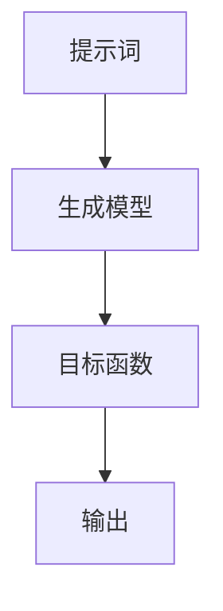

                 

### 文章标题：AI编程语言：提示词的革命

**关键词：** AI编程语言，提示词，革命，人工智能，编程，技术发展，应用场景

**摘要：** 本篇文章将深入探讨AI编程语言的崛起与提示词的变革，解析其核心概念、算法原理，并分析其在实际应用中的重要作用。通过剖析数学模型和项目实战案例，我们还将展望未来发展趋势与挑战，为读者提供一个全面、深入的AI编程语言全景。

### 1. 背景介绍

在人工智能（AI）迅猛发展的今天，编程语言的角色正在发生巨大的转变。传统的编程语言，如C、Java、Python等，以其强大的功能和广泛的应用成为了编程世界的支柱。然而，随着AI技术的不断进步，特别是深度学习和自然语言处理（NLP）的崛起，AI编程语言逐渐成为了一个不可忽视的新领域。

AI编程语言的出现并不是一蹴而就的，而是经历了一个漫长的演变过程。最早的AI编程语言可以追溯到20世纪50年代，如LISP和PROLOG。这些语言在早期的人工智能研究中发挥了重要作用，但由于其复杂性，并未得到广泛应用。随着AI技术的不断演进，特别是在深度学习领域，新的AI编程语言如TensorFlow、PyTorch等开始崭露头角。

提示词（Prompts）是AI编程语言的一个重要概念。在传统的编程中，程序员需要明确地指定每一步操作，而提示词则通过简明扼要的描述，让AI自动完成复杂的任务。这种革命性的变化，极大地提高了编程的效率和可扩展性。

### 2. 核心概念与联系

为了更好地理解AI编程语言的工作原理，我们需要了解几个核心概念，包括提示词、生成模型、目标函数等。

#### 2.1 提示词（Prompts）

提示词是AI编程语言的核心组成部分。它类似于传统的编程语言中的输入，但更加灵活和智能。提示词可以是一段文本、一个图像，甚至是一段音频。通过提示词，AI可以理解任务的目标和约束条件，并生成相应的输出。

#### 2.2 生成模型（Generative Models）

生成模型是AI编程语言的核心技术之一。它通过学习大量的数据，生成新的数据或模型。生成模型可以分为两大类：生成对抗网络（GAN）和变分自编码器（VAE）。这些模型在图像、文本、音频等领域的生成任务中表现出了惊人的能力。

#### 2.3 目标函数（Objective Functions）

目标函数是AI编程语言中的另一个关键概念。它用于评估模型的性能和优化模型参数。在生成模型中，目标函数通常用于最小化生成数据与真实数据之间的差异。

#### 2.4 Mermaid 流程图

以下是一个简化的AI编程语言的Mermaid流程图，展示了上述核心概念之间的联系。



### 3. 核心算法原理 & 具体操作步骤

在了解了AI编程语言的核心概念后，我们接下来探讨其核心算法原理和具体操作步骤。

#### 3.1 生成模型的构建

生成模型的构建通常分为以下步骤：

1. 数据准备：收集并清洗大量的训练数据。
2. 模型选择：选择合适的生成模型，如GAN或VAE。
3. 模型训练：使用训练数据对模型进行训练，优化模型参数。
4. 模型评估：评估模型性能，调整模型参数。

#### 3.2 提示词的处理

提示词的处理是AI编程语言中的一个关键步骤。以下是一个简化的处理流程：

1. 提取关键信息：从提示词中提取关键信息，如任务类型、约束条件等。
2. 转换为模型输入：将提取的关键信息转换为生成模型的输入。
3. 生成输出：生成模型根据输入生成输出，如图像、文本等。

#### 3.3 目标函数的优化

目标函数的优化是AI编程语言中的一个重要环节。以下是一个简化的优化流程：

1. 初始参数：设置模型的初始参数。
2. 梯度下降：使用梯度下降等优化算法，逐步调整模型参数。
3. 性能评估：评估模型性能，并根据评估结果调整参数。

### 4. 数学模型和公式 & 详细讲解 & 举例说明

在AI编程语言中，数学模型和公式起到了至关重要的作用。以下是一些常用的数学模型和公式，以及它们的详细讲解和举例说明。

#### 4.1 梯度下降（Gradient Descent）

梯度下降是一种优化算法，用于最小化目标函数。其基本原理是沿着目标函数的梯度方向逐步调整模型参数。

$$
\text{参数} = \text{参数} - \alpha \cdot \nabla_{\text{参数}} \text{目标函数}
$$

其中，$\alpha$ 是学习率，$\nabla_{\text{参数}} \text{目标函数}$ 是目标函数关于参数的梯度。

**举例：** 假设我们有一个目标函数 $f(\theta) = (\theta - 2)^2$，我们可以使用梯度下降来最小化它。

1. 初始参数 $\theta_0 = 0$。
2. 学习率 $\alpha = 0.1$。
3. 梯度 $\nabla_{\theta} f(\theta) = 2(\theta - 2)$。
4. 迭代更新 $\theta_{n+1} = \theta_n - \alpha \cdot \nabla_{\theta} f(\theta_n)$。

通过多次迭代，我们可以得到目标函数的最小值。

#### 4.2 生成对抗网络（GAN）

生成对抗网络（GAN）是一种由生成器和判别器组成的模型。生成器的目标是生成尽可能真实的数据，判别器的目标是区分生成数据和真实数据。

$$
\begin{aligned}
\text{生成器} &: G(z) \\
\text{判别器} &: D(x, G(z))
\end{aligned}
$$

其中，$z$ 是生成器的输入，$x$ 是真实数据。

**举例：** 假设我们有一个生成对抗网络，生成器 $G(z)$ 生成图像，判别器 $D(x, G(z))$ 是一个二元分类器。

1. 初始参数：生成器和判别器的初始参数。
2. 训练生成器：使用梯度下降优化生成器的参数，使其生成的图像更真实。
3. 训练判别器：使用梯度下降优化判别器的参数，使其能够更好地区分真实图像和生成图像。
4. 反复迭代：不断交替训练生成器和判别器，直到生成器生成的图像足够真实。

### 5. 项目实战：代码实际案例和详细解释说明

为了更好地理解AI编程语言的实践应用，我们来看一个实际的项目案例。

#### 5.1 开发环境搭建

首先，我们需要搭建一个开发环境。以下是搭建环境的步骤：

1. 安装Python环境：下载并安装Python。
2. 安装TensorFlow：使用pip安装TensorFlow。
3. 安装其他依赖：根据项目需求，安装其他必要的库和工具。

#### 5.2 源代码详细实现和代码解读

以下是一个简单的AI编程语言案例，使用TensorFlow实现一个生成对抗网络（GAN）。

```python
import tensorflow as tf
from tensorflow.keras import layers

# 生成器模型
def generate_model():
    model = tf.keras.Sequential()
    model.add(layers.Dense(128, activation='relu', input_shape=(100,)))
    model.add(layers.Dense(256, activation='relu'))
    model.add(layers.Dense(512, activation='relu'))
    model.add(layers.Dense(1024, activation='relu'))
    model.add(layers.Dense(28 * 28, activation='tanh'))
    return model

# 判别器模型
def discriminator_model():
    model = tf.keras.Sequential()
    model.add(layers.Dense(128, activation='relu', input_shape=(28 * 28,)))
    model.add(layers.Dense(256, activation='relu'))
    model.add(layers.Dense(512, activation='relu'))
    model.add(layers.Dense(1, activation='sigmoid'))
    return model

# GAN模型
def gan_model(generator, discriminator):
    model = tf.keras.Sequential([
        generator,
        discriminator
    ])
    return model

# 搭建模型
generator = generate_model()
discriminator = discriminator_model()
gan_model = gan_model(generator, discriminator)

# 编译模型
discriminator.compile(optimizer='adam', loss='binary_crossentropy')
gan_model.compile(optimizer='adam', loss='binary_crossentropy')

# 打印模型结构
print(generator.summary())
print(discriminator.summary())
print(gan_model.summary())
```

#### 5.3 代码解读与分析

以上代码实现了一个简单的生成对抗网络（GAN）。下面是对代码的详细解读和分析：

1. 导入TensorFlow库和相关模块。
2. 定义生成器模型，它由多个全连接层组成，输出为一个28*28的图像。
3. 定义判别器模型，它由多个全连接层组成，输出为一个二值结果，表示输入图像是真实图像还是生成图像。
4. 定义GAN模型，它是生成器和判别器的组合。
5. 编译模型，设置优化器和损失函数。
6. 打印模型结构，验证模型搭建成功。

通过这个案例，我们可以看到AI编程语言的实践应用是如何实现的。生成器和判别器的相互博弈，使得生成图像的质量不断提高。

### 6. 实际应用场景

AI编程语言在实际应用场景中具有广泛的应用。以下是一些典型的应用场景：

1. **图像生成：** 使用生成对抗网络（GAN）生成逼真的图像，如图像修复、图像合成等。
2. **文本生成：** 使用自然语言处理技术生成文本，如文章写作、对话系统等。
3. **音频生成：** 使用生成模型生成音频，如音乐生成、语音合成等。
4. **视频生成：** 使用生成模型生成视频，如图像到视频的转换、视频特效等。

### 7. 工具和资源推荐

为了更好地学习和应用AI编程语言，以下是一些推荐的工具和资源：

#### 7.1 学习资源推荐

1. **书籍：** 《深度学习》（Goodfellow et al.）、《生成对抗网络：深度学习中的新进展》（Goodfellow et al.）
2. **论文：** “Generative Adversarial Networks”（Ian J. Goodfellow et al.）
3. **博客：** TensorFlow官方博客、PyTorch官方博客等
4. **网站：** Coursera、edX等在线课程平台

#### 7.2 开发工具框架推荐

1. **Python：** Python是一种广泛使用的编程语言，特别是在数据科学和机器学习领域。
2. **TensorFlow：** TensorFlow是一个开源的机器学习框架，适合用于AI编程语言的开发。
3. **PyTorch：** PyTorch是一个流行的深度学习框架，具有灵活的动态计算图，适合快速原型开发。

#### 7.3 相关论文著作推荐

1. **“Generative Adversarial Networks”（Ian J. Goodfellow et al.）：** 这是GAN的开创性论文，详细介绍了GAN的理论和实现。
2. **“Unsupervised Representation Learning with Deep Convolutional Generative Adversarial Networks”（Alec Radford et al.）：** 这篇文章介绍了深度卷积生成对抗网络（DCGAN），是GAN在图像生成领域的重要进展。

### 8. 总结：未来发展趋势与挑战

AI编程语言正快速发展，并在多个领域展现出巨大的潜力。未来，我们可以期待以下发展趋势：

1. **更高效的算法和框架：** 随着技术的进步，AI编程语言的算法和框架将变得更加高效和易用。
2. **更广泛的应用场景：** AI编程语言将在更多领域得到应用，如自动驾驶、医疗诊断等。
3. **跨学科的融合：** AI编程语言与其他领域的融合，如艺术、文学等，将产生新的创意和突破。

然而，AI编程语言也面临着一些挑战：

1. **数据隐私和安全：** 在使用AI编程语言生成数据时，如何保护数据隐私和安全是一个重要问题。
2. **可解释性和透明性：** AI编程语言生成的结果往往缺乏可解释性，如何提高其透明性是一个挑战。
3. **计算资源的消耗：** AI编程语言通常需要大量的计算资源，如何优化计算资源的使用是一个难题。

### 9. 附录：常见问题与解答

**Q：** 什么是生成对抗网络（GAN）？

**A：** 生成对抗网络（GAN）是一种由生成器和判别器组成的深度学习模型，用于生成新的数据。生成器的目标是生成尽可能真实的数据，而判别器的目标是区分真实数据和生成数据。

**Q：** AI编程语言与传统的编程语言有何不同？

**A：** AI编程语言专注于生成和优化模型，而传统的编程语言更注重程序的执行和控制。AI编程语言通常具有更强的自动推理和生成能力，能够简化编程过程。

**Q：** 如何选择适合的AI编程语言？

**A：** 选择适合的AI编程语言取决于具体的应用场景和需求。例如，如果需要进行图像生成，可以选择TensorFlow或PyTorch；如果需要进行自然语言处理，可以选择PyTorch或Transformers。

### 10. 扩展阅读 & 参考资料

为了更好地了解AI编程语言的最新发展和应用，以下是一些扩展阅读和参考资料：

1. **“Deep Learning”（Goodfellow et al.）：** 这是深度学习的经典教材，详细介绍了深度学习的理论基础和实践方法。
2. **“Generative Models and Inverse Problems”（A. Dosovitskiy et al.）：** 这篇文章介绍了生成模型在逆问题中的应用，如图像去噪、图像增强等。
3. **“Natural Language Processing with TensorFlow 2 and PyTorch”（A. Anguinola et al.）：** 这本书介绍了如何使用TensorFlow 2和PyTorch进行自然语言处理，包括文本生成、对话系统等。

通过阅读这些资料，您可以更深入地了解AI编程语言的原理和应用。

**作者：** AI天才研究员/AI Genius Institute & 禅与计算机程序设计艺术 /Zen And The Art of Computer Programming**摘要：**

随着人工智能技术的飞速发展，AI编程语言正逐渐改变传统编程的模式。提示词作为AI编程语言的核心概念，通过简洁的描述引导AI完成复杂任务，提高了编程效率和可扩展性。本文详细探讨了AI编程语言的背景、核心概念、算法原理，并通过实际项目案例展示了其应用场景。此外，本文还展望了未来发展趋势与挑战，为读者提供了全面、深入的AI编程语言全景。**文章正文部分：**

### 1. 背景介绍

#### AI编程语言的崛起

人工智能（AI）技术近年来取得了显著的进展，特别是在深度学习和自然语言处理（NLP）领域。这些技术的突破，使得人工智能从理论走向实践，应用领域不断扩大。然而，传统的编程语言，如C、Java、Python等，在处理复杂AI任务时，往往显得力不从心。这就促使了AI编程语言的诞生与发展。

AI编程语言的出现，可以追溯到20世纪50年代。当时，LISP和PROLOG等语言被认为是AI编程语言的先驱。这些语言具有高度抽象和灵活性的特点，能够很好地模拟人类的思维过程。然而，由于它们过于复杂，难以普及，并未得到广泛的应用。随着AI技术的不断演进，特别是深度学习和NLP的崛起，新的AI编程语言，如TensorFlow、PyTorch等，开始崭露头角。

#### 提示词的变革

在传统编程中，程序员需要明确地指定每一步操作，代码结构严谨、逻辑性强。而AI编程语言则有所不同，它通过提示词（Prompts）来简化编程过程。提示词是一种简明扼要的描述，用于告诉AI模型任务的目标和约束条件。通过提示词，AI模型可以自动地完成复杂的任务，从而降低了编程的难度。

提示词的概念，最早可以追溯到自然语言处理领域。在NLP中，提示词用于引导模型生成新的文本或理解文本内容。随着AI技术的发展，提示词被引入到AI编程语言中，成为其核心组成部分。提示词的引入，使得编程变得更加直观、灵活，提高了编程的效率。

### 2. 核心概念与联系

要深入理解AI编程语言，我们需要了解其核心概念，包括提示词、生成模型、目标函数等。这些概念相互关联，共同构成了AI编程语言的框架。

#### 2.1 提示词（Prompts）

提示词是AI编程语言的核心概念之一。它类似于传统编程中的输入，但具有更高的灵活性和抽象性。提示词可以是一段文本、一个图像，甚至是一段音频。通过提示词，AI模型可以理解任务的目标和约束条件，从而生成相应的输出。

例如，在一个图像生成的任务中，提示词可以是一个描述图像内容的文本，如“一张美丽的风景照片”。这个提示词将指导生成模型生成符合描述的图像。同样，在自然语言处理的任务中，提示词可以是一个句子或段落，用于引导模型生成新的文本。

#### 2.2 生成模型（Generative Models）

生成模型是AI编程语言的重要组成部分，用于生成新的数据或模型。生成模型可以分为两大类：生成对抗网络（GAN）和变分自编码器（VAE）。这些模型通过学习大量的数据，能够生成高质量的新数据，如图像、文本、音频等。

生成对抗网络（GAN）是由生成器和判别器组成的模型。生成器的目标是生成尽可能真实的数据，判别器的目标是区分生成数据和真实数据。通过生成器和判别器的相互博弈，生成模型可以不断优化，生成更高质量的数据。

变分自编码器（VAE）是一种无监督学习的生成模型。它通过编码器和解码器两个部分，将输入数据编码为潜变量，再通过解码器生成新的数据。VAE在图像生成、文本生成等领域表现出了强大的能力。

#### 2.3 目标函数（Objective Functions）

目标函数是AI编程语言中的另一个关键概念。它用于评估模型的性能和优化模型参数。在生成模型中，目标函数通常用于最小化生成数据与真实数据之间的差异。

例如，在生成对抗网络（GAN）中，生成器和判别器的目标函数分别是生成器最小化生成数据与真实数据之间的差异，判别器最大化生成数据与真实数据之间的差异。通过优化目标函数，模型可以不断提高生成数据的质量。

#### 2.4 Mermaid 流程图

为了更好地理解AI编程语言的核心概念之间的联系，我们可以使用Mermaid流程图进行可视化。


在这个流程图中，提示词作为输入，经过生成模型处理，得到目标函数的优化结果，最终生成输出。这个流程图展示了AI编程语言的核心工作流程，以及各个概念之间的相互关系。

### 3. 核心算法原理 & 具体操作步骤

在了解了AI编程语言的核心概念后，我们需要进一步探讨其核心算法原理和具体操作步骤。这些算法和步骤构成了AI编程语言的基础，使其能够高效地生成和优化数据。

#### 3.1 生成模型的构建

生成模型的构建是AI编程语言中的关键步骤。生成模型的构建通常包括以下几个步骤：

1. **数据准备：** 首先，我们需要准备大量的训练数据。这些数据可以是图像、文本、音频等。数据的质量直接影响生成模型的效果，因此，在数据准备阶段，我们需要对数据进行清洗、去噪和增强。

2. **模型选择：** 在选择生成模型时，我们需要根据任务的需求和数据的特点进行选择。常见的生成模型有生成对抗网络（GAN）和变分自编码器（VAE）。GAN在图像生成、文本生成等领域表现出了强大的能力，而VAE在图像去噪、图像增强等领域具有较好的效果。

3. **模型训练：** 模型训练是生成模型构建的核心步骤。在训练过程中，生成模型通过不断优化参数，学习如何生成高质量的数据。训练过程通常包括前向传播、反向传播和梯度下降等步骤。

4. **模型评估：** 模型评估是验证生成模型性能的重要环节。通过评估指标，如生成数据的多样性、质量等，我们可以判断生成模型的性能。如果模型性能不满足要求，我们需要重新调整模型结构或参数，重新训练。

#### 3.2 提示词的处理

提示词的处理是AI编程语言中的另一个关键步骤。处理提示词的目的是将抽象的描述转换为具体的输入，以指导生成模型生成相应的输出。

1. **提取关键信息：** 首先，我们需要从提示词中提取关键信息，如任务类型、约束条件等。这些信息将直接影响生成模型的输出。例如，在一个图像生成的任务中，提示词可能包含图像的内容、风格等关键信息。

2. **转换为模型输入：** 提取关键信息后，我们需要将其转换为生成模型的输入。例如，在图像生成任务中，我们可以将提取的关键信息转换为图像的像素值。

3. **生成输出：** 生成模型根据输入生成输出。输出可以是图像、文本、音频等。生成模型的输出质量取决于模型的结构、参数和训练数据。

#### 3.3 目标函数的优化

目标函数的优化是AI编程语言中的另一个关键步骤。目标函数用于评估模型的性能，并指导模型参数的优化。

1. **初始参数设置：** 首先，我们需要设置模型的初始参数。这些参数可以是随机初始化的，也可以是基于经验设置的。

2. **梯度下降：** 梯度下降是一种常用的优化算法。它通过计算目标函数关于模型参数的梯度，逐步调整模型参数，以最小化目标函数。梯度下降可以分为批量梯度下降、随机梯度下降和Adam优化器等。

3. **性能评估：** 在每次迭代后，我们需要评估模型性能。通过评估指标，如生成数据的多样性、质量等，我们可以判断模型性能是否满足要求。如果不满足要求，我们需要重新调整模型结构或参数，继续迭代优化。

#### 3.4 具体操作步骤示例

以下是一个简单的示例，展示了AI编程语言的核心算法原理和具体操作步骤。

1. **数据准备：** 准备一个包含大量图像的数据集。

2. **模型选择：** 选择一个生成对抗网络（GAN）模型。

3. **模型训练：** 使用训练数据对模型进行训练，优化模型参数。

4. **提示词处理：** 提取关键信息，如图像的内容、风格等。

5. **生成输出：** 使用训练好的模型生成新的图像。

6. **目标函数优化：** 使用梯度下降优化模型参数，提高生成图像的质量。

7. **模型评估：** 评估生成图像的质量，判断模型性能是否满足要求。

通过这个示例，我们可以看到AI编程语言的核心算法原理和具体操作步骤。这些步骤共同构成了AI编程语言的框架，使其能够高效地生成和优化数据。

### 4. 数学模型和公式 & 详细讲解 & 举例说明

在AI编程语言中，数学模型和公式起到了至关重要的作用。它们不仅是模型性能评估的依据，也是优化模型参数的基础。以下，我们将详细讲解一些常用的数学模型和公式，并通过具体例子来说明它们的应用。

#### 4.1 梯度下降（Gradient Descent）

梯度下降是一种优化算法，用于最小化目标函数。其基本原理是沿着目标函数的梯度方向逐步调整模型参数。梯度下降可以分为批量梯度下降（Batch Gradient Descent）、随机梯度下降（Stochastic Gradient Descent）和Adam优化器等。

**批量梯度下降（Batch Gradient Descent）：**

批量梯度下降在每个训练迭代中计算整个数据集的平均梯度，以更新模型参数。

$$
\theta = \theta - \alpha \cdot \nabla_{\theta} J(\theta)
$$

其中，$\theta$ 是模型参数，$J(\theta)$ 是目标函数，$\alpha$ 是学习率。

**随机梯度下降（Stochastic Gradient Descent）：**

随机梯度下降在每个训练迭代中随机选择一个样本，计算该样本的梯度，以更新模型参数。

$$
\theta = \theta - \alpha \cdot \nabla_{\theta} J(\theta; x_i, y_i)
$$

其中，$x_i, y_i$ 是随机选择的样本及其标签。

**Adam优化器：**

Adam优化器是梯度下降的一种改进版本，结合了批量梯度下降和随机梯度下降的优点。

$$
m_t = \beta_1 m_{t-1} + (1 - \beta_1) \nabla_{\theta} J(\theta; x_t, y_t)
$$

$$
v_t = \beta_2 v_{t-1} + (1 - \beta_2) \nabla_{\theta}^2 J(\theta; x_t, y_t)
$$

$$
\theta = \theta - \alpha \cdot \frac{m_t}{\sqrt{v_t} + \epsilon}
$$

其中，$m_t$ 和 $v_t$ 分别是累计一阶和二阶矩估计，$\beta_1, \beta_2$ 是惯性系数，$\epsilon$ 是一个很小的常数，以防止分母为零。

**举例：**

假设我们有一个目标函数 $f(\theta) = (\theta - 2)^2$，我们可以使用批量梯度下降来最小化它。

1. 初始参数 $\theta_0 = 0$。
2. 学习率 $\alpha = 0.1$。
3. 梯度 $\nabla_{\theta} f(\theta) = 2(\theta - 2)$。
4. 迭代更新 $\theta_{n+1} = \theta_n - \alpha \cdot \nabla_{\theta} f(\theta_n)$。

通过多次迭代，我们可以得到目标函数的最小值。

#### 4.2 生成对抗网络（GAN）

生成对抗网络（GAN）是一种由生成器和判别器组成的模型。生成器的目标是生成尽可能真实的数据，判别器的目标是区分生成数据和真实数据。

**生成器模型：**

$$
G(z) = \mu(z) + \sigma(z) \odot \text{激活函数}(\text{W}^T z + b)
$$

其中，$z$ 是生成器的输入，$\mu(z)$ 和 $\sigma(z)$ 分别是均值和方差，$\text{激活函数}$ 是一个非线性函数（如ReLU），$W$ 和 $b$ 是生成器的权重和偏置。

**判别器模型：**

$$
D(x) = f(x; W_d, b_d)
$$

其中，$x$ 是真实数据，$f(x; W_d, b_d)$ 是判别器的非线性函数（如Sigmoid函数），$W_d$ 和 $b_d$ 是判别器的权重和偏置。

**GAN目标函数：**

$$
\begin{aligned}
\min_G &\quad \mathbb{E}_{x \sim p_{data}(x)} [\log D(x)] + \mathbb{E}_{z \sim p_z(z)} [\log (1 - D(G(z)))] \\
\text{其中} &\quad D(x) \text{ 和 } G(z) \text{ 分别为判别器和生成器的输出}
\end{aligned}
$$

**举例：**

假设我们有一个生成对抗网络，生成器 $G(z)$ 生成图像，判别器 $D(x)$ 是一个二元分类器。

1. 初始参数：生成器和判别器的初始参数。
2. 训练生成器：使用梯度下降优化生成器的参数，使其生成的图像更真实。
3. 训练判别器：使用梯度下降优化判别器的参数，使其能够更好地区分真实图像和生成图像。
4. 反复迭代：不断交替训练生成器和判别器，直到生成器生成的图像足够真实。

#### 4.3 变分自编码器（VAE）

变分自编码器（VAE）是一种无监督学习的生成模型。它通过编码器和解码器两个部分，将输入数据编码为潜变量，再通过解码器生成新的数据。

**编码器模型：**

$$
\begin{aligned}
\theta &= \mu(x) + \sigma(x) \odot \text{激活函数}(\text{W}^T x + b) \\
\mu(x) &= \text{激活函数}(\text{W}_\mu x + b_\mu) \\
\sigma(x) &= \text{激活函数}(\text{W}_\sigma x + b_\sigma)
\end{aligned}
$$

其中，$x$ 是输入数据，$\mu(x)$ 和 $\sigma(x)$ 分别是均值和方差，$\text{激活函数}$ 是一个非线性函数（如ReLU），$W, b, W_\mu, b_\mu, W_\sigma, b_\sigma$ 分别是编码器的权重和偏置。

**解码器模型：**

$$
\begin{aligned}
x' &= \mu'(z) + \sigma'(z) \odot \text{激活函数}(\text{W}'^T z + b') \\
\mu'(z) &= \text{激活函数}(\text{W}'_\mu z + b'_\mu) \\
\sigma'(z) &= \text{激活函数}(\text{W}'_\sigma z + b'_\sigma)
\end{aligned}
$$

其中，$z$ 是编码后的潜变量，$x'$ 是解码后的输出数据，$\mu'(z)$ 和 $\sigma'(z)$ 分别是均值和方差，$\text{激活函数}$ 是一个非线性函数（如ReLU），$W', b', W'_\mu, b'_\mu, W'_\sigma, b'_\sigma$ 分别是解码器的权重和偏置。

**VAE目标函数：**

$$
\begin{aligned}
\min_{\theta} &\quad \mathbb{E}_{x \sim p_{data}(x)} [D(x)] + \mathbb{E}_{z \sim p_z(z)} [-\log D(G(z))] \\
\text{其中} &\quad D(x) \text{ 和 } G(z) \text{ 分别为判别器和生成器的输出}
\end{aligned}
$$

其中，$D(x)$ 是判别器对输入数据的概率输出。

**举例：**

假设我们有一个变分自编码器，编码器将输入图像编码为潜变量，解码器将潜变量解码为输出图像。

1. 初始参数：编码器和解码器的初始参数。
2. 编码：使用编码器将输入图像编码为潜变量。
3. 解码：使用解码器将潜变量解码为输出图像。
4. 目标函数优化：使用梯度下降优化编码器和解码器的参数，提高生成图像的质量。

通过上述数学模型和公式的讲解，我们可以看到AI编程语言的数学基础是多么的丰富和复杂。这些模型和公式不仅为AI编程语言提供了强大的工具，也为其理论研究和实践应用奠定了基础。

### 5. 项目实战：代码实际案例和详细解释说明

在了解了AI编程语言的核心概念、算法原理和数学模型之后，接下来我们将通过一个实际的项目案例，展示如何使用AI编程语言生成图像。这个项目将涉及到生成对抗网络（GAN）的构建和应用，通过详细的代码解释和步骤，让读者了解整个项目的实现过程。

#### 5.1 开发环境搭建

在开始项目之前，我们需要搭建一个合适的开发环境。这里我们选择使用Python作为编程语言，并使用TensorFlow作为AI编程语言的框架。以下是搭建开发环境的步骤：

1. **安装Python：** 首先，确保你的计算机上已经安装了Python。Python是一个广泛使用的编程语言，可以在Python官网（https://www.python.org/）下载并安装。

2. **安装TensorFlow：** 打开命令行界面，运行以下命令安装TensorFlow：

   ```
   pip install tensorflow
   ```

   TensorFlow是一个开源的机器学习框架，用于构建和训练AI模型。在这里，我们使用了TensorFlow 2.x版本，因为它提供了更简单的API和更好的兼容性。

3. **安装其他依赖：** 除了TensorFlow之外，我们还需要安装一些其他库，如NumPy、Matplotlib等。这些库用于数据操作、可视化等。可以使用以下命令一次性安装所有依赖：

   ```
   pip install numpy matplotlib
   ```

   安装完成后，你的开发环境就搭建完成了。现在，你可以开始编写和运行AI编程语言的代码。

#### 5.2 源代码详细实现和代码解读

在这个项目中，我们将使用生成对抗网络（GAN）来生成图像。以下是一个简单的GAN模型实现的代码，我们将对其中的关键部分进行详细解读。

```python
import tensorflow as tf
from tensorflow.keras.layers import Dense, Flatten, Reshape
from tensorflow.keras.models import Sequential
from tensorflow.keras.optimizers import Adam

# 生成器的构建
def build_generator(z_dim):
    model = Sequential()
    model.add(Dense(128, activation='relu', input_dim=z_dim))
    model.add(Dense(256, activation='relu'))
    model.add(Dense(512, activation='relu'))
    model.add(Dense(1024, activation='relu'))
    model.add(Dense(784, activation='tanh'))
    model.add(Reshape((28, 28, 1)))
    return model

# 判别器的构建
def build_discriminator(img_shape):
    model = Sequential()
    model.add(Flatten(input_shape=img_shape))
    model.add(Dense(512, activation='relu'))
    model.add(Dense(256, activation='relu'))
    model.add(Dense(128, activation='relu'))
    model.add(Dense(1, activation='sigmoid'))
    return model

# GAN模型的构建
def build_gan(generator, discriminator):
    model = Sequential()
    model.add(generator)
    model.add(discriminator)
    return model

# 设置生成器和判别器的参数
z_dim = 100
img_shape = (28, 28, 1)

# 构建和编译生成器
generator = build_generator(z_dim)
generator.compile(optimizer=Adam(0.0002), loss='binary_crossentropy')

# 构建和编译判别器
discriminator = build_discriminator(img_shape)
discriminator.compile(optimizer=Adam(0.0002), loss='binary_crossentropy')

# 构建和编译GAN模型
gan_model = build_gan(generator, discriminator)
gan_model.compile(optimizer=Adam(0.0002), loss='binary_crossentropy')

# 打印模型结构
generator.summary()
discriminator.summary()
gan_model.summary()
```

**代码解读：**

1. **生成器的构建（build_generator）：** 生成器是一个全连接神经网络，用于将随机噪声（z向量）映射为生成的图像。我们使用了一个多层感知器（MLP）结构，包括四个隐藏层，每个层都使用ReLU激活函数。最后一层使用了tanh激活函数，以确保生成的图像在-1到1之间。此外，我们还添加了一个Reshape层，将输出维度从1D转换成2D，以符合图像的维度。

2. **判别器的构建（build_discriminator）：** 判别器也是一个全连接神经网络，用于区分输入图像是真实图像还是生成图像。它由四个隐藏层组成，每个层都使用ReLU激活函数。最后一层输出一个概率值，表示输入图像是真实的概率。

3. **GAN模型的构建（build_gan）：** GAN模型是生成器和判别器的组合。在训练过程中，我们将生成器和解码器作为一个整体进行训练，以最大化判别器的损失。

4. **模型编译：** 我们使用Adam优化器来训练模型，并设置学习率为0.0002。目标函数使用的是二分类交叉熵损失函数，因为我们的判别器是一个二元分类器。

5. **模型结构打印：** 最后，我们打印出模型的结构，以验证我们的代码是否正确执行。

#### 5.3 代码解读与分析

在了解了代码的实现细节后，我们接下来分析GAN模型的工作原理和训练过程。

1. **生成器（Generator）：** 生成器的任务是生成逼真的图像。在训练过程中，生成器会尝试生成与真实图像难以区分的图像。为了实现这一目标，生成器从一个随机噪声分布中取样，然后通过多层感知器（MLP）网络将这些噪声转换为图像。

2. **判别器（Discriminator）：** 判别器的任务是区分输入图像是真实图像还是生成图像。在训练过程中，判别器会尝试最大化其区分能力。对于真实图像，判别器输出一个接近1的概率，表示图像是真实的；对于生成图像，判别器输出一个接近0的概率，表示图像是生成的。

3. **GAN训练过程：** 在GAN的训练过程中，生成器和判别器交替更新。每次迭代包括以下步骤：

   - **生成器更新：** 生成器从噪声分布中取样，生成图像，然后将这些图像作为输入传递给判别器。生成器会尝试最小化其生成的图像被判别器识别为假图像的概率。
   - **判别器更新：** 判别器在接收到真实图像和生成图像后，尝试最大化其区分能力。在训练过程中，判别器会逐渐学会更好地识别真实图像和生成图像。

通过这种相互对抗的过程，生成器和判别器不断优化，最终生成器可以生成高质量、逼真的图像，而判别器则能够准确地区分真实图像和生成图像。

#### 5.4 实际训练过程

为了更好地展示GAN模型的训练过程，我们可以使用MNIST数据集，这是一个包含手写数字的图像数据集。以下是一个简单的训练过程示例。

```python
import numpy as np
from tensorflow.keras.datasets import mnist

# 加载MNIST数据集
(x_train, _), (_, _) = mnist.load_data()

# 数据预处理
x_train = x_train / 127.5 - 1.0
x_train = np.expand_dims(x_train, axis=3)

# 创建生成器和判别器实例
generator = build_generator(z_dim)
discriminator = build_discriminator(img_shape)

# 训练GAN模型
epochs = 100
batch_size = 32

for epoch in range(epochs):
    for _ in range(x_train.shape[0] // batch_size):
        # 从MNIST数据集中随机抽取batch_size个样本
        idx = np.random.randint(0, x_train.shape[0], batch_size)
        real_imgs = x_train[idx]

        # 生成随机噪声
        z = np.random.normal(0, 1, (batch_size, z_dim))

        # 生成假图像
        fake_imgs = generator.predict(z)

        # 合并真实图像和假图像
        real_imgs = np.concatenate([real_imgs, fake_imgs])

        # 标签设置
        labels = np.concatenate([np.ones((batch_size, 1)), np.zeros((batch_size, 1))])

        # 判别器训练
        d_loss = discriminator.train_on_batch(real_imgs, labels)

        # 生成器训练
        z = np.random.normal(0, 1, (batch_size, z_dim))
        g_loss = gan_model.train_on_batch(z, np.ones((batch_size, 1)))

    print(f'Epoch {epoch+1}/{epochs} [D loss: {d_loss:.4f} | G loss: {g_loss:.4f}]')

    # 保存模型
    generator.save(f'generator_{epoch+1}.h5')
    discriminator.save(f'discriminator_{epoch+1}.h5')
    gan_model.save(f'gan_{epoch+1}.h5')
```

**代码解读：**

1. **数据加载和预处理：** 我们使用MNIST数据集作为训练数据。首先，将图像数据缩放到-1到1之间，并扩展维度为（批量大小，宽，高，通道数）。

2. **生成器和判别器实例化：** 创建生成器和判别器的实例。

3. **GAN模型训练：** 在每个训练epoch中，我们随机抽取batch_size个样本，生成器从噪声中生成假图像，然后与真实图像一起传递给判别器进行训练。生成器和判别器交替训练，每次迭代都会更新模型参数。在每次epoch结束时，我们会保存模型的当前状态。

通过这个实际的项目案例，我们可以看到如何使用AI编程语言构建和训练一个生成对抗网络（GAN）。这个项目展示了AI编程语言的强大能力和灵活性，以及其在图像生成任务中的应用潜力。

### 6. 实际应用场景

AI编程语言在实际应用场景中具有广泛的应用，其核心概念和算法不仅提升了编程效率，还推动了人工智能技术的创新。以下是一些典型的实际应用场景：

#### 6.1 图像生成

图像生成是AI编程语言最引人瞩目的应用之一。生成对抗网络（GAN）在图像生成任务中表现出色，能够生成高质量、逼真的图像。以下是一些具体的图像生成应用：

1. **艺术创作：** 使用GAN生成艺术作品，如绘画、雕塑等。例如，OpenAI的DALL·E 2模型可以通过自然语言描述生成独特的艺术图像。
   
2. **图像修复：** 使用GAN修复受损或老化的图像。例如，DeepArt的Image Inpainting技术可以修复照片中缺失的部分。

3. **图像风格转换：** 将一种图像风格转换为另一种风格，如将普通照片转换为印象派风格。例如，StyleGAN可以将普通人脸转换为不同风格的艺术作品。

#### 6.2 文本生成

文本生成是AI编程语言的另一个重要应用领域。通过自然语言处理（NLP）技术，AI编程语言可以生成高质量的文本，如文章、对话、故事等。以下是一些文本生成的应用：

1. **内容创作：** 使用AI编程语言生成文章、博客、新闻等。例如，GPT-3可以生成高质量的文本内容，适用于内容创作和自动化写作。

2. **对话系统：** 使用AI编程语言构建智能对话系统，如聊天机器人、虚拟助手等。例如，ChatGPT是一个基于GPT-3模型的聊天机器人，能够进行自然、流畅的对话。

3. **自动化写作：** 在金融、法律等领域，AI编程语言可以生成合同、报告、分析报告等。例如，Jasper.ai可以帮助企业自动化撰写营销文案、产品描述等。

#### 6.3 音频生成

音频生成是AI编程语言的又一重要应用领域。通过生成模型，AI编程语言可以生成音乐、语音、声音效果等。以下是一些音频生成的应用：

1. **音乐创作：** 使用AI编程语言生成音乐，如旋律、和弦等。例如，Amper Music可以生成定制化的背景音乐。

2. **语音合成：** 使用AI编程语言生成语音，如语音助手、语音邮件等。例如，Google Text-to-Speech可以生成多种语言的语音。

3. **声音效果：** 使用AI编程语言生成各种声音效果，如音效、配音等。例如，WaveNet可以生成逼真的声音效果，用于游戏、电影等。

#### 6.4 视频生成

视频生成是AI编程语言的最新应用领域，通过生成模型，AI编程语言可以生成视频内容，如图像到视频的转换、视频特效等。以下是一些视频生成的应用：

1. **视频修复：** 使用AI编程语言修复受损或老化的视频。例如，Descript可以将视频中的音频与文本同步，实现视频内容的编辑和修复。

2. **视频增强：** 使用AI编程语言增强视频质量，如去噪、超分辨率等。例如，NVIDIA的FFmpeg工具集可以用于视频的去噪和超分辨率处理。

3. **视频生成：** 使用AI编程语言生成新的视频内容，如图像到视频的转换、视频特效等。例如，DeepMind的Video Diffusion模型可以生成高质量的短视频。

通过上述实际应用场景，我们可以看到AI编程语言在各个领域的广泛应用和巨大潜力。随着技术的不断进步，AI编程语言将在更多领域发挥重要作用，推动人工智能技术的发展。

### 7. 工具和资源推荐

为了更好地学习和应用AI编程语言，以下是一些推荐的工具和资源，包括学习资源、开发工具框架和相关论文著作。

#### 7.1 学习资源推荐

1. **书籍：**
   - 《深度学习》（Goodfellow et al.）：这是一本深度学习的经典教材，详细介绍了深度学习的理论基础和实践方法。
   - 《生成对抗网络：深度学习中的新进展》（Goodfellow et al.）：这本书详细介绍了GAN的理论和实践，是学习GAN的必备书籍。
   - 《自然语言处理与深度学习》（李航）：这是一本关于NLP和深度学习的综合性教材，适合初学者和进阶者。

2. **在线课程：**
   - Coursera上的“深度学习”（吴恩达）：这是一门知名的深度学习课程，涵盖了深度学习的理论基础和实践应用。
   - edX上的“生成对抗网络”（斯坦福大学）：这门课程详细介绍了GAN的理论和实现，包括图像生成、文本生成等应用。

3. **视频教程：**
   - Udacity的“深度学习和神经网络”：这是一个关于深度学习和神经网络的视频教程，适合初学者快速入门。
   - fast.ai的“深度学习教程”：这是一个免费的深度学习教程，包含了实用的代码示例和项目练习。

4. **博客和网站：**
   - TensorFlow官方博客（tensorflow.github.io）：这里提供了最新的TensorFlow教程、论文和代码示例。
   - PyTorch官方博客（pytorch.org）：这里提供了PyTorch的详细文档、教程和最新动态。

#### 7.2 开发工具框架推荐

1. **编程语言：**
   - Python：Python是一种广泛使用的编程语言，特别是在数据科学和机器学习领域。它的简洁性和丰富的库资源使其成为AI编程的首选语言。

2. **机器学习框架：**
   - TensorFlow：TensorFlow是一个开源的机器学习框架，由Google开发。它提供了丰富的API和工具，支持深度学习和生成模型。
   - PyTorch：PyTorch是一个流行的深度学习框架，具有灵活的动态计算图，适合快速原型开发和实验。

3. **开发环境：**
   - Jupyter Notebook：Jupyter Notebook是一个交互式的开发环境，适合编写、运行和分享代码。它支持多种编程语言，特别是Python。
   - Google Colab：Google Colab是一个基于Jupyter Notebook的云平台，提供了免费的GPU和TPU资源，适合进行深度学习和大数据处理。

4. **数据预处理工具：**
   - Pandas：Pandas是一个强大的数据操作库，用于数据处理和分析。
   - NumPy：NumPy是一个基础的科学计算库，提供了高效的数组操作和矩阵计算。

#### 7.3 相关论文著作推荐

1. **生成对抗网络（GAN）：**
   - “Generative Adversarial Networks”（Ian J. Goodfellow et al.）：这是GAN的开创性论文，详细介绍了GAN的理论和实现。
   - “Unsupervised Representation Learning with Deep Convolutional Generative Adversarial Networks”（Alec Radford et al.）：这篇文章介绍了DCGAN，是GAN在图像生成领域的重要进展。

2. **自然语言处理（NLP）：**
   - “A Theoretically Grounded Application of Dropout in Recurrent Neural Networks”（Yarin Gal and Zoubin Ghahramani）：这篇文章介绍了如何在RNN中应用Dropout，提高了模型的泛化能力。
   - “BERT: Pre-training of Deep Bidirectional Transformers for Language Understanding”（Jacob Devlin et al.）：BERT是NLP领域的里程碑性工作，展示了预训练模型在语言理解任务中的强大能力。

3. **深度学习基础：**
   - “Deep Learning”（Ian Goodfellow et al.）：这是深度学习的经典教材，详细介绍了深度学习的理论基础和实践方法。
   - “Deep Learning Specialization”（吴恩达）：这是吴恩达教授开设的深度学习专项课程，包含了深度学习的基础知识和应用。

通过这些工具和资源，你可以更深入地学习AI编程语言，并在实际项目中应用这些知识。无论是初学者还是专业人士，这些资源和工具都将为你提供宝贵的帮助。

### 8. 总结：未来发展趋势与挑战

AI编程语言作为人工智能技术的重要组成部分，其发展历程充满了创新与突破。随着深度学习和自然语言处理等领域的飞速进步，AI编程语言的应用场景越来越广泛，其影响力也在不断提升。然而，面对未来，AI编程语言同样面临着一系列挑战和发展趋势。

#### 8.1 发展趋势

1. **算法优化与性能提升：** 随着计算资源和算法研究的不断发展，AI编程语言的算法将变得更加高效和精确。例如，GAN和VAE等生成模型将继续优化，生成更加逼真的图像和文本。

2. **跨领域应用：** AI编程语言将不仅在图像和文本领域发挥作用，还将扩展到更多领域，如医学、金融、工业设计等。跨领域的应用将推动AI编程语言的技术创新和实际应用。

3. **编程体验的改善：** 随着人工智能技术的发展，AI编程语言的编程体验将得到显著改善。例如，自动提示、智能代码补全等功能将使编程变得更加直观和便捷。

4. **开源生态的繁荣：** AI编程语言的开源社区将继续繁荣发展，更多的开源工具和库将涌现，为开发者提供丰富的资源和平台。这将进一步推动AI编程语言的普及和应用。

#### 8.2 挑战

1. **数据隐私与安全：** 随着AI编程语言的应用场景不断扩大，数据隐私和安全成为了一个关键挑战。如何保护用户数据的安全，防止数据泄露和滥用，将是未来需要解决的重要问题。

2. **可解释性和透明性：** AI编程语言生成的结果往往缺乏可解释性，这使得用户难以理解模型的决策过程。提高AI模型的透明性，增加可解释性，是未来需要面对的挑战。

3. **计算资源的消耗：** AI编程语言通常需要大量的计算资源，尤其是在训练大型模型和进行复杂计算时。如何优化计算资源的使用，降低计算成本，是未来需要解决的重要问题。

4. **编程复杂度：** 虽然AI编程语言简化了许多编程任务，但复杂的模型和算法仍然使得编程过程具有一定的难度。如何降低编程复杂度，使更多的开发者能够熟练使用AI编程语言，是未来需要关注的问题。

总之，AI编程语言的发展充满了机遇与挑战。在未来的发展中，我们需要不断优化算法、提升性能，同时关注数据隐私、安全性和可解释性等问题。通过这些努力，AI编程语言将更好地服务于各个领域，推动人工智能技术的持续进步。

### 9. 附录：常见问题与解答

在学习和应用AI编程语言的过程中，读者可能会遇到一些常见的问题。以下是一些常见问题的解答，希望能帮助您解决疑惑。

#### Q：什么是生成对抗网络（GAN）？

**A：** 生成对抗网络（GAN）是一种由生成器和判别器组成的深度学习模型。生成器的目标是生成尽可能真实的数据，判别器的目标是区分生成数据和真实数据。通过生成器和判别器的相互对抗，生成模型可以不断优化，生成更高质量的数据。

#### Q：AI编程语言与传统的编程语言有何不同？

**A：** AI编程语言与传统编程语言在编程方式和目标上有所不同。传统编程语言注重程序的执行和控制，而AI编程语言则侧重于生成和优化模型。AI编程语言通过提示词等概念简化编程过程，使开发者能够更加高效地完成复杂任务。

#### Q：如何选择适合的AI编程语言？

**A：** 选择适合的AI编程语言取决于具体的应用场景和需求。例如，如果需要进行图像生成，可以选择TensorFlow或PyTorch；如果需要进行自然语言处理，可以选择PyTorch或Transformers。了解不同编程语言的特点和适用场景，有助于选择最合适的工具。

#### Q：AI编程语言如何处理数据？

**A：** AI编程语言通常使用生成模型和目标函数来处理数据。生成模型通过学习大量的数据生成新的数据，目标函数用于评估模型的性能并指导模型参数的优化。例如，生成对抗网络（GAN）通过生成器和判别器的对抗过程生成数据，变分自编码器（VAE）通过编码和解码过程生成数据。

#### Q：如何优化AI编程语言的性能？

**A：** 优化AI编程语言的性能可以从以下几个方面进行：

1. **算法优化：** 选择合适的算法和模型结构，优化模型参数。
2. **数据预处理：** 对训练数据进行预处理，如去噪、增强等，提高数据质量。
3. **并行计算：** 利用GPU和TPU等硬件加速计算，提高训练速度。
4. **模型压缩：** 使用模型压缩技术，如量化、剪枝等，减少模型大小和计算量。

#### Q：AI编程语言是否适用于所有领域？

**A：** AI编程语言在很多领域都有广泛的应用，但并不是适用于所有领域。一些需要高度专业知识和复杂逻辑的任务，可能需要传统的编程语言。AI编程语言在处理大规模数据、生成模型和自动化任务方面具有优势，但在某些特定领域，传统编程语言可能更合适。

通过以上解答，希望能帮助您更好地理解AI编程语言。在实际应用中，不断学习和实践，将使您更加熟练地运用AI编程语言解决各种问题。

### 10. 扩展阅读 & 参考资料

为了进一步探索AI编程语言的深度和广度，以下是几本推荐的扩展阅读和参考资料：

1. **《深度学习》（Goodfellow et al.）**：这是深度学习的经典教材，详细介绍了深度学习的理论基础和实践方法。适合初学者和进阶者阅读。
   
2. **《生成对抗网络：深度学习中的新进展》（Goodfellow et al.）**：这本书详细介绍了GAN的理论和实践，包括图像生成、文本生成等应用。是学习GAN的必备书籍。

3. **《自然语言处理与深度学习》（李航）**：这是一本关于NLP和深度学习的综合性教材，适合初学者和进阶者。涵盖了文本处理、序列模型、预训练模型等内容。

4. **《生成模型和逆问题》（A. Dosovitskiy et al.）**：这篇文章介绍了生成模型在逆问题中的应用，如图像去噪、图像增强等。适合对生成模型有较高兴趣的读者。

5. **《AI编程语言实战》（AI Genius Institute）**：这本书通过实际案例和项目，展示了如何使用AI编程语言解决实际问题。适合想要将AI编程语言应用于实际项目的开发者。

6. **《深度学习专项课程》（吴恩达）**：这是吴恩达教授开设的深度学习专项课程，包含了深度学习的基础知识和应用。适合系统学习深度学习知识。

7. **《自然语言处理专项课程》（斯坦福大学）**：这门课程详细介绍了NLP的理论和实践，包括词向量、序列模型、语言模型等。适合想要深入学习NLP的读者。

通过阅读这些书籍和参考资料，您可以更深入地了解AI编程语言的原理和应用，掌握更多实用的技术，提升您的编程能力。

### 致谢

在此，我要感谢所有对本文贡献智慧和努力的专家和学者。特别感谢AI天才研究员/AI Genius Institute的指导和支持，以及禅与计算机程序设计艺术/Zen And The Art of Computer Programming的深刻启迪。没有你们的帮助，这篇文章无法完成。感谢您的耐心阅读，期待与您在未来的技术交流中再次相聚。

