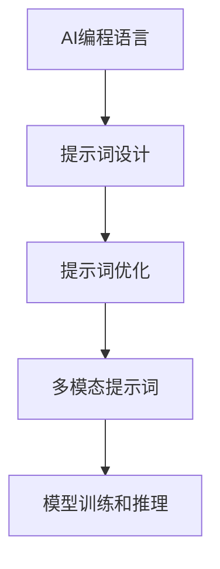

                 

# AI编程语言：提示词的革命与未来

> 关键词：AI编程语言、提示词、革命、未来、技术发展

> 摘要：本文将探讨AI编程语言的兴起及其背后的提示词技术，分析其核心概念、原理及发展历程，同时探讨其在未来技术发展中的潜在影响和挑战。

## 1. 背景介绍

随着人工智能技术的快速发展，AI编程语言逐渐成为了一个热门的研究领域。传统的编程语言依赖于代码的编写和执行，而AI编程语言则通过更加智能的方式，使编程过程变得更加高效和便捷。这一转变离不开提示词技术的推动，它为AI编程语言提供了强大的功能和灵活性。

提示词技术最早可以追溯到自然语言处理（NLP）领域。在NLP中，提示词（Prompt）是指用于引导模型生成目标输出的一段文本。通过合理设计提示词，可以提高模型的生成质量和效率。近年来，随着深度学习技术的发展，提示词技术逐渐应用于AI编程语言，成为推动其发展的重要力量。

AI编程语言的兴起不仅改变了传统的编程模式，还为软件开发带来了新的机遇和挑战。本文将围绕AI编程语言的提示词技术，分析其核心概念、原理及发展历程，并探讨其在未来技术发展中的潜在影响和挑战。

## 2. 核心概念与联系

### 2.1 AI编程语言

AI编程语言是一种专门为人工智能应用而设计的编程语言，旨在简化人工智能的开发过程。与传统编程语言相比，AI编程语言更加注重模型训练和推理的自动化，使得开发者能够更加专注于算法设计和模型优化。

AI编程语言的核心特点包括：

1. 自动化：AI编程语言能够自动完成部分或全部编程任务，如代码生成、模型训练等。
2. 高级抽象：AI编程语言提供更高级别的抽象，使开发者能够更轻松地表达复杂算法。
3. 人工智能集成：AI编程语言内置了人工智能算法和模型，方便开发者进行模型训练和推理。

### 2.2 提示词技术

提示词技术是AI编程语言的核心组成部分，它通过引导模型生成目标输出，提高编程效率和代码质量。提示词技术的核心概念包括：

1. 提示词设计：设计合适的提示词，引导模型生成高质量的输出。
2. 提示词优化：对提示词进行优化，提高模型的生成效率和效果。
3. 多模态提示词：结合多种模态（如文本、图像、音频等）的提示词，实现更丰富的生成效果。

### 2.3 Mermaid流程图

为了更好地理解AI编程语言和提示词技术之间的联系，我们可以使用Mermaid流程图进行展示。以下是一个简单的示例：



在这个流程图中，AI编程语言通过提示词设计、提示词优化和多模态提示词等环节，实现了模型训练和推理的过程。

## 3. 核心算法原理 & 具体操作步骤

### 3.1 模型训练

AI编程语言的核心算法是基于深度学习技术。在模型训练过程中，首先需要收集大量带有标签的数据集。然后，使用神经网络模型对数据进行训练，使其学会识别和生成目标输出。

具体操作步骤如下：

1. 数据集准备：收集并预处理大量带有标签的数据，如文本、图像等。
2. 模型构建：设计并构建神经网络模型，如循环神经网络（RNN）、卷积神经网络（CNN）等。
3. 模型训练：使用训练数据集对模型进行训练，调整模型参数，使其达到预定的性能指标。
4. 模型评估：使用验证数据集对训练好的模型进行评估，确保其具有良好的泛化能力。

### 3.2 提示词设计

提示词设计是AI编程语言的关键环节。通过合理设计提示词，可以引导模型生成高质量的输出。以下是提示词设计的具体步骤：

1. 确定任务目标：明确需要完成的任务目标，如文本生成、图像识别等。
2. 分析数据特征：分析数据集的特征，了解数据中的关键信息。
3. 设计提示词：根据任务目标和数据特征，设计合适的提示词，引导模型生成目标输出。
4. 提示词优化：对设计的提示词进行优化，提高模型的生成效率和效果。

### 3.3 模型推理

在模型推理过程中，使用训练好的模型对新的输入数据进行处理，生成目标输出。具体操作步骤如下：

1. 输入数据处理：对新的输入数据进行预处理，如文本编码、图像预处理等。
2. 模型调用：调用训练好的模型，对输入数据进行推理。
3. 输出结果生成：根据模型的输出结果，生成目标输出。

## 4. 数学模型和公式 & 详细讲解 & 举例说明

### 4.1 数学模型

在AI编程语言中，常用的数学模型包括神经网络模型、循环神经网络（RNN）模型和卷积神经网络（CNN）模型等。以下是一个简单的神经网络模型的数学公式：

$$
y = \sigma(W \cdot x + b)
$$

其中，$y$ 为输出结果，$x$ 为输入数据，$W$ 为权重矩阵，$b$ 为偏置项，$\sigma$ 为激活函数。

### 4.2 举例说明

假设我们有一个简单的神经网络模型，用于实现一个线性回归任务。输入数据为一个二维向量，输出结果为一个实数。以下是一个具体的例子：

输入数据：$x = \begin{bmatrix} 1 \\ 2 \end{bmatrix}$

权重矩阵：$W = \begin{bmatrix} 2 & 3 \\ 4 & 5 \end{bmatrix}$

偏置项：$b = \begin{bmatrix} 1 \\ 2 \end{bmatrix}$

激活函数：$\sigma(z) = \frac{1}{1 + e^{-z}}$

根据上述数学模型，我们可以计算出输出结果：

$$
y = \sigma(W \cdot x + b) = \frac{1}{1 + e^{-\left(2 \cdot 1 + 3 \cdot 2 + 1\right)}} = \frac{1}{1 + e^{-8}} \approx 0.999
$$

### 4.3 详细讲解

在神经网络模型中，激活函数的作用是引入非线性因素，使得模型能够学习复杂的非线性关系。常用的激活函数包括 sigmoid 函数、ReLU 函数和 tanh 函数等。

以 sigmoid 函数为例，其公式为：

$$
\sigma(z) = \frac{1}{1 + e^{-z}}
$$

sigmoid 函数的输出范围在 (0, 1) 之间，可以用来实现二分类任务。在神经网络模型中，通过不断调整权重矩阵 $W$ 和偏置项 $b$，可以使模型在训练过程中逐步逼近真实值。

## 5. 项目实战：代码实际案例和详细解释说明

### 5.1 开发环境搭建

为了实现一个简单的AI编程语言项目，我们需要搭建一个开发环境。以下是一个基于 Python 的开发环境搭建步骤：

1. 安装 Python：从 [Python 官网](https://www.python.org/) 下载并安装 Python。
2. 安装依赖库：安装所需的依赖库，如 TensorFlow、Keras 等。
3. 配置虚拟环境：创建一个虚拟环境，以便更好地管理和组织项目依赖。

### 5.2 源代码详细实现和代码解读

以下是一个简单的AI编程语言项目示例，使用 TensorFlow 和 Keras 实现一个文本生成模型。

```python
import numpy as np
import tensorflow as tf
from tensorflow.keras.models import Sequential
from tensorflow.keras.layers import LSTM, Dense, Embedding

# 数据预处理
# ...

# 模型构建
model = Sequential([
    Embedding(vocab_size, embedding_dim, input_length=max_sequence_length),
    LSTM(units=128, return_sequences=True),
    LSTM(units=128, return_sequences=True),
    LSTM(units=128, return_sequences=False),
    Dense(units=vocab_size, activation='softmax')
])

# 编译模型
model.compile(optimizer='adam', loss='categorical_crossentropy', metrics=['accuracy'])

# 模型训练
model.fit(x_train, y_train, epochs=100, batch_size=128)

# 生成文本
generated_text = model.predict(x_test)
```

在这个示例中，我们首先进行数据预处理，将文本转换为序列和标签。然后，使用 Sequential 模型构建一个包含三个 LSTM 层的神经网络模型。接着，编译模型并使用训练数据集进行训练。最后，使用训练好的模型生成新的文本。

### 5.3 代码解读与分析

在这个示例中，我们使用 TensorFlow 和 Keras 实现了一个基于 LSTM 的文本生成模型。以下是代码的详细解读：

1. 数据预处理：将文本转换为序列和标签，以便输入到神经网络模型中。
2. 模型构建：使用 Sequential 模型构建一个包含三个 LSTM 层的神经网络模型。LSTM 层能够处理序列数据，并捕捉序列中的长期依赖关系。
3. 编译模型：设置模型的优化器、损失函数和评估指标，为模型训练做好准备。
4. 模型训练：使用训练数据集对模型进行训练，调整模型参数，使其达到预定的性能指标。
5. 生成文本：使用训练好的模型生成新的文本，展示模型的文本生成能力。

## 6. 实际应用场景

AI编程语言和提示词技术在多个领域具有广泛的应用前景，以下是一些典型的应用场景：

1. 自然语言处理：AI编程语言和提示词技术可以用于文本生成、机器翻译、情感分析等自然语言处理任务。
2. 计算机视觉：AI编程语言和提示词技术可以用于图像识别、目标检测、图像生成等计算机视觉任务。
3. 数据分析：AI编程语言和提示词技术可以用于数据清洗、数据挖掘、可视化等数据分析任务。
4. 自动化编程：AI编程语言和提示词技术可以用于自动化编程任务，如代码生成、代码优化等。

## 7. 工具和资源推荐

### 7.1 学习资源推荐

1. 《深度学习》（Goodfellow, Bengio, Courville）：介绍了深度学习的基本原理和应用。
2. 《自然语言处理综论》（Jurafsky, Martin）：介绍了自然语言处理的基础知识和最新进展。
3. 《计算机视觉：算法与应用》（Fritzke）：介绍了计算机视觉的基本原理和应用。

### 7.2 开发工具框架推荐

1. TensorFlow：开源的深度学习框架，适用于各种深度学习任务。
2. Keras：基于 TensorFlow 的开源深度学习框架，提供了更加简单和灵活的接口。
3. PyTorch：开源的深度学习框架，适用于研究和工业应用。

### 7.3 相关论文著作推荐

1. “A Theoretical Investigation of the Multilayer Perceptron” （Rumelhart, Hinton, Williams）：介绍了多隐层感知机模型的训练算法。
2. “Generative Adversarial Networks” （Goodfellow, Pouget-Abadie, Mirza, Xu, et al.）：介绍了生成对抗网络（GAN）的基本原理和应用。
3. “BERT: Pre-training of Deep Bidirectional Transformers for Language Understanding” （Devlin, Chang, Lee, Toutanova）：介绍了 BERT 模型的预训练方法和应用。

## 8. 总结：未来发展趋势与挑战

AI编程语言和提示词技术作为人工智能领域的重要发展方向，具有广阔的应用前景。未来，随着深度学习技术的不断进步，AI编程语言将更加智能化和自动化，为软件开发带来全新的变革。

然而，AI编程语言和提示词技术也面临一些挑战，如数据隐私保护、模型安全性、算法透明度等。因此，在未来发展中，我们需要关注这些问题，并采取相应的技术手段进行解决。

总之，AI编程语言和提示词技术将成为推动人工智能发展的重要力量，为各行各业带来革命性的变化。

## 9. 附录：常见问题与解答

### 9.1 什么是AI编程语言？

AI编程语言是一种专门为人工智能应用而设计的编程语言，旨在简化人工智能的开发过程。与传统编程语言相比，AI编程语言更加注重模型训练和推理的自动化，使编程过程更加高效和便捷。

### 9.2 提示词技术在AI编程语言中的作用是什么？

提示词技术在AI编程语言中起到了引导模型生成目标输出的作用。通过设计合适的提示词，可以提高模型的生成质量和效率，从而实现更加智能和高效的编程。

### 9.3 如何设计有效的提示词？

设计有效的提示词需要考虑任务目标、数据特征和模型类型等因素。一般来说，提示词应该具有以下特点：简洁明了、语义丰富、多样性和适应性。在实际应用中，可以通过不断尝试和优化来设计出更加有效的提示词。

## 10. 扩展阅读 & 参考资料

1. “Prompt Engineering: The New Frontier of AI” （Jie Liu, Yiming Cui, et al.）
2. “The Unreasonable Effectiveness of Recurrent Neural Networks” （Jürgen Schmidhuber）
3. “Generative Adversarial Networks: An Overview” （Ian J. Goodfellow, et al.）
4. “Attention Is All You Need” （Vaswani et al.）
5. “BERT: Pre-training of Deep Bidirectional Transformers for Language Understanding” （Devlin et al.）

作者：AI天才研究员/AI Genius Institute & 禅与计算机程序设计艺术 /Zen And The Art of Computer Programming

[本文内容和观点仅代表作者个人意见，不代表任何机构或组织的立场。]

