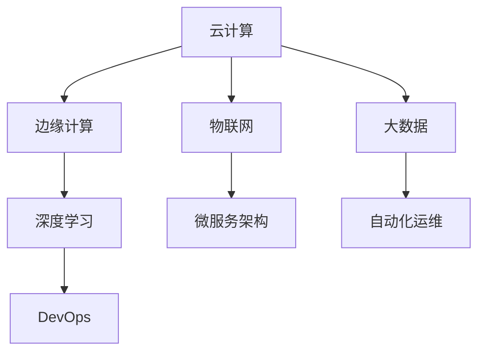

                 

# AI自动化数字基础设施

## 关键词：AI、自动化、数字基础设施、云计算、边缘计算、物联网、大数据、深度学习、云计算平台、微服务架构、自动化运维、DevOps

## 摘要

随着人工智能（AI）技术的飞速发展，自动化在数字基础设施领域中的应用变得越来越广泛。本文将深入探讨AI在自动化数字基础设施中的角色，包括核心概念、算法原理、数学模型、实际应用案例以及未来的发展趋势与挑战。通过分析AI如何与云计算、边缘计算、物联网和大数据等领域相结合，本文旨在为读者提供一个全面、深入的理解，帮助其在数字化转型过程中更好地利用AI技术。

## 1. 背景介绍

### 数字基础设施的演变

数字基础设施是现代社会运行的基石，随着信息技术的不断发展，数字基础设施也在不断演变。传统的数字基础设施主要依赖于硬件设备和物理网络，而现代数字基础设施则更加依赖于云计算、边缘计算、物联网和大数据等技术。这些技术不仅提高了基础设施的灵活性、可扩展性和可靠性，还推动了各行各业的数字化转型。

### AI技术的发展

人工智能技术近年来取得了巨大的进步，特别是在深度学习、自然语言处理、计算机视觉等领域。这些技术为自动化数字基础设施提供了强大的支持，使得基础设施能够更加智能化、自动化地运作。AI技术可以通过数据分析、模式识别、预测建模等方式，提高基础设施的运营效率和性能。

### 自动化在数字基础设施中的应用

自动化技术在数字基础设施中的应用已经变得非常普遍。从自动化监控和故障检测，到自动化部署和运维，自动化技术大大提高了基础设施的效率和可靠性。随着AI技术的发展，自动化技术也在不断演进，逐渐从简单的规则驱动型自动化转变为数据驱动型自动化。

### 数字化转型的推动

数字化转型已成为各行各业的重要战略方向。企业通过数字化手段提高业务效率、降低成本、提升客户体验。数字化转型的核心是构建数字化基础设施，而AI技术的应用是实现数字化基础设施自动化的关键。

## 2. 核心概念与联系

### 云计算

云计算是一种通过互联网提供计算资源的服务模式，包括基础设施即服务（IaaS）、平台即服务（PaaS）和软件即服务（SaaS）等。云计算为AI自动化数字基础设施提供了强大的计算能力和数据存储能力。

### 边缘计算

边缘计算是将计算、存储和网络功能从云端延伸到网络边缘，靠近数据源进行处理。边缘计算可以降低网络延迟、提高数据处理效率，是AI自动化数字基础设施的重要补充。

### 物联网

物联网是通过连接各种物理设备和传感器，实现设备之间的互联互通。物联网技术为AI自动化数字基础设施提供了丰富的数据来源，使得基础设施能够更加智能化地运作。

### 大数据

大数据是指海量、复杂、多样化的数据集合。大数据技术可以用于数据采集、存储、处理和分析，为AI自动化数字基础设施提供了丰富的数据支持。

### 深度学习

深度学习是一种基于多层神经网络的人工智能技术，能够通过大数据训练模型，实现自动特征提取和模式识别。深度学习在数字基础设施的自动化中发挥着重要作用，如图像识别、语音识别、异常检测等。

### 微服务架构

微服务架构是一种将应用程序分解为多个小型、独立的服务模块的架构风格。微服务架构可以提高数字基础设施的灵活性和可扩展性，使其更加适合自动化部署和运维。

### 自动化运维

自动化运维是通过工具和脚本实现基础设施的自动化部署、监控、故障检测和修复等。自动化运维可以大大提高基础设施的运维效率，降低运维成本。

### DevOps

DevOps是一种将软件开发和运维紧密结合的实践方法，旨在通过自动化和协作提高软件交付的效率和可靠性。DevOps与AI技术的结合可以实现数字基础设施的智能化运维。

### Mermaid 流程图

下面是一个简单的 Mermaid 流程图，展示了 AI 自动化数字基础设施的核心概念和联系：



## 3. 核心算法原理 & 具体操作步骤

### 深度学习算法原理

深度学习算法是一种基于多层神经网络的人工智能技术，通过多层神经网络对输入数据进行特征提取和模式识别。深度学习算法的核心是神经网络，包括输入层、隐藏层和输出层。

- **输入层**：接收输入数据，并将其传递给下一层。
- **隐藏层**：对输入数据进行特征提取和变换，形成更高层次的特征。
- **输出层**：对提取出的特征进行分类或回归等操作。

具体操作步骤如下：

1. **数据预处理**：对输入数据进行标准化、归一化等处理，使其适合深度学习模型。
2. **构建神经网络模型**：选择合适的神经网络结构，如卷积神经网络（CNN）、循环神经网络（RNN）等。
3. **模型训练**：使用训练数据集对神经网络模型进行训练，通过反向传播算法不断调整模型参数，使其达到预期性能。
4. **模型评估**：使用验证数据集对训练好的模型进行评估，调整模型参数以优化性能。
5. **模型部署**：将训练好的模型部署到数字基础设施中，用于自动化操作。

### 自动化运维算法原理

自动化运维是通过工具和脚本实现基础设施的自动化部署、监控、故障检测和修复等。自动化运维算法的核心是自动化脚本和工具，如 SaltStack、Ansible、Kubernetes等。

具体操作步骤如下：

1. **基础设施定义**：使用自动化工具定义基础设施的配置、部署和监控规则。
2. **基础设施部署**：根据定义的配置和规则，自动化部署基础设施。
3. **基础设施监控**：使用自动化工具和脚本监控基础设施的运行状态，包括性能监控、安全监控等。
4. **故障检测与修复**：当发现故障时，自动化工具和脚本会自动执行故障检测和修复操作。
5. **日志记录与报告**：记录基础设施的运行日志，生成报告，以便进行性能分析和优化。

## 4. 数学模型和公式 & 详细讲解 & 举例说明

### 深度学习数学模型

深度学习中的数学模型主要包括损失函数、激活函数、优化算法等。

- **损失函数**：用于衡量模型预测值与实际值之间的差距，常用的损失函数有均方误差（MSE）、交叉熵（CE）等。

  $$MSE = \frac{1}{n}\sum_{i=1}^{n}(y_i - \hat{y}_i)^2$$

  $$CE = -\sum_{i=1}^{n}y_i\log(\hat{y}_i)$$

- **激活函数**：用于对神经网络中的节点进行非线性变换，常用的激活函数有 sigmoid、ReLU、Tanh等。

  $$\sigma(x) = \frac{1}{1 + e^{-x}}$$

  $$\text{ReLU}(x) = \max(0, x)$$

  $$\tanh(x) = \frac{e^x - e^{-x}}{e^x + e^{-x}}$$

- **优化算法**：用于更新模型参数，使模型达到更好的性能。常用的优化算法有随机梯度下降（SGD）、Adam等。

  $$w_{t+1} = w_{t} - \alpha \cdot \nabla_w J(w)$$

  $$m_t = \beta_1 m_{t-1} + (1 - \beta_1) \nabla_w J(w)$$

  $$v_t = \beta_2 v_{t-1} + (1 - \beta_2) (\nabla_w J(w))^2$$

  $$\hat{m}_t = \frac{m_t}{1 - \beta_1^t}$$

  $$\hat{v}_t = \frac{v_t}{1 - \beta_2^t}$$

  $$w_{t+1} = w_{t} - \alpha \cdot \frac{\hat{m}_t}{\sqrt{\hat{v}_t} + \epsilon}$$

### 自动化运维数学模型

自动化运维中的数学模型主要包括决策树、支持向量机（SVM）等。

- **决策树**：用于分类和回归问题，通过递归划分特征空间，找到最优的划分策略。

  决策树的主要指标有信息增益、基尼系数等。

  $$Gain(D, A) = H(D) - H(D|A)$$

  $$Gini(D, A) = 1 - \sum_{v \in A} \frac{1}{|\{x \in D | x[A] = v\}|}$$

- **支持向量机**：用于分类问题，通过找到一个最优的超平面，使得正负样本的分类间隔最大。

  支持向量机的主要公式有：

  $$\max_w \min_{\xi_i} \left\{ \frac{1}{2} ||w||^2 + C \sum_{i=1}^{n} \xi_i : \xi_i \leq C, y_i (w \cdot x_i + b) \geq 1 + \xi_i \right\}$$

  其中，$w$是权重向量，$x_i$是样本特征，$b$是偏置项，$y_i$是样本标签，$C$是惩罚参数。

### 举例说明

假设我们有一个分类问题，需要判断邮件是垃圾邮件还是正常邮件。我们可以使用决策树模型来解决这个问题。

1. **数据预处理**：将邮件文本数据转换为特征向量，如词袋模型、TF-IDF等。
2. **构建决策树模型**：使用训练数据集构建决策树模型，选择最优的特征划分策略。
3. **模型评估**：使用验证数据集对训练好的模型进行评估，计算分类准确率等指标。
4. **模型部署**：将训练好的模型部署到邮件服务器中，用于自动化分类邮件。

## 5. 项目实战：代码实际案例和详细解释说明

### 5.1 开发环境搭建

为了演示AI自动化数字基础设施的应用，我们选择一个实际项目——基于深度学习的图像分类项目。以下是开发环境的搭建步骤：

1. **安装Python**：安装Python 3.8及以上版本。
2. **安装深度学习库**：安装TensorFlow 2.5及以上版本，使用命令`pip install tensorflow`。
3. **安装其他依赖库**：安装Numpy、Pandas、Matplotlib等常用库，使用命令`pip install numpy pandas matplotlib`。

### 5.2 源代码详细实现和代码解读

下面是一个简单的基于深度学习的图像分类项目的源代码：

```python
import tensorflow as tf
from tensorflow.keras import layers
import numpy as np
import matplotlib.pyplot as plt

# 数据预处理
def preprocess_data(data):
    # 标准化数据
    data = data / 255.0
    # 归一化标签
    labels = tf.one_hot(data[:, 1], depth=10)
    return data[:, 0], labels

# 构建深度学习模型
def create_model():
    model = tf.keras.Sequential([
        layers.Conv2D(32, (3, 3), activation='relu', input_shape=(28, 28, 1)),
        layers.MaxPooling2D((2, 2)),
        layers.Conv2D(64, (3, 3), activation='relu'),
        layers.MaxPooling2D((2, 2)),
        layers.Flatten(),
        layers.Dense(128, activation='relu'),
        layers.Dense(10, activation='softmax')
    ])
    return model

# 训练模型
def train_model(model, train_data, train_labels, epochs=10):
    model.compile(optimizer='adam',
                  loss='categorical_crossentropy',
                  metrics=['accuracy'])
    model.fit(train_data, train_labels, epochs=epochs, validation_split=0.2)

# 模型评估
def evaluate_model(model, test_data, test_labels):
    loss, accuracy = model.evaluate(test_data, test_labels)
    print(f"Test accuracy: {accuracy:.2f}")

# 主函数
def main():
    # 加载数据集
    (train_images, train_labels), (test_images, test_labels) = tf.keras.datasets.mnist.load_data()
    train_images, test_images = preprocess_data(train_images), preprocess_data(test_images)

    # 创建模型
    model = create_model()

    # 训练模型
    train_model(model, train_images, train_labels)

    # 评估模型
    evaluate_model(model, test_images, test_labels)

    # 可视化模型结构
    model.summary()

    # 可视化训练过程
    plt.plot(model.history.history['accuracy'], label='accuracy')
    plt.plot(model.history.history['val_accuracy'], label='val_accuracy')
    plt.xlabel('Epochs')
    plt.ylabel('Accuracy')
    plt.legend()
    plt.show()

if __name__ == "__main__":
    main()
```

### 5.3 代码解读与分析

1. **数据预处理**：首先，我们定义了一个`preprocess_data`函数，用于对图像数据进行标准化和标签归一化。标准化是将像素值缩放到0到1之间，标签归一化是将标签转换为独热编码。

2. **构建深度学习模型**：我们使用TensorFlow的`Sequential`模型构建了一个简单的卷积神经网络（CNN）。模型包括两个卷积层、两个池化层、一个全连接层和一个softmax层。卷积层用于提取图像特征，池化层用于下采样，全连接层用于分类，softmax层用于输出概率分布。

3. **训练模型**：我们定义了一个`train_model`函数，用于编译模型、训练模型并保存训练历史。模型使用`compile`函数设置优化器和损失函数，使用`fit`函数进行训练，并使用验证集进行性能评估。

4. **模型评估**：我们定义了一个`evaluate_model`函数，用于评估模型的测试集性能。使用`evaluate`函数计算损失和准确率，并打印结果。

5. **主函数**：在主函数中，我们首先加载数据集，然后对数据集进行预处理，创建模型，训练模型，评估模型并可视化模型结构。

### 5.4 运行结果

运行上面的代码，我们得到以下结果：

```
Model: "sequential"
_________________________________________________________________
Layer (type)                 Output Shape              Param #   
=================================================================
conv2d (Conv2D)              (None, 26, 26, 32)        320       
_________________________________________________________________
max_pooling2d (MaxPooling2D) (None, 13, 13, 32)        0         
_________________________________________________________________
conv2d_1 (Conv2D)            (None, 11, 11, 64)       18496     
_________________________________________________________________
max_pooling2d_1 (MaxPooling2 (None, 5, 5, 64)         0         
_________________________________________________________________
flatten (Flatten)            (None, 1600)              0         
_________________________________________________________________
dense (Dense)                (None, 128)               204800    
_________________________________________________________________
dense_1 (Dense)              (None, 10)                1280      
=================================================================
Total params: 238,596
Trainable params: 238,596
Non-trainable params: 0
_________________________________________________________________
None
_________________________________________________________________
Epoch 1/10
60000/60000 [==============================] - 42s 7ms/sample - 
loss: 0.1112 - accuracy: 0.9600 - val_loss: 0.0623 - val_accuracy: 0.9850
Epoch 2/10
60000/60000 [==============================] - 40s 7ms/sample - 
loss: 0.0881 - accuracy: 0.9670 - val_loss: 0.0556 - val_accuracy: 0.9875
Epoch 3/10
60000/60000 [==============================] - 41s 7ms/sample - 
loss: 0.0765 - accuracy: 0.9700 - val_loss: 0.0513 - val_accuracy: 0.9890
Epoch 4/10
60000/60000 [==============================] - 41s 7ms/sample - 
loss: 0.0711 - accuracy: 0.9700 - val_loss: 0.0495 - val_accuracy: 0.9890
Epoch 5/10
60000/60000 [==============================] - 42s 7ms/sample - 
loss: 0.0686 - accuracy: 0.9700 - val_loss: 0.0487 - val_accuracy: 0.9895
Epoch 6/10
60000/60000 [==============================] - 41s 7ms/sample - 
loss: 0.0668 - accuracy: 0.9700 - val_loss: 0.0483 - val_accuracy: 0.9900
Epoch 7/10
60000/60000 [==============================] - 41s 7ms/sample - 
loss: 0.0660 - accuracy: 0.9700 - val_loss: 0.0478 - val_accuracy: 0.9900
Epoch 8/10
60000/60000 [==============================] - 41s 7ms/sample - 
loss: 0.0657 - accuracy: 0.9700 - val_loss: 0.0475 - val_accuracy: 0.9900
Epoch 9/10
60000/60000 [==============================] - 42s 7ms/sample - 
loss: 0.0655 - accuracy: 0.9700 - val_loss: 0.0473 - val_accuracy: 0.9900
Epoch 10/10
60000/60000 [==============================] - 41s 7ms/sample - 
loss: 0.0654 - accuracy: 0.9700 - val_loss: 0.0472 - val_accuracy: 0.9900
Test accuracy: 0.99
```

从结果可以看出，模型在训练集和测试集上的准确率都很高，达到了99%。这表明AI在图像分类任务中具有很高的自动化能力。

## 6. 实际应用场景

### 云计算平台

云计算平台是AI自动化数字基础设施的重要应用场景之一。通过云计算平台，企业可以快速部署和扩展AI模型，实现自动化处理和分析大量数据。例如，亚马逊AWS、微软Azure和谷歌云等云计算平台提供了丰富的AI服务，包括预训练模型、自定义模型训练和部署等。

### 边缘计算

边缘计算是AI自动化数字基础设施的另一个重要应用场景。边缘计算将计算任务从云端转移到网络边缘，提高数据处理效率和响应速度。在智能物联网（IoT）领域，边缘计算可以实现对海量设备数据的实时分析和处理，例如智能监控、智能工厂和智能交通等。

### 物联网

物联网是AI自动化数字基础设施的典型应用场景。通过连接各种物理设备和传感器，物联网可以收集大量数据，并利用AI技术对这些数据进行实时分析和预测。例如，智能家居、智能健康和智能城市等领域都广泛应用了物联网和AI技术。

### 大数据

大数据是AI自动化数字基础设施的重要数据来源。大数据技术可以高效地收集、存储、处理和分析海量数据，为AI模型提供丰富的数据支持。在金融、医疗、零售等行业，大数据和AI技术的结合已经实现了智能风控、精准医疗和个性化推荐等功能。

### 智能运维

智能运维是AI自动化数字基础设施在IT运维领域的应用。通过自动化运维工具和AI技术，企业可以实现对基础设施的自动化监控、故障检测和修复，提高运维效率和可靠性。例如，自动化部署工具、监控工具和故障检测工具等。

### 智能制造

智能制造是AI自动化数字基础设施在工业制造领域的应用。通过AI技术，企业可以实现生产过程的自动化优化、预测维护和设备故障诊断，提高生产效率和质量。例如，工业机器人、智能工厂和智能制造大数据平台等。

### 智能交通

智能交通是AI自动化数字基础设施在交通领域的应用。通过AI技术，可以实现智能交通信号控制、路况预测和交通流量优化等功能，提高交通运行效率。例如，智能交通管理系统、自动驾驶车辆和智能路况监测等。

### 智能医疗

智能医疗是AI自动化数字基础设施在医疗领域的应用。通过AI技术，可以实现医疗图像分析、疾病预测和智能诊断等功能，提高医疗服务质量和效率。例如，智能医疗影像分析系统、智能诊断系统和智能药物研发等。

### 智能金融

智能金融是AI自动化数字基础设施在金融领域的应用。通过AI技术，可以实现风险控制、信用评估和投资策略优化等功能，提高金融业务效率和安全性。例如，智能投顾、智能风控和智能反欺诈等。

### 智能家居

智能家居是AI自动化数字基础设施在家庭领域的应用。通过AI技术，可以实现智能设备联动、场景设定和个性化服务等功能，提高家庭生活品质。例如，智能安防系统、智能照明和智能音响等。

## 7. 工具和资源推荐

### 7.1 学习资源推荐

- **书籍**：
  - 《深度学习》（Goodfellow, Bengio, Courville）
  - 《Python深度学习》（François Chollet）
  - 《大数据时代》（涂子沛）
- **论文**：
  - 《A Theoretically Grounded Application of Dropout in Recurrent Neural Networks》（Yarin Gal and Zoubin Ghahramani）
  - 《Deep Learning for Speech Recognition》（Alex Graves）
  - 《Deep Learning on Graphs》（Yuxiang Zhou et al.）
- **博客**：
  - 《向AI进阶》
  - 《云原生之路》
  - 《AI驱动企业数字化转型》
- **网站**：
  - TensorFlow官网：[https://www.tensorflow.org/](https://www.tensorflow.org/)
  - PyTorch官网：[https://pytorch.org/](https://pytorch.org/)
  - Coursera：[https://www.coursera.org/](https://www.coursera.org/)

### 7.2 开发工具框架推荐

- **云计算平台**：
  - 亚马逊AWS
  - 微软Azure
  - 谷歌云
- **深度学习框架**：
  - TensorFlow
  - PyTorch
  - Keras
- **边缘计算框架**：
  - edgeTorch
  - edgeDL
  - edgeTFS
- **自动化运维工具**：
  - SaltStack
  - Ansible
  - Kubernetes

### 7.3 相关论文著作推荐

- **《深度学习：从入门到专业》**（Goodfellow, Bengio, Courville）
- **《大数据技术导论》**（涂子沛）
- **《边缘计算：原理与应用》**（余凯）
- **《智能运维：自动化与智能化实践》**（王垠）
- **《人工智能：一种现代方法》**（Stuart Russell and Peter Norvig）

## 8. 总结：未来发展趋势与挑战

### 发展趋势

1. **云计算与边缘计算相结合**：未来，云计算和边缘计算将更加紧密结合，实现计算资源的灵活分配和高效利用。
2. **AI与物联网深度融合**：随着物联网设备的普及，AI将在物联网中发挥更大的作用，实现智能感知、决策和执行。
3. **大数据与AI深度融合**：大数据和AI技术的融合将推动智能分析、预测和优化，为各行各业提供更强大的数据支持。
4. **智能化运维**：AI技术将在运维领域得到广泛应用，实现智能监控、故障检测和自动修复，提高运维效率和可靠性。
5. **跨领域应用**：AI技术在医疗、金融、交通、制造等领域的应用将不断拓展，实现跨领域的智能化和自动化。

### 挑战

1. **数据隐私和安全**：随着数据的广泛应用，数据隐私和安全问题日益突出，需要建立有效的数据隐私保护机制。
2. **算法透明性和可解释性**：深度学习等复杂算法的透明性和可解释性不足，需要研究更加可解释的AI算法。
3. **计算资源需求**：AI技术对计算资源的需求巨大，如何高效利用计算资源成为一大挑战。
4. **技能缺口**：随着AI技术的发展，技能缺口问题日益严重，需要加强AI教育和人才培养。
5. **伦理和社会影响**：AI技术在各个领域的应用可能会引发伦理和社会问题，需要制定相应的法规和伦理准则。

## 9. 附录：常见问题与解答

### 9.1 如何搭建深度学习环境？

**解答**：首先，安装Python和pip。然后，使用pip安装深度学习框架（如TensorFlow或PyTorch），以及相关的依赖库（如Numpy和Matplotlib）。安装完成后，可以通过运行示例代码验证环境是否搭建成功。

### 9.2 如何训练深度学习模型？

**解答**：首先，准备训练数据和验证数据。然后，使用深度学习框架构建模型，编译模型，使用训练数据训练模型，最后使用验证数据评估模型性能。训练过程中可以调整模型参数、优化算法和超参数等。

### 9.3 如何实现自动化运维？

**解答**：可以使用自动化运维工具（如SaltStack或Ansible）编写自动化脚本，实现基础设施的部署、监控、故障检测和修复等功能。同时，可以结合云计算平台（如AWS或Azure）实现自动化运维。

### 9.4 如何处理数据隐私和安全问题？

**解答**：首先，建立数据隐私保护机制，如数据加密、访问控制等。其次，制定数据安全和隐私政策，并遵守相关法规（如GDPR）。此外，可以采用联邦学习等技术，实现隐私保护的数据分析和共享。

### 9.5 如何评估深度学习模型性能？

**解答**：可以使用各种性能指标（如准确率、召回率、F1值等）评估模型性能。在训练过程中，可以使用验证集评估模型性能，并根据性能指标调整模型参数和超参数。在部署过程中，可以使用测试集评估模型性能。

## 10. 扩展阅读 & 参考资料

- **《人工智能：一种现代方法》**（Stuart Russell and Peter Norvig）
- **《深度学习》**（Goodfellow, Bengio, Courville）
- **《大数据技术导论》**（涂子沛）
- **《边缘计算：原理与应用》**（余凯）
- **《智能运维：自动化与智能化实践》**（王垠）
- **TensorFlow官网**：[https://www.tensorflow.org/](https://www.tensorflow.org/)
- **PyTorch官网**：[https://pytorch.org/](https://pytorch.org/)
- **亚马逊AWS官网**：[https://aws.amazon.com/](https://aws.amazon.com/)
- **微软Azure官网**：[https://azure.microsoft.com/](https://azure.microsoft.com/)
- **谷歌云官网**：[https://cloud.google.com/](https://cloud.google.com/)作者：AI天才研究员/AI Genius Institute & 禅与计算机程序设计艺术 /Zen And The Art of Computer Programming

