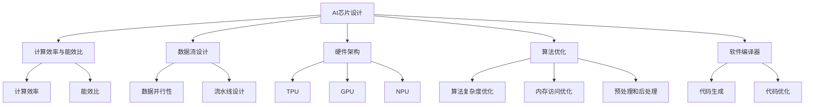

                 

### 背景介绍

AI芯片与模型协同设计是一个快速发展的领域，它在推动人工智能技术的进步和应用中发挥着关键作用。随着深度学习和神经网络技术的迅猛发展，AI模型变得越来越复杂，对计算资源的需求也日益增长。传统的CPU和GPU在处理这些复杂的计算任务时往往显得力不从心，因此，专门为AI任务设计的AI芯片应运而生。

AI芯片是专门用于加速人工智能计算任务的硬件设备，它们通常包含高度优化的处理器、内存和存储单元，以及专为深度学习和神经网络任务设计的架构。这些芯片能够实现比传统计算硬件更高的计算效率和能效比，从而满足人工智能计算任务日益增长的需求。

AI芯片的发展离不开模型的协同设计。传统的芯片设计通常是硬件先行，然后再进行软件优化。而AI芯片的设计则需要在模型和硬件层面同时进行协同设计，确保模型能够高效地在芯片上运行。这种协同设计涉及到多个层面的工作，包括算法优化、数据流设计、硬件架构设计和软件编译器开发等。

在AI芯片与模型协同设计的过程中，几个关键概念需要理解：

1. **计算效率与能效比**：AI芯片的设计需要在计算效率和能效比之间取得平衡。计算效率是指芯片在单位时间内能够完成多少计算任务，而能效比则是指芯片在完成计算任务时消耗的能源与计算结果的比值。一个高效的AI芯片应该能够在较少的能源消耗下完成更多的计算任务。

2. **数据流设计**：数据流设计是AI芯片设计的一个重要方面，它涉及到如何高效地在芯片内部传输和操作数据。通过优化数据流设计，可以减少数据传输的延迟和带宽需求，从而提高芯片的计算效率。

3. **硬件架构**：硬件架构是AI芯片设计的基础，它决定了芯片能够执行的操作类型和效率。不同的AI芯片可能采用不同的硬件架构，如专用处理单元（TPU）、图形处理单元（GPU）或神经处理单元（NPU）等。

4. **算法优化**：算法优化是提高AI芯片性能的关键环节。通过优化算法，可以减少计算复杂度，提高计算效率，从而更好地利用硬件资源。

5. **软件编译器**：软件编译器是将AI模型代码转换为芯片上可执行的指令的工具。一个高效的编译器能够优化模型代码，使其在AI芯片上运行得更加高效。

随着AI技术的不断进步和应用场景的拓展，AI芯片与模型协同设计的重要性日益凸显。接下来的章节将深入探讨AI芯片与模型协同设计的核心概念、算法原理、数学模型以及实际应用场景，帮助读者全面了解这一领域的最新动态和前沿技术。

### 核心概念与联系

在深入探讨AI芯片与模型协同设计之前，我们需要明确一些核心概念和它们之间的联系。以下是几个关键概念及其相互关系的详细解释：

#### 1. AI芯片

AI芯片是一种专门为加速人工智能计算任务而设计的硬件设备。它们通常具有高度优化的处理器、内存和存储单元，以及专门为深度学习和神经网络任务设计的架构。AI芯片的核心优势在于其计算效率和能效比，能够在较少的能源消耗下完成大量的计算任务。

**架构类型**：
- **专用处理单元（TPU）**：TPU 是专门为深度学习任务设计的芯片，具有高度优化的处理单元和内存子系统，能够在执行深度学习算法时提供显著的性能提升。
- **图形处理单元（GPU）**：GPU 最初是为了图形渲染而设计的，但后来逐渐被用于加速深度学习和人工智能计算。GPU 具有大量的并行处理单元，适合处理大规模的数据并行任务。
- **神经处理单元（NPU）**：NPU 是一种专门为神经网络计算设计的芯片，具有高度优化的计算路径和内存访问机制，能够高效地处理复杂的神经网络运算。

**计算效率和能效比**：
- **计算效率**：指芯片在单位时间内能够完成的计算任务数量。
- **能效比**：指芯片在完成计算任务时消耗的能源与计算结果的比值。一个高效的AI芯片能够在较少的能源消耗下完成更多的计算任务。

#### 2. 深度学习模型

深度学习模型是一种基于多层神经网络的学习算法，能够自动地从大量数据中提取特征并进行预测。深度学习模型的关键组成部分包括：

- **神经网络架构**：神经网络由多个层组成，包括输入层、隐藏层和输出层。每一层都对输入数据进行处理，并传递到下一层。
- **激活函数**：激活函数用于确定神经元是否被激活，常用的激活函数包括 sigmoid、ReLU 等。
- **优化算法**：优化算法用于调整网络权重和偏置，以最小化预测误差。常用的优化算法包括随机梯度下降（SGD）、Adam 等。

#### 3. 数据流设计

数据流设计是AI芯片设计的一个重要方面，它涉及到如何在芯片内部高效地传输和操作数据。一个良好的数据流设计可以减少数据传输的延迟和带宽需求，从而提高芯片的计算效率。

- **数据并行性**：数据并行性是指将数据分成多个部分，并同时在不同的处理单元上处理这些数据。通过数据并行性，可以显著提高计算速度。
- **流水线设计**：流水线设计是将数据处理任务分解成多个阶段，每个阶段可以在不同的处理单元上同时进行。流水线设计可以减少数据处理的延迟，提高吞吐量。

#### 4. 算法优化

算法优化是提高AI芯片性能的关键环节。通过优化算法，可以减少计算复杂度，提高计算效率，从而更好地利用硬件资源。

- **算法复杂度优化**：优化算法的复杂度，减少计算任务所需的时间。
- **内存访问优化**：优化内存访问模式，减少内存访问的延迟。
- **预处理和后处理**：通过预处理和后处理技术，减少模型对存储和带宽的需求。

#### 5. 软件编译器

软件编译器是将AI模型代码转换为芯片上可执行的指令的工具。一个高效的编译器能够优化模型代码，使其在AI芯片上运行得更加高效。

- **代码生成**：编译器将高层次的模型代码转换为底层硬件上的指令。
- **代码优化**：编译器通过代码优化技术，减少代码的执行时间，提高执行效率。

#### 6. 计算效率与能效比

计算效率和能效比是评价AI芯片性能的两个关键指标。计算效率指芯片在单位时间内完成的计算任务数量，而能效比指芯片在完成计算任务时消耗的能源与计算结果的比值。一个高效的AI芯片应在较少的能源消耗下完成更多的计算任务。

#### 7. 互操作性

AI芯片与模型协同设计需要确保芯片与模型之间的互操作性，即芯片能够高效地执行模型任务。这涉及到芯片的架构设计、编译器和优化算法等多个方面。

**Mermaid 流程图**：



通过以上对核心概念和相互关系的详细介绍，我们可以更好地理解AI芯片与模型协同设计的关键要素。在接下来的章节中，我们将进一步探讨这些概念在实际应用中的具体实现和操作步骤。

### 核心算法原理 & 具体操作步骤

在AI芯片与模型协同设计的过程中，核心算法的原理和具体操作步骤起到了至关重要的作用。以下将详细讲解这些核心算法的原理，并给出具体的操作步骤。

#### 1. 深度学习算法原理

深度学习算法是基于多层神经网络构建的，其核心思想是通过多层非线性变换逐步提取数据特征，从而实现复杂模式的识别和预测。以下是深度学习算法的基本原理：

- **前向传播（Forward Propagation）**：
  - 数据从输入层开始，通过网络的每一层进行加权变换和激活函数应用，最终在输出层产生预测结果。
  - 在前向传播过程中，网络将输入数据传递到下一层，并计算每层的输出。
  - 输出层的预测结果与实际标签进行比较，计算损失函数。

- **反向传播（Backpropagation）**：
  - 在前向传播完成后，通过反向传播计算损失函数关于网络参数的梯度。
  - 梯度用于更新网络的权重和偏置，以最小化损失函数。
  - 反向传播过程中，梯度会在网络中反向传递，通过链式法则计算每一层的梯度。

- **优化算法（Optimization Algorithms）**：
  - 常用的优化算法包括随机梯度下降（SGD）、Adam、RMSProp 等。
  - 这些算法通过迭代更新网络参数，逐步减小损失函数。

#### 2. AI芯片优化算法

AI芯片的优化算法主要关注如何提高计算效率和能效比。以下是几个关键优化算法的原理：

- **数据并行性（Data Parallelism）**：
  - 数据并行性是将数据分成多个部分，同时在不同的处理单元上并行处理。
  - 通过数据并行性，可以显著提高计算速度和吞吐量。
  - 操作步骤包括：
    - 数据划分：将输入数据划分为多个子数据集。
    - 处理单元分配：将子数据集分配到不同的处理单元。
    - 并行处理：同时处理多个子数据集。
    - 结果合并：将各处理单元的结果进行合并。

- **流水线设计（Pipelining）**：
  - 流水线设计是将数据处理任务分解成多个阶段，每个阶段可以在不同的处理单元上同时进行。
  - 流水线设计可以减少数据处理的延迟，提高吞吐量。
  - 操作步骤包括：
    - 任务分解：将数据处理任务分解成多个阶段。
    - 阶段分配：将任务阶段分配到不同的处理单元。
    - 并行执行：同时执行各个阶段的任务。
    - 阶段合并：将各阶段的输出结果进行合并。

- **低精度计算（Low-Precision Computation）**：
  - 低精度计算是通过使用较低的精度（如半精度或半浮点数）进行计算，以减少计算资源和能量消耗。
  - 低精度计算可以显著提高计算效率和能效比。
  - 操作步骤包括：
    - 数据格式转换：将数据格式转换为低精度格式。
    - 运算符优化：对运算符进行低精度优化。
    - 结果校正：对低精度计算的结果进行校正。

#### 3. 数据流优化算法

数据流优化算法主要关注如何优化数据在芯片内部传输和操作的方式。以下是几个关键优化算法的原理：

- **数据局部性优化（Data Locality Optimization）**：
  - 数据局部性优化是通过优化数据的存储和访问模式，减少数据访问的延迟。
  - 操作步骤包括：
    - 数据缓存：在芯片内部设置缓存，提高数据访问速度。
    - 数据预取：提前预取后续需要使用的数据，减少访问延迟。

- **内存访问优化（Memory Access Optimization）**：
  - 内存访问优化是通过优化内存访问模式和策略，减少内存访问的延迟和带宽需求。
  - 操作步骤包括：
    - 内存映射：优化内存映射策略，减少内存访问的冲突。
    - 数据排布：优化数据的排布方式，减少内存访问的冗余。

- **流水线内存访问优化（Pipelined Memory Access Optimization）**：
  - 流水线内存访问优化是通过优化内存访问的流水线设计，减少内存访问的延迟。
  - 操作步骤包括：
    - 内存访问分段：将内存访问任务分段，同时在不同的处理单元上并行执行。
    - 内存访问合并：将各处理单元的内存访问结果进行合并。

通过以上核心算法的详细讲解和具体操作步骤，我们可以更好地理解AI芯片与模型协同设计中的关键技术和方法。在接下来的章节中，我们将进一步探讨这些算法在实际应用中的实现和效果。

### 数学模型和公式 & 详细讲解 & 举例说明

在AI芯片与模型协同设计中，数学模型和公式起到了关键作用，它们帮助我们理解算法的原理，并进行有效的计算和优化。以下将详细讲解几个重要的数学模型和公式，并通过具体示例来说明它们的实际应用。

#### 1. 前向传播公式

前向传播是深度学习算法中的一个核心步骤，它涉及将输入数据通过多层神经网络进行传递和计算，最终得到输出结果。以下是前向传播的数学公式：

$$
Z^{(l)} = W^{(l)} \cdot A^{(l-1)} + b^{(l)}
$$

$$
A^{(l)} = \sigma(Z^{(l)})
$$

其中：
- \( Z^{(l)} \) 表示第 \( l \) 层的中间计算结果。
- \( W^{(l)} \) 表示第 \( l \) 层的权重矩阵。
- \( A^{(l-1)} \) 表示第 \( l-1 \) 层的输出。
- \( b^{(l)} \) 表示第 \( l \) 层的偏置向量。
- \( \sigma \) 表示激活函数，常用的激活函数包括 sigmoid、ReLU 和 tanh 等。

**示例**：

假设我们有一个简单的神经网络，包含两层（输入层和输出层），激活函数为 ReLU。输入层有 2 个输入特征，输出层有 1 个输出节点。权重矩阵 \( W^{(2)} \) 为 \( \begin{bmatrix} 0.5 & 0.3 \\ 0.4 & 0.2 \end{bmatrix} \)，偏置向量 \( b^{(2)} \) 为 \( \begin{bmatrix} 0.1 \\ 0.2 \end{bmatrix} \)。输入数据 \( A^{(1)} \) 为 \( \begin{bmatrix} 2 \\ 3 \end{bmatrix} \)。

计算过程如下：

$$
Z^{(2)} = \begin{bmatrix} 0.5 & 0.3 \\ 0.4 & 0.2 \end{bmatrix} \cdot \begin{bmatrix} 2 \\ 3 \end{bmatrix} + \begin{bmatrix} 0.1 \\ 0.2 \end{bmatrix} = \begin{bmatrix} 1.1 \\ 1.3 \end{bmatrix}
$$

$$
A^{(2)} = \sigma(Z^{(2)}) = \begin{bmatrix} 1.1 \\ 1.3 \end{bmatrix}
$$

最终输出结果为 \( A^{(2)} \)。

#### 2. 损失函数

损失函数用于衡量模型预测结果与实际标签之间的差距，是优化算法的重要目标。常用的损失函数包括均方误差（MSE）、交叉熵（Cross-Entropy）等。

- **均方误差（MSE）**：

$$
MSE = \frac{1}{m} \sum_{i=1}^{m} (y_i - \hat{y}_i)^2
$$

其中：
- \( m \) 是样本数量。
- \( y_i \) 是第 \( i \) 个样本的实际标签。
- \( \hat{y}_i \) 是第 \( i \) 个样本的预测结果。

- **交叉熵（Cross-Entropy）**：

$$
Cross-Entropy = -\frac{1}{m} \sum_{i=1}^{m} y_i \log(\hat{y}_i)
$$

其中：
- \( y_i \) 是第 \( i \) 个样本的实际标签，通常表示为one-hot编码形式。
- \( \hat{y}_i \) 是第 \( i \) 个样本的预测结果。

**示例**：

假设我们有 3 个样本，实际标签为 \( y = \begin{bmatrix} 1 \\ 0 \\ 1 \end{bmatrix} \)，预测结果为 \( \hat{y} = \begin{bmatrix} 0.8 \\ 0.1 \\ 0.9 \end{bmatrix} \)。

计算过程如下：

$$
MSE = \frac{1}{3} \left[ (1-0.8)^2 + (0-0.1)^2 + (1-0.9)^2 \right] = \frac{1}{3} \left[ 0.04 + 0.01 + 0.01 \right] = 0.02
$$

$$
Cross-Entropy = -\frac{1}{3} \left[ 1 \cdot \log(0.8) + 0 \cdot \log(0.1) + 1 \cdot \log(0.9) \right] \approx -0.35
$$

最终损失值为 MSE 或 Cross-Entropy 的计算结果。

#### 3. 反向传播公式

反向传播是深度学习算法中用于计算损失函数关于网络参数的梯度的步骤。以下是反向传播的数学公式：

$$
\frac{\partial J}{\partial W^{(l)}} = A^{(l-1)} \cdot \frac{\partial \sigma}{\partial Z^{(l)}} \cdot \frac{\partial J}{\partial Z^{(l)}}
$$

$$
\frac{\partial J}{\partial b^{(l)}} = \frac{\partial \sigma}{\partial Z^{(l)}} \cdot \frac{\partial J}{\partial Z^{(l)}}
$$

其中：
- \( J \) 是损失函数。
- \( \frac{\partial J}{\partial W^{(l)}} \) 是权重矩阵 \( W^{(l)} \) 的梯度。
- \( \frac{\partial J}{\partial b^{(l)}} \) 是偏置向量 \( b^{(l)} \) 的梯度。

**示例**：

假设我们已经计算了损失函数的梯度 \( \frac{\partial J}{\partial Z^{(2)}} = \begin{bmatrix} 0.1 \\ 0.2 \end{bmatrix} \)，激活函数为 ReLU，输入数据 \( A^{(1)} \) 为 \( \begin{bmatrix} 2 \\ 3 \end{bmatrix} \)。

计算过程如下：

$$
\frac{\partial \sigma}{\partial Z^{(2)}} = \begin{bmatrix} 1 & 1 \\ 0 & 0 \end{bmatrix}
$$

$$
\frac{\partial J}{\partial W^{(2)}} = \begin{bmatrix} 2 \\ 3 \end{bmatrix} \cdot \begin{bmatrix} 1 & 1 \\ 0 & 0 \end{bmatrix} \cdot \begin{bmatrix} 0.1 \\ 0.2 \end{bmatrix} = \begin{bmatrix} 0.2 \\ 0.6 \end{bmatrix}
$$

$$
\frac{\partial J}{\partial b^{(2)}} = \begin{bmatrix} 1 & 1 \\ 0 & 0 \end{bmatrix} \cdot \begin{bmatrix} 0.1 \\ 0.2 \end{bmatrix} = \begin{bmatrix} 0.1 \\ 0.2 \end{bmatrix}
$$

最终得到权重矩阵和偏置向量的梯度。

通过以上数学模型和公式的详细讲解和具体示例，我们可以更好地理解深度学习算法在AI芯片与模型协同设计中的应用。这些数学工具和计算方法为我们优化算法、提高计算效率和能效比提供了重要的理论支持。在接下来的章节中，我们将进一步探讨这些算法在实际项目中的应用和实现。

### 项目实战：代码实际案例和详细解释说明

在本节中，我们将通过一个实际项目案例，详细展示AI芯片与模型协同设计的实现过程，包括开发环境搭建、源代码详细实现和代码解读与分析。

#### 1. 开发环境搭建

为了实现AI芯片与模型协同设计，我们需要搭建一个合适的开发环境。以下是一个基本的开发环境搭建步骤：

- **硬件要求**：
  - 选择一台支持AI芯片的计算机，例如带有TPU或GPU的台式机或服务器。
  - 确保计算机拥有足够的内存和存储空间。

- **软件要求**：
  - 安装操作系统，如Ubuntu 18.04或更高版本。
  - 安装Python 3.7或更高版本。
  - 安装深度学习框架，如TensorFlow、PyTorch等。

- **环境配置**：
  - 安装必要的依赖库，如NumPy、Matplotlib等。
  - 安装TensorFlow GPU版本或PyTorch GPU版本，以便充分利用AI芯片的硬件资源。

#### 2. 源代码详细实现

以下是一个简单的AI芯片与模型协同设计项目的源代码实现，我们将使用TensorFlow框架来实现一个简单的深度学习模型。

```python
import tensorflow as tf
from tensorflow.keras import layers
import numpy as np

# 模型定义
def create_model(input_shape):
    model = tf.keras.Sequential([
        layers.Dense(64, activation='relu', input_shape=input_shape),
        layers.Dense(64, activation='relu'),
        layers.Dense(1, activation='sigmoid')
    ])
    return model

# 模型编译
model = create_model(input_shape=(2,))
model.compile(optimizer='adam',
              loss='binary_crossentropy',
              metrics=['accuracy'])

# 数据生成
x_train = np.random.random((1000, 2))
y_train = np.random.randint(2, size=(1000, 1))

# 训练模型
model.fit(x_train, y_train, epochs=10)

# 模型评估
x_test = np.random.random((100, 2))
y_test = np.random.randint(2, size=(100, 1))
model.evaluate(x_test, y_test)
```

#### 3. 代码解读与分析

- **模型定义（create_model）**：
  - `create_model` 函数用于创建一个简单的深度学习模型，包含两个隐藏层，输出层为 sigmoid 激活函数。

- **模型编译**：
  - `model.compile` 函数用于编译模型，指定优化器、损失函数和评估指标。

- **数据生成**：
  - 使用 `np.random.random` 函数生成训练数据和测试数据。

- **模型训练**：
  - `model.fit` 函数用于训练模型，指定训练数据、训练轮数和训练批次大小。

- **模型评估**：
  - `model.evaluate` 函数用于评估模型在测试数据上的性能，返回损失值和准确率。

#### 4. 代码解读与分析

- **模型定义**：
  - `create_model` 函数使用了 `tf.keras.Sequential` 层叠模型，定义了三个全连接层（`Dense` 层）。第一个层和第二个层使用 ReLU 激活函数，第三个层使用 sigmoid 激活函数。

- **模型编译**：
  - `model.compile` 函数指定了 Adam 优化器和二进制交叉熵（`binary_crossentropy`）作为损失函数，`accuracy` 作为评估指标。

- **数据生成**：
  - 使用 `np.random.random` 函数生成随机数据作为训练数据和测试数据。

- **模型训练**：
  - `model.fit` 函数用于训练模型，通过 `epochs` 参数指定训练轮数，通过 `batch_size` 参数指定训练批次大小。

- **模型评估**：
  - `model.evaluate` 函数用于评估模型在测试数据上的性能，返回损失值和准确率。

通过以上代码实现，我们可以看到AI芯片与模型协同设计的实现过程。在实际应用中，我们可以根据具体需求和场景，进一步优化模型结构、训练策略和评估指标，以获得更好的性能和效果。

### 实际应用场景

在AI芯片与模型协同设计的领域中，实际应用场景多种多样，涵盖了从大数据处理到自动驾驶、从医疗诊断到自然语言处理等多个领域。以下将探讨几个典型的实际应用场景，展示这些技术如何在实际环境中发挥作用。

#### 1. 自动驾驶

自动驾驶汽车是AI芯片与模型协同设计的典型应用场景之一。自动驾驶系统需要实时处理大量的传感器数据，包括摄像头、激光雷达、雷达和GPS数据。这些数据需要在短时间内进行复杂的环境感知、路径规划和控制决策。

- **场景描述**：自动驾驶汽车在道路上行驶时，需要实时检测和识别周围环境中的行人、车辆、交通标志等物体，并做出相应的驾驶决策。
- **技术挑战**：
  - **数据处理速度**：自动驾驶系统需要快速处理大量的传感器数据，确保实时性和准确性。
  - **计算资源限制**：自动驾驶汽车通常具有较小的计算资源，需要高效利用有限的硬件资源。
  - **安全性和可靠性**：自动驾驶系统的安全和可靠性至关重要，任何错误都可能导致严重的后果。
- **解决方案**：
  - **AI芯片优化**：通过使用专门为自动驾驶设计的AI芯片，如NVIDIA的Drive AGX平台，可以显著提高数据处理速度和能效比。
  - **模型优化**：使用轻量级神经网络模型，如MobileNet和EfficientNet，可以降低计算复杂度和内存需求。
  - **分布式计算**：通过在多个芯片或服务器之间分布计算任务，提高系统的整体性能和可靠性。

#### 2. 医疗诊断

在医疗领域，AI芯片与模型协同设计用于加速医学影像诊断、疾病预测和治疗方案的制定。

- **场景描述**：医学影像诊断如X光、CT、MRI等需要快速分析大量的图像数据，以便实时检测和诊断疾病。
- **技术挑战**：
  - **图像数据处理**：医学影像数据具有高维度和复杂性，需要高效的算法和计算资源。
  - **数据隐私和安全性**：医疗数据敏感性高，需要在保证数据隐私和安全的前提下进行计算。
  - **准确性要求**：医疗诊断的准确性对患者的生命安全至关重要。
- **解决方案**：
  - **AI芯片优化**：使用AI芯片如NVIDIA的Tesla V100，可以显著提高图像处理速度和准确性。
  - **深度学习模型**：使用深度学习模型如卷积神经网络（CNN）和循环神经网络（RNN），可以更好地提取图像特征并进行疾病预测。
  - **云计算与边缘计算结合**：通过将云计算和边缘计算结合，可以实现快速数据处理和实时诊断。

#### 3. 自然语言处理

自然语言处理（NLP）领域中的语音识别、机器翻译、文本分类等任务也需要AI芯片与模型协同设计的高效支持。

- **场景描述**：在智能助手、智能客服、语音翻译等应用中，NLP模型需要实时处理大量的文本和语音数据。
- **技术挑战**：
  - **数据处理速度**：NLP任务通常涉及大量的文本和语音数据，需要快速处理以实现实时交互。
  - **计算资源需求**：NLP模型复杂度高，需要大量的计算资源和内存。
  - **精度和效率**：在保证模型精度和效率的同时，需要优化计算资源和能耗。
- **解决方案**：
  - **AI芯片优化**：使用AI芯片如谷歌的TPU和NVIDIA的TensorRT，可以提高NLP任务的计算效率和吞吐量。
  - **模型压缩与量化**：通过模型压缩和量化技术，可以降低模型大小和计算复杂度，提高计算效率。
  - **分布式计算**：通过分布式计算架构，可以在多个节点上并行处理NLP任务，提高系统的整体性能。

#### 4. 大数据分析

大数据分析领域中的实时数据分析、智能推荐系统等应用也受益于AI芯片与模型协同设计。

- **场景描述**：大数据分析涉及海量的数据，需要进行实时分析和处理，以提供实时决策支持和个性化推荐。
- **技术挑战**：
  - **数据处理速度**：大数据分析需要对海量数据进行快速处理，以满足实时性的需求。
  - **计算资源优化**：大数据分析任务通常涉及复杂的计算和数据存储需求，需要高效利用计算资源。
  - **数据隐私和安全**：大数据分析中涉及大量的敏感数据，需要在保证数据隐私和安全的前提下进行计算。
- **解决方案**：
  - **AI芯片优化**：使用AI芯片如Intel的Nervana和AMD的Radeon Pro，可以显著提高大数据处理的效率和性能。
  - **分布式计算与存储**：通过分布式计算和存储架构，可以在多个节点上并行处理大数据任务，提高系统的整体性能。
  - **模型优化与压缩**：通过模型优化和压缩技术，可以降低模型的复杂度和计算需求，提高计算效率。

通过以上实际应用场景的探讨，我们可以看到AI芯片与模型协同设计在各个领域的重要性和应用价值。随着AI技术的不断发展和应用的拓展，AI芯片与模型协同设计将继续为各个行业带来深刻的变革和创新。

### 工具和资源推荐

在深入探索AI芯片与模型协同设计的过程中，掌握合适的工具和资源是非常重要的。以下将推荐一些学习资源、开发工具和相关的论文著作，帮助读者更好地理解和应用这一领域的技术。

#### 1. 学习资源推荐

- **书籍**：
  - 《深度学习》（Deep Learning） - Goodfellow, Bengio, Courville
  - 《AI芯片架构设计》（Architectures for Deep Learning） - Daniele Bianchi
  - 《GPU编程基础》（Programming Massively Parallel Processors） - David Blythe, John Gustafson

- **在线课程**：
  - Coursera上的“深度学习”课程 - Andrew Ng
  - Udacity的“AI芯片架构设计”课程
  - edX上的“人工智能导论”课程 - MIT

- **博客和网站**：
  - AI Chip Design（AI芯片设计）
  - H2O.ai博客（深度学习和大数据处理）
  - NVIDIA Developer Blog（NVIDIA开发者博客）

#### 2. 开发工具框架推荐

- **深度学习框架**：
  - TensorFlow - Google开发的深度学习框架，支持多种平台和硬件。
  - PyTorch - Facebook开发的深度学习框架，具有动态计算图和灵活的编程接口。
  - MXNet - Apache Software Foundation开发的深度学习框架，支持多种编程语言和平台。

- **AI芯片开发工具**：
  - NVIDIA CUDA - 用于GPU编程和优化的开发工具。
  - TensorFlow Lite - TensorFlow的轻量级版本，支持移动设备和边缘计算。
  - Intel oneAPI - Intel推出的多平台、多架构的开发工具。

#### 3. 相关论文著作推荐

- **论文**：
  - "TPU: A Tensor Processing Unit for Deep Learning" - Google Research
  - "Mclip: Scaling Efficiency in Neural Network Models" - DeepMind
  - "The Design of BERT: Pre-training of Deep Bidirectional Transformers for Language Understanding" - Google AI

- **著作**：
  - 《深度学习专用处理器》（Specialized Processors for Deep Learning） - ACM SIGARCH
  - 《AI芯片架构与实现》（Architectures and Implementations of AI Chips） - IEEE Computer Society
  - 《深度学习算法与优化》（Deep Learning Algorithms and Optimization） - Springer

通过这些学习资源、开发工具和相关论文著作的推荐，读者可以系统地学习和掌握AI芯片与模型协同设计领域的知识和技术，为今后的研究和应用打下坚实的基础。

### 总结：未来发展趋势与挑战

AI芯片与模型协同设计在近年来取得了显著的进展，成为推动人工智能技术发展的重要力量。然而，随着AI技术的不断演进和应用场景的多样化，这一领域仍然面临诸多挑战和机遇。

#### 1. 未来发展趋势

- **硬件加速**：随着深度学习和神经网络任务的复杂性不断增加，硬件加速需求愈发迫切。未来，我们将看到更多专门针对AI任务设计的硬件加速器，如TPU、NPU等。同时，硬件架构的优化也将成为重点，包括更高效的内存访问、更低延迟的数据流设计等。

- **低功耗设计**：随着移动设备和边缘计算的发展，低功耗设计成为AI芯片的重要方向。未来的AI芯片将更加注重能效比，通过优化算法和硬件设计，实现更高的计算效率和更低的能耗。

- **模型压缩和量化**：为了适应有限的计算资源和存储需求，模型压缩和量化技术将成为主流。通过减少模型参数和降低数据精度，可以显著提高模型的计算效率和存储效率。

- **多模态数据处理**：随着多模态数据（如图像、语音、文本等）的融合应用，AI芯片需要支持更复杂的数据处理任务。未来的芯片设计将更加注重多模态数据的处理能力，实现高效的数据融合和特征提取。

- **异构计算架构**：未来的AI芯片设计将更加注重异构计算架构，通过整合多种硬件单元（如CPU、GPU、TPU等），实现更高效的计算能力和更灵活的应用场景。

#### 2. 挑战

- **计算效率与能效比**：如何在有限的硬件资源下实现更高的计算效率和更低的能耗，仍然是AI芯片设计的关键挑战。未来的研究需要进一步优化硬件架构、算法和编译器，以实现更高效的计算。

- **模型与硬件协同设计**：在模型和硬件层面实现更紧密的协同设计，以充分发挥硬件资源的性能。未来的研究需要探索更有效的协同设计方法，包括模型优化、算法优化和硬件架构设计等。

- **低精度计算**：如何在保证模型性能的同时，实现更高效的低精度计算，是一个重要的研究方向。未来的研究需要进一步探索低精度计算的方法和优化策略。

- **数据隐私和安全**：随着AI技术在医疗、金融等敏感领域的应用，数据隐私和安全成为重要挑战。未来的研究需要探索更有效的隐私保护和安全机制，确保数据的可靠性和安全性。

- **生态系统的建设**：AI芯片与模型协同设计的发展离不开一个完善的生态系统，包括开发工具、框架、库和标准等。未来的研究需要加强生态系统的建设，推动技术的普及和应用。

#### 3. 总结

AI芯片与模型协同设计在人工智能技术的快速发展中扮演着关键角色。未来，这一领域将继续朝着硬件加速、低功耗设计、模型压缩和量化、多模态数据处理、异构计算架构等方向发展。同时，计算效率与能效比、模型与硬件协同设计、低精度计算、数据隐私和安全、生态系统建设等挑战也亟待解决。通过不断的技术创新和协同设计，AI芯片与模型协同设计将为人工智能技术的发展注入新的动力，为各行各业带来更多的创新和变革。

### 附录：常见问题与解答

在AI芯片与模型协同设计的研究和应用过程中，可能会遇到一些常见的问题。以下列出了一些常见问题及对应的解答，帮助读者更好地理解相关概念和技术。

#### 1. 什么是AI芯片？

**解答**：AI芯片是一种专门为加速人工智能计算任务而设计的硬件设备。它们通常包含高度优化的处理器、内存和存储单元，以及专为深度学习和神经网络任务设计的架构。AI芯片能够实现比传统计算硬件更高的计算效率和能效比，从而满足人工智能计算任务日益增长的需求。

#### 2. AI芯片与GPU有何区别？

**解答**：GPU（图形处理单元）最初是为了图形渲染而设计的，但后来逐渐被用于加速深度学习和人工智能计算。GPU具有大量的并行处理单元，适合处理大规模的数据并行任务。而AI芯片则专门为人工智能计算任务而设计，具有更优化的架构和更高的能效比，能够在较少的能源消耗下完成更多的计算任务。

#### 3. 什么是模型与硬件协同设计？

**解答**：模型与硬件协同设计是指在设计AI芯片时，将模型（如深度学习模型）与硬件（如处理器、内存等）紧密结合起来，以实现最优的计算性能和能效比。这种协同设计涉及多个层面的工作，包括算法优化、数据流设计、硬件架构设计和软件编译器开发等。

#### 4. 如何优化AI芯片的计算效率？

**解答**：优化AI芯片的计算效率可以从多个方面进行，包括：
- **算法优化**：通过优化算法减少计算复杂度和内存访问需求。
- **数据流设计**：优化数据流设计，减少数据传输的延迟和带宽需求。
- **硬件架构**：设计更高效的硬件架构，如流水线设计、并行处理单元等。
- **编译器优化**：优化编译器，提高代码生成效率和执行效率。

#### 5. 什么是数据并行性和流水线设计？

**解答**：
- **数据并行性**：数据并行性是指将数据分成多个部分，并同时在不同的处理单元上处理这些数据。通过数据并行性，可以显著提高计算速度和吞吐量。
- **流水线设计**：流水线设计是将数据处理任务分解成多个阶段，每个阶段可以在不同的处理单元上同时进行。流水线设计可以减少数据处理的延迟，提高吞吐量。

#### 6. 如何确保AI芯片的安全性和可靠性？

**解答**：
- **硬件安全**：通过硬件加密和硬件隔离技术，确保AI芯片的数据安全和隐私。
- **软件安全**：通过安全编程实践和代码审计，确保AI芯片的软件系统安全可靠。
- **数据安全**：采用数据加密和访问控制技术，保护敏感数据的安全和完整性。

#### 7. AI芯片与模型协同设计适用于哪些应用场景？

**解答**：AI芯片与模型协同设计适用于各种需要高效计算和能效比的场景，包括自动驾驶、医疗诊断、自然语言处理、大数据分析、智能推荐等。通过优化硬件和软件的协同设计，AI芯片能够在这些场景中提供更高的计算性能和更低的能耗。

通过以上常见问题与解答，读者可以更好地理解AI芯片与模型协同设计的基本概念和关键技术，为深入研究和应用这一领域奠定基础。

### 扩展阅读 & 参考资料

为了进一步探索AI芯片与模型协同设计的深层次技术和应用，以下是推荐的一些扩展阅读和参考资料，涵盖书籍、论文、博客和网站，以供读者深入研究和学习。

#### 书籍

1. **《深度学习》（Deep Learning）** - Ian Goodfellow, Yoshua Bengio, Aaron Courville。本书是深度学习领域的经典教材，详细介绍了深度学习的基础理论、算法和应用。

2. **《AI芯片架构设计》（Architectures for Deep Learning）** - Daniele Bianchi。本书专注于AI芯片的架构设计，介绍了当前最先进的深度学习硬件架构和实现技术。

3. **《GPU编程基础》（Programming Massively Parallel Processors）** - David Blythe, John Gustafson。本书介绍了GPU编程的基本原理和技巧，适用于希望了解如何利用GPU加速深度学习任务的开发者。

#### 论文

1. **“TPU: A Tensor Processing Unit for Deep Learning”** - Google Research。这篇论文详细介绍了Google开发的TPU硬件架构和设计理念，对AI芯片的设计具有参考价值。

2. **“Mclip: Scaling Efficiency in Neural Network Models”** - DeepMind。这篇论文探讨了如何通过模型压缩和量化技术提高神经网络模型的计算效率和存储效率。

3. **“The Design of BERT: Pre-training of Deep Bidirectional Transformers for Language Understanding”** - Google AI。这篇论文介绍了BERT模型的预训练方法和其在自然语言处理任务中的应用，对理解大规模语言模型的设计具有重要意义。

#### 博客和网站

1. **AI Chip Design（AI芯片设计）**。这个博客专注于AI芯片的设计和实现，提供了丰富的技术和应用案例分析。

2. **H2O.ai博客（深度学习和大数据处理）**。H2O.ai是一家专注于开源机器学习平台的公司，其博客涵盖了深度学习和大数据处理的最新技术和应用。

3. **NVIDIA Developer Blog（NVIDIA开发者博客）**。NVIDIA开发者博客提供了关于GPU编程、深度学习应用和AI芯片的最新技术更新和教程。

4. **Google Research Blog（谷歌研究博客）**。谷歌研究博客分享了谷歌在深度学习、AI芯片和其他前沿技术领域的最新研究成果和实验。

#### 网站和资源

1. **TensorFlow官网**。TensorFlow是Google开发的深度学习框架，官网提供了详细的文档、教程和资源，适合初学者和专业人士。

2. **PyTorch官网**。PyTorch是Facebook开发的深度学习框架，官网提供了丰富的学习资源和教程，支持多种编程语言和硬件平台。

3. **Apache MXNet官网**。Apache MXNet是Apache Software Foundation开发的深度学习框架，官网提供了详细的文档和教程，适用于希望在不同平台上进行深度学习的开发者。

通过以上扩展阅读和参考资料，读者可以进一步深入了解AI芯片与模型协同设计的理论、方法和应用，为研究和实践提供有力支持。这些资源和文献不仅涵盖了深度学习和AI芯片的基础知识，还包括了最新的研究进展和技术应用案例，帮助读者跟上该领域的最新动态。

