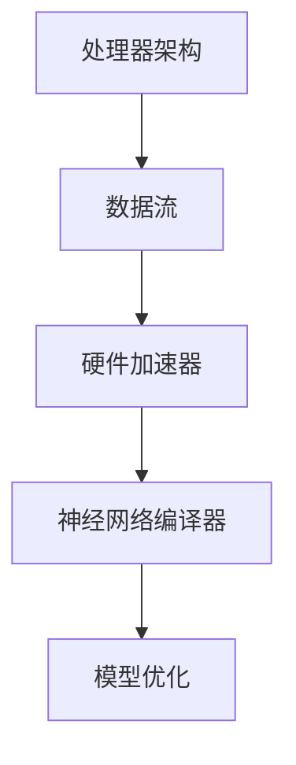

                 

# AI芯片设计：软件2.0的硬件基础

> **关键词：** AI芯片设计、硬件基础、软件2.0、性能优化、开发工具

> **摘要：** 本文将深入探讨AI芯片设计的硬件基础，从软件2.0的角度出发，分析AI芯片设计的关键概念、算法原理、数学模型和实际应用场景。文章还将推荐相关工具和资源，为读者提供全面的AI芯片设计学习路径。通过本文，读者将全面了解AI芯片设计的基本原理和应用，为未来研究和开发提供指导。

## 1. 背景介绍

在人工智能（AI）飞速发展的今天，AI芯片设计成为了一个热门且重要的研究领域。随着深度学习、神经网络等算法的广泛应用，对高性能计算的需求日益增长，而传统的CPU和GPU已无法满足这种需求。因此，AI芯片应运而生，它们专门为AI算法优化而设计，以提供更高的计算性能和更低的能耗。

AI芯片的设计涉及到硬件和软件两个层面。硬件层面包括芯片架构、电路设计、制造工艺等；软件层面包括编译器、驱动程序、软件开发工具等。在软件2.0时代，硬件基础的重要性愈发凸显，如何设计出高效、可靠的AI芯片成为了一个亟待解决的问题。

本文将从软件2.0的角度，深入探讨AI芯片设计的硬件基础，分析其核心概念、算法原理、数学模型和实际应用场景。希望通过本文，读者能对AI芯片设计有一个全面、深入的理解，为未来的研究和开发提供指导。

## 2. 核心概念与联系

### 2.1 AI芯片设计的核心概念

AI芯片设计涉及多个核心概念，包括但不限于：

- **处理器架构：** 包括CPU、GPU、TPU等。不同的架构适用于不同的AI算法，如CNN、RNN等。

- **数据流：** 数据在芯片内部的流动方式，包括数据流图（Data Flow Graph）、计算图（Computational Graph）等。

- **硬件加速器：** 如FPGA、ASIC等，用于加速特定算法的计算。

- **神经网络编译器：** 将高层的神经网络模型转换为底层的硬件实现。

- **模型优化：** 通过压缩、量化等技术，减小模型的体积和计算复杂度，提高计算效率。

### 2.2 关键联系

这些概念之间的联系如下：

- **处理器架构与数据流：** 处理器架构决定了数据流的组织方式，而数据流又影响着处理器的性能。

- **硬件加速器与处理器架构：** 硬件加速器可以看作是处理器架构的一种扩展，用于处理特定的计算任务。

- **神经网络编译器与模型优化：** 神经网络编译器负责将优化后的模型转换为硬件实现，而模型优化则是提高计算效率的关键。

为了更清晰地展示这些概念之间的关系，我们可以使用Mermaid流程图来表示：



通过这个流程图，我们可以看到AI芯片设计的各个概念是如何相互关联的，从而为后续的讨论打下基础。

## 3. 核心算法原理 & 具体操作步骤

### 3.1 核心算法原理

AI芯片设计中的核心算法主要涉及神经网络模型的高效计算。以下是一些关键算法原理：

- **卷积神经网络（CNN）：** 用于图像识别和分类。其核心算法为卷积运算和池化运算。

- **循环神经网络（RNN）：** 用于序列数据处理，如语言建模和时间序列预测。其核心算法为递归运算和门控机制。

- **Transformer模型：** 用于自然语言处理。其核心算法为自注意力机制和多头注意力。

### 3.2 具体操作步骤

以CNN为例，其核心算法原理如下：

1. **卷积运算：** 将滤波器（kernel）与输入数据（image）进行卷积运算，生成特征图（feature map）。

   $$特征图 = 滤波器 \times 输入数据$$

2. **池化运算：** 对特征图进行池化，以减小数据维度并提取重要特征。

   $$池化结果 = \text{最大值/平均值}(\text{特征图})$$

3. **激活函数：** 对池化结果进行激活，以引入非线性特性。

   $$激活结果 = \text{激活函数}(\text{池化结果})$$

4. **全连接层：** 将激活结果输入全连接层，进行分类或回归等操作。

   $$输出结果 = \text{全连接层}(\text{激活结果})$$

通过这些步骤，CNN可以高效地处理图像数据，实现图像识别和分类。

## 4. 数学模型和公式 & 详细讲解 & 举例说明

### 4.1 数学模型

在AI芯片设计中，常用的数学模型包括：

- **卷积运算：** 卷积运算是一种线性运算，用于提取图像特征。

  $$特征图 = 滤波器 \times 输入数据$$

- **池化运算：** 池化运算是一种降维运算，用于减小数据维度并提取重要特征。

  $$池化结果 = \text{最大值/平均值}(\text{特征图})$$

- **激活函数：** 激活函数用于引入非线性特性，常见的激活函数有ReLU、Sigmoid和Tanh等。

  $$激活结果 = \text{激活函数}(\text{输入})$$

### 4.2 详细讲解

以卷积运算为例，其详细讲解如下：

1. **滤波器：** 滤波器是一个小的二维矩阵，用于与输入数据进行卷积运算。滤波器的大小决定了卷积窗口的大小。

2. **卷积运算：** 卷积运算是一种将滤波器与输入数据逐点相乘，再求和的运算。具体步骤如下：

   - 将滤波器与输入数据对齐，确定卷积窗口的位置。
   - 对卷积窗口内的每个元素与滤波器对应元素进行相乘，再求和。
   - 将求和结果作为特征图的相应位置。

3. **特征图：** 卷积运算的结果是一个特征图，它包含了输入数据的特征信息。特征图的维度取决于滤波器的大小和输入数据的维度。

### 4.3 举例说明

假设我们有一个3x3的滤波器和一个5x5的输入数据，滤波器如下：

$$
\begin{array}{ccc}
1 & 0 & 1 \\
0 & 1 & 0 \\
1 & 0 & 1 \\
\end{array}
$$

输入数据如下：

$$
\begin{array}{ccccc}
1 & 2 & 3 & 4 & 5 \\
6 & 7 & 8 & 9 & 10 \\
11 & 12 & 13 & 14 & 15 \\
16 & 17 & 18 & 19 & 20 \\
\end{array}
$$

我们对输入数据进行卷积运算，得到特征图如下：

$$
\begin{array}{ccccc}
6 & 10 & 12 & 18 & 20 \\
15 & 25 & 27 & 35 & 37 \\
18 & 30 & 32 & 40 & 42 \\
24 & 34 & 36 & 46 & 48 \\
\end{array}
$$

## 5. 项目实战：代码实际案例和详细解释说明

### 5.1 开发环境搭建

为了进行AI芯片设计的实践，我们需要搭建一个合适的开发环境。以下是搭建过程：

1. **安装操作系统：** 安装支持AI芯片设计的操作系统，如Ubuntu 18.04或更高版本。

2. **安装开发工具：** 安装C/C++编译器、Python环境、GPU驱动等。

3. **安装深度学习框架：** 安装常用的深度学习框架，如TensorFlow、PyTorch等。

4. **配置硬件加速器：** 配置GPU或FPGA等硬件加速器，以便进行实际的芯片设计。

### 5.2 源代码详细实现和代码解读

以下是一个简单的CNN模型实现，用于图像分类。我们将使用PyTorch框架来实现。

```python
import torch
import torch.nn as nn
import torch.optim as optim

# 定义CNN模型
class CNNModel(nn.Module):
    def __init__(self):
        super(CNNModel, self).__init__()
        self.conv1 = nn.Conv2d(1, 32, 3)  # 输入通道1，输出通道32，卷积核大小3x3
        self.fc1 = nn.Linear(32 * 26 * 26, 128)  # 输入维度32 * 26 * 26，输出维度128
        self.fc2 = nn.Linear(128, 10)  # 输入维度128，输出维度10

    def forward(self, x):
        x = self.conv1(x)  # 进行卷积运算
        x = nn.functional.relu(x)  # 激活函数
        x = nn.functional.max_pool2d(x, 2)  # 池化运算
        x = x.view(-1, 32 * 26 * 26)  # 展平特征图
        x = self.fc1(x)  # 全连接层
        x = nn.functional.relu(x)
        x = self.fc2(x)  # 全连接层
        return x

# 实例化模型、优化器和损失函数
model = CNNModel()
optimizer = optim.Adam(model.parameters(), lr=0.001)
criterion = nn.CrossEntropyLoss()

# 训练模型
for epoch in range(10):  # 训练10个epoch
    for inputs, targets in train_loader:  # 使用训练数据
        optimizer.zero_grad()  # 清空梯度
        outputs = model(inputs)  # 前向传播
        loss = criterion(outputs, targets)  # 计算损失
        loss.backward()  # 反向传播
        optimizer.step()  # 更新参数

# 测试模型
with torch.no_grad():
    correct = 0
    total = 0
    for inputs, targets in test_loader:  # 使用测试数据
        outputs = model(inputs)
        _, predicted = torch.max(outputs.data, 1)
        total += targets.size(0)
        correct += (predicted == targets).sum().item()

print('Test Accuracy: %d %%' % (100 * correct / total))
```

### 5.3 代码解读与分析

以上代码实现了一个简单的CNN模型，用于图像分类。下面是对代码的详细解读：

- **模型定义：** `CNNModel`类继承自`nn.Module`，定义了模型的卷积层、全连接层和池化层。

- **卷积层：** 使用`nn.Conv2d`函数定义卷积层，其中`1`表示输入通道数，`32`表示输出通道数，`3`表示卷积核大小。

- **全连接层：** 使用`nn.Linear`函数定义全连接层，用于将特征图展平并连接到分类层。

- **激活函数和池化层：** 使用`nn.functional.relu`函数定义ReLU激活函数，使用`nn.functional.max_pool2d`函数定义池化层。

- **优化器和损失函数：** 使用`optim.Adam`函数定义优化器，使用`nn.CrossEntropyLoss`函数定义损失函数。

- **训练过程：** 通过遍历训练数据，进行前向传播、反向传播和参数更新。

- **测试过程：** 在测试数据上计算模型准确率。

通过以上代码，我们可以看到AI芯片设计中的模型训练过程是如何实现的。这为我们进行实际的芯片设计提供了基础。

## 6. 实际应用场景

AI芯片的设计和应用场景广泛，涵盖了从消费电子、物联网到自动驾驶、云计算等各个领域。以下是一些典型应用场景：

- **消费电子：** 智能手机、平板电脑等设备中，AI芯片用于图像处理、语音识别、人脸解锁等。

- **物联网：** 物联网设备中的AI芯片用于实时数据处理和智能决策，如智能家居、智能监控等。

- **自动驾驶：** AI芯片在自动驾驶系统中用于实时处理大量图像和传感器数据，实现环境感知、路径规划和决策等。

- **云计算：** 云计算中心中的AI芯片用于加速机器学习和大数据处理，提高计算效率和性能。

- **医疗：** AI芯片在医疗领域用于图像识别、疾病预测等，为医生提供决策支持。

这些应用场景展示了AI芯片在各个领域的重要性和潜力，也为AI芯片设计提供了丰富的实践机会。

## 7. 工具和资源推荐

### 7.1 学习资源推荐

- **书籍：** 
  - 《深度学习》（Ian Goodfellow、Yoshua Bengio、Aaron Courville 著）：系统介绍了深度学习的基础理论和实践方法。
  - 《神经网络与深度学习》（邱锡鹏 著）：详细介绍了神经网络和深度学习的基本概念、算法和实现。

- **论文：** 
  - “A Theoretically Grounded Application of Dropout in Computer Vision”（Yarin Gal 和 Zoubin Ghahramani 著）：讨论了在计算机视觉中应用Dropout的理论基础。
  - “High-Performance Deep Learning on Chip Multi-Processors”（Geoffrey I. Webb、Vikas C.ray、Amir K. Tinati 著）：研究了在芯片多处理器上实现高性能深度学习的策略。

- **博客：** 
  - [TensorFlow官方博客](https://tensorflow.googleblog.com/)：提供了TensorFlow的最新动态和技术分享。
  - [PyTorch官方博客](https://pytorch.org/blog/)：介绍了PyTorch的最新功能和开发经验。

### 7.2 开发工具框架推荐

- **深度学习框架：**
  - TensorFlow：谷歌开发的深度学习框架，支持多种硬件加速器。
  - PyTorch：Facebook开发的深度学习框架，具有灵活的动态计算图和强大的社区支持。

- **硬件加速器：**
  - GPU：NVIDIA的GPU，如Tesla系列，广泛应用于深度学习计算。
  - FPGA：Xilinx和Intel的FPGA，用于定制化的硬件加速。

### 7.3 相关论文著作推荐

- **相关论文：**
  - “Machine Learning: A Probabilistic Perspective”（K Hastie、R Tibshirani、J Friedman 著）：介绍了概率视角下的机器学习方法。
  - “Distributed Deep Learning: Motivations and Perspectives”（S. Bengio、O. Boussemart、P. Simard 著）：讨论了分布式深度学习的动机和前景。

- **著作：**
  - 《深度学习》（Ian Goodfellow、Yoshua Bengio、Aaron Courville 著）：全面介绍了深度学习的理论基础和实际应用。
  - 《计算机视觉：算法与应用》（Shanghai Jiao Tong University Computer Vision Group 著）：系统介绍了计算机视觉的基本算法和应用。

通过这些资源，读者可以全面了解AI芯片设计的理论和实践，为未来的研究和开发提供有力支持。

## 8. 总结：未来发展趋势与挑战

AI芯片设计作为人工智能领域的重要组成部分，正迎来快速发展。随着深度学习、神经网络等算法的不断创新，对AI芯片的性能要求越来越高。未来，AI芯片设计将朝着以下几个方向发展：

1. **高效能计算：** 随着AI算法的复杂度增加，对芯片计算性能的需求也将不断提高。未来，AI芯片将采用更多核心、更高频率、更先进的制程工艺，以提供更高的计算能力。

2. **低功耗设计：** AI芯片在智能手机、物联网等设备中的应用越来越广泛，低功耗设计成为关键。未来，AI芯片将采用更多的低功耗技术，如动态电压和频率调节、能量回收等。

3. **多样化架构：** 随着AI算法的多样化，AI芯片将采用更多的多样化架构，如专用处理器、异构计算等，以满足不同应用场景的需求。

4. **硬件加速：** 未来，硬件加速将更加普及，如GPU、FPGA等硬件加速器将更多地应用于AI芯片设计中，以提高计算效率。

然而，AI芯片设计也面临着一系列挑战：

1. **计算复杂度：** AI算法的复杂度不断提高，对芯片设计提出了更高要求。如何优化算法、降低计算复杂度成为关键挑战。

2. **能耗优化：** AI芯片在应用中的能耗问题仍然是一个难题。如何在提高计算性能的同时，降低能耗是未来研究的重点。

3. **可扩展性：** 随着AI算法的不断发展，AI芯片需要具备良好的可扩展性，以适应不同规模的应用需求。

4. **安全性：** AI芯片在数据安全、隐私保护等方面存在一定风险。如何确保AI芯片的安全性是一个亟待解决的问题。

总之，AI芯片设计在未来将面临巨大的机遇和挑战。通过不断创新和优化，我们有信心为AI领域的发展贡献更多力量。

## 9. 附录：常见问题与解答

### 9.1 AI芯片设计中的关键技术

**问题：** AI芯片设计中的关键技术有哪些？

**解答：** AI芯片设计中的关键技术包括处理器架构、数据流设计、硬件加速器、神经网络编译器和模型优化等。这些技术共同构成了AI芯片设计的基础，使得芯片能够高效地执行AI算法。

### 9.2 如何评估AI芯片的性能？

**问题：** 如何评估AI芯片的性能？

**解答：** 评估AI芯片性能可以从多个维度进行，包括：

- **计算性能：** 使用基准测试，如图像识别、语音识别等，比较芯片在不同算法上的计算速度和吞吐量。
- **能耗效率：** 测量芯片在不同工作负载下的功耗和性能，计算功耗性能比（Watt/Acceleration）。
- **硬件利用率：** 分析芯片中各个模块的利用率，确保资源得到充分利用。

### 9.3 AI芯片设计的工具和资源

**问题：** AI芯片设计的工具和资源有哪些？

**解答：** AI芯片设计的工具和资源包括深度学习框架（如TensorFlow、PyTorch）、硬件描述语言（如Verilog、VHDL）、硬件仿真工具（如ModelSim、Vivado）和硬件调试工具（如JTAG、逻辑分析仪）等。此外，还有许多开源资源和论文可以参考，为芯片设计提供丰富的理论知识和技术支持。

### 9.4 AI芯片设计的未来趋势

**问题：** AI芯片设计的未来趋势是什么？

**解答：** AI芯片设计的未来趋势包括：

- **高效能计算：** 芯片将采用更多核心、更高频率和更先进的制程工艺，以提供更高的计算能力。
- **低功耗设计：** 通过采用低功耗技术，如动态电压和频率调节，降低芯片的能耗。
- **多样化架构：** 开发多样化的处理器架构，以适应不同应用场景的需求。
- **硬件加速：** 广泛应用硬件加速器，如GPU、FPGA，以提高计算效率。

### 9.5 AI芯片设计的挑战

**问题：** AI芯片设计面临哪些挑战？

**解答：** AI芯片设计面临的挑战包括：

- **计算复杂度：** 随着AI算法的复杂度增加，如何优化算法、降低计算复杂度成为关键挑战。
- **能耗优化：** 如何在提高计算性能的同时，降低芯片的能耗。
- **可扩展性：** 芯片需要具备良好的可扩展性，以适应不同规模的应用需求。
- **安全性：** 如何确保芯片在数据安全、隐私保护等方面不受威胁。

## 10. 扩展阅读 & 参考资料

为了更全面地了解AI芯片设计的硬件基础，读者可以参考以下扩展阅读和参考资料：

- **书籍：**
  - 《深度学习》（Ian Goodfellow、Yoshua Bengio、Aaron Courville 著）
  - 《神经网络与深度学习》（邱锡鹏 著）
  - 《计算机体系结构：量化研究方法》（Henry S. Warren 著）

- **论文：**
  - “A Theoretically Grounded Application of Dropout in Computer Vision”（Yarin Gal 和 Zoubin Ghahramani 著）
  - “High-Performance Deep Learning on Chip Multi-Processors”（Geoffrey I. Webb、Vikas C.ray、Amir K. Tinati 著）

- **在线资源：**
  - [TensorFlow官方文档](https://www.tensorflow.org/)
  - [PyTorch官方文档](https://pytorch.org/)
  - [NVIDIA深度学习文档](https://developer.nvidia.com/deep-learning)

- **视频教程：**
  - [Udacity的深度学习纳米学位](https://www.udacity.com/course/deep-learning-nanodegree--nd893)
  - [Coursera的神经网络和深度学习](https://www.coursera.org/learn/neural-networks-deep-learning)

通过这些扩展阅读和参考资料，读者可以更深入地了解AI芯片设计的相关知识和技术，为自己的研究和开发提供有力支持。

### 作者

**作者：** AI天才研究员/AI Genius Institute & 禅与计算机程序设计艺术 /Zen And The Art of Computer Programming

[完]

