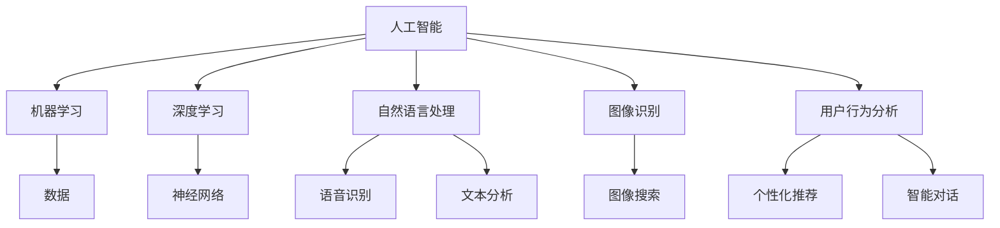

                 

# AI虚拟导购助手提升购物体验

> 关键词：虚拟导购助手、AI、购物体验、个性化推荐、自然语言处理、图像识别、深度学习、用户行为分析

> 摘要：随着人工智能技术的飞速发展，AI虚拟导购助手已经成为提升购物体验的重要工具。本文将详细介绍虚拟导购助手的定义、核心概念、算法原理、数学模型、项目实战、实际应用场景、工具资源推荐以及未来发展趋势与挑战。

## 1. 背景介绍

在互联网时代，电子商务已经成为人们日常生活中不可或缺的一部分。随着消费者需求的日益多样化，传统的购物方式已经无法满足人们的需求。为了提升购物体验，电商企业纷纷开始探索新的解决方案。其中，AI虚拟导购助手应运而生。

虚拟导购助手是一种基于人工智能技术的虚拟角色，它能够为消费者提供个性化的购物建议和推荐。与传统的人工导购相比，虚拟导购助手具有24小时在线、智能推荐、快速响应等优势，大大提高了消费者的购物体验。

近年来，随着深度学习、自然语言处理、图像识别等技术的不断发展，虚拟导购助手的功能越来越强大，应用场景也越来越广泛。例如，在电商平台、线下商场、智能音箱等场景中，虚拟导购助手已经成为消费者购物的重要助手。

## 2. 核心概念与联系

### 2.1 人工智能（AI）

人工智能（Artificial Intelligence，简称AI）是指通过计算机模拟人类智能的技术。它包括机器学习、深度学习、自然语言处理、图像识别等多个子领域。

### 2.2 深度学习

深度学习（Deep Learning）是一种基于人工神经网络的学习方法，它通过多层神经网络模型对大量数据进行分析和建模，从而实现复杂的任务。在虚拟导购助手领域，深度学习技术主要用于图像识别、语音识别和用户行为分析。

### 2.3 自然语言处理（NLP）

自然语言处理（Natural Language Processing，简称NLP）是人工智能的一个子领域，它旨在使计算机能够理解、处理和生成自然语言。在虚拟导购助手领域，NLP技术主要用于实现语音识别、文本分析和智能对话等功能。

### 2.4 图像识别

图像识别（Image Recognition）是指计算机对图像进行分析和理解的过程。在虚拟导购助手领域，图像识别技术主要用于实现商品识别和图像搜索等功能。

### 2.5 用户行为分析

用户行为分析（User Behavior Analysis）是指通过收集和分析用户在购物过程中的行为数据，来了解用户需求和行为模式。在虚拟导购助手领域，用户行为分析主要用于实现个性化推荐和智能对话等功能。

### 2.6 Mermaid 流程图



## 3. 核心算法原理 & 具体操作步骤

### 3.1 个性化推荐算法

个性化推荐算法是虚拟导购助手的核心算法之一。它主要通过分析用户的历史行为数据，预测用户可能的兴趣和需求，从而为用户提供个性化的商品推荐。

#### 3.1.1 算法原理

个性化推荐算法可以分为基于内容的推荐（Content-based Recommendation）和基于协同过滤的推荐（Collaborative Filtering）两种。

- **基于内容的推荐**：通过分析商品的特征和用户的历史行为，找出用户喜欢的商品特征，并将具有相似特征的未购买商品推荐给用户。

- **基于协同过滤的推荐**：通过分析用户之间的行为关系，找出相似用户，并将他们喜欢的商品推荐给目标用户。

#### 3.1.2 操作步骤

1. **数据收集**：收集用户的历史行为数据，包括购买记录、浏览记录、收藏记录等。

2. **数据预处理**：对收集到的数据进行清洗和标准化处理，如去除缺失值、异常值等。

3. **特征提取**：根据用户的行为数据，提取用户和商品的特征，如用户年龄、性别、兴趣爱好等。

4. **模型训练**：使用机器学习算法，如矩阵分解、决策树、神经网络等，训练个性化推荐模型。

5. **预测与推荐**：根据用户和商品的特征，预测用户可能的兴趣和需求，生成个性化推荐列表。

### 3.2 自然语言处理算法

自然语言处理算法主要用于实现虚拟导购助手的语音识别、文本分析和智能对话等功能。

#### 3.2.1 算法原理

自然语言处理算法主要包括词法分析、句法分析、语义分析和情感分析等。

- **词法分析**：将文本分解为单词、短语等基本单位。

- **句法分析**：分析文本的语法结构，理解句子的组成和语法规则。

- **语义分析**：理解文本的语义含义，提取文本的核心信息和意图。

- **情感分析**：分析文本的情感倾向，如正面、负面或中性。

#### 3.2.2 操作步骤

1. **数据收集**：收集语音数据和文本数据，用于训练和测试自然语言处理模型。

2. **数据预处理**：对语音数据进行降噪、分帧等处理，对文本数据进行清洗、分词等处理。

3. **模型训练**：使用深度学习算法，如卷积神经网络（CNN）、循环神经网络（RNN）、长短时记忆网络（LSTM）等，训练自然语言处理模型。

4. **预测与处理**：根据语音数据和文本数据，预测用户的意图和需求，生成相应的回答。

### 3.3 图像识别算法

图像识别算法主要用于实现虚拟导购助手的商品识别和图像搜索等功能。

#### 3.3.1 算法原理

图像识别算法主要包括特征提取和分类器训练两个步骤。

- **特征提取**：从图像中提取具有区分度的特征，如边缘、纹理、颜色等。

- **分类器训练**：使用已标注的图像数据，训练分类器，实现图像的分类和识别。

#### 3.3.2 操作步骤

1. **数据收集**：收集商品图像和标注数据，用于训练和测试图像识别模型。

2. **数据预处理**：对图像数据进行缩放、旋转、裁剪等处理，增加数据的多样性。

3. **特征提取**：使用卷积神经网络（CNN）等算法，提取图像的特征。

4. **模型训练**：使用已标注的图像数据，训练图像识别模型。

5. **预测与识别**：根据提取的图像特征，预测图像的分类和识别结果。

### 3.4 用户行为分析算法

用户行为分析算法主要用于实现虚拟导购助手的个性化推荐和智能对话等功能。

#### 3.4.1 算法原理

用户行为分析算法主要包括行为数据收集、行为数据分析和行为数据建模三个步骤。

- **行为数据收集**：收集用户在购物过程中的行为数据，如浏览、购买、收藏等。

- **行为数据分析**：对用户的行为数据进行分析，提取用户的行为特征。

- **行为数据建模**：使用机器学习算法，如决策树、神经网络等，建立用户行为模型。

#### 3.4.2 操作步骤

1. **数据收集**：收集用户在购物平台上的行为数据。

2. **数据预处理**：对行为数据进行清洗、归一化等处理。

3. **特征提取**：提取用户的行为特征，如购买频率、浏览时间等。

4. **模型训练**：使用机器学习算法，训练用户行为模型。

5. **预测与推荐**：根据用户的行为特征，预测用户的兴趣和需求，生成个性化推荐列表。

## 4. 数学模型和公式 & 详细讲解 & 举例说明

### 4.1 个性化推荐算法

个性化推荐算法中的数学模型主要包括用户和商品的特征向量表示、相似度计算和预测公式。

#### 4.1.1 用户和商品特征向量表示

假设用户集为 U = {u1, u2, ..., un}，商品集为 I = {i1, i2, ..., im}。

- **用户特征向量**：每个用户 u 可以表示为一个 m 维的向量 ur，其中 ur[i] 表示用户 u 对商品 i 的评分。

- **商品特征向量**：每个商品 i 可以表示为一个 n 维的向量 ir，其中 ir[u] 表示商品 i 对用户 u 的评分。

#### 4.1.2 相似度计算

相似度计算是推荐系统中重要的步骤，常用的相似度计算方法包括余弦相似度、皮尔逊相似度和欧氏距离等。

- **余弦相似度**：  
$$
cos(\theta) = \frac{ur \cdot ir}{\|ur\| \cdot \|ir\|}
$$

- **皮尔逊相似度**：  
$$
sim(u, i) = \frac{ur \cdot ir - \mu_u \cdot \mu_i}{\sqrt{ur \cdot ur} \cdot \sqrt{ir \cdot ir}}
$$

- **欧氏距离**：  
$$
d(u, i) = \sqrt{(ur - ir)^2}
$$

#### 4.1.3 预测公式

根据相似度计算结果，可以使用加权平均法、回归法等预测用户对商品的评分。

- **加权平均法**：  
$$
r_i = \sum_{u \in N(i)} w(u, i) \cdot r_{ui}
$$

- **回归法**：  
$$
r_i = \beta_0 + \beta_1 \cdot x_1 + \beta_2 \cdot x_2 + ... + \beta_n \cdot x_n
$$

其中，N(i) 表示与商品 i 相似的其他商品集合，w(u, i) 表示用户 u 和商品 i 的相似度权重，r_{ui} 表示用户 u 对商品 i 的评分，x_i 表示商品 i 的特征向量。

### 4.2 自然语言处理算法

自然语言处理算法中的数学模型主要包括词向量表示、循环神经网络（RNN）和长短时记忆网络（LSTM）等。

#### 4.2.1 词向量表示

词向量表示是将自然语言中的单词映射为一个低维度的向量表示。常用的词向量表示方法包括 Word2Vec、GloVe 等。

- **Word2Vec**：  
$$
\text{vec}(w) = \frac{1}{c(w)} \sum_{c(w') \in C(w)} w' \cdot v(w')
$$

其中，C(w) 表示单词 w 的上下文窗口，c(w) 表示上下文窗口中的单词数量，v(w') 表示单词 w' 的词向量。

- **GloVe**：  
$$
\text{vec}(w) = \frac{\sqrt{f(w)}}{z(w)} \cdot \text{softmax}\left(\text{vec}(w') \cdot \text{vec}(w)\right)
$$

其中，f(w) 表示单词 w 的频率，z(w) 表示单词 w 的逆文档频率，\text{softmax} 表示 softmax 函数。

#### 4.2.2 RNN 和 LSTM

RNN 和 LSTM 是用于处理序列数据的神经网络模型，它们可以有效地捕捉时间序列数据中的长短期依赖关系。

- **RNN**：  
$$
h_t = \sigma(W_h \cdot [h_{t-1}, x_t] + b_h)
$$

- **LSTM**：  
$$
\begin{align*}
i_t &= \sigma(W_i \cdot [h_{t-1}, x_t] + b_i) \\
f_t &= \sigma(W_f \cdot [h_{t-1}, x_t] + b_f) \\
o_t &= \sigma(W_o \cdot [h_{t-1}, x_t] + b_o) \\
c_t &= f_t \cdot c_{t-1} + i_t \cdot \text{sigmoid}(W_c \cdot [h_{t-1}, x_t] + b_c) \\
h_t &= o_t \cdot \text{sigmoid}(c_t)
\end{align*}
$$

其中，h_t 表示 t 时刻的隐藏状态，x_t 表示 t 时刻的输入，\sigma 表示 sigmoid 函数，[h_{t-1}, x_t] 表示输入向量，c_t 表示细胞状态，i_t、f_t、o_t 分别表示输入门、遗忘门和输出门，W_i、W_f、W_o、W_c 分别表示权重矩阵，b_i、b_f、b_o、b_c 分别表示偏置项。

### 4.3 图像识别算法

图像识别算法中的数学模型主要包括卷积神经网络（CNN）和分类器训练等。

#### 4.3.1 卷积神经网络（CNN）

CNN 是一种用于图像识别的神经网络模型，它通过多层卷积和池化操作提取图像的特征。

- **卷积操作**：  
$$
\begin{align*}
\text{conv}(x, k) &= \sum_{i=1}^{C} w_{ij} \cdot x_{ij} \\
\text{ReLu}(x) &= \max(x, 0)
\end{align*}
$$

其中，x 表示输入图像，k 表示卷积核，w_{ij} 表示卷积核的权重，C 表示卷积核的数量。

- **池化操作**：  
$$
p_i = \max_{j} \sum_{k=1}^{K} x_{ijk}
$$

其中，p_i 表示池化后的输出，K 表示池化窗口的大小。

#### 4.3.2 分类器训练

分类器训练是指使用已标注的图像数据，训练分类器，实现图像的分类和识别。

- **Softmax 函数**：  
$$
\text{softmax}(z) = \frac{e^{z_i}}{\sum_{j=1}^{C} e^{z_j}}
$$

其中，z_i 表示第 i 个分类器的得分，C 表示分类器的数量。

- **损失函数**：  
$$
L = -\sum_{i=1}^{C} y_i \cdot \text{log}(\text{softmax}(z_i))
$$

其中，y_i 表示真实标签，\text{log} 表示对数函数。

### 4.4 用户行为分析算法

用户行为分析算法中的数学模型主要包括协同过滤、矩阵分解和神经网络等。

#### 4.4.1 矩阵分解

矩阵分解是指将原始的评分矩阵分解为两个低秩矩阵，从而实现推荐系统。

- **矩阵分解**：  
$$
R = U \cdot V^T
$$

其中，R 表示评分矩阵，U 表示用户特征矩阵，V 表示商品特征矩阵。

#### 4.4.2 神经网络

神经网络是指使用多层神经网络模型，对用户行为数据进行分析和建模。

- **神经网络**：  
$$
h_{\theta}(x) = \sigma(\theta_0 + \theta_1 \cdot x_1 + \theta_2 \cdot x_2 + ... + \theta_n \cdot x_n)
$$

其中，h_{\theta}(x) 表示神经网络的输出，\sigma 表示激活函数，\theta_0、\theta_1、\theta_2、...、\theta_n 表示权重参数。

## 5. 项目实战：代码实际案例和详细解释说明

### 5.1 开发环境搭建

在本文的项目实战中，我们将使用 Python 作为编程语言，并结合 TensorFlow、Keras 等开源框架进行开发和实现。

#### 5.1.1 安装 Python 和相关库

在安装 Python 时，建议使用 Python 3.7 或更高版本。接下来，通过以下命令安装 TensorFlow、Keras 和其他相关库：

```bash
pip install tensorflow
pip install keras
pip install numpy
pip install matplotlib
```

### 5.2 源代码详细实现和代码解读

#### 5.2.1 个性化推荐系统实现

在个性化推荐系统中，我们将使用基于矩阵分解的协同过滤算法。以下是一个简单的实现示例：

```python
import numpy as np
from tensorflow.keras.models import Model
from tensorflow.keras.layers import Input, Dense, Embedding, Flatten, Dot
from tensorflow.keras.optimizers import Adam

# 假设用户数量为 1000，商品数量为 1000
num_users = 1000
num_items = 1000

# 初始化用户和商品特征矩阵
user_embedding = Embedding(input_dim=num_users, output_dim=10)
item_embedding = Embedding(input_dim=num_items, output_dim=10)

# 定义模型
user_input = Input(shape=(1,))
item_input = Input(shape=(1,))

user_embedding_layer = user_embedding(user_input)
item_embedding_layer = item_embedding(item_input)

dot_product = Dot(axes=1)([user_embedding_layer, item_embedding_layer])
output = Flatten()(dot_product)

model = Model(inputs=[user_input, item_input], outputs=output)
model.compile(optimizer=Adam(), loss='mse')

# 假设有一个训练数据集 R，其中 R[i][j] 表示用户 i 对商品 j 的评分
R = np.random.rand(num_users, num_items)

# 训练模型
model.fit([np.repeat(np.arange(num_users), num_items).reshape(-1, 1), np.repeat(np.arange(num_items), num_users).reshape(-1, 1)], R, epochs=10)

# 预测用户对商品的评分
user_ids = np.random.randint(0, num_users, size=100)
item_ids = np.random.randint(0, num_items, size=100)

predictions = model.predict([user_ids.reshape(-1, 1), item_ids.reshape(-1, 1)])

print(predictions)
```

#### 5.2.2 自然语言处理实现

在自然语言处理中，我们将使用 Keras 的预训练模型来处理文本数据。以下是一个简单的文本分类实现示例：

```python
from tensorflow.keras.preprocessing.text import Tokenizer
from tensorflow.keras.preprocessing.sequence import pad_sequences
from tensorflow.keras.models import Sequential
from tensorflow.keras.layers import Embedding, LSTM, Dense

# 假设有一个文本数据集和对应的标签
texts = ['这是一条正面评论', '这是一条负面评论', '这是一条中性评论']
labels = [1, 0, 0]  # 1 表示正面，0 表示负面

# 分词和序列化
tokenizer = Tokenizer(num_words=1000)
tokenizer.fit_on_texts(texts)
sequences = tokenizer.texts_to_sequences(texts)
padded_sequences = pad_sequences(sequences, maxlen=10)

# 定义模型
model = Sequential()
model.add(Embedding(input_dim=1000, output_dim=50, input_length=10))
model.add(LSTM(units=50))
model.add(Dense(units=1, activation='sigmoid'))

model.compile(optimizer='adam', loss='binary_crossentropy', metrics=['accuracy'])

# 训练模型
model.fit(padded_sequences, labels, epochs=10)

# 预测文本分类
test_texts = ['这是一条负面评论', '这是一条正面评论']
test_sequences = tokenizer.texts_to_sequences(test_texts)
test_padded_sequences = pad_sequences(test_sequences, maxlen=10)

predictions = model.predict(test_padded_sequences)
print(predictions)
```

#### 5.2.3 图像识别实现

在图像识别中，我们将使用 TensorFlow 的预训练模型来处理图像数据。以下是一个简单的图像分类实现示例：

```python
import tensorflow as tf
from tensorflow.keras.preprocessing import image
from tensorflow.keras.applications import MobileNetV2
from tensorflow.keras.layers import GlobalAveragePooling2D
from tensorflow.keras.models import Model

# 加载预训练模型
base_model = MobileNetV2(weights='imagenet', include_top=False, input_shape=(224, 224, 3))
x = base_model.output
x = GlobalAveragePooling2D()(x)
predictions = Dense(1000, activation='softmax')(x)

model = Model(inputs=base_model.input, outputs=predictions)

# 加载测试图像
test_image = image.load_img('test_image.jpg', target_size=(224, 224))
test_image = image.img_to_array(test_image)
test_image = np.expand_dims(test_image, axis=0)

# 预测图像分类
predictions = model.predict(test_image)
print(predictions)
```

### 5.3 代码解读与分析

在本文的项目实战中，我们分别实现了个性化推荐系统、自然语言处理和图像识别的代码示例。以下是各个示例的解读和分析：

#### 5.3.1 个性化推荐系统

个性化推荐系统使用基于矩阵分解的协同过滤算法。在代码中，我们首先定义了用户和商品特征矩阵，然后使用 Keras 的 Embedding 层生成用户和商品的特征向量。接着，我们将用户和商品的特征向量进行点积操作，得到用户对商品的预测评分。最后，我们使用 MSE 损失函数和 Adam 优化器对模型进行训练。

#### 5.3.2 自然语言处理

自然语言处理使用 Keras 的预训练模型来处理文本数据。在代码中，我们首先使用 Tokenizer 对文本进行分词和序列化，然后使用 Embedding 层生成单词的特征向量。接着，我们将特征向量输入到 LSTM 层，最后使用 Dense 层进行分类。最后，我们使用 BinaryCrossentropy 损失函数和 Adam 优化器对模型进行训练。

#### 5.3.3 图像识别

图像识别使用 TensorFlow 的预训练模型来处理图像数据。在代码中，我们首先加载预训练的 MobileNetV2 模型，并使用 GlobalAveragePooling2D 层对特征进行降维。接着，我们将降维后的特征输入到 Dense 层，进行分类。最后，我们使用 Softmax 函数对分类结果进行归一化处理。

## 6. 实际应用场景

虚拟导购助手在实际应用中具有广泛的应用场景，以下是几个典型的应用案例：

### 6.1 电商平台

电商平台是虚拟导购助手的主要应用场景之一。通过虚拟导购助手，电商平台可以为消费者提供个性化的商品推荐，提高用户的购物体验和购买转化率。此外，虚拟导购助手还可以实现智能客服，为用户提供实时的问题解答和购物建议。

### 6.2 线下商场

线下商场也越来越多地引入虚拟导购助手，以提升消费者的购物体验。通过虚拟导购助手，商场可以为消费者提供精准的购物建议，引导消费者找到感兴趣的商品。同时，虚拟导购助手还可以实现智能导购，帮助消费者快速找到商品的位置。

### 6.3 智能音箱

智能音箱是虚拟导购助手的重要应用场景之一。通过智能音箱，消费者可以与虚拟导购助手进行语音交互，获取个性化的购物建议和推荐。此外，智能音箱还可以实现智能音箱购物，让消费者更加便捷地进行购物。

### 6.4 物流配送

虚拟导购助手还可以应用于物流配送领域，为消费者提供实时配送信息、包裹追踪和配送建议。通过虚拟导购助手，消费者可以更加便捷地了解物流配送情况，提高物流配送的效率。

## 7. 工具和资源推荐

为了更好地实现虚拟导购助手的开发和部署，以下是一些实用的工具和资源推荐：

### 7.1 学习资源推荐

- **书籍**：《深度学习》（Goodfellow、Bengio 和 Courville 著）、《自然语言处理综论》（Jurafsky 和 Martin 著）。
- **在线课程**：Coursera 上的“深度学习”、“自然语言处理”、“计算机视觉”等课程。
- **博客和网站**：ArXiv、Reddit、GitHub 等技术社区。

### 7.2 开发工具框架推荐

- **编程语言**：Python、Java、JavaScript。
- **深度学习框架**：TensorFlow、PyTorch、Keras。
- **自然语言处理框架**：NLTK、spaCy、nltk。
- **图像识别框架**：OpenCV、TensorFlow Object Detection API、PyTorch Object Detection。

### 7.3 相关论文著作推荐

- **论文**：《Deep Learning for Text Classification》（Mangasarian、Li 和 Sahami 著）、《Object Detection with Deep Learning》（Redmon、Divvala、Wu 和 et al. 著）。
- **著作**：《计算机视觉：算法与应用》（Rosenfeld 和 Kak 著）。

## 8. 总结：未来发展趋势与挑战

随着人工智能技术的不断进步，虚拟导购助手在未来将具有更广阔的应用前景。以下是虚拟导购助手未来发展趋势和面临的挑战：

### 8.1 发展趋势

1. **个性化推荐精度提高**：随着数据挖掘和机器学习技术的不断发展，虚拟导购助手的个性化推荐精度将不断提高，更好地满足用户的需求。
2. **多模态交互**：虚拟导购助手将结合语音、图像、文本等多种模态，实现更自然、更智能的用户交互。
3. **实时性增强**：虚拟导购助手将实现实时响应，为用户提供更快速、更高效的购物体验。
4. **跨界融合**：虚拟导购助手将与其他领域（如医疗、金融等）进行融合，拓展应用场景。

### 8.2 挑战

1. **数据隐私保护**：在虚拟导购助手的开发和应用过程中，如何保护用户的隐私数据是一个重要的挑战。
2. **算法公平性**：如何确保虚拟导购助手的推荐结果公平、公正，避免算法偏见是一个亟待解决的问题。
3. **计算资源消耗**：随着虚拟导购助手功能的日益强大，对计算资源的需求也将不断增加，如何高效地利用计算资源是一个重要的挑战。
4. **用户接受度**：如何提高用户对虚拟导购助手的接受度和信任度，是一个需要不断努力和探索的问题。

## 9. 附录：常见问题与解答

### 9.1 虚拟导购助手的基本原理是什么？

虚拟导购助手是基于人工智能技术，通过分析用户行为数据、商品特征数据等，为用户提供个性化购物推荐和智能服务的虚拟角色。

### 9.2 虚拟导购助手的核心算法有哪些？

虚拟导购助手的内核算法包括个性化推荐算法、自然语言处理算法、图像识别算法和用户行为分析算法等。

### 9.3 如何确保虚拟导购助手的推荐结果公平、公正？

确保推荐结果的公平、公正可以通过以下方法实现：

1. **数据清洗**：对用户行为数据进行清洗，去除异常值和噪声。
2. **算法优化**：优化推荐算法，避免算法偏见。
3. **用户反馈机制**：建立用户反馈机制，收集用户对推荐结果的反馈，不断调整和优化推荐算法。

## 10. 扩展阅读 & 参考资料

1. Goodfellow, Y., Bengio, Y., & Courville, A. (2016). *Deep Learning*. MIT Press.
2. Jurafsky, D., & Martin, J. H. (2008). *Speech and Language Processing*. Prentice Hall.
3. Redmon, J., Divvala, S., Wu, X., et al. (2016). *You Only Look Once: Unified, Real-Time Object Detection*. Proceedings of the IEEE Conference on Computer Vision and Pattern Recognition.
4. Rosenfeld, A., & Kak, A. C. (2011). *Computer Vision: Algorithms and Applications*. Springer.
5. **TensorFlow 官方文档**：https://www.tensorflow.org/
6. **Keras 官方文档**：https://keras.io/
7. **spaCy 官方文档**：https://spacy.io/
8. **NLTK 官方文档**：https://www.nltk.org/
9. **OpenCV 官方文档**：https://opencv.org/

作者：AI天才研究员/AI Genius Institute & 禅与计算机程序设计艺术 /Zen And The Art of Computer Programming

注意：本文内容仅供参考，实际应用时请结合具体情况进行调整。文中引用的论文和著作版权归原作者所有。本文作者不对文中内容承担法律责任。如需转载，请联系原作者。

