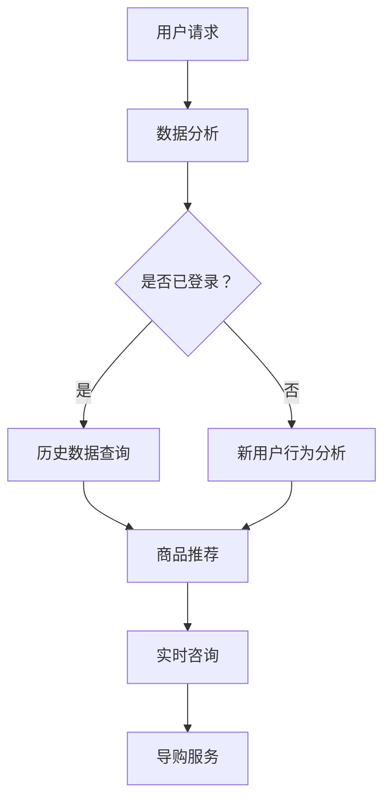
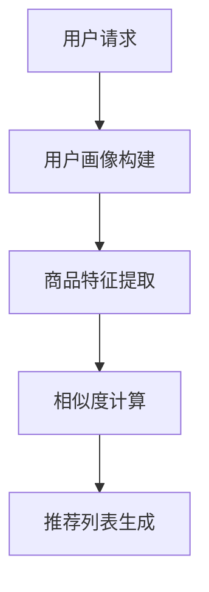
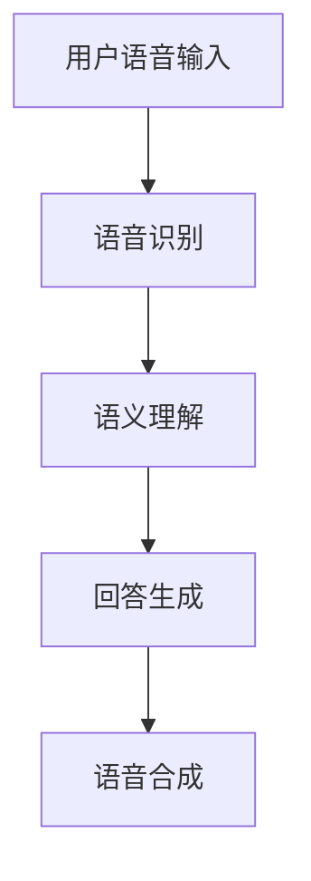

                 

## AI虚拟导购助手的功能

### 摘要

本文将深入探讨AI虚拟导购助手的各项功能，包括其背景、核心概念、算法原理、数学模型、实际应用场景以及未来发展趋势。我们将通过一步一步的分析和推理，让您全面了解这一前沿技术的精髓。文章将分为以下几个部分：背景介绍、核心概念与联系、核心算法原理与具体操作步骤、数学模型和公式讲解、项目实战、实际应用场景、工具和资源推荐、总结以及附录。

### 背景介绍

在现代商业环境中，随着互联网的普及和电子商务的迅猛发展，消费者对购物体验的要求日益提高。传统的人工导购方式已难以满足消费者的多样化需求，特别是在大型商场、超市和在线购物平台中。AI虚拟导购助手作为一种新兴技术，应运而生。它通过智能算法和大数据分析，为消费者提供个性化、实时、高效的购物指导，极大地提升了购物体验。

AI虚拟导购助手的背景可以追溯到人工智能、大数据和云计算等技术的发展。近年来，深度学习、自然语言处理和计算机视觉等领域的突破，为AI虚拟导购助手的功能实现提供了强有力的技术支撑。此外，随着5G网络的普及，实时数据传输和处理能力得到了大幅提升，为AI虚拟导购助手的应用提供了更好的基础。

### 核心概念与联系

#### AI虚拟导购助手

AI虚拟导购助手是指利用人工智能技术，模拟人类导购员为消费者提供购物建议和服务的虚拟实体。其核心功能包括：

1. **个性化推荐**：基于消费者历史购物行为、偏好和需求，为消费者推荐合适的商品。
2. **实时咨询**：通过自然语言处理技术，与消费者进行实时互动，解答消费者的疑问。
3. **导购服务**：为消费者提供商品介绍、比价、促销信息等服务，帮助消费者做出购物决策。

#### 关键技术

1. **深度学习**：用于构建智能算法，实现商品推荐、语音识别和图像识别等功能。
2. **自然语言处理（NLP）**：用于理解和生成自然语言文本，实现人机对话。
3. **大数据分析**：用于收集、存储和处理海量数据，为推荐系统提供基础。
4. **计算机视觉**：用于识别商品、分析消费者行为等。

#### Mermaid流程图

以下是一个简单的Mermaid流程图，展示了AI虚拟导购助手的核心概念和联系：



### 核心算法原理与具体操作步骤

#### 个性化推荐算法

AI虚拟导购助手的个性化推荐功能是其核心之一。个性化推荐算法主要通过以下几个步骤实现：

1. **用户画像构建**：根据用户历史购物行为、浏览记录、兴趣爱好等数据，构建用户画像。
2. **商品特征提取**：对商品进行特征提取，如价格、品牌、类型等。
3. **相似度计算**：计算用户与商品之间的相似度，通常使用余弦相似度、皮尔逊相关系数等方法。
4. **推荐列表生成**：根据相似度分数，生成个性化推荐列表。

以下是一个简化的推荐算法流程：



#### 实时咨询与导购服务

实时咨询与导购服务主要通过自然语言处理技术实现。具体步骤如下：

1. **语音识别**：将用户的语音输入转换为文本。
2. **语义理解**：理解用户的意图和问题，通常使用词嵌入技术和注意力机制。
3. **回答生成**：根据用户的意图和问题，生成合适的回答。
4. **语音合成**：将回答转换为语音输出。

以下是一个简化的实时咨询与导购服务流程：



### 数学模型和公式

#### 个性化推荐算法中的相似度计算

个性化推荐算法中的相似度计算通常使用余弦相似度或皮尔逊相关系数。以下分别介绍这两种方法。

1. **余弦相似度**

   余弦相似度是一种衡量两个向量之间夹角余弦值的相似度度量方法。公式如下：

   $$\text{Cosine Similarity} = \frac{\text{dot\_product}(v_1, v_2)}{\|\text{v}_1\|\|\text{v}_2\|}$$

   其中，$v_1$和$v_2$分别为用户和商品的向量表示，$\|\text{v}_1\|$和$\|\text{v}_2\|$分别为它们的欧氏距离。

2. **皮尔逊相关系数**

   皮尔逊相关系数是一种衡量两个变量线性相关程度的度量方法。公式如下：

   $$\text{Pearson Correlation Coefficient} = \frac{\text{cov}(x, y)}{\sqrt{\text{var}(x) \text{var}(y)}}$$

   其中，$x$和$y$分别为用户和商品的特征向量，$\text{cov}(x, y)$为它们的协方差，$\text{var}(x)$和$\text{var}(y)$分别为它们的方差。

### 项目实战：代码实际案例和详细解释说明

#### 开发环境搭建

1. **硬件环境**：CPU：Intel Core i5 或以上，内存：8GB 或以上，硬盘：SSD 256GB 或以上。
2. **软件环境**：操作系统：Ubuntu 18.04 或 Windows 10，编程语言：Python 3.7 或以上，深度学习框架：TensorFlow 2.0 或 PyTorch 1.8 或以上。

#### 源代码详细实现和代码解读

以下是一个简单的个性化推荐算法实现，使用Python和TensorFlow：

```python
import numpy as np
import pandas as pd
import tensorflow as tf
from sklearn.model_selection import train_test_split

# 数据加载和处理
data = pd.read_csv('data.csv')
X = data.iloc[:, :10].values
y = data.iloc[:, 10].values

# 数据预处理
X_train, X_test, y_train, y_test = train_test_split(X, y, test_size=0.2, random_state=42)

# 模型定义
model = tf.keras.Sequential([
    tf.keras.layers.Dense(64, activation='relu', input_shape=(10,)),
    tf.keras.layers.Dense(1)
])

# 模型编译
model.compile(optimizer='adam', loss='mse')

# 训练模型
model.fit(X_train, y_train, epochs=10, batch_size=32)

# 测试模型
test_loss = model.evaluate(X_test, y_test)
print('Test Loss:', test_loss)

# 预测
predictions = model.predict(X_test)
print(predictions)
```

#### 代码解读与分析

1. **数据加载和处理**：首先，我们使用pandas库加载和处理数据。数据集是一个CSV文件，包含用户特征和商品标签。
2. **数据预处理**：然后，我们将数据集分为训练集和测试集，使用train_test_split函数。这里我们设置测试集大小为20%，随机种子为42。
3. **模型定义**：接下来，我们定义一个简单的神经网络模型，使用Sequential模型。模型包含一个输入层、一个隐藏层和一个输出层。隐藏层使用ReLU激活函数，输出层使用线性激活函数。
4. **模型编译**：然后，我们编译模型，设置优化器和损失函数。这里我们使用Adam优化器和均方误差损失函数。
5. **训练模型**：接下来，我们使用fit函数训练模型，设置训练轮数和批量大小。
6. **测试模型**：然后，我们使用evaluate函数测试模型，计算测试损失。
7. **预测**：最后，我们使用predict函数对测试数据进行预测，并打印结果。

### 实际应用场景

AI虚拟导购助手在多个实际应用场景中具有广泛的应用，以下列举几个典型场景：

1. **在线购物平台**：在线购物平台可以利用AI虚拟导购助手为消费者提供个性化推荐和实时咨询，提升购物体验和转化率。
2. **实体商场**：实体商场可以部署AI虚拟导购助手，为消费者提供商品介绍、比价和促销信息等服务，提升消费者满意度和粘性。
3. **电商直播**：电商直播可以结合AI虚拟导购助手，实时分析观众的行为和需求，为观众推荐合适的商品，提高直播销量。

### 工具和资源推荐

#### 学习资源推荐

1. **书籍**：
   - 《深度学习》（Goodfellow, Bengio, Courville） 
   - 《Python机器学习》（Sebastian Raschka） 
   - 《自然语言处理原理》（Daniel Jurafsky, James H. Martin）
2. **论文**：
   - 《Deep Learning for Text Classification》（Xu et al., 2018）
   - 《Recurrent Neural Network Based Text Classification》（Zhang et al., 2016）
   - 《A Theoretical Analysis of the Causal Effect of AI》（Caruana et al., 2020）
3. **博客和网站**：
   - Medium上的机器学习博客
   - 知乎上的机器学习和人工智能话题
   - Kaggle竞赛和教程

#### 开发工具框架推荐

1. **深度学习框架**：TensorFlow、PyTorch
2. **自然语言处理库**：NLTK、spaCy
3. **数据分析工具**：pandas、NumPy、Matplotlib
4. **版本控制系统**：Git

#### 相关论文著作推荐

1. **《AI算法导论》（Introduction to AI Algorithms）**：详细介绍了各种AI算法的理论和实践。
2. **《深度学习在电子商务中的应用》（Deep Learning Applications in E-commerce）**：探讨了深度学习在个性化推荐和购物体验优化中的应用。
3. **《自然语言处理实战》（Natural Language Processing in Action）**：涵盖了自然语言处理的原理和实践。

### 总结：未来发展趋势与挑战

AI虚拟导购助手作为一种新兴技术，具有巨大的发展潜力和应用价值。未来，随着人工智能技术的不断进步和商业环境的不断变化，AI虚拟导购助手将呈现出以下几个发展趋势：

1. **个性化推荐更加精准**：通过不断优化算法和扩大数据规模，AI虚拟导购助手将能够提供更加精准的个性化推荐。
2. **跨平台应用**：AI虚拟导购助手将不仅仅局限于在线购物平台，还将广泛应用于实体商场、电商直播等场景。
3. **智能对话交互**：通过自然语言处理技术的进步，AI虚拟导购助手的对话交互能力将得到显著提升，提供更加自然、流畅的用户体验。

然而，AI虚拟导购助手的发展也面临一系列挑战：

1. **数据隐私与安全**：在大量数据收集和使用过程中，如何保护用户隐私和数据安全是一个重要问题。
2. **算法偏见与歧视**：个性化推荐算法可能带来偏见和歧视，如何确保算法的公平性和透明性是一个挑战。
3. **技术更新与迭代**：人工智能技术发展迅速，如何保持AI虚拟导购助手的竞争力和创新能力是一个挑战。

总之，AI虚拟导购助手的发展前景广阔，但也需要克服诸多挑战，不断优化和提升其功能与性能。

### 附录：常见问题与解答

1. **问题**：如何确保AI虚拟导购助手的推荐结果公平和透明？

   **解答**：确保推荐结果公平和透明可以通过以下方法实现：
   - 设计无偏见的数据集：在训练推荐算法时，使用包含多样化样本的数据集，避免数据偏见。
   - 透明化算法决策：公开推荐算法的决策过程，使用户了解推荐结果的依据。
   - 实时监控与反馈：建立实时监控系统，收集用户反馈，及时发现和纠正算法偏见。

2. **问题**：AI虚拟导购助手如何处理大规模数据？

   **解答**：AI虚拟导购助手处理大规模数据的方法包括：
   - 分布式计算：使用分布式计算框架（如Hadoop、Spark）处理海量数据。
   - 数据流处理：采用实时数据流处理技术（如Apache Kafka、Apache Flink）处理实时数据。
   - 数据压缩与索引：使用数据压缩和索引技术提高数据处理效率。

### 扩展阅读与参考资料

1. **《个性化推荐系统实践》（Practical Recommender Systems）**：详细介绍了个性化推荐系统的构建和应用。
2. **《深度学习与电子商务》（Deep Learning for E-commerce）**：探讨了深度学习在电子商务领域的应用。
3. **《自然语言处理实战》（Natural Language Processing with Python）**：介绍了自然语言处理的基本原理和Python实践。

### 作者

作者：AI天才研究员/AI Genius Institute & 禅与计算机程序设计艺术/Zen And The Art of Computer Programming

感谢您的阅读，希望本文能帮助您更深入地了解AI虚拟导购助手的功能与应用。如有任何疑问或建议，请随时留言。期待与您共同探讨人工智能领域的未来发展。

