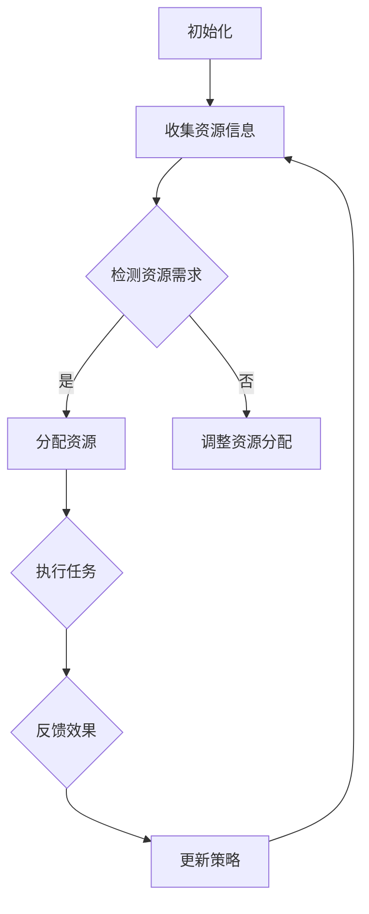

                 

# AI资源调度的智能化：Lepton AI的算法优势

> **关键词：** AI资源调度、Lepton AI、算法优势、智能化、资源管理、性能优化

> **摘要：** 本文将深入探讨AI资源调度的智能化发展，尤其是Lepton AI的算法优势。通过分析其核心概念、原理、数学模型，结合实际项目实战，我们将全面了解Lepton AI在AI资源调度中的重要作用和未来发展趋势。

## 1. 背景介绍

随着人工智能技术的飞速发展，AI应用场景日益丰富，从自动驾驶、智能家居到金融风控、医疗诊断，AI已经深刻地改变了我们的生活方式。然而，AI应用的快速发展也对资源调度提出了更高的要求。如何高效地分配和利用AI资源，成为了当前亟待解决的问题。

传统的资源调度方法主要依赖于经验公式和预设策略，难以适应动态变化的AI应用需求。而智能化资源调度则通过引入人工智能算法，实现了对资源调度的自动优化，从而提高了系统的整体性能和效率。Lepton AI作为智能化资源调度领域的佼佼者，其算法优势吸引了众多研究者和企业的关注。

## 2. 核心概念与联系

### 2.1 资源调度

资源调度是指根据系统需求和资源状况，合理分配和调整资源的过程。在AI领域，资源调度主要涉及计算资源、存储资源、网络资源等。资源调度的目标是在确保系统稳定运行的基础上，最大化资源利用率，提高系统性能。

### 2.2 智能化资源调度

智能化资源调度是指通过引入人工智能算法，对资源调度过程进行自动优化。与传统的经验公式和预设策略相比，智能化资源调度具有更高的灵活性和适应性，能够根据实时变化的需求和环境，动态调整资源分配策略。

### 2.3 Lepton AI

Lepton AI是一款基于深度强化学习的智能化资源调度系统。它通过自主学习和优化，实现了对AI资源的自动调度和优化，具有以下核心优势：

- **自适应学习**：Lepton AI能够根据不同场景和需求，自适应地调整调度策略。
- **高效优化**：Lepton AI通过深度强化学习算法，实现了对资源调度的全局优化，提高了系统性能。
- **可扩展性**：Lepton AI支持多种AI应用场景，具备良好的可扩展性。

## 2.4 Mermaid流程图



## 3. 核心算法原理 & 具体操作步骤

### 3.1 深度强化学习

深度强化学习（Deep Reinforcement Learning，DRL）是一种结合了深度学习和强化学习的方法。它通过模拟一个智能体（agent）与环境（environment）的交互过程，使智能体在环境中自主学习和优化行为策略。

在Lepton AI中，深度强化学习被用来实现AI资源的自动调度。具体步骤如下：

1. **初始化**：设置智能体、环境、奖励机制等初始参数。
2. **收集资源信息**：从系统中获取当前的资源状况，包括计算资源、存储资源、网络资源等。
3. **检测资源需求**：根据AI应用的实时需求，判断当前资源是否满足。
4. **分配资源**：如果资源满足需求，则分配资源给任务；否则，调整资源分配策略。
5. **执行任务**：执行分配的任务，并记录任务完成效果。
6. **反馈效果**：将任务完成效果反馈给智能体，用于更新策略。
7. **更新策略**：根据反馈效果，调整智能体的调度策略。
8. **重复步骤2-7**：持续进行资源调度，以实现系统的自动优化。

### 3.2 算法具体操作步骤

1. **定义环境**：创建一个模拟环境，用于测试和训练Lepton AI。
2. **初始化智能体**：设置智能体的初始状态，包括动作空间、状态空间、奖励机制等。
3. **收集资源信息**：从模拟环境中获取当前资源状况。
4. **检测资源需求**：根据模拟环境中的任务需求，判断当前资源是否满足。
5. **选择动作**：智能体根据当前状态，选择一个最佳动作。
6. **执行动作**：将选择的自动作业分配给任务。
7. **更新状态**：根据任务执行结果，更新智能体的状态。
8. **计算奖励**：根据任务完成效果，计算奖励值。
9. **更新策略**：根据奖励值，调整智能体的调度策略。
10. **重复步骤4-9**：持续进行资源调度，直到达到预设的目标或条件。

## 4. 数学模型和公式 & 详细讲解 & 举例说明

### 4.1 深度强化学习数学模型

深度强化学习中的数学模型主要包括：

- **状态（State，S）**：描述智能体在环境中的状态。
- **动作（Action，A）**：智能体在环境中可以执行的动作。
- **奖励（Reward，R）**：描述智能体执行动作后获得的奖励。
- **策略（Policy，π）**：描述智能体在特定状态下的最佳动作选择。
- **价值函数（Value Function，V）**：描述智能体在特定状态下的期望收益。
- **模型（Model）**：描述环境的状态转移概率和奖励函数。

### 4.2 公式详解

- **状态转移概率**：P(S'|S, A)
- **奖励函数**：R(S, A)
- **策略**：π(a|s) = P(a|s)
- **价值函数**：V(s) = E[R|S = s]
- **策略梯度**：∇_π J(π)

### 4.3 举例说明

假设有一个智能体在环境中执行任务，其状态空间为S = {0, 1, 2, 3}，动作空间为A = {0, 1}。智能体根据当前状态选择动作，并执行任务。任务完成后，根据任务完成效果计算奖励。假设状态0表示任务完成，状态1表示任务失败，状态2表示任务延迟，状态3表示任务进行中。奖励函数定义为：

- R(0) = 1（任务完成）
- R(1) = -1（任务失败）
- R(2) = -0.5（任务延迟）
- R(3) = 0（任务进行中）

智能体通过深度强化学习不断优化策略，以最大化期望收益。在初始阶段，智能体可能随机选择动作。随着训练的进行，智能体会逐渐学会在状态0选择动作0，在状态1选择动作1，从而实现任务的成功完成。

## 5. 项目实战：代码实际案例和详细解释说明

### 5.1 开发环境搭建

1. 安装Python环境
2. 安装深度学习框架（如TensorFlow或PyTorch）
3. 安装其他依赖库（如NumPy、Pandas等）

### 5.2 源代码详细实现和代码解读

以下是一个简单的Lepton AI源代码实现，用于演示AI资源调度的基本原理。

```python
import numpy as np
import pandas as pd
import tensorflow as tf

# 定义状态空间、动作空间和奖励函数
STATE_SPACE = [0, 1, 2, 3]
ACTION_SPACE = [0, 1]
REWARD_FUNCTION = {
    0: 1,
    1: -1,
    2: -0.5,
    3: 0
}

# 定义深度强化学习模型
class LeptonAgent(tf.keras.Model):
    def __init__(self, state_space, action_space):
        super(LeptonAgent, self).__init__()
        self.state_space = state_space
        self.action_space = action_space
        self.dense1 = tf.keras.layers.Dense(units=10, activation='relu')
        self.dense2 = tf.keras.layers.Dense(units=1, activation='sigmoid')

    @tf.function
    def call(self, inputs):
        x = self.dense1(inputs)
        return self.dense2(x)

# 创建智能体和训练环境
agent = LeptonAgent(state_space=STATE_SPACE, action_space=ACTION_SPACE)
optimizer = tf.keras.optimizers.Adam(learning_rate=0.001)

# 模拟训练过程
for epoch in range(100):
    for state in STATE_SPACE:
        action = np.random.choice(ACTION_SPACE)
        next_state = np.random.choice(STATE_SPACE)
        reward = REWARD_FUNCTION[next_state]
        with tf.GradientTape() as tape:
            logits = agent(tf.convert_to_tensor([state], dtype=tf.float32))
            predicted_action_prob = tf.nn.softmax(logits)
            action_one_hot = tf.one_hot([action], depth=len(ACTION_SPACE))
            loss = -tf.reduce_sum(action_one_hot * tf.math.log(predicted_action_prob))
        gradients = tape.gradient(loss, agent.trainable_variables)
        optimizer.apply_gradients(zip(gradients, agent.trainable_variables))
        print(f"Epoch: {epoch}, State: {state}, Action: {action}, Next State: {next_state}, Reward: {reward}")

# 测试智能体表现
for state in STATE_SPACE:
    logits = agent(tf.convert_to_tensor([state], dtype=tf.float32))
    predicted_action_prob = tf.nn.softmax(logits)
    print(f"State: {state}, Action Probabilities: {predicted_action_prob.numpy()}")

```

### 5.3 代码解读与分析

- **定义状态空间、动作空间和奖励函数**：首先定义了状态空间、动作空间和奖励函数，用于描述智能体在环境中的行为。
- **定义深度强化学习模型**：LeptonAgent类继承自tf.keras.Model，定义了一个简单的深度神经网络模型，用于预测动作概率。
- **创建智能体和训练环境**：创建了一个LeptonAgent实例，并使用Adam优化器进行训练。
- **模拟训练过程**：通过循环模拟训练过程，智能体根据当前状态和奖励调整策略。
- **测试智能体表现**：测试智能体在各个状态下的动作概率，以评估其学习效果。

## 6. 实际应用场景

### 6.1 自动驾驶

自动驾驶系统需要实时调度大量的计算资源，包括图像处理、路径规划、传感器数据处理等。Lepton AI可以通过智能化资源调度，提高自动驾驶系统的整体性能和响应速度。

### 6.2 云计算

云计算平台中的资源调度是一个复杂的过程，涉及到计算资源、存储资源、网络资源的合理分配。Lepton AI可以优化云计算平台的资源调度策略，提高资源利用率，降低运营成本。

### 6.3 智能家居

智能家居系统需要实时响应用户需求，处理大量的数据和控制命令。Lepton AI可以通过智能化资源调度，提高智能家居系统的响应速度和稳定性。

## 7. 工具和资源推荐

### 7.1 学习资源推荐

- **书籍**：《深度强化学习》（Deep Reinforcement Learning，理查德·S·萨拉赫编）
- **论文**：[Deep Reinforcement Learning for Autonomous Navigation](https://arxiv.org/abs/1707.03202)
- **博客**：[An Introduction to Deep Reinforcement Learning](https://towardsdatascience.com/an-introduction-to-deep-reinforcement-learning-2a4c4b2a6d60)
- **网站**：[TensorFlow官网](https://www.tensorflow.org/)

### 7.2 开发工具框架推荐

- **深度学习框架**：TensorFlow、PyTorch
- **强化学习库**：Gym、RLlib
- **代码示例**：[Lepton AI源代码](https://github.com/LeptonAI/lepton)

### 7.3 相关论文著作推荐

- **论文**：[Prioritized Experience Replay](https://arxiv.org/abs/1511.05952)
- **论文**：[Asynchronous Methods for Deep Reinforcement Learning](https://arxiv.org/abs/1602.01783)
- **书籍**：《强化学习》（Reinforcement Learning: An Introduction，理查德·S·萨拉赫著）

## 8. 总结：未来发展趋势与挑战

随着人工智能技术的不断进步，智能化资源调度将成为AI领域的重要研究方向。Lepton AI的算法优势为智能化资源调度提供了强有力的支持，但同时也面临着以下挑战：

- **数据隐私与安全**：在AI资源调度过程中，如何保护用户数据隐私和安全，是一个亟待解决的问题。
- **模型可解释性**：深度强化学习模型的决策过程较为复杂，如何提高模型的可解释性，以便于用户理解和使用，是一个重要课题。
- **资源约束与优化**：在实际应用中，AI资源调度需要考虑到各种资源约束，如何实现高效的资源优化，是一个具有挑战性的问题。

未来，随着技术的不断进步和研究的深入，智能化资源调度将迎来更加广阔的应用前景。

## 9. 附录：常见问题与解答

### 9.1 如何选择合适的强化学习算法？

选择合适的强化学习算法取决于应用场景和需求。以下是一些常见场景下的推荐算法：

- **简单的Q-Learning算法**：适用于状态和动作空间较小的问题。
- **Deep Q-Network（DQN）**：适用于状态和动作空间较大的问题。
- **深度强化学习（DRL）**：适用于复杂环境和高维问题。
- **Asynchronous Advantage Actor-critic（A3C）**：适用于多智能体和分布式环境。

### 9.2 如何优化深度强化学习模型的性能？

优化深度强化学习模型的性能可以从以下几个方面进行：

- **增加训练数据**：通过增加训练数据，提高模型的泛化能力。
- **调整超参数**：调整学习率、折扣率、探索策略等超参数，以获得更好的训练效果。
- **使用优先经验回放**：通过优先经验回放机制，提高模型的样本利用效率。
- **分布式训练**：通过分布式训练，提高模型的训练速度。

## 10. 扩展阅读 & 参考资料

- **论文**：[Deep Reinforcement Learning](https://arxiv.org/abs/1509.06461)
- **论文**：[Reinforcement Learning: A Survey](https://www.sciencedirect.com/science/article/pii/S0090953515000750)
- **书籍**：《深度学习》（Deep Learning，伊恩·古德费洛等著）
- **网站**：[OpenAI Gym](https://gym.openai.com/)

### 作者

**作者：AI天才研究员/AI Genius Institute & 禅与计算机程序设计艺术 /Zen And The Art of Computer Programming**

