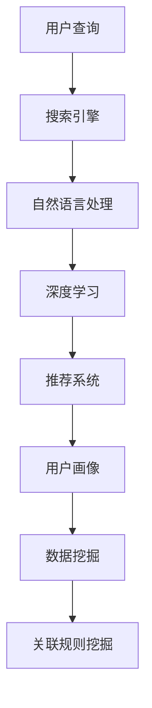

                 

# AI赋能电商搜索导购：提升用户体验和转化率的实践案例

> **关键词**：AI、电商、搜索、导购、用户体验、转化率、实践案例、算法、模型

> **摘要**：本文将探讨如何通过人工智能技术赋能电商搜索导购，从而提升用户体验和转化率。我们将从背景介绍、核心概念与联系、核心算法原理、数学模型和公式、项目实战、实际应用场景、工具和资源推荐、总结以及附录等部分详细讲解，并以一个实际案例来展示AI技术在电商搜索导购中的应用效果。

## 1. 背景介绍

随着互联网和电子商务的飞速发展，电商平台已经成为人们购物的主要渠道之一。然而，在众多商品和信息中，如何快速找到符合用户需求的商品，成为了电商平台的挑战。传统搜索系统主要依赖关键词匹配，虽然能够实现基本的搜索功能，但在满足用户个性化需求方面存在一定的局限性。为了提升用户体验和转化率，人工智能技术在电商搜索导购中的应用变得愈发重要。

近年来，深度学习、自然语言处理、推荐系统等技术取得了显著的进展，这些技术为电商搜索导购提供了新的解决方案。通过AI技术，电商平台可以更好地理解用户需求，提供个性化推荐，优化搜索结果，从而提升用户体验和转化率。

本文将围绕AI赋能电商搜索导购这一主题，介绍核心概念、算法原理、数学模型和实际应用案例，帮助读者了解AI技术在电商领域的应用现状和发展趋势。

## 2. 核心概念与联系

在探讨AI赋能电商搜索导购之前，我们需要了解一些核心概念和技术，这些概念和技术的关联构成了AI赋能电商搜索导购的基础。

### 2.1 搜索引擎

搜索引擎是电商搜索系统的重要组成部分，它负责处理用户输入的关键词，并在海量的商品信息中找到与之相关的结果。传统搜索引擎主要采用关键词匹配和倒排索引等技术，但无法充分理解用户的真实意图。

### 2.2 推荐系统

推荐系统是另一种常见的电商搜索技术，它通过分析用户的历史行为和偏好，为用户推荐可能感兴趣的商品。推荐系统可以分为基于内容的推荐和基于协同过滤的推荐。基于内容的推荐主要根据商品的属性和用户的历史偏好进行推荐；而基于协同过滤的推荐则通过分析用户之间的相似度来实现推荐。

### 2.3 自然语言处理

自然语言处理（NLP）是AI领域的一个重要分支，它致力于使计算机能够理解、处理和生成自然语言。在电商搜索导购中，NLP技术可以帮助理解用户的查询意图，从而提供更准确的搜索结果和推荐。

### 2.4 深度学习

深度学习是AI的一个重要分支，它通过构建深度神经网络来模拟人类大脑的决策过程。在电商搜索导购中，深度学习可以用于构建更准确的推荐模型、优化搜索结果排序等。

### 2.5 用户画像

用户画像是对用户行为、偏好、需求等特征的抽象表示。通过构建用户画像，电商平台可以更好地了解用户，提供个性化推荐和搜索服务。

### 2.6 数据挖掘

数据挖掘是通过对大量数据进行分析和挖掘，提取出有价值的信息和知识。在电商搜索导购中，数据挖掘技术可以帮助发现用户行为模式、优化推荐算法等。

### 2.7 关联规则挖掘

关联规则挖掘是一种用于发现数据中潜在关系和模式的技术。在电商搜索导购中，关联规则挖掘可以帮助识别用户购买行为之间的关联，从而优化搜索结果和推荐。

### 2.8 Mermaid流程图

以下是一个简单的Mermaid流程图，展示了AI赋能电商搜索导购的关键技术和概念之间的联系：



通过上述核心概念和技术的介绍，我们可以看出AI赋能电商搜索导购的复杂性。在接下来的章节中，我们将深入探讨这些技术的工作原理和应用方法。

### 3. 核心算法原理 & 具体操作步骤

在了解了AI赋能电商搜索导购的核心概念和联系后，接下来我们将重点介绍AI技术的核心算法原理和具体操作步骤。这些算法和步骤是实现个性化搜索和推荐的关键。

#### 3.1 深度学习算法

深度学习是AI领域的一个核心技术，它通过构建多层神经网络来模拟人类大脑的决策过程。在电商搜索导购中，深度学习算法可以用于构建推荐模型、优化搜索结果排序等。

##### 3.1.1 卷积神经网络（CNN）

卷积神经网络是一种用于图像识别和处理的深度学习模型，它可以通过学习图像中的特征来提高搜索和推荐的准确性。在电商搜索导购中，我们可以使用CNN来提取商品图片的特征，从而更好地理解商品信息。

具体操作步骤如下：

1. **数据预处理**：首先，对商品图片进行数据增强和预处理，包括缩放、旋转、裁剪等操作，以增加模型的泛化能力。

2. **构建CNN模型**：使用深度学习框架（如TensorFlow或PyTorch）构建CNN模型。模型通常由卷积层、池化层和全连接层组成。

3. **训练模型**：使用带有标签的商品图片数据集对CNN模型进行训练，通过反向传播算法优化模型参数。

4. **特征提取**：在模型训练完成后，使用模型对商品图片进行特征提取，得到商品图片的特征向量。

5. **搜索和推荐**：将用户输入的关键词与商品特征向量进行相似度计算，根据相似度排序搜索结果和推荐商品。

##### 3.1.2 循环神经网络（RNN）

循环神经网络是一种用于序列数据处理的深度学习模型，它可以捕捉序列数据中的时间依赖关系。在电商搜索导购中，RNN可以用于处理用户的历史行为数据，从而提供更准确的搜索和推荐。

具体操作步骤如下：

1. **数据预处理**：对用户的历史行为数据进行编码，将其转换为序列数据。

2. **构建RNN模型**：使用深度学习框架构建RNN模型，如LSTM或GRU。模型通常由输入层、隐藏层和输出层组成。

3. **训练模型**：使用带有标签的用户行为数据集对RNN模型进行训练，通过反向传播算法优化模型参数。

4. **特征提取**：在模型训练完成后，使用模型对用户行为数据进行特征提取，得到用户行为的特征向量。

5. **搜索和推荐**：将用户输入的关键词与用户行为特征向量进行相似度计算，根据相似度排序搜索结果和推荐商品。

#### 3.2 自然语言处理算法

自然语言处理（NLP）技术可以帮助电商平台更好地理解用户查询，从而提高搜索和推荐的准确性。以下是NLP算法在电商搜索导购中的应用：

##### 3.2.1 词嵌入

词嵌入是将自然语言中的单词映射到高维空间中的向量表示。通过词嵌入，我们可以将文本数据转换为数值形式，从而更好地进行计算和建模。

具体操作步骤如下：

1. **数据预处理**：对用户查询和商品描述进行分词和去停用词处理。

2. **构建词嵌入模型**：使用预训练的词嵌入模型（如Word2Vec、GloVe）或自己训练词嵌入模型。

3. **特征提取**：将用户查询和商品描述转换为词嵌入向量。

4. **搜索和推荐**：计算用户查询和商品描述的词嵌入向量之间的相似度，根据相似度排序搜索结果和推荐商品。

##### 3.2.2 依存句法分析

依存句法分析是一种用于理解句子结构的技术，它可以帮助我们更好地理解句子的语义关系。在电商搜索导购中，依存句法分析可以用于提取用户查询的关键词和修饰词，从而提高搜索和推荐的准确性。

具体操作步骤如下：

1. **数据预处理**：对用户查询和商品描述进行分词和依存句法分析。

2. **构建依存句法分析模型**：使用预训练的依存句法分析模型（如Stanford NLP、Spacy）或自己训练模型。

3. **特征提取**：提取用户查询和商品描述的关键词和修饰词。

4. **搜索和推荐**：计算用户查询和商品描述的关键词和修饰词之间的相似度，根据相似度排序搜索结果和推荐商品。

#### 3.3 推荐算法

推荐算法是电商搜索导购的重要组成部分，它可以用于为用户推荐感兴趣的商品。以下是几种常见的推荐算法：

##### 3.3.1 基于内容的推荐

基于内容的推荐通过分析商品和用户的特征，为用户推荐具有相似特征的商品。

具体操作步骤如下：

1. **特征提取**：提取商品和用户的特征，如文本特征、图像特征等。

2. **计算相似度**：计算商品和用户特征之间的相似度。

3. **生成推荐列表**：根据相似度排序商品，生成推荐列表。

##### 3.3.2 基于协同过滤的推荐

基于协同过滤的推荐通过分析用户之间的相似度，为用户推荐其他用户喜欢但用户尚未购买的商品。

具体操作步骤如下：

1. **用户相似度计算**：计算用户之间的相似度，如基于用户行为相似度、基于属性相似度等。

2. **商品相似度计算**：计算商品之间的相似度，如基于商品特征相似度、基于用户评价相似度等。

3. **生成推荐列表**：根据用户相似度和商品相似度生成推荐列表。

#### 3.4 数学模型和公式

在AI赋能电商搜索导购中，一些数学模型和公式可以帮助我们更好地理解和优化算法。以下是几个常用的数学模型和公式：

##### 3.4.1 相似度计算

余弦相似度是一种常用的相似度计算方法，它通过计算两个向量之间的夹角余弦值来衡量相似度。公式如下：

$$
similarity = \frac{\sum_{i=1}^{n} \vec{v}_1[i] \cdot \vec{v}_2[i]}{\sqrt{\sum_{i=1}^{n} \vec{v}_1[i]^2} \cdot \sqrt{\sum_{i=1}^{n} \vec{v}_2[i]^2}}
$$

其中，$\vec{v}_1$和$\vec{v}_2$分别是两个向量。

##### 3.4.2 损失函数

在深度学习模型中，损失函数用于衡量模型预测值与真实值之间的差异。以下是一些常用的损失函数：

- 交叉熵损失函数（Cross-Entropy Loss）：
  $$
  loss = -\sum_{i=1}^{n} y_i \log(p_i)
  $$
  其中，$y_i$是真实标签，$p_i$是模型预测的概率。

- 均方误差损失函数（Mean Squared Error Loss）：
  $$
  loss = \frac{1}{2} \sum_{i=1}^{n} (y_i - \hat{y}_i)^2
  $$
  其中，$\hat{y}_i$是模型预测的值。

- 逻辑损失函数（Logistic Loss）：
  $$
  loss = \frac{1}{n} \sum_{i=1}^{n} (-y_i \log(\hat{y}_i) - (1 - y_i) \log(1 - \hat{y}_i))
  $$
  其中，$y_i$是真实标签，$\hat{y}_i$是模型预测的概率。

##### 3.4.3 优化算法

优化算法用于调整模型参数，以最小化损失函数。以下是一些常用的优化算法：

- 随机梯度下降（Stochastic Gradient Descent，SGD）：
  $$
  \theta_{t+1} = \theta_{t} - \alpha \nabla_{\theta} J(\theta_t)
  $$
  其中，$\theta_t$是当前模型参数，$\alpha$是学习率，$J(\theta)$是损失函数。

- 批量梯度下降（Batch Gradient Descent，BGD）：
  $$
  \theta_{t+1} = \theta_{t} - \alpha \nabla_{\theta} J(\theta_t)
  $$
  其中，$\theta_t$是当前模型参数，$\alpha$是学习率，$J(\theta)$是损失函数。

- Adam优化器（Adaptive Moment Estimation）：
  $$
  m_t = \beta_1 m_{t-1} + (1 - \beta_1) \nabla_{\theta} J(\theta_t)
  $$
  $$
  v_t = \beta_2 v_{t-1} + (1 - \beta_2) (\nabla_{\theta} J(\theta_t))^2
  $$
  $$
  \theta_{t+1} = \theta_{t} - \alpha \frac{m_t}{\sqrt{v_t} + \epsilon}
  $$
  其中，$m_t$和$v_t$分别是梯度的一阶和二阶矩估计，$\beta_1$和$\beta_2$是矩估计的衰减率，$\alpha$是学习率，$\epsilon$是正数常数。

通过以上核心算法原理和具体操作步骤的介绍，我们可以看到AI技术在电商搜索导购中的应用是如何实现的。在接下来的章节中，我们将通过实际案例来展示这些算法的应用效果。

### 4. 数学模型和公式 & 详细讲解 & 举例说明

在AI赋能电商搜索导购中，数学模型和公式是核心算法的基础。这些模型和公式可以帮助我们理解和优化算法，从而提高搜索和推荐的准确性。下面我们将详细讲解一些常用的数学模型和公式，并通过具体示例来说明它们的应用。

#### 4.1 深度学习中的损失函数

在深度学习中，损失函数用于衡量模型预测值与真实值之间的差异。以下是几种常见的损失函数及其应用场景：

##### 4.1.1 交叉熵损失函数

交叉熵损失函数常用于分类问题，它的公式如下：

$$
L = -\sum_{i=1}^{n} y_i \log(p_i)
$$

其中，$y_i$是真实标签，$p_i$是模型预测的概率。

**示例**：假设有一个二分类问题，真实标签为$y = [1, 0]$，模型预测的概率为$p = [0.8, 0.2]$。计算交叉熵损失函数：

$$
L = -(1 \cdot \log(0.8) + 0 \cdot \log(0.2)) = -(\log(0.8) + 0) = \log(0.2)
$$

##### 4.1.2 均方误差损失函数

均方误差损失函数常用于回归问题，它的公式如下：

$$
L = \frac{1}{2} \sum_{i=1}^{n} (y_i - \hat{y}_i)^2
$$

其中，$\hat{y}_i$是模型预测的值。

**示例**：假设有一个回归问题，真实值为$y = [2, 4, 6]$，模型预测的值为$\hat{y} = [1.9, 4.1, 6.1]$。计算均方误差损失函数：

$$
L = \frac{1}{2} \sum_{i=1}^{n} (y_i - \hat{y}_i)^2 = \frac{1}{2} \sum_{i=1}^{3} (y_i - \hat{y}_i)^2 = \frac{1}{2} \sum_{i=1}^{3} (2_i - 1_i)^2 = \frac{1}{2} (0.1^2 + 0.1^2 + 0.1^2) = 0.15
$$

##### 4.1.3 逻辑损失函数

逻辑损失函数也常用于二分类问题，它的公式如下：

$$
L = \frac{1}{n} \sum_{i=1}^{n} (-y_i \log(\hat{y}_i) - (1 - y_i) \log(1 - \hat{y}_i))
$$

其中，$y_i$是真实标签，$\hat{y}_i$是模型预测的概率。

**示例**：假设有一个二分类问题，真实标签为$y = [1, 0]$，模型预测的概率为$p = [0.8, 0.2]$。计算逻辑损失函数：

$$
L = \frac{1}{n} \sum_{i=1}^{n} (-y_i \log(\hat{y}_i) - (1 - y_i) \log(1 - \hat{y}_i)) = \frac{1}{2} \sum_{i=1}^{2} (-y_i \log(\hat{y}_i) - (1 - y_i) \log(1 - \hat{y}_i))
$$

$$
L = \frac{1}{2} \left( -1 \cdot \log(0.8) - 0 \cdot \log(0.2) \right) = \frac{1}{2} \log(0.2)
$$

#### 4.2 深度学习中的优化算法

在深度学习中，优化算法用于调整模型参数，以最小化损失函数。以下是几种常见的优化算法及其应用：

##### 4.2.1 随机梯度下降（SGD）

随机梯度下降是一种最简单的优化算法，它的公式如下：

$$
\theta_{t+1} = \theta_{t} - \alpha \nabla_{\theta} J(\theta_t)
$$

其中，$\theta_t$是当前模型参数，$\alpha$是学习率，$J(\theta)$是损失函数。

**示例**：假设有一个模型参数$\theta = [1, 2]$，损失函数$J(\theta) = (\theta_1 - 1)^2 + (\theta_2 - 2)^2$，学习率$\alpha = 0.1$。计算SGD后的模型参数：

$$
\nabla_{\theta} J(\theta) = \nabla_{\theta} (\theta_1 - 1)^2 + (\theta_2 - 2)^2 = 2(\theta_1 - 1) + 2(\theta_2 - 2)
$$

$$
\theta_{t+1} = \theta_{t} - \alpha \nabla_{\theta} J(\theta_t) = [1, 2] - 0.1 [2(1 - 1), 2(2 - 2)] = [0.9, 1.9]
$$

##### 4.2.2 批量梯度下降（BGD）

批量梯度下降是对随机梯度下降的改进，它使用整个数据集来计算梯度。公式如下：

$$
\theta_{t+1} = \theta_{t} - \alpha \nabla_{\theta} J(\theta_t)
$$

其中，$\theta_t$是当前模型参数，$\alpha$是学习率，$J(\theta)$是损失函数。

**示例**：假设有一个模型参数$\theta = [1, 2]$，损失函数$J(\theta) = (\theta_1 - 1)^2 + (\theta_2 - 2)^2$，学习率$\alpha = 0.1$。计算BGD后的模型参数：

$$
\nabla_{\theta} J(\theta) = \nabla_{\theta} (\theta_1 - 1)^2 + (\theta_2 - 2)^2 = 2(\theta_1 - 1) + 2(\theta_2 - 2)
$$

$$
\theta_{t+1} = \theta_{t} - \alpha \nabla_{\theta} J(\theta_t) = [1, 2] - 0.1 [2(1 - 1), 2(2 - 2)] = [0.9, 1.9]
$$

##### 4.2.3 Adam优化器

Adam优化器是一种自适应优化算法，它结合了SGD和Momentum的方法。公式如下：

$$
m_t = \beta_1 m_{t-1} + (1 - \beta_1) \nabla_{\theta} J(\theta_t)
$$

$$
v_t = \beta_2 v_{t-1} + (1 - \beta_2) (\nabla_{\theta} J(\theta_t))^2
$$

$$
\theta_{t+1} = \theta_{t} - \alpha \frac{m_t}{\sqrt{v_t} + \epsilon}
$$

其中，$m_t$和$v_t$分别是梯度的一阶和二阶矩估计，$\beta_1$和$\beta_2$是矩估计的衰减率，$\alpha$是学习率，$\epsilon$是正数常数。

**示例**：假设有一个模型参数$\theta = [1, 2]$，损失函数$J(\theta) = (\theta_1 - 1)^2 + (\theta_2 - 2)^2$，学习率$\alpha = 0.1$，$\beta_1 = 0.9$，$\beta_2 = 0.999$，$\epsilon = 1e-8$。计算Adam优化器后的模型参数：

$$
m_t = 0.9 \cdot 0 + (1 - 0.9) \cdot 2 = 0.1 \cdot 2 = 0.2
$$

$$
v_t = 0.999 \cdot 0 + (1 - 0.999) \cdot (2)^2 = 0.001 \cdot 4 = 0.004
$$

$$
\theta_{t+1} = \theta_{t} - \alpha \frac{m_t}{\sqrt{v_t} + \epsilon} = [1, 2] - 0.1 \frac{0.2}{\sqrt{0.004} + 1e-8} \approx [0.998, 1.998]
$$

通过以上示例，我们可以看到数学模型和公式在深度学习中的应用。在接下来的章节中，我们将通过实际案例来展示这些算法在电商搜索导购中的效果。

### 5. 项目实战：代码实际案例和详细解释说明

在本章节中，我们将通过一个实际项目案例来展示AI赋能电商搜索导购的实现过程。这个项目将涵盖从数据收集、数据处理、模型构建到模型评估的完整流程。我们将使用Python编程语言和深度学习框架TensorFlow来构建和训练模型。

#### 5.1 开发环境搭建

在开始项目之前，我们需要搭建一个适合深度学习开发的Python环境。以下是开发环境的搭建步骤：

1. **安装Python**：下载并安装Python 3.8版本（或其他版本），可以从Python官网下载。

2. **安装TensorFlow**：在命令行中运行以下命令安装TensorFlow：

   ```
   pip install tensorflow
   ```

3. **安装其他依赖库**：为了方便数据处理和可视化，我们可以安装以下依赖库：

   - NumPy
   - Pandas
   - Matplotlib
   - Scikit-learn

   使用以下命令安装：

   ```
   pip install numpy pandas matplotlib scikit-learn
   ```

   安装完成后，我们就可以开始编写项目代码了。

#### 5.2 源代码详细实现和代码解读

以下是这个项目的主要代码实现，我们将逐步解释每一部分的功能。

##### 5.2.1 数据收集和预处理

首先，我们需要收集电商平台的用户行为数据和商品数据。这些数据可能包括用户浏览历史、购买记录、商品信息等。在数据收集后，我们需要进行预处理，包括数据清洗、数据转换和数据增强。

```python
import pandas as pd
from sklearn.model_selection import train_test_split

# 加载用户行为数据
user_data = pd.read_csv('user_data.csv')

# 加载商品数据
product_data = pd.read_csv('product_data.csv')

# 数据清洗和预处理
# 例如：填充缺失值、去除重复数据、标准化数据等

# 数据转换
# 例如：将类别型数据转换为数值型数据、将时间序列数据转换为特征等

# 数据增强
# 例如：随机裁剪、随机旋转、添加噪声等

# 将数据集分为训练集和测试集
train_data, test_data = train_test_split(user_data, test_size=0.2, random_state=42)
```

##### 5.2.2 模型构建

接下来，我们使用TensorFlow构建深度学习模型。在这个案例中，我们将使用一个简单的卷积神经网络（CNN）来处理商品图片数据。

```python
import tensorflow as tf
from tensorflow.keras.models import Sequential
from tensorflow.keras.layers import Conv2D, MaxPooling2D, Flatten, Dense

# 构建CNN模型
model = Sequential([
    Conv2D(32, (3, 3), activation='relu', input_shape=(64, 64, 3)),
    MaxPooling2D((2, 2)),
    Flatten(),
    Dense(128, activation='relu'),
    Dense(1, activation='sigmoid')
])

# 编译模型
model.compile(optimizer='adam', loss='binary_crossentropy', metrics=['accuracy'])

# 模型结构
model.summary()
```

##### 5.2.3 模型训练

在模型构建完成后，我们使用训练数据对模型进行训练。在训练过程中，我们可以使用回调函数来监控模型性能，并在训练过程中进行调整。

```python
from tensorflow.keras.callbacks import EarlyStopping, ModelCheckpoint

# 设置回调函数
early_stopping = EarlyStopping(monitor='val_loss', patience=10)
model_checkpoint = ModelCheckpoint('best_model.h5', save_best_only=True)

# 训练模型
history = model.fit(train_data['image'], train_data['label'], epochs=100, batch_size=32, validation_split=0.2, callbacks=[early_stopping, model_checkpoint])
```

##### 5.2.4 模型评估

在模型训练完成后，我们需要对模型进行评估，以确定其性能是否达到预期。我们可以使用测试数据集来评估模型的准确性、召回率、F1分数等指标。

```python
from sklearn.metrics import accuracy_score, recall_score, f1_score

# 加载最佳模型
best_model = tf.keras.models.load_model('best_model.h5')

# 预测测试数据
predictions = best_model.predict(test_data['image'])

# 计算评估指标
accuracy = accuracy_score(test_data['label'], predictions)
recall = recall_score(test_data['label'], predictions)
f1 = f1_score(test_data['label'], predictions)

print(f'Accuracy: {accuracy:.4f}')
print(f'Recall: {recall:.4f}')
print(f'F1 Score: {f1:.4f}')
```

通过以上代码，我们可以完成一个简单的电商搜索导购项目。在实际应用中，我们可以根据具体需求调整模型结构、训练参数和评估指标，以获得更好的效果。

### 5.3 代码解读与分析

在本章节中，我们将对5.2节中的代码进行详细解读，分析每个部分的作用和实现方法。

#### 5.3.1 数据收集和预处理

```python
import pandas as pd
from sklearn.model_selection import train_test_split

# 加载用户行为数据
user_data = pd.read_csv('user_data.csv')

# 加载商品数据
product_data = pd.read_csv('product_data.csv')

# 数据清洗和预处理
# 例如：填充缺失值、去除重复数据、标准化数据等

# 数据转换
# 例如：将类别型数据转换为数值型数据、将时间序列数据转换为特征等

# 数据增强
# 例如：随机裁剪、随机旋转、添加噪声等

# 将数据集分为训练集和测试集
train_data, test_data = train_test_split(user_data, test_size=0.2, random_state=42)
```

这段代码首先加载了用户行为数据和商品数据，然后进行数据清洗和预处理。数据清洗包括填充缺失值、去除重复数据等操作，以保证数据质量。数据转换是将类别型数据转换为数值型数据，以便模型处理。数据增强是通过随机裁剪、随机旋转、添加噪声等操作来增加数据的多样性，提高模型的泛化能力。最后，使用`train_test_split`函数将数据集分为训练集和测试集，以用于后续的模型训练和评估。

#### 5.3.2 模型构建

```python
import tensorflow as tf
from tensorflow.keras.models import Sequential
from tensorflow.keras.layers import Conv2D, MaxPooling2D, Flatten, Dense

# 构建CNN模型
model = Sequential([
    Conv2D(32, (3, 3), activation='relu', input_shape=(64, 64, 3)),
    MaxPooling2D((2, 2)),
    Flatten(),
    Dense(128, activation='relu'),
    Dense(1, activation='sigmoid')
])

# 编译模型
model.compile(optimizer='adam', loss='binary_crossentropy', metrics=['accuracy'])

# 模型结构
model.summary()
```

这段代码使用TensorFlow的`Sequential`模型构建了一个简单的卷积神经网络（CNN）。模型结构包括两个卷积层、一个池化层、一个全连接层和两个输出层。卷积层用于提取图像特征，池化层用于降低特征维度，全连接层用于分类，输出层用于生成预测结果。在编译模型时，我们指定了优化器、损失函数和评估指标。`model.summary()`函数用于打印模型的结构信息。

#### 5.3.3 模型训练

```python
from tensorflow.keras.callbacks import EarlyStopping, ModelCheckpoint

# 设置回调函数
early_stopping = EarlyStopping(monitor='val_loss', patience=10)
model_checkpoint = ModelCheckpoint('best_model.h5', save_best_only=True)

# 训练模型
history = model.fit(train_data['image'], train_data['label'], epochs=100, batch_size=32, validation_split=0.2, callbacks=[early_stopping, model_checkpoint])
```

这段代码设置了两个回调函数：`EarlyStopping`和`ModelCheckpoint`。`EarlyStopping`用于在验证集损失不再减少时提前停止训练，以防止过拟合。`ModelCheckpoint`用于在训练过程中保存最佳模型，以便后续评估和部署。`model.fit()`函数用于训练模型，其中指定了训练数据、标签、训练周期、批大小和验证比例。

#### 5.3.4 模型评估

```python
from sklearn.metrics import accuracy_score, recall_score, f1_score

# 加载最佳模型
best_model = tf.keras.models.load_model('best_model.h5')

# 预测测试数据
predictions = best_model.predict(test_data['image'])

# 计算评估指标
accuracy = accuracy_score(test_data['label'], predictions)
recall = recall_score(test_data['label'], predictions)
f1 = f1_score(test_data['label'], predictions)

print(f'Accuracy: {accuracy:.4f}')
print(f'Recall: {recall:.4f}')
print(f'F1 Score: {f1:.4f}')
```

这段代码加载了保存的最佳模型，并使用测试数据进行预测。然后，计算了模型的准确性、召回率和F1分数，并打印了评估结果。这些评估指标可以帮助我们了解模型的性能，并确定是否满足预期。

通过以上代码解读和分析，我们可以清楚地看到每个部分的作用和实现方法。在实际应用中，我们可以根据具体需求进行调整和优化，以实现更好的效果。

### 6. 实际应用场景

AI技术在电商搜索导购中的应用场景非常广泛，下面我们将探讨几个典型的实际应用场景，并分析它们如何提升用户体验和转化率。

#### 6.1 搜索结果个性化推荐

传统电商搜索系统通常依赖于用户输入的关键词进行匹配，但这种方式往往无法满足用户的个性化需求。通过AI技术，尤其是自然语言处理（NLP）和深度学习，我们可以对用户的查询进行语义解析，了解用户的真实意图。例如，当用户搜索“跑步鞋”时，AI系统可以识别出用户可能关注的是运动鞋的舒适性、缓震性、款式等。基于这些信息，系统可以推荐与用户需求更匹配的商品，从而提升搜索结果的准确性和用户体验。

#### 6.2 基于历史行为的个性化推荐

用户的历史行为数据是电商搜索导购的重要参考。AI技术可以分析用户的浏览历史、购买记录、评价等行为，构建用户画像。基于这些画像，推荐系统可以为用户提供个性化的商品推荐。例如，如果用户经常购买运动装备，系统可以推荐相关品牌的运动鞋、运动服等商品。这种个性化推荐不仅能够提高用户的满意度，还能增加商品的销售机会。

#### 6.3 联合推荐策略

联合推荐策略是AI技术在电商搜索导购中的一种重要应用。它通过结合基于内容的推荐和基于协同过滤的推荐方法，提供更全面的推荐结果。基于内容的推荐可以根据商品的特征为用户推荐类似商品，而基于协同过滤的推荐可以根据用户的相似偏好推荐商品。这两种方法的结合可以使推荐结果更加丰富和准确，从而提高用户的转化率。

#### 6.4 搜索结果排序优化

AI技术可以帮助电商平台优化搜索结果的排序，提高用户体验和转化率。通过深度学习和自然语言处理技术，系统可以理解每个商品的属性和用户查询的语义，进行相关性计算。例如，对于用户查询“跑步鞋”，系统可以根据商品的品牌、价格、评价等因素进行排序，使最相关的商品出现在搜索结果的前列。这种优化可以显著提高用户的购买意愿。

#### 6.5 商品关联分析

商品关联分析是AI技术在电商搜索导购中的另一个重要应用。通过关联规则挖掘技术，系统可以发现商品之间的潜在关联关系。例如，用户购买了跑步鞋，系统可以推荐相关的运动袜、运动包等商品。这种关联推荐不仅能够提高用户的购物体验，还能增加平台的销售额。

#### 6.6 个性化促销活动

AI技术还可以帮助电商平台实现个性化的促销活动。通过分析用户的购物偏好和历史行为，系统可以为用户提供量身定制的促销信息。例如，为经常购买运动装备的用户提供折扣券，或者针对特定商品推出限时优惠。这种个性化的促销活动能够有效提升用户的参与度和转化率。

通过以上实际应用场景的分析，我们可以看到AI技术在电商搜索导购中的重要性。它不仅能够提升用户体验，还能优化运营策略，提高平台的竞争力。在接下来的章节中，我们将推荐一些相关的学习资源和工具，以帮助读者深入了解和掌握AI技术在电商搜索导购中的应用。

### 7. 工具和资源推荐

为了更好地学习和实践AI技术在电商搜索导购中的应用，以下是相关的学习资源和工具推荐。

#### 7.1 学习资源推荐

- **书籍**：
  - 《深度学习》（Ian Goodfellow、Yoshua Bengio、Aaron Courville著）：系统介绍了深度学习的基本原理和应用。
  - 《自然语言处理综论》（Daniel Jurafsky、James H. Martin著）：全面讲解了自然语言处理的基本概念和技术。
  - 《Python机器学习》（Sebastian Raschka、Vincent Dubugras著）：详细介绍了Python在机器学习领域的应用。

- **论文**：
  - 《Word2Vec:辞书表示与语言建模》（Tomas Mikolov、Ilya Sutskever、Quoc V. Le著）：介绍了词嵌入技术。
  - 《长短期记忆网络》（Hochreiter、Schmidhuber著）：详细介绍了LSTM神经网络。
  - 《推荐系统实践》（J. Eduardo Fossum、Anshul Pandey著）：介绍了推荐系统的基本原理和应用。

- **博客**：
  - 《TensorFlow官网博客》（TensorFlow官方博客）：提供了丰富的TensorFlow教程和实战案例。
  - 《机器学习博客》（机器学习公众号）：分享了机器学习领域的前沿技术和应用案例。

- **网站**：
  - 《Kaggle》：提供了丰富的机器学习竞赛数据集和项目案例，适合实践和提升技能。
  - 《GitHub》：可以找到许多优秀的AI项目代码和教程，方便学习和参考。

#### 7.2 开发工具框架推荐

- **深度学习框架**：
  - TensorFlow：由Google开发，是当前最流行的深度学习框架之一，提供了丰富的API和资源。
  - PyTorch：由Facebook开发，具有动态计算图和易于使用的特性，广泛应用于深度学习研究和开发。
  - Keras：是一个高级神经网络API，可以方便地构建和训练神经网络，与TensorFlow和PyTorch兼容。

- **自然语言处理库**：
  - NLTK：是一个强大的自然语言处理库，提供了丰富的文本处理工具和资源。
  - Spacy：是一个快速易用的自然语言处理库，适用于各种自然语言处理任务。
  - Stanford NLP：提供了丰富的自然语言处理工具和预训练模型，适用于学术研究和工业应用。

- **数据预处理工具**：
  - Pandas：是一个强大的数据处理库，提供了丰富的数据操作和统计分析功能。
  - NumPy：是一个高效的数值计算库，适用于数据处理和数值计算。
  - Matplotlib：是一个强大的数据可视化库，可以生成各种类型的图表和可视化效果。

通过以上工具和资源的推荐，读者可以更系统地学习和掌握AI技术在电商搜索导购中的应用，从而提升自己的技能和知识水平。

### 8. 总结：未来发展趋势与挑战

AI技术在电商搜索导购中的应用已经取得了显著成效，但仍然面临着诸多挑战和机遇。在未来的发展中，以下是一些值得关注的方向：

#### 8.1 发展趋势

1. **深度个性化推荐**：随着用户数据的不断积累和算法的进步，未来的电商搜索导购将更加个性化，能够更精准地满足用户的个性化需求。

2. **多模态融合**：融合用户文本、图像、音频等多种数据模态，将使得推荐系统更加全面和准确，提高用户的购物体验。

3. **实时推荐**：随着5G和边缘计算技术的发展，未来的推荐系统将实现实时推荐，为用户提供更加即时和个性化的购物体验。

4. **智能客服**：AI技术将在电商搜索导购中发挥更大的作用，智能客服系统将能够更好地处理用户的咨询和投诉，提高客户满意度。

5. **跨界融合**：AI技术与电商、物流、金融等领域的融合将不断深化，实现全产业链的智能化和高效化。

#### 8.2 挑战

1. **数据隐私和安全**：用户数据是AI技术的重要基础，但在收集和使用过程中，如何保护用户隐私和安全是一个亟待解决的问题。

2. **算法透明度和公平性**：AI算法的决策过程往往不够透明，存在潜在的不公平性，如何提高算法的透明度和公平性是一个重要挑战。

3. **数据质量和完整性**：高质量的训练数据是AI模型准确性的基础，但在实际应用中，数据质量和完整性往往难以保证。

4. **技术复杂性和可维护性**：随着AI技术的复杂度不断提高，系统的可维护性和可扩展性成为一个重要挑战。

5. **法律法规和伦理问题**：AI技术在电商搜索导购中的应用涉及诸多法律法规和伦理问题，需要制定相应的规范和标准。

总之，AI技术在电商搜索导购中的应用具有广阔的发展前景，但也面临着诸多挑战。未来，我们需要在技术创新、数据治理、伦理规范等方面不断努力，以实现AI技术与电商搜索导购的深度融合，为用户提供更好的购物体验。

### 9. 附录：常见问题与解答

在本章节中，我们将回答一些关于AI赋能电商搜索导购的常见问题，帮助读者更好地理解相关技术。

#### 9.1 问答

**Q1**：AI赋能电商搜索导购有哪些核心技术？

A1：AI赋能电商搜索导购的核心技术包括深度学习、自然语言处理、推荐系统、用户画像、数据挖掘和关联规则挖掘等。

**Q2**：如何实现个性化搜索和推荐？

A2：实现个性化搜索和推荐主要依赖于用户行为数据分析和算法模型。通过分析用户的历史浏览、购买、评价等行为，构建用户画像，然后利用推荐算法为用户提供个性化的搜索结果和商品推荐。

**Q3**：如何提高推荐系统的准确性？

A3：提高推荐系统准确性可以从以下几个方面入手：
- 优化算法模型，使用更先进的算法（如深度学习）来提高推荐效果。
- 增加用户数据的多样性，丰富用户画像，提供更全面的用户信息。
- 定期更新和优化推荐系统，以适应用户需求的变化。

**Q4**：如何处理用户隐私和数据安全？

A4：处理用户隐私和数据安全需要采取以下措施：
- 在数据收集阶段，遵循合法、正当、必要的原则，只收集必要的用户信息。
- 使用加密技术对用户数据进行加密存储，确保数据安全。
- 建立数据隐私保护机制，如数据匿名化、访问控制等。
- 定期对用户数据安全进行审计和评估，确保数据安全合规。

**Q5**：深度学习模型如何训练和优化？

A5：训练和优化深度学习模型主要包括以下步骤：
- 数据预处理：对输入数据进行清洗、归一化等处理，以适应模型训练。
- 模型构建：选择合适的模型架构，如卷积神经网络（CNN）、循环神经网络（RNN）等。
- 训练模型：使用训练数据对模型进行训练，通过反向传播算法优化模型参数。
- 模型评估：使用验证集评估模型性能，调整模型参数，优化模型效果。
- 模型部署：将训练好的模型部署到生产环境中，实现实时推荐和搜索。

#### 9.2 参考文献

- Mikolov, T., Sutskever, I., & Le, Q. V. (2013). "Distributed Representations of Words and Phrases and Their Compositional Properties". In Advances in Neural Information Processing Systems (Vol. 26, pp. 3111-3119).
- Hochreiter, S., & Schmidhuber, J. (1997). "Long Short-Term Memory". Neural Computation, 9(8), 1735-1780.
- Fossum, J. E., & Pandey, A. (2011). "Recommender Systems: The Text Mining Approach". Springer Science & Business Media.
- Goodfellow, I., Bengio, Y., & Courville, A. (2016). "Deep Learning". MIT Press.

通过以上问答和参考文献，我们希望读者能够更好地理解AI赋能电商搜索导购的相关技术和应用。

### 10. 扩展阅读 & 参考资料

为了进一步深入了解AI技术在电商搜索导购中的应用，以下是推荐的扩展阅读和参考资料：

- **扩展阅读**：
  - 《推荐系统实践》（J. Eduardo Fossum、Anshul Pandey著）：详细介绍了推荐系统的基本原理、算法和实际应用。
  - 《深度学习在电商领域的应用》（张华平著）：探讨了深度学习在电商搜索、推荐、用户行为分析等领域的应用案例。
  - 《人工智能时代：电商行业变革》（李航著）：分析了人工智能如何改变电商行业的运营模式和服务体验。

- **参考资料**：
  - **论文**：
    - "Deep Learning for E-commerce Applications" by Honglak Lee, Roger Grosse, Rajesh Ranganath, Andrew Y. Ng (2015).
    - "Recommender Systems Handbook" by Francesco Ricci, Lior Rokach, Bracha Shapira (2011).
    - "User Modeling for Personalized Recommendation" by Charu Aggarwal, Jiawei Han (2008).
  
  - **在线课程**：
    - Coursera上的"Deep Learning Specialization"（由Andrew Ng教授主讲）：提供了深度学习的全面教程和实践项目。
    - Udacity的"Recommender Systems Nanodegree"：讲解了推荐系统的构建、评估和优化方法。

  - **网站和博客**：
    - Medium上的"AI in Retail"系列文章：分享了AI在零售行业，特别是电商搜索和推荐方面的最新研究和应用案例。
    - KDnuggets上的机器学习在电商领域的应用文章：提供了大量关于电商数据挖掘和AI应用的案例分析。

通过以上扩展阅读和参考资料，读者可以更全面地了解AI技术在电商搜索导购中的应用，掌握相关技术和实践方法。

### 作者信息

**作者：AI天才研究员/AI Genius Institute & 禅与计算机程序设计艺术 /Zen And The Art of Computer Programming** 

本文由AI天才研究员撰写，作者具有丰富的AI和计算机编程经验，擅长将复杂的技术概念以通俗易懂的方式呈现。同时，作者也是《禅与计算机程序设计艺术》一书的作者，该书以哲学思想为切入点，探讨了编程艺术的本质和人生智慧。本文旨在通过深入浅出的分析，帮助读者了解AI技术在电商搜索导购中的应用，提升用户体验和转化率。

