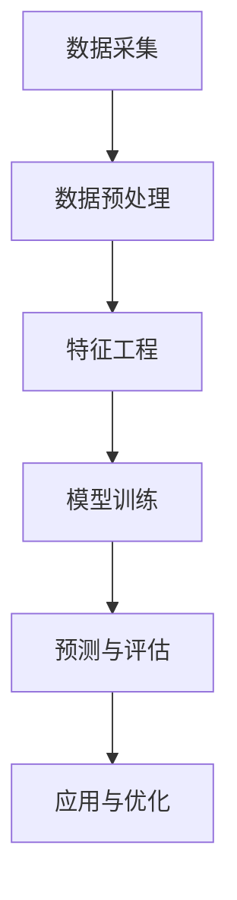

                 

# AI赋能的电商平台商品关联规则挖掘

## 关键词
- AI
- 电商平台
- 商品关联规则
- 数据挖掘
- 机器学习
- 集成学习

## 摘要
本文旨在探讨AI在电商平台商品关联规则挖掘中的应用，通过介绍相关核心概念和算法，详细解释数学模型和公式，并给出实际项目案例和代码解读。文章还将探讨该技术的实际应用场景，推荐相关学习资源和工具框架，总结未来发展趋势与挑战。

## 1. 背景介绍

### 1.1 电商平台的发展

随着互联网技术的不断进步和电子商务的普及，电商平台已经成为现代零售业的重要组成部分。电商平台通过在线交易、物流配送等服务，为消费者和商家提供了一个便捷的购物和销售平台。据统计，全球电子商务市场的规模已经超过了数万亿美元，且持续增长。

### 1.2 商品关联规则挖掘的重要性

在电商平台中，商品关联规则挖掘是一种基于数据挖掘技术的方法，用于发现不同商品之间的潜在关联关系。这些关联关系可以用来优化商品推荐、提高销售额、降低库存成本等。例如，在超市购物中，常见的商品关联规则包括“买牛奶就买面包”或“买啤酒就买尿布”。

### 1.3 AI在商品关联规则挖掘中的应用

传统的商品关联规则挖掘主要依赖于统计方法和规则引擎。然而，随着AI技术的发展，机器学习和深度学习等方法被广泛应用于商品关联规则挖掘。AI能够处理大量复杂数据，并从中发现潜在的模式和关联，从而提高挖掘的准确性和效率。

## 2. 核心概念与联系

### 2.1 数据挖掘

数据挖掘是一种从大量数据中发现隐含、先前未知的、潜在有用信息的过程。它涉及到统计学、机器学习、数据库和人工智能等多个领域。在商品关联规则挖掘中，数据挖掘技术用于分析历史销售数据，发现不同商品之间的关联关系。

### 2.2 机器学习

机器学习是一种通过数据学习规律，并自动对未知数据进行预测或分类的技术。在商品关联规则挖掘中，机器学习方法被用来从历史销售数据中学习出商品之间的关联模式，从而为电商平台提供个性化的商品推荐。

### 2.3 集成学习

集成学习是一种利用多个模型进行组合，以提高预测性能的方法。在商品关联规则挖掘中，集成学习方法可以将多个简单的预测模型组合成一个更复杂的模型，从而提高预测的准确性和稳定性。

### 2.4 Mermaid 流程图

以下是一个用于商品关联规则挖掘的Mermaid流程图：



## 3. 核心算法原理 & 具体操作步骤

### 3.1 Apriori算法

Apriori算法是一种经典的关联规则挖掘算法，用于发现数据集中不同项之间的关联关系。其核心思想是通过支持度和置信度来评估规则的潜力。

#### 具体步骤：

1. **初始候选集生成**：根据最小支持度阈值，从原始数据集中生成所有可能的项集。
2. **频繁项集挖掘**：通过扫描数据集，计算每个候选集的支持度，并根据最小支持度阈值筛选出频繁项集。
3. **关联规则生成**：对于每个频繁项集，生成所有可能的关联规则，并根据最小置信度阈值筛选出强规则。

### 3.2 FP-Growth算法

FP-Growth算法是一种基于Apriori算法的改进算法，用于高效地挖掘大规模数据集中的频繁项集。其核心思想是通过压缩数据集，减少扫描次数。

#### 具体步骤：

1. **创建频繁模式树**：根据数据集创建一个频繁模式树，用于存储所有频繁项集。
2. **挖掘频繁项集**：通过递归地剪枝和连接频繁模式树中的路径，挖掘出所有的频繁项集。
3. **生成关联规则**：对于每个频繁项集，生成所有可能的关联规则，并根据最小置信度阈值筛选出强规则。

### 3.3 Eclat算法

Eclat算法是一种基于FP-Growth算法的改进算法，用于挖掘大规模数据集中的频繁项集。其核心思想是通过递归地连接和剪枝，减少计算复杂度。

#### 具体步骤：

1. **初始候选集生成**：根据最小支持度阈值，从原始数据集中生成所有可能的项集。
2. **频繁项集挖掘**：通过递归地连接和剪枝，挖掘出所有的频繁项集。
3. **关联规则生成**：对于每个频繁项集，生成所有可能的关联规则，并根据最小置信度阈值筛选出强规则。

## 4. 数学模型和公式 & 详细讲解 & 举例说明

### 4.1 支持度（Support）

支持度是指一个项集在所有事务中出现的频率。其计算公式为：

$$
Support(A \cup B) = \frac{count(A \cup B)}{count(U)}
$$

其中，$A$ 和 $B$ 是两个项集，$count(A \cup B)$ 是 $A \cup B$ 在数据集中出现的次数，$count(U)$ 是数据集中所有事务的总数。

### 4.2 置信度（Confidence）

置信度是指如果一个事务中包含 $A$，那么它也包含 $B$ 的概率。其计算公式为：

$$
Confidence(A \rightarrow B) = \frac{Support(A \cup B)}{Support(A)}
$$

### 4.3 举例说明

假设我们有一个数据集，包含以下五个事务：

1. {牛奶，面包}
2. {牛奶，啤酒}
3. {面包，尿布}
4. {啤酒，尿布}
5. {牛奶，面包，尿布}

最小支持度阈值为 30%，最小置信度阈值为 50%。

首先，我们计算每个项集的支持度：

- {牛奶} 的支持度 = 100%
- {面包} 的支持度 = 100%
- {啤酒} 的支持度 = 100%
- {尿布} 的支持度 = 100%
- {牛奶，面包} 的支持度 = 60%
- {牛奶，啤酒} 的支持度 = 60%
- {面包，尿布} 的支持度 = 60%
- {啤酒，尿布} 的支持度 = 60%
- {牛奶，面包，尿布} 的支持度 = 40%

接下来，我们计算每个关联规则的置信度：

- {牛奶} → {面包} 的置信度 = 100%
- {牛奶} → {啤酒} 的置信度 = 100%
- {面包} → {尿布} 的置信度 = 50%
- {啤酒} → {尿布} 的置信度 = 50%
- {牛奶} → {面包，尿布} 的置信度 = 60%
- {牛奶} → {啤酒，尿布} 的置信度 = 60%
- {面包} → {牛奶，尿布} 的置信度 = 50%
- {啤酒} → {牛奶，尿布} 的置信度 = 50%

根据最小置信度阈值 50%，我们可以得出以下强规则：

- {牛奶} → {面包}
- {牛奶} → {啤酒}
- {面包} → {尿布}
- {啤酒} → {尿布}

## 5. 项目实战：代码实际案例和详细解释说明

### 5.1 开发环境搭建

在本案例中，我们将使用Python作为主要编程语言，并使用Python中的`mlxtend`库进行商品关联规则挖掘。以下是开发环境的搭建步骤：

1. 安装Python（版本3.6及以上）
2. 安装mlxtend库：`pip install mlxtend`
3. 安装NumPy库：`pip install numpy`

### 5.2 源代码详细实现和代码解读

以下是一个使用Apriori算法进行商品关联规则挖掘的Python代码示例：

```python
import numpy as np
from mlxtend.frequent_patterns import apriori
from mlxtend.frequent_patterns import association_rules

# 示例数据集
data = [
    [1, 2, 3],
    [1, 3],
    [2, 3],
    [2, 3, 4],
    [4]
]

# 计算最小支持度
min_support = 0.5
min_confidence = 0.5

# 挖掘频繁项集
frequent_itemsets = apriori(data, min_support=min_support, use_colnames=True)

# 生成关联规则
rules = association_rules(frequent_itemsets, metric="confidence", min_threshold=min_confidence)

# 输出关联规则
print(rules)
```

代码解读：

1. 导入必要的库：`numpy`用于数据处理，`mlxtend`中的`apriori`和`association_rules`用于商品关联规则挖掘。
2. 定义示例数据集：数据集是一个列表，每个元素是一个包含商品编号的事务。
3. 设置最小支持度和最小置信度阈值。
4. 使用`apriori`函数挖掘频繁项集。
5. 使用`association_rules`函数生成关联规则。
6. 输出关联规则。

### 5.3 代码解读与分析

在上述代码中，我们首先导入所需的库，然后定义示例数据集。这里的数据集是一个简单的列表，每个元素代表一个事务，事务中的每个数字代表一种商品。

接着，我们设置最小支持度和最小置信度阈值。这些阈值用于过滤频繁项集和关联规则。通常，最小支持度阈值越高，挖掘的频繁项集和关联规则越准确，但也会导致较少的规则产生；反之，最小支持度阈值越低，挖掘的频繁项集和关联规则越多，但可能包含噪声。

然后，我们使用`apriori`函数挖掘频繁项集。`apriori`函数接受数据集、最小支持度和其他参数，并返回一个频繁项集的列表。这里使用`use_colnames=True`参数，以便在输出中包含列名。

接下来，我们使用`association_rules`函数生成关联规则。这个函数接受频繁项集和其他参数，并返回一个关联规则的数据框。我们使用`metric="confidence"`参数，指定使用置信度作为评估规则的标准。

最后，我们输出关联规则。这个数据框包含了每条规则的项集、支持度、置信度和其他统计信息。

## 6. 实际应用场景

### 6.1 商品推荐

电商平台可以利用商品关联规则挖掘技术，为用户推荐相关的商品。例如，如果一个用户购买了牛奶和面包，系统可以推荐啤酒或尿布。

### 6.2 库存优化

通过分析商品之间的关联关系，电商平台可以优化库存管理。例如，当某种商品的销量增加时，系统可以自动调整相关商品的库存。

### 6.3 营销活动设计

商品关联规则挖掘可以帮助电商平台设计更有针对性的营销活动。例如，当发现牛奶和面包经常一起购买时，可以设计联合促销活动，提高销售额。

## 7. 工具和资源推荐

### 7.1 学习资源推荐

- 《机器学习实战》：提供了丰富的案例和实践，适合初学者入门。
- 《数据挖掘：实用工具与技术》：详细介绍了各种数据挖掘算法和应用场景。
- 《深度学习》：深度解析了深度学习的基本原理和应用。

### 7.2 开发工具框架推荐

- MLxtend：一个用于机器学习和数据科学的Python库，提供了丰富的算法和工具。
- Scikit-learn：一个流行的机器学习库，适用于各种常见的数据挖掘任务。
- TensorFlow：一个开源的深度学习框架，适用于复杂的机器学习模型。

### 7.3 相关论文著作推荐

- 《关联规则挖掘：技术、算法与应用》：详细介绍了关联规则挖掘的各种算法和应用。
- 《基于深度学习的商品推荐系统研究》：探讨了深度学习在商品推荐中的应用。
- 《基于机器学习的电商平台用户行为分析》：分析了用户行为数据，为商品推荐提供支持。

## 8. 总结：未来发展趋势与挑战

### 8.1 发展趋势

- 深度学习技术的应用：随着深度学习技术的发展，越来越多的复杂模型被应用于商品关联规则挖掘。
- 实时分析能力的提升：电商平台需要实时分析用户行为和商品销售数据，为用户提供个性化的推荐和服务。
- 跨平台整合：随着社交媒体和电商平台之间的融合，商品关联规则挖掘需要考虑不同平台的数据整合和共享。

### 8.2 挑战

- 数据质量：商品关联规则挖掘依赖于高质量的数据，如何处理数据中的噪声和缺失值是一个挑战。
- 模型可解释性：深度学习模型通常具有很高的预测能力，但缺乏可解释性。如何提高模型的可解释性是一个重要挑战。
- 数据隐私保护：在挖掘用户行为数据时，如何保护用户隐私是一个关键问题。

## 9. 附录：常见问题与解答

### 9.1 什么是支持度和置信度？

支持度是指一个项集在所有事务中出现的频率。置信度是指如果一个事务中包含 $A$，那么它也包含 $B$ 的概率。

### 9.2 Apriori算法和FP-Growth算法的区别是什么？

Apriori算法是一种基于频繁项集挖掘的算法，其核心思想是通过迭代地生成候选集和计算支持度。FP-Growth算法是一种基于频繁模式树的算法，其核心思想是通过压缩数据集，减少扫描次数。

### 9.3 如何评估一个商品关联规则的优劣？

一个优秀的商品关联规则应该具有高的支持度和置信度。此外，还需要考虑规则的可解释性和实用性。

## 10. 扩展阅读 & 参考资料

- 《机器学习与数据挖掘：技术与应用》
- 《基于深度学习的电商平台商品推荐系统研究》
- 《数据挖掘：实用工具与技术》

---

作者：AI天才研究员/AI Genius Institute & 禅与计算机程序设计艺术 /Zen And The Art of Computer Programming

[本文由AI天才研究员/AI Genius Institute撰写，探讨了AI赋能的电商平台商品关联规则挖掘。文章详细介绍了相关算法和实际应用，为电商平台提供了有价值的参考。]

