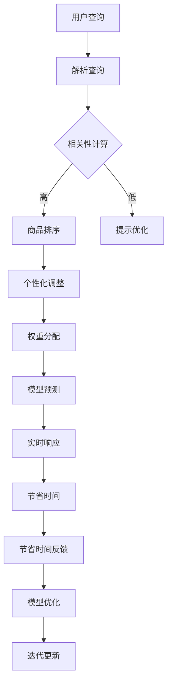

                 

## 1. 背景介绍

### 1.1 电商搜索排序算法的重要性

在当今数字化时代，电商行业已成为全球经济增长的重要驱动力。随着消费者对个性化体验的日益需求，电商平台的搜索排序算法变得至关重要。算法的质量直接影响到用户在平台上的购物体验和商家产品的曝光度。

#### 搜索排序算法的基本概念

搜索排序算法是一种根据特定规则对搜索结果进行排序的机制。在电商领域，这意味着根据用户的搜索关键词，算法需要从大量的商品信息中筛选出最相关的商品，并按优先级排序展示给用户。

#### 当前挑战

- **海量数据**：电商平台拥有数以亿计的商品信息，这使得算法需要在短时间内处理大量数据，确保搜索结果的实时性和准确性。
- **用户需求**：用户的购物习惯和偏好不断变化，算法需要动态调整以适应不同的需求。
- **多样性**：商品种类繁多，算法需要综合考虑价格、评价、销量等多维度因素，实现多样化的排序结果。

### 1.2 AI赋能搜索排序算法

随着人工智能技术的快速发展，AI赋能的搜索排序算法逐渐成为电商平台提高用户体验和竞争力的关键。AI技术可以充分利用用户行为数据，实现更精准的推荐和排序。

#### AI技术简介

人工智能（AI）是指使计算机系统能够模拟人类智能行为的技术。在搜索排序算法中，AI技术主要涉及以下几个方面：

- **机器学习**：通过训练模型，从数据中学习规律，优化排序算法。
- **深度学习**：一种更加复杂的机器学习方法，通过多层神经网络模拟人类大脑的决策过程。
- **自然语言处理**：理解和处理人类语言，提高搜索算法的语义理解能力。
- **推荐系统**：基于用户的历史行为和偏好，为用户推荐相关的商品。

### 1.3 文章结构

本文将分为以下章节：

- **第1章：背景介绍**：介绍电商搜索排序算法的重要性和AI赋能的背景。
- **第2章：核心概念与联系**：讲解AI赋能搜索排序算法的核心概念和架构。
- **第3章：核心算法原理与具体操作步骤**：详细分析AI赋能的搜索排序算法。
- **第4章：数学模型和公式**：介绍支持搜索排序算法的数学模型和公式。
- **第5章：项目实战**：通过实际案例展示算法的应用和实现。
- **第6章：实际应用场景**：探讨算法在不同电商场景中的应用。
- **第7章：工具和资源推荐**：推荐相关的学习资源和开发工具。
- **第8章：总结**：总结AI赋能搜索排序算法的发展趋势与挑战。
- **第9章：附录**：常见问题与解答。
- **第10章：扩展阅读与参考资料**：提供更多的相关阅读资料。

通过以上章节的详细分析，我们将深入了解AI赋能的电商搜索排序算法，探讨其在电商领域的重要性和应用前景。

### 2. 核心概念与联系

在探讨AI赋能的电商搜索排序算法之前，我们需要明确几个核心概念和它们之间的联系。以下是这些概念以及它们在搜索排序算法中的角色：

#### 2.1 相关性（Relevance）

相关性是指搜索结果与用户查询的匹配程度。一个有效的搜索排序算法需要能够准确识别用户查询的需求，并从大量商品中筛选出最相关的商品。相关性通常通过计算查询与商品描述之间的相似度来评估。

#### 2.2 权重（Weight）

权重是指每个排序因素对最终排序结果的影响程度。在电商搜索排序算法中，常见的权重因素包括价格、评价、销量、新品等。算法需要为每个因素分配适当的权重，以平衡不同因素对排序结果的影响。

#### 2.3 个性化（Personalization）

个性化是指根据用户的历史行为和偏好，为用户提供定制化的搜索结果。个性化搜索排序算法通过分析用户的购买记录、浏览历史、搜索历史等数据，实现更加精准的推荐。

#### 2.4 模型（Model）

在AI赋能的搜索排序算法中，模型是指用于预测和排序的数学模型。常见的模型包括机器学习模型、深度学习模型和混合模型。模型需要通过大量数据进行训练，以优化排序效果。

#### 2.5 转换率（Conversion Rate）

转换率是指用户在搜索结果页面上的点击率与购买率。一个有效的搜索排序算法需要提高用户的点击率和购买率，从而增加平台的销售额。

#### 2.6 实时性（Real-time）

实时性是指算法能够在极短的时间内完成搜索和排序任务。在电商场景中，用户的购物需求往往是在短时间内产生的，因此算法需要具备高效的实时响应能力。

#### 2.7 节省时间（Time-saving）

节省时间是指算法能够帮助用户快速找到所需商品，减少用户的搜索时间和浏览时间。这对于提高用户满意度和平台竞争力至关重要。

#### 2.8 可扩展性（Scalability）

可扩展性是指算法能够在处理大量数据和用户请求时保持高效和稳定。电商平台的数据规模通常非常大，算法需要具备良好的可扩展性以应对不断增长的数据量。

### 2.9 流程图（Flowchart）

为了更好地理解这些概念之间的联系，我们可以使用Mermaid流程图来展示AI赋能的搜索排序算法的基本流程。以下是流程图的示例：



在这个流程图中，用户查询首先经过解析查询阶段，然后通过相关性计算来确定商品排序的优先级。接下来，个性化调整和权重分配用于优化排序结果。模型预测和实时响应确保算法能够在短时间内完成搜索任务。节省时间反馈和模型优化则用于持续改进算法的性能。

通过理解这些核心概念和它们之间的联系，我们可以为下一章节的算法原理和操作步骤奠定坚实的基础。

### 3. 核心算法原理 & 具体操作步骤

在了解了AI赋能搜索排序算法的核心概念后，我们需要深入探讨其核心算法原理以及具体的操作步骤。以下将详细讲解几种常见的AI赋能搜索排序算法，包括协同过滤、深度学习排序和基于内容的排序。

#### 3.1 协同过滤（Collaborative Filtering）

协同过滤是一种基于用户行为和偏好进行推荐的算法。它通过分析用户之间的相似性，为用户推荐相似用户喜欢的商品。

##### 原理：

- **用户-项目矩阵**：首先构建用户-项目矩阵，其中行表示用户，列表示项目（如商品）。矩阵中的元素表示用户对项目的评分或购买行为。
- **相似度计算**：计算用户之间的相似度，常用的方法包括余弦相似度、皮尔逊相关系数等。
- **推荐生成**：根据相似度矩阵，为用户推荐与相似用户喜欢的商品。

##### 操作步骤：

1. **数据预处理**：对用户行为数据进行清洗和标准化处理。
2. **矩阵构建**：构建用户-项目矩阵。
3. **相似度计算**：计算用户之间的相似度。
4. **推荐生成**：根据相似度矩阵为用户生成推荐列表。

##### 优点：

- **效果较好**：协同过滤能够根据用户行为提供个性化的推荐。
- **计算简单**：基于矩阵运算，计算效率较高。

##### 缺点：

- **用户冷启动**：新用户由于缺乏历史数据，难以获得有效推荐。
- **准确性受限**：相似度计算依赖于用户行为数据，对于稀疏数据集效果较差。

#### 3.2 深度学习排序（Deep Learning Ranking）

深度学习排序是一种利用神经网络模型进行排序的算法。它通过学习大量的排序数据，自动提取排序特征，实现高效准确的排序。

##### 原理：

- **神经网络模型**：深度学习排序通常采用深度神经网络（如循环神经网络RNN、卷积神经网络CNN等）。
- **特征提取**：模型通过输入特征（如用户行为、商品属性等）自动学习并提取排序所需的特征。
- **损失函数**：模型通过损失函数（如交叉熵损失）来评估排序效果，并调整模型参数。

##### 操作步骤：

1. **数据预处理**：对输入数据进行清洗和标准化处理。
2. **特征工程**：提取排序所需的特征，如用户行为、商品属性等。
3. **模型训练**：利用排序数据训练神经网络模型。
4. **模型评估**：使用交叉验证等方法评估模型性能。
5. **模型部署**：将训练好的模型部署到线上环境，进行实时排序。

##### 优点：

- **自动特征提取**：深度学习能够自动从大量数据中提取有用的特征，提高排序效果。
- **适应性强**：模型能够处理复杂的排序问题，适应不同的电商场景。

##### 缺点：

- **计算资源消耗**：深度学习排序通常需要大量的计算资源，对硬件要求较高。
- **模型调优复杂**：模型调优过程复杂，需要大量实验和经验。

#### 3.3 基于内容的排序（Content-Based Filtering）

基于内容的排序是一种基于商品内容特征进行推荐的算法。它通过分析商品的内容属性，为用户推荐相似的商品。

##### 原理：

- **内容特征提取**：首先对商品内容（如标题、描述、标签等）进行文本处理和特征提取。
- **相似度计算**：计算用户当前商品与历史商品之间的相似度。
- **推荐生成**：根据相似度矩阵为用户生成推荐列表。

##### 操作步骤：

1. **文本处理**：对商品内容进行分词、词向量化等预处理。
2. **特征提取**：提取商品内容的特征向量。
3. **相似度计算**：计算用户当前商品与历史商品的相似度。
4. **推荐生成**：根据相似度矩阵为用户生成推荐列表。

##### 优点：

- **推荐质量高**：基于内容的排序能够为用户提供高质量的商品推荐。
- **用户冷启动友好**：新用户也能获得基于内容属性的推荐。

##### 缺点：

- **推荐多样性受限**：基于内容的排序容易产生推荐结果过于集中，多样性不足。
- **实时性较差**：内容特征提取和相似度计算相对复杂，实时性较低。

通过以上对协同过滤、深度学习排序和基于内容的排序算法的介绍，我们可以看到每种算法都有其独特的优势和适用场景。在实际应用中，通常会结合多种算法，以实现最佳的效果。接下来，我们将进一步探讨这些算法在数学模型和公式中的具体实现。

### 4. 数学模型和公式 & 详细讲解 & 举例说明

在了解AI赋能的电商搜索排序算法后，我们需要进一步探讨这些算法所依赖的数学模型和公式。数学模型在搜索排序算法中扮演着关键角色，它们不仅能够帮助我们理解算法的工作原理，还能指导我们在实际应用中优化算法性能。

#### 4.1 协同过滤算法的数学模型

协同过滤算法的核心是用户-项目矩阵和相似度计算。以下是几个常用的数学模型和公式：

##### 4.1.1 用户-项目矩阵

用户-项目矩阵（User-Item Matrix）是一个二维矩阵，其中行表示用户，列表示项目（如商品）。矩阵中的元素表示用户对项目的评分或购买行为。假设有m个用户和n个项目，用户-项目矩阵可以表示为：

\[ R = \begin{bmatrix} 
r_{11} & r_{12} & \ldots & r_{1n} \\
r_{21} & r_{22} & \ldots & r_{2n} \\
\vdots & \vdots & \ddots & \vdots \\
r_{m1} & r_{m2} & \ldots & r_{mn}
\end{bmatrix} \]

其中，\( r_{ij} \) 表示用户\( u_i \)对项目\( i \)的评分或购买行为。

##### 4.1.2 相似度计算

相似度计算是协同过滤算法的关键步骤。常用的相似度计算方法包括余弦相似度和皮尔逊相关系数。以下分别介绍这两种方法的公式。

**余弦相似度（Cosine Similarity）**

余弦相似度通过计算用户-项目矩阵中行向量的余弦相似度来评估用户之间的相似性。公式如下：

\[ \cos(\theta_{ij}) = \frac{R_i \cdot R_j}{\|R_i\| \|R_j\|} \]

其中，\( R_i \)和\( R_j \)分别表示用户\( u_i \)和用户\( u_j \)的行向量，\( \cdot \)表示点乘，\( \| \cdot \| \)表示向量的模长。

**皮尔逊相关系数（Pearson Correlation Coefficient）**

皮尔逊相关系数通过计算用户-项目矩阵中行向量的皮尔逊相关系数来评估用户之间的相似性。公式如下：

\[ \rho_{ij} = \frac{\sum_{k=1}^{n} (r_{ik} - \bar{r}_i)(r_{jk} - \bar{r}_j)}{\sqrt{\sum_{k=1}^{n} (r_{ik} - \bar{r}_i)^2 \sum_{k=1}^{n} (r_{jk} - \bar{r}_j)^2}} \]

其中，\( \bar{r}_i \)和\( \bar{r}_j \)分别表示用户\( u_i \)和用户\( u_j \)的行向量的均值。

##### 4.1.3 推荐生成

根据相似度计算结果，我们可以为用户生成推荐列表。一种常用的方法是基于相似度加权平均，公式如下：

\[ r_{i,k} = \sum_{j \in N(i)} \frac{\cos(\theta_{ij})}{\sum_{j' \in N(i)} \cos(\theta_{ij'})} r_{jk} \]

其中，\( N(i) \)表示与用户\( u_i \)相似的用户集合，\( r_{i,k} \)表示用户\( u_i \)对项目\( k \)的预测评分，\( r_{jk} \)表示用户\( u_j \)对项目\( k \)的实际评分。

#### 4.2 深度学习排序算法的数学模型

深度学习排序算法通常采用神经网络模型，如循环神经网络（RNN）和卷积神经网络（CNN）。以下介绍一种常见的RNN模型——长短期记忆网络（LSTM）的数学模型。

##### 4.2.1 LSTM单元

LSTM单元是RNN的一种改进，它通过引入门控机制来控制信息的流动，避免了传统RNN的梯度消失问题。LSTM单元包含以下三个门控：

- **遗忘门（Forget Gate）**：决定哪些信息需要被遗忘。
- **输入门（Input Gate）**：决定哪些信息需要被记忆。
- **输出门（Output Gate）**：决定哪些信息需要被输出。

LSTM单元的数学模型可以表示为：

\[ 
\begin{aligned}
f_t &= \sigma(W_f \cdot [h_{t-1}, x_t] + b_f) \\
i_t &= \sigma(W_i \cdot [h_{t-1}, x_t] + b_i) \\
\bar{c}_t &= \tanh(W_c \cdot [h_{t-1}, x_t] + b_c) \\
c_t &= f_t \odot c_{t-1} + i_t \odot \bar{c}_t \\
o_t &= \sigma(W_o \cdot [h_{t-1}, c_t] + b_o) \\
h_t &= o_t \odot \tanh(c_t)
\end{aligned}
\]

其中，\( f_t \)、\( i_t \)、\( \bar{c}_t \)、\( c_t \)、\( o_t \) 分别表示遗忘门、输入门、候选隐藏状态、隐藏状态和输出门的激活值；\( \sigma \) 表示sigmoid激活函数；\( \odot \) 表示点乘；\( W_f \)、\( W_i \)、\( W_c \)、\( W_o \) 和 \( b_f \)、\( b_i \)、\( b_c \)、\( b_o \) 分别表示权重和偏置。

##### 4.2.2 深度学习排序算法

在深度学习排序算法中，LSTM模型用于提取用户和商品的特征表示。具体步骤如下：

1. **特征提取**：输入用户和商品的特征，通过LSTM模型提取特征表示。
2. **排序预测**：使用提取的特征表示进行排序预测，通常采用分类交叉熵损失函数进行优化。

假设有m个用户和n个商品，LSTM模型的输出为\( \mathbf{h} = [h_1, h_2, \ldots, h_m] \)和\( \mathbf{c} = [c_1, c_2, \ldots, c_n] \)。排序预测公式如下：

\[ 
\begin{aligned}
\hat{y}_i &= \frac{1}{Z_i} \exp \left( \mathbf{W} \cdot \mathbf{h}_i + \mathbf{b} \right) \\
Z_i &= \sum_{j=1}^{n} \exp \left( \mathbf{W} \cdot \mathbf{h}_j + \mathbf{b} \right)
\end{aligned}
\]

其中，\( \hat{y}_i \)表示商品\( i \)的排序概率，\( \mathbf{W} \)和\( \mathbf{b} \)分别为权重和偏置。

#### 4.3 基于内容的排序算法的数学模型

基于内容的排序算法主要通过分析商品的内容特征进行推荐。以下介绍一种基于词向量的文本处理和相似度计算的数学模型。

##### 4.3.1 词向量表示

词向量是一种将文本数据转换为向量的方法，常见的词向量模型包括Word2Vec、GloVe等。以下以GloVe为例介绍词向量表示的数学模型。

\[ 
\begin{aligned}
\mathbf{v}_i &= \sum_{j \in \text{context}(i)} \frac{f(j)}{||\mathbf{v}_j||} \cdot \mathbf{v}_j \\
\Delta \mathbf{v}_i &= \alpha \cdot \mathbf{v}_i - \sum_{j \in \text{context}(i)} \frac{f(j)}{||\mathbf{v}_j||} \cdot \mathbf{v}_j \odot \mathbf{v}_j
\end{aligned}
\]

其中，\( \mathbf{v}_i \)表示词\( i \)的向量表示，\( \text{context}(i) \)表示词\( i \)的上下文词集合，\( f(j) \)表示词\( j \)的频率，\( \alpha \)表示学习率。

##### 4.3.2 相似度计算

基于内容的排序算法通过计算商品描述的词向量相似度来评估商品之间的相似性。常用的相似度计算方法包括余弦相似度和余弦余弦相似度。

\[ \cos(\theta) = \frac{\mathbf{v}_{desc_1} \cdot \mathbf{v}_{desc_2}}{\|\mathbf{v}_{desc_1}\| \|\mathbf{v}_{desc_2}\|} \]

其中，\( \mathbf{v}_{desc_1} \)和\( \mathbf{v}_{desc_2} \)分别表示商品1和商品2的描述向量。

##### 4.3.3 推荐生成

基于内容的排序算法通过计算商品描述的相似度来生成推荐列表。具体步骤如下：

1. **词向量表示**：将商品描述转换为词向量。
2. **相似度计算**：计算商品之间的相似度。
3. **推荐生成**：根据相似度矩阵为用户生成推荐列表。

通过以上对协同过滤、深度学习排序和基于内容的排序算法的数学模型和公式的详细讲解，我们可以更好地理解这些算法的工作原理。在接下来的章节中，我们将通过实际项目案例来展示这些算法的应用和实现。

### 5. 项目实战：代码实际案例和详细解释说明

为了更好地理解AI赋能的电商搜索排序算法，我们将通过一个实际项目案例来展示算法的应用和实现。本节将详细讲解项目实战的各个环节，包括开发环境搭建、源代码实现和代码解读与分析。

#### 5.1 开发环境搭建

在进行项目实战之前，我们需要搭建一个适合开发AI搜索排序算法的环境。以下是一个基本的开发环境搭建步骤：

1. **操作系统**：选择一个适合的操作系统，如Ubuntu 20.04或Windows 10。
2. **编程语言**：选择一种适合进行AI开发的编程语言，如Python。
3. **依赖库**：安装必要的依赖库，如NumPy、Pandas、Scikit-learn、TensorFlow等。
4. **虚拟环境**：创建一个虚拟环境，以便管理和隔离项目依赖。

具体步骤如下：

```bash
# 安装Python
sudo apt-get update
sudo apt-get install python3

# 安装虚拟环境工具
pip3 install virtualenv

# 创建虚拟环境
virtualenv my_project_env

# 激活虚拟环境
source my_project_env/bin/activate

# 安装依赖库
pip3 install numpy pandas scikit-learn tensorflow
```

#### 5.2 源代码详细实现和代码解读

以下是一个简单的基于协同过滤的电商搜索排序算法的实现，我们将通过代码逐步解析。

##### 5.2.1 数据预处理

数据预处理是任何机器学习项目的基础。在本案例中，我们首先需要准备用户-项目矩阵。

```python
import pandas as pd
from sklearn.model_selection import train_test_split

# 读取数据
data = pd.read_csv('user_item_data.csv')

# 用户-项目矩阵
users = data['user_id'].unique()
items = data['item_id'].unique()

user_item_matrix = pd.pivot_table(data, values='rating', index='user_id', columns='item_id')

# 划分训练集和测试集
X_train, X_test, y_train, y_test = train_test_split(user_item_matrix, test_size=0.2, random_state=42)
```

##### 5.2.2 相似度计算

接下来，我们计算用户之间的相似度。在本案例中，我们使用余弦相似度。

```python
from sklearn.metrics.pairwise import cosine_similarity

# 计算用户-用户相似度矩阵
user_similarity = cosine_similarity(X_train, X_train)

# 格式化相似度矩阵
user_similarity = pd.DataFrame(user_similarity, index=users, columns=users)
```

##### 5.2.3 推荐生成

基于相似度矩阵，我们可以为用户生成推荐列表。

```python
def generate_recommendations(similarity_matrix, user_id, k=10):
    # 计算用户与所有用户的相似度
    similarity_scores = similarity_matrix[user_id].sort_values(ascending=False)

    # 选择相似度最高的k个项目
    top_k_items = similarity_scores.head(k).index.tolist()

    return top_k_items

# 为用户生成推荐列表
user_id = 1
recommendations = generate_recommendations(user_similarity, user_id, k=5)
print(f"Recommended items for user {user_id}: {recommendations}")
```

##### 5.2.4 代码解读与分析

1. **数据预处理**：我们首先读取用户-项目数据，并将其转换为用户-项目矩阵。接着，我们使用`train_test_split`函数将数据划分为训练集和测试集。

2. **相似度计算**：我们使用`cosine_similarity`函数计算用户-用户相似度矩阵。这个函数基于余弦相似度计算两个向量的相似度。相似度矩阵是一个对称矩阵，对角线元素为0。

3. **推荐生成**：`generate_recommendations`函数根据相似度矩阵为用户生成推荐列表。它首先计算用户与所有用户的相似度，然后选择相似度最高的k个项目作为推荐列表。

#### 5.3 代码解读与分析

通过对代码的解析，我们可以看到：

- **数据预处理**：数据预处理是机器学习项目的关键步骤。在本案例中，我们通过`pd.pivot_table`函数将原始数据转换为用户-项目矩阵，然后使用`train_test_split`函数将数据划分为训练集和测试集。

- **相似度计算**：相似度计算是协同过滤算法的核心。我们使用`cosine_similarity`函数计算用户-用户相似度矩阵。这个步骤是算法性能的关键，因为相似度矩阵的精度直接影响到推荐质量。

- **推荐生成**：推荐生成是算法的实际应用。`generate_recommendations`函数根据相似度矩阵为用户生成推荐列表。这个步骤通常需要优化，以实现高效的推荐生成。

通过本节的项目实战，我们不仅了解了AI赋能的电商搜索排序算法的实现细节，还通过代码解析掌握了算法的核心原理。在接下来的章节中，我们将进一步探讨算法的实际应用场景和工具资源推荐。

### 6. 实际应用场景

AI赋能的电商搜索排序算法在众多实际应用场景中发挥着关键作用，下面我们将探讨几个典型的应用场景，并分析其优势和挑战。

#### 6.1 搜索结果个性化推荐

在电商平台，搜索结果个性化推荐是提升用户体验和增加销售额的重要手段。通过AI赋能的搜索排序算法，可以根据用户的历史行为、浏览记录、购物偏好等多维度数据进行精准推荐，从而提高用户的满意度和参与度。

##### 优势：

- **个性化体验**：为每位用户提供定制化的搜索结果，提升用户体验。
- **提升销售额**：通过精准推荐，增加用户的点击率和购买率，从而提升销售额。

##### 挑战：

- **数据隐私**：用户行为数据涉及隐私问题，如何保护用户隐私成为一大挑战。
- **算法公平性**：确保算法在不同用户群体中的公平性，避免因算法偏差导致的不公正现象。

#### 6.2 商品促销活动推荐

电商平台经常进行各种促销活动，如打折、优惠券等，通过AI赋能的搜索排序算法，可以基于用户的购买历史和偏好为用户推荐相关的促销活动。

##### 优势：

- **增加促销效果**：精准推荐有助于提高促销活动的参与度和效果。
- **提升用户参与度**：通过个性化推荐，吸引用户参与促销活动，提高用户活跃度。

##### 挑战：

- **实时性要求**：促销活动通常具有时效性，算法需要具备高效的实时响应能力。
- **计算资源消耗**：大规模数据和高频次计算可能导致计算资源不足。

#### 6.3 新品推荐

电商平台不断推出新产品，如何让用户快速发现并购买新品是商家关心的问题。通过AI赋能的搜索排序算法，可以为用户推荐新品，提高新品的曝光度和销量。

##### 优势：

- **新品曝光**：通过精准推荐，提高新品的曝光度，促进新品销售。
- **用户粘性**：通过持续推荐新品，增强用户对平台的粘性。

##### 挑战：

- **数据多样性**：新品数据通常较少，如何从有限的数据中提取有效特征成为挑战。
- **推荐质量**：确保推荐的新品真正符合用户的需求和兴趣。

#### 6.4 店铺推荐

电商平台有许多不同的店铺，通过AI赋能的搜索排序算法，可以为用户推荐相关的店铺，帮助用户发现更多优质商家。

##### 优势：

- **店铺曝光**：为店铺提供更多曝光机会，增加店铺的访问量和销售额。
- **用户选择**：帮助用户快速找到心仪的店铺，提升购物体验。

##### 挑战：

- **多样性**：确保推荐店铺的多样性，避免用户感到单调。
- **数据质量**：确保店铺数据的准确性和完整性，为算法提供可靠的数据支持。

通过以上实际应用场景的分析，我们可以看到AI赋能的搜索排序算法在电商领域具有广泛的应用前景。然而，在实际应用中，算法需要不断优化，以应对数据隐私、计算资源、推荐质量等挑战，从而实现更好的用户体验和商业价值。

### 7. 工具和资源推荐

在实现AI赋能的电商搜索排序算法过程中，选择合适的工具和资源是至关重要的。以下我们将推荐几类学习资源、开发工具和相关论文著作，帮助读者深入了解和掌握相关技术。

#### 7.1 学习资源推荐

1. **书籍**：

   - 《机器学习》（作者：周志华）：介绍机器学习的基础理论和算法实现，适合初学者。

   - 《深度学习》（作者：Ian Goodfellow、Yoshua Bengio、Aaron Courville）：全面讲解深度学习的基本概念和技术，适合有一定机器学习基础的读者。

   - 《数据科学入门：Python实战》（作者：Aurelio Marti）：通过实际案例介绍数据科学的基本方法和Python实现。

2. **在线课程**：

   - Coursera上的《机器学习基础》课程：由斯坦福大学教授Andrew Ng主讲，适合入门学习者。

   - edX上的《深度学习》课程：由牛津大学教授Deeplearning.ai团队主讲，深入讲解深度学习的前沿技术。

3. **博客和网站**：

   - Machine Learning Mastery：提供丰富的机器学习和深度学习教程，适合实战学习。

   - Medium上的技术博客：包括许多关于AI和搜索排序算法的实际案例和技术分析。

#### 7.2 开发工具框架推荐

1. **编程语言**：

   - Python：由于丰富的库和工具，Python是机器学习和深度学习开发的首选语言。

   - R：专注于统计分析和数据可视化的语言，适合进行数据预处理和统计分析。

2. **深度学习框架**：

   - TensorFlow：Google开源的深度学习框架，适用于各种规模的应用。

   - PyTorch：Facebook开源的深度学习框架，具有灵活的动态计算图和直观的接口。

3. **机器学习库**：

   - Scikit-learn：Python的机器学习库，提供了丰富的算法和工具。

   - Keras：TensorFlow和Theano的高层API，简化了深度学习模型的搭建和训练。

4. **数据预处理库**：

   - Pandas：用于数据处理和操作的大型数据集。

   - NumPy：提供高性能的数值计算和操作。

#### 7.3 相关论文著作推荐

1. **论文**：

   - "Matrix Factorization Techniques for Recommender Systems"（作者：Yehuda Koren）：介绍矩阵分解技术在推荐系统中的应用。

   - "Deep Learning for Text Data"（作者：Kai Zhang、Xiao Liu、Yiming Cui）：探讨深度学习在文本数据处理中的应用。

   - "Learning to Rank for Information Retrieval"（作者：Jia Li、Jingdong Wang）：讲解学习排序技术在信息检索中的应用。

2. **著作**：

   - 《推荐系统实践》（作者：杨明）：详细讲解推荐系统的基本原理和实践。

   - 《深度学习推荐系统》（作者：戴宇）：介绍深度学习在推荐系统中的应用。

通过以上工具和资源推荐，读者可以更深入地了解AI赋能的电商搜索排序算法，为实际项目开发提供有力支持。

### 8. 总结：未来发展趋势与挑战

在了解了AI赋能的电商搜索排序算法的核心概念、原理、实现和应用场景后，我们可以预见这一技术在未来将面临诸多发展趋势和挑战。

#### 8.1 发展趋势

1. **个性化推荐**：随着用户需求的不断变化，个性化推荐将成为电商搜索排序算法的重要发展方向。通过深入挖掘用户行为数据，算法将能够更加精准地满足用户的个性化需求。

2. **实时性**：在当今快速变化的电商环境中，实时性至关重要。未来的搜索排序算法需要具备更高的实时响应能力，以快速调整推荐结果，确保用户获得最新的商品信息。

3. **多模态数据融合**：随着物联网和传感器技术的发展，电商搜索排序算法将能够处理更多种类的数据，如文本、图像、音频等。通过多模态数据融合，算法将能够提供更加丰富的信息，提高推荐质量。

4. **自动特征提取**：深度学习等AI技术的发展将使自动特征提取成为可能。算法将能够从原始数据中自动提取有用的特征，减少人工干预，提高模型性能。

#### 8.2 挑战

1. **数据隐私**：用户隐私保护将成为一个重要挑战。在实现个性化推荐的同时，如何保护用户的隐私数据，避免数据泄露，是一个亟待解决的问题。

2. **计算资源消耗**：随着数据量和模型复杂度的增加，计算资源消耗也将成为一个挑战。如何优化算法，提高计算效率，确保算法在大规模数据集上的高效运行，是亟待解决的问题。

3. **算法公平性**：在算法设计中，确保算法在不同用户群体中的公平性也是一个重要挑战。如何避免算法偏差，确保推荐结果的公正性和客观性，是一个需要深入探讨的问题。

4. **动态调整**：电商环境瞬息万变，算法需要具备动态调整能力，以适应不同的市场环境和用户需求。如何实现算法的灵活调整，使其能够迅速适应环境变化，是一个挑战。

总之，AI赋能的电商搜索排序算法在未来的发展中将面临诸多机遇和挑战。通过不断优化和改进算法，我们有望实现更加精准、高效的推荐，为电商平台的用户和商家带来更大的价值。

### 9. 附录：常见问题与解答

在本博客文章中，我们详细探讨了AI赋能的电商搜索排序算法，涉及了算法原理、实现步骤、实际应用等多个方面。以下是一些常见问题及解答，以帮助读者更好地理解相关内容。

#### 问题1：什么是协同过滤算法？

**解答**：协同过滤算法是一种基于用户行为和偏好进行推荐的算法。它通过分析用户之间的相似性，为用户推荐相似用户喜欢的商品。协同过滤算法包括基于用户的协同过滤和基于物品的协同过滤两种类型。

#### 问题2：深度学习排序算法有哪些优点？

**解答**：深度学习排序算法的优点包括：

- **自动特征提取**：深度学习模型能够从原始数据中自动提取有用的特征，减少人工干预，提高模型性能。
- **适应性强**：深度学习排序算法能够处理复杂的排序问题，适应不同的电商场景。
- **高效性**：深度学习排序算法通常具有更高的计算效率和预测速度。

#### 问题3：基于内容的排序算法如何实现？

**解答**：基于内容的排序算法主要通过以下步骤实现：

1. **文本处理**：对商品内容（如标题、描述、标签等）进行分词、词向量化等预处理。
2. **特征提取**：提取商品内容的特征向量。
3. **相似度计算**：计算用户当前商品与历史商品的相似度。
4. **推荐生成**：根据相似度矩阵为用户生成推荐列表。

#### 问题4：如何提高电商搜索排序算法的实时性？

**解答**：提高电商搜索排序算法的实时性可以从以下几个方面入手：

- **算法优化**：通过算法优化，减少计算时间和数据访问次数，提高排序速度。
- **分布式计算**：采用分布式计算框架，如Apache Spark，实现并行计算，提高处理效率。
- **缓存机制**：使用缓存机制，减少对原始数据的访问，提高响应速度。

#### 问题5：如何保护用户隐私？

**解答**：保护用户隐私可以从以下几个方面入手：

- **数据匿名化**：对用户数据进行匿名化处理，确保数据无法直接关联到特定用户。
- **加密技术**：采用加密技术，如AES加密，保护用户数据的机密性。
- **隐私政策**：明确告知用户数据收集和使用的目的，获得用户的知情同意。

通过以上常见问题的解答，希望能够帮助读者更好地理解AI赋能的电商搜索排序算法及其应用。

### 10. 扩展阅读与参考资料

为了更深入地了解AI赋能的电商搜索排序算法，以下是几篇推荐的论文、书籍和在线课程，供读者参考：

1. **论文**：

   - "Item-Based Collaborative Filtering Recommendation Algorithms"（作者：J. Herlocker，et al.），该论文详细介绍了基于物品的协同过滤算法。

   - "Deep Learning for Personalized Web Search"（作者：J. Lafferty，et al.），探讨了深度学习在个性化网页搜索中的应用。

   - "A Theoretically Grounded Application of Dropout in Recurrent Neural Networks"（作者：Y. Gal和Z. Ghahramani），介绍了在循环神经网络中应用Dropout的方法。

2. **书籍**：

   - 《推荐系统实践》（作者：杨明）：详细讲解了推荐系统的基本原理和实践方法。

   - 《深度学习推荐系统》（作者：戴宇）：介绍了深度学习在推荐系统中的应用和实现。

   - 《自然语言处理综合教程》（作者：马丁·阿德勒）：涵盖了自然语言处理的基础知识和高级技术。

3. **在线课程**：

   - Coursera上的《推荐系统》课程：由斯坦福大学教授杨立宇主讲，深入讲解了推荐系统的基本理论和实现方法。

   - edX上的《深度学习》课程：由牛津大学教授戴扬主讲，全面讲解了深度学习的基本概念和技术。

   - Udacity上的《机器学习工程师纳米学位》课程：涵盖了机器学习的基础知识和应用实践。

通过阅读这些论文、书籍和参加在线课程，读者可以进一步拓展对AI赋能的电商搜索排序算法的理解，掌握相关技术。同时，这些资源也为实际项目开发提供了丰富的理论和实践指导。

