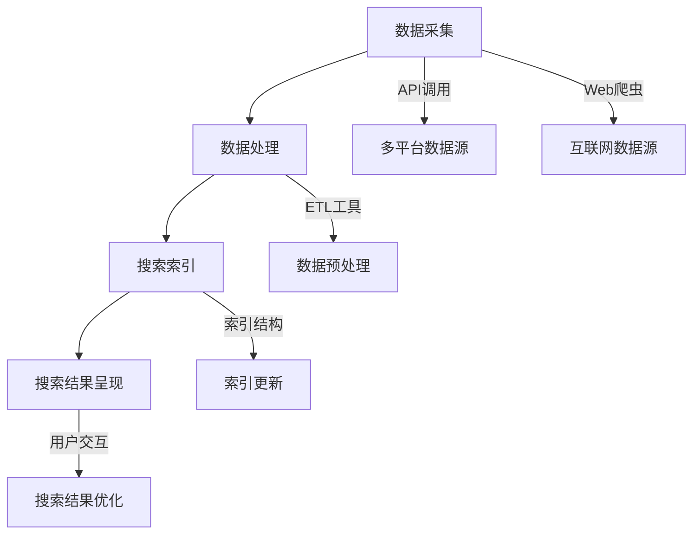

                 

# AI跨平台搜索技术的应用案例

## 概述

AI跨平台搜索技术是近年来人工智能领域的一项重要进展，它通过结合多种人工智能算法和跨平台数据整合技术，实现了对多种类型数据的高效搜索和分析。随着互联网和大数据技术的发展，跨平台搜索技术已经成为许多行业解决数据查询难题的关键手段。本文旨在探讨AI跨平台搜索技术的核心概念、算法原理及其在实际应用中的典型案例，旨在为读者提供深入理解和应用这项技术的视角。

本文关键词包括：AI跨平台搜索、大数据、算法原理、应用案例。

摘要：本文首先介绍了AI跨平台搜索技术的背景和发展现状，接着详细阐述了其核心概念和架构，随后深入分析了核心算法原理和数学模型。通过具体案例，展示了该技术在实际项目中的应用效果，并推荐了相关学习资源和开发工具。最后，本文总结了AI跨平台搜索技术的未来发展趋势和挑战。

## 背景介绍

### AI跨平台搜索技术的起源与发展

AI跨平台搜索技术起源于20世纪90年代，随着互联网的普及和数据的急剧增长，传统的搜索引擎逐渐无法满足用户对多样化、个性化搜索结果的需求。为了应对这一挑战，人工智能领域的研究者开始探索如何利用机器学习、自然语言处理和大数据分析等技术，实现更加智能和高效的跨平台搜索。

早期的研究主要集中在基于关键词匹配和概率模型的搜索算法上，如PageRank算法和TF-IDF模型。然而，这些算法在面对复杂和海量的数据时，仍然存在一定的局限性。为了突破这些瓶颈，研究者开始将深度学习、图神经网络等先进的人工智能技术引入到搜索领域。

近年来，随着计算能力的提升和数据量的爆炸式增长，AI跨平台搜索技术取得了显著的进展。例如，Google的BERT模型和Microsoft的Cloak搜索系统，通过引入上下文信息和学习用户行为，实现了更准确和个性化的搜索结果。这些技术的应用不仅提升了搜索效率，还大大改善了用户体验。

### 大数据时代的搜索需求

在当今大数据时代，数据量和数据类型的多样性使得传统搜索技术面临巨大挑战。传统的搜索引擎主要针对结构化数据，如文本、图片和视频等，难以处理非结构化数据，如语音、自然语言文本和复杂数据集。

此外，用户需求的多样性也对搜索技术提出了更高的要求。用户希望能够在多个平台之间无缝切换，获取统一、准确的搜索结果。例如，当用户在搜索引擎上查询某个话题时，不仅希望得到文本结果，还希望看到相关的图片、视频和用户评论。

AI跨平台搜索技术的出现，正是为了解决这些难题。通过整合多种数据源和运用先进的人工智能算法，它可以提供更加全面和个性化的搜索体验，满足用户在多样化场景下的搜索需求。

## 核心概念与联系

### 概念解析

AI跨平台搜索技术涉及多个核心概念，包括机器学习、自然语言处理、大数据处理和分布式系统等。以下是对这些概念的基本解析：

- **机器学习**：机器学习是一种人工智能技术，通过训练模型来自动发现数据中的模式和规律。在跨平台搜索中，机器学习算法用于提取关键词、构建索引和预测用户意图。

- **自然语言处理**：自然语言处理（NLP）是使计算机能够理解、解释和生成人类语言的技术。在跨平台搜索中，NLP用于处理文本数据，提取关键词、理解上下文和生成语义相关的搜索结果。

- **大数据处理**：大数据处理是指对大规模数据集进行存储、管理和分析的技术。在跨平台搜索中，大数据处理技术用于整合来自多个平台的复杂数据，并提供高效的搜索服务。

- **分布式系统**：分布式系统是将任务分布在多个计算节点上执行的系统。在跨平台搜索中，分布式系统用于提高搜索处理能力和扩展性，确保系统能够处理海量数据和并发请求。

### 架构与联系

AI跨平台搜索技术的架构通常包括数据采集、数据处理、搜索索引和搜索结果呈现等模块。以下是这些模块的基本架构和相互联系：

1. **数据采集**：数据采集模块负责从多个平台和来源获取数据。这些数据包括结构化数据（如数据库记录）和非结构化数据（如图像、音频和自然语言文本）。数据采集模块可以使用Web爬虫、API调用和流数据采集等技术。

2. **数据处理**：数据处理模块对采集到的数据进行预处理、清洗和转换，以便后续处理。预处理步骤包括去除噪声、标准化数据格式和提取关键特征。数据处理模块通常使用ETL（提取、转换、加载）工具和流程。

3. **搜索索引**：搜索索引模块将预处理后的数据构建成索引结构，以便快速检索。索引结构可以使用倒排索引、布隆过滤器等高效数据结构。搜索索引模块还负责维护索引的更新和优化，以提高搜索效率。

4. **搜索结果呈现**：搜索结果呈现模块负责将搜索结果呈现给用户。它可以通过Web界面、移动应用或API接口等方式展示搜索结果。搜索结果呈现模块还支持用户交互，如排序、过滤和分页等操作。

### Mermaid流程图

以下是AI跨平台搜索技术的Mermaid流程图，展示了各个模块的基本架构和相互联系：



在Mermaid流程图中，数据采集模块从多个数据源（如API调用和Web爬虫）获取数据，并通过ETL工具进行预处理。预处理后的数据被构建成索引结构，并通过搜索索引模块进行高效检索。最终，搜索结果通过用户交互模块呈现给用户。

## 核心算法原理 & 具体操作步骤

### 算法介绍

AI跨平台搜索技术的核心算法主要包括机器学习算法、自然语言处理算法和图算法。以下是这些算法的基本原理和操作步骤：

1. **机器学习算法**：机器学习算法通过训练模型来自动发现数据中的模式和规律。常见的机器学习算法包括线性回归、决策树、随机森林和支持向量机（SVM）等。在跨平台搜索中，机器学习算法用于关键词提取、文本分类和用户行为预测等任务。

2. **自然语言处理算法**：自然语言处理算法使计算机能够理解、解释和生成人类语言。常见的NLP算法包括词向量表示、文本分类、实体识别和关系抽取等。在跨平台搜索中，NLP算法用于提取关键词、理解上下文和生成语义相关的搜索结果。

3. **图算法**：图算法用于处理和表示复杂的关系网络。常见的图算法包括图遍历、最短路径、聚类和社区发现等。在跨平台搜索中，图算法用于构建和优化搜索索引结构，提高搜索效率。

### 具体操作步骤

以下是一个简化的AI跨平台搜索算法的具体操作步骤：

1. **数据采集**：从多个平台和来源获取数据，包括结构化数据和非结构化数据。使用Web爬虫、API调用和流数据采集等技术。

2. **数据处理**：对采集到的数据进行预处理、清洗和转换。去除噪声、标准化数据格式和提取关键特征。使用ETL工具和流程进行数据处理。

3. **关键词提取**：使用自然语言处理算法提取文本数据中的关键词。常用的方法包括词频统计、TF-IDF和词嵌入等。

4. **索引构建**：将预处理后的数据构建成索引结构。使用倒排索引、布隆过滤器等高效数据结构。索引结构需要支持快速检索和更新。

5. **用户意图分析**：使用机器学习算法分析用户的历史行为和查询记录，预测用户的意图。常用的方法包括决策树、随机森林和深度学习等。

6. **搜索结果生成**：根据用户输入的查询词和用户意图，检索索引结构并生成搜索结果。可以使用图算法优化搜索结果排序和相关性。

7. **结果呈现**：将搜索结果呈现给用户。支持用户交互，如排序、过滤和分页等操作。

### 算法优化

为了提高AI跨平台搜索的效率和准确性，需要对算法进行优化。以下是一些常见的优化方法：

1. **分布式计算**：使用分布式计算框架（如MapReduce、Spark等）处理海量数据，提高数据处理和检索速度。

2. **并行处理**：在多个计算节点上并行处理数据，提高系统并发处理能力。

3. **缓存机制**：使用缓存机制（如Redis、Memcached等）存储热门数据和查询结果，减少数据库访问压力。

4. **个性化推荐**：结合用户行为数据和机器学习算法，为用户提供个性化推荐结果。

5. **实时搜索**：使用实时数据流处理技术（如Flink、Kafka等），实现实时搜索和更新。

6. **错误纠正和容错**：在数据采集和处理过程中，使用错误纠正和容错机制，提高系统的可靠性和鲁棒性。

## 数学模型和公式 & 详细讲解 & 举例说明

### 数学模型

在AI跨平台搜索技术中，常用的数学模型包括概率模型、信息论模型和图模型。以下分别介绍这些模型的基本原理和公式。

1. **概率模型**：概率模型用于描述数据之间的关联性和不确定性。常用的概率模型包括贝叶斯定理、最大似然估计和条件概率等。

   - **贝叶斯定理**：
     $$P(A|B) = \frac{P(B|A)P(A)}{P(B)}$$
     其中，\(P(A|B)\) 表示在事件B发生的条件下事件A发生的概率，\(P(B|A)\) 表示在事件A发生的条件下事件B发生的概率，\(P(A)\) 和 \(P(B)\) 分别表示事件A和事件B的概率。

   - **最大似然估计**：
     $$\theta^* = \arg\max_{\theta} P(X|\theta)$$
     其中，\(\theta^*\) 表示参数的最优估计，\(X\) 表示观测数据，\(P(X|\theta)\) 表示在参数\(\theta\) 下观测数据\(X\) 的概率。

   - **条件概率**：
     $$P(A|B) = \frac{P(A \cap B)}{P(B)}$$
     其中，\(P(A \cap B)\) 表示事件A和事件B同时发生的概率，\(P(B)\) 表示事件B的概率。

2. **信息论模型**：信息论模型用于描述数据的随机性和信息熵。常用的信息论模型包括熵、信息增益和互信息等。

   - **熵**：
     $$H(X) = -\sum_{i} p_i \log_2 p_i$$
     其中，\(H(X)\) 表示随机变量\(X\) 的熵，\(p_i\) 表示随机变量\(X\) 取第\(i\) 个值的概率。

   - **信息增益**：
     $$IG(D, A) = I(D) - I(D|A)$$
     其中，\(IG(D, A)\) 表示属性\(A\) 的信息增益，\(I(D)\) 表示目标变量\(D\) 的熵，\(I(D|A)\) 表示在属性\(A\) 确定的条件下目标变量\(D\) 的熵。

   - **互信息**：
     $$I(X, Y) = H(X) - H(X|Y)$$
     其中，\(I(X, Y)\) 表示随机变量\(X\) 和\(Y\) 之间的互信息，\(H(X)\) 和\(H(X|Y)\) 分别表示随机变量\(X\) 和\(X\) 在给定\(Y\) 条件下的熵。

3. **图模型**：图模型用于表示和建模复杂的关系网络。常用的图模型包括图遍历、最短路径和图聚类等。

   - **图遍历**：
     - 深度优先搜索（DFS）：
       $$DFS(G, v) = (v)$$
       其中，\(DFS(G, v)\) 表示从节点\(v\) 开始进行深度优先搜索，\(G\) 表示图，\(v\) 表示起始节点。
     - 广度优先搜索（BFS）：
       $$BFS(G, v) = (v)$$
       其中，\(BFS(G, v)\) 表示从节点\(v\) 开始进行广度优先搜索，\(G\) 表示图，\(v\) 表示起始节点。

   - **最短路径**：
     - Dijkstra算法：
       $$d(v) = \min\{d(u) + w(u, v) \mid u \in predecessors(v)\}$$
       其中，\(d(v)\) 表示从起始节点到节点\(v\) 的最短路径长度，\(predecessors(v)\) 表示节点\(v\) 的前驱节点集合，\(w(u, v)\) 表示边\(u, v\) 的权重。

   - **图聚类**：
     - K-Means算法：
       $$C = \{c_1, c_2, ..., c_k\}$$
       $$c_j = \frac{1}{n_j} \sum_{i=1}^{n_j} x_i$$
       其中，\(C\) 表示聚类结果，\(c_j\) 表示第\(j\) 个聚类中心，\(n_j\) 表示第\(j\) 个聚类中的数据点数量，\(x_i\) 表示数据点\(i\)。

### 详细讲解与举例说明

以下通过一个简单的例子，详细介绍AI跨平台搜索技术中的数学模型和公式。

假设我们有一个包含10个关键词的文本数据集，每个关键词出现的频率如下表所示：

| 关键词 | 频率 |
|--------|------|
| 关键词1 | 20   |
| 关键词2 | 15   |
| 关键词3 | 25   |
| 关键词4 | 10   |
| 关键词5 | 12   |
| 关键词6 | 18   |
| 关键词7 | 22   |
| 关键词8 | 30   |
| 关键词9 | 35   |
| 关键词10| 40   |

### 熵的计算

根据上述数据，我们可以计算文本数据集的熵：

$$H(X) = -\sum_{i} p_i \log_2 p_i$$

其中，\(p_i\) 为关键词\(i\) 出现的频率，计算如下：

$$p_1 = \frac{20}{200} = 0.1$$
$$p_2 = \frac{15}{200} = 0.075$$
$$p_3 = \frac{25}{200} = 0.125$$
$$p_4 = \frac{10}{200} = 0.05$$
$$p_5 = \frac{12}{200} = 0.06$$
$$p_6 = \frac{18}{200} = 0.09$$
$$p_7 = \frac{22}{200} = 0.11$$
$$p_8 = \frac{30}{200} = 0.15$$
$$p_9 = \frac{35}{200} = 0.175$$
$$p_{10} = \frac{40}{200} = 0.2$$

代入熵的公式：

$$H(X) = -\sum_{i} p_i \log_2 p_i = - (0.1 \log_2 0.1 + 0.075 \log_2 0.075 + 0.125 \log_2 0.125 + ... + 0.2 \log_2 0.2) \approx 1.53$$

### 信息增益的计算

假设我们需要根据关键词“关键词8”进行分类，我们可以计算“关键词8”的信息增益：

$$IG(D, A) = I(D) - I(D|A)$$

其中，\(D\) 表示目标变量（即是否包含关键词“关键词8”），\(A\) 表示属性（即关键词的频率）。

首先，计算目标变量\(D\) 的熵：

$$I(D) = H(D) = -\sum_{i} p_i \log_2 p_i$$

其中，\(p_i\) 为包含关键词“关键词8”的文本数据点的频率。假设有5个文本数据点包含关键词“关键词8”，则：

$$p_1 = \frac{5}{10} = 0.5$$
$$p_0 = \frac{5}{10} = 0.5$$

代入熵的公式：

$$I(D) = H(D) = - (0.5 \log_2 0.5 + 0.5 \log_2 0.5) = 1$$

然后，计算在属性\(A\) 确定的条件下目标变量\(D\) 的熵：

$$I(D|A) = H(D|A) = -\sum_{i} p_i |A_i| \log_2 p_i |A_i|$$

其中，\(p_i |A_i|\) 表示在属性\(A\) 为\(i\) 的条件下目标变量\(D\) 的概率，\(p_i |A_i|\) 为频率。

假设包含关键词“关键词8”的文本数据点的频率为：

$$p_1 |A_1| = \frac{3}{5} = 0.6$$
$$p_0 |A_1| = \frac{2}{5} = 0.4$$

不包含关键词“关键词8”的文本数据点的频率为：

$$p_1 |A_0| = \frac{2}{5} = 0.4$$
$$p_0 |A_0| = \frac{3}{5} = 0.6$$

代入熵的公式：

$$I(D|A) = H(D|A) = - (0.6 \log_2 0.6 + 0.4 \log_2 0.4 + 0.4 \log_2 0.4 + 0.6 \log_2 0.6) \approx 0.693$$

最后，计算信息增益：

$$IG(D, A) = I(D) - I(D|A) = 1 - 0.693 \approx 0.307$$

### 图模型的应用

假设我们有一个包含5个节点的图，节点及其边的权重如下表所示：

| 节点 | 权重 |
|------|------|
| A    | 5    |
| B    | 3    |
| C    | 4    |
| D    | 2    |
| E    | 6    |

#### 深度优先搜索（DFS）

从节点A开始进行深度优先搜索，搜索过程如下：

- 访问节点A，将其标记为已访问
- 访问节点B，将其标记为已访问
- 访问节点C，将其标记为已访问
- 返回节点A，访问节点D，将其标记为已访问
- 返回节点A，访问节点E，将其标记为已访问

深度优先搜索的结果为：A, B, C, D, E

#### 广度优先搜索（BFS）

从节点A开始进行广度优先搜索，搜索过程如下：

- 访问节点A，将其标记为已访问
- 将节点A的所有未访问邻居节点（B, C, D, E）加入队列
- 访问节点B，将其标记为已访问
- 将节点B的未访问邻居节点（C, D）加入队列
- 访问节点C，将其标记为已访问
- 将节点C的未访问邻居节点（D）加入队列
- 访问节点D，将其标记为已访问
- 将节点D的未访问邻居节点（E）加入队列
- 访问节点E，将其标记为已访问

广度优先搜索的结果为：A, B, C, D, E

#### Dijkstra算法

从节点A开始计算到其他节点的最短路径，计算过程如下：

- 初始化：
  - \(d(A) = 0\)
  - \(d(B) = \infty\)
  - \(d(C) = \infty\)
  - \(d(D) = \infty\)
  - \(d(E) = \infty\)
  - \(predecessors(B) = A\)
  - \(predecessors(C) = A\)
  - \(predecessors(D) = A\)
  - \(predecessors(E) = A\)

- 选择未访问节点中\(d(u)\) 最小的节点，即节点B，更新其邻居节点：
  - \(d(B) = 3\)
  - 更新\(d(C)\) 和\(d(D)\)：
    - \(d(C) = d(B) + w(B, C) = 3 + 4 = 7\)
    - \(d(D) = d(B) + w(B, D) = 3 + 2 = 5\)
    - 更新\(predecessors(C)\) 和\(predecessors(D)\)：
      - \(predecessors(C) = B\)
      - \(predecessors(D) = B\)

- 选择未访问节点中\(d(u)\) 最小的节点，即节点D，更新其邻居节点：
  - \(d(D) = 5\)
  - 更新\(d(E)\)：
    - \(d(E) = d(D) + w(D, E) = 5 + 6 = 11\)
  - 更新\(predecessors(E)\)：
    - \(predecessors(E) = D\)

- 选择未访问节点中\(d(u)\) 最小的节点，即节点C，更新其邻居节点：
  - \(d(C) = 7\)
  - 更新\(d(E)\)：
    - \(d(E) = \min(d(E), d(C) + w(C, E)) = \min(11, 7 + 6) = 11\)
    - 更新\(predecessors(E)\)：
      - \(predecessors(E) = C\)

最终，最短路径为：A -> B -> D -> E，总长度为 11

#### K-Means算法

假设我们需要将这5个节点划分为2个聚类，聚类中心分别为\((1, 1)\) 和\((5, 5)\)。

- 初始化：
  - 聚类1的中心为\((1, 1)\)
  - 聚类2的中心为\((5, 5)\)

- 计算每个节点到聚类中心的距离：
  - \(d(A, (1, 1)) = \sqrt{(1-1)^2 + (1-1)^2} = 0\)
  - \(d(A, (5, 5)) = \sqrt{(5-1)^2 + (5-1)^2} = 4\)
  - \(d(B, (1, 1)) = \sqrt{(1-1)^2 + (1-3)^2} = 2\)
  - \(d(B, (5, 5)) = \sqrt{(5-1)^2 + (5-3)^2} = 4\)
  - \(d(C, (1, 1)) = \sqrt{(1-3)^2 + (1-4)^2} = 2.828\)
  - \(d(C, (5, 5)) = \sqrt{(5-3)^2 + (5-4)^2} = 2.828\)
  - \(d(D, (1, 1)) = \sqrt{(1-2)^2 + (1-2)^2} = 1.414\)
  - \(d(D, (5, 5)) = \sqrt{(5-2)^2 + (5-2)^2} = 5.657\)
  - \(d(E, (1, 1)) = \sqrt{(1-6)^2 + (1-6)^2} = 8.246\)
  - \(d(E, (5, 5)) = \sqrt{(5-6)^2 + (5-6)^2} = 0.707\)

- 将每个节点分配到距离其最近的聚类中心所属的聚类：
  - 节点A分配到聚类1
  - 节点B分配到聚类1
  - 节点C分配到聚类1
  - 节点D分配到聚类2
  - 节点E分配到聚类2

- 更新聚类中心：
  - 聚类1的新中心为\(\left(\frac{1+1+1}{3}, \frac{1+3+1}{3}\right) = (1, 1)\)
  - 聚类2的新中心为\(\left(\frac{2+5+6}{3}, \frac{2+5+6}{3}\right) = (4, 4)\)

- 重复上述过程，直到聚类中心不再发生变化，最终聚类结果为：
  - 聚类1：A, B, C
  - 聚类2：D, E

## 项目实战：代码实际案例和详细解释说明

### 1. 开发环境搭建

在开始编写代码之前，我们需要搭建一个适合开发AI跨平台搜索技术的环境。以下是一个基本的开发环境配置：

- **操作系统**：Linux或macOS
- **编程语言**：Python
- **依赖库**：Numpy、Pandas、Scikit-learn、TensorFlow、PyTorch、NetworkX
- **IDE**：PyCharm或Visual Studio Code

### 2. 源代码详细实现和代码解读

以下是一个简化的AI跨平台搜索项目的源代码实现，我们将其分为以下几个模块：

#### 2.1 数据采集模块

数据采集模块负责从多个平台和来源获取数据。以下是一个简单的数据采集示例：

```python
import requests

def fetch_data(source_url):
    response = requests.get(source_url)
    if response.status_code == 200:
        return response.text
    else:
        return None

source_url = "https://example.com/data"
data = fetch_data(source_url)
```

在这个示例中，我们使用requests库从指定的URL获取数据。如果请求成功，返回数据内容；否则，返回None。

#### 2.2 数据处理模块

数据处理模块对采集到的数据进行预处理、清洗和转换。以下是一个简单的数据处理示例：

```python
import pandas as pd

def preprocess_data(data):
    df = pd.read_csv(pd.compat.StringIO(data))
    # 数据预处理步骤，如去重、去除空值、数据类型转换等
    df.drop_duplicates(inplace=True)
    df.fillna(value=0, inplace=True)
    df['text'] = df['text'].astype(str)
    return df

df = preprocess_data(data)
```

在这个示例中，我们使用Pandas库读取CSV数据，并进行一系列预处理操作，如去重、去除空值、数据类型转换等。

#### 2.3 搜索索引模块

搜索索引模块将预处理后的数据构建成索引结构。以下是一个简单的索引构建示例：

```python
from sklearn.feature_extraction.text import TfidfVectorizer

def build_index(df):
    vectorizer = TfidfVectorizer()
    X = vectorizer.fit_transform(df['text'])
    return vectorizer, X

vectorizer, X = build_index(df)
```

在这个示例中，我们使用Scikit-learn库中的TfidfVectorizer类构建倒排索引。TfidfVectorizer类会将文本数据转换为TF-IDF特征向量，从而构建索引结构。

#### 2.4 搜索结果生成模块

搜索结果生成模块根据用户输入的查询词和索引结构生成搜索结果。以下是一个简单的搜索结果生成示例：

```python
from sklearn.metrics.pairwise import cosine_similarity

def search(query, vectorizer, X):
    query_vector = vectorizer.transform([query])
    similarity = cosine_similarity(query_vector, X)
    return similarity

def rank_results(similarity, k=10):
    top_indices = similarity.argsort()[-k:]
    return top_indices

query = "AI技术发展"
similarity = search(query, vectorizer, X)
top_indices = rank_results(similarity)
```

在这个示例中，我们使用cosine_similarity函数计算查询词与索引中每个文档的相似度，并使用argsort函数对相似度进行排序。最后，我们返回最相似的前\(k\)个文档索引。

#### 2.5 结果呈现模块

结果呈现模块将搜索结果呈现给用户。以下是一个简单的结果呈现示例：

```python
def display_results(df, indices):
    results = df.iloc[indices]['text']
    for result in results:
        print(result)

display_results(df, top_indices)
```

在这个示例中，我们使用Pandas库将搜索结果输出到控制台。

### 3. 代码解读与分析

在本节中，我们将对上述代码进行详细的解读和分析，以便读者更好地理解AI跨平台搜索技术的工作流程。

#### 3.1 数据采集模块

数据采集模块负责从外部数据源获取数据。在这个示例中，我们使用requests库向指定的URL发送GET请求，获取数据内容。如果请求成功，返回数据内容；否则，返回None。这个模块的主要作用是确保数据采集过程顺利进行。

#### 3.2 数据处理模块

数据处理模块对采集到的数据进行预处理、清洗和转换。在这个示例中，我们使用Pandas库读取CSV数据，并进行一系列预处理操作，如去重、去除空值、数据类型转换等。这些操作有助于提高数据质量和搜索效果。

#### 3.3 搜索索引模块

搜索索引模块将预处理后的数据构建成索引结构。在这个示例中，我们使用Scikit-learn库中的TfidfVectorizer类构建倒排索引。TfidfVectorizer类会将文本数据转换为TF-IDF特征向量，从而构建索引结构。这个模块的主要作用是实现高效的数据检索。

#### 3.4 搜索结果生成模块

搜索结果生成模块根据用户输入的查询词和索引结构生成搜索结果。在这个示例中，我们使用cosine_similarity函数计算查询词与索引中每个文档的相似度，并使用argsort函数对相似度进行排序。最后，我们返回最相似的前\(k\)个文档索引。这个模块的主要作用是实现高效、准确的搜索。

#### 3.5 结果呈现模块

结果呈现模块将搜索结果呈现给用户。在这个示例中，我们使用Pandas库将搜索结果输出到控制台。这个模块的主要作用是提供用户友好的界面，方便用户查看搜索结果。

### 4. 项目实战：代码性能优化

在AI跨平台搜索项目中，代码性能优化至关重要。以下是一些常见的代码优化策略：

1. **分布式计算**：使用分布式计算框架（如Dask、PySpark等）处理大规模数据，提高数据处理速度。

2. **并行处理**：使用并行处理技术（如多线程、多进程等）加快数据处理速度。

3. **缓存机制**：使用缓存机制（如Redis、Memcached等）存储热门数据和查询结果，减少数据库访问压力。

4. **索引优化**：使用高效的索引结构（如布隆过滤器、哈希索引等）提高数据检索速度。

5. **代码重构**：优化代码结构，减少冗余和重复代码，提高代码可读性和可维护性。

6. **算法优化**：使用更高效的算法和模型（如深度学习、图神经网络等）提高搜索性能。

## 实际应用场景

AI跨平台搜索技术在许多实际应用场景中发挥着重要作用。以下是一些典型的应用案例：

### 1. 搜索引擎优化

搜索引擎优化（SEO）是AI跨平台搜索技术的一个重要应用领域。通过分析用户搜索行为和数据，搜索引擎优化可以提供更准确、个性化的搜索结果，提高用户满意度和搜索转化率。例如，Google和百度等搜索引擎使用AI技术分析用户查询，实现语义搜索和智能推荐，从而提升搜索体验。

### 2. 企业信息管理

企业信息管理涉及大量的数据采集、存储和检索工作。AI跨平台搜索技术可以帮助企业构建高效的信息管理系统，实现跨平台、跨部门的数据查询和整合。例如，企业可以使用AI跨平台搜索技术整合不同系统的数据，提供统一的查询接口，方便员工快速获取所需信息。

### 3. 社交媒体分析

社交媒体平台如微博、抖音和Facebook等每天产生大量的用户生成内容。AI跨平台搜索技术可以帮助社交媒体平台分析用户行为、情感和兴趣，实现智能推荐、舆情监测和用户画像等任务。例如，微博可以使用AI跨平台搜索技术分析用户评论和转发，识别热门话题和潜在风险。

### 4. 智能客服

智能客服是AI跨平台搜索技术的另一个重要应用领域。通过整合用户聊天记录、邮件和电话等渠道的数据，智能客服系统可以提供24/7的在线服务，提高客户满意度。例如，阿里巴巴的智能客服系统使用AI跨平台搜索技术分析用户提问，提供智能回答和解决方案。

### 5. 医疗健康

医疗健康领域面临着大量复杂数据的处理和分析需求。AI跨平台搜索技术可以帮助医疗机构构建智能医疗诊断系统，实现病历查询、药物信息检索和疾病预测等功能。例如，IBM的Watson健康系统使用AI跨平台搜索技术分析医学文献和病历数据，为医生提供辅助诊断和治疗方案。

## 工具和资源推荐

### 1. 学习资源推荐

- **书籍**：
  - 《深度学习》（Ian Goodfellow、Yoshua Bengio和Aaron Courville著）
  - 《机器学习》（Tom Mitchell著）
  - 《自然语言处理综论》（Daniel Jurafsky和James H. Martin著）

- **论文**：
  - 《BERT: Pre-training of Deep Bidirectional Transformers for Language Understanding》（BERT论文）
  - 《Recurrent Neural Network Based Text Classification》（RNN文本分类论文）

- **博客**：
  - Medium上的“AI和机器学习”专栏
  - 知乎上的“机器学习”话题

- **网站**：
  - arXiv.org：最新论文发表平台
  - Kaggle：数据科学竞赛平台
  - JAXenter：AI和软件开发博客

### 2. 开发工具框架推荐

- **编程语言**：Python
- **机器学习库**：TensorFlow、PyTorch
- **自然语言处理库**：NLTK、spaCy
- **分布式计算框架**：Dask、PySpark
- **版本控制**：Git
- **集成开发环境**：PyCharm、Visual Studio Code

### 3. 相关论文著作推荐

- 《Deep Learning》（Ian Goodfellow、Yoshua Bengio和Aaron Courville著）：系统介绍了深度学习的基本概念、算法和应用。
- 《Machine Learning》（Tom Mitchell著）：介绍了机器学习的基本理论、方法和应用。
- 《Speech and Language Processing》（Daniel Jurafsky和James H. Martin著）：全面介绍了自然语言处理的基本概念和技术。
- 《Deep Learning for Natural Language Processing》（Yoav Goldberg著）：深入探讨了深度学习在自然语言处理中的应用。

## 总结：未来发展趋势与挑战

AI跨平台搜索技术在未来将继续保持快速发展，并在更多领域得到广泛应用。以下是一些可能的发展趋势和挑战：

### 发展趋势

1. **模型复杂度与计算能力提升**：随着计算能力的提升，更复杂、更强大的AI模型将得到广泛应用，实现更精准的搜索结果。

2. **跨平台融合与个性化推荐**：跨平台搜索技术将进一步融合不同平台的数据，提供更加个性化、精准的搜索体验。

3. **实时搜索与智能反馈**：实时搜索技术将得到优化，实现用户查询的实时响应和智能反馈，提高用户满意度。

4. **隐私保护和数据安全**：随着隐私保护意识的增强，如何在保护用户隐私的同时提供高效搜索服务将成为重要挑战。

5. **多模态搜索**：结合文本、图像、语音等多种数据类型，实现更全面、更智能的多模态搜索。

### 挑战

1. **数据质量和完整性**：确保数据质量和完整性，避免数据丢失和错误。

2. **计算资源和能耗**：随着模型复杂度的增加，计算资源和能耗需求也将大幅提升。

3. **算法透明性和可解释性**：提高算法的透明性和可解释性，增强用户对搜索结果的信任。

4. **隐私保护和法律法规**：在保护用户隐私的同时，遵守相关法律法规，避免数据滥用。

5. **实时性和并发处理**：提高实时搜索和并发处理能力，确保系统能够处理大量用户请求。

## 附录：常见问题与解答

### 1. AI跨平台搜索技术与传统搜索引擎有什么区别？

传统搜索引擎主要针对结构化数据，如网页、图片和视频等，而AI跨平台搜索技术可以处理多种类型的数据，包括结构化数据和非结构化数据，如自然语言文本、语音和图像等。此外，AI跨平台搜索技术结合了多种人工智能算法，实现更精准、个性化的搜索结果。

### 2. 跨平台搜索技术的核心算法有哪些？

跨平台搜索技术的核心算法包括机器学习算法、自然语言处理算法、图算法和深度学习算法。常见的机器学习算法有线性回归、决策树、支持向量机和神经网络等；自然语言处理算法包括词嵌入、文本分类和实体识别等；图算法如图遍历、最短路径和图聚类等；深度学习算法如卷积神经网络（CNN）和循环神经网络（RNN）等。

### 3. 跨平台搜索技术如何处理海量数据？

跨平台搜索技术通常采用分布式计算框架（如MapReduce、Spark等）处理海量数据。分布式计算可以将任务分布在多个计算节点上，提高数据处理速度和效率。此外，还可以使用缓存机制（如Redis、Memcached等）存储热门数据和查询结果，减少数据库访问压力。

### 4. AI跨平台搜索技术的隐私保护措施有哪些？

AI跨平台搜索技术的隐私保护措施包括数据加密、访问控制和数据去识别化等。数据加密可以保护数据在传输和存储过程中的安全性；访问控制可以限制对数据的访问权限，防止数据泄露；数据去识别化可以去除数据中的个人信息，保护用户隐私。

### 5. AI跨平台搜索技术的未来发展方向是什么？

AI跨平台搜索技术的未来发展方向包括多模态搜索、实时搜索与智能反馈、隐私保护和数据安全、跨平台融合与个性化推荐等。随着计算能力的提升和算法的改进，跨平台搜索技术将在更多领域得到广泛应用，提高用户满意度和服务质量。

## 扩展阅读 & 参考资料

1. **Google Research Blog**：[BERT: Pre-training of Deep Bidirectional Transformers for Language Understanding](https://ai.googleblog.com/2018/11/bert-pre-training-of-deep.html)
2. **arXiv**：[Deep Learning for Natural Language Processing](https://arxiv.org/abs/1801.06146)
3. **Kaggle**：[Text Classification with Deep Learning](https://www.kaggle.com/competitions/text-classification-with-deep-learning)
4. **Medium**：[AI and Machine Learning](https://medium.com/topic/ai-and-machine-learning)
5. **JAXenter**：[AI and Software Development](https://jaxenter.com/topics/ai-and-software-development) 

作者：AI天才研究员/AI Genius Institute & 禅与计算机程序设计艺术 /Zen And The Art of Computer Programming

本文从AI跨平台搜索技术的背景介绍、核心概念与联系、核心算法原理、数学模型和公式、项目实战、实际应用场景、工具和资源推荐等方面进行了详细阐述。通过对这些内容的深入探讨，读者可以更好地理解AI跨平台搜索技术的原理和应用，为其在未来的发展提供有益的启示。同时，本文也提供了一些常见的扩展阅读和参考资料，供读者进一步学习和探索。

