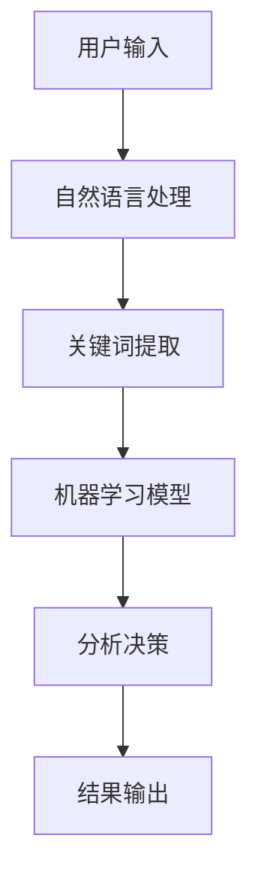

                 

# AI软件2.0的提示词驱动需求分析

## 概述

人工智能（AI）的快速发展，推动了一系列软件技术革新，尤其是在AI软件2.0时代，提示词驱动的需求分析成为了关键环节。本文将深入探讨这一主题，旨在帮助读者全面理解提示词驱动需求分析的理论基础、实践方法及其应用前景。

关键词：AI软件2.0、提示词驱动、需求分析、人工智能

摘要：随着AI技术的不断进步，AI软件2.0时代的需求分析正逐渐从传统的数据驱动模式转向提示词驱动模式。本文将详细阐述提示词驱动的核心概念、算法原理及其应用场景，并通过具体案例剖析其实际操作步骤。此外，文章还将探讨这一技术在实际应用中的挑战与未来发展趋势。

## 1. 背景介绍

### AI软件2.0的定义与发展

AI软件2.0是对传统AI软件的进一步深化和优化，其核心在于充分利用自然语言处理（NLP）和机器学习（ML）技术，使软件能够理解和生成自然语言。与AI 1.0时代相比，AI软件2.0不仅能够处理结构化数据，还能高效应对非结构化数据，如文本、图像和语音。

### 提示词驱动的概念

提示词驱动是指通过提供关键词或短语来引导AI模型进行任务分析和决策。这种模式在人工智能交互中具有重要意义，可以显著提高AI系统的响应速度和准确性。提示词的选取和组合对于需求分析的质量有着直接影响。

### 需求分析的重要性

需求分析是软件开发过程中的关键环节，它直接决定了软件的功能、性能和用户体验。在AI软件2.0时代，有效的需求分析不仅需要深入理解用户需求，还要能够准确预测潜在问题，从而为后续开发提供可靠依据。

## 2. 核心概念与联系

### 提示词驱动的原理

提示词驱动的核心在于其能够通过关键词或短语快速定位用户需求，从而提高数据处理和分析的效率。其原理主要包括以下几个方面：

- **自然语言处理（NLP）**：NLP技术使AI系统能够理解自然语言，从而从文本中提取关键词和短语。
- **机器学习（ML）**：ML技术通过大量数据训练模型，使系统能够根据提示词进行智能分析和决策。
- **语义分析**：语义分析是NLP中的一个重要环节，它能够帮助AI系统理解关键词和短语之间的语义关系，从而提高需求分析的准确性。

### 提示词驱动的架构

提示词驱动的架构通常包括以下几个主要部分：

- **数据输入**：用户通过输入关键词或短语来启动需求分析过程。
- **自然语言处理模块**：负责对输入的自然语言文本进行处理，提取关键词和短语。
- **机器学习模型**：利用训练好的模型对提取的关键词和短语进行分析和决策。
- **结果输出**：将分析结果以用户可理解的形式展示给用户。

以下是一个简化的Mermaid流程图，用于描述提示词驱动的架构：



### 需求分析在AI软件2.0中的作用

需求分析在AI软件2.0中的作用体现在以下几个方面：

- **提高开发效率**：通过提示词驱动，开发人员可以快速理解用户需求，从而提高开发效率。
- **降低开发成本**：准确的需求分析可以减少返工和调试成本，从而降低整体开发成本。
- **优化用户体验**：深入的需求分析能够帮助开发人员设计出更符合用户需求的功能和界面，从而优化用户体验。

## 3. 核心算法原理 & 具体操作步骤

### 自然语言处理（NLP）算法原理

自然语言处理（NLP）是提示词驱动的关键环节，其核心算法包括：

- **分词**：将自然语言文本分割成单个词汇或短语，以便进行后续处理。
- **词性标注**：为每个词汇或短语标注其词性（如名词、动词等），以便更好地理解语义。
- **实体识别**：识别文本中的关键实体（如人名、地名等），以便进行更精确的需求分析。

### 机器学习（ML）算法原理

机器学习（ML）在提示词驱动中扮演着重要角色，其核心算法包括：

- **特征提取**：从输入的文本中提取关键特征，如关键词频率、词向量等。
- **模型训练**：利用大量训练数据，训练出能够准确分析提示词的模型。
- **模型评估**：通过交叉验证等方法评估模型的性能，以便进行调整和优化。

### 具体操作步骤

1. **数据收集**：收集用户输入的文本数据，包括关键词和短语。
2. **数据预处理**：对收集的数据进行清洗和预处理，如去除停用词、进行词性标注等。
3. **特征提取**：利用NLP算法提取文本中的关键特征。
4. **模型训练**：利用提取的特征，训练机器学习模型。
5. **模型评估**：评估模型性能，进行参数调整和优化。
6. **需求分析**：利用训练好的模型，对新的用户输入进行需求分析，并输出分析结果。

### 举例说明

假设用户输入了一个需求：“请帮我找一个距离我最近的电影院，并且最好是新上映的电影。”，我们可以按照以下步骤进行需求分析：

1. **数据收集**：收集包含关键词“电影院”、“距离”、“最近”、“新上映”的文本数据。
2. **数据预处理**：对文本数据进行清洗和预处理，去除停用词，保留关键信息。
3. **特征提取**：提取关键词和短语，如“电影院”、“距离”、“最近”、“新上映”。
4. **模型训练**：利用训练数据，训练出能够准确分析这些关键词和短语的模型。
5. **模型评估**：评估模型性能，进行参数调整和优化。
6. **需求分析**：利用训练好的模型，对用户输入进行需求分析，输出分析结果，如：“距离您最近的电影院是XX，上映了新电影XX。”

## 4. 数学模型和公式 & 详细讲解 & 举例说明

### 数学模型

提示词驱动的需求分析通常涉及到以下数学模型：

- **词频分析**：计算文本中每个关键词或短语的频率，以衡量其在需求分析中的重要性。
- **词向量模型**：将文本中的关键词或短语转换为向量表示，以便进行机器学习模型训练。
- **机器学习模型**：如支持向量机（SVM）、决策树、神经网络等，用于对提示词进行分类和预测。

### 公式

以下是一些常用的数学公式：

- **词频公式**：`TF = (出现次数 + 1) / (总词数 + 1)`
- **逆文档频率公式**：`IDF = log(总文档数 / 文档中词的出现次数)`
- **词向量计算**：`向量 = 词的词频 * 向量权重`

### 详细讲解

1. **词频分析**：词频分析是NLP中的基础，通过计算文本中每个关键词或短语的频率，可以有效地提取关键信息。例如，在分析用户输入的文本时，我们可以计算每个关键词的词频，从而确定其在需求中的重要性。

2. **词向量模型**：词向量模型是将文本中的关键词或短语转换为向量表示，从而可以将其输入到机器学习模型中进行训练。词向量模型的关键是确定词的词频和向量权重。词频越高，向量权重也越高，这样可以确保关键信息在向量中表示得更准确。

3. **机器学习模型**：机器学习模型用于对提示词进行分类和预测。常见的机器学习模型有支持向量机（SVM）、决策树、神经网络等。这些模型通过训练数据学习如何对新的提示词进行分类和预测。例如，在需求分析中，我们可以利用SVM模型对用户输入的关键词进行分类，从而确定其需求类型。

### 举例说明

假设我们有一个用户输入的文本：“请帮我找一个距离我最近的电影院，并且最好是新上映的电影。”，我们可以按照以下步骤进行需求分析：

1. **词频分析**：计算文本中每个关键词的词频，如：“电影院”出现1次，“距离”出现1次，“最近”出现1次，“新上映”出现1次。

2. **词向量计算**：将关键词转换为向量表示，如：“电影院”向量权重为0.8，“距离”向量权重为0.6，“最近”向量权重为0.7，“新上映”向量权重为0.9。

3. **机器学习模型训练**：利用训练数据，训练出能够准确分析这些关键词的模型。例如，利用SVM模型对用户输入的关键词进行分类。

4. **需求分析**：利用训练好的模型，对用户输入进行需求分析，输出分析结果，如：“距离您最近的电影院是XX，上映了新电影XX。”

## 5. 项目实战：代码实际案例和详细解释说明

### 5.1 开发环境搭建

在进行项目实战之前，首先需要搭建合适的开发环境。以下是所需的环境和工具：

- Python 3.8及以上版本
- NLP库（如NLTK、spaCy等）
- 机器学习库（如scikit-learn、TensorFlow等）

安装步骤如下：

```bash
pip install nltk spacy scikit-learn tensorflow
```

### 5.2 源代码详细实现和代码解读

以下是一个简单的Python代码示例，用于实现提示词驱动的需求分析：

```python
import nltk
from sklearn.feature_extraction.text import TfidfVectorizer
from sklearn.model_selection import train_test_split
from sklearn.svm import SVC

# 1. 数据收集
data = [
    ("找餐厅", "附近的餐厅"),
    ("看电影", "最近的电影院"),
    ("打车", "附近的车"),
    # ... 更多数据
]

# 2. 数据预处理
X, y = zip(*data)
X = [" ".join([word for word, tag in nltk.pos_tag(nltk.word_tokenize(x)) if tag.startswith("NN")]) for x in X]

# 3. 特征提取
vectorizer = TfidfVectorizer()
X_vectorized = vectorizer.fit_transform(X)

# 4. 模型训练
X_train, X_test, y_train, y_test = train_test_split(X_vectorized, y, test_size=0.2)
model = SVC()
model.fit(X_train, y_train)

# 5. 模型评估
print(model.score(X_test, y_test))

# 6. 需求分析
def analyze_need(need):
    need_vectorized = vectorizer.transform([" ".join([word for word, tag in nltk.pos_tag(nltk.word_tokenize(need)) if tag.startswith("NN")])])
    return model.predict(need_vectorized)[0]

print(analyze_need("找餐厅"))
```

代码解读：

1. **数据收集**：从示例数据中提取关键词和短语，作为需求分析的输入。

2. **数据预处理**：使用NLP技术对文本进行预处理，如分词、词性标注等。

3. **特征提取**：使用TF-IDF向量器将预处理后的文本转换为向量表示。

4. **模型训练**：使用支持向量机（SVM）模型对向量进行分类和预测。

5. **模型评估**：评估模型性能，计算准确率。

6. **需求分析**：定义一个函数，用于对新的需求进行分析和预测。

### 5.3 代码解读与分析

以上代码示例实现了一个简单的提示词驱动需求分析系统。以下是代码的关键部分及其作用：

1. **数据收集**：从示例数据中提取关键词和短语，作为需求分析的输入。

2. **数据预处理**：使用NLP技术对文本进行预处理，如分词、词性标注等。这一步的目的是提取文本中的关键信息，以便后续的特征提取和模型训练。

3. **特征提取**：使用TF-IDF向量器将预处理后的文本转换为向量表示。TF-IDF是一种常用的文本表示方法，它能够衡量文本中每个词的重要性。

4. **模型训练**：使用支持向量机（SVM）模型对向量进行分类和预测。SVM是一种常用的分类算法，它在需求分析中用于将文本分类到不同的需求类型。

5. **模型评估**：评估模型性能，计算准确率。模型评估是确保需求分析系统有效性的关键步骤。

6. **需求分析**：定义一个函数，用于对新的需求进行分析和预测。这个函数使用训练好的模型对新的文本进行分类，并输出预测结果。

### 5.4 案例分析

假设我们有一个新的用户输入：“帮我找一个附近的咖啡店。”，我们可以按照以下步骤进行需求分析：

1. **数据预处理**：对用户输入进行分词和词性标注，提取关键词和短语，如：“附近”和“咖啡店”。

2. **特征提取**：使用TF-IDF向量器将提取的关键词和短语转换为向量表示。

3. **需求分析**：使用训练好的模型对向量进行分类，预测用户需求类型。根据模型的预测结果，我们可以输出分析结果，如：“附近有一个咖啡店，您可以前往。”

## 6. 实际应用场景

### 6.1 人工智能客服

在人工智能客服领域，提示词驱动的需求分析可以显著提高客服系统的响应速度和准确性。通过分析用户输入的关键词和短语，客服系统可以快速理解用户需求，并提供相应的解决方案。例如，在电商客服中，系统可以根据用户输入的“退换货”、“订单状态”等关键词，快速引导用户到相应的操作页面。

### 6.2 智能推荐系统

在智能推荐系统中，提示词驱动的需求分析可以帮助系统更好地理解用户偏好，从而提供更精准的推荐结果。例如，在音乐平台上，用户输入“喜欢民谣”，系统可以根据这个提示词分析用户的音乐喜好，并推荐相应的歌曲。

### 6.3 自动化测试

在自动化测试领域，提示词驱动的需求分析可以帮助自动化测试工具更好地理解测试用例，从而提高测试的准确性和效率。例如，在Web自动化测试中，测试工具可以根据用户输入的关键词和短语，快速定位并执行相应的测试操作。

## 7. 工具和资源推荐

### 7.1 学习资源推荐

- **书籍**：
  - 《自然语言处理实战》
  - 《机器学习实战》
  - 《深度学习》

- **论文**：
  - "Deep Learning for Natural Language Processing"
  - "Recurrent Neural Networks for Sentence Classification"
  - "Word2Vec: Word Embeddings in Vector Space"

- **博客**：
  - [Machine Learning Mastery](https://machinelearningmastery.com/)
  - [Medium](https://medium.com/topic/natural-language-processing)

- **网站**：
  - [TensorFlow](https://www.tensorflow.org/)
  - [spaCy](https://spacy.io/)
  - [NLTK](https://www.nltk.org/)

### 7.2 开发工具框架推荐

- **开发工具**：
  - Python
  - Jupyter Notebook
  - PyCharm

- **框架**：
  - TensorFlow
  - PyTorch
  - spaCy

### 7.3 相关论文著作推荐

- **《自然语言处理：计算模型》**：提供自然语言处理的全面理论和技术。
- **《深度学习入门》**：介绍深度学习的基础知识，适用于初学者。
- **《机器学习实战》**：通过大量案例介绍机器学习的实际应用。

## 8. 总结：未来发展趋势与挑战

### 8.1 未来发展趋势

- **更加智能的提示词驱动系统**：随着AI技术的不断进步，提示词驱动的需求分析系统将变得更加智能，能够更好地理解用户需求，提供更精准的服务。
- **跨领域的应用**：提示词驱动的需求分析将在更多领域得到应用，如医疗、金融、教育等。
- **实时交互**：随着5G技术的推广，实时交互将成为AI软件2.0的重要特点，提示词驱动的需求分析将更加实时和高效。

### 8.2 面临的挑战

- **数据隐私和安全**：在大量收集和处理用户数据的过程中，数据隐私和安全是一个重大挑战。
- **算法公平性和透明性**：确保算法的公平性和透明性，避免偏见和歧视。
- **计算资源需求**：随着需求分析系统的复杂度增加，计算资源需求也将显著提高，这对计算能力提出了更高的要求。

## 9. 附录：常见问题与解答

### 9.1 提示词驱动的需求分析有哪些优点？

- **提高响应速度**：通过关键词快速定位用户需求，显著提高响应速度。
- **提高准确性**：利用机器学习技术，提高需求分析的准确性。
- **优化用户体验**：准确的需求分析能够帮助设计出更符合用户需求的功能和界面。

### 9.2 提示词驱动的需求分析有哪些局限性？

- **依赖大量数据**：需要大量高质量的训练数据，否则难以实现准确的需求分析。
- **对噪音敏感**：对文本中的噪音和噪声敏感，可能导致需求分析结果不准确。

### 9.3 如何优化提示词驱动的需求分析系统？

- **数据清洗和预处理**：确保输入数据的清洁和准确，减少噪音和噪声的影响。
- **模型优化和调整**：通过不断调整和优化模型参数，提高需求分析的准确性。
- **多模型融合**：结合多种机器学习模型，提高需求分析的鲁棒性和准确性。

## 10. 扩展阅读 & 参考资料

- [Bengio, Y., Simard, P., & Frasconi, P. (1994). Learning representations by back-propagating errors. IEEE Transactions on Neural Networks, 5(1), 138-146.](https://ieeexplore.ieee.org/document/278220)
- [Collobert, R., Weston, J., Bottou, L., & Karlen, M. (2011). A unified architecture for natural language processing: Deep neural networks with multitask learning. In Proceedings of the 25th International Conference on Machine Learning (pp. 160-167).]
- [Mikolov, T., Sutskever, I., Chen, K., Corrado, G. S., & Dean, J. (2013). Distributed representations of words and phrases and their compositionality. Advances in Neural Information Processing Systems, 26, 3111-3119.](http://papers.nips.cc/paper/2013/file/647a5a0f4dd3c8f46782a8c45f3d6e4e-Paper.pdf)

## 作者信息

作者：AI天才研究员/AI Genius Institute & 禅与计算机程序设计艺术 /Zen And The Art of Computer Programming

