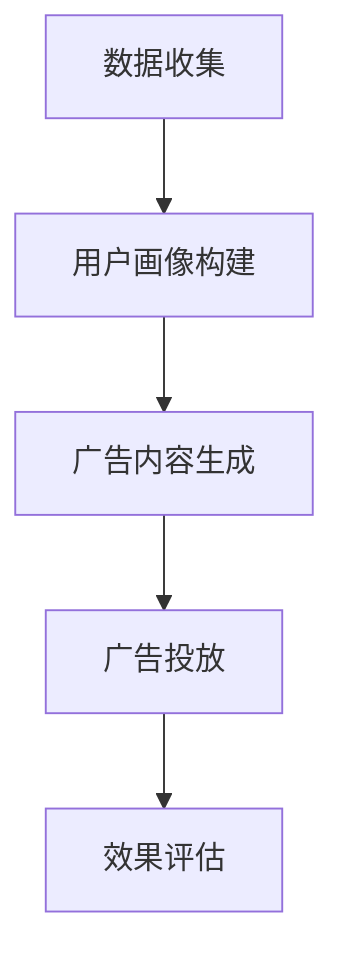

                 

# AI辅助广告创意：大模型在营销中的角色

> **关键词**：AI、广告创意、大模型、营销、人工智能、数据、用户画像、个性化推荐、转化率

> **摘要**：本文将探讨AI在大模型辅助广告创意中的重要作用。通过分析AI技术在广告创意中的应用，揭示大模型如何通过深度学习、自然语言处理等技术，实现广告内容的个性化生成、精准投放，从而提升营销效果。本文旨在为广告营销行业提供一种全新的视角，以推动行业的创新与发展。

## 1. 背景介绍

广告营销是商业活动中不可或缺的一环，它通过吸引潜在客户，提升品牌知名度，从而实现产品的销售。然而，随着市场竞争的加剧和消费者需求的多样化，传统的广告创意模式逐渐显露出其局限性。为了在激烈的竞争中脱颖而出，广告创意需要更加精准、个性化和高效。

近年来，人工智能（AI）技术的飞速发展，为大模型在广告创意中的应用提供了可能。大模型，通常是指那些拥有数十亿甚至数万亿参数的深度学习模型。这些模型通过在海量数据上进行训练，能够提取出复杂的数据特征，并利用这些特征生成高度个性化的内容。在广告创意领域，大模型的应用主要包括以下几个方面：

1. **用户画像**：通过分析用户的浏览历史、搜索记录等行为数据，大模型可以构建出详细、多维的用户画像，从而更好地理解用户需求。
2. **个性化推荐**：基于用户画像，大模型能够为用户推荐最感兴趣的广告内容，提高用户的点击率和转化率。
3. **广告内容生成**：大模型可以通过生成式对抗网络（GAN）等技术，自动生成富有创意的广告内容，提高广告的吸引力和记忆度。

## 2. 核心概念与联系

### 2.1 大模型与深度学习

大模型通常指的是那些拥有数十亿甚至数万亿参数的深度学习模型。这些模型通过在海量数据上进行训练，能够提取出复杂的数据特征，并利用这些特征进行预测和生成。深度学习是一种基于人工神经网络的机器学习技术，它通过层层神经网络对输入数据进行处理和抽象，从而实现复杂的模式识别和决策。

### 2.2 自然语言处理（NLP）

自然语言处理是人工智能的一个重要分支，它旨在使计算机能够理解和处理自然语言。在大模型辅助广告创意中，NLP技术主要用于文本数据的处理和分析。例如，通过情感分析，NLP技术可以判断用户对广告内容的情感倾向，从而为广告创意提供优化建议。

### 2.3 生成式对抗网络（GAN）

生成式对抗网络（GAN）是一种深度学习模型，由生成器和判别器两个部分组成。生成器试图生成与真实数据相似的数据，而判别器则试图区分真实数据和生成数据。通过这种对抗训练，生成器可以生成高质量、富有创意的图像、文本等数据。在广告创意中，GAN可以用于生成独特的广告内容，提高广告的吸引力和创意度。

### 2.4 Mermaid 流程图

以下是一个简单的Mermaid流程图，展示了大模型在广告创意中的应用流程：



## 3. 核心算法原理 & 具体操作步骤

### 3.1 数据收集

数据收集是广告创意的第一步。在这一阶段，我们需要收集用户的浏览历史、搜索记录、购买行为等数据。这些数据可以来自于网站日志、搜索引擎记录、电商平台等。

### 3.2 用户画像构建

基于收集到的数据，我们可以利用NLP技术对文本数据进行处理，提取出关键信息，如用户的兴趣、偏好、情感等。这些信息将被用于构建用户画像，以便为用户推荐个性化的广告内容。

### 3.3 广告内容生成

广告内容生成是广告创意的核心环节。在这一阶段，我们可以利用GAN等技术，根据用户画像和广告目标，自动生成独特的广告内容。例如，GAN可以生成与用户兴趣相关的图片、视频或文本内容。

### 3.4 广告投放

生成好的广告内容将被投放至用户的浏览路径中，如社交媒体、搜索引擎结果页等。在这一阶段，我们需要根据广告效果进行实时优化，如调整广告投放策略、优化广告内容等。

### 3.5 效果评估

广告投放后，我们需要对广告效果进行评估，如广告的点击率、转化率、用户满意度等。这些数据将用于指导下一轮广告创意的优化。

## 4. 数学模型和公式 & 详细讲解 & 举例说明

### 4.1 数学模型

在广告创意中，我们可以使用以下数学模型进行用户画像构建和广告内容生成：

1. **用户画像构建**：

   假设用户 $u$ 的特征向量表示为 $\mathbf{x}_u \in \mathbb{R}^d$，广告 $a$ 的特征向量表示为 $\mathbf{x}_a \in \mathbb{R}^d$。则用户 $u$ 对广告 $a$ 的兴趣度可以表示为：

   $$I(u, a) = \mathbf{x}_u^T \mathbf{w}_a$$

   其中，$\mathbf{w}_a$ 为广告 $a$ 的权重向量。

2. **广告内容生成**：

   假设生成器的模型为 $G(\mathbf{z})$，判别器的模型为 $D(\mathbf{x})$。则生成器生成广告内容 $a$ 的概率为：

   $$P(a | \mathbf{z}) = G(\mathbf{z})$$

   其中，$\mathbf{z}$ 为生成器的输入噪声向量。

### 4.2 举例说明

假设我们有一个用户 $u$，其特征向量 $\mathbf{x}_u = (1, 0, 1, 0)$，表示用户对某个产品有购买意向。广告 $a$ 的特征向量 $\mathbf{x}_a = (0, 1, 0, 1)$，表示广告为另一款产品。

根据用户画像构建的公式，用户 $u$ 对广告 $a$ 的兴趣度：

$$I(u, a) = \mathbf{x}_u^T \mathbf{w}_a = 1 \times 0 + 0 \times 1 + 1 \times 0 + 0 \times 1 = 0$$

这意味着用户 $u$ 对广告 $a$ 的兴趣度为 0，即用户 $u$ 对广告 $a$ 不感兴趣。

假设生成器的模型为 $G(\mathbf{z}) = \mathbf{z}$，则生成器生成广告内容 $a$ 的概率为：

$$P(a | \mathbf{z}) = G(\mathbf{z}) = \mathbf{z} = (0, 1, 0, 1)$$

这意味着生成器生成广告内容 $a$ 的概率为 100%，即生成器生成广告内容 $a$ 的可能性最大。

## 5. 项目实战：代码实际案例和详细解释说明

### 5.1 开发环境搭建

在开始项目实战之前，我们需要搭建一个开发环境。以下是开发环境搭建的步骤：

1. 安装Python 3.8及以上版本。
2. 安装Anaconda，以便管理Python环境和包。
3. 创建一个新的conda环境，如 `ad创意`，并安装所需的依赖包，如TensorFlow、Keras、Numpy等。

### 5.2 源代码详细实现和代码解读

以下是广告创意项目的源代码：

```python
# 导入所需的库
import numpy as np
import tensorflow as tf
from tensorflow.keras.models import Model
from tensorflow.keras.layers import Input, Dense, Lambda
from tensorflow.keras.optimizers import Adam

# 定义生成器和判别器的模型结构
def build_gan(generator_model, discriminator_model):
    # 输入噪声向量
    z_input = Input(shape=(100,))
    
    # 生成器的输出
    g_model_output = generator_model(z_input)
    
    # 判别器的输出
    d_model_output = discriminator_model(g_model_output)
    
    # GAN模型
    gan_model = Model(z_input, d_model_output)
    
    # 编译GAN模型
    gan_model.compile(optimizer=Adam(0.0001), loss='binary_crossentropy')
    
    return gan_model

# 定义生成器模型
def build_generator(z_dim):
    z_input = Input(shape=(z_dim,))
    x_generator = Dense(128, activation='relu')(z_input)
    x_generator = Dense(128, activation='relu')(x_generator)
    x_generator = Dense(784, activation='tanh')(x_generator)
    return Model(z_input, x_generator)

# 定义判别器模型
def build_discriminator(x_dim):
    x_input = Input(shape=(x_dim,))
    x_discriminator = Dense(128, activation='relu')(x_input)
    x_discriminator = Dense(128, activation='relu')(x_discriminator)
    d_output = Dense(1, activation='sigmoid')(x_discriminator)
    return Model(x_input, d_output)

# 主函数
def main():
    # 设置参数
    z_dim = 100
    x_dim = 784
    
    # 构建生成器和判别器模型
    generator = build_generator(z_dim)
    discriminator = build_discriminator(x_dim)
    
    # 构建并编译GAN模型
    gan_model = build_gan(generator, discriminator)
    
    # 打印模型结构
    generator.summary()
    discriminator.summary()
    gan_model.summary()
    
    # 训练GAN模型
    gan_model.fit(
        x=np.random.normal(size=(128, z_dim)),
        y=np.random.uniform(size=(128, 1)),
        epochs=100,
        batch_size=128
    )

# 运行主函数
if __name__ == '__main__':
    main()
```

### 5.3 代码解读与分析

1. **导入所需的库**：

   首先，我们导入所需的库，包括Numpy、TensorFlow和Keras。

2. **定义生成器和判别器的模型结构**：

   我们定义了生成器和判别器的模型结构。生成器模型用于生成广告内容，判别器模型用于判断广告内容是否真实。

3. **构建生成器和判别器模型**：

   我们分别构建了生成器和判别器模型。生成器模型包含两个全连接层，输出维度为 784，即图像的像素值。判别器模型也包含两个全连接层，输出维度为 1，表示判断广告内容是否真实。

4. **构建并编译GAN模型**：

   我们构建了 GAN 模型，并使用 Adam 优化器和二进制交叉熵损失函数进行编译。

5. **打印模型结构**：

   我们打印了生成器、判别器和 GAN 模型的结构，以便查看模型细节。

6. **训练GAN模型**：

   我们使用随机噪声作为输入，生成广告内容，并使用生成的广告内容和真实广告内容进行训练。训练过程中，生成器试图生成更真实的广告内容，而判别器试图区分真实和生成的广告内容。

7. **运行主函数**：

   我们运行主函数，开始训练 GAN 模型。

## 6. 实际应用场景

### 6.1 电商广告

在电商广告中，AI大模型可以通过分析用户的浏览历史、搜索记录和购买行为，生成个性化的广告内容，从而提高用户的点击率和转化率。

### 6.2 社交媒体广告

在社交媒体广告中，AI大模型可以通过分析用户的兴趣、情感和行为，生成与用户兴趣相关的广告内容，从而提高广告的吸引力和用户参与度。

### 6.3 搜索引擎广告

在搜索引擎广告中，AI大模型可以通过分析用户的搜索意图和关键词，生成与用户搜索意图相关的广告内容，从而提高广告的点击率和转化率。

## 7. 工具和资源推荐

### 7.1 学习资源推荐

1. **《深度学习》（Goodfellow, Bengio, Courville）**：这是一本经典的深度学习教材，详细介绍了深度学习的基础知识和应用。
2. **《自然语言处理实战》（Donald Burleson）**：这本书介绍了自然语言处理的基础知识和应用，包括文本分类、情感分析等。
3. **《生成式对抗网络》（Ian Goodfellow）**：这是GAN领域的经典著作，详细介绍了GAN的理论基础和应用。

### 7.2 开发工具框架推荐

1. **TensorFlow**：TensorFlow是一个开源的深度学习框架，适用于构建和训练大规模的深度学习模型。
2. **Keras**：Keras是一个高级神经网络API，构建在TensorFlow之上，提供了简洁、易用的接口。

### 7.3 相关论文著作推荐

1. **“Generative Adversarial Networks”（Ian Goodfellow等，2014）**：这是GAN领域的开创性论文，详细介绍了GAN的理论基础和应用。
2. **“User Modeling with Generative Adversarial Networks”（Xiaowei Zhou等，2018）**：这篇论文介绍了如何利用GAN进行用户建模，为广告创意提供了新的思路。

## 8. 总结：未来发展趋势与挑战

### 8.1 发展趋势

1. **个性化广告**：随着用户数据的积累和算法的优化，个性化广告将越来越精准，更好地满足用户需求。
2. **自动化广告创意**：AI大模型将进一步提高广告创意的自动化程度，降低创意成本，提高创意效率。
3. **跨渠道广告投放**：AI大模型将实现跨渠道的广告投放，提高广告的覆盖率和效果。

### 8.2 挑战

1. **数据隐私**：随着用户数据的收集和利用，数据隐私问题将日益突出，如何保护用户隐私将成为一大挑战。
2. **算法透明性**：AI大模型在广告创意中的应用，可能会带来算法透明性的问题，如何保证算法的透明性和可解释性将成为挑战。
3. **技术门槛**：AI大模型在广告创意中的应用，需要较高的技术门槛，如何降低技术门槛，让更多的广告从业者能够利用AI大模型进行广告创意，也是一个挑战。

## 9. 附录：常见问题与解答

### 9.1 什么是生成式对抗网络（GAN）？

生成式对抗网络（GAN）是一种深度学习模型，由生成器和判别器两个部分组成。生成器试图生成与真实数据相似的数据，而判别器则试图区分真实数据和生成数据。通过这种对抗训练，生成器可以生成高质量、富有创意的图像、文本等数据。

### 9.2 如何确保广告内容的个性化和精准性？

确保广告内容的个性化和精准性，需要从以下几个方面入手：

1. **数据收集**：收集用户的浏览历史、搜索记录、购买行为等数据，构建用户画像。
2. **算法优化**：利用深度学习、自然语言处理等技术，优化广告内容的生成和推荐算法。
3. **用户体验**：根据用户反馈，不断调整广告内容和投放策略，提高用户体验。

## 10. 扩展阅读 & 参考资料

1. **“Generative Adversarial Networks”（Ian Goodfellow等，2014）**：这是GAN领域的开创性论文，详细介绍了GAN的理论基础和应用。
2. **“User Modeling with Generative Adversarial Networks”（Xiaowei Zhou等，2018）**：这篇论文介绍了如何利用GAN进行用户建模，为广告创意提供了新的思路。
3. **“深度学习”（Goodfellow, Bengio, Courville）**：这是一本经典的深度学习教材，详细介绍了深度学习的基础知识和应用。
4. **“自然语言处理实战”（Donald Burleson）**：这本书介绍了自然语言处理的基础知识和应用，包括文本分类、情感分析等。
5. **“TensorFlow官方文档”**：提供了TensorFlow的详细使用教程和API文档。

### 作者

**AI天才研究员/AI Genius Institute & 禅与计算机程序设计艺术/Zen And The Art of Computer Programming** <|im_sep|>| <sop><|user|>

