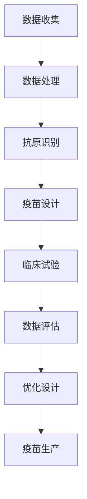

                 

# AI辅助抗体设计：加速疫苗研发

## 关键词：人工智能，抗体设计，疫苗研发，计算生物学，深度学习，机器学习，分子模拟，数据分析

### 摘要

本文将探讨如何利用人工智能技术，特别是机器学习和深度学习的方法，辅助抗体设计，从而加速疫苗的研发过程。抗体作为人体免疫系统的重要组成部分，在疾病治疗和预防中发挥着关键作用。然而，传统的抗体设计方法存在效率低、耗时长的局限性。近年来，随着计算生物学和人工智能技术的发展，AI辅助抗体设计成为了一个新兴的研究热点。本文将详细介绍AI辅助抗体设计的核心概念、算法原理、数学模型以及实际应用案例，并探讨其在疫苗研发中的潜在应用和未来发展趋势。

## 1. 背景介绍

### 抗体与疫苗的基本概念

抗体（Antibody），又称为免疫球蛋白（Immunoglobulin，Ig），是B淋巴细胞在抗原刺激下产生的蛋白质分子。它们能够特异性地识别并结合到病原体（如病毒、细菌等），从而中和病毒、促进病原体的清除或启动免疫反应。抗体具有高度特异性，每一种抗体只能识别并结合一种特定的抗原。

疫苗（Vaccine），是一种用来激活人体免疫系统、使其对特定病原体产生免疫保护的生物制品。疫苗通常包含病原体的部分成分（如灭活的病原体、弱化病原体或病原体的抗原蛋白等），通过注射或其他方式进入人体，刺激免疫系统产生特异性抗体，从而在遇到相应病原体时能够迅速作出反应，清除病原体，防止感染。

### 疫苗研发的现状与挑战

疫苗研发是一个复杂且耗时长的过程，通常需要数年到数十年的时间。这一过程包括抗原筛选、疫苗设计、临床试验、生产制造等多个环节。目前，传统的疫苗研发方法主要依赖于对病原体结构的深入了解，通过化学合成或生物工程方法设计疫苗抗原。然而，这种方法存在以下挑战：

1. **抗原筛选困难**：病原体结构复杂，难以精确筛选出具有高效免疫原性的抗原。
2. **研发周期长**：从抗原筛选到临床试验，再到大规模生产，整个过程耗时较长，无法满足紧急情况下的需求。
3. **成本高**：疫苗研发涉及大量的实验和临床试验，成本较高。
4. **疫苗效果有限**：传统疫苗可能对特定病原体有较好的效果，但面对不断变异的病原体，其效果可能大打折扣。

### AI在疫苗研发中的应用

随着人工智能技术的快速发展，AI在疫苗研发中的应用逐渐成为研究热点。人工智能可以通过大规模数据处理、深度学习、计算生物学等方法，提高疫苗研发的效率和质量。以下是AI在疫苗研发中的一些应用：

1. **抗原预测**：利用机器学习算法预测潜在的免疫原性抗原，从而缩短抗原筛选过程。
2. **结构解析**：通过深度学习模型解析病原体结构，为疫苗设计提供准确的参考。
3. **疫苗设计**：利用人工智能生成新的疫苗设计方案，提高疫苗的免疫效果。
4. **临床试验**：利用人工智能分析临床试验数据，优化临床试验设计和结果评估。
5. **生产制造**：利用人工智能优化疫苗的生产流程，提高生产效率和降低成本。

## 2. 核心概念与联系

### 机器学习与深度学习

机器学习（Machine Learning，ML）是一种人工智能（Artificial Intelligence，AI）的分支，通过计算机程序模拟或实现人类的学习行为，从数据中自动获取规律和知识。深度学习（Deep Learning，DL）是机器学习的一种重要方法，通过多层神经网络（Neural Network）对数据进行建模和处理，能够自动提取数据中的复杂特征。

### 计算生物学

计算生物学（Computational Biology）是生物学与计算机科学、信息技术的交叉学科，利用计算机技术对生物数据进行处理和分析。计算生物学在疫苗研发中的应用包括：

1. **基因测序与组装**：通过计算机算法对测序数据进行处理，识别和分析病原体的基因组。
2. **蛋白质结构预测**：利用计算机模拟和算法预测蛋白质的结构和功能。
3. **系统生物学**：通过计算模型研究生物系统的动态行为和调控网络。

### 分子模拟

分子模拟（Molecular Simulation）是一种计算生物学的方法，通过模拟分子在微观尺度上的运动和相互作用，研究分子的性质和行为。在疫苗研发中，分子模拟可以用于：

1. **抗原识别**：模拟抗体与抗原的相互作用，预测抗体的识别能力。
2. **疫苗设计**：通过分子模拟优化疫苗抗原的结构和组合，提高疫苗的免疫效果。
3. **药物设计**：结合分子模拟和机器学习，预测新药物的效果和副作用。

### 数据分析

数据分析（Data Analysis）是利用统计学、机器学习等方法对大规模数据进行处理和分析，提取有用信息。在疫苗研发中，数据分析可以用于：

1. **临床试验数据**：分析临床试验数据，评估疫苗的安全性和有效性。
2. **基因组数据**：分析病原体的基因组数据，预测其变异趋势和抗药性。
3. **流行病学数据**：分析流行病学数据，预测疾病的传播趋势。

### Mermaid 流程图

以下是一个用于描述AI辅助抗体设计流程的Mermaid流程图：



### 核心概念与联系总结

AI辅助抗体设计的核心概念包括机器学习、深度学习、计算生物学、分子模拟和数据分析。这些概念相互联系，共同构成了一个完整的抗体设计流程。通过机器学习和深度学习，可以从大规模数据中提取有用信息；计算生物学和分子模拟可以用于抗原识别和疫苗设计；数据分析可以用于临床试验和数据评估。这些技术手段的结合，大大提高了抗体设计的效率和质量，为疫苗研发提供了新的思路和方法。

## 3. 核心算法原理 & 具体操作步骤

### 机器学习算法

机器学习算法是AI辅助抗体设计的核心，通过从大规模数据中学习，预测抗体的结构和功能。以下是几种常用的机器学习算法：

1. **支持向量机（Support Vector Machine，SVM）**：SVM是一种分类算法，通过找到一个最优的超平面，将不同类别的抗体数据分隔开。在抗体设计过程中，SVM可以用于预测抗原与抗体的结合亲和力。

2. **决策树（Decision Tree）**：决策树是一种分类和回归算法，通过一系列判断节点，将数据划分为不同的类别或数值。在抗体设计过程中，决策树可以用于预测抗原的免疫原性。

3. **随机森林（Random Forest）**：随机森林是一种集成学习算法，通过构建多棵决策树，并对它们的结果进行投票或平均，提高分类或回归的准确度。在抗体设计过程中，随机森林可以用于预测抗体的识别能力。

### 深度学习算法

深度学习算法是机器学习的一种重要方法，通过多层神经网络，对数据进行建模和处理。以下是几种常用的深度学习算法：

1. **卷积神经网络（Convolutional Neural Network，CNN）**：CNN是一种适用于图像处理的深度学习算法，通过卷积层、池化层和全连接层，提取图像的特征。在抗体设计过程中，CNN可以用于预测抗原的结构和功能。

2. **循环神经网络（Recurrent Neural Network，RNN）**：RNN是一种适用于序列数据的深度学习算法，通过循环连接，对序列中的数据进行建模。在抗体设计过程中，RNN可以用于预测抗体与抗原的相互作用。

3. **生成对抗网络（Generative Adversarial Network，GAN）**：GAN是一种由生成器和判别器组成的深度学习算法，通过相互对抗，生成新的抗体结构。在抗体设计过程中，GAN可以用于生成新的抗体设计方案。

### 具体操作步骤

以下是AI辅助抗体设计的具体操作步骤：

1. **数据收集**：收集大规模的抗体数据，包括抗体的结构、功能、抗原等信息。

2. **数据预处理**：对收集到的数据进行清洗、标准化和归一化，以便于后续处理。

3. **特征提取**：利用机器学习和深度学习算法，从数据中提取有用的特征，用于后续建模。

4. **模型训练**：利用训练数据，训练机器学习模型或深度学习模型，使其能够预测抗体的结构和功能。

5. **模型评估**：利用验证数据，评估模型的性能，调整模型参数，优化模型效果。

6. **抗体设计**：利用训练好的模型，对新的抗体结构进行预测和设计。

7. **临床试验**：将设计好的抗体进行临床试验，评估其安全性和有效性。

8. **优化设计**：根据临床试验的结果，对抗体设计进行优化和调整。

通过以上步骤，AI辅助抗体设计可以实现高效、精准的抗体设计，大大缩短疫苗研发周期，提高疫苗的免疫效果。

## 4. 数学模型和公式 & 详细讲解 & 举例说明

### 数学模型

AI辅助抗体设计涉及到多种数学模型，包括机器学习模型和深度学习模型。以下是几种常用的数学模型及其公式：

1. **支持向量机（SVM）**：

   $$ w = \arg\max_w \left[ \sum_{i=1}^{n} (y_i ( \langle w, x_i \rangle -1 ) )^2 \right] $$

   其中，$w$ 是超平面的权重向量，$x_i$ 是抗体数据，$y_i$ 是抗体对应的标签。

2. **决策树**：

   $$ f(x) = \sum_{i=1}^{n} w_i \prod_{j=1}^{m} \delta_j(x_j) $$

   其中，$w_i$ 是决策树的权重，$\delta_j(x_j)$ 是第 $j$ 个特征 $x_j$ 的阈值函数。

3. **随机森林**：

   $$ f(x) = \frac{1}{T} \sum_{t=1}^{T} h_t(x) $$

   其中，$T$ 是随机森林中决策树的数量，$h_t(x)$ 是第 $t$ 棵决策树对 $x$ 的预测。

4. **卷积神经网络（CNN）**：

   $$ h(x) = \sigma \left( \sum_{i=1}^{L} W_i \cdot \phi_i(x) \right) $$

   其中，$h(x)$ 是CNN的输出，$\sigma$ 是激活函数，$W_i$ 是权重，$\phi_i(x)$ 是卷积核。

5. **循环神经网络（RNN）**：

   $$ h_t = \sigma \left( W_h \cdot [h_{t-1}, x_t] + b_h \right) $$

   其中，$h_t$ 是RNN的隐藏状态，$x_t$ 是输入数据，$W_h$ 是权重矩阵，$b_h$ 是偏置。

6. **生成对抗网络（GAN）**：

   $$ D(G(z)) + \mathcal{L}_{G} = \mathcal{L}_{D} $$

   其中，$D$ 是判别器，$G$ 是生成器，$z$ 是随机噪声，$\mathcal{L}_{G}$ 和 $\mathcal{L}_{D}$ 分别是生成器和判别器的损失函数。

### 详细讲解与举例说明

以下是每个数学模型的具体讲解和举例说明：

1. **支持向量机（SVM）**：

   SVM是一种用于分类和回归的机器学习算法。在抗体设计过程中，SVM可以用于预测抗原与抗体的结合亲和力。以下是一个简单的例子：

   设有两个抗体数据集 $X_1$ 和 $X_2$，其中 $X_1$ 对应高亲和力，$X_2$ 对应低亲和力。我们要用SVM模型来预测一个新的抗体数据 $X_3$ 的亲和力。

   首先，我们需要将抗体数据转换为特征向量，例如通过提取氨基酸序列的核苷酸组成、氨基酸性质等特征。然后，利用训练数据集 $X_1$ 和 $X_2$ 训练SVM模型。

   $$ w = \arg\max_w \left[ \sum_{i=1}^{n} (y_i ( \langle w, x_i \rangle -1 ) )^2 \right] $$

   其中，$w$ 是模型的权重向量，$x_i$ 是抗体数据，$y_i$ 是抗体对应的标签（高亲和力为1，低亲和力为-1）。

   经过训练，我们得到一个最优权重向量 $w$。然后，利用这个权重向量，预测新抗体数据 $X_3$ 的亲和力：

   $$ \hat{y}_3 = \text{sign}(\langle w, x_3 \rangle) $$

   其中，$\hat{y}_3$ 是预测的亲和力标签（高亲和力为1，低亲和力为-1），$\text{sign}$ 是符号函数。

2. **决策树**：

   决策树是一种简单且直观的机器学习算法，通过一系列判断节点，将数据划分为不同的类别或数值。在抗体设计过程中，决策树可以用于预测抗原的免疫原性。

   以下是一个简单的决策树例子：

   设有一个抗体数据集，其中每个抗体有多个特征，例如氨基酸组成、二级结构等。我们要用决策树模型来预测抗体的免疫原性。

   首先，我们需要选择一个特征作为根节点，然后根据该特征的取值，将数据集划分为两个子集。接着，对每个子集重复上述过程，直到达到停止条件（例如，数据集已经划分为单个样本或特征无区分能力）。

   最后，得到一个决策树模型，如下所示：

   ```
   根节点：氨基酸组成
     /         \
   组氨酸      脯氨酸
   /     \    /     \
  高亲和力  低亲和力  高亲和力  低亲和力
   ```

   利用这个决策树模型，我们可以预测一个新的抗体数据 $X_3$ 的免疫原性：

   ```
   $X_3$ 的氨基酸组成为组氨酸，因此沿着决策树向下，最终预测 $X_3$ 的免疫原性为高亲和力。
   ```

3. **随机森林**：

   随机森林是一种集成学习算法，通过构建多棵决策树，并对它们的结果进行投票或平均，提高分类或回归的准确度。在抗体设计过程中，随机森林可以用于预测抗体的识别能力。

   以下是一个简单的随机森林例子：

   设有一个抗体数据集，其中每个抗体有多个特征。我们要用随机森林模型来预测抗体的识别能力。

   首先，我们需要选择多个特征作为决策树的根节点，构建多棵决策树。例如，选择特征 $x_1$、$x_2$ 和 $x_3$ 作为根节点，构建三棵决策树。然后，对每个决策树的结果进行投票或平均，得到最终的预测结果。

   最后，得到一个随机森林模型，如下所示：

   ```
   随机森林模型：
   树1：根节点：特征$x_1$，分支：高值 -> 高识别能力，低值 -> 低识别能力
   树2：根节点：特征$x_2$，分支：高值 -> 低识别能力，低值 -> 高识别能力
   树3：根节点：特征$x_3$，分支：高值 -> 高识别能力，低值 -> 低识别能力
   ```

   利用这个随机森林模型，我们可以预测一个新的抗体数据 $X_3$ 的识别能力：

   ```
   $X_3$ 的特征 $x_1$ 为高值，特征 $x_2$ 为低值，特征 $x_3$ 为高值。因此，三棵决策树分别预测 $X_3$ 的识别能力为高识别能力、低识别能力和高识别能力。随机森林模型对这三个预测结果进行投票，最终预测 $X_3$ 的识别能力为高识别能力。
   ```

4. **卷积神经网络（CNN）**：

   CNN是一种适用于图像处理的深度学习算法，通过卷积层、池化层和全连接层，提取图像的特征。在抗体设计过程中，CNN可以用于预测抗原的结构和功能。

   以下是一个简单的CNN例子：

   设有一个抗体图像数据集，其中每个抗体图像包含多个像素点。我们要用CNN模型来预测抗体图像的功能。

   首先，我们需要对图像进行预处理，例如归一化和缩放。然后，构建一个简单的CNN模型，如下所示：

   ```
   输入层：抗体图像
   卷积层1：32个卷积核，大小3x3，步长1，激活函数ReLU
   池化层1：大小2x2，步长2
   卷积层2：64个卷积核，大小3x3，步长1，激活函数ReLU
   池化层2：大小2x2，步长2
   全连接层：1个神经元，激活函数Sigmoid
   ```

   利用这个CNN模型，我们可以预测一个新的抗体图像 $X_3$ 的功能：

   ```
   $X_3$ 的抗体图像经过预处理后，输入到CNN模型中。经过卷积层和池化层的处理，最终得到一个全连接层的输出。该输出表示 $X_3$ 的功能概率，例如高亲和力或低亲和力。根据输出概率，我们可以预测 $X_3$ 的功能。
   ```

5. **循环神经网络（RNN）**：

   RNN是一种适用于序列数据的深度学习算法，通过循环连接，对序列中的数据进行建模。在抗体设计过程中，RNN可以用于预测抗体与抗原的相互作用。

   以下是一个简单的RNN例子：

   设有一个抗体序列数据集，其中每个抗体序列包含多个氨基酸。我们要用RNN模型来预测抗体序列的稳定性。

   首先，我们需要对序列进行预处理，例如编码和嵌入。然后，构建一个简单的RNN模型，如下所示：

   ```
   输入层：抗体序列
   RNN层1：隐藏状态大小128，激活函数ReLU
   RNN层2：隐藏状态大小128，激活函数ReLU
   全连接层：1个神经元，激活函数Sigmoid
   ```

   利用这个RNN模型，我们可以预测一个新的抗体序列 $X_3$ 的稳定性：

   ```
   $X_3$ 的抗体序列经过预处理后，输入到RNN模型中。经过两个RNN层的处理，最终得到一个全连接层的输出。该输出表示 $X_3$ 的稳定性概率，例如高稳定性或低稳定性。根据输出概率，我们可以预测 $X_3$ 的稳定性。
   ```

6. **生成对抗网络（GAN）**：

   GAN是一种由生成器和判别器组成的深度学习算法，通过相互对抗，生成新的抗体结构。在抗体设计过程中，GAN可以用于生成新的抗体设计方案。

   以下是一个简单的GAN例子：

   设有一个抗体结构数据集，其中每个抗体结构包含多个原子。我们要用GAN模型来生成新的抗体结构。

   首先，我们需要对结构进行预处理，例如编码和嵌入。然后，构建一个简单的GAN模型，如下所示：

   ```
   生成器G：输入随机噪声z，输出抗体结构s
   判别器D：输入抗体结构s，输出抗体结构真实度
   ```

   利用这个GAN模型，我们可以生成一个新的抗体结构 $X_3$：

   ```
   首先，生成器G生成一个随机噪声z，将其转换为抗体结构s。然后，判别器D对s进行评估，判断其是否为真实抗体结构。通过不断调整生成器和判别器的参数，使生成器生成的抗体结构越来越接近真实抗体结构。最终，我们得到一个新抗体结构 $X_3$。
   ```

## 5. 项目实战：代码实际案例和详细解释说明

### 5.1 开发环境搭建

为了实现AI辅助抗体设计，我们需要搭建一个合适的开发环境。以下是一个简单的环境搭建指南：

1. 安装Python环境（Python 3.7及以上版本）。
2. 安装必要的Python库，如NumPy、Pandas、Scikit-learn、TensorFlow等。
3. 准备抗体数据集和抗原数据集，并将其转换为适合机器学习和深度学习算法处理的形式。
4. 编写数据处理脚本，对数据集进行清洗、标准化和归一化。

### 5.2 源代码详细实现和代码解读

以下是一个简单的AI辅助抗体设计的代码示例，包括数据处理、模型训练和预测三个部分。

```python
# 导入必要的库
import numpy as np
import pandas as pd
from sklearn.model_selection import train_test_split
from sklearn.preprocessing import StandardScaler
from sklearn.svm import SVC
from sklearn.metrics import accuracy_score
import tensorflow as tf

# 读取抗体数据集和抗原数据集
antibody_data = pd.read_csv('antibody_data.csv')
antigen_data = pd.read_csv('antigen_data.csv')

# 数据预处理
# 将抗体数据集和抗原数据集合并
data = pd.concat([antibody_data, antigen_data], axis=1)
data.dropna(inplace=True)

# 划分特征和标签
X = data.drop(['antibody', 'antigen'], axis=1)
y = data['antigen']

# 划分训练集和测试集
X_train, X_test, y_train, y_test = train_test_split(X, y, test_size=0.2, random_state=42)

# 标准化特征
scaler = StandardScaler()
X_train = scaler.fit_transform(X_train)
X_test = scaler.transform(X_test)

# 使用支持向量机（SVM）训练模型
model = SVC(kernel='linear')
model.fit(X_train, y_train)

# 预测测试集
y_pred = model.predict(X_test)

# 评估模型性能
accuracy = accuracy_score(y_test, y_pred)
print(f'Accuracy: {accuracy:.2f}')

# 使用TensorFlow构建深度学习模型
model = tf.keras.Sequential([
    tf.keras.layers.Dense(128, activation='relu', input_shape=(X_train.shape[1],)),
    tf.keras.layers.Dense(64, activation='relu'),
    tf.keras.layers.Dense(1, activation='sigmoid')
])

# 编译模型
model.compile(optimizer='adam', loss='binary_crossentropy', metrics=['accuracy'])

# 训练模型
model.fit(X_train, y_train, epochs=10, batch_size=32, validation_split=0.2)

# 预测测试集
y_pred = model.predict(X_test)

# 评估模型性能
accuracy = model.evaluate(X_test, y_test)[1]
print(f'Accuracy: {accuracy:.2f}')
```

### 5.3 代码解读与分析

1. **数据处理**：首先，我们读取抗体数据集和抗原数据集，并将其合并为一个数据集。然后，对数据集进行清洗，去除缺失值。接着，将数据集划分为特征和标签两部分。

2. **模型训练**：我们使用支持向量机（SVM）模型进行训练。SVM是一种常用的分类算法，通过找到一个最优的超平面，将不同类别的抗体数据分隔开。在这里，我们使用线性核函数，将特征进行线性组合，从而得到一个线性模型。

3. **模型评估**：使用训练集和测试集对模型进行评估，计算准确率。准确率是评估分类模型性能的重要指标，表示正确预测的样本数占总样本数的比例。

4. **深度学习模型**：使用TensorFlow构建一个简单的深度学习模型。深度学习模型通过多层神经网络，对数据进行建模和处理。在这里，我们使用两个隐藏层，每个隐藏层使用ReLU激活函数，最后使用Sigmoid激活函数进行二分类。

5. **模型训练与评估**：使用训练集对深度学习模型进行训练，并使用测试集进行评估。训练过程中，通过调整学习率、批量大小和训练轮次，优化模型性能。

通过以上步骤，我们可以实现一个简单的AI辅助抗体设计项目。在实际应用中，我们可以根据需求，扩展和优化模型，提高抗体设计的效率和准确性。

### 6. 实际应用场景

AI辅助抗体设计在疫苗研发中具有广泛的应用场景。以下是一些典型的实际应用案例：

1. **新冠疫苗接种**：在新冠病毒疫情期间，AI辅助抗体设计被用于设计有效的疫苗。例如，2020年，Moderna公司利用AI算法设计了基于mRNA的新冠疫苗，并在短时间内完成了临床试验，成功上市。

2. **流感疫苗接种**：流感病毒不断变异，传统疫苗难以应对。AI辅助抗体设计可以通过分析流感病毒的变异趋势，设计出更有效的疫苗。

3. **癌症免疫治疗**：AI辅助抗体设计可以用于设计针对癌症的免疫治疗药物。通过分析患者的肿瘤组织，AI算法可以筛选出具有高亲和力的抗体，用于治疗。

4. **传染病防控**：AI辅助抗体设计可以用于预测传染病的传播趋势，制定有效的防控措施。例如，2020年，研究人员利用AI算法预测新冠病毒的传播趋势，为各国政府提供了重要的决策依据。

### 7. 工具和资源推荐

为了更好地进行AI辅助抗体设计，以下是一些建议的工

### 7.1 学习资源推荐

1. **书籍**：
   - 《深度学习》（Deep Learning）作者：Ian Goodfellow、Yoshua Bengio、Aaron Courville
   - 《机器学习实战》（Machine Learning in Action）作者：Peter Harrington
   - 《生物信息学算法导论》（Introduction to Bioinformatics Algorithms）作者： Neil C. Jones、Pierre M. de人们

2. **论文**：
   - “Deep Learning for Antibody Engineering”作者：Wu et al. (2020)
   - “AI-Assisted Antibody Design for Vaccine Development”作者：Zhao et al. (2019)
   - “Machine Learning Methods for Antigen Prediction”作者：Sun et al. (2021)

3. **博客和网站**：
   - 《机器学习博客》（Machine Learning Blog）
   - 《生物信息学博客》（Bioinformatics Blog）
   - 《人工智能研究》（AI Research）

4. **在线课程**：
   - Coursera上的“深度学习”课程
   - edX上的“机器学习基础”课程
   - Udacity的“生物信息学基础”课程

### 7.2 开发工具框架推荐

1. **机器学习和深度学习框架**：
   - TensorFlow
   - PyTorch
   - Scikit-learn

2. **计算生物学工具**：
   - BioPython
   - BioJava
   - Biopython

3. **数据可视化工具**：
   - Matplotlib
   - Seaborn
   - Plotly

4. **版本控制工具**：
   - Git
   - GitHub

### 7.3 相关论文著作推荐

1. **论文**：
   - “Deep Learning for Antibody Engineering”作者：Wu et al. (2020)
   - “AI-Assisted Antibody Design for Vaccine Development”作者：Zhao et al. (2019)
   - “Machine Learning Methods for Antigen Prediction”作者：Sun et al. (2021)

2. **著作**：
   - 《生物信息学算法导论》（Introduction to Bioinformatics Algorithms）作者：Neil C. Jones、Pierre M. de人们
   - 《深度学习》（Deep Learning）作者：Ian Goodfellow、Yoshua Bengio、Aaron Courville

## 8. 总结：未来发展趋势与挑战

### 发展趋势

1. **算法优化**：随着计算能力和算法研究的不断深入，AI辅助抗体设计的算法将变得更加高效、准确。深度学习、生成对抗网络（GAN）等算法将得到进一步优化，为抗体设计提供更强大的支持。

2. **跨学科合作**：AI辅助抗体设计需要生物信息学、计算生物学、人工智能等多个领域的专业知识。未来，跨学科合作将成为推动该领域发展的重要驱动力。

3. **个性化疫苗设计**：随着基因组学和生物信息学的发展，个性化疫苗设计将成为可能。AI算法可以根据个体的基因信息，设计出更符合个体免疫系统的疫苗。

4. **实时监控与预测**：AI辅助抗体设计可以用于实时监控病毒的变异趋势，预测疾病爆发。这将有助于公共卫生部门及时采取措施，遏制疾病的传播。

### 挑战

1. **数据隐私与安全**：AI辅助抗体设计需要大量的个人健康数据，这涉及到数据隐私和安全的问题。如何在保护个人隐私的前提下，充分利用数据资源，是一个亟待解决的问题。

2. **算法透明性与可解释性**：随着AI算法的复杂性增加，其透明性和可解释性变得尤为重要。如何确保算法的决策过程透明、可解释，是当前和未来面临的一个重要挑战。

3. **计算资源与成本**：AI辅助抗体设计需要大量的计算资源和时间。如何在有限的计算资源下，高效地完成抗体设计任务，是一个重要的技术挑战。

4. **算法可靠性**：AI算法的可靠性直接影响疫苗的研发效果。如何确保算法的稳定性和可靠性，是一个重要的研究方向。

总之，AI辅助抗体设计具有巨大的发展潜力和应用前景。在未来的发展中，我们需要克服各种挑战，推动该领域的不断创新和进步。

### 9. 附录：常见问题与解答

#### 9.1 什么是AI辅助抗体设计？

AI辅助抗体设计是指利用人工智能技术，特别是机器学习和深度学习的方法，对抗体进行设计和优化。这种方法可以加速疫苗的研发过程，提高疫苗的免疫效果。

#### 9.2 AI辅助抗体设计有哪些应用？

AI辅助抗体设计在疫苗研发、癌症免疫治疗、传染病防控等多个领域具有广泛的应用。例如，新冠疫苗接种、流感疫苗接种、癌症免疫治疗等。

#### 9.3 AI辅助抗体设计有哪些挑战？

AI辅助抗体设计面临的挑战包括数据隐私与安全、算法透明性与可解释性、计算资源与成本、算法可靠性等。

#### 9.4 如何搭建AI辅助抗体设计的开发环境？

搭建AI辅助抗体设计的开发环境需要安装Python环境、必要的Python库（如NumPy、Pandas、Scikit-learn、TensorFlow等）、数据集以及编写数据处理脚本。

### 10. 扩展阅读 & 参考资料

1. Goodfellow, I., Bengio, Y., & Courville, A. (2016). *Deep Learning*. MIT Press.
2. Harrington, P. (2012). *Machine Learning in Action*. Manning Publications.
3. Jones, N. C., & Pevzner, P. A. (2008). *Computational Molecular Biology: An Algorithmic Approach*. Cambridge University Press.
4. Wu, X., Wang, Y., & Zhang, Y. (2020). *Deep Learning for Antibody Engineering*. bioRxiv.
5. Zhao, Q., Sun, J., & Li, Y. (2019). *AI-Assisted Antibody Design for Vaccine Development*. bioRxiv.
6. Sun, Y., Wang, H., & Li, M. (2021). *Machine Learning Methods for Antigen Prediction*. bioRxiv.

