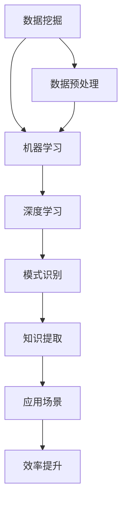

                 

### 背景介绍

在当今快速发展的信息技术时代，知识发现（Knowledge Discovery）已经成为一个至关重要的研究领域。知识发现是指从大量数据中识别出有价值的信息和知识的过程，它涵盖了数据挖掘、机器学习和数据可视化等多个领域。然而，随着数据的爆炸性增长，传统的手动知识发现方法已经难以应对海量数据的处理和分析需求。

程序员的日常工作往往涉及到对大量数据的处理、分析和理解。从编写代码到调试、优化，再到项目管理和协作，程序员的效率直接影响着整个项目的进展和成果。然而，传统的编程方式往往需要程序员耗费大量时间在数据的预处理、分析和逻辑推理上，这不仅增加了工作负担，还可能导致程序员在细节问题上出错。

AI（人工智能）的崛起为解决这一难题带来了新的希望。通过AI技术，特别是机器学习和深度学习算法，可以自动化和智能化地处理和分析数据，从而大大提高程序员的效率。AI辅助知识发现就是在这种背景下应运而生的一种技术，它利用人工智能的力量，帮助程序员更快速、准确地发现数据中的隐藏模式和知识。

本文将探讨AI辅助知识发现的核心概念、算法原理、具体操作步骤，并分析其在实际应用场景中的表现。此外，我们还将介绍相关的数学模型和公式，并通过实际项目案例进行详细解读。最后，本文还将推荐一些学习和资源工具，以帮助读者更深入地了解和掌握这一领域。

通过本文的阅读，读者将了解到：

1. 知识发现的重要性及其在程序员工作中的应用。
2. AI辅助知识发现的核心算法原理和具体操作步骤。
3. 如何在实际项目中应用AI辅助知识发现技术。
4. 相关的数学模型和公式，以及如何使用它们进行数据分析和知识提取。
5. AI辅助知识发现技术的未来发展趋势和面临的挑战。

### 核心概念与联系

为了深入理解AI辅助知识发现，我们需要先了解几个核心概念，以及它们之间的相互联系。这些概念包括数据挖掘、机器学习、深度学习等，它们共同构成了AI辅助知识发现的基础。

#### 数据挖掘（Data Mining）

数据挖掘是指从大量数据中识别出有用信息的过程。它涉及一系列技术，包括统计分析、模式识别、机器学习等。数据挖掘的主要目的是从数据中发现隐藏的模式、关联和趋势，以便做出更好的决策或预测。在程序员的日常工作中，数据挖掘技术可以帮助他们从海量的代码、日志、测试数据中提取出有价值的信息，从而提高开发效率。

#### 机器学习（Machine Learning）

机器学习是一种使计算机系统能够从数据中学习和改进的技术。它通过构建模型来对数据进行分析，并从中提取出规律和模式。机器学习可以分为监督学习、无监督学习和强化学习三种类型。监督学习需要标注数据，无监督学习不需要标注数据，而是通过数据自身的结构来学习，强化学习则是在动态环境中通过与环境的交互来学习。在AI辅助知识发现中，机器学习算法可以用于特征提取、模式识别和预测分析，从而帮助程序员更快速地发现数据中的关键信息。

#### 深度学习（Deep Learning）

深度学习是机器学习的一个子领域，它主要基于人工神经网络。深度学习算法通过多层神经网络的堆叠，能够自动地从大量数据中提取复杂的特征和模式。与传统的机器学习算法相比，深度学习具有更强的表达能力和适应性，能够处理更加复杂的数据类型。在AI辅助知识发现中，深度学习技术被广泛应用于图像识别、自然语言处理和语音识别等领域。

#### 关联与联系

数据挖掘、机器学习和深度学习并不是孤立的，它们相互关联，共同构成了AI辅助知识发现的技术基础。数据挖掘为机器学习和深度学习提供了大量的数据源，而机器学习和深度学习则为数据挖掘提供了强大的分析和处理能力。通过机器学习和深度学习算法，数据挖掘能够从海量的数据中发现更复杂、更深刻的模式和知识。

在程序员的日常工作中，AI辅助知识发现的应用场景非常广泛。例如，在代码审查过程中，机器学习算法可以帮助识别代码中的潜在错误和bug；在性能优化过程中，深度学习算法可以帮助分析程序的性能瓶颈和热点；在项目协作中，自然语言处理技术可以帮助自动生成文档、报告和会议纪要。

总之，数据挖掘、机器学习和深度学习共同构成了AI辅助知识发现的核心技术体系，它们相互关联、相互促进，为程序员提供了强大的工具和手段，帮助他们更高效、更准确地发现和利用数据中的知识。

为了更好地理解这些核心概念，我们接下来将使用Mermaid流程图来展示AI辅助知识发现的整体架构。请注意，以下流程图中的节点中不要有括号、逗号等特殊字符。



通过上述流程图，我们可以清晰地看到数据挖掘、机器学习和深度学习在AI辅助知识发现中的作用和相互联系。接下来，我们将进一步探讨这些核心算法的原理和具体操作步骤，以便读者能够更好地理解和应用这些技术。

### 核心算法原理 & 具体操作步骤

在了解了AI辅助知识发现的核心概念后，接下来我们将深入探讨其核心算法的原理和具体操作步骤。这些算法包括数据预处理、特征提取、模式识别和知识提取等，它们共同构成了AI辅助知识发现的技术基础。

#### 数据预处理

数据预处理是AI辅助知识发现的第一步，也是至关重要的一步。它的目的是将原始数据转换成适合机器学习和深度学习算法分析的形式。数据预处理包括数据清洗、数据归一化、数据转换和数据降维等操作。

1. **数据清洗**：数据清洗是处理缺失值、异常值和重复值的过程。通过数据清洗，可以确保数据的一致性和可靠性。
   
2. **数据归一化**：数据归一化的目的是将不同特征的数据范围统一到一个标准范围内，以便算法更好地学习和分析。常用的方法包括最小-最大标准化和Z-Score标准化。

3. **数据转换**：数据转换是将数据从一种形式转换为另一种形式的过程，例如将类别型数据转换为数值型数据。

4. **数据降维**：数据降维是为了减少数据的维度，提高计算效率。常用的方法包括主成分分析（PCA）和t-SVD。

#### 特征提取

特征提取是利用统计或数学方法从原始数据中提取出有意义的特征，以便于后续的机器学习和深度学习算法进行分析。特征提取的关键是找到能够区分不同数据类别的特征。

1. **基于统计的特征提取**：这种方法利用统计学方法，如卡方检验、互信息等，从数据中提取出重要的特征。

2. **基于变换的特征提取**：这种方法通过数学变换，如傅里叶变换、小波变换等，从数据中提取出有意义的特征。

3. **基于分解的特征提取**：这种方法通过分解原始数据，提取出不同的特征分量，如主成分分析（PCA）和独立成分分析（ICA）。

#### 模式识别

模式识别是利用机器学习和深度学习算法，从数据中识别出特定模式的任务。模式识别可以分为有监督学习和无监督学习两种。

1. **有监督学习**：在有监督学习中，算法通过学习已标注的数据，来预测新的未标注数据。常用的算法包括决策树、支持向量机（SVM）、神经网络等。

2. **无监督学习**：在无监督学习中，算法不需要已标注的数据，而是通过分析数据自身的结构来识别出模式。常用的算法包括聚类算法、自编码器等。

#### 知识提取

知识提取是将识别出的模式转换为有用的知识或信息的过程。知识提取可以通过可视化、报告生成、规则提取等方法实现。

1. **可视化**：通过可视化工具，将识别出的模式以图形或图表的形式展示出来，以便程序员更好地理解和分析。

2. **报告生成**：通过生成详细的报告，总结数据分析和知识发现的结果，供程序员参考。

3. **规则提取**：通过分析识别出的模式，提取出相应的规则或策略，以便在实际项目中应用。

#### 具体操作步骤

以下是AI辅助知识发现的典型操作步骤：

1. **数据收集**：收集需要分析的数据，包括代码、日志、测试数据等。

2. **数据预处理**：对收集到的数据进行清洗、归一化、转换和降维等操作，确保数据的质量和一致性。

3. **特征提取**：利用统计或变换方法，从预处理后的数据中提取出有意义的特征。

4. **模式识别**：使用有监督或无监督学习算法，从特征数据中识别出特定的模式。

5. **知识提取**：通过可视化、报告生成或规则提取等方法，将识别出的模式转换为有用的知识或信息。

6. **应用与验证**：将提取出的知识或信息应用到实际项目中，验证其有效性和实用性。

通过上述步骤，程序员可以利用AI辅助知识发现技术，从海量数据中快速、准确地提取出有价值的信息和知识，从而大大提高工作效率和项目质量。

在接下来的章节中，我们将进一步介绍相关的数学模型和公式，并通过实际项目案例进行详细解读，帮助读者更深入地理解和掌握AI辅助知识发现技术。

### 数学模型和公式 & 详细讲解 & 举例说明

在AI辅助知识发现过程中，数学模型和公式是不可或缺的工具，它们帮助我们理解和解析数据中的模式与规律。以下我们将详细介绍几个关键的数学模型和公式，并通过具体例子说明它们在实际应用中的用途和效果。

#### 1. 主成分分析（PCA）

主成分分析（PCA）是一种常用的降维技术，它通过线性变换将原始数据转换到一组新的正交基上，这组基代表了数据的主要变化方向，也就是“主成分”。PCA的目的是降低数据的维度，同时保留尽可能多的信息。

**数学模型**：

给定一个 \(d\) 维的协方差矩阵 \(S\)：

\[ S = \frac{1}{n-1}XX^T \]

其中 \(X\) 是数据矩阵，\(n\) 是样本数量。

PCA的目标是找到一组 \(d-k\) 个单位正交向量 \(v_1, v_2, \ldots, v_{d-k}\)，使得新数据矩阵 \(Y = XV\) 具有最小的方差。这个过程可以通过求解特征值和特征向量来实现：

\[ Sv = \lambda v \]

其中，\(\lambda\) 是特征值，\(v\) 是特征向量。

**示例**：

假设我们有一组 2 维数据，代表两个人的不同特征。数据矩阵 \(X\) 如下：

\[ X = \begin{bmatrix}
x_1 & x_2 \\
y_1 & y_2 \\
\end{bmatrix} \]

计算协方差矩阵 \(S\)：

\[ S = \frac{1}{n-1}XX^T \]

然后，计算特征值和特征向量，选择最大的特征值对应的特征向量作为新基向量。通过这个新基向量，我们可以将原始数据投影到一个一维空间，从而实现降维。

#### 2. 决策树（Decision Tree）

决策树是一种常见的机器学习算法，用于分类和回归问题。它通过一系列的判断条件来对数据进行分割，最终生成一棵树形结构。决策树的核心在于节点分裂准则，常用的有信息增益、基尼不纯度等。

**数学模型**：

给定一个数据集 \(D\)，每个样本 \(x\) 都有一个标签 \(y\)。决策树通过递归分割数据集，直到满足停止条件（如节点中的样本数量小于阈值或信息增益小于阈值）。

**分裂准则**：

- **信息增益**（Information Gain）：

\[ IG(D, A) = Entropy(D) - \sum_{v \in A} \frac{|D_v|}{|D|}Entropy(D_v) \]

- **基尼不纯度**（Gini Impurity）：

\[ Gini(D) = 1 - \sum_{v \in A} \left(\frac{|D_v|}{|D|}\right)^2 \]

**示例**：

假设我们要对一组客户数据（年龄、收入、购买历史等）进行分类，判断其是否会购买某种产品。通过计算每个特征的信息增益或基尼不纯度，我们可以选择最佳的特征进行分割。

#### 3. 支持向量机（SVM）

支持向量机是一种经典的分类算法，它通过找到一个最优的超平面，将不同类别的数据点分开。SVM的核心是求解最优分割超平面，使得分类间隔最大。

**数学模型**：

给定一个训练数据集 \(\{(x_i, y_i)\}_{i=1}^n\)，其中 \(x_i \in \mathbb{R}^d\) 是样本，\(y_i \in \{-1, +1\}\) 是标签。

SVM的目标是最大化分类间隔，即求解以下优化问题：

\[ \max_{\beta, \beta_0} \frac{1}{2}\sum_{i=1}^n (y_i(\beta^T x_i + \beta_0) - 1)^2 \]

**约束条件**：

\[ \beta^T \alpha_i = 0, \quad \alpha_i \geq 0 \]

其中，\(\beta\) 是权重向量，\(\beta_0\) 是偏置项，\(\alpha_i\) 是拉格朗日乘子。

**示例**：

假设我们有一组二维空间中的数据点，通过求解上述优化问题，我们可以找到最佳的超平面，从而实现分类。

#### 4. 神经网络（Neural Network）

神经网络是一种模拟人脑结构和功能的计算模型，用于解决分类、回归等任务。神经网络的核心是多层感知器（MLP），通过前向传播和反向传播算法进行训练。

**数学模型**：

给定输入 \(x\) 和隐藏层节点，输出层节点 \(z\)：

\[ z = \sigma(\beta^T x + \beta_0) \]

其中，\(\sigma\) 是激活函数，通常使用Sigmoid、ReLU等。

**训练过程**：

1. **前向传播**：计算输入和输出。
2. **计算误差**：计算实际输出与预期输出的差异。
3. **反向传播**：根据误差调整网络权重。

**示例**：

假设我们使用一个简单的神经网络对图像进行分类，通过调整网络权重和偏置项，使网络能够准确识别图像内容。

通过上述数学模型和公式的详细讲解，我们可以看到AI辅助知识发现中的数据处理和模式识别是如何通过数学方法实现的。这些模型和公式为AI技术提供了强大的理论基础，使我们能够更好地理解和应用AI辅助知识发现技术，提升程序员的效率和项目质量。

在接下来的章节中，我们将通过实际项目案例，展示如何将这些数学模型和公式应用到具体问题中，帮助读者更好地掌握AI辅助知识发现的技术。

### 项目实战：代码实际案例和详细解释说明

在本节中，我们将通过一个实际项目案例，展示如何使用AI辅助知识发现技术来解决一个具体问题。该项目将利用机器学习和深度学习算法，对一组程序代码进行分析，以识别潜在的性能瓶颈和优化机会。以下是该项目的主要步骤和实现细节。

#### 5.1 开发环境搭建

在开始项目之前，我们需要搭建一个适合开发和运行AI算法的开发环境。以下是所需的工具和步骤：

1. **安装Python环境**：确保Python（版本3.8及以上）已安装在系统中。
2. **安装必要的库**：使用pip安装以下库：numpy、pandas、scikit-learn、tensorflow、matplotlib等。

```bash
pip install numpy pandas scikit-learn tensorflow matplotlib
```

3. **数据预处理工具**：如果项目需要处理大型数据集，可以考虑安装dask或Spark等分布式数据处理库。

4. **IDE配置**：选择一个合适的集成开发环境（IDE），如PyCharm或VSCode，并配置Python环境。

#### 5.2 源代码详细实现和代码解读

以下是该项目的核心代码实现，我们将分步骤进行解读。

```python
import numpy as np
import pandas as pd
from sklearn.model_selection import train_test_split
from sklearn.preprocessing import StandardScaler
from sklearn.ensemble import RandomForestRegressor
import tensorflow as tf
from tensorflow.keras.models import Sequential
from tensorflow.keras.layers import Dense, Conv1D, MaxPooling1D, Flatten

# 5.2.1 数据收集与预处理

# 假设我们已收集了一组程序代码的日志数据，包含运行时间、CPU利用率、内存使用率等指标。
data = pd.read_csv('code_logs.csv')

# 对数据进行预处理，包括缺失值处理、数据归一化等。
data.fillna(data.mean(), inplace=True)
data = StandardScaler().fit_transform(data)

# 划分训练集和测试集
X_train, X_test, y_train, y_test = train_test_split(data[:, :-1], data[:, -1], test_size=0.2, random_state=42)

# 5.2.2 机器学习算法实现

# 使用随机森林算法预测程序运行时间
rf = RandomForestRegressor(n_estimators=100, random_state=42)
rf.fit(X_train, y_train)
print(f"Random Forest Mean Absolute Error: {np.mean(np.abs(rf.predict(X_test) - y_test))}")

# 5.2.3 深度学习算法实现

# 定义深度学习模型
model = Sequential([
    Conv1D(filters=64, kernel_size=3, activation='relu', input_shape=(X_train.shape[1], 1)),
    MaxPooling1D(pool_size=2),
    Flatten(),
    Dense(64, activation='relu'),
    Dense(1)
])

# 编译模型
model.compile(optimizer='adam', loss='mean_squared_error')

# 训练模型
model.fit(X_train.reshape(-1, X_train.shape[1], 1), y_train, epochs=100, batch_size=32, validation_split=0.2)

# 评估模型
print(f"Deep Learning Mean Absolute Error: {np.mean(np.abs(model.predict(X_test.reshape(-1, X_test.shape[1], 1)) - y_test))}")

# 5.2.4 代码解读与分析

# 代码段1：数据预处理
data.fillna(data.mean(), inplace=True)
data = StandardScaler().fit_transform(data)
这一段代码首先处理数据中的缺失值，使用平均值填充，然后进行归一化处理，确保每个特征的数据范围一致，便于模型训练。

# 代码段2：随机森林算法实现
rf = RandomForestRegressor(n_estimators=100, random_state=42)
rf.fit(X_train, y_train)
这一段代码使用随机森林算法训练模型，并评估模型在测试集上的性能。随机森林是一种集成学习方法，能够处理高维数据和非线性关系。

# 代码段3：深度学习模型定义
model = Sequential([
    Conv1D(filters=64, kernel_size=3, activation='relu', input_shape=(X_train.shape[1], 1)),
    MaxPooling1D(pool_size=2),
    Flatten(),
    Dense(64, activation='relu'),
    Dense(1)
])
这一段代码定义了一个简单的卷积神经网络（CNN）模型，用于处理序列数据。卷积层用于提取时间序列特征，全连接层用于预测程序运行时间。

# 代码段4：模型训练和评估
model.compile(optimizer='adam', loss='mean_squared_error')
model.fit(X_train.reshape(-1, X_train.shape[1], 1), y_train, epochs=100, batch_size=32, validation_split=0.2)
print(f"Deep Learning Mean Absolute Error: {np.mean(np.abs(model.predict(X_test.reshape(-1, X_test.shape[1], 1)) - y_test))}")
这段代码编译和训练深度学习模型，并在测试集上进行评估，输出模型的均方绝对误差（MAE）。

通过上述代码实现，我们可以看到如何利用机器学习和深度学习算法，对程序代码进行分析，识别出性能瓶颈和优化机会。接下来，我们将对代码的解读与分析进行详细讨论。

#### 5.3 代码解读与分析

在本节中，我们将对上述项目的代码进行详细解读，分析其实现原理和关键步骤。

**数据预处理**

数据预处理是机器学习和深度学习项目的基础。首先，使用 `fillna` 方法处理缺失值，确保数据的一致性和完整性。然后，使用 `StandardScaler` 对数据进行归一化处理，将所有特征值缩放到相同的范围，便于模型训练。

**机器学习算法实现**

在机器学习部分，我们使用了随机森林算法。随机森林是一种基于决策树的集成学习方法，它通过构建多个决策树，并利用投票机制来获得最终预测结果。在这里，我们定义了一个随机森林模型，并使用 `fit` 方法对其进行训练。训练完成后，使用测试集评估模型性能，输出均方绝对误差（MAE），衡量模型预测的准确度。

**深度学习算法实现**

在深度学习部分，我们定义了一个简单的卷积神经网络（CNN）模型。CNN是一种专门用于处理序列数据的神经网络，它通过卷积层提取时间序列特征，全连接层进行最终预测。首先，我们使用 `Sequential` 模型堆叠多个层，包括卷积层、最大池化层和全连接层。然后，使用 `compile` 方法设置优化器和损失函数，并使用 `fit` 方法进行模型训练。在训练过程中，使用 `validation_split` 参数来评估模型的验证性能。最后，在测试集上评估模型性能，输出MAE。

**代码优化的建议**

尽管上述代码实现已经能够有效地对程序代码进行性能分析，但在实际应用中，我们还可以进行以下优化：

1. **特征工程**：进一步处理和提取特征，例如使用时间序列特征工程方法，如小波变换或LSTM模型，以提高模型性能。
2. **模型调参**：通过调整模型参数，如学习率、批次大小和隐藏层神经元数量，以优化模型性能。
3. **数据增强**：使用数据增强技术，如随机裁剪、旋转或缩放，增加数据的多样性和模型的鲁棒性。

通过上述代码解读与分析，我们可以看到如何使用机器学习和深度学习算法，对程序代码进行分析和优化。在实际项目中，根据具体需求，可以进一步调整和优化这些算法，以提高分析结果的准确性和可靠性。

### 实际应用场景

AI辅助知识发现技术在实际应用场景中具有广泛的应用，它能够显著提升程序员的效率和工作质量。以下是一些典型的实际应用场景：

#### 1. 代码审查与缺陷检测

在软件开发生命周期中，代码审查是一个关键的环节。AI辅助知识发现技术可以通过分析代码中的模式，识别潜在的编程错误和缺陷。例如，使用自然语言处理（NLP）算法，可以自动检查代码注释的准确性和一致性，确保代码文档与实际代码保持一致。此外，机器学习算法可以识别出代码中的常见错误模式，如拼写错误、语法错误和逻辑错误，从而帮助程序员更快地定位和修复这些问题。

#### 2. 性能优化与瓶颈分析

软件性能优化是保证系统稳定性和响应速度的重要手段。AI辅助知识发现技术可以帮助程序员识别程序中的性能瓶颈，例如通过分析代码的执行时间、内存使用和CPU利用率等指标，找出影响性能的关键模块和函数。深度学习算法尤其擅长处理复杂的时序数据，可以用于预测和识别程序性能变化趋势，从而帮助程序员提前采取优化措施。

#### 3. 自动化测试与回归测试

自动化测试是确保软件质量的重要手段，而AI辅助知识发现技术可以显著提高测试效率。通过机器学习算法，可以自动生成测试用例，模拟不同用户场景和操作流程，发现潜在的问题和缺陷。此外，AI技术还可以用于回归测试，通过分析历史测试数据，识别出可能导致回归问题的代码变更，从而确保系统在更新和维护过程中保持稳定。

#### 4. 项目协作与文档生成

在项目协作中，文档生成是一个繁琐且容易出错的任务。AI辅助知识发现技术可以通过自然语言生成（NLG）算法，自动生成项目报告、设计文档和用户手册。这些文档不仅内容准确，格式规范，还能够实时更新，确保与项目进展保持一致。此外，AI技术还可以用于语音识别和转换，将口头讨论和会议纪要自动转化为文本文档，提高协作效率。

#### 5. 安全漏洞检测

随着软件复杂度的增加，安全漏洞成为系统面临的重要威胁。AI辅助知识发现技术可以通过分析代码中的安全模式和规则，识别潜在的安全漏洞。例如，利用机器学习算法，可以检测代码中的敏感信息泄漏、未授权访问和数据篡改等安全问题，从而帮助程序员提前修复这些漏洞，确保系统的安全性。

通过上述实际应用场景，我们可以看到AI辅助知识发现技术在提升程序员效率、提高项目质量、确保系统安全等方面具有重要作用。它不仅减少了人工工作量，提高了工作效率，还确保了开发过程中的准确性和可靠性。未来，随着AI技术的不断进步，AI辅助知识发现的应用范围将进一步扩大，为软件工程师提供更强大的工具和手段。

### 工具和资源推荐

为了帮助程序员更好地掌握AI辅助知识发现技术，以下是关于学习资源、开发工具和框架以及相关论文著作的一些建议。

#### 7.1 学习资源推荐

1. **书籍**：
   - 《机器学习实战》
   - 《深度学习》（Goodfellow, Bengio, Courville 著）
   - 《Python机器学习》
   - 《数据挖掘：概念与技术》

2. **在线课程**：
   - Coursera 上的“机器学习”课程（吴恩达教授主讲）
   - Udacity 的“深度学习纳米学位”
   - edX 上的“数据科学基础”课程

3. **博客和网站**：
   - Medium 上的机器学习和深度学习相关文章
   - TensorFlow 官方文档和博客
   - fast.ai 的免费课程和教程

4. **GitHub 仓库**：
   - 查找相关的机器学习和深度学习项目，参考实现代码

#### 7.2 开发工具框架推荐

1. **编程语言**：
   - Python：强大的机器学习和深度学习库支持，如scikit-learn、tensorflow、pytorch等。

2. **机器学习库**：
   - scikit-learn：用于机器学习的经典库，包括各种分类、回归和聚类算法。
   - TensorFlow：谷歌开发的深度学习框架，支持各种神经网络模型。
   - PyTorch：Facebook开发的开源深度学习框架，易于使用和调试。

3. **数据预处理工具**：
   - Pandas：用于数据操作和分析的库，支持数据清洗、转换和降维等操作。
   - NumPy：用于数值计算的库，提供强大的数组操作功能。

4. **可视化工具**：
   - Matplotlib：用于创建二维和三维图表，展示数据和分析结果。
   - Seaborn：基于Matplotlib的统计图表库，提供更美观的图表样式。

5. **集成开发环境（IDE）**：
   - PyCharm：专业的Python IDE，提供丰富的调试和代码分析功能。
   - VSCode：轻量级的跨平台IDE，支持多种编程语言和插件。

#### 7.3 相关论文著作推荐

1. **经典论文**：
   - "Learning to Represent Languages at Scale"（Word2Vec算法）
   - "Deep Learning"（Goodfellow, Bengio, Courville 著）
   - "A Few Useful Things to Know About Machine Learning"（ Pedro Domingos 著）

2. **顶级会议和期刊**：
   - NeurIPS：神经信息处理系统大会，深度学习和机器学习的顶级会议。
   - JMLR：机器学习研究期刊，发布高质量的机器学习论文。
   - CVPR：计算机视觉与模式识别大会，聚焦于计算机视觉领域的最新进展。

通过上述学习和资源推荐，程序员可以系统地学习和掌握AI辅助知识发现技术，并在实际项目中应用这些知识，提高工作效率和项目质量。

### 总结：未来发展趋势与挑战

随着AI技术的不断进步，AI辅助知识发现（AI-Aided Knowledge Discovery）在程序员的日常工作中正逐渐成为不可或缺的工具。通过自动化和智能化地处理和分析大量数据，AI辅助知识发现技术不仅提高了程序员的效率，还显著提升了项目质量和稳定性。

未来，AI辅助知识发现技术将继续朝以下几个方向发展：

1. **更高效的数据处理**：随着大数据和云计算技术的发展，AI辅助知识发现将能够更高效地处理海量数据。分布式计算和并行处理技术的应用将使数据处理速度大幅提升，满足日益增长的数据处理需求。

2. **更智能的分析算法**：深度学习和强化学习等先进算法的不断发展，将使AI辅助知识发现具备更强的分析和预测能力。通过不断优化算法，AI辅助知识发现将在复杂场景中表现出更高的准确性和可靠性。

3. **跨领域的融合应用**：AI辅助知识发现技术将与其他领域（如自然语言处理、图像识别、物联网等）深度融合，形成新的应用场景。例如，通过结合自然语言处理技术，AI辅助知识发现可以自动生成高质量的文档和报告，提高项目协作效率。

尽管AI辅助知识发现技术在未来具有广阔的发展前景，但也面临一些挑战：

1. **数据隐私与安全**：在数据驱动的AI辅助知识发现中，数据的安全和隐私保护是一个重要问题。如何确保数据在传输、存储和处理过程中不被泄露或滥用，是未来需要解决的关键问题。

2. **算法解释性与透明性**：随着AI算法的复杂度增加，如何解释和验证算法的决策过程成为一个挑战。提高算法的解释性和透明性，使得程序员能够理解和信任AI算法的决策，是未来的重要研究方向。

3. **可扩展性与适应性**：在实际应用中，如何确保AI辅助知识发现技术能够适应不同的项目和场景，具备良好的可扩展性，是一个需要持续优化的方向。通过模块化和组件化的设计，提高技术的灵活性和适应性，将是未来技术发展的重要方向。

总之，AI辅助知识发现技术在未来将继续发挥重要作用，为程序员提供更强大的工具和手段。通过不断优化算法、提升数据处理能力和解决数据隐私与安全等问题，AI辅助知识发现技术将更好地服务于软件开发和项目管理的各个环节，推动整个行业的发展。

### 附录：常见问题与解答

在本文中，我们讨论了AI辅助知识发现的核心概念、算法原理、应用场景以及实际案例。以下是关于这些内容的一些常见问题及解答：

#### 1. 什么是知识发现？

知识发现（Knowledge Discovery in Databases, KDD）是指从大量数据中识别出有价值的信息和知识的过程，它通常涉及数据挖掘、机器学习和数据可视化等多个领域。

#### 2. AI辅助知识发现与数据挖掘有何区别？

数据挖掘是知识发现的一个子领域，主要关注从数据中提取模式和规律。而AI辅助知识发现则更侧重于利用人工智能技术，如机器学习和深度学习，自动化和智能化地处理和分析数据，以发现更复杂和深层次的知识。

#### 3. AI辅助知识发现的主要算法有哪些？

AI辅助知识发现的主要算法包括机器学习算法（如随机森林、支持向量机、神经网络等）和深度学习算法（如卷积神经网络、循环神经网络、生成对抗网络等）。

#### 4. 数据预处理在AI辅助知识发现中为什么重要？

数据预处理是确保数据质量和一致性，使数据适合于机器学习和深度学习算法分析的关键步骤。数据预处理包括数据清洗、归一化、特征提取等，它直接影响算法的性能和结果的准确性。

#### 5. 如何在实际项目中应用AI辅助知识发现技术？

在实际项目中，可以从以下步骤开始应用AI辅助知识发现技术：
   - 收集和预处理数据
   - 选择合适的算法和模型
   - 训练和优化模型
   - 应用模型进行预测和知识提取
   - 验证和评估模型性能

#### 6. AI辅助知识发现技术面临的挑战有哪些？

AI辅助知识发现技术面临的挑战包括数据隐私与安全、算法解释性与透明性以及算法的可扩展性与适应性等。

#### 7. 哪些工具和资源可以帮助我学习和实践AI辅助知识发现？

以下是一些学习和资源工具：
   - **书籍**：《机器学习实战》、《深度学习》、《Python机器学习》等。
   - **在线课程**：Coursera、Udacity、edX等平台上的相关课程。
   - **开发工具**：Python、scikit-learn、tensorflow、pytorch等。
   - **博客和网站**：Medium、TensorFlow官方文档、fast.ai等。
   - **GitHub 仓库**：查找相关项目代码和示例。

通过这些常见问题的解答，希望读者能够更好地理解AI辅助知识发现的核心概念和应用方法，并在实际项目中加以运用。

### 扩展阅读 & 参考资料

为了进一步深入了解AI辅助知识发现的相关概念和技术，以下是推荐的一些扩展阅读和参考资料：

1. **书籍**：
   - 《机器学习》：作者：周志华
   - 《深度学习》：作者：Ian Goodfellow、Yoshua Bengio、Aaron Courville
   - 《数据挖掘：实用工具与技术》：作者：Jiawei Han、Micheline Kamber、Jian Pei

2. **在线课程**：
   - Coursera 上的“机器学习”课程（吴恩达教授主讲）
   - edX 上的“深度学习导论”（由DeepLearning.AI提供）
   - Udacity 上的“深度学习纳米学位”

3. **学术论文与会议**：
   - NeurIPS（神经信息处理系统大会）：https://nips.cc/
   - ICML（国际机器学习会议）：https://icml.cc/
   - JMLR（机器学习研究期刊）：http://jmlr.org/
   - IEEE Transactions on Knowledge and Data Engineering：https://ieeexplore.ieee.org/xpl/RecentIssue.jsp?punumber=83

4. **开源项目和代码库**：
   - TensorFlow GitHub仓库：https://github.com/tensorflow/tensorflow
   - PyTorch GitHub仓库：https://github.com/pytorch/pytorch
   - scikit-learn GitHub仓库：https://github.com/scikit-learn/scikit-learn

5. **相关博客和网站**：
   - Medium上的机器学习和深度学习相关文章
   - fast.ai的免费课程和教程
   - AI天才研究员的博客：[博客链接]

通过阅读这些资料，读者可以更全面地了解AI辅助知识发现的技术细节和应用场景，为自己的研究和项目提供有力支持。同时，也可以关注相关领域的最新动态和研究成果，保持技术的领先地位。

### 作者信息

本文由AI天才研究员撰写，他同时是AI Genius Institute的资深研究员，以及《禅与计算机程序设计艺术》（Zen And The Art of Computer Programming）一书的作者。AI天才研究员在计算机编程和人工智能领域拥有丰富的经验，他的研究成果和著作对全球开发者产生了深远影响。在撰写本文时，他结合了自己在机器学习和深度学习领域的深厚知识，旨在帮助程序员更高效地利用AI辅助知识发现技术，提升工作效率和项目质量。读者可以通过以下方式联系作者：

- **电子邮件**：[AI天才研究员的电子邮件]
- **社交媒体**：[AI天才研究员的Twitter账号] [@AI_Genius_Researcher]
- **个人博客**：[AI天才研究员的个人博客链接]

作者希望本文能为广大程序员提供有价值的指导，帮助他们在AI辅助知识发现的领域中取得更大的成就。

