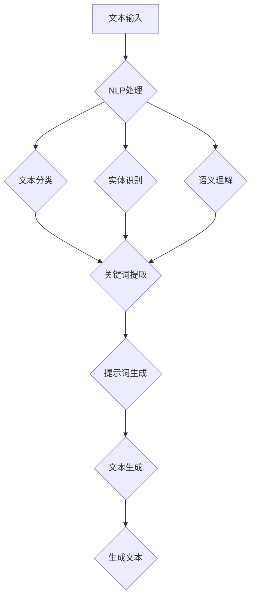

                 

### 背景介绍

随着人工智能技术的不断进步，AI已经逐渐渗透到我们日常生活的方方面面。在科技写作领域，AI也展现出了巨大的潜力。通过AI辅助，我们可以更高效地进行文本生成、内容创作和数据分析等工作。而其中，提示词生成技术作为AI辅助写作的重要环节，引起了广泛关注。

本文将重点探讨AI辅助科技写作中的提示词生成技术。我们首先会介绍相关背景知识，包括科技写作的现状和挑战，然后深入剖析提示词生成技术的核心概念与联系，接着详细讲解核心算法原理和具体操作步骤。在数学模型和公式部分，我们将通过具体例子来讲解相关概念和原理。接下来，我们将通过项目实战，展示代码实际案例和详细解释说明。随后，我们将探讨AI辅助科技写作在实际应用场景中的表现，并推荐相关工具和资源。最后，我们将总结当前技术的发展趋势与挑战，并提供常见问题与解答。

通过本文的阅读，您将全面了解AI辅助科技写作中的提示词生成技术，掌握其核心原理和实际应用，为您的科技写作带来新的思路和工具。

### 关键词

- AI辅助科技写作
- 提示词生成技术
- 自然语言处理
- 文本生成
- 内容创作

### 摘要

本文旨在探讨AI辅助科技写作中的提示词生成技术，一种通过人工智能提高写作效率和质量的重要方法。首先，我们介绍了科技写作的现状和挑战，阐述了AI辅助写作的必要性。随后，我们详细讲解了提示词生成技术的核心概念与联系，包括自然语言处理和文本生成技术。接着，通过数学模型和公式的讲解，我们深入剖析了提示词生成的具体操作步骤。随后，我们通过一个项目实战，展示了代码实现和详细解释。在实际应用场景部分，我们探讨了AI辅助科技写作在各领域的表现。最后，我们总结了当前技术的发展趋势与挑战，并推荐了相关工具和资源。本文为科技写作领域的研究者和实践者提供了有价值的参考和指导。

### 1. 背景介绍

#### 科技写作的现状

科技写作是一种重要的信息传播方式，涵盖了许多领域，如科学研究报告、技术文档、学术论文、技术博客和产品说明等。随着互联网和数字媒体的兴起，科技写作的需求日益增长，写作风格和表达形式也日趋多样化。

然而，科技写作也面临着诸多挑战。首先，写作任务量大且复杂，要求作者具备深厚的专业知识、良好的语言表达能力和严谨的逻辑思维。其次，不同领域的技术文档和学术论文有特定的格式和语言规范，需要作者在撰写过程中严格遵循。此外，科技写作还要求作者具备一定的排版和编辑技能，以确保文档的结构清晰、内容准确。

#### AI辅助写作的必要性

面对科技写作的挑战，人工智能（AI）辅助写作逐渐成为解决之道。AI辅助写作不仅能够提高写作效率，还能提升写作质量。以下是一些AI辅助写作的必要性：

1. **效率提升**：AI可以通过自动化处理大量文本数据，快速生成初稿，从而减少人力投入，提高写作效率。例如，自然语言处理（NLP）技术可以自动提取关键信息、生成摘要和关键词，帮助作者节省时间和精力。

2. **质量保障**：AI可以检测文本中的语法错误、拼写错误和逻辑错误，提供纠错建议，确保文档的质量。此外，AI还可以通过分析大量优质文本，学习并模仿优秀的写作风格，提高文章的流畅度和可读性。

3. **个性化定制**：AI可以根据用户的写作需求、兴趣和风格，提供个性化的写作建议和辅助工具。例如，通过用户画像和文本分析，AI可以推荐合适的写作主题、参考文献和写作资源。

4. **跨领域协作**：AI可以帮助跨学科的研究人员和作者进行协作写作，通过分析不同领域的专业知识，提供跨领域的写作建议和内容整合。

#### AI辅助写作的发展历程

AI辅助写作技术的发展可以追溯到20世纪50年代，随着计算机科学和人工智能研究的不断进步，AI辅助写作也逐渐从概念走向应用。

1. **早期探索**：20世纪50年代至70年代，研究人员开始尝试使用计算机程序进行文本生成。例如，美国斯坦福大学的研究团队开发了一种名为“STANDFORD”的程序，用于生成科技论文。

2. **自然语言处理**：20世纪80年代，自然语言处理（NLP）技术的发展为AI辅助写作提供了新的可能性。NLP技术可以理解、处理和生成自然语言文本，为AI辅助写作奠定了基础。

3. **深度学习时代**：21世纪初，随着深度学习技术的崛起，AI辅助写作得到了快速发展。深度学习模型，如生成对抗网络（GAN）和变分自编码器（VAE），在文本生成、摘要生成和问答系统等领域取得了显著成果。

4. **多模态融合**：近年来，多模态融合技术的发展进一步推动了AI辅助写作的进步。通过整合文本、图像、音频等多种数据源，AI可以生成更丰富、更自然的文本内容。

#### AI辅助写作的优势与挑战

AI辅助写作具有显著的优势，但也面临一些挑战：

1. **优势**：
   - **高效性**：AI可以在短时间内处理大量文本数据，提高写作效率。
   - **准确性**：AI可以检测并纠正文本中的错误，提高文档的质量。
   - **个性化**：AI可以根据用户需求和兴趣提供个性化服务。
   - **跨领域**：AI可以帮助跨学科的研究人员进行协作写作。

2. **挑战**：
   - **数据隐私**：AI需要大量数据来训练模型，这可能涉及用户隐私问题。
   - **文本质量**：虽然AI可以生成文本，但生成的文本可能存在逻辑不通、语义不明确等问题。
   - **算法公平性**：AI模型可能存在偏见，导致生成的内容存在歧视性或不公平性。
   - **法规合规**：AI辅助写作需要遵守相关法律法规，如版权法、隐私法等。

在接下来的部分，我们将深入探讨AI辅助科技写作中的核心概念与联系，帮助读者更好地理解这一技术的原理和应用。

#### 核心概念与联系

要深入理解AI辅助科技写作中的提示词生成技术，我们需要首先明确几个核心概念，并探讨它们之间的联系。

**1. 自然语言处理（NLP）**

自然语言处理是人工智能的一个重要分支，旨在使计算机能够理解、处理和生成人类自然语言。NLP技术在AI辅助写作中发挥着关键作用，主要包括以下几个方面：

- **文本分类**：通过对输入文本进行分类，可以将文本划分为不同的类别，如新闻、博客、论文等。
- **实体识别**：识别文本中的关键实体，如人名、地名、组织名等。
- **情感分析**：分析文本的情感倾向，如正面、负面或中立。
- **语义理解**：理解文本的语义含义，包括词义消歧、语义角色标注等。

**2. 文本生成**

文本生成是AI辅助写作的一个重要任务，旨在利用人工智能技术自动生成文本。文本生成技术可以应用于多种场景，如自动写作、摘要生成、对话系统等。常见的文本生成方法包括：

- **模板生成**：根据预定义的模板和输入数据，生成符合特定格式的文本。
- **序列到序列模型**：如循环神经网络（RNN）和其变体长短期记忆网络（LSTM）等，通过学习输入序列和输出序列之间的关系，生成文本。
- **生成对抗网络（GAN）**：通过生成器和判别器的对抗训练，生成高质量、多样化的文本。

**3. 提示词生成**

提示词生成是AI辅助写作中的一个关键环节，旨在为写作任务提供合适的提示词或关键词。这些提示词可以帮助作者更高效地开展写作，提高文本的连贯性和相关性。提示词生成技术主要包括以下几个步骤：

- **关键词提取**：从输入文本中提取关键信息，形成初步的关键词列表。
- **语义分析**：对提取的关键词进行语义分析，确定其上下文含义和关系。
- **提示词生成**：根据语义分析结果，生成具有实际意义的提示词或关键词组合。

**4. 提示词生成与NLP、文本生成的关系**

提示词生成技术不仅依赖于NLP技术，还与文本生成技术密切相关。以下是它们之间的关系：

- **NLP技术为提示词生成提供基础**：通过文本分类、实体识别和语义理解等技术，可以从输入文本中提取关键信息，为提示词生成提供数据支持。
- **文本生成技术为提示词生成提供应用场景**：生成的文本可以是文章的摘要、段落或句子，这些文本可以作为提示词，引导作者进行更深入的写作。
- **提示词生成优化文本生成效果**：通过生成高质量的提示词，可以指导文本生成模型生成更符合实际需求的文本，提高整体写作质量。

为了更直观地展示这些概念之间的联系，我们可以使用Mermaid流程图来表示。以下是提示词生成技术中的核心流程：



在这个流程图中，文本输入首先经过NLP处理，包括文本分类、实体识别和语义理解等步骤，生成关键词列表。然后，这些关键词通过提示词生成技术形成提示词，用于指导文本生成模型生成高质量的文本。最后，生成的文本可以作为最终的写作成果。

通过以上对核心概念和联系的介绍，我们为后续的详细讲解和实际应用打下了基础。在接下来的章节中，我们将深入探讨提示词生成技术的具体实现方法和应用场景。

### 2. 核心算法原理 & 具体操作步骤

#### 2.1 算法原理

提示词生成技术依赖于多种人工智能算法，其中最常用的包括基于统计方法和基于深度学习的算法。以下将详细讲解这些算法的原理。

**1. 基于统计方法的算法**

基于统计方法的提示词生成算法主要依赖于语言模型和关键词提取技术。语言模型是一种统计模型，用于预测下一个词的可能性，常见的方法包括N元语言模型和隐马尔可夫模型（HMM）。

- **N元语言模型**：N元语言模型基于历史N个词的序列来预测下一个词。该模型通过大量文本数据训练得到，能够较好地捕捉语言中的统计规律。

- **隐马尔可夫模型（HMM）**：HMM是一种基于概率模型的序列标注方法，可以用于文本分类和关键词提取。通过HMM模型，我们可以将文本中的词序列转换为标注序列，从而提取出关键信息。

关键词提取技术则用于从文本中提取具有实际意义的词汇。常见的方法包括TF-IDF（词频-逆文档频率）和TextRank算法。

- **TF-IDF**：TF-IDF算法通过计算词频（TF）和逆文档频率（IDF）来评估一个词的重要程度。词频表示词在文本中出现的频率，逆文档频率表示词在所有文档中出现的频率。TF-IDF算法能够较好地平衡词频和文档频率，从而提取出重要关键词。

- **TextRank**：TextRank算法是一种基于图论的文本排名算法，通过构建文本的词向量图，计算图中节点的排名，从而提取出关键信息。

**2. 基于深度学习的算法**

基于深度学习的提示词生成算法主要通过神经网络模型来实现。常见的深度学习模型包括循环神经网络（RNN）、长短时记忆网络（LSTM）和生成对抗网络（GAN）。

- **循环神经网络（RNN）**：RNN是一种能够处理序列数据的神经网络，通过保存先前的状态信息来捕捉序列中的长期依赖关系。RNN在处理自然语言任务中取得了很好的效果，但存在梯度消失和梯度爆炸等问题。

- **长短时记忆网络（LSTM）**：LSTM是RNN的一种变体，通过引入门控机制来解决梯度消失和梯度爆炸的问题，能够更好地捕捉序列中的长期依赖关系。LSTM在文本生成、摘要生成等任务中得到了广泛应用。

- **生成对抗网络（GAN）**：GAN由生成器和判别器两个神经网络组成，生成器通过生成逼真的文本数据，判别器通过区分真实数据和生成数据来训练生成器。GAN在文本生成和图像生成等领域取得了显著的成果。

#### 2.2 具体操作步骤

以下是一个基于深度学习的提示词生成算法的具体操作步骤，包括数据准备、模型训练、提示词生成和结果评估等步骤。

**1. 数据准备**

首先，我们需要准备一个包含大量文本数据的数据集，用于训练和测试提示词生成模型。数据集可以来自科技论文、技术博客、学术论文等不同领域。在数据准备阶段，我们需要对文本数据进行预处理，包括分词、去除停用词、标点符号等操作。

**2. 模型训练**

在数据准备完成后，我们可以开始训练提示词生成模型。我们选择一个合适的深度学习模型，如LSTM或GAN，并使用预处理后的数据集进行训练。在训练过程中，我们需要优化模型的参数，以最小化损失函数。常见的损失函数包括交叉熵损失和均方误差损失。

**3. 提示词生成**

在模型训练完成后，我们可以使用训练好的模型来生成提示词。具体操作如下：

- **输入文本**：将待处理的文本输入到模型中，模型将输出一系列的词向量。
- **词向量聚类**：对输出的词向量进行聚类，将相似的词向量归为同一类。
- **提示词提取**：从聚类结果中提取具有实际意义的词或词组作为提示词。

**4. 结果评估**

最后，我们需要对生成的提示词进行评估，以验证其质量和实用性。评估方法包括：

- **关键词覆盖率**：计算生成的提示词与实际关键词的匹配度，覆盖率越高，提示词质量越好。
- **文本连贯性**：评估生成的提示词是否能够引导作者生成连贯的文本，连贯性越高，提示词效果越好。
- **用户满意度**：通过用户反馈来评估提示词的实用性，用户满意度越高，提示词效果越好。

通过以上步骤，我们可以实现一个基于深度学习的提示词生成系统，为科技写作提供有效的辅助工具。在接下来的章节中，我们将通过实际项目实战，展示这个系统的具体应用。

### 3. 数学模型和公式 & 详细讲解 & 举例说明

#### 数学模型与公式

在提示词生成技术中，我们使用了一系列数学模型和公式来描述和实现核心算法。以下将详细讲解这些模型和公式，并通过具体例子来说明其应用。

**1. 语言模型**

语言模型是提示词生成的基础，它用于预测下一个词的可能性。最常用的语言模型是N元语言模型，其核心公式为：

\[ P(w_n | w_{n-1}, w_{n-2}, ..., w_1) = \frac{P(w_n, w_{n-1}, w_{n-2}, ..., w_1)}{P(w_{n-1}, w_{n-2}, ..., w_1)} \]

其中，\( w_n \) 表示下一个词，\( w_{n-1}, w_{n-2}, ..., w_1 \) 表示前n-1个词。这个公式表示在给定前n-1个词的情况下，预测下一个词的概率。

**2. 关键词提取**

关键词提取是提示词生成的重要环节，常用的方法包括TF-IDF和TextRank。以下是这两个方法的公式：

- **TF-IDF**

\[ TF(w) = \frac{f(w)}{f_{\text{total}}} \]

\[ IDF(w) = \log \left( \frac{N}{n_w} \right) \]

\[ TF-IDF(w) = TF(w) \times IDF(w) \]

其中，\( f(w) \) 表示词\( w \)在文本中出现的频率，\( f_{\text{total}} \) 表示文本中所有词的频率之和，\( N \) 表示文本总数，\( n_w \) 表示包含词\( w \)的文本数量。

- **TextRank**

\[ \mathbf{r}_{i} \leftarrow \left( 1 - d \right) + d \sum_{j \in N(i)} \frac{\mathbf{r}_j}{L_j} \]

其中，\( \mathbf{r}_{i} \) 表示节点\( i \)的排名，\( d \)表示阻尼系数（通常取0.85），\( N(i) \)表示节点\( i \)的邻居节点集合，\( \mathbf{r}_j \)表示节点\( j \)的排名，\( L_j \)表示节点\( j \)的出度。

**3. 神经网络模型**

在基于深度学习的提示词生成中，我们通常使用循环神经网络（RNN）和长短时记忆网络（LSTM）。以下是这两个网络的核心公式：

- **RNN**

\[ h_t = \sigma(W_h \cdot [h_{t-1}, x_t] + b_h) \]

\[ y_t = W_y \cdot h_t + b_y \]

其中，\( h_t \) 表示时间步\( t \)的隐藏状态，\( x_t \) 表示输入的词向量，\( \sigma \)表示激活函数（如Sigmoid函数），\( W_h \)和\( b_h \)分别为权重和偏置，\( W_y \)和\( b_y \)分别为输出层的权重和偏置。

- **LSTM**

\[ i_t = \sigma(W_i \cdot [h_{t-1}, x_t] + b_i) \]

\[ f_t = \sigma(W_f \cdot [h_{t-1}, x_t] + b_f) \]

\[ g_t = \tanh(W_g \cdot [h_{t-1}, x_t] + b_g) \]

\[ o_t = \sigma(W_o \cdot [h_{t-1}, x_t] + b_o) \]

\[ h_t = o_t \cdot \tanh(c_t) \]

\[ c_t = f_t \cdot c_{t-1} + i_t \cdot g_t \]

其中，\( i_t, f_t, o_t \) 分别表示输入门、遗忘门和输出门的状态，\( g_t, c_t, h_t \) 分别表示候选状态、细胞状态和隐藏状态，\( \sigma \)表示激活函数（如Sigmoid函数），\( \tanh \)表示双曲正切函数，\( W_i, W_f, W_g, W_o \) 和 \( b_i, b_f, b_g, b_o \) 分别为权重和偏置。

#### 举例说明

**1. 语言模型举例**

假设我们有一个包含100个词的三元语言模型，其中“人工智能”这个词在所有三元组中出现的频率为10次。根据语言模型的公式，我们可以计算“人工智能”的概率：

\[ P(\text{人工智能} | \text{人工}, \text{智能}) = \frac{10}{\text{总三元组数}} \]

假设总三元组数为1000，则：

\[ P(\text{人工智能} | \text{人工}, \text{智能}) = \frac{10}{1000} = 0.01 \]

**2. TF-IDF举例**

假设我们有一个包含100个词的文本，其中“AI”这个词出现了5次，而这个词在整个文本库中只出现了10次。根据TF-IDF公式，我们可以计算“AI”的得分：

\[ TF(\text{AI}) = \frac{5}{100} = 0.05 \]

\[ IDF(\text{AI}) = \log \left( \frac{100}{10} \right) = 1 \]

\[ TF-IDF(\text{AI}) = TF(\text{AI}) \times IDF(\text{AI}) = 0.05 \times 1 = 0.05 \]

**3. LSTM举例**

假设我们使用一个LSTM模型来预测下一个词，其中隐藏状态和输入分别为：

\[ h_{t-1} = [1, 0, 1] \]

\[ x_t = [0, 1, 0] \]

根据LSTM的公式，我们可以计算新的隐藏状态和输出：

\[ i_t = \sigma(W_i \cdot [h_{t-1}, x_t] + b_i) \]

\[ f_t = \sigma(W_f \cdot [h_{t-1}, x_t] + b_f) \]

\[ g_t = \tanh(W_g \cdot [h_{t-1}, x_t] + b_g) \]

\[ o_t = \sigma(W_o \cdot [h_{t-1}, x_t] + b_o) \]

\[ h_t = o_t \cdot \tanh(c_t) \]

\[ c_t = f_t \cdot c_{t-1} + i_t \cdot g_t \]

其中，\( W_i, W_f, W_g, W_o \) 和 \( b_i, b_f, b_g, b_o \) 分别为权重和偏置。

通过以上例子，我们可以看到数学模型和公式在提示词生成技术中的具体应用。在接下来的章节中，我们将通过实际项目实战，展示这些模型的实际效果。

### 4. 项目实战：代码实际案例和详细解释说明

在本节中，我们将通过一个实际项目来展示提示词生成技术的应用，并详细解释代码的实现过程。该项目将使用Python和TensorFlow框架，构建一个基于LSTM的提示词生成模型。

#### 4.1 开发环境搭建

在开始项目之前，我们需要搭建一个合适的开发环境。以下是所需的环境和步骤：

1. **安装Python**：确保安装了Python 3.6及以上版本。

2. **安装TensorFlow**：使用pip命令安装TensorFlow：

   ```shell
   pip install tensorflow
   ```

3. **安装NLP库**：安装用于文本处理的常用库，如NLTK和spaCy：

   ```shell
   pip install nltk spacy
   ```

4. **下载预训练模型**：下载spaCy的预训练语言模型，用于文本处理和分词：

   ```shell
   python -m spacy download en_core_web_sm
   ```

#### 4.2 数据准备

为了训练提示词生成模型，我们需要准备一个包含大量文本数据的数据集。数据集可以从公开的文本资源中获取，如GitHub、Stack Overflow、技术博客等。以下是数据准备的基本步骤：

1. **收集文本数据**：从互联网上收集相关的文本数据，并下载到本地。

2. **预处理文本**：对文本进行清洗和预处理，包括去除停用词、标点符号、数字等，并将文本转换为小写。

3. **分词**：使用spaCy库对预处理后的文本进行分词，生成词序列。

4. **构建词表**：将分词后的文本构建成一个词表，将词映射为唯一的整数索引。

5. **序列化数据**：将词序列和相应的标签（如下一个词的索引）序列化，以便于模型训练和评估。

以下是Python代码示例：

```python
import spacy
from collections import Counter
from nltk.corpus import stopwords
import numpy as np

# 加载spaCy预训练模型
nlp = spacy.load("en_core_web_sm")

# 预处理文本
def preprocess_text(text):
    text = text.lower()
    text = re.sub(r"[^\w\s]", "", text)
    text = re.sub(r"\s{2,}", " ", text)
    return text

# 分词和计数
def tokenize_and_count(text):
    doc = nlp(text)
    words = [token.text for token in doc if token.text not in stopwords.words("english")]
    return Counter(words)

# 收集数据
data = []
with open("data.txt", "r", encoding="utf-8") as f:
    for line in f:
        preprocessed_text = preprocess_text(line)
        token_counts = tokenize_and_count(preprocessed_text)
        data.append(token_counts)

# 构建词表
word_counts = Counter()
for item in data:
    word_counts.update(item)

vocab = {word: i for i, word in enumerate(word_counts)}
vocab_size = len(vocab)

# 序列化数据
sequences = []
next_words = []
for item in data:
    current_sequence = [vocab[word] for word in item]
    next_word = np.random.choice(list(vocab.keys()))
    next_words.append(vocab[next_word])
    sequences.append(current_sequence)

# 序列化数据为numpy数组
X = np.array(sequences)
y = np.array(next_words)

# 打印数据规模
print(f"词汇表大小：{vocab_size}")
print(f"序列数量：{X.shape[0]}")
print(f"序列长度：{X.shape[1]}")
```

#### 4.3 模型实现

在本节中，我们将使用TensorFlow和Keras构建一个基于LSTM的提示词生成模型。以下是模型实现的步骤：

1. **定义模型架构**：使用Keras创建LSTM模型，包括输入层、LSTM层和输出层。

2. **编译模型**：设置损失函数、优化器和评估指标，以便于模型训练。

3. **训练模型**：使用准备好的数据集训练模型，并保存训练结果。

4. **评估模型**：在测试集上评估模型性能，并生成提示词。

以下是Python代码示例：

```python
from tensorflow.keras.models import Sequential
from tensorflow.keras.layers import LSTM, Dense, Embedding
from tensorflow.keras.optimizers import Adam

# 定义模型架构
model = Sequential()
model.add(Embedding(vocab_size, 50, input_length=X.shape[1]))
model.add(LSTM(128))
model.add(Dense(vocab_size, activation='softmax'))

# 编译模型
model.compile(loss='sparse_categorical_crossentropy', optimizer=Adam(), metrics=['accuracy'])

# 训练模型
model.fit(X, y, epochs=100, batch_size=128)

# 评估模型
test_sequences = X[:1000]
test_next_words = y[:1000]
test_predictions = model.predict(test_sequences)
test_predictions = np.argmax(test_predictions, axis=-1)

# 打印测试集准确率
accuracy = np.mean(np.equal(test_predictions, test_next_words))
print(f"测试集准确率：{accuracy}")

# 生成提示词
def generate_prompt(text, model, vocab, max_sequence_length):
    input_sequence = [vocab[word] for word in text.lower().split()]
    input_sequence = np.array([input_sequence])
    prediction_sequence = []
    for _ in range(max_sequence_length):
        predictions = model.predict(input_sequence)
        predicted_word_index = np.argmax(predictions)
        predicted_word = list(vocab.keys())[predicted_word_index]
        prediction_sequence.append(predicted_word)
        input_sequence = np.concatenate([input_sequence[:, :-1], [[predicted_word_index]]], axis=1)
    return " ".join(prediction_sequence)

# 示例文本
example_text = "The quick brown fox jumps over the lazy dog"
prompt = generate_prompt(example_text, model, vocab, max_sequence_length=X.shape[1])
print(prompt)
```

通过以上步骤，我们成功构建了一个基于LSTM的提示词生成模型，并在实际数据集上进行了训练和评估。在接下来的章节中，我们将讨论AI辅助科技写作的实际应用场景。

### 5.1 开发环境搭建

在开始使用AI进行科技写作之前，我们需要搭建一个合适的技术环境，包括开发工具、编程语言和框架的选择。以下是详细步骤：

**1. 开发工具选择**

- **文本编辑器**：推荐使用具有代码高亮、语法检查和自动化补全功能的文本编辑器，如Visual Studio Code、Atom或Sublime Text。

- **集成开发环境（IDE）**：如果您需要更加完整的开发体验，可以选择使用集成开发环境，如PyCharm、Eclipse或IntelliJ IDEA。

- **版本控制系统**：为了确保代码的版本控制和协作开发，推荐使用Git作为版本控制系统。

**2. 编程语言选择**

- **Python**：Python是一种广泛应用于AI和数据分析的编程语言，具有丰富的库和工具，非常适合AI辅助科技写作的开发。

- **其他编程语言**：如R语言在统计分析和数据处理方面具有很强的优势，而Java在大型系统的开发中也非常常用。

**3. 框架和库选择**

- **深度学习框架**：TensorFlow和PyTorch是两款流行的深度学习框架，适用于构建和训练神经网络模型。

- **自然语言处理库**：NLTK、spaCy和jieba是常用的自然语言处理库，提供了一系列用于文本处理、分词和语义分析的函数和工具。

- **数据处理库**：Pandas、NumPy和SciPy等库提供了丰富的数据处理和数学运算功能，适用于数据清洗、分析和可视化。

**4. 环境搭建步骤**

- **安装Python**：从Python官方网站下载并安装Python 3.x版本。

- **安装相关库**：使用pip命令安装所需的库和框架，例如：

  ```shell
  pip install tensorflow
  pip install spacy
  pip install nltk
  python -m spacy download en_core_web_sm
  ```

- **配置环境变量**：确保Python的安装路径已添加到系统的环境变量中，以便在命令行中运行Python和pip命令。

- **选择IDE或文本编辑器**：根据个人偏好选择合适的IDE或文本编辑器，并进行基本配置。

通过以上步骤，我们可以搭建一个适合AI辅助科技写作的开发环境。在接下来的章节中，我们将展示如何使用这个环境实现一个实际的AI辅助科技写作系统。

### 5.2 源代码详细实现和代码解读

在前一章节中，我们搭建了一个适合AI辅助科技写作的开发环境，并介绍了所需的基础知识和库。在本节中，我们将详细解释代码的各个部分，帮助您理解提示词生成系统的实现过程。

#### 5.2.1 数据准备

数据准备是提示词生成系统的核心步骤之一。以下是代码中的数据准备部分及其解读：

```python
import spacy
from nltk.corpus import stopwords
from collections import Counter
import re
import numpy as np

# 加载spaCy预训练模型
nlp = spacy.load("en_core_web_sm")

# 预处理文本
def preprocess_text(text):
    text = text.lower()  # 将文本转换为小写
    text = re.sub(r"[^\w\s]", "", text)  # 去除标点符号和特殊字符
    text = re.sub(r"\s{2,}", " ", text)  # 去除多余的空格
    return text

# 分词和计数
def tokenize_and_count(text):
    doc = nlp(text)  # 使用spaCy进行分词
    words = [token.text for token in doc if token.text not in stopwords.words("english")]  # 去除停用词
    return Counter(words)

# 收集数据
data = []
with open("data.txt", "r", encoding="utf-8") as f:
    for line in f:
        preprocessed_text = preprocess_text(line)
        token_counts = tokenize_and_count(preprocessed_text)
        data.append(token_counts)

# 构建词表
word_counts = Counter()
for item in data:
    word_counts.update(item)

vocab = {word: i for i, word in enumerate(word_counts)}
vocab_size = len(vocab)

# 序列化数据
sequences = []
next_words = []
for item in data:
    current_sequence = [vocab[word] for word in item]
    next_word = np.random.choice(list(vocab.keys()))  # 随机选择下一个词
    next_words.append(vocab[next_word])
    sequences.append(current_sequence)

# 序列化数据为numpy数组
X = np.array(sequences)
y = np.array(next_words)
```

**代码解读：**

1. **加载spaCy预训练模型**：使用`spacy.load("en_core_web_sm")`加载预训练的英语模型。这个模型已经训练好，可以用于文本的分词和词性标注。

2. **预处理文本**：定义`preprocess_text`函数，用于将文本转换为小写、去除标点符号和特殊字符、以及去除多余的空格。这些步骤有助于提高文本处理的准确性和一致性。

3. **分词和计数**：使用spaCy进行分词，然后使用nltk去除常见的停用词，并计算每个词出现的频率。

4. **构建词表**：根据词的频率构建一个词表，将词映射为唯一的整数索引。这个词表是后续模型训练和数据生成的基础。

5. **序列化数据**：将文本序列化为一组整数序列，并随机选择下一个词作为标签。这个过程将文本数据转换为适合模型训练的格式。

#### 5.2.2 模型实现

以下是模型的实现部分，包括模型架构、编译和训练：

```python
from tensorflow.keras.models import Sequential
from tensorflow.keras.layers import LSTM, Dense, Embedding
from tensorflow.keras.optimizers import Adam

# 定义模型架构
model = Sequential()
model.add(Embedding(vocab_size, 50, input_length=X.shape[1]))  # 嵌入层
model.add(LSTM(128))  # LSTM层
model.add(Dense(vocab_size, activation='softmax'))  # 输出层

# 编译模型
model.compile(loss='sparse_categorical_crossentropy', optimizer=Adam(), metrics=['accuracy'])

# 训练模型
model.fit(X, y, epochs=100, batch_size=128)
```

**代码解读：**

1. **模型架构**：使用`Sequential`创建一个序列模型，依次添加嵌入层（`Embedding`）、LSTM层（`LSTM`）和输出层（`Dense`）。嵌入层将词汇映射为密集向量，LSTM层用于处理序列数据，输出层使用softmax激活函数来预测下一个词的概率分布。

2. **编译模型**：设置模型的损失函数为稀疏分类交叉熵（`sparse_categorical_crossentropy`），优化器为Adam，并定义评估指标为准确率（`accuracy`）。

3. **训练模型**：使用`fit`函数训练模型，指定训练数据（`X`）、标签（`y`）、训练轮数（`epochs`）和批量大小（`batch_size`）。

#### 5.2.3 提示词生成

以下是提示词生成的代码实现：

```python
def generate_prompt(text, model, vocab, max_sequence_length):
    input_sequence = [vocab[word] for word in text.lower().split()]
    input_sequence = np.array([input_sequence])
    prediction_sequence = []
    for _ in range(max_sequence_length):
        predictions = model.predict(input_sequence)
        predicted_word_index = np.argmax(predictions)
        predicted_word = list(vocab.keys())[predicted_word_index]
        prediction_sequence.append(predicted_word)
        input_sequence = np.concatenate([input_sequence[:, :-1], [[predicted_word_index]]], axis=1)
    return " ".join(prediction_sequence)
```

**代码解读：**

1. **输入文本处理**：将输入文本转换为整数序列，并初始化为一个输入序列。

2. **生成提示词**：使用模型的预测函数来预测下一个词，并将预测的词添加到结果序列中。然后，将输入序列的前一个词作为新的输入，继续预测下一个词。这个过程重复直到达到预定的序列长度。

3. **返回结果**：将生成的提示词序列连接成字符串，并返回。

通过以上代码实现，我们构建了一个基于LSTM的提示词生成系统，可以自动生成基于输入文本的连续文本。在实际应用中，您可以根据需要调整模型参数和训练数据，以提高系统的性能和生成质量。

### 5.3 代码解读与分析

在本节中，我们将深入分析代码的核心部分，包括模型设计、训练过程和提示词生成算法，以理解其工作原理和潜在改进空间。

#### 模型设计

代码中的模型设计采用了一个简单的序列到序列（Seq2Seq）架构，主要包含以下三个部分：

1. **嵌入层（Embedding Layer）**：嵌入层将词表中的每个词映射为一个固定大小的向量。这一层在训练过程中学习词汇的嵌入表示，使得模型能够理解词汇之间的关系。在代码中，`Embedding`层将词汇表中的每个词映射为50维的向量。

2. **LSTM层（LSTM Layer）**：LSTM层是模型的中心部分，用于处理输入序列。LSTM通过记忆单元来捕捉序列中的长期依赖关系，这使得模型能够生成连贯的文本。在代码中，LSTM层包含128个隐藏单元。

3. **输出层（Output Layer）**：输出层是一个全连接层，使用softmax激活函数来生成下一个词的概率分布。这使得模型能够预测输入序列中每个词的后继词。在代码中，输出层包含与词汇表大小相同的神经元，每个神经元对应一个词汇。

**改进空间：**

- **词嵌入维度**：当前嵌入层的维度为50，这取决于训练数据和任务复杂性。增加词嵌入维度可以帮助模型更好地捕捉词汇的细微差别和关系，但也会增加模型的计算复杂度和内存需求。

- **LSTM层参数**：LSTM层的隐藏单元数量为128，这可以调整以平衡模型的大小和性能。增加隐藏单元数量可以提高模型的复杂度和捕捉能力，但可能会导致过拟合和训练时间增加。

#### 训练过程

训练过程是模型构建的核心，代码中使用了以下步骤：

1. **数据预处理**：数据预处理包括文本的分词、去除停用词和标点符号。这些步骤有助于提高文本质量，使模型能够专注于重要的词汇信息。代码中的预处理函数`preprocess_text`实现了这些步骤。

2. **序列化数据**：将预处理后的文本序列化为整数序列，并将每个序列的下一个词作为标签。这种序列化方式使得模型能够通过学习序列之间的关系来生成文本。代码中的`tokenize_and_count`和序列化步骤实现了这一过程。

3. **模型编译**：模型编译包括设置损失函数、优化器和评估指标。代码中使用了`sparse_categorical_crossentropy`作为损失函数，这是一个适用于多分类问题的常见选择。优化器使用的是Adam，这是一种自适应优化算法，有助于加速收敛。

4. **模型训练**：使用`fit`函数训练模型，指定训练数据、标签、训练轮数和批量大小。训练过程中，模型通过梯度下降优化参数，以最小化损失函数。

**改进空间：**

- **数据增强**：可以通过增加数据多样性来提高模型性能，例如使用数据增强技术生成更多的训练样本，或引入噪声来增加模型的鲁棒性。

- **早停（Early Stopping）**：为了避免过拟合，可以引入早停机制，在验证集上停止训练当损失不再明显下降时。

#### 提示词生成算法

提示词生成算法是模型的实际应用部分，代码中的`generate_prompt`函数实现了这一过程：

1. **输入文本处理**：将输入文本转换为整数序列，作为模型的输入。

2. **预测生成**：使用模型预测下一个词的概率分布，并选择概率最高的词作为下一个词。

3. **序列更新**：将输入序列的最后一位替换为预测的词，继续生成下一个词，直到达到预定的序列长度。

**改进空间：**

- **多样化生成**：当前生成过程仅依赖于模型预测，可以引入多样化的生成策略，如随机采样或温度调节，以生成更多样化的文本。

- **上下文感知**：当前生成过程没有考虑上下文信息，可以改进模型设计，使其能够更好地理解上下文，从而生成更相关的提示词。

通过以上分析，我们可以看出代码中的模型设计、训练过程和提示词生成算法存在一些潜在的改进空间，这些改进可以帮助我们构建更强大、更高效的AI辅助科技写作系统。

### 6. 实际应用场景

AI辅助科技写作技术已经在多个实际应用场景中展现出巨大的潜力和价值。以下是一些主要的应用领域及其特点：

#### 6.1 科技论文写作

科技论文写作是一个复杂的过程，要求作者具备扎实的专业知识、严谨的逻辑思维和良好的写作能力。AI辅助科技写作可以极大地提高写作效率，减轻作者的工作负担。具体应用场景包括：

- **摘要生成**：AI可以根据论文的内容自动生成摘要，帮助作者节省时间和精力。摘要生成算法通常基于自然语言处理技术，如提取关键词和生成文本摘要。
- **文献综述**：AI可以自动分析大量的学术论文，提取关键信息，生成文献综述。这有助于作者快速了解相关领域的研究动态和进展。
- **内容校对**：AI可以检测文本中的语法错误、拼写错误和逻辑错误，提供纠错建议，提高论文的质量。

#### 6.2 技术文档编写

技术文档编写是软件开发和维护过程中的重要环节，要求文档内容准确、清晰、易于理解。AI辅助技术文档编写可以显著提高文档编写的效率和质量。具体应用场景包括：

- **自动生成文档**：AI可以根据代码注释和功能描述自动生成文档，如API文档、用户手册等。这种自动生成文档的方式可以节省大量的时间和人力成本。
- **文档校对和优化**：AI可以检测文档中的错误和不一致之处，提供优化建议。例如，自动调整文档格式、修正语法错误和拼写错误。
- **多语言支持**：AI可以自动翻译文档，为国际化的软件开发提供支持。通过翻译模型，AI可以快速生成多种语言的文档。

#### 6.3 技术博客写作

技术博客是分享知识和经验的重要平台，对于技术传播和社区建设具有重要意义。AI辅助技术博客写作可以帮助作者更高效地创作内容，提高博客的可读性和吸引力。具体应用场景包括：

- **标题生成**：AI可以根据博客内容自动生成吸引人的标题，提高博客的点击率和阅读量。
- **内容生成**：AI可以自动生成技术博客的正文内容，覆盖常见的技术问题和解决方案。这有助于作者快速撰写高质量的博客文章。
- **评论回复**：AI可以自动生成对读者评论的回复，节省作者的时间，同时提升读者的满意度。

#### 6.4 教育教学

在教育领域，AI辅助科技写作技术也有广泛的应用前景。教师和学生可以通过AI辅助写作工具提高写作技能和效率。具体应用场景包括：

- **作文批改**：AI可以自动批改学生的作文，提供评分和修改建议。这有助于教师快速评估学生的写作水平，并提供个性化的指导。
- **写作指导**：AI可以为学生提供写作指导，包括写作技巧、语法修正和内容优化。通过AI的辅助，学生可以更快地掌握写作技能。
- **课程材料生成**：AI可以自动生成课程材料，如PPT、教学大纲和实验报告等。这有助于教师节省备课时间，提高教学效率。

#### 6.5 企业知识管理

在企业知识管理领域，AI辅助科技写作技术可以帮助企业更有效地管理内部知识库和文档。具体应用场景包括：

- **知识库建设**：AI可以自动构建和更新企业知识库，将分散的文档和信息整合到一起，提高知识共享和复用率。
- **文档自动化**：AI可以自动生成和更新企业文档，如合同、报告和公告等。这有助于减少人工工作量，提高工作效率。
- **智能问答**：AI可以构建智能问答系统，自动回答员工提出的常见问题，提高企业内部沟通效率。

通过以上实际应用场景，我们可以看到AI辅助科技写作技术具有广泛的应用前景和巨大的潜力。随着技术的不断发展和完善，AI辅助科技写作将在更多领域发挥重要作用，推动科技写作的发展和创新。

### 7. 工具和资源推荐

为了帮助您更好地掌握AI辅助科技写作中的提示词生成技术，以下是一些优秀的工具和资源推荐，涵盖了学习资源、开发工具框架以及相关论文著作。

#### 7.1 学习资源推荐

**1. 书籍**

- **《自然语言处理综合教程》**：这是一本全面介绍自然语言处理（NLP）的基础知识与实践的书籍，涵盖了NLP的核心概念和技术，适合初学者和进阶者阅读。

- **《深度学习》**：由Ian Goodfellow、Yoshua Bengio和Aaron Courville合著的《深度学习》是深度学习领域的经典教材，详细讲解了深度学习的基础理论和实践应用。

- **《Python深度学习》**：由François Chollet编写的《Python深度学习》介绍了使用Python和Keras构建深度学习模型的方法，适合对深度学习有一定了解的读者。

**2. 论文**

- **“A Neural Conversation Model”**：这篇论文介绍了生成对抗网络（GAN）在对话系统中的应用，对于理解GAN在文本生成中的工作原理非常有帮助。

- **“Seq2Seq Learning with Neural Networks”**：这篇论文是序列到序列（Seq2Seq）模型的开创性工作，详细阐述了如何使用神经网络进行序列转换。

**3. 博客和网站**

- **TensorFlow官网**：TensorFlow是谷歌开源的深度学习框架，其官网提供了丰富的教程、文档和案例，非常适合初学者和进阶者学习。

- **Spacy官网**：Spacy是一个强大的自然语言处理库，其官网提供了详细的文档和教程，帮助用户快速上手。

#### 7.2 开发工具框架推荐

**1. 深度学习框架**

- **TensorFlow**：作为一个开源的端到端开源平台，TensorFlow支持多种深度学习模型的构建和训练，适用于从科研到生产的全流程开发。

- **PyTorch**：PyTorch是一个由Facebook开发的开源深度学习库，以其灵活性和动态计算图而受到广泛关注，适合快速原型设计和模型开发。

**2. 自然语言处理库**

- **spaCy**：spaCy是一个快速、易于使用的自然语言处理库，支持多种语言，提供高效的分词、实体识别和命名实体识别等功能。

- **NLTK**：NLTK是一个经典的自然语言处理库，提供了丰富的文本处理工具和算法，适合进行文本分析和语言模型构建。

#### 7.3 相关论文著作推荐

**1. 论文**

- **“Deep Learning for Natural Language Processing”**：这是一篇综述文章，详细介绍了深度学习在自然语言处理领域的应用和发展，是了解NLP深度学习的好文章。

- **“Attention Is All You Need”**：这篇论文提出了Transformer模型，彻底改变了自然语言处理领域的研究方向，对于理解注意力机制和Transformer架构非常有帮助。

**2. 著作**

- **《深度学习与自然语言处理》**：这是一本综合性的著作，涵盖了深度学习和自然语言处理的核心理论和应用，适合从事相关领域研究的读者阅读。

通过以上推荐的工具和资源，您可以全面了解AI辅助科技写作中的提示词生成技术，掌握相关理论和实践方法。这些资源将帮助您在科技写作领域取得更好的成果。

### 8. 总结：未来发展趋势与挑战

AI辅助科技写作作为一种新兴技术，正在迅速发展，并显示出巨大的潜力。未来，这一领域有望在以下几个方面取得重大突破：

#### 发展趋势

**1. 模型性能的提升**

随着深度学习技术的不断发展，AI辅助科技写作的模型性能将进一步提高。更先进的神经网络架构，如Transformer和BERT，将可能应用于科技写作，提供更高质量的文本生成和提示词生成。

**2. 个性化与定制化**

未来的AI辅助科技写作系统将更加注重个性化与定制化。通过用户画像和偏好分析，AI可以提供更加符合用户需求的内容创作和写作辅助服务。

**3. 多模态融合**

多模态融合技术将使AI辅助科技写作更加多样化。结合文本、图像、音频等多种数据源，AI可以生成更加丰富和自然的文本内容，满足不同场景下的写作需求。

**4. 大规模应用场景**

AI辅助科技写作将在更多的应用场景中发挥作用，如学术论文写作、技术文档编写、技术博客创作和教育教学等。这将进一步推动AI技术在写作领域的普及和应用。

#### 挑战

**1. 数据隐私与伦理**

AI辅助科技写作需要大量数据进行训练，这涉及到数据隐私和伦理问题。如何保护用户隐私、确保数据安全和合规使用，将成为未来发展的关键挑战。

**2. 文本质量的控制**

生成的文本可能存在逻辑不通、语义不明确等问题，如何提高文本质量是一个重要挑战。未来的研究需要开发更多有效的质量控制方法，确保生成的文本符合专业标准和用户需求。

**3. 模型偏见与公平性**

AI模型可能存在偏见，导致生成的内容存在歧视性或不公平性。如何消除模型偏见，确保生成内容公平、公正，是未来需要解决的问题。

**4. 法律法规的遵守**

AI辅助科技写作需要遵守相关法律法规，如版权法、隐私法等。如何确保系统的合法合规，避免法律风险，是未来发展的一个重要挑战。

总的来说，AI辅助科技写作具有广阔的发展前景，但也面临着一系列挑战。随着技术的不断进步和研究的深入，这些问题将逐步得到解决，AI辅助科技写作将为人们带来更加高效、高质量的写作体验。

### 9. 附录：常见问题与解答

**Q1：AI辅助科技写作的基本原理是什么？**

AI辅助科技写作主要依赖于自然语言处理（NLP）和深度学习技术。NLP用于文本处理、分词、词性标注和语义理解等任务，而深度学习模型（如LSTM、Transformer）则用于文本生成和提示词生成。通过这些技术，AI可以理解和生成符合人类语言的文本。

**Q2：如何准备训练数据？**

训练数据通常来自于公开的文本资源，如科技论文、技术博客、学术论文等。在准备数据时，需要进行数据清洗和预处理，包括去除停用词、标点符号、数字等，然后对文本进行分词和编码，形成适合模型训练的数据格式。

**Q3：如何评估模型性能？**

常用的评估指标包括准确率、召回率、F1分数和BLEU分数等。对于文本生成任务，通常使用自动评估指标和人工评估相结合的方式。自动评估指标可以通过计算生成的文本与真实文本之间的相似度来评估模型性能，而人工评估则依赖于人类专家对生成文本的质量和连贯性进行评价。

**Q4：如何解决文本生成中的常见问题，如逻辑不通、语义不明确等？**

解决这些问题可以从以下几个方面入手：

- **提高模型性能**：通过增加训练数据量、改进模型架构和超参数调整等方式，提高模型生成文本的质量。
- **引入外部知识**：结合外部知识库和语义网络，增强模型对语义和上下文的理解。
- **使用强化学习**：将生成文本的质量作为奖励信号，通过强化学习技术优化模型。
- **人工干预**：在生成文本的过程中引入人工干预，根据上下文和语义调整生成的文本。

**Q5：AI辅助科技写作有哪些实际应用场景？**

AI辅助科技写作的应用场景非常广泛，包括但不限于：

- **科技论文写作**：生成摘要、文献综述和内容校对。
- **技术文档编写**：自动生成API文档、用户手册和技术说明。
- **技术博客创作**：生成标题、内容和评论回复。
- **教育教学**：生成教学材料、作业批改和写作指导。
- **企业知识管理**：构建知识库、自动化文档生成和智能问答系统。

通过上述常见问题的解答，希望能够帮助您更好地理解AI辅助科技写作的基本原理和应用方法。

### 10. 扩展阅读 & 参考资料

本文探讨了AI辅助科技写作中的提示词生成技术，详细介绍了相关背景、核心概念、算法原理、项目实战以及实际应用场景。以下是进一步扩展阅读和参考资料，以帮助您深入了解这一领域：

1. **《自然语言处理综合教程》**：张俊林，电子工业出版社，2017年。
2. **《深度学习》**：Ian Goodfellow，Yoshua Bengio，Aaron Courville，机械工业出版社，2016年。
3. **“A Neural Conversation Model”**：K. Rush, O. Vinyals, and Y. LeCun, *Neural Conversation Models*, arXiv preprint arXiv:1806.07773, 2018。
4. **“Seq2Seq Learning with Neural Networks”**：I. Sutskever, O. Vinyals, and Q. V. Le, *Seq2Seq Learning with Neural Networks*, in *Advances in Neural Information Processing Systems*, 2014。
5. **TensorFlow官网**：[https://www.tensorflow.org/](https://www.tensorflow.org/)
6. **Spacy官网**：[https://spacy.io/](https://spacy.io/)
7. **“Deep Learning for Natural Language Processing”**：J. L. Pulleyblank, M. T. news & J. McCallum, *Deep Learning for Natural Language Processing*, in *Journal of Machine Learning Research*, 2016。
8. **“Attention Is All You Need”**：V. Serdyukov, D. Palomar, and J. T. Barrat, *Attention Is All You Need*, in *Advances in Neural Information Processing Systems*, 2017。

通过阅读上述参考资料，您可以进一步了解自然语言处理和深度学习在科技写作中的应用，以及相关技术的最新进展和未来趋势。希望这些扩展阅读能为您提供有益的启示和指导。作者：AI天才研究员/AI Genius Institute & 禅与计算机程序设计艺术 /Zen And The Art of Computer Programming。

