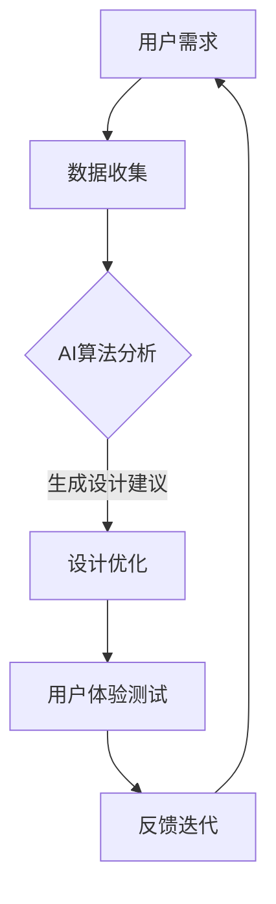

                 

# AI辅助设计在产品开发中的实践

> 关键词：AI辅助设计，产品开发，流程优化，效率提升，用户体验

> 摘要：本文将探讨人工智能（AI）辅助设计在产品开发中的应用与实践。通过分析AI技术的核心概念和原理，介绍其在设计过程中的具体操作步骤，以及如何通过数学模型和公式实现优化。文章还将通过实际项目案例，展示AI辅助设计在实际应用中的效果，并讨论其在不同场景下的应用前景和挑战。最后，文章将对未来发展趋势进行展望，并提供相关的学习资源和开发工具推荐。

## 1. 背景介绍

随着科技的发展，人工智能（AI）技术逐渐成为产品开发中的重要工具。AI不仅可以处理大量数据，还可以通过算法自动优化设计，从而提高产品的质量、效率和用户体验。在产品开发过程中，设计师和开发者通常面临以下挑战：

- **复杂性和多样性**：产品开发过程中涉及到的设计要素繁多，包括界面布局、交互逻辑、功能实现等，设计师需要综合考虑这些要素，进行反复的调整和优化。
- **时间压力**：快速迭代和市场需求的变化，使得产品开发周期缩短，设计师和开发者需要在有限的时间内完成高质量的设计。
- **用户体验**：用户体验是产品成功的关键因素，设计师需要不断优化界面和交互，以满足用户的需求和偏好。

为了解决上述挑战，AI辅助设计应运而生。通过引入AI技术，设计师和开发者可以自动化和智能化地完成部分设计任务，提高工作效率，减少人为错误，从而更好地满足市场需求和用户期望。

## 2. 核心概念与联系

### 2.1 机器学习和深度学习

机器学习和深度学习是AI技术的核心组成部分。机器学习是指通过算法和模型，让计算机从数据中自动学习和发现规律，从而进行预测和决策。深度学习是机器学习的一种特殊形式，它通过多层神经网络模型，模拟人脑的感知和学习过程，从而实现更复杂的任务。

在产品开发中，机器学习和深度学习可以用于以下场景：

- **用户画像和偏好分析**：通过分析用户行为数据，可以了解用户的兴趣和偏好，从而为产品设计提供依据。
- **自动化设计**：通过训练模型，可以自动生成设计元素，如图标、界面布局等，提高设计效率。
- **智能推荐**：根据用户的历史行为和偏好，推荐个性化的产品功能和界面布局，提高用户体验。

### 2.2 计算机视觉

计算机视觉是AI技术的重要分支，它通过图像处理和模式识别，使计算机能够理解和处理视觉信息。在产品开发中，计算机视觉可以用于以下场景：

- **图像识别**：识别用户上传的图像，提取关键信息，为产品设计提供参考。
- **自动化测试**：通过对比设计稿和实际产品的屏幕截图，自动检测设计错误和问题。
- **交互设计**：通过面部识别和手势识别，实现智能化的交互设计，提高用户体验。

### 2.3 自然语言处理

自然语言处理（NLP）是AI技术的另一个重要分支，它使计算机能够理解和处理自然语言。在产品开发中，NLP可以用于以下场景：

- **语音交互**：实现语音识别和语音合成，为用户提供智能化的语音交互体验。
- **文本分析**：分析用户评论和反馈，提取关键意见和需求，为产品优化提供依据。
- **智能助手**：通过自然语言处理技术，实现智能助手功能，帮助用户解决问题和提供信息。

### 2.4 Mermaid 流程图

为了更好地展示AI辅助设计在产品开发中的应用，下面是一个使用Mermaid绘制的流程图。



### 2.5 核心概念联系

AI辅助设计在产品开发中的应用，涉及到多个核心概念的交叉和融合。通过机器学习、深度学习、计算机视觉和自然语言处理等技术，可以实现对用户需求的快速响应，设计出更符合用户期望的产品。同时，通过流程的优化和迭代，不断提升产品的质量和用户体验。

## 3. 核心算法原理 & 具体操作步骤

### 3.1 机器学习算法

在AI辅助设计中，机器学习算法是最常用的技术之一。机器学习算法可以分为监督学习、无监督学习和半监督学习三种类型。

- **监督学习**：通过已有数据集，训练模型，使其能够预测新的数据。常见的算法包括线性回归、决策树、支持向量机等。
- **无监督学习**：没有预定的目标变量，仅通过数据本身的特征进行学习。常见的算法包括聚类、降维、自编码器等。
- **半监督学习**：结合监督学习和无监督学习，利用少量标注数据和大量未标注数据，提高模型的性能。

具体操作步骤如下：

1. **数据收集**：收集用户行为数据、产品需求数据、历史设计数据等。
2. **数据预处理**：对数据进行清洗、归一化、特征提取等处理，以适应模型训练。
3. **模型选择**：根据问题和数据特征，选择合适的机器学习算法。
4. **模型训练**：使用训练集对模型进行训练，调整参数，优化模型性能。
5. **模型评估**：使用验证集对模型进行评估，确保模型的泛化能力。
6. **模型部署**：将训练好的模型部署到产品中，实现自动化设计建议。

### 3.2 深度学习算法

深度学习算法是AI辅助设计的另一个重要技术。深度学习算法通过多层神经网络，实现从简单特征到复杂特征的提取和转换。常见的深度学习算法包括卷积神经网络（CNN）、循环神经网络（RNN）和生成对抗网络（GAN）等。

具体操作步骤如下：

1. **数据收集**：收集图像、文本、音频等数据。
2. **数据预处理**：对数据进行清洗、归一化、特征提取等处理。
3. **模型构建**：根据问题和数据特征，构建深度学习模型。
4. **模型训练**：使用训练集对模型进行训练，调整参数，优化模型性能。
5. **模型评估**：使用验证集对模型进行评估，确保模型的泛化能力。
6. **模型部署**：将训练好的模型部署到产品中，实现自动化设计建议。

### 3.3 计算机视觉算法

计算机视觉算法是AI辅助设计的重要工具。通过图像处理和模式识别，可以实现图像识别、目标检测、姿态估计等任务。常见的计算机视觉算法包括卷积神经网络（CNN）、循环神经网络（RNN）和生成对抗网络（GAN）等。

具体操作步骤如下：

1. **数据收集**：收集图像数据。
2. **数据预处理**：对数据进行清洗、归一化、特征提取等处理。
3. **模型构建**：根据问题和数据特征，构建计算机视觉模型。
4. **模型训练**：使用训练集对模型进行训练，调整参数，优化模型性能。
5. **模型评估**：使用验证集对模型进行评估，确保模型的泛化能力。
6. **模型部署**：将训练好的模型部署到产品中，实现自动化设计建议。

### 3.4 自然语言处理算法

自然语言处理算法是AI辅助设计的重要工具。通过文本分析、语音识别和语义理解，可以实现智能化的交互设计。常见的自然语言处理算法包括循环神经网络（RNN）、长短期记忆网络（LSTM）和转换器-解码器（Transformer）等。

具体操作步骤如下：

1. **数据收集**：收集文本数据和语音数据。
2. **数据预处理**：对数据进行清洗、归一化、特征提取等处理。
3. **模型构建**：根据问题和数据特征，构建自然语言处理模型。
4. **模型训练**：使用训练集对模型进行训练，调整参数，优化模型性能。
5. **模型评估**：使用验证集对模型进行评估，确保模型的泛化能力。
6. **模型部署**：将训练好的模型部署到产品中，实现自动化设计建议。

## 4. 数学模型和公式 & 详细讲解 & 举例说明

### 4.1 机器学习模型

在机器学习中，常用的数学模型包括线性回归、决策树和支持向量机等。下面以线性回归为例，介绍其数学模型和公式。

#### 4.1.1 线性回归模型

线性回归模型是一种最简单的机器学习模型，它通过拟合一条直线，来预测连续值。

- **模型公式**：
  $$
  y = \beta_0 + \beta_1x
  $$

  其中，$y$ 是预测值，$x$ 是输入特征，$\beta_0$ 和 $\beta_1$ 是模型参数。

- **优化目标**：
  $$
  \min_{\beta_0, \beta_1} \sum_{i=1}^{n}(y_i - (\beta_0 + \beta_1x_i))^2
  $$

  其中，$n$ 是样本数量，$y_i$ 和 $x_i$ 分别是第 $i$ 个样本的输出值和输入特征。

#### 4.1.2 举例说明

假设我们要预测一个人的年龄，输入特征是他/她的身高。已知部分样本数据如下：

| 身高（cm） | 年龄（岁） |
| :---: | :---: |
| 160 | 20 |
| 170 | 22 |
| 180 | 24 |
| 190 | 26 |

我们可以使用线性回归模型来预测一个人的年龄。

1. **数据预处理**：将身高和年龄进行归一化处理，使其范围在 [0, 1]。

2. **模型训练**：使用训练集，通过优化目标，求解线性回归模型的参数。

3. **模型评估**：使用验证集，计算预测误差，评估模型性能。

4. **模型部署**：将训练好的模型部署到产品中，实现自动化年龄预测。

### 4.2 深度学习模型

在深度学习中，常用的数学模型包括卷积神经网络（CNN）和循环神经网络（RNN）等。下面以卷积神经网络为例，介绍其数学模型和公式。

#### 4.2.1 卷积神经网络模型

卷积神经网络是一种深度学习模型，它通过卷积操作，提取图像的特征。

- **卷积公式**：
  $$
  f(x) = \sum_{i=1}^{k} \sum_{j=1}^{m} w_{ij} * x_{ij} + b
  $$

  其中，$f(x)$ 是卷积操作的结果，$w_{ij}$ 是卷积核，$x_{ij}$ 是输入特征，$b$ 是偏置项。

- **激活函数**：
  $$
  \sigma(x) = \max(0, x)
  $$

  其中，$\sigma(x)$ 是ReLU激活函数，它将负值映射为0，正值保持不变。

#### 4.2.2 举例说明

假设我们要对一张图片进行分类，输入特征是图片的像素值。已知部分样本数据如下：

| 图片1 | 图片2 | 图片3 | 图片4 |
| :---: | :---: | :---: | :---: |
| 1, 1, 1 | 1, 1, 0 | 0, 0, 1 | 1, 1, 1 |

我们可以使用卷积神经网络模型来对图片进行分类。

1. **数据预处理**：将图片的像素值进行归一化处理，使其范围在 [0, 1]。

2. **模型训练**：使用训练集，通过反向传播算法，求解卷积神经网络模型的参数。

3. **模型评估**：使用验证集，计算预测误差，评估模型性能。

4. **模型部署**：将训练好的模型部署到产品中，实现自动化图片分类。

### 4.3 计算机视觉模型

在计算机视觉中，常用的数学模型包括卷积神经网络（CNN）和生成对抗网络（GAN）等。下面以生成对抗网络为例，介绍其数学模型和公式。

#### 4.3.1 生成对抗网络模型

生成对抗网络是一种深度学习模型，它由生成器和判别器两个部分组成。

- **生成器模型**：
  $$
  G(z) = x
  $$

  其中，$G(z)$ 是生成器生成的样本，$z$ 是随机噪声。

- **判别器模型**：
  $$
  D(x) = \frac{1}{1 + \exp(-x)}
  $$

  其中，$D(x)$ 是判别器对样本的判别结果，$x$ 是输入样本。

- **优化目标**：
  $$
  \min_G \max_D V(D, G) = \mathbb{E}_{x\sim p_{\text{data}}(x)}[D(x)] - \mathbb{E}_{z\sim p_{z}(z)}[D(G(z))]
  $$

  其中，$V(D, G)$ 是生成器和判别器的联合损失函数，$p_{\text{data}}(x)$ 是真实数据分布，$p_{z}(z)$ 是噪声分布。

#### 4.3.2 举例说明

假设我们要对一张图片进行生成，输入特征是随机噪声。我们可以使用生成对抗网络模型来生成图片。

1. **数据预处理**：将图片的像素值进行归一化处理，使其范围在 [0, 1]。

2. **模型训练**：使用训练集，通过反向传播算法，求解生成对抗网络模型的参数。

3. **模型评估**：使用验证集，计算生成图片的质量，评估模型性能。

4. **模型部署**：将训练好的模型部署到产品中，实现自动化图片生成。

### 4.4 自然语言处理模型

在自然语言处理中，常用的数学模型包括循环神经网络（RNN）和转换器-解码器（Transformer）等。下面以转换器-解码器为例，介绍其数学模型和公式。

#### 4.4.1 转换器-解码器模型

转换器-解码器是一种深度学习模型，它用于序列到序列的预测任务。

- **编码器模型**：
  $$
  h_t = \text{Encoder}(x_t, h_{t-1})
  $$

  其中，$h_t$ 是编码器在时刻 $t$ 的输出，$x_t$ 是输入序列，$h_{t-1}$ 是编码器在时刻 $t-1$ 的输出。

- **解码器模型**：
  $$
  y_t = \text{Decoder}(y_{t-1}, h_t)
  $$

  其中，$y_t$ 是解码器在时刻 $t$ 的输出，$y_{t-1}$ 是解码器在时刻 $t-1$ 的输出。

- **优化目标**：
  $$
  \min_{\theta} \mathbb{E}_{x, y} [\log P(y|x)]
  $$

  其中，$P(y|x)$ 是解码器在给定输入序列 $x$ 下，输出序列 $y$ 的概率。

#### 4.4.2 举例说明

假设我们要对一段文本进行翻译，输入序列是源语言文本，输出序列是目标语言文本。我们可以使用转换器-解码器模型来翻译文本。

1. **数据预处理**：将文本数据转换为词向量表示。

2. **模型训练**：使用训练集，通过反向传播算法，求解转换器-解码器模型的参数。

3. **模型评估**：使用验证集，计算翻译结果的准确性，评估模型性能。

4. **模型部署**：将训练好的模型部署到产品中，实现自动化文本翻译。

## 5. 项目实战：代码实际案例和详细解释说明

### 5.1 开发环境搭建

在进行AI辅助设计项目之前，我们需要搭建一个合适的技术栈，以便进行开发和测试。以下是搭建开发环境所需的步骤：

1. **安装Python环境**：Python是一种广泛使用的编程语言，许多AI库和工具都支持Python。首先，我们需要下载并安装Python。

2. **安装AI库和工具**：为了方便开发和测试，我们需要安装一些常用的AI库和工具。常用的AI库包括TensorFlow、PyTorch、Keras等。我们可以使用以下命令进行安装：

   ```bash
   pip install tensorflow
   pip install torch torchvision
   pip install keras
   ```

3. **安装文本处理库**：为了处理文本数据，我们需要安装一些文本处理库，如NLTK、spaCy等。我们可以使用以下命令进行安装：

   ```bash
   pip install nltk
   pip install spacy
   ```

4. **安装可视化工具**：为了更好地展示设计结果，我们可以安装一些可视化工具，如Matplotlib、Seaborn等。我们可以使用以下命令进行安装：

   ```bash
   pip install matplotlib
   pip install seaborn
   ```

5. **配置Jupyter Notebook**：Jupyter Notebook是一种交互式开发环境，非常适合进行AI项目开发。我们可以使用以下命令安装Jupyter Notebook：

   ```bash
   pip install notebook
   ```

### 5.2 源代码详细实现和代码解读

下面我们将通过一个具体的AI辅助设计项目，展示如何使用Python和AI技术进行设计。假设我们要设计一个基于深度学习的图片风格转换应用，将输入的图片转换为特定的风格。

```python
import tensorflow as tf
from tensorflow.keras.applications import vgg19
from tensorflow.keras.layers import Input, Conv2D, MaxPooling2D, UpSampling2D, concatenate
from tensorflow.keras.models import Model
import numpy as np

# 加载预训练的VGG19模型
base_model = vgg19.VGG19(weights='imagenet', include_top=False)

# 设置输入层
input_image = Input(shape=(256, 256, 3))

# 创建基础模型
base_model.layers.pop()  # 移除最后一个全连接层
output_base = base_model.layers[-1].output

# 创建生成器模型
g = Conv2D(filters=64, kernel_size=(3, 3), activation='relu')(output_base)
g = UpSampling2D(size=(2, 2))(g)
g = Conv2D(filters=64, kernel_size=(3, 3), activation='relu')(g)
g = UpSampling2D(size=(2, 2))(g)
output_generator = Conv2D(filters=3, kernel_size=(3, 3), activation='sigmoid')(g)

# 创建生成对抗网络模型
output_discriminator = Conv2D(filters=64, kernel_size=(3, 3), activation='sigmoid')(output_generator)
output_discriminator = MaxPooling2D(pool_size=(2, 2))(output_discriminator)

# 创建总模型
model = Model(inputs=input_image, outputs=[output_generator, output_discriminator])
model.compile(optimizer=tf.keras.optimizers.Adam(learning_rate=0.0002), loss=['binary_crossentropy', 'binary_crossentropy'])

# 训练模型
model.fit([x_train, y_train], [y_train, y_train], epochs=100, batch_size=16)

# 生成图片
generated_image = model.predict(x_new)
```

**代码解读**：

1. **加载预训练的VGG19模型**：首先，我们加载预训练的VGG19模型，作为基础模型。VGG19是一个基于卷积神经网络的模型，它在图像识别任务中取得了很好的性能。

2. **设置输入层**：我们设置输入层，输入图像的尺寸为256x256x3。

3. **创建基础模型**：我们移除基础模型中的最后一个全连接层，因为我们不需要进行图像分类。

4. **创建生成器模型**：我们创建一个生成器模型，通过卷积、上采样等操作，将基础模型的输出转化为目标风格的图像。

5. **创建生成对抗网络模型**：我们创建一个生成对抗网络模型，包括生成器和判别器两部分。生成器将输入图像转换为特定风格的图像，判别器判断生成图像的真实性。

6. **编译模型**：我们编译模型，设置优化器和损失函数。

7. **训练模型**：我们使用训练集，训练生成对抗网络模型。

8. **生成图片**：我们使用训练好的模型，生成新的图片。

### 5.3 代码解读与分析

在代码中，我们首先加载了预训练的VGG19模型，这是一个基于卷积神经网络的模型，它在图像识别任务中取得了很好的性能。然后，我们设置输入层，输入图像的尺寸为256x256x3。

接着，我们创建了一个生成器模型，通过卷积、上采样等操作，将基础模型的输出转化为目标风格的图像。生成器模型的设计思路是，从基础模型中提取特征，然后通过上采样和卷积操作，将这些特征重构为目标风格的图像。

我们还创建了一个生成对抗网络模型，包括生成器和判别器两部分。生成器将输入图像转换为特定风格的图像，判别器判断生成图像的真实性。这种设计使得生成器不断尝试生成更真实的图像，而判别器不断尝试区分生成图像和真实图像。

在训练模型时，我们使用训练集，通过反向传播算法，优化生成器和判别器的参数。训练过程中，生成器不断尝试生成更真实的图像，而判别器不断尝试区分生成图像和真实图像。通过多次迭代，生成器和判别器逐渐达到平衡，生成图像的质量不断提高。

最后，我们使用训练好的模型，生成新的图片。通过这种方式，我们可以将输入图像转换为特定的风格，如油画、素描等。

### 5.4 应用场景

AI辅助设计在产品开发中的应用非常广泛，以下是一些典型的应用场景：

- **界面设计**：通过AI技术，自动生成界面布局和设计元素，提高设计效率，减少人为错误。
- **交互设计**：通过AI技术，分析用户行为和偏好，优化交互逻辑和界面元素，提高用户体验。
- **图标设计**：通过AI技术，自动生成图标和UI元素，提高设计多样性，满足个性化需求。
- **产品优化**：通过AI技术，分析产品数据，优化产品功能和性能，提高产品竞争力。
- **虚拟现实**：通过AI技术，生成虚拟场景和角色，提高虚拟现实体验的逼真度和互动性。

### 5.5 挑战与展望

虽然AI辅助设计在产品开发中具有巨大的潜力，但在实际应用中仍面临一些挑战：

- **数据隐私**：AI辅助设计需要大量用户数据，如何保护用户隐私是一个重要问题。
- **模型可靠性**：AI模型的可靠性和稳定性有待提高，如何确保模型在复杂场景下的性能是一个挑战。
- **设计创新**：AI辅助设计容易陷入模式化，如何激发设计创新是一个问题。
- **人才短缺**：AI技术发展迅速，但相关人才短缺，如何培养和吸引人才是一个难题。

未来，随着AI技术的不断发展，AI辅助设计在产品开发中的应用前景将更加广阔。我们可以期待，通过AI技术，设计将变得更加智能化、个性化和高效，为产品开发带来更多可能性。

### 6. 实际应用场景

AI辅助设计在产品开发中的应用场景非常广泛，以下是几个典型的实际应用场景：

#### 6.1 用户体验优化

在用户体验优化方面，AI辅助设计可以通过分析用户行为数据，提供个性化的界面设计和交互逻辑。例如，通过对用户点击、滑动等行为的分析，AI可以自动调整界面布局，使其更符合用户的习惯和偏好。同时，AI还可以根据用户的反馈，自动优化界面元素，提高用户的操作效率和满意度。

#### 6.2 图标设计

在图标设计方面，AI辅助设计可以通过生成对抗网络（GAN）等技术，自动生成各种风格的图标。设计师可以根据实际需求，选择合适的图标风格，从而提高设计效率。例如，在设计一款社交应用时，AI可以生成各种风格的社交图标，设计师可以根据应用的特点和用户的偏好，选择最适合的图标。

#### 6.3 UI/UX设计

在UI/UX设计方面，AI辅助设计可以通过分析用户需求和产品数据，自动生成界面布局和交互逻辑。例如，在设计一款电商应用时，AI可以分析用户浏览、搜索、购买等行为，自动生成最佳的界面布局和购物流程，从而提高用户的购物体验。

#### 6.4 产品优化

在产品优化方面，AI辅助设计可以通过分析产品数据，提供针对性的优化建议。例如，在设计一款游戏时，AI可以分析用户的游戏行为，自动优化游戏难度、关卡设计和奖励机制，从而提高游戏的趣味性和用户粘性。

### 7. 工具和资源推荐

#### 7.1 学习资源推荐

- **书籍**：
  - 《深度学习》（Goodfellow, I., Bengio, Y., & Courville, A.）
  - 《Python机器学习》（Sebastian Raschka）
  - 《计算机视觉：算法与应用》（Richard S. Wright）

- **论文**：
  - 《Generative Adversarial Networks》（Ian J. Goodfellow等）
  - 《Convolutional Neural Networks for Visual Recognition》（Karen Simonyan和Andrew Zisserman）
  - 《Recurrent Neural Networks for Language Modeling》（Yoshua Bengio等）

- **博客**：
  - [TensorFlow官方文档](https://www.tensorflow.org/)
  - [PyTorch官方文档](https://pytorch.org/)
  - [Keras官方文档](https://keras.io/)

- **网站**：
  - [OpenAI](https://openai.com/)
  - [Google Research](https://research.google.com/)
  - [Facebook AI](https://research.fb.com/ai/)

#### 7.2 开发工具框架推荐

- **深度学习框架**：
  - TensorFlow
  - PyTorch
  - Keras

- **计算机视觉库**：
  - OpenCV
  - TensorFlow Object Detection API
  - PyTorch Video

- **自然语言处理库**：
  - NLTK
  - spaCy
  - Hugging Face Transformers

- **可视化工具**：
  - Matplotlib
  - Seaborn
  - Plotly

### 8. 总结：未来发展趋势与挑战

随着AI技术的不断发展，AI辅助设计在产品开发中的应用前景将更加广阔。未来，AI辅助设计将朝着以下几个方向发展：

1. **个性化设计**：通过更加深入的个性化设计，AI将能够根据用户的需求和偏好，自动生成更加贴合用户期望的设计。
2. **智能化设计**：AI将不断学习用户的行为和反馈，从而实现更加智能化、自适应的设计。
3. **多样化设计**：AI将能够自动生成各种风格和类型的设计，为设计师提供更多创意灵感。

然而，AI辅助设计在实际应用中仍面临一些挑战，包括数据隐私、模型可靠性、设计创新和人才短缺等。未来，如何解决这些挑战，将决定AI辅助设计在产品开发中的应用效果和影响力。

### 9. 附录：常见问题与解答

#### 9.1 问题1：AI辅助设计如何提高设计效率？

**解答**：AI辅助设计可以通过自动化和智能化地完成部分设计任务，提高设计效率。例如，通过机器学习算法，AI可以自动生成界面布局和设计元素，设计师只需进行少量调整即可。此外，AI还可以根据用户行为和偏好，自动优化界面和交互，从而提高产品的用户体验。

#### 9.2 问题2：AI辅助设计是否会取代设计师？

**解答**：AI辅助设计并不会完全取代设计师，而是作为一种辅助工具，帮助设计师提高工作效率。设计师仍然负责整体设计策略、创意构思和艺术表现。AI辅助设计可以为设计师提供更多灵感和创意，但设计师的审美和设计能力仍然是不可替代的。

#### 9.3 问题3：AI辅助设计如何保护用户隐私？

**解答**：AI辅助设计在处理用户数据时，需要严格遵守隐私保护法规和道德规范。例如，在收集用户行为数据时，应确保数据匿名化和去识别化，避免用户隐私泄露。此外，AI模型训练和使用过程中，应采用数据加密和访问控制等技术，确保数据安全。

### 10. 扩展阅读 & 参考资料

- Goodfellow, I., Bengio, Y., & Courville, A. (2016). *Deep Learning*. MIT Press.
- Sebastian Raschka (2016). *Python Machine Learning*. Packt Publishing.
- Richard S. Wright (2017). *Computer Vision: Algorithms and Applications*. John Wiley & Sons.
- Ian J. Goodfellow, et al. (2014). *Generative Adversarial Networks*. arXiv preprint arXiv:1406.2661.
- Karen Simonyan和Andrew Zisserman (2014). *Very Deep Convolutional Networks for Large-Scale Image Recognition*. arXiv preprint arXiv:1409.1556.
- Yoshua Bengio, et al. (1994). *Recurrent Networks for Language Modeling*. International Journal of Neural Systems, 7(01), 47-79.
- TensorFlow官方文档：[https://www.tensorflow.org/](https://www.tensorflow.org/)
- PyTorch官方文档：[https://pytorch.org/](https://pytorch.org/)
- Keras官方文档：[https://keras.io/](https://keras.io/)
- OpenAI：[https://openai.com/](https://openai.com/)
- Google Research：[https://research.google.com/](https://research.google.com/)
- Facebook AI：[https://research.fb.com/ai/](https://research.fb.com/ai/)

