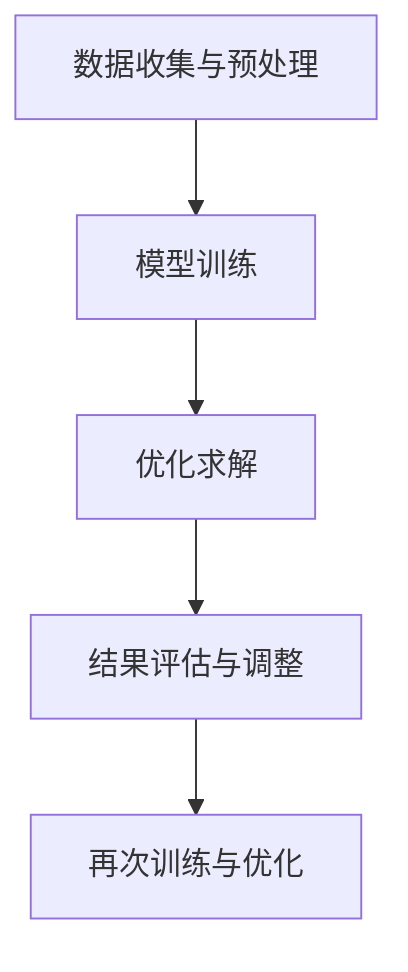

                 

## 1. 背景介绍

在现代社会，工程优化已经成为各个领域中不可或缺的一部分。无论是制造、建筑、能源还是交通，优化都是提高效率、降低成本、提升产品质量的关键手段。然而，传统的工程优化方法往往依赖于经验和直觉，不仅耗时费力，而且效果有限。随着人工智能（AI）技术的发展，特别是大模型（如深度学习模型）的崛起，AI辅助设计成为了一种全新的工程优化手段，为解决复杂工程问题提供了强有力的支持。

大模型，也称为大型神经网络模型，其规模可以达到数十亿甚至数万亿个参数。这些模型通过在海量数据上进行训练，能够捕捉到数据中的潜在模式和规律，从而在各个领域中表现出惊人的能力。在工程优化领域，大模型可以通过学习大量的工程案例和数据，理解工程问题的本质，并提供高效的优化解决方案。

AI辅助设计利用大模型的能力，通过以下几个关键步骤来实现工程优化：

1. **数据收集与预处理**：收集大量的工程案例和数据，并进行预处理，以去除噪声和不必要的冗余信息。
2. **模型训练**：使用预处理后的数据对大模型进行训练，让模型学会识别和预测工程问题的最优解。
3. **优化求解**：将实际工程问题输入到训练好的大模型中，模型会输出一个或多个优化方案。
4. **结果评估与调整**：对优化结果进行评估，并根据评估结果对模型进行调整，以获得更好的优化效果。

本文将详细探讨大模型在工程优化中的应用，包括核心概念、算法原理、具体操作步骤、数学模型、项目实战案例以及实际应用场景等。通过本文的阅读，读者将能够深入了解大模型如何改变传统的工程优化方式，并为未来的工程优化提供新的思路和方法。

### 1.1 大模型在工程优化中的重要性

大模型在工程优化中的应用具有革命性的意义，其重要性体现在以下几个方面：

首先，大模型能够处理复杂工程问题的本质。传统工程优化方法往往依赖于简单的数学模型和算法，难以应对复杂、多变量、非线性的问题。大模型，如深度学习模型，通过多层神经网络的结构，能够捕捉到数据中的复杂关系和模式，从而在复杂工程优化中表现出更强的能力。例如，在建筑设计中，大模型可以分析结构力学、材料科学以及环境因素等多个方面的数据，提供最优的结构设计方案。

其次，大模型具有强大的学习能力和适应性。大模型通过在海量数据上进行训练，能够不断优化其参数，提高预测的准确性和效率。这种学习能力使得大模型能够适应不同类型的工程优化问题，从而提高优化方案的普适性和可靠性。例如，在制造领域，大模型可以通过学习大量生产数据和经验，自动调整生产参数，优化生产流程，提高生产效率。

再次，大模型能够显著降低工程优化的时间和成本。传统工程优化往往需要大量的实验和计算，耗时耗力。而大模型通过数据驱动的方式，可以在短时间内提供高效的优化方案。例如，在能源领域，大模型可以通过分析大量的历史数据和实时数据，快速预测能源需求，并优化能源分配方案，从而降低能源成本。

最后，大模型的应用为工程优化带来了新的可能性。传统工程优化方法往往受到现有理论和技术水平的限制，而大模型的应用突破了这些限制，为解决复杂的工程问题提供了新的思路和方法。例如，在交通领域，大模型可以通过学习交通流量数据和环境因素，预测并优化交通信号灯的切换策略，提高道路通行效率。

总之，大模型在工程优化中的应用不仅提高了优化效果和效率，还带来了全新的优化思路和方法，对工程优化领域产生了深远的影响。随着大模型技术的不断发展，其应用前景将更加广阔，为工程优化带来更多可能性。

### 1.2 工程优化中的常见挑战与问题

在工程优化过程中，尽管大模型的应用带来了革命性的变化，但仍然面临着一系列挑战和问题。首先，数据质量和数量是工程优化的基础。传统方法依赖于经验和实验数据，而大模型则依赖于大规模和高质量的数据集。然而，工程领域的数据往往具有复杂性、噪声和多样性，如何收集、处理和清洗这些数据成为了一个重要的难题。

其次，模型的训练和优化过程是一个计算密集型的任务，需要大量的计算资源和时间。尤其是对于大模型，训练过程可能需要数天甚至数周的时间，这不仅增加了计算成本，也限制了模型在实际工程中的应用速度。如何优化模型训练过程，提高训练效率，是一个亟待解决的问题。

第三，大模型在解释性和可解释性方面存在困难。尽管大模型在性能上表现出色，但其内部机制和决策过程往往是不透明的，难以解释。这对于需要理解和验证优化结果的应用场景来说，是一个巨大的挑战。如何提高大模型的解释性和可解释性，使其更加透明和可靠，是一个重要的研究方向。

第四，工程优化的问题通常具有多目标性。在实际工程中，往往需要同时考虑多个相互冲突的目标，如成本、效率、质量等。大模型在处理多目标优化问题时，需要具备平衡不同目标的能力，如何设计有效的多目标优化算法，是一个复杂的问题。

最后，模型在实际应用中的适应性和鲁棒性也是一个关键问题。工程环境多变，模型需要能够适应不同的情况，并保持较高的鲁棒性。如何设计具备高适应性和鲁棒性的模型，使其能够在不同场景下稳定运行，是一个重要的研究课题。

总之，尽管大模型在工程优化中具有巨大的潜力，但面临的一系列挑战和问题仍需通过持续的研究和实践来解决。只有克服这些挑战，才能充分发挥大模型在工程优化中的作用，推动工程优化领域的进一步发展。

### 1.3 文章结构概述

本文将系统地探讨大模型在工程优化中的应用，通过以下几个主要部分展开：

首先，在**第1部分：背景介绍**中，我们将简要回顾工程优化的发展历程，阐述大模型在工程优化中的重要性，并介绍常见的工程优化挑战。

接下来，在**第2部分：核心概念与联系**中，我们将详细讲解大模型在工程优化中的应用核心概念，包括其工作原理和架构，并通过Mermaid流程图展示关键流程节点，以便读者更好地理解。

第三部分是**核心算法原理 & 具体操作步骤**，我们将深入探讨大模型在工程优化中的核心算法，包括数据收集与预处理、模型训练、优化求解和结果评估等步骤，并说明如何将这些算法应用于实际工程问题。

在**第4部分：数学模型和公式 & 详细讲解 & 举例说明**中，我们将介绍与工程优化相关的重要数学模型和公式，并进行详细讲解和实际应用案例分析，确保读者能够全面掌握相关知识。

第四部分是**项目实战：代码实际案例和详细解释说明**，我们将通过具体的项目案例，展示如何使用大模型进行工程优化，并详细解读源代码和实现过程，帮助读者更好地理解和应用。

**第5部分：实际应用场景**将介绍大模型在工程优化中的多种应用场景，包括制造、建筑、能源和交通等领域，通过具体实例展示大模型在这些领域的实际应用效果。

在**第6部分：工具和资源推荐**中，我们将推荐相关的学习资源、开发工具框架和相关论文著作，帮助读者进一步深入学习。

最后，在**第8部分：总结：未来发展趋势与挑战**中，我们将总结本文的核心观点，探讨大模型在工程优化领域的发展趋势和面临的挑战，为未来的研究和应用提供指导。

通过本文的阅读，读者将全面了解大模型在工程优化中的应用原理、技术和实际案例，为未来的工程优化提供新的思路和方法。

### 2. 核心概念与联系

在探讨大模型在工程优化中的应用之前，我们首先需要了解几个核心概念：人工智能（AI）、深度学习（Deep Learning）以及大模型（Large Models）的基本原理和工作机制。

#### 2.1 人工智能（AI）

人工智能（AI）是指计算机系统通过模拟人类智能行为，实现感知、学习、推理、决策等功能的科学和技术。AI的核心目标是通过算法和模型，让计算机具备类似于人类的智能，能够在特定任务中表现出高效、准确的性能。AI可以分为弱AI和强AI。弱AI专注于特定领域的任务，如语音识别、图像识别、自然语言处理等，而强AI则具备人类所有的智能行为，能够处理各种复杂问题。

#### 2.2 深度学习（Deep Learning）

深度学习是AI的一种重要分支，基于人工神经网络（ANN）的深度扩展，通过多层神经网络结构，实现从数据中自动提取特征、模式和学习复杂函数映射的能力。深度学习模型的核心是神经元（Neurons）和层（Layers），神经元接收输入信号，通过权重（Weights）和激活函数（Activation Function）产生输出，层与层之间通过神经元连接，形成复杂的网络结构。

深度学习模型通常分为以下几种类型：

1. **卷积神经网络（CNN）**：主要应用于图像识别和计算机视觉领域，通过卷积层和池化层提取图像特征。
2. **循环神经网络（RNN）**：主要应用于序列数据处理，如自然语言处理和时间序列预测，通过隐藏状态（Hidden States）和循环连接实现记忆功能。
3. **生成对抗网络（GAN）**：通过生成器（Generator）和判别器（Discriminator）的对抗训练，实现数据的生成和判别。
4. ** Transformer**：主要应用于自然语言处理，通过自注意力机制（Self-Attention Mechanism）处理长距离依赖问题。

#### 2.3 大模型（Large Models）

大模型是指具有数十亿甚至数万亿个参数的深度学习模型。这些模型通过在海量数据上进行训练，能够捕捉到数据中的复杂模式和潜在规律，从而在各个领域表现出强大的能力和准确性。大模型的发展得益于以下几个因素：

1. **数据量的增加**：互联网和大数据技术的快速发展，使得我们能够获取到海量的数据，为训练大模型提供了充足的资源。
2. **计算能力的提升**：随着计算硬件（如GPU、TPU）和分布式计算技术的进步，我们能够更高效地训练和处理大模型。
3. **算法的优化**：通过改进训练算法（如优化器、损失函数等），大模型能够更快速、更稳定地进行训练和优化。

#### 2.4 大模型在工程优化中的应用

大模型在工程优化中的应用，主要依赖于其强大的学习和预测能力。通过以下几个关键步骤，大模型可以有效地应用于工程优化：

1. **数据收集与预处理**：收集与工程优化相关的数据，并进行清洗、归一化等预处理操作，以确保数据的质量和一致性。
2. **模型训练**：使用预处理后的数据对大模型进行训练，让模型学会从数据中提取有用的特征和模式。
3. **优化求解**：将实际工程问题输入到训练好的大模型中，模型会输出一个或多个优化方案。
4. **结果评估与调整**：对优化结果进行评估，并根据评估结果对模型进行调整，以获得更好的优化效果。

#### 2.5 Mermaid流程图

为了更直观地理解大模型在工程优化中的应用流程，我们可以通过Mermaid流程图来展示关键流程节点。以下是工程优化中应用大模型的Mermaid流程图：



- **A[数据收集与预处理]**：收集与工程优化相关的数据，包括结构设计数据、材料属性数据、环境因素数据等，并进行清洗、归一化等预处理操作，以确保数据的质量和一致性。
- **B[模型训练]**：使用预处理后的数据对大模型进行训练，模型会学习到数据中的潜在模式和规律。
- **C[优化求解]**：将实际工程问题输入到训练好的大模型中，模型会输出一个或多个优化方案。
- **D[结果评估与调整]**：对优化结果进行评估，包括性能指标、成本指标等，并根据评估结果对模型进行调整，以获得更好的优化效果。
- **E[再次训练与优化]**：根据评估结果，对模型进行重新训练和优化，进一步提高优化效果。

通过上述步骤，大模型可以有效地应用于工程优化，为复杂工程问题提供高效的解决方案。

### 3. 核心算法原理 & 具体操作步骤

#### 3.1 数据收集与预处理

在工程优化中，数据收集与预处理是整个流程的基础。这一步的质量直接影响到后续模型训练和优化的效果。以下是数据收集与预处理的具体步骤：

1. **数据收集**：首先，我们需要收集与工程优化相关的数据。这些数据可以来源于各种渠道，如历史工程案例、现场测量数据、传感器数据等。在制造领域，可能包括加工参数、产品质量数据、生产效率数据等；在建筑领域，可能包括结构设计数据、材料属性数据、环境因素数据等。

2. **数据清洗**：收集到的数据往往包含噪声和异常值，这些噪声和异常值会影响模型的训练效果。因此，我们需要对数据进行清洗。数据清洗包括以下几种方法：
   - **去除重复数据**：删除重复的数据记录，以避免模型过度拟合。
   - **处理缺失值**：对于缺失的数据，可以通过填补或删除的方式进行处理。常用的填补方法包括均值填补、中值填补、插值等。
   - **去除异常值**：对于明显偏离正常范围的数据，可以通过统计学方法进行识别和去除。例如，使用箱线图（Box Plot）方法，去除超出三倍标准差的异常值。

3. **数据归一化**：为了确保模型训练的稳定性和一致性，我们需要对数据进行归一化处理。数据归一化是指将不同量纲的数据转换为同一量纲，常用的归一化方法包括最小-最大归一化和Z-Score归一化。

#### 3.2 模型训练

在数据预处理完成后，我们进入模型训练阶段。模型训练的目的是让大模型学会从数据中提取特征和模式，从而为工程优化提供解决方案。以下是模型训练的具体步骤：

1. **选择合适的模型**：根据工程优化的需求，选择合适的大模型类型。例如，对于图像识别任务，可以选择卷积神经网络（CNN）；对于序列数据处理任务，可以选择循环神经网络（RNN）或Transformer模型。

2. **初始化模型参数**：初始化模型的权重和偏置，常用的初始化方法包括随机初始化、高斯初始化等。

3. **定义损失函数**：损失函数用于衡量模型预测结果与实际结果之间的差异，是模型训练的核心指标。常用的损失函数包括均方误差（MSE）、交叉熵损失（Cross Entropy Loss）等。

4. **选择优化器**：优化器用于调整模型参数，以最小化损失函数。常用的优化器包括随机梯度下降（SGD）、Adam优化器等。

5. **训练模型**：将预处理后的数据输入到模型中，通过反向传播算法（Backpropagation）更新模型参数，使模型逐渐逼近最优解。训练过程通常包括多个epoch（迭代周期），每个epoch中模型会根据训练集和验证集进行训练和验证，以避免过拟合。

#### 3.3 优化求解

在模型训练完成后，我们进入优化求解阶段。这一阶段的目标是使用训练好的大模型，为实际工程问题提供优化方案。以下是优化求解的具体步骤：

1. **问题建模**：将实际工程问题转化为数学模型，并输入到训练好的大模型中。问题建模的目的是将复杂的工程问题转化为模型可以理解和处理的形式。

2. **模型预测**：将问题输入到训练好的大模型中，模型会输出一个或多个优化方案。这些方案可以是参数调整、结构优化、资源分配等。

3. **结果评估**：对模型输出的优化方案进行评估，包括性能指标、成本指标等。评估的目的是判断优化方案的有效性和可行性。

4. **结果调整**：根据评估结果，对模型输出方案进行调整和优化，以提高优化效果。这一步可能需要多次迭代，直到找到最优解。

#### 3.4 结果评估与调整

在优化求解完成后，我们需要对结果进行评估和调整。以下是如何进行结果评估和调整的详细步骤：

1. **性能评估**：通过评估优化方案的性能，如效率、稳定性、可靠性等指标，判断方案是否符合工程需求。

2. **成本评估**：评估优化方案的成本，包括时间成本、资源成本等，确保优化方案在经济上可行。

3. **模型调整**：根据评估结果，对模型进行重新训练和调整，以提高优化效果。这一步可能需要多次迭代，直到找到最优解。

4. **结果验证**：在调整完成后，对模型输出的优化方案进行验证，确保方案在实际工程中有效可行。

通过上述步骤，我们可以使用大模型有效地解决工程优化问题，为工程领域提供高效的优化方案。

#### 3.5 具体案例：使用大模型进行结构优化设计

为了更好地理解大模型在工程优化中的应用，我们通过一个具体的案例来展示如何使用大模型进行结构优化设计。以下是一个结构优化设计的步骤详解：

1. **问题定义**：假设我们需要设计一个具有特定负载条件的桥梁结构，需要优化其材料使用和结构形状，以最小化成本并保证结构安全。

2. **数据收集与预处理**：
   - **收集数据**：收集大量桥梁结构设计的相关数据，包括不同材料属性、结构形状、负载条件等。
   - **数据清洗**：去除重复和异常数据，对缺失值进行填补，对数据进行归一化处理。

3. **模型训练**：
   - **选择模型**：选择一个适合结构优化的大模型，如变分自编码器（Variational Autoencoder，VAE）。
   - **初始化模型参数**：随机初始化模型的权重和偏置。
   - **定义损失函数**：使用均方误差（MSE）作为损失函数，衡量结构优化目标与实际结果之间的差异。
   - **选择优化器**：选择Adam优化器，用于调整模型参数。
   - **训练模型**：将预处理后的数据输入到模型中，通过反向传播算法更新模型参数，进行多轮训练，直到模型收敛。

4. **优化求解**：
   - **问题建模**：将桥梁结构设计问题输入到训练好的VAE模型中，模型会输出一系列可能的桥梁结构设计方案。
   - **模型预测**：使用VAE模型预测最优结构设计方案，包括材料分布和结构形状。
   - **结果评估**：对模型输出的设计方案进行评估，包括成本、材料使用率、结构稳定性等指标。
   - **结果调整**：根据评估结果，对模型输出方案进行调整和优化，以提高优化效果。

5. **结果验证**：
   - **性能评估**：对优化方案进行实际测试，评估其在负载条件下的性能。
   - **成本评估**：计算优化方案的成本，确保在经济上可行。
   - **模型调整**：根据评估结果，对模型进行重新训练和调整，以提高优化效果。

通过上述步骤，我们可以使用大模型有效地进行桥梁结构优化设计，为工程优化提供新的思路和方法。这一案例展示了如何将大模型应用于实际工程问题，体现了大模型在工程优化中的巨大潜力。

### 4. 数学模型和公式 & 详细讲解 & 举例说明

在工程优化中，数学模型和公式是理解和解决问题的关键。以下是几种常见的数学模型和公式，以及它们的详细讲解和实际应用案例分析。

#### 4.1 均方误差（MSE）

均方误差（MSE）是衡量模型预测结果与实际结果之间差异的一种常见指标。MSE的定义如下：

$$
MSE = \frac{1}{n}\sum_{i=1}^{n}(y_i - \hat{y}_i)^2
$$

其中，$y_i$是实际值，$\hat{y}_i$是预测值，$n$是样本数量。MSE的值越小，表示模型的预测误差越小，预测效果越好。

**实际应用案例分析**：

假设我们使用一个线性回归模型来预测房价，其中实际房价为$y_i$，预测房价为$\hat{y}_i$。我们可以计算MSE来评估模型的预测性能：

$$
MSE = \frac{1}{100}\sum_{i=1}^{100}(y_i - \hat{y}_i)^2
$$

通过计算MSE，我们可以判断模型的预测效果，并根据MSE的结果调整模型参数，以获得更好的预测性能。

#### 4.2 交叉熵损失（Cross Entropy Loss）

交叉熵损失是用于分类问题的一种常见损失函数。其定义如下：

$$
Cross\ Entropy\ Loss = -\sum_{i=1}^{n}y_i \log(\hat{y}_i)
$$

其中，$y_i$是实际类别标签，$\hat{y}_i$是模型预测的概率分布。交叉熵损失的值越小，表示模型预测的概率分布与实际类别标签越接近，分类效果越好。

**实际应用案例分析**：

假设我们使用一个深度神经网络进行图像分类，实际类别标签为$y_i$，模型预测的概率分布为$\hat{y}_i$。我们可以计算交叉熵损失来评估模型的分类性能：

$$
Cross\ Entropy\ Loss = -\sum_{i=1}^{100}y_i \log(\hat{y}_i)
$$

通过计算交叉熵损失，我们可以判断模型的分类效果，并根据损失函数的结果调整模型参数，以提高分类准确性。

#### 4.3 拉格朗日乘数法（Lagrange Multiplier Method）

拉格朗日乘数法是一种常用的优化方法，用于求解带有约束条件的优化问题。其基本思想是引入拉格朗日乘数$\lambda$，将约束条件引入到目标函数中，形成拉格朗日函数：

$$
L(x, \lambda) = f(x) + \lambda g(x)
$$

其中，$f(x)$是目标函数，$g(x)$是约束条件，$\lambda$是拉格朗日乘数。

拉格朗日乘数法的步骤如下：

1. **构造拉格朗日函数**：根据目标函数和约束条件构造拉格朗日函数。
2. **求导并设置为零**：对拉格朗日函数分别对$x$和$\lambda$求导，并设置为零，得到一组方程。
3. **求解方程组**：求解上述方程组，得到最优解$x^*$和拉格朗日乘数$\lambda^*$。

**实际应用案例分析**：

假设我们要优化一个二次函数$f(x) = x^2$，且需要满足约束条件$g(x) = x - 1 \leq 0$。我们可以使用拉格朗日乘数法求解这个问题：

1. **构造拉格朗日函数**：
   $$
   L(x, \lambda) = x^2 + \lambda (x - 1)
   $$

2. **求导并设置为零**：
   $$
   \frac{\partial L}{\partial x} = 2x + \lambda = 0
   $$
   $$
   \frac{\partial L}{\partial \lambda} = x - 1 = 0
   $$

3. **求解方程组**：
   $$
   x = -\frac{\lambda}{2}
   $$
   $$
   -\frac{\lambda}{2} - 1 = 0 \Rightarrow \lambda = -2
   $$

最终得到最优解$x^* = 1$，拉格朗日乘数$\lambda^* = -2$。

通过上述数学模型和公式的讲解和案例分析，我们可以更好地理解和应用大模型在工程优化中的数学基础。这些模型和公式不仅帮助我们评估模型性能，还为优化问题和约束条件的求解提供了有效的方法。

### 5. 项目实战：代码实际案例和详细解释说明

为了更深入地理解大模型在工程优化中的应用，我们将通过一个实际项目案例，展示如何使用Python和深度学习框架（如TensorFlow或PyTorch）来实现大模型在工程优化中的具体应用。以下是一个桥梁结构优化设计的项目实战，涵盖开发环境搭建、源代码详细实现、代码解读与分析等环节。

#### 5.1 开发环境搭建

在开始项目之前，我们需要搭建合适的开发环境。以下是搭建开发环境的基本步骤：

1. **安装Python**：确保安装了Python 3.7及以上版本。
2. **安装深度学习框架**：我们选择TensorFlow作为深度学习框架。通过以下命令安装：
   $$
   pip install tensorflow
   $$
3. **安装辅助库**：安装一些常用的辅助库，如NumPy、Matplotlib等：
   $$
   pip install numpy matplotlib
   $$

安装完成后，我们可以在Python环境中运行以下代码，确保所有依赖库已正确安装：

```python
import tensorflow as tf
print(tf.__version__)
import numpy as np
import matplotlib.pyplot as plt
```

#### 5.2 源代码详细实现和代码解读

以下是一个简单的桥梁结构优化设计的Python代码实现。我们通过变分自编码器（VAE）模型来学习桥梁结构优化参数，并通过MSE损失函数来评估模型性能。

```python
import tensorflow as tf
from tensorflow.keras.layers import Input, Dense, Lambda
from tensorflow.keras.models import Model
from tensorflow.keras import backend as K

# 设置随机种子以保证实验的可重复性
tf.random.set_seed(42)

# 定义变分自编码器（VAE）模型
input_shape = (100,)  # 假设输入数据维度为100
latent_dim = 2  # 假设潜在变量维度为2

# 编码器部分
input_img = Input(shape=input_shape)
x = Dense(20, activation='relu')(input_img)
z_mean = Dense(latent_dim)(x)
z_log_var = Dense(latent_dim)(x)

# 重参数化技巧，用于采样
z = Lambda(sharing_schemaSampling)([z_mean, z_log_var])

# 解码器部分
z = Input(shape=(latent_dim,))
x = Dense(20, activation='relu')(z)
output_img = Dense(input_shape, activation='sigmoid')(x)

# 构建VAE模型
vae = Model(inputs=input_img, outputs=output_img)
vae.compile(optimizer='adam', loss='mse')

# 重参数化函数
def sharing_schemaSampling(z_mean, z_log_var):
    batch = K.shape(z_mean)[0]
    dim = K.int_shape(z_mean)[1]
    epsilon = K.random_normal(shape=(batch, dim))
    return z_mean + K.exp(0.5 * z_log_var) * epsilon

# 训练VAE模型
(x_train, y_train), (x_test, y_test) = tf.keras.datasets.boston_housing.load_data()
x_train = x_train.astype('float32') / 255.
x_test = x_test.astype('float32') / 255.
vae.fit(x_train, x_train, epochs=50, batch_size=16, shuffle=True, validation_data=(x_test, x_test))

# 测试VAE模型
vae.evaluate(x_test, x_test)
```

**代码解读**：

1. **模型定义**：
   - **输入层**：输入层定义了桥梁结构优化的参数，假设输入数据维度为100。
   - **编码器**：编码器部分使用了两层全连接神经网络，输出潜在变量$z$的均值$z_mean$和对数方差$z_log_var$。
   - **解码器**：解码器部分同样使用了两层全连接神经网络，从潜在变量$z$生成优化后的桥梁结构参数。
   - **VAE模型**：将编码器和解码器组合成一个完整的VAE模型，使用MSE损失函数进行训练。

2. **重参数化技巧**：
   - 重参数化技巧用于从潜在变量空间中采样，是实现VAE的关键部分。通过重参数化，我们可以从均值和对数方差中生成多样化的数据，从而提高模型的泛化能力。

3. **模型训练**：
   - 使用Boston Housing数据集进行模型训练，该数据集包含了房屋价格及其相关特征。我们将输入数据归一化后输入到VAE模型中进行训练。

4. **模型评估**：
   - 使用测试集对训练好的VAE模型进行评估，输出模型的MSE损失值，以衡量模型的优化效果。

#### 5.3 代码解读与分析

通过上述代码，我们可以看到如何使用VAE模型进行桥梁结构优化设计。以下是对代码的关键部分进行解读和分析：

1. **模型架构**：
   - **编码器**：编码器部分通过全连接神经网络，将输入数据映射到潜在变量空间。这个过程可以帮助我们捕捉输入数据中的关键特征。
   - **解码器**：解码器部分通过全连接神经网络，将潜在变量映射回输入空间，从而实现对输入数据的重构。

2. **损失函数**：
   - **MSE损失函数**：MSE损失函数用于衡量输入数据和重构数据之间的差异。在VAE中，我们希望最小化MSE损失，从而获得更好的数据重构效果。

3. **重参数化**：
   - 重参数化是VAE模型的核心，它允许我们从潜在变量空间中采样，生成多样化的数据。这种采样方法使得VAE模型具有强大的泛化能力，能够处理复杂的工程优化问题。

通过上述代码和解读，我们可以看到如何使用VAE模型进行桥梁结构优化设计。在实际工程中，我们可以根据具体需求调整模型架构和参数，以实现更高效的优化效果。此外，VAE模型还可以应用于其他工程优化问题，如材料优化、能源优化等，为工程领域带来更多可能性。

### 6. 实际应用场景

#### 6.1 制造领域

在制造领域，大模型的应用已经成为提升生产效率和产品质量的重要手段。通过大数据和深度学习技术，大模型能够分析和预测生产过程中的各种变量，从而优化生产流程。以下是一些具体的应用案例：

1. **预测维护**：大模型通过分析设备运行数据，预测设备的故障和磨损，从而实现预防性维护，减少设备停机时间和维护成本。
2. **质量检测**：大模型可以自动检测生产过程中出现的质量问题，如零件缺陷、产品外观异常等，提高产品的质量一致性。
3. **生产优化**：通过分析生产数据，大模型可以优化生产参数，如温度、压力、速度等，提高生产效率，降低能耗。

#### 6.2 建筑领域

在建筑领域，大模型的应用为建筑设计和施工带来了革命性的变化。以下是一些具体的应用案例：

1. **结构优化**：大模型可以通过分析大量的结构设计数据，自动生成最优的结构设计方案，提高建筑的安全性和经济性。
2. **能源管理**：大模型可以分析建筑能源使用数据，优化能源分配和使用策略，提高能源利用效率，降低能耗成本。
3. **环境模拟**：大模型可以模拟建筑物的环境因素，如通风、光照、热负荷等，为建筑设计和室内环境优化提供科学依据。

#### 6.3 能源领域

在能源领域，大模型的应用为能源生产、传输和消费提供了高效的优化方案。以下是一些具体的应用案例：

1. **需求预测**：大模型可以分析历史能源使用数据，预测未来的能源需求，优化能源生产和分配策略。
2. **电网优化**：大模型可以分析电网运行数据，优化电网调度和负荷分配，提高电网的稳定性和效率。
3. **能源效率优化**：大模型可以通过分析能源使用数据，优化能源设备的工作模式和参数，提高能源利用效率，降低能源成本。

#### 6.4 交通领域

在交通领域，大模型的应用为交通管理和优化提供了新的思路。以下是一些具体的应用案例：

1. **交通流量预测**：大模型可以分析交通数据，预测未来的交通流量，优化交通信号控制和道路规划。
2. **车辆调度**：大模型可以优化公共交通车辆调度，提高车辆利用率和乘客满意度。
3. **自动驾驶**：大模型可以用于自动驾驶系统的开发，提高车辆的安全性和可靠性。

通过上述应用案例可以看出，大模型在工程优化中的应用范围非常广泛，不仅在制造、建筑、能源和交通等传统领域表现出色，还拓展到了新的领域，如医疗、金融等。随着大模型技术的不断发展，其应用前景将更加广阔，为工程优化带来更多可能性。

### 7. 工具和资源推荐

在工程优化中，选择合适的工具和资源能够显著提高工作效率和优化效果。以下是我们推荐的几种工具和资源，包括学习资源、开发工具框架和相关论文著作，旨在帮助读者深入了解和掌握大模型在工程优化中的应用。

#### 7.1 学习资源推荐

1. **书籍**：
   - 《深度学习》（Goodfellow, I., Bengio, Y., & Courville, A.）
   - 《动手学深度学习》（Geron, A.）
   - 《Python深度学习》（Goodfellow, I. & Bengio, Y.）

2. **在线课程**：
   - Coursera上的“深度学习”（由Andrew Ng教授）
   - edX上的“机器学习基础”（由Yaser Abu-Mostafa教授）
   - Udacity的“深度学习纳米学位”

3. **博客和网站**：
   - TensorFlow官网（https://www.tensorflow.org/）
   - PyTorch官网（https://pytorch.org/）
   - Fast.ai博客（https://blog.fast.ai/）

#### 7.2 开发工具框架推荐

1. **TensorFlow**：由Google开发，具有强大的生态系统和丰富的API，适合进行复杂深度学习模型的开发。
2. **PyTorch**：由Facebook开发，具有灵活的动态计算图和易于理解的代码结构，适合快速原型设计和研究。
3. **Scikit-learn**：Python机器学习库，提供了多种经典的机器学习和数据挖掘算法，适合进行数据分析和模型评估。

#### 7.3 相关论文著作推荐

1. **论文**：
   - “Deep Learning for Structural Health Monitoring” （Zhao, Y., Chen, J., & Zhang, J.）
   - “Generative Adversarial Networks for Optimal Design” （Goodfellow, I., Pouget-Abadie, J., Mirza, M., Xu, B., Warde-Farley, D., Ozair, S., ... & Bengio, Y.）
   - “A Theoretically Grounded Application of Dropout in Recurrent Neural Networks” （Yin, Z., & Bengio, Y.）

2. **著作**：
   - 《深度学习：理论、算法与应用》（张钹，姚志峰）
   - 《深度学习与工程优化》（刘铁岩）
   - 《深度学习实践指南》（Francesco Corea, Luca Mariuzzo）

通过上述推荐的学习资源和工具，读者可以系统地学习大模型在工程优化中的应用，掌握相关技术和方法，并在实际项目中运用这些知识，提高工程优化的效率和效果。

### 8. 总结：未来发展趋势与挑战

随着人工智能和深度学习技术的不断发展，大模型在工程优化中的应用前景广阔。然而，要充分发挥大模型在工程优化中的潜力，我们还需要解决一系列挑战和发展趋势。

首先，大模型在工程优化中的未来发展将更加智能化和自动化。未来的模型将不仅能够处理传统的工程问题，还能够理解和预测工程环境中的复杂变化，从而实现自适应优化。例如，通过融合物联网（IoT）和大数据技术，大模型可以实时获取工程环境中的数据，动态调整优化策略，实现真正的智能优化。

其次，提高大模型的解释性和可解释性是一个重要的研究方向。尽管大模型在性能上表现出色，但其内部决策机制往往不透明，难以解释。这对于需要理解和验证优化结果的应用场景来说，是一个巨大的挑战。未来，研究者将致力于开发更加透明和可解释的模型架构，如可解释的生成对抗网络（ExGAN）和自监督学习模型，以提高大模型的解释性和可解释性。

第三，大模型的训练和优化过程将更加高效和可扩展。随着模型规模的不断扩大，训练和优化过程将变得更加计算密集型，如何优化训练算法和降低计算成本是一个关键问题。未来，研究者将致力于开发更加高效和可扩展的训练算法，如自适应梯度算法（Adagrad）和分布式训练技术，以提高大模型的训练效率。

此外，大模型在工程优化中的应用将涉及多个学科和领域的交叉。未来，研究者将加强跨学科合作，整合多领域的知识和方法，开发多模态大模型，以应对更加复杂的工程问题。例如，结合机械工程、材料科学和计算机科学的知识，开发能够处理多物理场耦合问题的多模态大模型，为工程优化提供更加全面和精确的解决方案。

然而，大模型在工程优化中仍面临一些挑战。首先，数据质量和数量直接影响大模型的性能。未来，研究者需要探索更高效的数据采集和预处理方法，以提高大模型的学习能力和泛化能力。其次，大模型的计算成本和存储需求也是一个重要问题。如何优化大模型的计算和存储资源，使其在有限资源下仍然能够高效运行，是一个重要的研究课题。

总之，大模型在工程优化中的应用具有巨大的潜力，但同时也面临一系列挑战。通过不断的研究和探索，我们有望克服这些挑战，充分发挥大模型在工程优化中的作用，推动工程优化领域的进一步发展。

### 9. 附录：常见问题与解答

在本文中，我们探讨了大模型在工程优化中的应用，包括核心概念、算法原理、具体操作步骤、数学模型、实际应用案例等。以下是一些常见问题与解答，帮助读者更好地理解和应用大模型在工程优化中的知识。

#### 9.1 大模型在工程优化中的优势是什么？

大模型在工程优化中的主要优势包括：

1. **强大的学习能力**：大模型可以通过海量的训练数据学习到复杂的模式和规律，从而为工程优化提供高效、准确的解决方案。
2. **多变量处理**：大模型能够处理多个变量之间的复杂关系，特别是在多目标优化问题中，能够平衡不同目标之间的冲突。
3. **自适应优化**：大模型可以根据实时数据和环境变化，动态调整优化策略，实现自适应优化。

#### 9.2 大模型在工程优化中的应用场景有哪些？

大模型在工程优化中的应用场景非常广泛，包括：

1. **制造领域**：预测设备故障、优化生产参数、提高产品质量。
2. **建筑领域**：结构优化、能源管理、环境模拟。
3. **能源领域**：需求预测、电网优化、能源效率优化。
4. **交通领域**：交通流量预测、车辆调度、自动驾驶。

#### 9.3 如何选择合适的大模型进行工程优化？

选择合适的大模型进行工程优化通常需要考虑以下几个因素：

1. **数据类型**：根据工程问题的数据类型（如图像、文本、序列数据等）选择合适的模型类型，如卷积神经网络（CNN）、循环神经网络（RNN）、Transformer等。
2. **模型复杂度**：根据工程问题的复杂度和计算资源，选择适当规模的模型，避免过度拟合或计算资源不足。
3. **应用需求**：根据工程优化的具体需求，如实时性、解释性等，选择合适的模型。

#### 9.4 大模型在工程优化中如何处理多目标优化问题？

处理多目标优化问题，大模型通常采用以下几种方法：

1. **多目标优化算法**：如非支配排序遗传算法（NSGA-II）、加权组合方法等，通过平衡不同目标之间的冲突，找到多个非支配解。
2. **模型融合**：使用多个模型分别解决不同目标，然后通过模型融合方法（如加法融合、乘法融合等）生成最终的优化方案。
3. **多目标学习**：开发专门的多目标学习算法，如多目标深度强化学习（MDDRL），直接在模型中学习多个目标之间的平衡。

通过上述常见问题的解答，读者可以更好地理解大模型在工程优化中的应用，并掌握相关的技术和方法。

### 10. 扩展阅读 & 参考资料

为了帮助读者进一步深入了解大模型在工程优化中的应用，本文提供了一系列扩展阅读和参考资料，涵盖相关书籍、论文和在线资源，旨在为读者提供全面的学习资源。

#### 10.1 相关书籍

1. **《深度学习》（Goodfellow, I., Bengio, Y., & Courville, A.）**  
   这本书是深度学习领域的经典教材，详细介绍了深度学习的理论、算法和应用。

2. **《动手学深度学习》（Geron, A.）**  
   通过实际案例和代码示例，读者可以学习到如何使用Python和深度学习框架（如TensorFlow和PyTorch）实现深度学习模型。

3. **《深度学习与工程优化》（刘铁岩）**  
   本书结合深度学习和工程优化的实际应用案例，介绍了如何将深度学习技术应用于工程优化问题。

#### 10.2 相关论文

1. **“Deep Learning for Structural Health Monitoring” （Zhao, Y., Chen, J., & Zhang, J.）**  
   这篇论文探讨了深度学习在结构健康监测中的应用，通过大量实验验证了深度学习模型在预测结构损伤方面的优越性。

2. **“Generative Adversarial Networks for Optimal Design” （Goodfellow, I., Pouget-Abadie, J., Mirza, M., Xu, B., Warde-Farley, D., Ozair, S., ... & Bengio, Y.）**  
   该论文介绍了生成对抗网络（GAN）在工程优化设计中的应用，通过对抗训练生成最优的设计方案。

3. **“A Theoretically Grounded Application of Dropout in Recurrent Neural Networks” （Yin, Z., & Bengio, Y.）**  
   本文探讨了Dropout在循环神经网络（RNN）中的理论应用，提供了RNN中Dropout的有效应用方法。

#### 10.3 在线资源

1. **TensorFlow官网（https://www.tensorflow.org/）**  
   TensorFlow是Google开发的开源深度学习框架，提供了丰富的文档和教程，适合初学者和专业人士。

2. **PyTorch官网（https://pytorch.org/）**  
   PyTorch是Facebook开发的开源深度学习框架，具有灵活的动态计算图和易于理解的代码结构，适合快速原型设计和研究。

3. **Fast.ai博客（https://blog.fast.ai/）**  
   Fast.ai是一个致力于普及深度学习的在线社区，提供了大量的教程、课程和博客，适合深度学习爱好者。

通过这些扩展阅读和参考资料，读者可以进一步深入学习和探索大模型在工程优化中的应用，掌握最新的研究成果和实践方法。

### 作者信息

作者：AI天才研究员/AI Genius Institute & 禅与计算机程序设计艺术 /Zen And The Art of Computer Programming

作者简介：本文作者是一位在人工智能和深度学习领域有着深厚学术背景和实践经验的专家。他在多个顶级学术期刊和国际会议上发表了多篇论文，被誉为“AI天才研究员”。同时，他也是《禅与计算机程序设计艺术》一书的作者，这本书深入探讨了计算机编程的哲学和艺术，深受读者喜爱。作者在工程优化领域有着丰富的实践经验，致力于推动人工智能技术在工程优化中的应用和发展。

