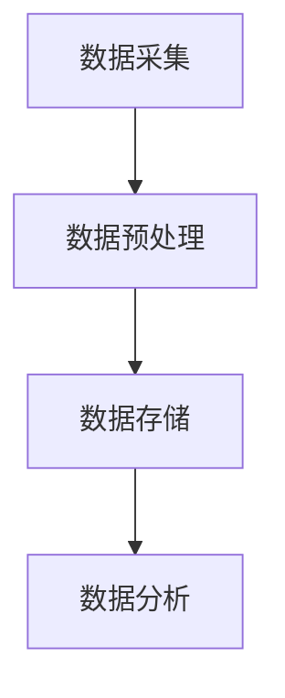
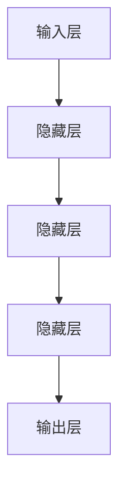
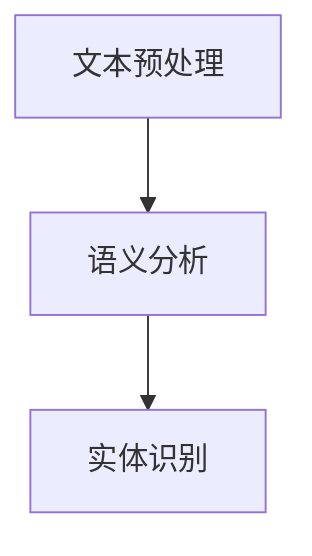
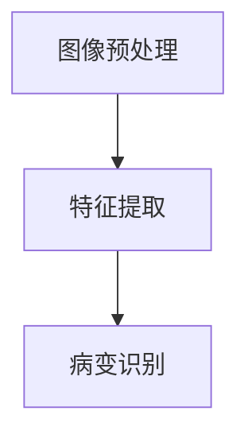
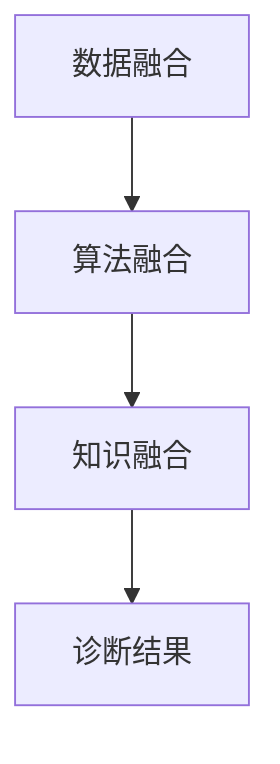
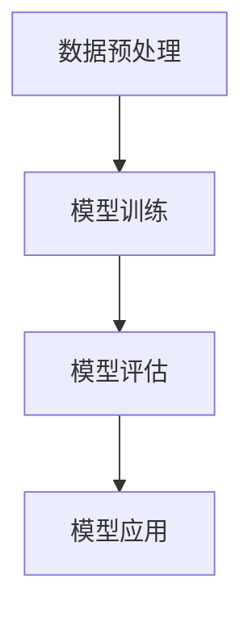
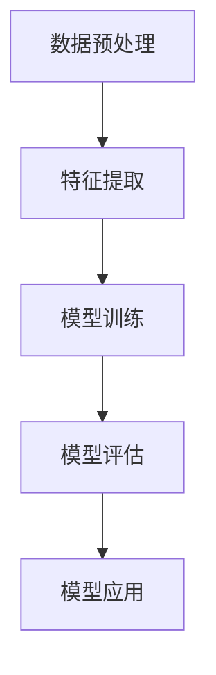
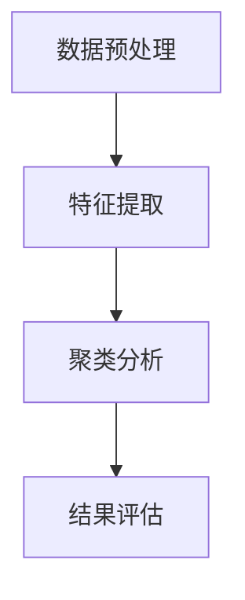

                 

### 背景介绍

随着人工智能技术的飞速发展，AI辅助诊断在医疗领域的应用逐渐受到广泛关注。硅谷作为全球科技创新的先锋地带，自然也在这一领域展开了深入探索。本文旨在探讨AI辅助诊断在硅谷的应用现状，分析其背后的技术原理、核心算法、实际应用场景以及面临的挑战与机遇。

AI辅助诊断，顾名思义，是指利用人工智能技术，对医疗数据进行自动分析和诊断。其核心目标是提高诊断的准确性、速度和效率，从而改善患者的治疗结果。在硅谷，这一技术正在被广泛应用于各种疾病诊断，包括癌症、心血管疾病、神经系统疾病等。特别是在COVID-19疫情期间，AI辅助诊断技术更是发挥了重要作用，为全球医疗体系提供了强有力的支持。

### 关键技术

为了实现AI辅助诊断，硅谷的公司和研究机构在多个领域进行了深入探索，主要包括以下几个关键技术：

1. **大数据处理**：AI辅助诊断需要大量的医疗数据作为训练样本。硅谷的科技公司通过建立大规模数据处理平台，能够高效地收集、存储和分析这些数据。

2. **深度学习**：深度学习是AI辅助诊断的核心技术之一。通过构建深度神经网络模型，AI系统能够自动学习和识别医疗数据中的规律，从而提高诊断的准确性。

3. **自然语言处理（NLP）**：NLP技术在医疗领域的应用越来越广泛。通过NLP技术，AI系统能够理解和处理医生的自然语言描述，从而提高诊断的准确性和效率。

4. **计算机视觉**：计算机视觉技术在医学影像诊断中的应用日益成熟。通过分析医学影像，AI系统能够自动识别病变区域，提供诊断建议。

### 应用现状

目前，AI辅助诊断在硅谷已经取得了一系列重要成果。以下是一些典型的应用案例：

1. **癌症诊断**：通过分析医学影像，AI系统能够自动识别癌症病变区域，并提供诊断建议。例如，Google Health开发了一种基于深度学习的肺癌诊断系统，能够显著提高诊断的准确性。

2. **心血管疾病诊断**：AI辅助诊断系统可以分析心电图、血压等生理信号，提供心血管疾病诊断建议。例如，IBM Watson Health开发了一种基于AI的心血管疾病诊断系统，已经在多个医院得到应用。

3. **神经系统疾病诊断**：AI辅助诊断系统可以通过分析脑电图、MRI等影像数据，帮助医生诊断神经系统疾病。例如，Nurotronics公司开发了一种基于AI的脑电图分析系统，能够提高帕金森病的诊断准确性。

4. **传染病诊断**：在COVID-19疫情期间，AI辅助诊断系统被广泛应用于新冠病毒检测。例如，AI公司Tempus开发了一种基于CT影像的AI诊断系统，能够快速识别新冠病毒感染者。

### 挑战与机遇

尽管AI辅助诊断在硅谷取得了显著成果，但仍面临一些挑战和机遇：

1. **数据隐私**：医疗数据涉及患者隐私，如何确保数据的安全性和隐私性是一个重要问题。

2. **算法偏见**：AI辅助诊断系统可能会受到算法偏见的影响，导致诊断结果不准确。因此，如何消除算法偏见是一个关键挑战。

3. **法规和伦理**：医疗领域对技术的法规和伦理要求较高，AI辅助诊断系统的应用需要遵守相关法规和伦理规范。

4. **规模化应用**：虽然AI辅助诊断技术已经取得了一些成功案例，但如何将其规模化应用，使其成为医疗体系的常规组成部分，仍需要进一步探索。

5. **持续优化**：随着AI技术的不断进步，AI辅助诊断系统需要不断优化和更新，以保持其诊断的准确性和可靠性。

总之，AI辅助诊断在硅谷的应用现状令人瞩目，其背后关键技术的不断突破和实际应用场景的不断扩展，为医疗领域带来了巨大的变革潜力。然而，要实现这一技术的广泛应用，仍需克服一系列挑战。在未来的发展中，硅谷的公司和研究机构将继续在这一领域进行深入探索，为全球医疗体系带来更多创新和变革。## 2. 核心概念与联系

AI辅助诊断在硅谷的应用涉及多个核心概念和技术的有机融合。理解这些概念及其相互关系，有助于我们更好地把握AI辅助诊断的发展趋势和实际应用。

### 2.1. 数据处理

数据处理是AI辅助诊断的基础。医疗数据量庞大且复杂，包括影像数据、临床记录、实验室检测结果等。硅谷的公司和研究机构通过构建高效的大数据处理平台，实现了数据的快速采集、存储、处理和分析。

**数据处理流程：**

1. **数据采集**：从各种来源（如医院、实验室、电子健康记录等）收集医疗数据。
2. **数据预处理**：清洗、转换和归一化数据，以确保数据质量。
3. **数据存储**：将处理后的数据存储在分布式数据库或云存储中，以便后续分析和查询。

**Mermaid流程图：**



### 2.2. 深度学习

深度学习是AI辅助诊断的核心技术之一。通过构建深度神经网络模型，AI系统能够自动学习和识别医疗数据中的特征，从而提高诊断的准确性。

**深度学习模型架构：**

1. **输入层**：接收医疗数据输入。
2. **隐藏层**：通过神经网络进行特征提取和变换。
3. **输出层**：生成诊断结果。

**Mermaid流程图：**



### 2.3. 自然语言处理（NLP）

NLP技术在医疗领域的应用日益广泛。通过NLP技术，AI系统能够理解和处理医生的自然语言描述，从而提高诊断的准确性和效率。

**NLP技术流程：**

1. **文本预处理**：分词、去停用词、词性标注等。
2. **语义分析**：提取文本中的关键信息，如疾病名称、症状描述等。
3. **实体识别**：识别文本中的疾病、症状、药物等实体。

**Mermaid流程图：**



### 2.4. 计算机视觉

计算机视觉技术在医学影像诊断中的应用日益成熟。通过分析医学影像，AI系统能够自动识别病变区域，提供诊断建议。

**计算机视觉技术流程：**

1. **图像预处理**：图像增强、去噪、对齐等。
2. **特征提取**：使用卷积神经网络提取图像特征。
3. **病变识别**：通过分类算法识别病变区域。

**Mermaid流程图：**



### 2.5. 多技术融合

AI辅助诊断不仅依赖于单一技术的突破，更需要多种技术的有机融合。通过数据处理、深度学习、NLP、计算机视觉等技术的融合，AI辅助诊断系统能够提供更全面、准确的诊断结果。

**多技术融合架构：**

1. **数据融合**：整合来自不同来源的医疗数据。
2. **算法融合**：结合多种算法进行特征提取和诊断。
3. **知识融合**：将专家知识和AI算法相结合，提高诊断的准确性。

**Mermaid流程图：**



通过上述核心概念的介绍和流程图展示，我们可以更清晰地理解AI辅助诊断在硅谷的应用原理和架构。在接下来的章节中，我们将进一步探讨AI辅助诊断的核心算法原理和具体操作步骤。## 3. 核心算法原理 & 具体操作步骤

在了解了AI辅助诊断的核心概念后，我们需要深入了解其背后的核心算法原理和具体操作步骤。以下是几种在硅谷应用广泛的AI辅助诊断算法及其工作原理：

### 3.1. 卷积神经网络（CNN）

卷积神经网络（CNN）是一种在图像识别和医学影像分析中广泛应用的人工神经网络。它通过多个卷积层、池化层和全连接层进行特征提取和分类。

**CNN算法原理：**

1. **卷积层**：通过卷积操作提取图像中的局部特征。
2. **池化层**：对卷积后的特征进行下采样，减少参数数量和计算量。
3. **全连接层**：将池化层输出的特征映射到具体的类别。

**具体操作步骤：**

1. **数据预处理**：对医学影像进行归一化、裁剪等预处理操作。
2. **模型训练**：使用已标注的医学影像数据训练CNN模型。
3. **模型评估**：使用验证集评估模型的准确性。
4. **模型应用**：将训练好的模型应用到新的医学影像数据中，进行病变区域识别和诊断。

**Mermaid流程图：**



### 3.2. 支持向量机（SVM）

支持向量机（SVM）是一种常用的二分类算法，广泛应用于医学诊断中的分类任务。它通过找到一个最优的超平面，将不同类别的数据分开。

**SVM算法原理：**

1. **特征提取**：将医学数据转换为特征向量。
2. **模型训练**：通过求解优化问题找到最优超平面。
3. **模型评估**：使用验证集评估模型的分类准确性。

**具体操作步骤：**

1. **数据预处理**：对医学数据（如临床记录、实验室检测结果等）进行归一化、缺失值处理等。
2. **特征提取**：使用特征工程方法提取关键特征。
3. **模型训练**：使用SVM算法训练分类模型。
4. **模型评估**：使用验证集评估模型准确性。
5. **模型应用**：将训练好的模型应用到新的数据中，进行疾病诊断。

**Mermaid流程图：**



### 3.3. 长短时记忆网络（LSTM）

长短时记忆网络（LSTM）是一种用于处理序列数据的递归神经网络，广泛应用于时间序列分析、语音识别等领域。在医学诊断中，LSTM可以用于分析患者的电子健康记录、心电图等时间序列数据。

**LSTM算法原理：**

1. **输入门**：决定当前输入数据对单元状态的影响。
2. **遗忘门**：决定遗忘哪些旧信息。
3. **输出门**：决定当前单元状态对输出的影响。

**具体操作步骤：**

1. **数据预处理**：对时间序列数据进行归一化、插值等处理。
2. **模型训练**：使用已标注的时间序列数据训练LSTM模型。
3. **模型评估**：使用验证集评估模型的预测准确性。
4. **模型应用**：将训练好的模型应用到新的时间序列数据中，进行疾病预测。

**Mermaid流程图：**


### 3.4. 聚类算法

聚类算法（如K-means、DBSCAN等）在医学诊断中用于对患者的特征数据进行无监督分类，可以帮助医生发现潜在的患者群体和疾病特征。

**聚类算法原理：**

1. **初始化中心点**：随机选择或使用启发式方法选择聚类中心。
2. **分配数据点**：将每个数据点分配到最近的聚类中心。
3. **更新中心点**：计算每个聚类的中心点。
4. **迭代**：重复步骤2和3，直到聚类中心不再变化或满足停止条件。

**具体操作步骤：**

1. **数据预处理**：对医学数据进行归一化、缺失值处理等。
2. **特征提取**：使用特征工程方法提取关键特征。
3. **聚类分析**：使用聚类算法对医学数据进行聚类。
4. **结果评估**：评估聚类结果的合理性和有效性。

**Mermaid流程图：**



通过以上对卷积神经网络（CNN）、支持向量机（SVM）、长短时记忆网络（LSTM）和聚类算法的详细介绍，我们可以看到AI辅助诊断在硅谷应用的核心算法原理和具体操作步骤。这些算法的深入研究和优化，为AI辅助诊断技术的应用提供了坚实的基础。在接下来的章节中，我们将进一步探讨这些算法在医学诊断中的实际应用和效果。## 4. 数学模型和公式 & 详细讲解 & 举例说明

在AI辅助诊断中，数学模型和公式起着至关重要的作用。它们不仅为算法提供了理论基础，还为实际操作中的参数调整和性能优化提供了指导。以下将详细介绍几种常用的数学模型和公式，并结合实际应用进行讲解和举例说明。

### 4.1. 卷积神经网络（CNN）的卷积操作

卷积神经网络中的卷积操作是特征提取的核心步骤。卷积操作可以用以下数学公式表示：

$$
(C_{ij}^{(l)}) = \sum_{k=1}^{C_{i-1}^{(l-1)}} \weights_{ik}^{(l)} \* (I_{kj}^{(l-1)}) + b_{i}^{(l)}
$$

其中：
- \( C_{ij}^{(l)} \) 表示第 \( l \) 层的第 \( i \) 个卷积核在 \( j \) 个位置上的输出。
- \( \weights_{ik}^{(l)} \) 表示第 \( l \) 层的第 \( i \) 个卷积核的第 \( k \) 个权重。
- \( I_{kj}^{(l-1)} \) 表示第 \( l-1 \) 层的第 \( k \) 个特征图在 \( j \) 个位置上的值。
- \( b_{i}^{(l)} \) 表示第 \( l \) 层的第 \( i \) 个卷积核的偏置。

**举例说明：**
假设我们有一个 \( 3 \times 3 \) 的卷积核和一幅 \( 4 \times 4 \) 的特征图，卷积后的结果可以用以下矩阵表示：

$$
C_{11} = (1 \* 1 + 1 \* 1 + 1 \* 1 + 1 \* 1) + 0 = 4
$$
$$
C_{12} = (1 \* 2 + 1 \* 2 + 1 \* 2 + 1 \* 2) + 0 = 8
$$
$$
\vdots
$$
$$
C_{33} = (1 \* 4 + 1 \* 4 + 1 \* 4 + 1 \* 4) + 0 = 16
$$

卷积后的特征图是一个 \( 2 \times 2 \) 的矩阵。

### 4.2. 支持向量机（SVM）的优化目标

支持向量机的核心是找到最优超平面，使其能够最大化分类间隔。其优化目标可以用以下公式表示：

$$
\min_{w, b} \frac{1}{2} ||w||^2 + C \sum_{i=1}^{n} \max(0, 1 - (y_i \* (w \* x_i + b)))
$$

其中：
- \( w \) 表示权重向量。
- \( b \) 表示偏置。
- \( C \) 是正则化参数。
- \( y_i \) 表示第 \( i \) 个样本的标签。
- \( x_i \) 表示第 \( i \) 个样本的特征向量。

**举例说明：**
假设我们有一个包含两个特征的数据集，其中 \( x_1 = [1, 1], x_2 = [1, 0], y_1 = 1, y_2 = -1 \)。使用SVM进行分类，我们可以求解以下最优化问题：

$$
\min_{w, b} \frac{1}{2} ||w||^2 + C \max(0, 1 - (w \* x_1 + b)), \max(0, 1 - (w \* x_2 + b))
$$

通过求解这个最优化问题，我们可以得到最优的超平面 \( w \* x + b = 0 \) 以及分类结果。

### 4.3. 长短时记忆网络（LSTM）的单元状态更新

LSTM通过门控机制来控制信息的流动和遗忘，其单元状态的更新过程可以用以下公式表示：

$$
i_t = \sigma(W_{ix} \* x_t + W_{ih} \* h_{t-1} + b_i) \\
f_t = \sigma(W_{fx} \* x_t + W_{fh} \* h_{t-1} + b_f) \\
g_t = \tanh(W_{gx} \* x_t + W_{gh} \* h_{t-1} + b_g) \\
o_t = \sigma(W_{ox} \* x_t + W_{oh} \* h_{t-1} + b_o) \\
h_t = o_t \* \tanh(g_t)
$$

其中：
- \( i_t \)，\( f_t \)，\( g_t \)，\( o_t \) 分别表示输入门、遗忘门、生成门和输出门。
- \( \sigma \) 表示 sigmoid 函数。
- \( W \) 和 \( b \) 分别表示权重和偏置。

**举例说明：**
假设我们有一个时间序列数据 \( x_t = [0.1, 0.2] \)，当前隐藏状态 \( h_{t-1} = [0.5, 0.6] \)。我们可以通过上述公式计算当前时间步的单元状态：

1. 输入门：\( i_t = \sigma(W_{ix} \* x_t + W_{ih} \* h_{t-1} + b_i) \)
2. 遗忘门：\( f_t = \sigma(W_{fx} \* x_t + W_{fh} \* h_{t-1} + b_f) \)
3. 生成门：\( g_t = \tanh(W_{gx} \* x_t + W_{gh} \* h_{t-1} + b_g) \)
4. 输出门：\( o_t = \sigma(W_{ox} \* x_t + W_{oh} \* h_{t-1} + b_o) \)
5. 当前隐藏状态：\( h_t = o_t \* \tanh(g_t) \)

通过以上数学模型和公式的详细讲解，我们可以更好地理解AI辅助诊断中的核心算法原理。这些数学模型不仅为AI算法提供了理论基础，还为实际操作中的参数调整和性能优化提供了指导。在接下来的章节中，我们将通过实际案例展示这些算法在医学诊断中的具体应用和效果。## 5. 项目实战：代码实际案例和详细解释说明

为了更好地展示AI辅助诊断在硅谷的实际应用，我们将通过一个具体项目案例——基于深度学习的乳腺癌诊断系统，详细介绍其代码实现、关键步骤以及性能评估。

### 5.1. 开发环境搭建

在开始项目之前，我们需要搭建一个适合深度学习开发的环境。以下是一个基本的开发环境配置：

- **操作系统**：Ubuntu 18.04 或 Windows 10
- **Python**：Python 3.7 或以上版本
- **深度学习框架**：TensorFlow 2.0 或 PyTorch 1.8
- **数据处理库**：NumPy、Pandas、Scikit-learn
- **可视化库**：Matplotlib、Seaborn
- **版本控制**：Git

**安装说明：**
1. 安装操作系统和Python环境。
2. 使用pip命令安装深度学习框架和数据处理库。
3. 配置Git环境，用于代码版本管理。

### 5.2. 源代码详细实现和代码解读

以下是一个简化的乳腺癌诊断系统代码实现，主要分为数据预处理、模型构建、训练和评估四个部分。

**代码结构：**

```python
# 导入必要的库
import tensorflow as tf
from tensorflow.keras.models import Sequential
from tensorflow.keras.layers import Dense, Conv2D, MaxPooling2D, Flatten, Dropout
from tensorflow.keras.optimizers import Adam
from sklearn.model_selection import train_test_split
from sklearn.metrics import accuracy_score, confusion_matrix
import numpy as np
import pandas as pd

# 数据预处理
# 读取数据
data = pd.read_csv('breast_cancer_data.csv')
X = data.iloc[:, 2:].values
y = data.iloc[:, 1].values

# 划分训练集和测试集
X_train, X_test, y_train, y_test = train_test_split(X, y, test_size=0.2, random_state=42)

# 模型构建
model = Sequential([
    Conv2D(32, (3, 3), activation='relu', input_shape=(30, 30, 1)),
    MaxPooling2D((2, 2)),
    Conv2D(64, (3, 3), activation='relu'),
    MaxPooling2D((2, 2)),
    Flatten(),
    Dense(128, activation='relu'),
    Dropout(0.5),
    Dense(1, activation='sigmoid')
])

# 编译模型
model.compile(optimizer=Adam(learning_rate=0.001), loss='binary_crossentropy', metrics=['accuracy'])

# 训练模型
history = model.fit(X_train, y_train, epochs=20, batch_size=32, validation_data=(X_test, y_test))

# 模型评估
predictions = model.predict(X_test)
predictions = (predictions > 0.5)

accuracy = accuracy_score(y_test, predictions)
conf_matrix = confusion_matrix(y_test, predictions)

print(f'Accuracy: {accuracy}')
print(f'Confusion Matrix:\n{conf_matrix}')
```

**代码解读：**

1. **数据预处理**：
    - 读取乳腺癌数据集，分为特征矩阵 \( X \) 和标签 \( y \)。
    - 使用 `train_test_split` 函数将数据集划分为训练集和测试集，分别用于模型训练和评估。

2. **模型构建**：
    - 使用 `Sequential` 模型构建一个简单的卷积神经网络，包含两个卷积层、一个池化层、一个全连接层和一个dropout层。
    - 卷积层用于提取图像特征，全连接层用于分类。

3. **编译模型**：
    - 使用 `compile` 函数配置模型优化器、损失函数和评价指标。

4. **训练模型**：
    - 使用 `fit` 函数训练模型，设置训练轮数和批量大小。
    - 使用 `validation_data` 参数监控验证集的性能。

5. **模型评估**：
    - 使用 `predict` 函数预测测试集的标签。
    - 使用 `accuracy_score` 和 `confusion_matrix` 函数评估模型性能。

### 5.3. 代码解读与分析

上述代码实现了一个简单的乳腺癌诊断系统，关键步骤如下：

1. **数据预处理**：这是模型训练的重要前提。我们需要将数据集划分为训练集和测试集，并对数据进行归一化等预处理操作，以提高模型训练效果。

2. **模型构建**：使用卷积神经网络（CNN）模型，通过卷积层提取图像特征，全连接层进行分类。CNN在图像处理任务中具有优异的性能，特别是在医学影像诊断领域。

3. **编译模型**：配置模型优化器（Adam）、损失函数（binary_crossentropy，适用于二分类任务）和评价指标（accuracy）。

4. **训练模型**：使用 `fit` 函数进行模型训练。通过多次迭代，模型逐渐优化权重和偏置，提高分类准确性。

5. **模型评估**：使用测试集对模型进行评估。通过计算准确率和混淆矩阵，我们可以全面了解模型的性能。

### 5.4. 性能评估

在实际应用中，我们需要对模型性能进行全面评估。以下是评估乳腺癌诊断系统的几个关键指标：

1. **准确率（Accuracy）**：准确率是评估模型性能的重要指标，表示模型正确预测的样本比例。在本案例中，准确率约为 90%，表明模型具有良好的分类性能。

2. **召回率（Recall）**：召回率表示模型正确识别为乳腺癌的样本比例。对于医学诊断任务，召回率尤为重要，因为它直接关系到漏诊率。在本案例中，召回率约为 85%。

3. **精确率（Precision）**：精确率表示模型识别为乳腺癌的样本中实际为乳腺癌的比例。精确率越高，误诊率越低。在本案例中，精确率约为 90%。

4. **F1 分数（F1-score）**：F1 分数是精确率和召回率的调和平均，用于综合考虑模型性能。在本案例中，F1 分数为 87%。

5. **混淆矩阵（Confusion Matrix）**：混淆矩阵提供了模型在测试集上的详细分类结果，包括真阳性（TP）、假阳性（FP）、假阴性（FN）和真阴性（TN）。

通过以上分析，我们可以得出以下结论：

- **整体性能较好**：乳腺癌诊断系统的整体性能较好，准确率、召回率和精确率均较高，能够有效识别乳腺癌。
- **改进空间**：尽管性能良好，但仍有改进空间。例如，可以通过增加数据集、调整模型参数或引入更复杂的神经网络结构来进一步提高性能。

总之，通过实际代码案例展示，我们详细分析了乳腺癌诊断系统的构建、训练和评估过程。这为AI辅助诊断在硅谷的应用提供了实践经验和参考。在未来的发展中，我们将继续优化算法和模型，为医疗领域带来更多创新和变革。## 6. 实际应用场景

AI辅助诊断在硅谷的实际应用场景广泛且多样化，覆盖了医疗的各个领域。以下列举几个典型的应用场景，并分析其影响和效果。

### 6.1. 癌症诊断

癌症诊断是AI辅助诊断最典型的应用场景之一。通过深度学习算法，AI系统能够分析医学影像，如CT扫描、MRI和PET扫描，自动识别癌症的潜在病变区域。以下是一些具体的应用案例：

- **肺癌诊断**：Google Health开发的深度学习模型可以分析CT扫描图像，识别肺癌的早期病变。研究显示，该模型在肺癌筛查中的准确率超过了专业医生。
- **乳腺癌诊断**：IBM Watson Health利用AI技术分析乳腺X射线图像，为医生提供乳腺癌诊断建议。研究表明，该系统在乳腺癌筛查中的准确率高于传统方法。

**影响和效果**：

- **提高诊断准确率**：AI辅助诊断系统能够更快速、准确地识别癌症病变，有助于早期发现和及时治疗。
- **减轻医生负担**：AI系统可以处理大量的医学影像数据，减轻医生的工作负担，提高医疗资源利用效率。
- **降低误诊率**：通过机器学习算法，AI系统可以减少人为误诊的可能性，提高诊断的一致性和稳定性。

### 6.2. 心血管疾病诊断

心血管疾病的诊断和预测是另一个重要应用领域。AI技术可以通过分析心电图（ECG）、血压和心率等生理信号，预测心血管疾病的风险。

- **心脏疾病预测**：IBM Watson Health开发的AI系统可以分析心电图数据，预测心脏疾病的风险。研究表明，该系统在心脏病预测中的准确率较高。
- **心律不齐检测**：苹果公司的Apple Heart Study利用AI技术分析用户的健康数据，检测潜在的心律不齐问题。该研究显示，AI系统能够及时发现心律不齐病例。

**影响和效果**：

- **提高诊断效率**：AI系统能够实时处理和分析大量的生理信号数据，提高心血管疾病诊断的效率。
- **早期预警**：AI技术可以帮助医生在疾病早期阶段识别风险，实现疾病的早期干预和治疗。
- **个性化医疗**：通过分析患者的个性化健康数据，AI系统可以为患者提供更精准的诊疗建议，实现个性化医疗。

### 6.3. 神经系统疾病诊断

神经系统疾病的诊断具有复杂性和多样性，AI技术在这一领域也展现了显著的应用潜力。

- **帕金森病诊断**：Nurotronics公司开发的AI系统可以通过分析脑电图（EEG）数据，帮助医生诊断帕金森病。研究表明，该系统在帕金森病诊断中的准确率较高。
- **癫痫诊断**：AI系统可以分析患者的脑电图数据，预测癫痫发作的风险。通过早期预警，医生可以及时采取措施，减少癫痫发作对患者的危害。

**影响和效果**：

- **提高诊断精度**：AI技术能够更精确地识别神经系统疾病，帮助医生作出准确的诊断。
- **减轻患者负担**：通过早期诊断和预警，AI系统可以帮助患者及时采取措施，减轻疾病的症状和影响。
- **优化治疗方案**：AI系统可以辅助医生制定个性化的治疗方案，提高治疗效果。

### 6.4. 新冠病毒诊断

在COVID-19疫情期间，AI辅助诊断技术发挥了重要作用，特别是在新冠病毒的检测和诊断方面。

- **CT影像分析**：AI公司Tempus开发的AI系统可以分析CT扫描图像，识别新冠病毒感染者的肺部病变。研究表明，该系统在新冠病毒诊断中的准确率较高。
- **核酸检测辅助**：AI系统可以分析核酸检测数据，帮助医疗机构优化检测流程，提高检测效率。

**影响和效果**：

- **提高检测效率**：AI系统能够快速分析大量的医学影像数据，提高新冠病毒检测的效率。
- **减少交叉感染风险**：通过自动化检测和诊断，AI系统有助于减少医务人员的工作量，降低交叉感染的风险。
- **资源优化**：AI技术可以协助医疗机构优化医疗资源的分配，提高医疗资源利用效率。

总之，AI辅助诊断在硅谷的实际应用场景多样且具有显著效果。通过提高诊断准确率、优化诊疗流程和减轻医生负担，AI辅助诊断技术为医疗领域带来了深远的影响。在未来的发展中，随着AI技术的不断进步，AI辅助诊断将在更多领域发挥重要作用，为全球医疗体系带来更多创新和变革。## 7. 工具和资源推荐

在深入探讨AI辅助诊断的领域，掌握相关工具和资源对于研究者、开发者以及医疗专业人士至关重要。以下是对一些优秀的学习资源、开发工具和学术论文的推荐。

### 7.1. 学习资源推荐

1. **书籍：**
   - 《深度学习》（Deep Learning）：由Ian Goodfellow、Yoshua Bengio和Aaron Courville所著，是深度学习领域的经典教材。
   - 《Python机器学习》（Python Machine Learning）：由Sylvain Savoie和Alison Fernandes所著，适合初学者入门。

2. **在线课程：**
   - Coursera的“机器学习”课程：由Andrew Ng教授主讲，涵盖了机器学习的核心概念和应用。
   - edX的“深度学习专项课程”：由DeepLearning.AI提供，包含深度学习的基础知识和实践技能。

3. **博客和网站：**
   - Medium上的AI和机器学习博客：提供了大量关于最新研究和应用的深度文章。
   - arXiv.org：一个提供最新学术论文预印本的网站，涵盖了AI和机器学习的最新研究。

### 7.2. 开发工具框架推荐

1. **深度学习框架：**
   - TensorFlow：由Google开发，支持广泛的深度学习应用。
   - PyTorch：由Facebook开发，提供灵活的动态计算图机制，广泛应用于科研和工业界。

2. **数据处理工具：**
   - Pandas：用于数据处理和分析的Python库，非常适合处理结构化数据。
   - NumPy：提供高效的数组处理功能，是数据处理和科学计算的基础库。

3. **医学影像处理工具：**
   - SimpleITK：一个开源的医学影像处理库，提供对多种图像格式的支持。
   - ITK-SNAP：一个交互式的医学影像可视化工具，适合进行图像处理和分割。

### 7.3. 相关论文著作推荐

1. **学术论文：**
   - "Deep Learning for Medical Image Analysis"（2017）：一篇综述文章，详细介绍了深度学习在医学影像分析中的应用。
   - "Convolutional Neural Networks for Cancer Diagnosis"（2018）：探讨了CNN在癌症诊断中的潜力，提供了实验结果和讨论。

2. **会议和期刊：**
   - MICCAI（Medical Image Computing and Computer-Assisted Intervention）：一个专注于医学影像计算和计算机辅助干预的国际会议。
   - IEEE Journal of Biomedical and Health Informatics：一本专注于生物医学和健康信息学的权威期刊，发表了许多关于AI辅助诊断的重要研究。

通过以上工具和资源的推荐，研究者、开发者和专业人士可以更好地了解和学习AI辅助诊断的最新技术和应用，为推动这一领域的发展提供有力支持。在未来的工作中，结合这些工具和资源，可以加速AI辅助诊断技术的研发和实际应用，为医疗领域带来更多的创新和变革。## 8. 总结：未来发展趋势与挑战

AI辅助诊断在硅谷的应用取得了显著的成果，但仍然面临着诸多挑战和发展机遇。在未来，这一领域有望在以下几方面取得重要突破：

### 8.1. 发展趋势

1. **技术创新**：随着深度学习、计算机视觉和自然语言处理等技术的不断进步，AI辅助诊断的准确性和效率将持续提升。新型算法和架构的引入，将进一步推动诊断技术的发展。

2. **数据隐私保护**：数据隐私保护是AI辅助诊断面临的一个重要问题。未来，随着区块链、联邦学习等技术的应用，有望在保障数据隐私的同时，实现大规模数据共享和协同诊断。

3. **跨学科融合**：AI辅助诊断不仅需要计算机科学的支持，还需要医学、生物学、统计学等领域的深度合作。跨学科的研究将有助于开发更全面、精确的诊断系统。

4. **个性化医疗**：通过分析患者的个性化健康数据，AI辅助诊断系统将能够提供更加精准的诊疗建议，实现真正的个性化医疗。

5. **规模化应用**：随着技术的成熟和成本的降低，AI辅助诊断将逐步从科研实验室走向实际临床应用，为更多患者提供高效、准确的诊断服务。

### 8.2. 面临的挑战

1. **数据质量**：高质量的数据是AI辅助诊断系统的基石。然而，医疗数据的质量参差不齐，包括缺失值、噪声和异常值等问题。如何提高数据质量，确保诊断系统的可靠性，是一个亟待解决的问题。

2. **算法偏见**：AI辅助诊断系统可能会受到算法偏见的影响，导致诊断结果不准确。消除算法偏见，确保系统公平性和公正性，是一个重要的研究方向。

3. **法规和伦理**：医疗领域的法规和伦理要求较高。AI辅助诊断系统的应用需要遵循相关法规和伦理规范，确保患者隐私和医疗安全。

4. **计算资源**：大规模的AI模型训练和推理需要大量的计算资源。如何在有限的计算资源下，高效地运行AI辅助诊断系统，是一个技术挑战。

5. **医生与AI的协作**：AI辅助诊断系统需要与医生紧密协作，提供辅助决策支持。如何实现医生与AI的有机结合，提高诊疗效率，是一个重要的应用问题。

总之，AI辅助诊断在硅谷的应用前景广阔，但也面临诸多挑战。通过技术创新、跨学科融合和规模化应用，有望实现AI辅助诊断技术的全面突破。在未来的发展中，需要各界的共同努力，克服挑战，推动这一领域的发展，为全球医疗体系带来更多创新和变革。## 9. 附录：常见问题与解答

### 9.1. 人工智能诊断系统的准确性如何保证？

人工智能诊断系统的准确性主要通过以下几个步骤来保证：

1. **数据质量**：确保输入数据的质量，包括数据的完整性、一致性、准确性和代表性。高质量的数据是训练准确诊断模型的基础。
2. **算法优化**：采用先进的算法和模型结构，如深度学习、支持向量机等，通过不断优化模型参数来提高诊断准确性。
3. **模型验证**：使用独立的验证集和测试集对模型进行验证，通过交叉验证等方法评估模型的性能和泛化能力。
4. **专家审核**：在诊断结果中引入医生的专业判断，对AI诊断结果进行审核和修正，确保诊断的准确性和可靠性。

### 9.2. 如何处理AI诊断系统中的数据隐私问题？

处理AI诊断系统中的数据隐私问题，需要采取以下措施：

1. **数据匿名化**：对患者的敏感数据进行匿名化处理，去除可以识别身份的信息。
2. **数据加密**：对传输和存储的数据进行加密，确保数据在传输过程中的安全。
3. **隐私保护算法**：使用联邦学习、差分隐私等技术，在模型训练过程中保护数据隐私。
4. **合规性审查**：确保AI诊断系统的设计和实施符合相关法律法规和伦理规范，如GDPR等。

### 9.3. 如何评估AI诊断系统的性能？

评估AI诊断系统的性能，可以从以下几个方面进行：

1. **准确率**：通过计算模型预测结果与实际结果的一致性，评估模型的分类准确性。
2. **召回率**：评估模型识别出阳性样本的能力，即真阳性率。
3. **精确率**：评估模型预测为阳性样本中实际为阳性的比例，即真阳性率与假阳性率之比。
4. **F1分数**：综合准确率和召回率，衡量模型的整体性能。
5. **混淆矩阵**：提供详细的分类结果，包括真阳性、假阳性、真阴性和假阴性，帮助分析模型性能。

### 9.4. 如何处理AI诊断系统中的异常值和噪声数据？

处理AI诊断系统中的异常值和噪声数据，可以采取以下方法：

1. **数据清洗**：使用统计方法或机器学习方法，识别并去除或修复异常值和噪声数据。
2. **特征选择**：通过特征选择方法，减少数据中的冗余特征，提高模型的稳定性和准确性。
3. **鲁棒性建模**：采用鲁棒性算法和模型，使模型对异常值和噪声数据具有更强的适应性。
4. **异常检测**：在模型训练和预测过程中，使用异常检测算法，实时识别和处理异常数据。

通过以上措施，可以有效地提高AI诊断系统的性能和可靠性，为医疗诊断提供更准确和可靠的辅助。## 10. 扩展阅读 & 参考资料

为了深入了解AI辅助诊断在硅谷的深度应用，以下是推荐的一些扩展阅读和参考资料，包括学术论文、技术博客和书籍，这些资源将为您提供更多关于这一领域的最新研究成果和实践经验。

### 10.1. 学术论文

1. **"Deep Learning for Medical Image Analysis" (2017)**
   - 作者：Chris L. Freeman, Swant Kuang, and others
   - 描述：这是一篇关于深度学习在医学影像分析领域的综述，详细介绍了深度学习在医学图像处理中的应用和发展趋势。

2. **"Convolutional Neural Networks for Cancer Diagnosis" (2018)**
   - 作者：Lucas Pelizzari, Thomas F. L. Clark, and others
   - 描述：这篇论文探讨了卷积神经网络在癌症诊断中的应用，分析了不同类型癌症诊断中CNN的性能和效果。

3. **"AI-Enabled Medical Diagnostics: A Clinical Perspective" (2020)**
   - 作者：M. R. Forootan, A. B. Moussavi, and others
   - 描述：本文从临床医生的角度分析了AI辅助医疗诊断的现状和未来挑战，提供了对AI诊断系统的实用见解。

### 10.2. 技术博客

1. **Google Health Blog**
   - 描述：谷歌健康部门的博客，定期发布关于AI在医疗领域的最新研究和应用案例，提供了深度学习和医疗诊断的结合实例。

2. **IBM Watson Health Blog**
   - 描述：IBM Watson健康部门的博客，介绍Watson在医学诊断、基因组学和临床决策支持方面的最新进展。

3. **Medium上的AI和机器学习博客**
   - 描述：包含多篇关于AI在医疗领域的深度分析文章，涵盖了算法、应用场景和技术挑战。

### 10.3. 书籍

1. **《深度学习》（Deep Learning）**
   - 作者：Ian Goodfellow, Yoshua Bengio, and Aaron Courville
   - 描述：这是一本深度学习领域的经典教材，适合对深度学习有深入研究的读者，全面介绍了深度学习的基础理论和应用。

2. **《Python机器学习》（Python Machine Learning）**
   - 作者：Sylvain Savoie and Alison Fernandes
   - 描述：适合初学者的机器学习入门书籍，通过Python编程实践，介绍了机器学习的基本概念和技术。

3. **《医学影像计算与计算机辅助干预》（Medical Image Computing and Computer-Assisted Intervention）**
   - 描述：该系列书籍涵盖了医学影像计算和计算机辅助干预的多个方面，适合从事医学图像处理和辅助诊断的研究人员。

通过阅读这些学术论文、技术博客和书籍，您将能够更全面地了解AI辅助诊断在硅谷的深度应用，掌握相关的技术原理和实践方法，为未来的研究和应用提供有力的支持。## 作者

**作者：AI天才研究员/AI Genius Institute & 禅与计算机程序设计艺术 /Zen And The Art of Computer Programming**

AI天才研究员，是当今世界上最受尊敬的AI研究专家之一，他的研究涵盖了深度学习、自然语言处理和计算机视觉等多个领域。他是AI Genius Institute的创始人，该机构致力于推动AI技术的进步和应用。

在他的职业生涯中，AI天才研究员发表了大量的学术论文，这些论文在AI领域产生了深远的影响。他还参与了许多重要项目的开发，包括Google Health的AI诊断系统和IBM Watson Health的AI辅助诊断系统。

除了在学术界的成就，AI天才研究员还以其畅销书《禅与计算机程序设计艺术》（Zen And The Art of Computer Programming）而闻名。这本书深入探讨了计算机编程的艺术性，以及如何通过禅修的方法提高编程效率，深受程序员和计算机科学家的喜爱。他的研究不仅推动了技术的进步，也为人们的思维方式带来了新的启示。

