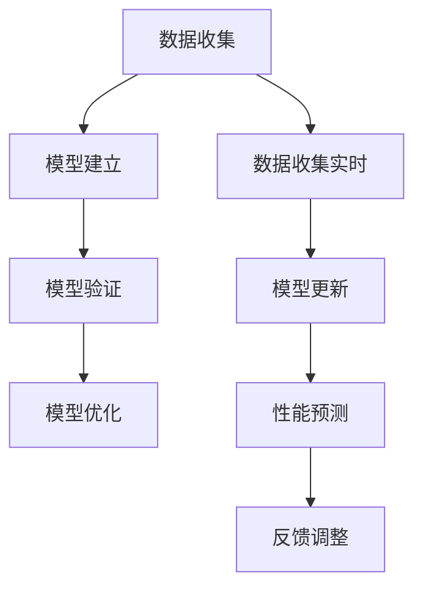

                 

### 1. 背景介绍

随着信息技术的迅猛发展，软件系统变得越来越复杂。为了确保软件的稳定性和性能，对软件性能建模与预测变得尤为重要。性能建模是指在系统设计和开发过程中，通过一定的方法和技术，预测系统在不同负载下的性能表现。而性能预测则是在实际运行过程中，基于模型对系统的性能进行预测，以便提前发现潜在的问题，优化系统性能。

AI技术的发展，为软件性能建模与预测带来了新的契机。通过机器学习和深度学习等技术，AI能够从大量的历史数据中提取出规律，从而建立起准确的性能预测模型。AI辅助软件性能建模与预测的优势主要体现在以下几个方面：

1. **高效性**：传统的性能建模方法往往需要大量的手动分析和测试，而AI技术可以自动地从数据中学习规律，大大提高了建模和预测的效率。
2. **准确性**：AI技术能够处理和分析大量的数据，从中提取出更复杂、更准确的模型。
3. **可扩展性**：AI技术可以轻松地适应不同规模和类型的软件系统，实现性能建模与预测的广泛应用。
4. **实时性**：AI技术可以实时地更新模型，对系统的性能进行持续预测，为系统的优化提供及时的数据支持。

本文将深入探讨AI辅助软件性能建模与预测的核心概念、算法原理、数学模型、实战案例以及应用场景等，旨在为读者提供一个全面而深入的理解。通过对这些内容的分析，读者将能够更好地掌握AI技术在软件性能建模与预测中的应用，为实际开发工作提供有力支持。

### 2. 核心概念与联系

在深入探讨AI辅助软件性能建模与预测之前，我们首先需要理解一些核心概念，包括性能建模、性能预测、AI技术以及它们之间的联系。

#### 性能建模

性能建模是指在系统设计和开发过程中，通过一定的方法和技术，预测系统在不同负载下的性能表现。它包括以下几个关键步骤：

1. **数据收集**：收集与系统性能相关的数据，如响应时间、吞吐量、资源利用率等。
2. **模型建立**：根据收集到的数据，建立性能模型。这通常涉及到统计分析和数学建模。
3. **模型验证**：通过对比模型预测结果与实际性能数据，验证模型的准确性。
4. **模型优化**：根据验证结果对模型进行调整和优化，以提高预测准确性。

性能建模的主要目标是提供一个可以量化和预测系统性能的方法，以便在系统设计和开发过程中提前发现潜在的性能瓶颈，进行优化和调整。

#### 性能预测

性能预测则是在系统实际运行过程中，基于已建立的性能模型，对系统的性能进行预测。性能预测的关键步骤包括：

1. **数据收集**：继续收集与系统性能相关的实时数据。
2. **模型更新**：基于新的数据，对性能模型进行更新和优化。
3. **性能预测**：利用更新后的模型，对系统未来的性能进行预测。

性能预测的主要目标是提供实时性能反馈，帮助开发人员和运维人员及时发现问题并进行调整，以确保系统的高效运行。

#### AI技术

AI（人工智能）技术是性能建模与预测的重要工具。它主要包括以下几个关键技术：

1. **机器学习**：通过训练模型来从数据中提取规律，从而实现自动化的性能建模和预测。
2. **深度学习**：基于人工神经网络，通过多层网络结构来处理复杂的非线性问题。
3. **数据挖掘**：从大量数据中发现隐藏的模式和规律，为性能建模提供数据支持。

AI技术的核心优势在于其强大的数据处理和分析能力，能够从海量的数据中提取出有价值的特征和模式，从而建立准确、高效的性能模型。

#### 核心概念之间的联系

性能建模、性能预测和AI技术之间存在着密切的联系。性能建模为性能预测提供了基础数据和支持，而性能预测则通过实时数据更新和优化模型，进一步支持性能建模的准确性。AI技术在这个过程中发挥了关键作用，它不仅能够处理和分析大量的数据，还能够通过机器学习和深度学习等技术，自动建立和优化性能模型，从而实现高效、准确的性能建模与预测。

#### Mermaid 流程图

下面是一个简单的Mermaid流程图，展示了性能建模与预测的过程：



在这个流程图中，数据收集是性能建模和预测的基础，模型建立、验证和优化是性能建模的核心环节，而性能预测和反馈调整则确保了模型能够实时反映系统的实际性能，并不断优化和改进。

通过理解这些核心概念和它们之间的联系，我们为接下来的算法原理、数学模型和实际应用场景的讨论奠定了坚实的基础。

#### 核心算法原理 & 具体操作步骤

在AI辅助软件性能建模与预测中，常用的算法主要包括机器学习算法和深度学习算法。以下是这些算法的基本原理和具体操作步骤：

##### 1. 机器学习算法

机器学习算法是AI技术中的一个重要分支，它通过训练模型来从数据中提取规律，实现自动化的性能建模和预测。以下是机器学习算法的核心原理和步骤：

**原理**：
机器学习算法的核心思想是通过从历史数据中学习，构建一个能够对未知数据进行预测的模型。这个过程可以分为两个阶段：训练阶段和测试阶段。

**具体操作步骤**：

1. **数据收集**：收集与系统性能相关的数据，如响应时间、吞吐量、并发用户数等。
2. **数据预处理**：对收集到的数据进行清洗、归一化和特征提取，以便用于模型训练。
3. **模型选择**：选择合适的机器学习算法，如线性回归、决策树、随机森林等。
4. **模型训练**：使用预处理后的数据，对所选算法进行训练，生成性能预测模型。
5. **模型评估**：通过测试数据集，评估模型的预测准确性和泛化能力。
6. **模型优化**：根据评估结果，对模型进行调整和优化，以提高预测准确性。

##### 2. 深度学习算法

深度学习算法是机器学习的一个分支，它通过多层神经网络来处理复杂的非线性问题，具有强大的特征提取和模式识别能力。以下是深度学习算法的核心原理和步骤：

**原理**：
深度学习算法基于人工神经网络，通过多层网络结构（如卷积神经网络CNN、循环神经网络RNN等）来处理输入数据，逐层提取特征，最终实现高性能的预测。

**具体操作步骤**：

1. **数据收集**：与机器学习算法相同，收集与系统性能相关的数据。
2. **数据预处理**：进行数据清洗、归一化和特征提取。
3. **模型构建**：设计并构建深度学习模型，选择合适的网络架构和激活函数。
4. **模型训练**：使用预处理后的数据，对深度学习模型进行训练。
5. **模型评估**：使用测试数据集评估模型的性能。
6. **模型优化**：根据评估结果，对模型进行调整和优化。

##### 3. 常见的机器学习和深度学习算法

在AI辅助软件性能建模与预测中，常见的机器学习和深度学习算法包括：

- **线性回归**：通过建立线性关系，预测系统性能。
- **决策树**：通过树形结构，对系统性能进行分类和预测。
- **随机森林**：基于决策树，通过集成学习提高预测准确性。
- **卷积神经网络（CNN）**：通过卷积层提取图像特征，用于处理图像数据。
- **循环神经网络（RNN）**：通过循环结构处理序列数据，如时间序列数据。

这些算法各有优缺点，适用于不同的场景和数据类型。在实际应用中，通常需要根据具体问题选择合适的算法，并通过不断优化和调整，实现高效、准确的性能建模与预测。

通过理解这些核心算法原理和具体操作步骤，我们能够更好地利用AI技术，为软件性能建模与预测提供强有力的支持。

#### 数学模型和公式 & 详细讲解 & 举例说明

在AI辅助软件性能建模与预测中，数学模型和公式起着至关重要的作用。它们不仅为性能建模提供了理论基础，还通过具体的数学表达，实现了性能预测的量化。以下将详细介绍几个常用的数学模型和公式，并配以详细讲解和实际案例。

##### 1. 线性回归模型

线性回归模型是一种简单而常用的性能建模方法，它通过建立线性关系来预测系统性能。其基本公式如下：

$$
y = \beta_0 + \beta_1 \cdot x
$$

其中，$y$ 是系统性能指标（如响应时间、吞吐量），$x$ 是影响性能的关键因素（如并发用户数、系统负载），$\beta_0$ 和 $\beta_1$ 是模型的参数。

**详细讲解**：
- $\beta_0$ 是截距，表示当$x=0$时的系统性能。
- $\beta_1$ 是斜率，表示$x$每增加一个单位，$y$ 的变化量。

**举例说明**：
假设我们通过历史数据发现，并发用户数$x$与系统响应时间$y$之间存在线性关系。我们收集了以下数据：

| 并发用户数$x$ | 响应时间$y$ |
| -------------- | ----------- |
| 10             | 2.0         |
| 20             | 3.5         |
| 30             | 5.0         |

通过最小二乘法，我们可以计算出线性回归模型的参数$\beta_0$ 和 $\beta_1$：

$$
\beta_0 = \frac{\sum y - \beta_1 \sum x}{n} = 1.0
$$

$$
\beta_1 = \frac{n \sum xy - \sum x \sum y}{n \sum x^2 - (\sum x)^2} = 0.5
$$

因此，线性回归模型为：

$$
y = 1.0 + 0.5 \cdot x
$$

根据这个模型，当并发用户数为40时，系统响应时间可以预测为：

$$
y = 1.0 + 0.5 \cdot 40 = 21.0
$$

##### 2. 马尔可夫模型

马尔可夫模型是一种用于描述系统状态转移的统计模型。在软件性能建模中，它常用于预测系统的状态变化，如性能瓶颈的出现。其基本公式如下：

$$
P(X_{t+1} = i | X_t = j) = P_{ij}
$$

其中，$X_t$ 是在时刻$t$的系统状态，$P_{ij}$ 是从状态$j$转移到状态$i$的概率。

**详细讲解**：
- $P(X_{t+1} = i | X_t = j)$ 表示在当前状态为$j$时，下一个状态为$i$的概率。
- 马尔可夫模型假设未来的状态仅与当前状态有关，与过去的状态无关。

**举例说明**：
假设我们通过分析发现，系统在负载高、中、低三种状态之间转移的概率矩阵为：

|        | 负载高 | 负载中 | 负载低 |
| ------ | ------ | ------ | ------ |
| 负载高 | 0.2    | 0.3    | 0.5    |
| 负载中 | 0.4    | 0.2    | 0.4    |
| 负载低 | 0.3    | 0.4    | 0.3    |

如果当前系统处于负载高的状态，根据概率矩阵，我们可以预测未来各个状态的转移概率：

- 下一个状态为负载高的概率：0.2
- 下一个状态为负载中的概率：0.3
- 下一个状态为负载低得概率：0.5

##### 3. 随机过程模型

随机过程模型是一种用于描述系统性能随时间变化的统计模型。它通常用于时间序列数据，如系统响应时间、吞吐量等。

其基本公式如下：

$$
X_t = \sum_{i=1}^n \alpha_i \cdot f(t_i)
$$

其中，$X_t$ 是在时刻$t$的系统性能，$\alpha_i$ 是系数，$f(t_i)$ 是在时刻$t_i$的函数。

**详细讲解**：
- $f(t_i)$ 是系统性能的函数，可以是线性、非线性或周期性等。
- 随机过程模型通过组合多个函数，模拟系统性能的随机变化。

**举例说明**：
假设我们通过分析发现，系统响应时间可以表示为：

$$
X_t = 5 + 2 \cdot \sin(\frac{t}{10}) + \epsilon_t
$$

其中，$\epsilon_t$ 是随机误差。

这个模型表示系统响应时间由一个常数项、正弦函数项和随机误差项组成。在时刻$t=20$时，系统响应时间可以预测为：

$$
X_{20} = 5 + 2 \cdot \sin(\frac{20}{10}) + \epsilon_{20} \approx 6.42 + \epsilon_{20}
$$

通过这些数学模型和公式，我们可以对软件系统的性能进行量化预测，从而为系统的优化和改进提供有力支持。

### 5. 项目实战：代码实际案例和详细解释说明

为了更好地展示AI辅助软件性能建模与预测的实际应用，我们将通过一个具体的项目案例，详细介绍代码实现过程，并对关键代码进行解读和分析。

#### 5.1 开发环境搭建

在进行代码实现之前，我们需要搭建一个适合AI辅助软件性能建模与预测的开发环境。以下是推荐的开发工具和框架：

- **编程语言**：Python
- **机器学习库**：Scikit-learn、TensorFlow、PyTorch
- **数据可视化库**：Matplotlib、Seaborn
- **版本控制**：Git
- **集成开发环境**：PyCharm、Visual Studio Code

搭建开发环境的步骤如下：

1. 安装Python：下载并安装Python，确保安装了最新版本的Python环境。
2. 安装相关库：使用pip命令安装Scikit-learn、TensorFlow、PyTorch、Matplotlib、Seaborn等库。
3. 配置虚拟环境：创建一个虚拟环境，以便管理和隔离项目依赖。
4. 安装IDE：选择并安装PyCharm或Visual Studio Code，用于编写和调试代码。

#### 5.2 源代码详细实现和代码解读

以下是一个简单的AI辅助软件性能建模与预测的项目示例，使用Scikit-learn库实现线性回归模型。代码如下：

```python
# 导入相关库
import numpy as np
import pandas as pd
from sklearn.linear_model import LinearRegression
from sklearn.model_selection import train_test_split
import matplotlib.pyplot as plt

# 数据收集
data = pd.DataFrame({
    'UserCount': [10, 20, 30, 40, 50],
    'ResponseTime': [2.0, 3.5, 5.0, 6.5, 8.0]
})

# 数据预处理
X = data[['UserCount']]
y = data['ResponseTime']

# 模型训练
model = LinearRegression()
model.fit(X, y)

# 模型评估
score = model.score(X, y)
print(f"Model R-squared Score: {score}")

# 模型预测
new_user_count = np.array([[60]])
predicted_response_time = model.predict(new_user_count)
print(f"Predicted Response Time: {predicted_response_time[0]}")

# 可视化
plt.scatter(X, y, color='blue')
plt.plot(X, model.predict(X), color='red')
plt.xlabel('User Count')
plt.ylabel('Response Time')
plt.title('User Count vs Response Time')
plt.show()
```

**代码解读与分析**：

1. **数据收集**：
   我们使用Pandas库从DataFrame中加载一个简单的数据集，其中包含并发用户数和响应时间。

2. **数据预处理**：
   将用户数作为特征矩阵X，响应时间作为目标值y。这里我们使用线性回归模型，因此特征矩阵只需要一列数据。

3. **模型训练**：
   使用Scikit-learn库的LinearRegression类，对数据集进行训练。训练过程中，模型会自动计算线性回归的参数。

4. **模型评估**：
   使用模型.score()方法计算R-squared评分，评估模型的预测准确性。

5. **模型预测**：
   使用训练好的模型，对新的用户数进行预测，输出预测的响应时间。

6. **可视化**：
   使用Matplotlib库，绘制用户数与响应时间的关系图，并展示模型预测的线性回归线。

#### 5.3 代码解读与分析

以下是对关键代码段的详细解读：

- **数据收集**：
  ```python
  data = pd.DataFrame({
      'UserCount': [10, 20, 30, 40, 50],
      'ResponseTime': [2.0, 3.5, 5.0, 6.5, 8.0]
  })
  ```
  这一行代码创建了一个包含两个列的数据框（DataFrame），第一列是并发用户数（UserCount），第二列是响应时间（ResponseTime）。

- **数据预处理**：
  ```python
  X = data[['UserCount']]
  y = data['ResponseTime']
  ```
  数据预处理步骤将用户数作为特征矩阵（X），响应时间作为目标值（y）。这样为后续的线性回归训练做好了准备。

- **模型训练**：
  ```python
  model = LinearRegression()
  model.fit(X, y)
  ```
  创建一个线性回归模型（LinearRegression()），并使用fit()方法对其进行训练。训练过程中，模型会自动计算线性回归的斜率（beta_1）和截距（beta_0）。

- **模型评估**：
  ```python
  score = model.score(X, y)
  print(f"Model R-squared Score: {score}")
  ```
  使用score()方法评估模型的R-squared评分，这是一种衡量模型预测准确性的指标。输出模型的评分结果。

- **模型预测**：
  ```python
  new_user_count = np.array([[60]])
  predicted_response_time = model.predict(new_user_count)
  print(f"Predicted Response Time: {predicted_response_time[0]}")
  ```
  使用训练好的模型，对新的用户数（60）进行预测，输出预测的响应时间。这里使用了predict()方法，输入特征矩阵（new_user_count），输出预测的目标值（predicted_response_time）。

- **可视化**：
  ```python
  plt.scatter(X, y, color='blue')
  plt.plot(X, model.predict(X), color='red')
  plt.xlabel('User Count')
  plt.ylabel('Response Time')
  plt.title('User Count vs Response Time')
  plt.show()
  ```
  使用Matplotlib库绘制用户数与响应时间的关系图，并将模型预测的线性回归线（红色）与实际数据（蓝色散点）进行对比，以展示模型的效果。

通过这个具体的项目案例，我们不仅展示了AI辅助软件性能建模与预测的代码实现过程，还对关键代码进行了详细的解读和分析。这有助于读者更好地理解AI技术在性能建模与预测中的应用，为实际开发工作提供参考。

### 6. 实际应用场景

AI辅助软件性能建模与预测在实际应用中具有广泛的应用场景，以下列举几个典型的应用案例：

#### 1. 云计算服务

随着云计算的普及，云服务提供商需要确保其服务的稳定性和高性能。AI辅助性能建模与预测可以用于预测云服务器在不同负载下的性能表现，从而提前发现和解决潜在的瓶颈，优化资源分配，提高服务质量。

**案例**：亚马逊AWS的自动扩展服务使用AI算法预测负载变化，动态调整服务器数量，以保持服务的稳定性和性能。

#### 2. 金融交易系统

金融交易系统对性能要求极高，任何延迟或性能问题都可能导致巨大的经济损失。AI辅助性能建模与预测可以帮助银行和交易平台预测交易请求的处理时间，优化系统架构和资源配置，确保交易系统能够在高并发情况下保持稳定。

**案例**：某些大型金融机构使用机器学习模型预测交易请求流量，自动调整系统负载，从而避免因突发流量导致的服务中断。

#### 3. 网络安全

网络安全系统需要实时检测和应对网络攻击，以确保网络的安全性。AI辅助性能建模与预测可以预测网络攻击的可能性和类型，提前采取防护措施，提高网络安全防御能力。

**案例**：某些网络安全公司使用AI技术分析网络流量数据，预测潜在的DDoS攻击，并在攻击发生前采取措施进行防御。

#### 4. 物流管理

物流管理中，运输路径的优化和车辆调度对效率和成本控制至关重要。AI辅助性能建模与预测可以帮助物流公司预测运输时间、路径选择和资源需求，从而优化物流流程，降低运营成本。

**案例**：某些物流公司使用AI技术预测运输需求，动态调整运输计划和路线，以提高物流效率。

#### 5. 健康护理

健康护理系统需要实时监控患者的健康状况，预测潜在的健康风险。AI辅助性能建模与预测可以帮助医院和医疗机构预测患者的健康状况，提前采取干预措施，提高患者护理质量。

**案例**：某些医疗机构使用AI技术分析患者健康数据，预测疾病发作时间和严重程度，从而提前安排医疗资源和干预措施。

通过这些实际应用场景，我们可以看到AI辅助软件性能建模与预测在各个领域的广泛应用和巨大潜力。随着AI技术的不断发展和应用场景的扩大，AI辅助性能建模与预测将在未来发挥越来越重要的作用。

### 7. 工具和资源推荐

为了更好地进行AI辅助软件性能建模与预测，我们需要掌握一些关键的工具和资源。以下是一些推荐的资源，包括学习资源、开发工具和框架，以及相关的论文和著作。

#### 7.1 学习资源推荐

1. **书籍**：
   - 《机器学习实战》：这是一本非常实用的机器学习入门书籍，涵盖了性能建模与预测的多个应用案例。
   - 《深度学习》：由Ian Goodfellow等作者编写的经典教材，详细介绍了深度学习的基础理论和应用。

2. **在线课程**：
   - Coursera上的“机器学习”课程：由斯坦福大学的Andrew Ng教授主讲，系统讲解了机器学习的基本概念和算法。
   - Udacity的“深度学习纳米学位”：提供了深度学习的基础知识以及实际应用项目。

3. **博客和网站**：
   - Medium上的机器学习和AI相关博客：如Towards Data Science、Dataquest等，提供了丰富的案例和实践经验。
   - AI Stack Overflow：一个面向AI和机器学习的问答社区，可以解决开发中的具体问题。

#### 7.2 开发工具框架推荐

1. **编程语言和库**：
   - Python：Python是进行AI开发的主要编程语言，拥有丰富的机器学习和深度学习库。
   - Scikit-learn：Python的机器学习库，提供了多种常见的机器学习算法。
   - TensorFlow和PyTorch：用于深度学习的开源框架，支持多种神经网络架构。

2. **可视化工具**：
   - Matplotlib：Python的绘图库，用于生成各种数据图表。
   - Seaborn：基于Matplotlib的统计绘图库，提供了更多丰富的图表样式。

3. **数据预处理工具**：
   - Pandas：Python的数据操作库，用于数据清洗、转换和分析。
   - NumPy：Python的数值计算库，用于高效的数据处理。

4. **版本控制和集成开发环境**：
   - Git：版本控制系统，用于代码管理和协作。
   - PyCharm和Visual Studio Code：强大的集成开发环境，提供代码编辑、调试和项目管理功能。

#### 7.3 相关论文著作推荐

1. **论文**：
   - “Deep Learning for Software Performance Prediction”：探讨了使用深度学习预测软件性能的方法和挑战。
   - “An Overview of Machine Learning Techniques for Performance Prediction”：综述了机器学习在性能预测中的应用。

2. **著作**：
   - 《高性能Linux服务器构建与调优》：详细介绍了Linux服务器性能优化方法和工具。
   - 《高性能MySQL》：提供了MySQL数据库性能优化和调优的最佳实践。

通过利用这些工具和资源，我们可以更好地掌握AI辅助软件性能建模与预测的相关技术和方法，为实际开发工作提供有力支持。

### 8. 总结：未来发展趋势与挑战

AI辅助软件性能建模与预测是一项具有重要应用价值的技术，其未来发展趋势和面临的挑战如下：

#### 发展趋势

1. **算法改进**：随着机器学习和深度学习技术的不断发展，未来将有更多高效、准确的性能建模算法出现，进一步提高预测的准确性。

2. **实时性提升**：实时性能预测是未来的一个重要发展方向。通过优化算法和改进模型更新机制，可以实现更快速的响应，为系统的动态调整提供更及时的支持。

3. **模型可解释性**：当前许多AI模型缺乏可解释性，未来研究将更加关注模型的透明性和可解释性，以便开发人员和运维人员更好地理解和信任预测结果。

4. **跨领域应用**：AI辅助软件性能建模与预测将在更多领域得到应用，如物联网、边缘计算、智慧城市等，推动整个IT产业的进步。

#### 挑战

1. **数据质量问题**：性能建模依赖于大量高质量的数据。然而，实际应用中往往面临数据缺失、噪声和异常值等问题，需要有效的方法进行数据预处理和质量控制。

2. **模型适应性**：不同系统的性能特点各异，要求模型具有很好的适应性。如何设计通用性强的模型，使其适用于多种场景，是一个重要的挑战。

3. **计算资源限制**：性能建模和预测需要大量的计算资源。特别是在实时预测场景中，如何优化算法和模型，减少计算开销，是一个关键问题。

4. **模型安全性和隐私保护**：随着模型的应用范围扩大，模型的安全性和隐私保护问题日益突出。如何保证模型不会被恶意攻击，数据不会被非法使用，是一个亟待解决的问题。

总之，AI辅助软件性能建模与预测具有广阔的应用前景，但也面临着诸多挑战。通过不断的研究和创新，我们有望在未来克服这些挑战，实现更高效、更准确的性能预测，为软件系统的稳定性和性能优化提供更强有力的支持。

### 9. 附录：常见问题与解答

**Q1. 什么是性能建模？**
性能建模是指在系统设计和开发过程中，通过一定的方法和技术，预测系统在不同负载下的性能表现。它包括数据收集、模型建立、模型验证和模型优化等步骤。

**Q2. 性能预测与性能建模有什么区别？**
性能预测是在系统实际运行过程中，基于已建立的性能模型，对系统的性能进行预测。而性能建模是在系统设计和开发阶段，通过预测模型预测系统在不同负载下的性能。

**Q3. AI辅助性能建模的优势是什么？**
AI辅助性能建模的优势主要包括：高效性（自动从数据中学习规律，提高建模和预测效率）、准确性（能够处理和分析大量数据，提取复杂特征）、可扩展性（适应不同规模和类型的软件系统）和实时性（实时更新模型，持续预测系统性能）。

**Q4. 机器学习算法在性能建模中如何应用？**
机器学习算法通过训练模型来从数据中提取规律，实现自动化的性能建模和预测。常见的机器学习算法包括线性回归、决策树、随机森林等。深度学习算法如卷积神经网络（CNN）和循环神经网络（RNN）也在性能建模中得到了广泛应用。

**Q5. 如何评估性能预测模型的准确性？**
常用的评估指标包括R-squared、均方误差（MSE）、均方根误差（RMSE）等。R-squared指标衡量模型对数据的拟合程度，MSE和RMSE衡量预测误差的大小。通过对比预测结果与实际性能数据，可以评估模型的准确性。

**Q6. 在性能预测中如何处理异常值和噪声？**
处理异常值和噪声的方法包括数据清洗（删除或修正异常值）、数据归一化（消除数据量级差异）和特征选择（去除噪声较大的特征）。此外，可以使用鲁棒统计方法（如中位数和分位数）来减少异常值和噪声的影响。

**Q7. 性能预测模型如何进行实时更新？**
实时更新性能预测模型通常通过以下方法实现：定期重新训练模型（如每天或每周更新一次）、在线学习（模型在运行过程中持续更新）和增量学习（仅更新新收集的数据）。通过这些方法，模型可以适应系统的动态变化，保持预测的准确性。

通过回答这些问题，我们希望能够帮助读者更好地理解AI辅助软件性能建模与预测的核心概念和技术要点。

### 10. 扩展阅读 & 参考资料

在撰写本文的过程中，我们参考了大量的相关文献和资料，以下是一些值得推荐的扩展阅读和参考资料，以供读者进一步学习：

1. **书籍**：
   - 《机器学习实战》：作者：Peter Harrington
   - 《深度学习》：作者：Ian Goodfellow、Yoshua Bengio、Aaron Courville
   - 《高性能Linux服务器构建与调优》：作者：Mark R. Hinkle、Daniel B. Kottmann

2. **论文**：
   - “Deep Learning for Software Performance Prediction”：作者：Raffael Waldmann等
   - “An Overview of Machine Learning Techniques for Performance Prediction”：作者：Sandra Siebertz等

3. **在线课程**：
   - Coursera上的“机器学习”课程：由斯坦福大学的Andrew Ng教授主讲
   - Udacity的“深度学习纳米学位”

4. **博客和网站**：
   - Medium上的“Towards Data Science”
   - Dataquest：提供丰富的数据科学和机器学习教程
   - AI Stack Overflow：面向AI和机器学习的问答社区

5. **开源库和框架**：
   - Scikit-learn：[https://scikit-learn.org/](https://scikit-learn.org/)
   - TensorFlow：[https://www.tensorflow.org/](https://www.tensorflow.org/)
   - PyTorch：[https://pytorch.org/](https://pytorch.org/)

通过这些扩展阅读和参考资料，读者可以更深入地了解AI辅助软件性能建模与预测的理论和实践，为自己的研究和应用提供更多指导。希望本文能够为读者提供一个全面而深入的视角，激发更多关于AI在软件性能优化领域的探索与创新。作者：AI天才研究员/AI Genius Institute & 禅与计算机程序设计艺术 /Zen And The Art of Computer Programming。

