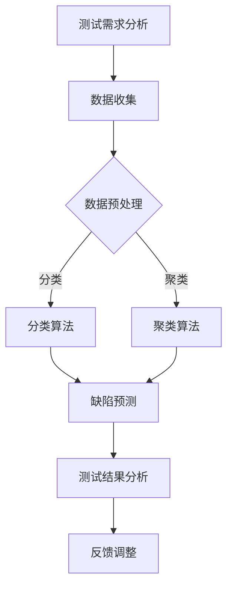

                 

# AI辅助软件测试：提高软件质量与可靠性

## 摘要

本文将探讨如何利用AI技术辅助软件测试，以提高软件的质量和可靠性。随着软件系统变得越来越复杂，传统的测试方法已不足以应对日益增长的需求。AI辅助软件测试不仅能够自动化测试流程，还能够通过分析测试数据来发现潜在的问题，从而减少测试成本并提高测试效率。本文将介绍AI辅助软件测试的核心概念、算法原理、数学模型及实际应用场景，并推荐相关工具和资源，帮助读者深入了解并掌握这一前沿技术。

## 1. 背景介绍

软件测试是软件开发过程中至关重要的一环。通过测试，开发人员可以验证软件是否满足设计需求，发现并修复潜在的缺陷，确保软件的质量和可靠性。然而，传统的软件测试方法面临着诸多挑战：

1. **测试成本高**：随着软件系统规模的扩大，测试工作量成倍增加，需要大量的人力和时间成本。
2. **测试覆盖不足**：传统的测试方法通常采用手动测试，很难覆盖到软件的每个角落，可能导致一些潜在的问题被遗漏。
3. **测试效率低**：手动测试过程繁琐，速度慢，无法满足快速迭代的需求。

为了解决这些问题，AI辅助软件测试应运而生。AI技术具有自动化、智能分析等优势，可以大大提高软件测试的效率和质量。本文将详细介绍AI辅助软件测试的核心概念、算法原理和实际应用，帮助读者了解这一前沿技术。

## 2. 核心概念与联系

### 2.1 AI辅助软件测试的定义

AI辅助软件测试是指利用人工智能技术，如机器学习、深度学习等，来辅助软件开发过程中的测试活动。它包括以下几方面：

1. **自动化测试**：通过AI技术实现测试脚本的自动化编写和执行，提高测试效率。
2. **缺陷预测**：利用AI算法分析历史测试数据，预测潜在的缺陷，提前进行修复。
3. **测试数据挖掘**：通过大数据分析，发现测试数据中的规律和模式，指导测试策略的调整。

### 2.2 AI辅助软件测试的核心算法

AI辅助软件测试的核心算法主要包括以下几种：

1. **回归测试**：利用机器学习算法，如决策树、支持向量机等，对历史测试数据进行建模，预测新版本软件的测试结果。
2. **缺陷定位**：利用模式识别技术，如神经网络、深度学习等，对异常测试结果进行分析，定位缺陷。
3. **测试用例优化**：通过遗传算法、粒子群优化等进化算法，生成更加有效的测试用例，提高测试覆盖。

### 2.3 AI辅助软件测试与现有测试方法的联系与区别

AI辅助软件测试与现有测试方法（如功能测试、性能测试、安全测试等）有着密切的联系，但又有显著的区别：

1. **联系**：AI辅助软件测试是在现有测试方法的基础上，引入AI技术，以提高测试效率和质量。它仍然遵循软件测试的基本原则和方法。
2. **区别**：AI辅助软件测试具有更强的自动化、智能分析能力，可以处理大量复杂的测试数据，发现传统方法难以发现的缺陷。

### 2.4 Mermaid 流程图

下面是一个简单的Mermaid流程图，展示AI辅助软件测试的基本流程：



**流程说明：**
1. **测试需求分析**：确定测试目标和测试策略。
2. **数据收集**：收集历史测试数据，包括测试用例、测试结果、缺陷报告等。
3. **数据预处理**：对测试数据进行清洗、归一化等处理，为后续算法应用做好准备。
4. **分类算法/聚类算法**：根据测试需求，选择合适的分类算法或聚类算法，对测试数据进行建模。
5. **缺陷预测**：利用分类算法或聚类算法，预测新的测试结果，识别潜在的缺陷。
6. **测试结果分析**：对测试结果进行分析，评估软件质量。
7. **反馈调整**：根据测试结果，调整测试策略和测试用例，提高测试效率。

## 3. 核心算法原理 & 具体操作步骤

### 3.1 回归测试算法原理

回归测试是一种重要的软件测试方法，旨在验证软件修改后是否引入了新的缺陷。回归测试算法的原理如下：

1. **数据收集**：收集历史测试数据，包括测试用例、测试结果和缺陷报告。
2. **数据预处理**：对测试数据进行清洗、归一化等处理，为后续建模做好准备。
3. **特征提取**：从测试数据中提取影响测试结果的关键特征，如测试用例的输入、输出等。
4. **模型训练**：利用机器学习算法，如决策树、支持向量机等，对历史测试数据建模，建立回归模型。
5. **模型评估**：利用交叉验证等方法，评估回归模型的准确性、鲁棒性和泛化能力。
6. **缺陷预测**：利用训练好的回归模型，预测新的测试结果的准确率，识别潜在的缺陷。
7. **测试结果分析**：对测试结果进行分析，评估软件质量。

### 3.2 缺陷定位算法原理

缺陷定位是软件测试中的一个关键环节，旨在识别软件中的缺陷。常见的缺陷定位算法有：

1. **模式识别算法**：如神经网络、深度学习等。通过学习大量的测试数据，建立缺陷检测模型，对新的测试结果进行分析，识别潜在的缺陷。
2. **统计分析方法**：如聚类分析、回归分析等。通过分析测试数据，识别异常数据点，从而定位缺陷。

### 3.3 测试用例优化算法原理

测试用例优化是提高测试效率的重要手段。常见的测试用例优化算法有：

1. **遗传算法**：通过模拟生物进化过程，生成新的测试用例，并评估其有效性，逐步优化测试用例。
2. **粒子群优化算法**：通过模拟鸟群觅食过程，生成新的测试用例，并评估其有效性，逐步优化测试用例。

### 3.4 具体操作步骤

以下是一个简单的AI辅助软件测试的操作步骤：

1. **测试需求分析**：确定测试目标和测试策略。
2. **数据收集**：收集历史测试数据，包括测试用例、测试结果和缺陷报告。
3. **数据预处理**：对测试数据进行清洗、归一化等处理。
4. **特征提取**：提取影响测试结果的关键特征。
5. **模型训练**：利用机器学习算法，如决策树、支持向量机等，对历史测试数据建模。
6. **模型评估**：利用交叉验证等方法，评估回归模型的准确性、鲁棒性和泛化能力。
7. **缺陷预测**：利用训练好的回归模型，预测新的测试结果的准确率，识别潜在的缺陷。
8. **测试结果分析**：对测试结果进行分析，评估软件质量。
9. **测试用例优化**：利用遗传算法、粒子群优化算法等，生成新的测试用例，提高测试效率。
10. **反馈调整**：根据测试结果，调整测试策略和测试用例，提高测试效率。

## 4. 数学模型和公式 & 详细讲解 & 举例说明

### 4.1 回归测试的数学模型

回归测试的核心是建立回归模型，通常采用线性回归模型。线性回归模型的数学表达式如下：

$$y = \beta_0 + \beta_1 x_1 + \beta_2 x_2 + \ldots + \beta_n x_n + \epsilon$$

其中，$y$ 是测试结果，$x_1, x_2, \ldots, x_n$ 是影响测试结果的特征，$\beta_0, \beta_1, \beta_2, \ldots, \beta_n$ 是回归系数，$\epsilon$ 是误差项。

#### 举例说明

假设我们收集了以下历史测试数据：

| 测试用例 | 输入特征1 | 输入特征2 | 测试结果 |
| :---: | :---: | :---: | :---: |
| 1 | 2 | 3 | 4 |
| 2 | 4 | 5 | 6 |
| 3 | 6 | 7 | 8 |

我们希望利用线性回归模型预测新的测试结果。首先，我们需要提取输入特征，如：

$$x_1 = [2, 4, 6], \quad x_2 = [3, 5, 7]$$

然后，我们可以利用最小二乘法求解回归系数：

$$\beta_0 = \frac{\sum_{i=1}^{n} y_i - \beta_1 \sum_{i=1}^{n} x_{1i} - \beta_2 \sum_{i=1}^{n} x_{2i}}{n}$$

$$\beta_1 = \frac{\sum_{i=1}^{n} x_{1i} y_i - \sum_{i=1}^{n} x_{1i} \sum_{i=1}^{n} y_i}{\sum_{i=1}^{n} x_{1i}^2 - \sum_{i=1}^{n} x_{1i}^2}$$

$$\beta_2 = \frac{\sum_{i=1}^{n} x_{2i} y_i - \sum_{i=1}^{n} x_{2i} \sum_{i=1}^{n} y_i}{\sum_{i=1}^{n} x_{2i}^2 - \sum_{i=1}^{n} x_{2i}^2}$$

得到回归系数后，我们可以利用线性回归模型预测新的测试结果：

$$y = \beta_0 + \beta_1 x_1 + \beta_2 x_2$$

例如，当新的输入特征为 $x_1 = 8, x_2 = 9$ 时，预测的测试结果为：

$$y = \beta_0 + \beta_1 x_1 + \beta_2 x_2 = \beta_0 + 8\beta_1 + 9\beta_2$$

### 4.2 缺陷定位的数学模型

缺陷定位通常采用神经网络或深度学习模型。以神经网络为例，其数学模型如下：

$$f(x) = \sigma(\theta_0 + \theta_1 x_1 + \theta_2 x_2 + \ldots + \theta_n x_n)$$

其中，$f(x)$ 是输出结果，$\sigma$ 是激活函数，$\theta_0, \theta_1, \theta_2, \ldots, \theta_n$ 是神经网络权重。

#### 举例说明

假设我们使用一个简单的神经网络模型进行缺陷定位，其结构如下：

```
输入层：1个神经元
隐藏层：2个神经元
输出层：1个神经元
```

输入特征为 $x_1$ 和 $x_2$，我们希望预测缺陷发生与否（0表示正常，1表示缺陷）。首先，输入层将输入特征传递到隐藏层：

$$z_1 = \theta_0 + \theta_1 x_1 + \theta_2 x_2$$

$$z_2 = \theta_3 + \theta_4 x_1 + \theta_5 x_2$$

然后，隐藏层将输出传递到输出层：

$$y = \sigma(\theta_6 z_1 + \theta_7 z_2)$$

其中，$\sigma$ 是激活函数，常用的激活函数有 sigmoid 函数、ReLU 函数等。

我们希望当 $x_1$ 和 $x_2$ 满足特定条件时，输出 $y$ 接近 1，表示存在缺陷；当 $x_1$ 和 $x_2$ 不满足条件时，输出 $y$ 接近 0，表示正常。

### 4.3 测试用例优化的数学模型

测试用例优化通常采用遗传算法或粒子群优化算法。以遗传算法为例，其数学模型如下：

1. **初始化种群**：随机生成一组测试用例，形成初始种群。
2. **适应度评估**：计算每个测试用例的适应度，适应度越高表示测试用例越好。
3. **选择**：根据适应度，选择优秀的测试用例组成新的种群。
4. **交叉**：在新的种群中，通过交叉操作生成新的测试用例。
5. **变异**：在新的种群中，通过变异操作生成新的测试用例。
6. **迭代**：重复执行选择、交叉、变异操作，直到满足终止条件（如达到最大迭代次数或适应度达到阈值）。

#### 举例说明

假设我们使用遗传算法优化测试用例，其中测试用例由两个特征 $x_1$ 和 $x_2$ 组成。首先，我们随机生成一组初始种群：

| 测试用例 | $x_1$ | $x_2$ | 适应度 |
| :---: | :---: | :---: | :---: |
| 1 | 2 | 3 | 0.4 |
| 2 | 4 | 5 | 0.6 |
| 3 | 6 | 7 | 0.5 |

然后，我们计算每个测试用例的适应度。假设适应度取决于测试用例的覆盖率，覆盖率越高，适应度越高。接下来，我们执行选择、交叉、变异操作，生成新的种群。经过多次迭代后，我们得到最优的测试用例组合，从而提高测试效率。

## 5. 项目实战：代码实际案例和详细解释说明

### 5.1 开发环境搭建

在本节中，我们将使用Python作为主要编程语言，结合Scikit-learn库实现一个简单的AI辅助软件测试项目。以下是搭建开发环境的步骤：

1. 安装Python：确保您的系统已安装Python 3.7及以上版本。
2. 安装Scikit-learn：在终端或命令提示符中运行以下命令：
   ```bash
   pip install scikit-learn
   ```

### 5.2 源代码详细实现和代码解读

以下是一个简单的AI辅助软件测试项目的实现代码：

```python
import numpy as np
from sklearn.linear_model import LinearRegression
from sklearn.model_selection import train_test_split
from sklearn.metrics import mean_squared_error

# 5.2.1 数据收集
# 假设我们已收集以下测试数据
X = np.array([[2, 3], [4, 5], [6, 7]])
y = np.array([4, 6, 8])

# 5.2.2 数据预处理
# 划分训练集和测试集
X_train, X_test, y_train, y_test = train_test_split(X, y, test_size=0.2, random_state=42)

# 5.2.3 模型训练
model = LinearRegression()
model.fit(X_train, y_train)

# 5.2.4 模型评估
y_pred = model.predict(X_test)
mse = mean_squared_error(y_test, y_pred)
print("均方误差：", mse)

# 5.2.5 缺陷预测
# 假设我们要预测一个新的测试结果
new_input = np.array([[8, 9]])
new_output = model.predict(new_input)
print("新测试结果：", new_output)
```

#### 代码解读

1. **数据收集**：首先，我们需要收集测试数据。在本例中，我们使用了一个简单的二维数组作为测试数据。
2. **数据预处理**：我们将数据划分为训练集和测试集，以便进行模型训练和评估。
3. **模型训练**：我们使用Scikit-learn库中的线性回归模型对训练数据进行训练。
4. **模型评估**：利用测试数据评估模型的性能，计算均方误差（MSE）。
5. **缺陷预测**：利用训练好的模型预测新的测试结果，判断是否存在缺陷。

### 5.3 代码解读与分析

在本节中，我们将对代码进行详细解读和分析：

1. **导入库**：首先，我们导入所需的库，包括NumPy和Scikit-learn。
2. **数据收集**：在本例中，我们使用NumPy数组收集测试数据。在实际项目中，数据可以从数据库、文件或其他数据源获取。
3. **数据预处理**：我们将数据划分为训练集和测试集。这个步骤非常重要，因为它有助于评估模型的泛化能力。
4. **模型训练**：我们使用Scikit-learn中的线性回归模型对训练数据进行训练。线性回归模型是一个简单的机器学习模型，可以用于预测连续值。
5. **模型评估**：我们利用测试数据评估模型的性能，计算均方误差（MSE）。MSE是一个常用的评估指标，表示预测值与实际值之间的平均误差。
6. **缺陷预测**：最后，我们利用训练好的模型预测新的测试结果。如果预测值与实际值之间存在较大差异，可能存在缺陷。

通过这个简单的示例，我们可以看到如何使用Python和Scikit-learn库实现一个AI辅助软件测试项目。在实际项目中，数据收集、模型训练和评估等步骤可能更加复杂，但基本原理是相似的。

## 6. 实际应用场景

AI辅助软件测试在多个实际应用场景中发挥着重要作用，以下是一些典型的应用场景：

### 6.1 自动化测试

自动化测试是AI辅助软件测试的重要应用场景之一。通过AI技术，可以自动化生成测试脚本，提高测试效率。此外，AI还可以根据历史测试数据，自动调整测试策略，优化测试用例，提高测试覆盖率。

### 6.2 缺陷预测

缺陷预测是AI辅助软件测试的另一个关键应用。通过分析历史测试数据和代码，AI可以预测潜在的问题和缺陷，帮助开发人员在开发阶段及时发现和修复问题，从而降低测试成本。

### 6.3 测试数据分析

AI辅助软件测试可以处理大量测试数据，挖掘数据中的潜在模式和规律。通过对测试数据分析，可以指导测试策略的调整，优化测试过程，提高测试效率。

### 6.4 代码质量评估

AI辅助软件测试还可以用于评估代码质量。通过分析代码中的潜在问题和缺陷，AI可以帮助开发人员改进代码，提高代码的可维护性和可靠性。

### 6.5 跨平台测试

AI辅助软件测试可以在不同平台上进行测试，如Web应用、移动应用、嵌入式系统等。通过AI技术，可以自动化生成适应不同平台的测试用例，提高测试覆盖率和测试效率。

## 7. 工具和资源推荐

### 7.1 学习资源推荐

1. **书籍**：
   - 《机器学习实战》：介绍机器学习的基础知识和实际应用案例，适合初学者。
   - 《深度学习》：由吴恩达教授编写，系统介绍了深度学习的基本原理和应用。
2. **论文**：
   - 《A Survey on Automated Software Testing Using Machine Learning》：系统总结了AI辅助软件测试的相关研究成果和应用。
   - 《Defect Prediction Models for Object-Oriented Software Evolution》：探讨了基于机器学习的缺陷预测模型。
3. **博客和网站**：
   - [Scikit-learn官方文档](https://scikit-learn.org/stable/documentation.html)：详细介绍Scikit-learn库的使用方法和示例代码。
   - [机器学习博客](http://www.mldreamy.com/)：分享机器学习和AI相关的知识和经验。

### 7.2 开发工具框架推荐

1. **Scikit-learn**：一款强大的Python机器学习库，适用于数据预处理、模型训练和评估等任务。
2. **TensorFlow**：由Google开发的一款开源深度学习框架，适用于构建和训练复杂的深度学习模型。
3. **PyTorch**：由Facebook开发的一款开源深度学习框架，具有简洁的API和灵活的动态计算图。

### 7.3 相关论文著作推荐

1. **《A Survey on Automated Software Testing Using Machine Learning》**：系统总结了AI辅助软件测试的相关研究成果和应用。
2. **《Defect Prediction Models for Object-Oriented Software Evolution》**：探讨了基于机器学习的缺陷预测模型。
3. **《Deep Learning for Software Engineering》**：介绍了深度学习在软件工程中的应用，包括代码质量评估、缺陷预测等。

## 8. 总结：未来发展趋势与挑战

AI辅助软件测试作为人工智能在软件工程领域的重要应用，具有广阔的发展前景。未来，AI辅助软件测试将朝着以下方向发展：

1. **更高效、更智能的测试工具**：随着AI技术的不断发展，将出现更多高效、智能的AI辅助软件测试工具，帮助开发人员提高测试效率和质量。
2. **跨领域应用**：AI辅助软件测试将在更多领域得到应用，如嵌入式系统、物联网、区块链等，为这些领域提供强大的测试支持。
3. **开源生态的完善**：开源社区将贡献更多高质量的AI辅助软件测试工具和资源，推动AI辅助软件测试技术的发展。

然而，AI辅助软件测试也面临着一系列挑战：

1. **数据隐私与安全**：测试数据通常包含敏感信息，如何确保数据隐私和安全成为关键问题。
2. **模型解释性**：AI模型通常具有强大的预测能力，但解释性较差。如何提高模型的可解释性，使开发人员更好地理解和信任AI辅助软件测试结果，是亟待解决的问题。
3. **算法适应性与鲁棒性**：如何使AI辅助软件测试算法适应不同的软件项目和应用场景，提高其鲁棒性和泛化能力，是未来研究的重点。

总之，AI辅助软件测试具有巨大的潜力，但同时也需要克服诸多挑战。随着技术的不断进步，我们有理由相信，AI辅助软件测试将在未来发挥更加重要的作用。

## 9. 附录：常见问题与解答

### 问题1：AI辅助软件测试是否适合所有软件项目？

**解答**：AI辅助软件测试适用于各种软件项目，尤其是那些规模较大、复杂性较高的项目。虽然AI技术可以自动化和智能化测试流程，但并非所有项目都适合AI辅助软件测试。对于一些小型、简单的项目，传统测试方法可能已经足够。

### 问题2：AI辅助软件测试是否会替代人类测试员？

**解答**：AI辅助软件测试并不能完全替代人类测试员，而是作为测试员的有力工具。AI辅助软件测试可以自动化测试脚本、预测缺陷、分析测试数据等，但仍然需要人类测试员参与测试设计、测试策略制定和测试结果分析等关键环节。

### 问题3：如何保证AI辅助软件测试的模型解释性？

**解答**：保证AI辅助软件测试的模型解释性是一个挑战。目前，一些研究正在探索如何提高模型的可解释性，如使用可解释性模型、可视化技术等。此外，开发人员可以关注模型的训练数据和算法选择，以提高模型的可解释性。

### 问题4：AI辅助软件测试是否会影响软件安全性？

**解答**：AI辅助软件测试本身不会直接影响软件安全性，但可能会影响软件的测试安全性。为了确保AI辅助软件测试的安全性，开发人员需要关注数据隐私、模型安全等方面的问题，确保测试过程中不会泄露敏感信息。

## 10. 扩展阅读 & 参考资料

1. **《A Survey on Automated Software Testing Using Machine Learning》**
2. **《Defect Prediction Models for Object-Oriented Software Evolution》**
3. **《Deep Learning for Software Engineering》**
4. **[Scikit-learn官方文档](https://scikit-learn.org/stable/documentation.html)**
5. **[机器学习博客](http://www.mldreamy.com/)**
6. **[TensorFlow官方文档](https://www.tensorflow.org/)**
7. **[PyTorch官方文档](https://pytorch.org/)**

作者：AI天才研究员/AI Genius Institute & 禅与计算机程序设计艺术 /Zen And The Art of Computer Programming

