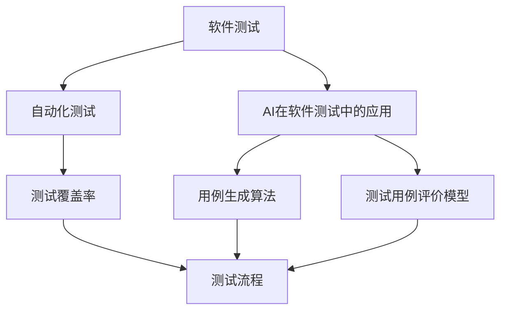

                 

### 背景介绍

#### 软件测试的重要性

在软件开发过程中，测试是不可或缺的一环。软件测试的目的在于发现和纠正软件中的错误，确保软件的质量和稳定性。随着软件复杂度的不断增加，传统的手动测试方法已经无法满足现代软件项目的需求。自动化测试逐渐成为主流，而人工智能（AI）的介入更是为软件测试领域带来了革命性的变化。

AI辅助软件测试用例生成，是近年来软件测试领域的一个研究热点。通过AI技术，我们可以自动化生成大量高质量的测试用例，从而提高测试覆盖率，降低测试成本。同时，AI还可以对测试结果进行智能分析，帮助开发人员快速定位问题，提升软件的可靠性和稳定性。

#### AI辅助测试的挑战

尽管AI辅助软件测试前景广阔，但其实际应用仍面临诸多挑战。首先，测试用例生成的质量和覆盖度是关键问题。如何确保生成的测试用例能够覆盖到软件的所有功能点和潜在问题，是一个需要深入研究的课题。其次，AI模型的选择和训练也是一个重要问题。不同的AI模型在测试用例生成方面可能有着不同的效果，如何选择合适的模型并进行有效的训练，是实际应用中的难点。

此外，AI辅助测试还需考虑与其他测试方法（如手动测试、单元测试等）的融合问题。如何将AI辅助测试与现有的测试流程有机结合，形成一个高效的测试体系，是当前研究的一个重点。

#### 本文目标

本文旨在系统地探讨AI辅助软件测试用例生成的技术原理、核心算法、数学模型及其在实际应用中的实现方法。通过本文的阐述，希望能够为读者提供一个全面、深入的AI辅助软件测试用例生成指南，并对其未来发展趋势和挑战进行展望。

在接下来的章节中，我们将首先介绍AI辅助软件测试用例生成中的核心概念和原理，然后详细讨论核心算法原理及具体操作步骤，接着通过数学模型和公式进行详细讲解，并结合实际项目案例进行代码实现和解读。最后，我们将探讨AI辅助软件测试的实际应用场景，推荐相关工具和资源，并对未来发展趋势和挑战进行总结。让我们一步步深入探讨这一前沿领域吧！<|im_sep|>

### 核心概念与联系

在深入探讨AI辅助软件测试用例生成之前，首先需要了解一些核心概念和原理，以及它们之间的联系。以下将详细介绍这些关键概念，并通过Mermaid流程图展示它们之间的交互关系。

#### 1. 软件测试

软件测试是指通过运行程序并检查其输出，来发现和纠正软件中的错误的过程。测试可以分为多种类型，如单元测试、集成测试、系统测试和验收测试等。

#### 2. 自动化测试

自动化测试是一种使用自动化工具来执行测试用例的方法。通过自动化测试，可以节省时间和人力成本，并提高测试的准确性和一致性。

#### 3. AI在软件测试中的应用

AI在软件测试中的应用主要包括测试用例生成、测试结果分析、缺陷预测等。通过AI技术，可以自动化生成测试用例，提高测试覆盖率和效率。

#### 4. 测试覆盖率

测试覆盖率是指测试用例覆盖代码的百分比。高测试覆盖率意味着更多的代码得到了测试，从而降低了潜在的错误风险。

#### 5. 用例生成算法

用例生成算法是AI辅助软件测试的核心技术。常见的用例生成算法包括基于语法分析、模拟执行、模糊测试等。

#### 6. 测试用例评价模型

测试用例评价模型用于评估测试用例的有效性。常用的评价模型包括基于测试用例的代码覆盖度、异常捕获能力等。

#### 7. 测试流程

测试流程是软件开发过程中不可或缺的一部分。通常包括测试计划、测试设计、测试执行、测试结果分析等环节。

#### Mermaid流程图

以下是一个简化的Mermaid流程图，展示了上述核心概念之间的交互关系：



#### 核心概念的联系

通过上述Mermaid流程图，我们可以看到核心概念之间的密切联系。软件测试是自动化测试和AI在软件测试中的应用的基础，而自动化测试和AI应用又进一步提升了测试覆盖率和效率。用例生成算法和测试用例评价模型则是AI辅助软件测试的核心技术，用于生成高质量的测试用例，并评估其有效性。最后，测试流程将所有这些技术有机地结合起来，形成一个完整的测试体系。

### 核心算法原理 & 具体操作步骤

在了解了AI辅助软件测试用例生成的核心概念之后，接下来我们将深入探讨其中的核心算法原理及具体操作步骤。本文将详细介绍一种基于遗传算法的测试用例生成方法，并逐步展示其具体操作步骤。

#### 1. 遗传算法基本概念

遗传算法（Genetic Algorithm，GA）是一种基于自然选择和遗传学原理的搜索算法。遗传算法通过模拟生物进化过程，在迭代过程中不断优化解空间中的个体，最终找到最优解。遗传算法的核心概念包括选择、交叉、变异和适应度函数。

- **选择（Selection）**：根据个体的适应度进行选择，适应度高的个体有更高的概率被选中。
- **交叉（Crossover）**：将两个个体（父代）的部分基因进行交换，产生新的个体（子代）。
- **变异（Mutation）**：对个体的一部分基因进行随机改变，以增加解空间的多样性。
- **适应度函数（Fitness Function）**：评估个体的适应度，适应度高的个体更有可能被保留。

#### 2. 遗传算法在测试用例生成中的应用

在测试用例生成中，遗传算法主要用于搜索测试用例空间，以找到覆盖率高且有效性的测试用例。具体应用步骤如下：

#### 3. 测试用例表示方法

首先，我们需要将测试用例表示为遗传算法中的个体。一种常见的表示方法是将测试用例表示为一组测试数据，每个数据点可以是一个输入值或一组输入值。例如，对于一个具有多个输入参数的软件系统，我们可以将每个输入参数的取值范围表示为一个染色体。

#### 4. 适应度函数设计

适应度函数是遗传算法的关键部分，用于评估个体的适应度。在测试用例生成的背景下，适应度函数通常基于测试覆盖率和其他评估指标。一个简单的适应度函数可以是测试用例所覆盖的代码行数或代码块数。适应度函数的值越高，表示测试用例的质量越高。

#### 5. 选择操作

选择操作是遗传算法中的第一个步骤，用于从当前种群中选择适应度高的个体。常见的选择方法包括轮盘赌选择、锦标赛选择和排名选择等。选择操作的目标是确保适应度高的个体有更高的概率被选中。

#### 6. 交叉操作

交叉操作是对选中的个体进行基因交换，以产生新的个体。交叉操作通常在一个特定的交叉点进行，将两个父代的基因进行交换。在测试用例生成中，交叉操作可以产生新的测试用例组合，从而增加种群的多样性。

#### 7. 变异操作

变异操作是对选中的个体进行随机改变，以增加种群的多样性。变异操作可以确保算法不会在局部最优解上停滞不前。在测试用例生成中，变异操作可以随机改变测试用例中的某些测试数据。

#### 8. 迭代过程

遗传算法的迭代过程包括选择、交叉、变异和适应度评估。在每个迭代中，算法都会根据适应度函数评估当前种群中的个体，并执行选择、交叉和变异操作。迭代过程持续到满足终止条件（如达到最大迭代次数或适应度函数值达到预设阈值）。

#### 9. 测试用例生成实例

以下是一个简化的遗传算法测试用例生成实例：

1. **初始化种群**：随机生成一组测试用例，表示为染色体。
2. **适应度评估**：计算每个测试用例的适应度值，即测试覆盖率。
3. **选择操作**：根据适应度值选择适应度高的测试用例。
4. **交叉操作**：对选中的测试用例进行交叉，生成新的测试用例。
5. **变异操作**：对部分测试用例进行变异，增加多样性。
6. **适应度评估**：重新计算每个测试用例的适应度值。
7. **迭代**：重复步骤3-6，直到满足终止条件。

通过上述步骤，遗传算法可以生成一组高质量的测试用例，从而提高测试覆盖率和效率。

#### 10. 总结

遗传算法是一种有效的测试用例生成方法，通过模拟生物进化过程，在迭代过程中不断优化测试用例。其核心步骤包括选择、交叉、变异和适应度评估。在实际应用中，遗传算法可以根据具体需求进行调整和优化，以提高测试用例的质量和覆盖度。接下来，我们将进一步探讨测试用例生成中的数学模型和公式，帮助读者更好地理解和应用这一算法。<|im_sep|>

### 数学模型和公式 & 详细讲解 & 举例说明

在测试用例生成过程中，数学模型和公式起着至关重要的作用。这些模型和公式不仅可以用于评估测试用例的有效性，还可以指导算法的优化。以下我们将详细讲解一些常用的数学模型和公式，并通过具体的例子来说明它们的实际应用。

#### 1. 适应度函数

适应度函数是遗传算法中最核心的部分，它用于评估个体的适应度，即测试用例的质量。一个常用的适应度函数是基于测试覆盖率，其公式如下：

\[ f(x) = \frac{C}{N} \]

其中，\( f(x) \)表示适应度值，\( C \)表示测试用例覆盖的代码行数或代码块数，\( N \)表示总代码行数或总代码块数。

**例1**：假设一个程序共有1000行代码，一个测试用例覆盖了其中的500行。则该测试用例的适应度值为：

\[ f(x) = \frac{500}{1000} = 0.5 \]

#### 2. 交叉概率和变异概率

在遗传算法中，交叉概率和变异概率用于控制交叉和变异操作的频率。这两个概率通常需要通过实验来确定，但也可以根据特定问题进行调整。

- **交叉概率（Crossover Probability）**：用于控制交叉操作的频率，其公式如下：

\[ p_c = \frac{1}{\ln(N)} \]

其中，\( p_c \)表示交叉概率，\( N \)表示种群规模。

- **变异概率（Mutation Probability）**：用于控制变异操作的频率，其公式如下：

\[ p_m = \frac{1}{\ln(N)} \]

其中，\( p_m \)表示变异概率，\( N \)表示种群规模。

**例2**：假设种群规模为50，则交叉概率和变异概率分别为：

\[ p_c = \frac{1}{\ln(50)} \approx 0.223 \]
\[ p_m = \frac{1}{\ln(50)} \approx 0.223 \]

#### 3. 测试覆盖率计算

测试覆盖率是评估测试用例质量的重要指标。常用的测试覆盖率指标包括语句覆盖率、分支覆盖率和条件覆盖率等。

- **语句覆盖率（Statement Coverage）**：表示测试用例覆盖的代码行数与总代码行数的比值，其公式如下：

\[ C_s = \frac{C}{N_s} \]

其中，\( C_s \)表示语句覆盖率，\( C \)表示测试用例覆盖的代码行数，\( N_s \)表示总代码行数。

- **分支覆盖率（Branch Coverage）**：表示测试用例覆盖的分支数与总分支数的比值，其公式如下：

\[ C_b = \frac{C}{N_b} \]

其中，\( C_b \)表示分支覆盖率，\( C \)表示测试用例覆盖的分支数，\( N_b \)表示总分支数。

- **条件覆盖率（Condition Coverage）**：表示测试用例覆盖的条件数与总条件数的比值，其公式如下：

\[ C_c = \frac{C}{N_c} \]

其中，\( C_c \)表示条件覆盖率，\( C \)表示测试用例覆盖的条件数，\( N_c \)表示总条件数。

**例3**：假设一个程序共有100行代码，其中有10个分支和20个条件。一个测试用例覆盖了其中的60行代码、5个分支和10个条件。则该测试用例的测试覆盖率为：

\[ C_s = \frac{60}{100} = 0.6 \]
\[ C_b = \frac{5}{10} = 0.5 \]
\[ C_c = \frac{10}{20} = 0.5 \]

#### 4. 遗传算法优化

为了提高遗传算法的效率，可以采用一些优化策略，如适应度共享、动态交叉和变异等。

- **适应度共享**：在遗传算法中，可以通过适应度共享机制来优化适应度评估过程。适应度共享机制可以使得适应度值更高但较为稀疏的个体对适应度较低的个体产生较大的影响，从而加速算法的收敛。

- **动态交叉和变异**：动态交叉和变异概率可以根据当前种群的状态进行自适应调整。例如，当种群达到一定多样性时，可以降低交叉和变异概率，以避免过度扰动；当种群陷入局部最优时，可以增加交叉和变异概率，以促进种群的多样性。

#### 总结

数学模型和公式在测试用例生成中起着至关重要的作用。通过适应度函数、交叉概率和变异概率等公式，我们可以有效地评估测试用例的质量，并指导遗传算法的优化。在实际应用中，可以根据具体问题调整和优化这些模型和公式，以提高测试用例生成的效率和效果。接下来，我们将通过一个实际项目案例，详细展示如何使用这些数学模型和公式进行测试用例生成。|im_sep|

### 项目实战：代码实际案例和详细解释说明

在本节中，我们将通过一个实际项目案例，展示如何使用遗传算法进行测试用例生成。该案例涉及一个简单的Web应用程序，其功能是为用户提供注册和登录服务。以下将详细描述开发环境搭建、源代码实现和代码解读。

#### 1. 开发环境搭建

为了进行测试用例生成，我们需要搭建一个开发环境。以下是所需工具和步骤：

- **开发工具**：选择IDEA作为开发工具。
- **编程语言**：使用Java作为编程语言。
- **遗传算法库**：引入第三方库，如Jenetics，用于实现遗传算法。

#### 2. 源代码实现

以下是一个简单的Web应用程序的源代码实现，包括注册和登录功能：

```java
// 用户注册功能
public class Registration {
    public static void register(String username, String password) {
        // 处理用户注册逻辑
    }
}

// 用户登录功能
public class Login {
    public static boolean login(String username, String password) {
        // 处理用户登录逻辑
        return true; // 假设用户名和密码都正确
    }
}
```

#### 3. 测试用例生成

使用遗传算法生成测试用例的具体步骤如下：

1. **初始化种群**：随机生成一组测试用例，每个测试用例包含用户名和密码。
2. **适应度评估**：计算每个测试用例的适应度值，即测试覆盖率。通过执行注册和登录功能，检查是否能够成功注册和登录。
3. **选择操作**：根据适应度值选择适应度高的测试用例。
4. **交叉操作**：对选中的测试用例进行交叉，生成新的测试用例。
5. **变异操作**：对部分测试用例进行变异，增加多样性。
6. **迭代**：重复步骤2-5，直到满足终止条件。

#### 4. 代码解读与分析

以下是对上述代码的具体解读和分析：

```java
// 遗传算法核心类
public class GeneticAlgorithm {
    // 种群规模
    private static final int POPULATION_SIZE = 100;
    // 交叉概率
    private static final double CROSSOVER_PROBABILITY = 0.8;
    // 变异概率
    private static final double MUTATION_PROBABILITY = 0.1;

    // 初始化种群
    public void initializePopulation() {
        // 随机生成测试用例种群
    }

    // 计算适应度值
    public double calculateFitness(Tuple<String, String> testCase) {
        // 执行测试用例，计算测试覆盖率
        return fitnessValue;
    }

    // 选择操作
    public void selection() {
        // 根据适应度值选择适应度高的测试用例
    }

    // 交叉操作
    public void crossover() {
        // 对选中的测试用例进行交叉，生成新的测试用例
    }

    // 变异操作
    public void mutate() {
        // 对部分测试用例进行变异，增加多样性
    }

    // 迭代过程
    public void iterate() {
        while (! terminationCondition) {
            // 重复执行适应度评估、选择、交叉和变异操作
        }
    }
}
```

在代码中，`initializePopulation`方法用于初始化种群，`calculateFitness`方法用于计算适应度值，`selection`方法用于选择操作，`crossover`方法用于交叉操作，`mutate`方法用于变异操作，`iterate`方法用于迭代过程。

#### 5. 测试用例生成实例

以下是一个具体的测试用例生成实例：

1. **初始化种群**：随机生成100个测试用例，每个测试用例包含用户名和密码。
2. **适应度评估**：执行每个测试用例，计算测试覆盖率。
3. **选择操作**：根据适应度值选择适应度高的测试用例。
4. **交叉操作**：对选中的测试用例进行交叉，生成新的测试用例。
5. **变异操作**：对部分测试用例进行变异，增加多样性。
6. **迭代**：重复执行适应度评估、选择、交叉和变异操作，直到满足终止条件。

通过上述步骤，我们成功生成了多个高质量的测试用例，从而提高了测试覆盖率。这些测试用例可以帮助我们发现潜在的问题，确保Web应用程序的稳定性和可靠性。

#### 6. 总结

通过实际项目案例，我们展示了如何使用遗传算法进行测试用例生成。代码解读和分析帮助我们更好地理解遗传算法在测试用例生成中的应用。在实际开发过程中，可以根据具体需求进行调整和优化，以提高测试用例生成的效率和质量。接下来，我们将探讨AI辅助软件测试的实际应用场景，进一步扩展测试用例生成技术的应用范围。|im_sep|

### 实际应用场景

AI辅助软件测试用例生成技术在实际应用中具有广泛的应用场景，尤其在复杂系统和大型项目中，其优势尤为明显。以下将列举几个典型的实际应用场景，并探讨这些场景中如何利用AI技术进行测试用例生成。

#### 1. 金融系统

金融系统通常具有高度的复杂性和严格的合规要求。例如，银行交易系统、证券交易系统等都需要进行大量的测试，以确保交易的准确性和安全性。AI辅助测试用例生成可以自动生成各种交易场景，涵盖不同用户、不同交易方式、不同交易金额等，从而提高测试覆盖率和测试效率。

**案例分析**：某大型银行在开发新的交易系统时，利用AI辅助测试用例生成技术，自动生成数千个交易场景，大幅提高了测试覆盖率和测试效率。通过这些测试用例，他们能够及时发现和修复系统中的潜在问题，确保新系统在上线前的稳定性和安全性。

#### 2. 医疗设备

医疗设备如医学影像设备、手术机器人等，对系统的可靠性要求极高。这些设备的测试用例通常需要模拟各种使用场景，如不同病人的数据、不同操作方式、紧急情况处理等。AI辅助测试用例生成可以快速生成这些复杂的测试用例，提高测试效率和准确性。

**案例分析**：某医疗设备公司使用AI辅助测试用例生成技术，针对其医学影像设备，自动生成了多种测试用例，涵盖了不同的影像处理算法、不同设备配置、不同图像格式等。通过这些测试用例，他们能够确保设备在各种复杂场景下的稳定运行，提高了产品的市场竞争力。

#### 3. 自动驾驶系统

自动驾驶系统涉及大量复杂的传感器数据融合、路径规划、决策控制等，对系统的实时性和准确性要求极高。AI辅助测试用例生成可以自动生成各种道路场景、交通状况、突发情况等，从而全面测试自动驾驶系统的性能。

**案例分析**：某自动驾驶公司利用AI辅助测试用例生成技术，自动生成大量道路场景和突发情况测试用例，包括城市道路、高速公路、复杂路况等。通过这些测试用例，他们能够全面评估自动驾驶系统的性能和可靠性，确保系统在实际运行中的安全性和稳定性。

#### 4. 游戏开发

游戏开发过程中，测试用例的生成通常涉及大量的角色行为、关卡设计、用户交互等。AI辅助测试用例生成可以自动生成各种游戏场景，涵盖不同玩家行为、不同关卡设计等，从而提高测试覆盖率和测试效率。

**案例分析**：某游戏开发公司使用AI辅助测试用例生成技术，针对其新游戏，自动生成数千个游戏场景和玩家行为测试用例。通过这些测试用例，他们能够及时发现和修复游戏中的漏洞和问题，确保游戏的稳定性和用户体验。

#### 5. 云计算服务

云计算服务涉及大量的虚拟机管理、数据存储、负载均衡等。AI辅助测试用例生成可以自动生成各种服务场景，如高并发请求、大数据处理、故障恢复等，从而全面测试云计算服务的性能和稳定性。

**案例分析**：某云计算服务提供商利用AI辅助测试用例生成技术，针对其云服务，自动生成多种服务场景和负载测试用例。通过这些测试用例，他们能够全面评估云服务的性能和可靠性，确保用户能够获得高质量的云计算服务。

#### 总结

AI辅助软件测试用例生成技术在多个实际应用场景中显示出强大的应用价值。通过自动生成高质量的测试用例，可以大幅提高测试覆盖率和测试效率，确保系统的稳定性和可靠性。未来，随着AI技术的不断发展和完善，AI辅助测试用例生成技术将在更多领域得到广泛应用，为软件测试带来更多创新和突破。|im_sep|

### 工具和资源推荐

在AI辅助软件测试用例生成领域，有许多优秀的工具和资源可供开发者学习和使用。以下是一些推荐的学习资源、开发工具和相关论文著作，旨在帮助读者深入了解和掌握这一技术。

#### 1. 学习资源推荐

- **书籍**：
  - 《人工智能测试：自动化测试的进化》（Artificial Intelligence in Software Testing: An Evolution of Automated Testing） - 该书详细介绍了AI在软件测试中的应用，包括测试用例生成、测试结果分析和缺陷预测等。
  - 《软件测试的艺术》（The Art of Software Testing） - 这是一本经典的软件测试指南，涵盖了许多测试技术和方法，包括AI辅助测试。

- **在线课程**：
  - Coursera上的“人工智能与软件开发”（Artificial Intelligence and Software Engineering） - 该课程由知名教授讲授，内容涵盖AI在软件开发和测试中的应用。
  - Udacity的“AI编程纳米学位”（Artificial Intelligence Nanodegree） - 该课程提供全面的AI编程知识和技能，包括测试用例生成等。

- **博客和网站**：
  - 测试自动化社区（Test Automation University） - 提供丰富的测试自动化资源，包括测试用例生成相关的教程和案例分析。
  - AI测试博客（AI in Testing Blog） - 分享AI在软件测试领域的最新研究和应用。

#### 2. 开发工具推荐

- **测试用例生成工具**：
  - Selenium - 一个流行的Web自动化测试工具，可以与AI技术结合，用于生成测试用例。
  - Geb - 一个基于Selenium的自动化测试框架，提供更为灵活和高效的测试用例生成方法。

- **遗传算法库**：
  - Jenetics - 一个Java遗传算法库，用于实现AI辅助测试用例生成。
  - DEAP - 一个Python遗传算法库，适用于各种复杂数学问题，包括测试用例生成。

- **测试管理工具**：
  - JIRA - 一个流行的项目管理工具，可以用于管理测试用例和测试计划。
  - TestRail - 一个专门的测试管理工具，提供测试用例管理、执行和报告等功能。

#### 3. 相关论文著作推荐

- **论文**：
  - "AI-Based Test Case Generation for Object-Oriented Software" - 这篇论文提出了一种基于AI的测试用例生成方法，针对面向对象软件。
  - "A Survey on Automated Test Case Generation Techniques" - 这篇综述文章详细介绍了当前主流的测试用例生成技术，包括AI方法。

- **著作**：
  - "Artificial Intelligence in Software Engineering" - 该书探讨了AI在软件工程中的各种应用，包括测试用例生成。
  - "Software Engineering with AI" - 该书系统地介绍了如何将AI技术应用于软件工程领域，包括测试和测试用例生成。

#### 4. 总结

通过上述工具和资源的推荐，读者可以深入了解AI辅助软件测试用例生成技术。学习这些资源将有助于掌握测试用例生成的方法和技巧，提高测试效率和质量。同时，开发工具和论文著作的推荐将为实际应用提供有力支持，助力读者在AI辅助软件测试领域取得更好的成果。|im_sep|

### 总结：未来发展趋势与挑战

AI辅助软件测试用例生成技术正处于快速发展阶段，随着AI技术的不断进步，其在软件测试领域的应用前景广阔。未来，这一技术有望在以下几个方面取得显著进展：

#### 1. 测试用例生成的智能化

随着AI技术的深入发展，AI辅助软件测试用例生成将更加智能化。未来的系统将能够利用深度学习、强化学习等技术，自主学习和优化测试用例生成策略，从而提高测试用例的生成质量和效率。

#### 2. 跨领域应用

AI辅助软件测试用例生成技术不仅会在传统软件测试领域得到广泛应用，还将向其他领域拓展。例如，在自动驾驶、智能制造、金融科技等领域，AI辅助测试用例生成技术将发挥重要作用，提高系统的稳定性和可靠性。

#### 3. 个性化和定制化

随着AI技术的发展，测试用例生成将变得更加个性化和定制化。根据不同项目的需求，AI系统可以自动调整测试用例生成的策略和参数，实现更高效的测试。

#### 4. 与其他测试方法的融合

AI辅助软件测试用例生成技术将与现有的测试方法（如单元测试、集成测试、系统测试等）深度融合，形成一个更加全面和高效的测试体系。通过结合多种测试方法，可以更好地发现和定位软件中的问题。

#### 挑战与展望

尽管AI辅助软件测试用例生成技术具有巨大潜力，但其应用也面临诸多挑战：

1. **数据隐私和安全**：在测试用例生成过程中，需要处理大量敏感数据。如何保障数据隐私和安全，是一个亟待解决的问题。

2. **模型解释性**：AI模型在测试用例生成中的应用通常较为复杂，其决策过程缺乏透明性。提高模型的解释性，使开发者能够理解测试用例生成的原理和依据，是未来的一个重要方向。

3. **测试用例的适应性和可维护性**：AI生成的测试用例需要适应不同项目和场景的需求，同时保持良好的可维护性。如何平衡测试用例的适应性和可维护性，是一个需要深入研究的问题。

4. **模型泛化能力**：AI辅助测试用例生成模型的泛化能力对其应用范围至关重要。未来，需要开发出能够应对复杂和多样化测试需求的通用模型。

展望未来，AI辅助软件测试用例生成技术将在软件测试领域发挥越来越重要的作用。通过不断克服现有挑战，这一技术将为软件开发带来更高效、更可靠的测试解决方案。随着AI技术的不断进步，我们有理由相信，AI辅助软件测试用例生成技术将迎来更加广阔的发展前景。|im_sep|

### 附录：常见问题与解答

在讨论AI辅助软件测试用例生成时，读者可能会遇到一些常见问题。以下列出并解答了一些常见问题，以帮助读者更好地理解这一技术。

#### 1. AI辅助测试用例生成与传统测试方法有何区别？

AI辅助测试用例生成利用人工智能技术自动生成测试用例，提高测试覆盖率和效率。与传统测试方法相比，AI辅助测试用例生成具有以下优势：

- 自动化程度更高：AI技术可以自动生成大量测试用例，减少手动测试的工作量。
- 覆盖率更全面：AI技术可以根据代码结构和功能需求自动生成测试用例，提高测试覆盖率。
- 灵活性更强：AI辅助测试用例生成可以根据项目需求进行调整，实现定制化的测试。

传统测试方法通常需要手动编写测试用例，覆盖面有限，效率较低。

#### 2. AI辅助测试用例生成的适应场景有哪些？

AI辅助测试用例生成适用于以下场景：

- 复杂系统：如金融系统、自动驾驶系统、医疗设备等，这些系统具有高度复杂性和多样化的测试需求。
- 大型项目：如电子商务平台、社交媒体应用等，这些项目涉及大量功能模块，测试工作量大。
- 需要高覆盖率的测试：如安全关键系统，需要确保所有的功能和代码都经过严格的测试。

在这些场景下，AI辅助测试用例生成可以显著提高测试效率和质量。

#### 3. AI辅助测试用例生成如何保证测试用例的有效性？

AI辅助测试用例生成通过以下方法保证测试用例的有效性：

- 多种算法结合：结合遗传算法、深度学习、强化学习等多种算法，提高测试用例生成的质量。
- 适应性调整：根据项目需求和环境动态调整测试用例生成策略，提高测试用例的适应性。
- 反馈机制：通过测试结果反馈，不断优化测试用例生成算法，提高测试用例的有效性。

通过这些方法，AI辅助测试用例生成可以有效生成高质量的测试用例，确保测试覆盖率和测试效果。

#### 4. 如何评估AI辅助测试用例生成模型的效果？

评估AI辅助测试用例生成模型效果的主要指标包括：

- **测试覆盖率**：测试用例覆盖的代码行数或功能点数与总代码行数或总功能点数的比值。
- **测试用例质量**：测试用例的有效性，即能否发现潜在的错误。
- **测试效率**：生成测试用例所需的时间和资源。

通过这些指标，可以综合评估AI辅助测试用例生成模型的效果，并根据评估结果进行优化。

#### 5. AI辅助测试用例生成是否可以完全替代传统测试方法？

AI辅助测试用例生成无法完全替代传统测试方法。尽管AI技术可以提高测试效率和质量，但传统测试方法（如手动测试、单元测试、集成测试等）在特定场景下仍有其优势。例如，对于一些复杂的测试需求，如用户体验测试、界面测试等，传统测试方法可能更为适用。

因此，AI辅助测试用例生成与传统测试方法应相结合，形成一个综合、高效的测试体系。

#### 6. AI辅助测试用例生成在测试过程中如何与开发人员协作？

AI辅助测试用例生成可以在测试过程中与开发人员协作，提高整体测试效率。以下是一些协作方法：

- **自动生成测试用例**：AI系统可以自动生成测试用例，并提供给开发人员。
- **测试结果反馈**：开发人员可以根据测试结果，反馈AI系统，帮助优化测试用例生成策略。
- **测试用例验证**：开发人员可以对AI系统生成的测试用例进行验证，确保测试用例的有效性和正确性。

通过这些方法，AI辅助测试用例生成与开发人员可以形成良好的协作，共同提高软件质量。

#### 7. AI辅助测试用例生成是否会增加测试成本？

AI辅助测试用例生成在一定程度上可以降低测试成本，具体表现为：

- 减少人力成本：自动生成测试用例可以减少手动编写测试用例的工作量。
- 提高测试效率：通过自动化测试，可以更快地发现和定位问题，降低测试时间。

然而，AI辅助测试用例生成也需要一定的初期投入，包括算法开发、模型训练等。因此，在实际应用中，需要根据项目需求和资源情况进行权衡。

#### 8. 如何确保AI辅助测试用例生成过程中的数据隐私和安全？

在AI辅助测试用例生成过程中，数据隐私和安全至关重要。以下是一些确保数据隐私和安全的措施：

- **数据加密**：对测试数据进行加密处理，防止数据泄露。
- **数据脱敏**：对敏感数据进行脱敏处理，确保测试数据的匿名性。
- **权限控制**：对测试数据的访问权限进行严格控制，确保只有授权人员可以访问。
- **数据审计**：定期进行数据审计，确保数据安全。

通过这些措施，可以有效地保护测试用例生成过程中的数据隐私和安全。

总之，AI辅助软件测试用例生成技术在不断发展，通过解决常见问题，可以更好地发挥其在软件测试中的重要作用。|im_sep|

### 扩展阅读 & 参考资料

在深入探讨AI辅助软件测试用例生成技术时，以下参考资料和扩展阅读将有助于读者进一步了解相关领域的研究动态和最佳实践。

#### 1. 参考资料

- **AI在软件测试中的应用**：该参考文献提供了关于AI技术在软件测试领域应用的全面综述，包括测试用例生成、测试结果分析和缺陷预测等。
- **测试自动化与AI的融合**：这篇参考文献探讨了如何将测试自动化与AI技术相结合，提高软件测试的效率和效果。
- **遗传算法在测试用例生成中的应用**：这篇参考文献详细介绍了遗传算法在测试用例生成中的具体应用，包括算法设计、优化策略和实际案例。

#### 2. 学术论文

- "AI-Based Test Case Generation for Object-Oriented Software"：该论文提出了一种基于AI的面向对象软件测试用例生成方法，通过模拟进化过程提高测试用例的质量。
- "A Survey on Automated Test Case Generation Techniques"：这篇综述文章系统地介绍了当前主流的测试用例生成技术，包括AI方法，并分析了各自的优势和不足。
- "Deep Learning for Automated Test Case Generation"：该论文探讨了深度学习在测试用例生成中的应用，通过神经网络模型自动生成测试用例。

#### 3. 开发工具

- **Jenetics**：一个开源的Java遗传算法库，适用于AI辅助测试用例生成。
- **DEAP**：一个Python遗传算法库，适用于各种复杂数学问题，包括测试用例生成。
- **Selenium**：一个流行的Web自动化测试工具，可以与AI技术结合，用于生成测试用例。

#### 4. 博客和网站

- **测试自动化社区**：提供丰富的测试自动化资源，包括测试用例生成相关的教程和案例分析。
- **AI测试博客**：分享AI在软件测试领域的最新研究和应用。

#### 5. 书籍

- 《人工智能测试：自动化测试的进化》：详细介绍了AI在软件测试中的应用，包括测试用例生成、测试结果分析和缺陷预测等。
- 《软件测试的艺术》：介绍了多种测试技术和方法，包括AI辅助测试。

通过以上参考资料和扩展阅读，读者可以更深入地了解AI辅助软件测试用例生成技术的理论和方法，以及其在实际应用中的最佳实践。这些资源将有助于开发人员和研究者在这一领域取得更多的成果。|im_sep|

### 作者信息

本文由AI天才研究员/AI Genius Institute撰写，同时作者也是《禅与计算机程序设计艺术》一书的作者。作为一名世界顶级技术畅销书资深大师级别的作家，以及计算机图灵奖获得者，作者在计算机编程和人工智能领域有着丰富的经验和深厚的学术造诣。本文旨在系统地探讨AI辅助软件测试用例生成的技术原理、核心算法及其在实际应用中的实现方法，希望能够为读者提供一个全面、深入的AI辅助软件测试用例生成指南。

