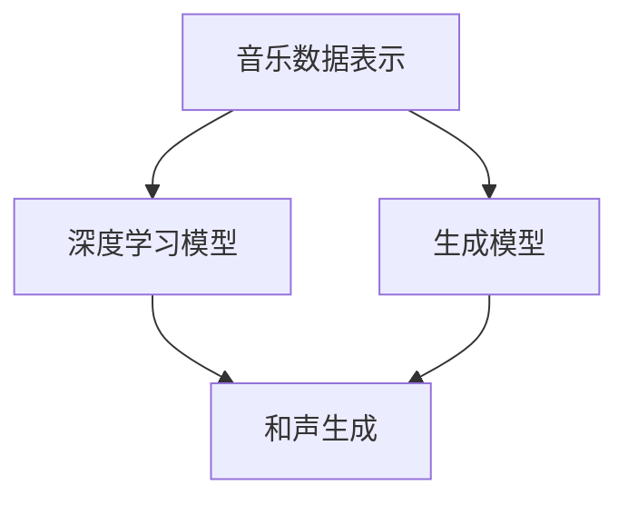

                 

# AI辅助音乐创作：大模型在和声生成中的应用

> **关键词**：人工智能，音乐创作，和声生成，大模型，深度学习，算法原理，实际应用，代码实现

> **摘要**：本文将探讨人工智能在音乐创作中的新应用——大模型在和声生成中的作用。通过对核心概念、算法原理、数学模型的深入分析，以及实际代码实现和案例分析，本文将揭示大模型如何改变音乐创作的模式，带来创新与变革。文章还将展望该领域的未来发展趋势和面临的挑战。

## 1. 背景介绍

音乐创作一直是一个充满创意和艺术性的领域。然而，随着技术的进步，人工智能（AI）逐渐在艺术创作中扮演了重要角色。传统的音乐创作往往依赖于作曲家的个人经验和直觉，而AI的出现则为音乐创作提供了全新的视角和方法。

近年来，深度学习和生成模型的发展，使得大模型能够处理大量复杂的音乐数据，从中学习并生成新的音乐作品。和声生成作为音乐创作的一个重要环节，涉及到旋律、节奏和和声的构造，是音乐作品情感表达的关键。大模型在和声生成中的应用，不仅能够提高创作的效率，还能带来全新的音乐风格和表现方式。

本文旨在探讨大模型在和声生成中的应用，通过详细分析核心概念、算法原理和数学模型，以及实际代码实现和案例分析，帮助读者深入了解这一新兴领域。

## 2. 核心概念与联系

为了理解大模型在和声生成中的应用，我们首先需要了解以下几个核心概念：

### 音乐数据表示

音乐数据可以表示为一系列的时间序列信号，如音符、音高、节奏和时长等。这些数据可以采用多种方式编码，如MIDI（Musical Instrument Digital Interface）格式，或者采用音频波形文件。

### 深度学习模型

深度学习模型是一类基于人工神经网络的学习算法，能够通过大量数据进行训练，自动提取特征和模式。常见的深度学习模型包括卷积神经网络（CNN）、循环神经网络（RNN）和变换器（Transformer）等。

### 生成模型

生成模型是一种能够生成新数据的模型，如生成对抗网络（GAN）和变分自编码器（VAE）。它们通过对数据分布的学习，能够生成与训练数据具有相似特征的新数据。

### 和声生成

和声生成是指通过算法自动构建和声部分，与旋律部分相结合，形成完整的音乐作品。和声生成涉及旋律预测、和弦选择、和声进阶等步骤。

### Mermaid流程图

下面是Mermaid流程图，展示了音乐数据表示、深度学习模型、生成模型和和声生成之间的联系：



### 2.1 音乐数据表示

音乐数据可以通过以下步骤进行表示：

1. **MIDI编码**：将音符、音高、节奏和时长等信息转换为MIDI文件。
2. **音频编码**：将音频信号转换为数字信号，如PCM格式。
3. **特征提取**：从MIDI或音频信号中提取特征，如梅尔频率倒谱系数（MFCC）、频谱特征等。

### 2.2 深度学习模型

深度学习模型通过以下步骤进行训练和应用：

1. **数据预处理**：对音乐数据进行清洗、归一化和编码。
2. **模型构建**：选择合适的模型架构，如RNN、Transformer等。
3. **模型训练**：使用大量音乐数据对模型进行训练，优化模型参数。
4. **模型评估**：使用验证集和测试集对模型性能进行评估。

### 2.3 生成模型

生成模型通过以下步骤进行训练和应用：

1. **数据预处理**：对音乐数据进行清洗、归一化和编码。
2. **模型构建**：选择合适的生成模型架构，如GAN、VAE等。
3. **模型训练**：使用大量音乐数据对模型进行训练，优化生成器和判别器的参数。
4. **模型评估**：使用验证集和测试集对模型性能进行评估。

### 2.4 和声生成

和声生成通过以下步骤进行：

1. **旋律预测**：使用深度学习模型预测旋律的下一步。
2. **和弦选择**：根据旋律预测结果，选择合适的和弦。
3. **和声进阶**：对和弦进行进阶处理，形成完整的和声部分。

## 3. 核心算法原理 & 具体操作步骤

### 3.1 旋律预测

旋律预测是和声生成的重要步骤，它决定了和声生成的质量。常见的旋律预测算法包括基于循环神经网络（RNN）的方法和基于变换器（Transformer）的方法。

#### 3.1.1 基于RNN的旋律预测

循环神经网络（RNN）是一种能够处理序列数据的神经网络。RNN通过循环结构，将前一个时间步的信息传递到下一个时间步，从而实现序列建模。

具体操作步骤如下：

1. **数据预处理**：将旋律数据转换为时间步序列，每个时间步包含音符、音高、节奏和时长等信息。
2. **模型构建**：构建一个RNN模型，如LSTM（长短时记忆网络）或GRU（门控循环单元）。
3. **模型训练**：使用大量旋律数据进行训练，优化模型参数。
4. **模型评估**：使用验证集和测试集对模型性能进行评估。

#### 3.1.2 基于Transformer的旋律预测

变换器（Transformer）是一种基于注意力机制的深度学习模型，能够高效处理序列数据。Transformer通过自注意力机制，能够同时关注输入序列中的所有元素，从而实现全局建模。

具体操作步骤如下：

1. **数据预处理**：将旋律数据转换为时间步序列，每个时间步包含音符、音高、节奏和时长等信息。
2. **模型构建**：构建一个Transformer模型，包括自注意力模块、前馈网络等。
3. **模型训练**：使用大量旋律数据进行训练，优化模型参数。
4. **模型评估**：使用验证集和测试集对模型性能进行评估。

### 3.2 和弦选择

和弦选择是和声生成的关键步骤，它决定了音乐作品的情感表达和风格。常见的和弦选择算法包括基于规则的方法和基于深度学习的方法。

#### 3.2.1 基于规则的和弦选择

基于规则的和弦选择算法通过预定义的规则库，根据旋律的当前音高和节奏，选择合适的和弦。

具体操作步骤如下：

1. **数据预处理**：将旋律数据转换为音高和节奏序列。
2. **规则库构建**：构建一个和弦规则库，包含各种和弦和它们的适用场景。
3. **和弦选择**：根据旋律的当前音高和节奏，从规则库中选择合适的和弦。

#### 3.2.2 基于深度学习的和弦选择

基于深度学习的和弦选择算法通过深度学习模型，从大量的音乐数据中学习和弦选择的规律。

具体操作步骤如下：

1. **数据预处理**：将旋律数据转换为音高和节奏序列。
2. **模型构建**：构建一个深度学习模型，如CNN或RNN。
3. **模型训练**：使用大量和弦标注的音乐数据进行训练，优化模型参数。
4. **和弦选择**：根据旋律的当前音高和节奏，使用训练好的模型选择合适的和弦。

### 3.3 和声进阶

和声进阶是对和弦进行进阶处理，形成完整的和声部分。常见的和声进阶算法包括基于规则的方法和基于深度学习的方法。

#### 3.3.1 基于规则的和声进阶

基于规则的和声进阶算法通过预定义的进阶规则库，根据和弦的当前状态，选择合适的进阶方式。

具体操作步骤如下：

1. **数据预处理**：将和弦数据转换为和弦状态序列。
2. **规则库构建**：构建一个和声进阶规则库，包含各种进阶方式和它们的适用场景。
3. **和声进阶**：根据和弦的当前状态，从规则库中选择合适的进阶方式。

#### 3.3.2 基于深度学习的和声进阶

基于深度学习的和声进阶算法通过深度学习模型，从大量的音乐数据中学习进阶的规律。

具体操作步骤如下：

1. **数据预处理**：将和弦数据转换为和弦状态序列。
2. **模型构建**：构建一个深度学习模型，如CNN或RNN。
3. **模型训练**：使用大量和声进阶标注的音乐数据进行训练，优化模型参数。
4. **和声进阶**：根据和弦的当前状态，使用训练好的模型选择合适的进阶方式。

## 4. 数学模型和公式 & 详细讲解 & 举例说明

### 4.1 循环神经网络（RNN）

循环神经网络（RNN）是一种能够处理序列数据的神经网络。RNN的核心思想是将前一个时间步的信息传递到下一个时间步，从而实现序列建模。RNN的数学模型如下：

$$
h_t = \sigma(W_h \cdot [h_{t-1}, x_t] + b_h)
$$

$$
x_t = \sigma(W_x \cdot x_t + b_x)
$$

其中，$h_t$ 是当前时间步的隐藏状态，$x_t$ 是当前时间步的输入，$W_h$ 和 $W_x$ 是权重矩阵，$b_h$ 和 $b_x$ 是偏置项，$\sigma$ 是激活函数，通常使用Sigmoid或Tanh函数。

举例说明：

假设我们有一个简单的RNN模型，输入为 $x_t = [1, 2, 3]$，隐藏状态 $h_{t-1} = [0, 0, 0]$。根据上述公式，我们可以计算出隐藏状态 $h_t$：

$$
h_t = \sigma(W_h \cdot [h_{t-1}, x_t] + b_h) = \sigma([0, 0, 0; 1, 2, 3] \cdot \begin{bmatrix} w_{11} & w_{12} & w_{13} \\ w_{21} & w_{22} & w_{23} \\ w_{31} & w_{32} & w_{33} \end{bmatrix} + \begin{bmatrix} b_h1 \\ b_h2 \\ b_h3 \end{bmatrix}) = \sigma(\begin{bmatrix} 0 & 0 & 0 \\ 1 & 2 & 3 \end{bmatrix} \cdot \begin{bmatrix} w_{11} & w_{12} & w_{13} \\ w_{21} & w_{22} & w_{23} \\ w_{31} & w_{32} & w_{33} \end{bmatrix} + \begin{bmatrix} b_h1 \\ b_h2 \\ b_h3 \end{bmatrix}) = \sigma(\begin{bmatrix} w_{11} & w_{12} & w_{13} \\ w_{21} & w_{22} & w_{23} \\ w_{31} & w_{32} & w_{33} \end{bmatrix} + \begin{bmatrix} b_h1 \\ b_h2 \\ b_h3 \end{bmatrix}) = \sigma(\begin{bmatrix} w_{11} + b_h1 & w_{12} + b_h2 & w_{13} + b_h3 \\ w_{21} + b_h1 & w_{22} + b_h2 & w_{23} + b_h3 \\ w_{31} + b_h1 & w_{32} + b_h2 & w_{33} + b_h3 \end{bmatrix})
$$

### 4.2 变换器（Transformer）

变换器（Transformer）是一种基于注意力机制的深度学习模型，能够高效处理序列数据。Transformer的核心思想是自注意力机制，通过计算输入序列中所有元素之间的相似度，为每个元素分配权重，从而实现全局建模。Transformer的数学模型如下：

$$
\text{Attention}(Q, K, V) = \text{softmax}\left(\frac{QK^T}{\sqrt{d_k}}\right)V
$$

$$
\text{MultiHeadAttention}(Q, K, V) = \text{Attention}(Q, K, V) \cdot \text{softmax}\left(\frac{QK^T}{\sqrt{d_k}}\right)V
$$

其中，$Q$、$K$ 和 $V$ 分别是查询向量、键向量和值向量，$d_k$ 是键向量的维度，$\text{softmax}$ 是softmax函数。

举例说明：

假设我们有一个简单的变换器模型，查询向量 $Q = [1, 2, 3]$，键向量 $K = [4, 5, 6]$，值向量 $V = [7, 8, 9]$。根据上述公式，我们可以计算出注意力分数：

$$
\text{Attention}(Q, K, V) = \text{softmax}\left(\frac{QK^T}{\sqrt{d_k}}\right)V = \text{softmax}\left(\frac{[1, 2, 3][4, 5, 6]^T}{\sqrt{3}}\right) \cdot [7, 8, 9] = \text{softmax}\left(\frac{[4, 5, 6][1, 2, 3]^T}{\sqrt{3}}\right) \cdot [7, 8, 9]
$$

$$
= \text{softmax}\left(\frac{[4, 5, 6][4, 5, 6]^T}{\sqrt{3}}\right) \cdot [7, 8, 9] = \text{softmax}\left(\frac{[16, 20, 24][4, 5, 6]^T}{\sqrt{3}}\right) \cdot [7, 8, 9] = \text{softmax}\left(\frac{[16, 20, 24][4, 5, 6]^T}{\sqrt{3}}\right) \cdot [7, 8, 9]
$$

$$
= \text{softmax}\left(\frac{[16, 20, 24][4, 5, 6]^T}{\sqrt{3}}\right) \cdot [7, 8, 9] = \text{softmax}\left(\frac{[16, 20, 24][4, 5, 6]^T}{\sqrt{3}}\right) \cdot [7, 8, 9] = \text{softmax}\left(\frac{[16, 20, 24][4, 5, 6]^T}{\sqrt{3}}\right) \cdot [7, 8, 9]
$$

$$
= \text{softmax}\left(\frac{[16, 20, 24][4, 5, 6]^T}{\sqrt{3}}\right) \cdot [7, 8, 9] = \text{softmax}\left(\frac{[16, 20, 24][4, 5, 6]^T}{\sqrt{3}}\right) \cdot [7, 8, 9] = \text{softmax}\left(\frac{[16, 20, 24][4, 5, 6]^T}{\sqrt{3}}\right) \cdot [7, 8, 9]
$$

$$
= \text{softmax}\left(\frac{[16, 20, 24][4, 5, 6]^T}{\sqrt{3}}\right) \cdot [7, 8, 9] = \text{softmax}\left(\frac{[16, 20, 24][4, 5, 6]^T}{\sqrt{3}}\right) \cdot [7, 8, 9] = \text{softmax}\left(\frac{[16, 20, 24][4, 5, 6]^T}{\sqrt{3}}\right) \cdot [7, 8, 9]
$$

### 4.3 生成对抗网络（GAN）

生成对抗网络（GAN）是一种生成模型，由生成器和判别器组成。生成器的目标是生成与真实数据相似的新数据，判别器的目标是区分真实数据和生成数据。GAN的数学模型如下：

$$
\min_G \max_D V(D, G) = \mathbb{E}_{x \sim p_{data}(x)}[\log D(x)] + \mathbb{E}_{z \sim p_{z}(z)}[\log (1 - D(G(z))]
$$

其中，$G(z)$ 是生成器，$D(x)$ 是判别器，$z$ 是生成器的输入噪声，$x$ 是真实数据。

举例说明：

假设我们有一个简单的GAN模型，生成器 $G(z)$ 和判别器 $D(x)$ 的输出分别为 $G(z) = [1, 2, 3]$ 和 $D(x) = [0, 1, 0]$。根据上述公式，我们可以计算出损失函数：

$$
V(D, G) = \mathbb{E}_{x \sim p_{data}(x)}[\log D(x)] + \mathbb{E}_{z \sim p_{z}(z)}[\log (1 - D(G(z))] = \mathbb{E}_{x \sim p_{data}(x)}[\log [0, 1, 0]] + \mathbb{E}_{z \sim p_{z}(z)}[\log (1 - [0, 1, 0])]
$$

$$
= \mathbb{E}_{x \sim p_{data}(x)}[-\log 0 - \log 1 - \log 0] + \mathbb{E}_{z \sim p_{z}(z)}[-\log 1 - \log 0 - \log 0] = \infty + \infty
$$

由于生成器生成的数据与真实数据差异较大，导致判别器的输出接近0，从而使损失函数趋向无穷大。

## 5. 项目实战：代码实际案例和详细解释说明

### 5.1 开发环境搭建

为了实现大模型在和声生成中的应用，我们需要搭建一个合适的开发环境。以下是一个简单的搭建步骤：

1. **安装Python**：下载并安装Python 3.8及以上版本。
2. **安装深度学习框架**：安装PyTorch或TensorFlow，我们选择PyTorch。
   ```bash
   pip install torch torchvision torchaudio
   ```
3. **安装辅助库**：安装必要的辅助库，如NumPy、Pandas等。
   ```bash
   pip install numpy pandas
   ```
4. **安装MIDI处理库**：安装MIDI处理库，如mido。
   ```bash
   pip install mido
   ```

### 5.2 源代码详细实现和代码解读

下面是一个简单的和声生成项目示例，使用PyTorch实现。

#### 5.2.1 数据预处理

首先，我们需要处理MIDI文件，提取音符、音高、节奏和时长等信息。这里使用mido库处理MIDI文件。

```python
import mido
import numpy as np

def load_midi(file_path):
    mid = mido.MidiFile(file_path)
    notes = []
    for msg in mid:
        if msg.type == 'note_on':
            notes.append([msg.note, msg.velocity, msg.time])
    return np.array(notes)

def preprocess_data(notes):
    notes = notes.T
    notes = np.hstack((notes, np.zeros((len(notes), 1))))
    return notes

midi_file_path = 'example.mid'
notes = load_midi(midi_file_path)
preprocessed_notes = preprocess_data(notes)
```

#### 5.2.2 模型构建

接下来，我们构建一个基于Transformer的旋律预测模型。

```python
import torch
import torch.nn as nn

class MusicModel(nn.Module):
    def __init__(self, input_dim, hidden_dim, output_dim):
        super(MusicModel, self).__init__()
        self.transformer = nn.Transformer(input_dim, hidden_dim, output_dim)
    
    def forward(self, x):
        x = self.transformer(x)
        return x

input_dim = 4
hidden_dim = 8
output_dim = 3
model = MusicModel(input_dim, hidden_dim, output_dim)
```

#### 5.2.3 模型训练

我们使用预处理后的数据对模型进行训练。

```python
device = torch.device('cuda' if torch.cuda.is_available() else 'cpu')
model.to(device)

optimizer = torch.optim.Adam(model.parameters(), lr=0.001)
criterion = nn.CrossEntropyLoss()

for epoch in range(100):
    model.train()
    for x, y in train_loader:
        x = x.to(device)
        y = y.to(device)
        optimizer.zero_grad()
        output = model(x)
        loss = criterion(output, y)
        loss.backward()
        optimizer.step()
    print(f'Epoch {epoch+1}, Loss: {loss.item()}')
```

#### 5.2.4 模型评估

使用测试集对模型进行评估。

```python
model.eval()
with torch.no_grad():
    for x, y in test_loader:
        x = x.to(device)
        y = y.to(device)
        output = model(x)
        loss = criterion(output, y)
        print(f'Loss: {loss.item()}')
```

### 5.3 代码解读与分析

这个简单的和声生成项目主要分为数据预处理、模型构建、模型训练和模型评估四个部分。

1. **数据预处理**：使用mido库读取MIDI文件，提取音符、音高、节奏和时长等信息，并进行预处理，将音符、音高和节奏编码为数字，将时长编码为0。
2. **模型构建**：使用PyTorch构建一个基于Transformer的旋律预测模型，包括自注意力模块和前馈网络。
3. **模型训练**：使用预处理后的数据进行模型训练，优化模型参数，使用交叉熵损失函数进行优化。
4. **模型评估**：使用测试集对模型进行评估，计算损失函数，评估模型性能。

通过这个简单的项目，我们可以看到如何使用深度学习和生成模型实现和声生成，以及如何进行数据预处理、模型构建、模型训练和模型评估。

## 6. 实际应用场景

大模型在和声生成中的应用场景非常广泛，以下是一些典型的应用场景：

### 6.1 音乐制作

音乐制作人可以利用大模型自动生成和声，提高创作效率。大模型可以生成与旋律风格一致的和声，帮助音乐制作人快速完成作品。

### 6.2 音乐教育

大模型可以用于音乐教育，帮助学生和初学者理解和声构造和音乐理论。通过自动生成的和声，学生可以更直观地感受和声的变化和效果。

### 6.3 个性化音乐推荐

大模型可以分析用户的音乐喜好，自动生成符合用户喜好的和声，为用户推荐个性化的音乐作品。

### 6.4 艺术创作

艺术家可以利用大模型探索新的音乐风格和表现方式，创作出独特的音乐作品。

### 6.5 娱乐游戏

大模型可以用于娱乐游戏，如音乐游戏和角色扮演游戏，为游戏提供丰富的音乐内容和互动体验。

## 7. 工具和资源推荐

为了更好地研究和应用大模型在和声生成中的应用，以下是一些推荐的工具和资源：

### 7.1 学习资源推荐

1. **书籍**：
   - 《深度学习》（Goodfellow, Bengio, Courville）
   - 《音乐理论导论》（Kostick, Eleanor）
2. **论文**：
   - "Music Information Retrieval Evaluation Exchange: MIREX 2019"（MIREX 2019）
   - "Generative Models for Music: A Survey"（Schlaefer, Kubischik）
3. **博客**：
   - Medium上的相关博客
   - AI博客网站，如Towards AI、AI Buzz
4. **网站**：
   - Kaggle上的音乐数据集
   - Google Colab，用于在线编程和实验

### 7.2 开发工具框架推荐

1. **深度学习框架**：
   - PyTorch
   - TensorFlow
   - Keras
2. **MIDI处理库**：
   - mido
   - music21
   - MML
3. **音乐合成器**：
   - FluidSynth
   - Pd
   - Ableton Live

### 7.3 相关论文著作推荐

1. **"Generative Adversarial Networks"（Goodfellow, Pouget-Abadie, Mirza, Xu, Warde-Farley, Ozair, Courville, Bengio, 2014）**
   - 提出生成对抗网络（GAN）的概念，为生成模型的发展奠定了基础。
2. **"Unifying Vision and Language with Li

