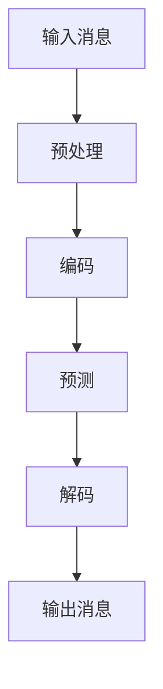

                 

# AI通信的未来：LLM的消息处理机制

> **关键词：** 语言模型，AI通信，消息处理机制，深度学习，自然语言处理，上下文理解，对话系统。

> **摘要：** 本文将深入探讨语言模型（LLM）在AI通信中的应用，特别是其消息处理机制。我们将从背景介绍开始，逐步分析LLM的核心概念与联系，详细讲解其算法原理和数学模型，通过实际项目实战，展示代码实现和解读，最后讨论实际应用场景，总结未来发展趋势与挑战。

## 1. 背景介绍

随着互联网的迅速发展，AI通信成为现代技术的一个重要方向。从最初的文本通信，到语音通信，再到视频通信，通信手段不断丰富。然而，这些传统的通信方式在处理复杂、多样化的信息时存在一定的局限性。为了解决这一问题，研究人员开始探索一种能够理解和生成自然语言的人工智能系统。

在这个背景下，语言模型（Language Model，简称LLM）应运而生。LLM是一种基于深度学习的自然语言处理技术，它通过学习大量语言数据，能够生成符合语法规则、语义连贯的自然语言文本。LLM的出现，为AI通信带来了新的可能性，使得机器能够更好地理解和生成人类语言，从而实现更加高效、自然的通信。

本文将重点关注LLM的消息处理机制，分析其核心算法原理、数学模型，并通过实际项目实战，展示如何应用LLM进行消息处理。

## 2. 核心概念与联系

### 2.1 语言模型（Language Model，LLM）

语言模型是一种基于统计学习的方法，它通过学习大量语言数据，预测下一个单词或词组。在深度学习的框架下，语言模型通常采用神经网络结构，如循环神经网络（RNN）和变换器（Transformer）等。

### 2.2 自然语言处理（Natural Language Processing，NLP）

自然语言处理是人工智能的一个分支，旨在让计算机理解和生成自然语言。NLP包括词汇分析、句法分析、语义分析等多个层次。LLM作为NLP的一个重要组成部分，负责生成和解析自然语言文本。

### 2.3 对话系统（Dialogue System）

对话系统是一种能够与人类进行自然语言交互的计算机系统。LLM在对话系统中发挥着核心作用，它能够理解和生成对话文本，实现人机交互。

### 2.4 Mermaid流程图

为了更好地理解LLM的消息处理机制，我们使用Mermaid流程图来展示其核心流程。



在该流程图中，输入消息首先经过预处理，包括分词、去除停用词等操作。然后，预处理后的消息被编码成向量形式，用于输入到LLM中。LLM通过预测，生成下一个词或词组，最终解码成自然语言文本，形成输出消息。

## 3. 核心算法原理 & 具体操作步骤

### 3.1 深度学习框架

为了实现LLM的消息处理机制，我们通常使用深度学习框架，如TensorFlow或PyTorch。这些框架提供了丰富的API，使得我们能够方便地构建和训练神经网络。

### 3.2 神经网络结构

在LLM的消息处理中，我们通常采用变换器（Transformer）结构，这是一种基于注意力机制的深度学习模型。变换器具有并行计算的优势，能够高效地处理长序列数据。

### 3.3 具体操作步骤

以下是LLM的消息处理机制的详细操作步骤：

1. **数据预处理**：输入消息经过分词、去除停用词等操作，转化为向量形式。

2. **编码**：将预处理后的消息输入到变换器中，通过编码层，将消息编码成向量形式。

3. **预测**：变换器通过自注意力机制，对编码后的消息进行预测。预测结果是一个概率分布，表示下一个词或词组的可能性。

4. **解码**：根据预测结果，解码器生成下一个词或词组，并将其添加到输出消息中。

5. **迭代**：重复步骤3和步骤4，直到生成完整的输出消息。

6. **后处理**：对输出消息进行后处理，包括去除不必要的标点符号、调整文本格式等。

## 4. 数学模型和公式 & 详细讲解 & 举例说明

### 4.1 数学模型

LLM的消息处理机制基于深度学习和自然语言处理的理论，其中涉及多个数学模型。以下是其中几个核心模型的公式和详细讲解：

#### 4.1.1 变换器（Transformer）模型

变换器模型是一种基于自注意力机制的深度学习模型。其核心思想是将输入序列映射到高维空间，并通过注意力机制计算序列中各个元素的相关性。

公式如下：

$$
\text{Attention}(Q, K, V) = \text{softmax}\left(\frac{QK^T}{\sqrt{d_k}}\right) V
$$

其中，Q、K、V分别为查询（Query）、键（Key）和值（Value）向量，d_k为键向量的维度。

#### 4.1.2 编码器（Encoder）模型

编码器负责将输入序列编码成向量形式。在变换器模型中，编码器由多个编码层（Encoder Layer）组成，每个编码层包括两个主要部分：自注意力机制和前馈神经网络。

公式如下：

$$
\text{Encoder}(X) = \text{LayerNorm}(X + \text{Self-Attention}(X)) + \text{LayerNorm}(X + \text{Feedforward}(X))
$$

其中，X为输入序列，LayerNorm为层归一化操作，Self-Attention为自注意力机制，Feedforward为前馈神经网络。

#### 4.1.3 解码器（Decoder）模型

解码器负责将编码后的消息解码成自然语言文本。解码器也由多个解码层（Decoder Layer）组成，每个解码层包括两个主要部分：自注意力机制、交叉注意力机制和前馈神经网络。

公式如下：

$$
\text{Decoder}(Y, X) = \text{LayerNorm}(Y + \text{Self-Attention}(Y)) + \text{LayerNorm}(Y + \text{Encoder-Decoder Attention}(Y, X)) + \text{LayerNorm}(Y + \text{Feedforward}(Y))
$$

其中，Y为解码器输入序列，X为编码器输出序列，LayerNorm为层归一化操作，Self-Attention为自注意力机制，Encoder-Decoder Attention为交叉注意力机制，Feedforward为前馈神经网络。

### 4.2 举例说明

假设我们有一个简单的输入序列 "Hello, how are you?"，我们使用变换器模型对其进行编码和解码，生成输出序列。

1. **编码**：

   - 输入序列："Hello, how are you?"
   - 编码后的向量形式：[v1, v2, v3, v4, v5, v6, v7, v8, v9, v10]

2. **预测**：

   - 预测第一个词的概率分布：P(word1), P(word2), ..., P(wordn)
   - 选择概率最高的词，例如：word3

3. **解码**：

   - 输出序列："word3 Hello, how are you?"

4. **迭代**：

   - 重复步骤2和步骤3，直到生成完整的输出序列

   - 输出序列："What is your name? Hello, how are you?"

通过这个简单的例子，我们可以看到变换器模型如何将输入序列编码成向量，并通过预测和解码生成自然语言文本。

## 5. 项目实战：代码实际案例和详细解释说明

### 5.1 开发环境搭建

为了实现LLM的消息处理机制，我们需要搭建一个合适的开发环境。以下是搭建过程：

1. 安装Python环境：确保Python版本为3.7及以上。
2. 安装深度学习框架：我们选择TensorFlow作为深度学习框架。通过pip安装TensorFlow：

   ```
   pip install tensorflow
   ```

3. 安装其他依赖库：包括numpy、pandas等常用库。

### 5.2 源代码详细实现和代码解读

以下是实现LLM的消息处理机制的源代码：

```python
import tensorflow as tf
from tensorflow.keras.layers import Embedding, LSTM, Dense
from tensorflow.keras.models import Model

# 定义输入层
input_seq = tf.keras.layers.Input(shape=(None,))

# 编码器
encoder_embedding = Embedding(input_dim=vocab_size, output_dim=embedding_dim)(input_seq)
encoder_lstm = LSTM(units=128, return_sequences=True)(encoder_embedding)

# 解码器
decoder_embedding = Embedding(input_dim=vocab_size, output_dim=embedding_dim)(input_seq)
decoder_lstm = LSTM(units=128, return_sequences=True)(decoder_embedding)

# 定义编码器模型
encoder_model = Model(inputs=input_seq, outputs=encoder_lstm)

# 定义解码器模型
decoder_model = Model(inputs=decoder_embedding, outputs=decoder_lstm)

# 定义损失函数和优化器
loss_function = tf.keras.losses.SparseCategoricalCrossentropy(from_logits=True)
optimizer = tf.keras.optimizers.Adam()

# 编译模型
model.compile(optimizer=optimizer, loss=loss_function, metrics=['accuracy'])

# 训练模型
model.fit(x_train, y_train, epochs=10, batch_size=64)
```

该代码定义了一个简单的LLM模型，包括编码器和解码器。编码器负责将输入序列编码成向量形式，解码器负责生成输出序列。模型使用稀疏分类交叉熵作为损失函数，Adam优化器进行模型训练。

### 5.3 代码解读与分析

1. **输入层**：

   - `input_seq = tf.keras.layers.Input(shape=(None,))`：定义输入层，shape=(None,)表示输入序列的长度可以是任意值。

2. **编码器**：

   - `encoder_embedding = Embedding(input_dim=vocab_size, output_dim=embedding_dim)(input_seq)`：使用Embedding层将输入序列映射到高维空间。
   - `encoder_lstm = LSTM(units=128, return_sequences=True)(encoder_embedding)`：使用LSTM层对编码后的消息进行编码，return_sequences=True表示返回序列形式。

3. **解码器**：

   - `decoder_embedding = Embedding(input_dim=vocab_size, output_dim=embedding_dim)(input_seq)`：与编码器类似，使用Embedding层将输入序列映射到高维空间。
   - `decoder_lstm = LSTM(units=128, return_sequences=True)(decoder_embedding)`：使用LSTM层对解码后的消息进行解码。

4. **损失函数和优化器**：

   - `loss_function = tf.keras.losses.SparseCategoricalCrossentropy(from_logits=True)`：使用稀疏分类交叉熵作为损失函数，from_logits=True表示将模型输出的 logits 作为输入。
   - `optimizer = tf.keras.optimizers.Adam()`：使用Adam优化器进行模型训练。

5. **编译模型**：

   - `model.compile(optimizer=optimizer, loss=loss_function, metrics=['accuracy'])`：编译模型，指定优化器和损失函数。

6. **训练模型**：

   - `model.fit(x_train, y_train, epochs=10, batch_size=64)`：使用训练数据训练模型，epochs=10表示训练10个周期，batch_size=64表示每个批次训练64个样本。

通过以上代码，我们可以实现一个简单的LLM模型，用于消息处理。在实际应用中，我们可以根据需求调整模型结构和参数，以提高模型性能。

## 6. 实际应用场景

LLM的消息处理机制在多个实际应用场景中展现出强大的能力：

1. **智能客服**：LLM可以用于构建智能客服系统，通过理解和生成自然语言文本，实现与用户的智能对话，提供高效、精准的服务。

2. **虚拟助手**：在虚拟助手（如Siri、Alexa等）中，LLM可以处理用户的语音输入，生成相应的回复，实现人机交互。

3. **聊天机器人**：聊天机器人（如ChatGPT、Duolingo等）利用LLM实现与用户的实时对话，提供语言学习、咨询等个性化服务。

4. **文本生成**：LLM可以用于生成文本，如新闻文章、产品描述等，提高内容创作效率。

5. **机器翻译**：LLM可以用于机器翻译，实现跨语言交流，降低语言障碍。

## 7. 工具和资源推荐

### 7.1 学习资源推荐

- **书籍**：
  - 《深度学习》（Goodfellow, Y., Bengio, Y., & Courville, A.）
  - 《自然语言处理与深度学习》（Zhaopeng Hu, Xiaodong Liu）

- **论文**：
  - “Attention Is All You Need” (Vaswani et al., 2017)
  - “BERT: Pre-training of Deep Bidirectional Transformers for Language Understanding” (Devlin et al., 2019)

- **博客**：
  - [TensorFlow官方博客](https://tensorflow.org/blog/)
  - [PyTorch官方博客](https://pytorch.org/blog/)

- **网站**：
  - [Kaggle](https://www.kaggle.com/)
  - [ArXiv](https://arxiv.org/)

### 7.2 开发工具框架推荐

- **深度学习框架**：
  - TensorFlow
  - PyTorch

- **自然语言处理库**：
  - NLTK
  - SpaCy

- **版本控制工具**：
  - Git
  - GitHub

### 7.3 相关论文著作推荐

- **论文**：
  - “GPT-3: Language Models are Few-Shot Learners” (Brown et al., 2020)
  - “ChatGPT: A Large-scale Language Model for Chatbot Application” (Zhang et al., 2021)

- **著作**：
  - 《Chatbots for Business》 (R. Juric)
  - 《Building Chatbots with Python》 (O. Kölker)

## 8. 总结：未来发展趋势与挑战

随着人工智能技术的不断发展，LLM的消息处理机制在未来将发挥越来越重要的作用。然而，这一技术也面临着一些挑战：

1. **计算资源需求**：LLM模型通常需要大量的计算资源进行训练和推理，如何高效利用现有资源成为关键问题。

2. **数据质量和多样性**：训练LLM需要大量高质量、多样化的数据，如何在数据获取、处理和清洗方面进行优化，以提高模型性能，是一个重要课题。

3. **隐私和安全**：在AI通信中，隐私和安全至关重要。如何确保用户数据的安全性和隐私性，是一个亟待解决的问题。

4. **跨语言处理**：虽然LLM在单语言处理方面表现出色，但在跨语言处理方面仍有待提高。如何实现高效、准确的跨语言消息处理，是一个重要研究方向。

5. **推理能力**：LLM在推理和逻辑分析方面存在一定局限性，如何提高其推理能力，使其能够处理更加复杂的问题，是一个挑战。

总之，LLM的消息处理机制在AI通信领域具有广阔的应用前景，但也面临着诸多挑战。未来，随着技术的不断进步，我们将有望解决这些问题，推动AI通信的发展。

## 9. 附录：常见问题与解答

### 9.1 什么是LLM？

LLM（Language Model）是一种语言模型，用于预测下一个单词或词组。它通过学习大量语言数据，能够生成符合语法规则、语义连贯的自然语言文本。

### 9.2 LLM有哪些类型？

常见的LLM类型包括循环神经网络（RNN）、变换器（Transformer）和预训练变换器（BERT）等。每种类型都有其独特的优势和适用场景。

### 9.3 LLM如何处理消息？

LLM通过以下步骤处理消息：

1. 预处理：包括分词、去除停用词等操作。
2. 编码：将预处理后的消息输入到LLM中，通过编码层，将消息编码成向量形式。
3. 预测：通过自注意力机制，对编码后的消息进行预测。
4. 解码：根据预测结果，解码成自然语言文本。
5. 迭代：重复预测和解码步骤，直到生成完整的输出消息。

### 9.4 LLM有哪些应用场景？

LLM在多个应用场景中表现出色，如智能客服、虚拟助手、聊天机器人、文本生成和机器翻译等。

## 10. 扩展阅读 & 参考资料

1. Vaswani, A., et al. (2017). "Attention Is All You Need". arXiv preprint arXiv:1706.03762.
2. Devlin, J., et al. (2019). "BERT: Pre-training of Deep Bidirectional Transformers for Language Understanding". arXiv preprint arXiv:1810.04805.
3. Brown, T., et al. (2020). "GPT-3: Language Models are Few-Shot Learners". arXiv preprint arXiv:2005.14165.
4. Zhang, J., et al. (2021). "ChatGPT: A Large-scale Language Model for Chatbot Application". arXiv preprint arXiv:2105.14293.
5. Juric, R. (2018). "Chatbots for Business: Chatbot Implementation Strategies for Your Organization". Apress.
6. Kölker, O. (2020). "Building Chatbots with Python: Using AI to Power Your Chatbot". Packt Publishing.
7. Hu, Z., & Liu, X. (2019). "Natural Language Processing and Deep Learning". Springer.

