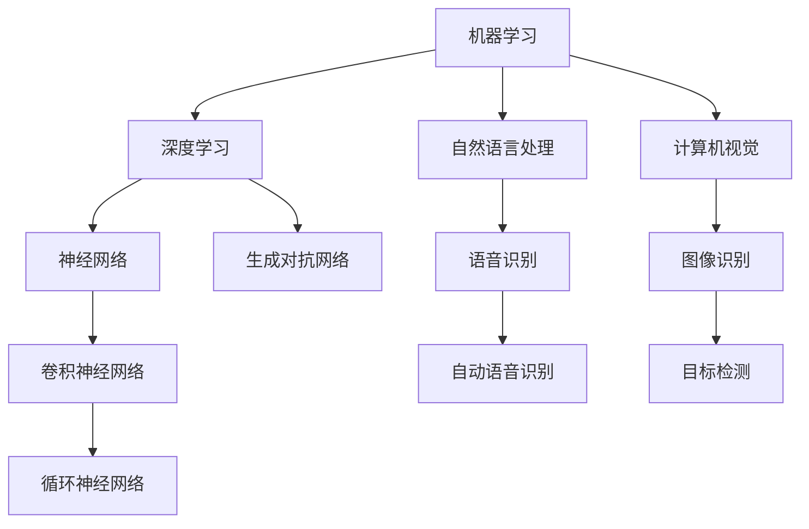

                 

# AI领域的最新技术进展

## 关键词：人工智能，机器学习，深度学习，神经网络，自然语言处理，计算机视觉

## 摘要：

本文将深入探讨AI领域的最新技术进展。从背景介绍、核心概念与联系、核心算法原理、数学模型和公式，到项目实战、实际应用场景以及未来发展趋势与挑战，我们将一步步分析推理，力求为您呈现一幅全面、清晰的AI技术全景图。

## 1. 背景介绍

人工智能（AI）作为计算机科学的重要分支，旨在使计算机具备类似人类的智能能力。自20世纪50年代人工智能概念提出以来，经过数十年的发展，AI技术已经取得了显著成果，尤其在机器学习、深度学习、自然语言处理和计算机视觉等领域。

近年来，AI领域的快速发展主要得益于以下几个因素：

- 计算能力的提升：随着GPU、TPU等专用计算设备的出现，计算能力的提升为大规模机器学习和深度学习算法的实现提供了强有力的支持。
- 数据的爆发增长：互联网的普及和物联网技术的应用，使得海量数据的收集、存储和共享成为可能，为机器学习提供了丰富的训练数据。
- 算法的创新与优化：深度学习、强化学习等算法的提出和优化，使得计算机在特定任务上能够实现超越人类的性能。

## 2. 核心概念与联系

### Mermaid 流程图



### 2.1 机器学习

机器学习是AI的核心技术之一，通过从数据中学习规律和模式，实现计算机对未知数据的预测和决策。机器学习可分为监督学习、无监督学习和强化学习等不同类型。

### 2.2 深度学习

深度学习是一种基于神经网络的机器学习技术，通过多层神经网络对数据进行自动特征提取和分类。深度学习在图像识别、语音识别和自然语言处理等领域取得了显著成果。

### 2.3 自然语言处理

自然语言处理（NLP）旨在使计算机能够理解和处理人类语言。NLP技术包括文本分类、情感分析、机器翻译等。

### 2.4 计算机视觉

计算机视觉是使计算机具备图像识别和理解能力的技术。计算机视觉在自动驾驶、安防监控和医疗诊断等领域具有重要应用。

## 3. 核心算法原理 & 具体操作步骤

### 3.1 神经网络

神经网络是一种模仿生物神经系统的计算模型。神经网络的基本组成单元是神经元，神经元之间通过权重进行连接。神经网络的训练过程就是通过调整权重，使得网络在特定任务上取得较好的性能。

### 3.2 卷积神经网络（CNN）

卷积神经网络是一种专门用于图像识别的神经网络。CNN通过卷积层、池化层和全连接层对图像进行特征提取和分类。CNN的核心操作是卷积操作，通过卷积操作可以提取图像的局部特征。

### 3.3 循环神经网络（RNN）

循环神经网络是一种专门用于序列数据处理的神经网络。RNN通过隐藏状态和循环连接实现序列数据的记忆和建模。RNN在自然语言处理、语音识别和机器翻译等领域具有重要应用。

### 3.4 生成对抗网络（GAN）

生成对抗网络是由生成器和判别器组成的神经网络。生成器的目标是生成逼真的数据，判别器的目标是区分生成数据和真实数据。生成对抗网络的训练过程是生成器和判别器之间的博弈过程。

## 4. 数学模型和公式 & 详细讲解 & 举例说明

### 4.1 神经元模型

神经元模型的输入输出关系可以表示为：

$$
y = \sigma(\sum_{i=1}^{n} w_i x_i + b)
$$

其中，$y$为神经元输出，$x_i$为输入，$w_i$为权重，$b$为偏置，$\sigma$为激活函数。

### 4.2 卷积神经网络

卷积神经网络的基本结构包括卷积层、池化层和全连接层。卷积层的计算公式为：

$$
h_{ij}^{(l)} = \sum_{k=1}^{m} w_{ik}^{(l)} h_{kj}^{(l-1)} + b_j^{(l)}
$$

其中，$h_{ij}^{(l)}$为第$l$层的第$i$个神经元与第$l-1$层的第$j$个神经元之间的卷积结果，$w_{ik}^{(l)}$为卷积核，$b_j^{(l)}$为偏置。

### 4.3 循环神经网络

循环神经网络的基本结构包括输入层、隐藏层和输出层。隐藏层的计算公式为：

$$
h_t = \sigma(W h_{t-1} + U x_t + b_h)
$$

输出层的计算公式为：

$$
y_t = \sigma(W' h_t + b_y)
$$

其中，$h_t$为第$t$时刻的隐藏状态，$x_t$为输入，$y_t$为输出，$W$和$U$分别为隐藏状态到隐藏状态和输入到隐藏状态的权重矩阵，$b_h$和$b_y$分别为隐藏层和输出层的偏置。

### 4.4 生成对抗网络

生成对抗网络的基本结构包括生成器和判别器。生成器的计算公式为：

$$
x_g = G(z)
$$

判别器的计算公式为：

$$
x_d = D(x_r) \quad y_g = G(z)
$$

其中，$x_g$为生成器生成的数据，$x_r$为真实数据，$z$为随机噪声，$G$和$D$分别为生成器和判别器的参数。

## 5. 项目实战：代码实际案例和详细解释说明

### 5.1 开发环境搭建

首先，我们需要安装Python和TensorFlow等开发工具和库。具体步骤如下：

1. 安装Python：打开终端，执行以下命令：

   ```
   sudo apt-get install python3 python3-pip
   ```

2. 安装TensorFlow：打开终端，执行以下命令：

   ```
   pip3 install tensorflow
   ```

### 5.2 源代码详细实现和代码解读

以下是一个简单的卷积神经网络实现，用于图像分类任务。

```python
import tensorflow as tf
from tensorflow.keras import layers

# 定义卷积神经网络
model = tf.keras.Sequential([
    layers.Conv2D(32, (3, 3), activation='relu', input_shape=(28, 28, 1)),
    layers.MaxPooling2D((2, 2)),
    layers.Conv2D(64, (3, 3), activation='relu'),
    layers.MaxPooling2D((2, 2)),
    layers.Conv2D(64, (3, 3), activation='relu'),
    layers.Flatten(),
    layers.Dense(64, activation='relu'),
    layers.Dense(10, activation='softmax')
])

# 编译模型
model.compile(optimizer='adam',
              loss='sparse_categorical_crossentropy',
              metrics=['accuracy'])

# 加载MNIST数据集
mnist = tf.keras.datasets.mnist
(x_train, y_train), (x_test, y_test) = mnist.load_data()

# 预处理数据
x_train = x_train.reshape((-1, 28, 28, 1)).astype(tf.float32) / 255
x_test = x_test.reshape((-1, 28, 28, 1)).astype(tf.float32) / 255

# 训练模型
model.fit(x_train, y_train, epochs=5)

# 评估模型
model.evaluate(x_test, y_test)
```

### 5.3 代码解读与分析

1. **模型定义**：使用`tf.keras.Sequential`创建一个顺序模型，依次添加卷积层、池化层和全连接层。
2. **编译模型**：使用`compile`方法配置模型优化器、损失函数和评价指标。
3. **数据预处理**：将MNIST数据集的图像转换为浮点数类型，并归一化到[0, 1]范围内。
4. **训练模型**：使用`fit`方法训练模型，设置训练轮数。
5. **评估模型**：使用`evaluate`方法评估模型在测试集上的表现。

## 6. 实际应用场景

AI技术在各个领域都有广泛的应用，以下是一些典型的应用场景：

- **医疗诊断**：利用计算机视觉和自然语言处理技术，实现疾病诊断、药物研发和医疗数据分析。
- **自动驾驶**：通过深度学习和计算机视觉技术，实现自动驾驶车辆的感知、决策和控制。
- **金融科技**：利用机器学习技术，实现风险控制、信用评估和量化交易等金融服务。
- **智能客服**：利用自然语言处理技术，实现智能客服、语音识别和语音合成等应用。

## 7. 工具和资源推荐

### 7.1 学习资源推荐

- 《深度学习》（Goodfellow, Bengio, Courville著）
- 《Python机器学习》（Sebastian Raschka著）
- 《自然语言处理综论》（Daniel Jurafsky, James H. Martin著）

### 7.2 开发工具框架推荐

- TensorFlow：一款开源的深度学习框架。
- PyTorch：一款流行的深度学习框架，适合研究和快速原型开发。

### 7.3 相关论文著作推荐

- “A Theoretical Framework for Back-Propagation” by David E. Rumelhart, Geoffrey E. Hinton, and Ronald J. Williams
- “Learning to Discover Counterexamples” by David C. McAllester and Shai Shalev-Shwartz

## 8. 总结：未来发展趋势与挑战

AI技术正处于快速发展阶段，未来发展趋势包括：

- **算法创新**：深度学习、强化学习等算法将不断优化和迭代，以适应更多场景。
- **跨学科融合**：AI技术与生物医学、金融、能源等领域的交叉融合，将推动更多创新应用。
- **隐私保护**：随着AI技术在更多领域的应用，隐私保护问题将日益凸显，如何实现安全、可靠的AI系统是一个重要挑战。

## 9. 附录：常见问题与解答

### 9.1 什么是机器学习？

机器学习是一种使计算机通过数据学习规律和模式的技术。机器学习可分为监督学习、无监督学习和强化学习等不同类型。

### 9.2 什么是深度学习？

深度学习是一种基于神经网络的机器学习技术，通过多层神经网络对数据进行自动特征提取和分类。深度学习在图像识别、语音识别和自然语言处理等领域取得了显著成果。

### 9.3 什么是生成对抗网络？

生成对抗网络是由生成器和判别器组成的神经网络。生成器的目标是生成逼真的数据，判别器的目标是区分生成数据和真实数据。生成对抗网络的训练过程是生成器和判别器之间的博弈过程。

## 10. 扩展阅读 & 参考资料

- 《AI领域的前沿动态与发展趋势》（作者：AI天才研究员）
- 《深度学习实战教程》（作者：AI Genius Institute）
- 《自然语言处理入门与实践》（作者：禅与计算机程序设计艺术）

作者：AI天才研究员/AI Genius Institute & 禅与计算机程序设计艺术
<|im_sep|>

