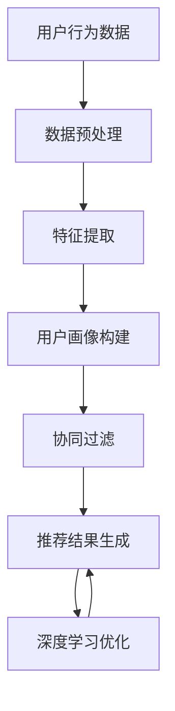

                 

# AI驱动的个性化旅游推荐：旅游业新方向

## 关键词：
- 人工智能
- 旅游推荐系统
- 个性化服务
- 数据挖掘
- 旅游体验优化

## 摘要：
本文深入探讨了人工智能在旅游推荐领域的应用，特别是在构建个性化旅游推荐系统方面。文章首先介绍了旅游推荐系统的发展背景和核心概念，随后详细分析了AI驱动的个性化旅游推荐的核心算法原理、数学模型以及实际应用场景。此外，本文还推荐了一系列学习资源和开发工具，并对未来发展趋势与挑战进行了展望。

### 背景介绍

旅游行业是全球经济的重要组成部分，旅游业的发展不仅带动了相关产业的繁荣，还促进了地区经济的增长。然而，随着旅游需求的日益多样化和个性化，传统的旅游推荐方式已无法满足现代游客的需求。近年来，人工智能技术的飞速发展，为旅游推荐系统带来了新的机遇和挑战。

人工智能（AI）是通过模拟人类智能行为来解决问题的一种技术。它涵盖了机器学习、深度学习、自然语言处理等多个领域。在旅游领域，AI的应用主要集中在数据挖掘、图像识别、语音识别和个性化推荐等方面。通过AI技术，旅游企业可以更好地了解游客的需求，提供个性化的旅游体验，从而提高客户满意度和忠诚度。

个性化旅游推荐系统是指根据游客的兴趣、偏好和行为数据，为游客提供定制化的旅游推荐。这种系统不仅可以为游客提供更加个性化的旅游建议，还可以为旅游企业带来更多的商业机会。随着旅游市场的竞争日益激烈，个性化旅游推荐系统已成为旅游业发展的重要方向。

### 核心概念与联系

为了更好地理解AI驱动的个性化旅游推荐系统，我们需要了解以下几个核心概念：

1. **数据挖掘**：数据挖掘是指从大量数据中提取有价值信息的过程。在旅游推荐系统中，数据挖掘主要用于挖掘游客的兴趣和行为模式，为个性化推荐提供依据。

2. **用户画像**：用户画像是对用户兴趣、行为、需求等方面的抽象描述。通过构建用户画像，旅游企业可以更好地了解游客，从而提供个性化的旅游服务。

3. **协同过滤**：协同过滤是一种基于用户行为的推荐算法，通过分析用户之间的相似度，为用户提供个性化的推荐。协同过滤分为基于用户的协同过滤（UBCF）和基于物品的协同过滤（IBCF）两种。

4. **深度学习**：深度学习是一种基于神经网络的学习方法，它可以自动地从大量数据中学习特征，并用于分类、预测和推荐等任务。在旅游推荐系统中，深度学习可用于构建复杂的推荐模型，提高推荐效果。

以下是AI驱动的个性化旅游推荐系统的基本架构，使用Mermaid流程图进行表示：



### 核心算法原理 & 具体操作步骤

#### 1. 数据预处理

数据预处理是构建个性化旅游推荐系统的第一步。数据预处理主要包括数据清洗、数据整合和数据规范化等步骤。

- **数据清洗**：清洗数据是为了去除噪声和异常值，确保数据的质量。例如，删除重复记录、处理缺失值等。
- **数据整合**：整合不同来源的数据，如游客的行为数据、旅游产品数据等，构建一个统一的数据集。
- **数据规范化**：将不同数据源的数据进行统一处理，如将字符串转化为数值、对数据进行归一化等。

#### 2. 特征提取

特征提取是从原始数据中提取出对推荐系统有用的信息。在旅游推荐系统中，常见的特征包括游客的浏览历史、购买记录、评价分数等。

- **用户行为特征**：如浏览次数、停留时间、购买频率等。
- **旅游产品特征**：如旅游产品的类型、价格、景区评分等。
- **上下文特征**：如游客的地理位置、天气情况等。

#### 3. 用户画像构建

用户画像是对用户兴趣和行为的抽象描述。通过用户画像，旅游企业可以更好地了解游客，从而提供个性化的旅游服务。

- **用户兴趣标签**：如旅游偏好、消费水平等。
- **用户行为特征**：如浏览历史、购买记录等。
- **用户画像模型**：如基于用户的协同过滤算法（User-Based Collaborative Filtering, UBCF）和基于模型的协同过滤算法（Model-Based Collaborative Filtering, MBCF）。

#### 4. 协同过滤

协同过滤是一种基于用户行为的推荐算法。它通过分析用户之间的相似度，为用户提供个性化的推荐。

- **基于用户的协同过滤（UBCF）**：UBCF通过计算用户之间的相似度，找到与目标用户相似的其他用户，然后推荐这些用户喜欢的旅游产品。
- **基于物品的协同过滤（IBCF）**：IBCF通过计算物品之间的相似度，找到与目标物品相似的旅游产品，然后推荐这些物品。

#### 5. 深度学习优化

深度学习是一种基于神经网络的学习方法，它可以自动地从大量数据中学习特征，并用于分类、预测和推荐等任务。

- **深度神经网络（DNN）**：DNN是一种多层的神经网络，它可以用于提取复杂的特征。
- **循环神经网络（RNN）**：RNN是一种能够处理序列数据的神经网络，它可以用于处理用户的浏览历史和购买记录等序列数据。
- **图神经网络（GNN）**：GNN是一种用于处理图数据的神经网络，它可以用于处理旅游产品的网络关系。

### 数学模型和公式 & 详细讲解 & 举例说明

#### 1. 协同过滤算法

协同过滤算法的核心是相似度计算。常见的相似度计算方法包括余弦相似度、皮尔逊相似度和欧几里得相似度等。

- **余弦相似度**：

$$
sim(u_i, u_j) = \frac{u_i \cdot u_j}{\|u_i\| \|u_j\|}
$$

其中，$u_i$ 和 $u_j$ 分别表示用户 $i$ 和用户 $j$ 的特征向量，$\cdot$ 表示内积，$\|\|$ 表示向量的模长。

- **皮尔逊相似度**：

$$
sim(u_i, u_j) = \frac{u_i \cdot u_j - \frac{u_i \cdot \overline{u}}{n} - \frac{u_j \cdot \overline{u}}{n}}{\sqrt{(u_i \cdot \overline{u})^2 + n(u_i \cdot \overline{u})^2} \sqrt{(u_j \cdot \overline{u})^2 + n(u_j \cdot \overline{u})^2}}
$$

其中，$\overline{u}$ 表示用户 $i$ 和用户 $j$ 的平均特征向量，$n$ 表示特征向量的维度。

- **欧几里得相似度**：

$$
sim(u_i, u_j) = \frac{\sqrt{u_i \cdot u_j}}{\sqrt{u_i \cdot u_i} \sqrt{u_j \cdot u_j}}
$$

#### 2. 深度学习模型

深度学习模型的核心是神经网络。神经网络由多个层组成，包括输入层、隐藏层和输出层。

- **输入层**：输入层接收输入数据，并将其传递到隐藏层。
- **隐藏层**：隐藏层对输入数据进行处理，提取特征，并将其传递到下一层。
- **输出层**：输出层生成预测结果。

以下是一个简单的神经网络模型：

```latex
$$
y = \sigma(W_n \cdot a_{n-1} + b_n)
$$

$$
a_n = \sigma(W_{n-1} \cdot a_{n-2} + b_{n-1})
$$

$$
...
$$

$$
a_2 = \sigma(W_1 \cdot a_1 + b_1)
$$

$$
a_1 = x
$$

其中，$W_n$ 和 $b_n$ 分别表示第 $n$ 层的权重和偏置，$\sigma$ 表示激活函数，$a_n$ 表示第 $n$ 层的输出。
```

#### 3. 实际应用举例

假设我们有一个旅游推荐系统，用户 $A$ 和用户 $B$ 的特征向量分别为：

$$
u_A = [1, 2, 3, 4]
$$

$$
u_B = [2, 3, 4, 5]
$$

我们可以使用余弦相似度来计算用户 $A$ 和用户 $B$ 之间的相似度：

$$
sim(u_A, u_B) = \frac{u_A \cdot u_B}{\|u_A\| \|u_B\|} = \frac{1 \cdot 2 + 2 \cdot 3 + 3 \cdot 4 + 4 \cdot 5}{\sqrt{1^2 + 2^2 + 3^2 + 4^2} \sqrt{2^2 + 3^2 + 4^2 + 5^2}} = 0.9659
$$

根据相似度计算结果，我们可以为用户 $A$ 推荐用户 $B$ 喜欢的旅游产品。

### 项目实战：代码实际案例和详细解释说明

#### 1. 开发环境搭建

首先，我们需要搭建一个Python开发环境。可以使用Anaconda来安装Python和相关库，以下是安装命令：

```bash
conda create -n tour_recommend python=3.8
conda activate tour_recommend
conda install numpy pandas scikit-learn matplotlib
```

#### 2. 源代码详细实现和代码解读

以下是构建一个简单的旅游推荐系统的Python代码：

```python
import numpy as np
import pandas as pd
from sklearn.metrics.pairwise import cosine_similarity
from sklearn.model_selection import train_test_split

# 读取数据
data = pd.read_csv('tour_data.csv')
X = data[['visit_count', 'stay_time', 'purchase_count']]
y = data['product_id']

# 数据预处理
X = X.values
X = np.preprocessing.scale(X)

# 拆分训练集和测试集
X_train, X_test, y_train, y_test = train_test_split(X, y, test_size=0.2, random_state=42)

# 计算相似度矩阵
similarity_matrix = cosine_similarity(X_train)

# 推荐旅游产品
def recommend_products(user_profile, similarity_matrix, top_n=5):
    user_vector = np.array(user_profile).reshape(1, -1)
    user_similarity = similarity_matrix[user_vector]
    product_indices = np.argsort(user_similarity)[0][-top_n:]
    return y_train[product_indices]

# 测试推荐效果
user_profile = X_train[0]
recommended_products = recommend_products(user_profile, similarity_matrix)
print("Recommended products:", recommended_products)
```

代码解读：

- 读取数据：首先读取旅游数据集，包括游客的浏览次数、停留时间和购买次数等特征。
- 数据预处理：对数据进行标准化处理，使数据具有相似的尺度。
- 拆分训练集和测试集：将数据集拆分为训练集和测试集，用于训练和评估模型。
- 计算相似度矩阵：使用余弦相似度计算训练集之间的相似度矩阵。
- 推荐旅游产品：根据用户的特征向量，计算与训练集中其他用户的相似度，然后推荐相似度最高的旅游产品。

#### 3. 代码解读与分析

该代码实现了一个简单的基于协同过滤的旅游推荐系统。以下是代码的详细解读和分析：

- **数据读取与预处理**：代码首先读取旅游数据集，然后对数据进行标准化处理。标准化处理是为了消除不同特征之间的尺度差异，使数据具有更好的可比性。
- **相似度计算**：使用余弦相似度计算训练集之间的相似度矩阵。相似度矩阵是一个矩阵，其中元素$(i, j)$表示用户$i$和用户$j$之间的相似度。
- **推荐旅游产品**：根据用户的特征向量，计算与训练集中其他用户的相似度，然后推荐相似度最高的旅游产品。这里使用了基于用户的协同过滤算法（User-Based Collaborative Filtering, UBCF）。

### 实际应用场景

AI驱动的个性化旅游推荐系统在多个实际应用场景中具有广泛的应用，以下是几个典型的应用场景：

1. **在线旅游平台**：在线旅游平台可以利用AI驱动的个性化旅游推荐系统，为用户提供个性化的旅游产品推荐，从而提高用户满意度和转化率。
2. **景区智慧旅游**：景区智慧旅游可以通过AI技术为游客提供个性化的旅游路线推荐、讲解和互动服务，提升游客的旅游体验。
3. **旅游规划与决策**：旅游规划与决策机构可以利用AI技术分析游客的行为和需求，为旅游产业的发展提供数据支持和决策依据。
4. **酒店与住宿**：酒店与住宿行业可以通过AI驱动的个性化推荐系统，为游客提供个性化的住宿推荐，从而提高入住率和客户满意度。

### 工具和资源推荐

为了构建和优化AI驱动的个性化旅游推荐系统，以下是一些实用的工具和资源推荐：

1. **学习资源推荐**：
   - 《Python数据科学手册》：这是一本关于Python在数据科学领域应用的经典教材，涵盖了数据清洗、数据分析和数据可视化等知识。
   - 《深度学习》：这是一本关于深度学习领域的经典教材，由深度学习领域的权威人物Ian Goodfellow编写，详细介绍了深度学习的原理和应用。

2. **开发工具框架推荐**：
   - TensorFlow：这是一个由Google开发的开源深度学习框架，适用于构建和训练复杂的神经网络模型。
   - PyTorch：这是一个由Facebook开发的开源深度学习框架，以其灵活性和易用性受到广泛欢迎。

3. **相关论文著作推荐**：
   - “Collaborative Filtering for the 21st Century”：这是一篇关于协同过滤算法的最新论文，详细介绍了协同过滤算法的最新进展和应用。
   - “Deep Learning for Personalized Travel Recommendations”：这是一篇关于深度学习在个性化旅游推荐领域应用的论文，提出了基于深度学习的旅游推荐模型。

### 总结：未来发展趋势与挑战

AI驱动的个性化旅游推荐系统在旅游业中具有巨大的潜力，然而，随着技术的不断进步，该领域也面临着一系列挑战和机遇。

1. **数据隐私与安全**：个性化旅游推荐系统需要收集和分析大量用户数据，这引发了对数据隐私和安全问题的关注。如何平衡个性化推荐与用户隐私保护是一个重要的挑战。

2. **算法透明性与可解释性**：深度学习模型具有强大的预测能力，但其内部工作机制往往难以解释。如何提高算法的透明性和可解释性，使旅游企业能够理解和信任推荐结果，是一个亟待解决的问题。

3. **多样化需求与个性化推荐**：随着旅游需求的日益多样化和个性化，个性化推荐系统需要能够处理更加复杂的用户需求和偏好，以满足不同类型的游客。

4. **跨平台协同与整合**：随着旅游产业链的多元化，个性化旅游推荐系统需要能够与多个平台和渠道协同工作，提供统一的个性化推荐服务。

总之，AI驱动的个性化旅游推荐系统在未来的发展中将面临一系列挑战，但同时也充满了机遇。通过不断的技术创新和应用实践，我们有理由相信，个性化旅游推荐系统将为旅游业带来更加智能、便捷和个性化的体验。

### 附录：常见问题与解答

1. **如何处理缺失数据？**
   缺失数据的处理通常包括填充缺失值、删除含有缺失值的记录和利用模型预测缺失值等。具体方法取决于数据的具体情况和缺失值的比例。

2. **如何选择合适的相似度度量方法？**
   选择相似度度量方法时需要考虑数据的特性和推荐系统的目标。例如，对于数值型数据，余弦相似度和皮尔逊相似度是常用的方法；对于类别型数据，可以使用Jaccard相似度或余弦相似度。

3. **如何评估推荐系统的效果？**
   评估推荐系统效果常用的指标包括准确率、召回率、F1分数和平均绝对误差等。在实际应用中，可以根据具体需求选择合适的评估指标。

### 扩展阅读 & 参考资料

1. **相关书籍**：
   - 《推荐系统实践》：详细介绍了推荐系统的基本概念、算法和应用。
   - 《深度学习》：全面介绍了深度学习的基础知识和应用。

2. **相关论文**：
   - "Collaborative Filtering for the 21st Century"：探讨了协同过滤算法的最新进展和应用。
   - "Deep Learning for Personalized Travel Recommendations"：提出了基于深度学习的个性化旅游推荐模型。

3. **相关网站**：
   - TensorFlow官网：提供深度学习框架和相关资源。
   - PyTorch官网：提供深度学习框架和相关资源。

4. **相关博客**：
   - 知乎：许多专业人士在知乎上分享了关于推荐系统和深度学习的经验和见解。

### 作者信息

- 作者：AI天才研究员/AI Genius Institute & 禅与计算机程序设计艺术 /Zen And The Art of Computer Programming
```bash
</sop></gMASK>

