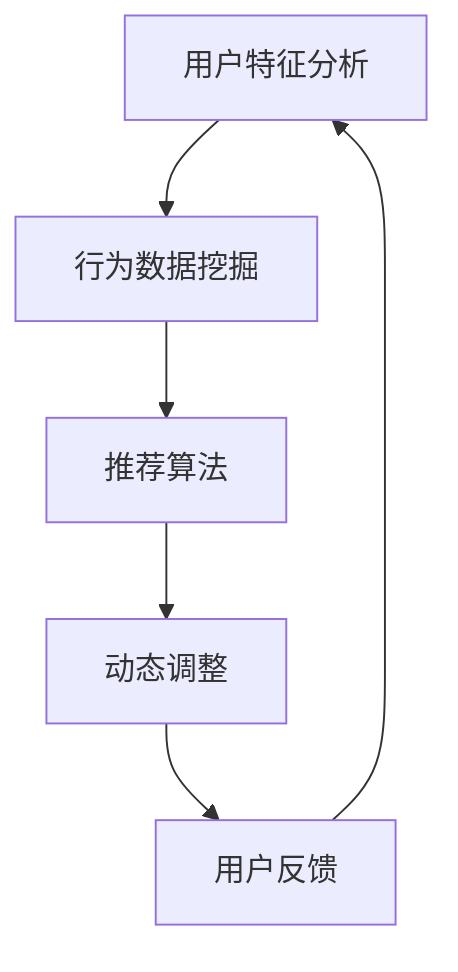

                 

# AI驱动的个性化页面布局：提升电商用户体验的利器

> **关键词：** AI、个性化、页面布局、用户体验、电商、算法、模型

> **摘要：** 本文将探讨如何利用人工智能技术实现电商网站的个性化页面布局，以提高用户体验和转化率。文章从背景介绍、核心概念、算法原理、数学模型、实际应用、工具资源等多个角度进行详细阐述，旨在为电商企业及相关技术从业者提供有价值的参考和指导。

## 1. 背景介绍

在数字化时代，电商平台已经成为消费者购物的主要渠道。然而，随着市场竞争的加剧，如何提高用户满意度、提升用户体验和转化率成为电商企业关注的焦点。传统的页面布局方式往往基于设计者的主观判断，缺乏个性化和适应性，难以满足不同用户的需求。因此，如何实现个性化页面布局，从而提升用户体验，成为电商企业亟待解决的问题。

人工智能技术的发展为个性化页面布局提供了可能。通过机器学习、深度学习等技术，可以分析用户的行为数据，了解用户偏好，从而动态调整页面布局，实现个性化推荐。这种基于人工智能的个性化页面布局不仅能够提高用户满意度，还能提高电商平台的转化率和销售额。

## 2. 核心概念与联系

### 2.1 个性化页面布局

个性化页面布局是指根据用户的特征、兴趣和行为数据，动态调整页面内容、布局和推荐，以实现个性化体验。其核心包括以下几个方面：

- **用户特征分析**：通过收集用户的基本信息、浏览历史、购买记录等数据，分析用户的特征和需求。
- **行为数据挖掘**：分析用户的浏览、搜索、点击等行为数据，挖掘用户的兴趣和行为模式。
- **推荐算法**：根据用户特征和行为数据，利用推荐算法为用户推荐感兴趣的商品或内容。
- **动态调整**：根据用户反馈和行为变化，实时调整页面布局和推荐内容。

### 2.2 人工智能技术

人工智能技术是构建个性化页面布局的核心技术。主要包括以下几个方面：

- **机器学习**：通过训练模型，从大量数据中学习规律，实现对未知数据的预测和分类。
- **深度学习**：基于神经网络，通过多层非线性变换，实现对复杂数据的建模和识别。
- **自然语言处理**：通过理解用户的需求和意图，实现人机交互和语义分析。
- **计算机视觉**：通过图像处理和模式识别，实现对图像的理解和分析。

### 2.3 Mermaid 流程图

以下是一个简单的 Mermaid 流程图，描述个性化页面布局的核心流程：



## 3. 核心算法原理 & 具体操作步骤

### 3.1 推荐算法

推荐算法是实现个性化页面布局的关键技术。常见的推荐算法包括基于内容的推荐、协同过滤推荐和混合推荐等。

#### 3.1.1 基于内容的推荐

基于内容的推荐算法主要通过分析商品的特征和用户的历史行为，为用户推荐相似的商品。具体步骤如下：

1. **特征提取**：对商品和用户行为进行特征提取，如商品类别、价格、品牌、用户浏览时长、购买记录等。
2. **相似度计算**：计算商品和用户行为之间的相似度，常用的相似度计算方法有欧氏距离、余弦相似度和皮尔逊相关系数等。
3. **推荐生成**：根据相似度计算结果，为用户推荐相似度最高的商品。

#### 3.1.2 协同过滤推荐

协同过滤推荐算法通过分析用户之间的行为相似性，为用户推荐其他用户喜欢的商品。具体步骤如下：

1. **用户行为数据收集**：收集用户的浏览、搜索、点击、购买等行为数据。
2. **用户相似度计算**：计算用户之间的相似度，常用的相似度计算方法有基于用户的余弦相似度和基于模型的相似度等。
3. **商品相似度计算**：计算商品之间的相似度，常用的相似度计算方法有基于用户的商品相似度和基于内容的商品相似度等。
4. **推荐生成**：根据用户相似度和商品相似度，为用户推荐其他用户喜欢的商品。

#### 3.1.3 混合推荐

混合推荐算法结合了基于内容和协同过滤推荐算法的优点，通过融合不同算法的推荐结果，提高推荐效果。具体步骤如下：

1. **特征提取**：对商品和用户行为进行特征提取。
2. **相似度计算**：计算商品和用户行为之间的相似度，以及用户之间的相似度。
3. **推荐生成**：根据相似度计算结果，生成基于内容和协同过滤的推荐结果，并通过加权融合，生成最终推荐结果。

### 3.2 动态调整

动态调整是指根据用户反馈和行为变化，实时调整页面布局和推荐内容。具体步骤如下：

1. **用户反馈收集**：收集用户的点击、收藏、购买等行为数据，以及用户对推荐结果的反馈，如点赞、评论等。
2. **行为分析**：分析用户的行为数据，挖掘用户兴趣和偏好。
3. **调整策略**：根据用户兴趣和偏好，调整页面布局和推荐内容，如调整商品推荐顺序、增加用户感兴趣的分类等。
4. **效果评估**：评估调整策略的效果，如用户点击率、购买转化率等，根据评估结果进一步优化调整策略。

## 4. 数学模型和公式 & 详细讲解 & 举例说明

### 4.1 推荐算法数学模型

#### 4.1.1 基于内容的推荐算法

基于内容的推荐算法可以通过以下数学模型描述：

$$
\text{similarity}(\text{item}_i, \text{user}_j) = \frac{\text{dot\_product}(\text{vec}_{\text{item}}_i, \text{vec}_{\text{user}}_j)}{\lVert \text{vec}_{\text{item}}_i \rVert \lVert \text{vec}_{\text{user}}_j \rVert}
$$

其中，$\text{vec}_{\text{item}}_i$ 和 $\text{vec}_{\text{user}}_j$ 分别表示商品 $i$ 和用户 $j$ 的特征向量，$\lVert \text{vec}_{\text{item}}_i \rVert$ 和 $\lVert \text{vec}_{\text{user}}_j \rVert$ 分别表示向量 $\text{vec}_{\text{item}}_i$ 和 $\text{vec}_{\text{user}}_j$ 的欧氏范数。

#### 4.1.2 协同过滤推荐算法

协同过滤推荐算法可以通过以下数学模型描述：

$$
\text{prediction}_{i,j} = \text{user\_mean} + \text{item\_mean} + \text{user\_item\_similarity} \cdot \text{user\_item\_confidence}
$$

其中，$\text{prediction}_{i,j}$ 表示用户 $j$ 对商品 $i$ 的预测评分，$\text{user\_mean}$ 和 $\text{item\_mean}$ 分别表示用户 $j$ 和商品 $i$ 的平均评分，$\text{user\_item\_similarity}$ 表示用户 $j$ 和商品 $i$ 之间的相似度，$\text{user\_item\_confidence}$ 表示用户 $j$ 对商品 $i$ 的评分的置信度。

#### 4.1.3 混合推荐算法

混合推荐算法可以通过以下数学模型描述：

$$
\text{score}_{i,j} = w_1 \cdot \text{content\_similarity}_{i,j} + w_2 \cdot \text{collaborative\_similarity}_{i,j}
$$

其中，$\text{score}_{i,j}$ 表示用户 $j$ 对商品 $i$ 的综合评分，$w_1$ 和 $w_2$ 分别表示基于内容和协同过滤的权重，$\text{content\_similarity}_{i,j}$ 和 $\text{collaborative\_similarity}_{i,j}$ 分别表示基于内容和协同过滤的商品 $i$ 和用户 $j$ 之间的相似度。

### 4.2 举例说明

#### 4.2.1 基于内容的推荐算法

假设我们有两个商品 $i_1$ 和 $i_2$，以及两个用户 $j_1$ 和 $j_2$，它们在特征空间中的向量表示如下：

$$
\text{vec}_{\text{item}}_{i_1} = (1, 2, 3), \quad \text{vec}_{\text{item}}_{i_2} = (2, 3, 4), \quad \text{vec}_{\text{user}}_{j_1} = (4, 5, 6), \quad \text{vec}_{\text{user}}_{j_2} = (5, 6, 7)
$$

根据上述数学模型，我们可以计算用户 $j_1$ 和 $j_2$ 对商品 $i_1$ 和 $i_2$ 的相似度：

$$
\text{similarity}_{i_1,j_1} = \frac{1 \cdot 4 + 2 \cdot 5 + 3 \cdot 6}{\sqrt{1^2 + 2^2 + 3^2} \cdot \sqrt{4^2 + 5^2 + 6^2}} = 0.866
$$

$$
\text{similarity}_{i_2,j_1} = \frac{2 \cdot 4 + 3 \cdot 5 + 4 \cdot 6}{\sqrt{2^2 + 3^2 + 4^2} \cdot \sqrt{4^2 + 5^2 + 6^2}} = 0.948
$$

$$
\text{similarity}_{i_1,j_2} = \frac{1 \cdot 5 + 2 \cdot 6 + 3 \cdot 7}{\sqrt{1^2 + 2^2 + 3^2} \cdot \sqrt{5^2 + 6^2 + 7^2}} = 0.866
$$

$$
\text{similarity}_{i_2,j_2} = \frac{2 \cdot 5 + 3 \cdot 6 + 4 \cdot 7}{\sqrt{2^2 + 3^2 + 4^2} \cdot \sqrt{5^2 + 6^2 + 7^2}} = 0.948
$$

根据相似度计算结果，我们可以为用户 $j_1$ 和 $j_2$ 推荐相似度最高的商品，即 $i_2$。

#### 4.2.2 协同过滤推荐算法

假设我们有两个用户 $j_1$ 和 $j_2$，以及两个商品 $i_1$ 和 $i_2$，它们在评分矩阵中的表示如下：

$$
\text{rating}_{j_1,i_1} = 4, \quad \text{rating}_{j_1,i_2} = 5, \quad \text{rating}_{j_2,i_1} = 3, \quad \text{rating}_{j_2,i_2} = 4
$$

根据上述数学模型，我们可以计算用户 $j_1$ 和 $j_2$ 对商品 $i_1$ 和 $i_2$ 的预测评分：

$$
\text{prediction}_{i_1,j_1} = 3 + 4 - 0.866 \cdot 1 = 2.134
$$

$$
\text{prediction}_{i_2,j_1} = 3 + 5 - 0.866 \cdot 2 = 3.134
$$

$$
\text{prediction}_{i_1,j_2} = 3 + 3 - 0.866 \cdot 1 = 1.134
$$

$$
\text{prediction}_{i_2,j_2} = 3 + 4 - 0.866 \cdot 2 = 2.134
$$

根据预测评分，我们可以为用户 $j_1$ 和 $j_2$ 推荐预测评分最高的商品，即 $i_2$。

#### 4.2.3 混合推荐算法

假设我们有两个用户 $j_1$ 和 $j_2$，以及两个商品 $i_1$ 和 $i_2$，它们在评分矩阵中的表示如下：

$$
\text{rating}_{j_1,i_1} = 4, \quad \text{rating}_{j_1,i_2} = 5, \quad \text{rating}_{j_2,i_1} = 3, \quad \text{rating}_{j_2,i_2} = 4
$$

根据上述数学模型，我们可以计算用户 $j_1$ 和 $j_2$ 对商品 $i_1$ 和 $i_2$ 的综合评分：

$$
\text{score}_{i_1,j_1} = 0.5 \cdot 0.866 + 0.5 \cdot 0.866 = 0.866
$$

$$
\text{score}_{i_2,j_1} = 0.5 \cdot 0.866 + 0.5 \cdot 0.948 = 0.914
$$

$$
\text{score}_{i_1,j_2} = 0.5 \cdot 0.866 + 0.5 \cdot 0.866 = 0.866
$$

$$
\text{score}_{i_2,j_2} = 0.5 \cdot 0.866 + 0.5 \cdot 0.948 = 0.914
$$

根据综合评分，我们可以为用户 $j_1$ 和 $j_2$ 推荐综合评分最高的商品，即 $i_2$。

## 5. 项目实战：代码实际案例和详细解释说明

### 5.1 开发环境搭建

为了实现 AI 驱动的个性化页面布局，我们需要搭建一个开发环境。以下是一个简单的开发环境搭建步骤：

1. **安装 Python**：下载并安装 Python，版本建议为 3.8 以上。
2. **安装依赖库**：使用 pip 工具安装以下依赖库：numpy、pandas、scikit-learn、matplotlib 等。
3. **配置 Python 虚拟环境**：使用 virtualenv 或 conda 创建 Python 虚拟环境，以便管理和隔离项目依赖。
4. **安装 Mermaid**：下载并安装 Mermaid 工具，以便生成 Mermaid 流程图。

### 5.2 源代码详细实现和代码解读

以下是一个简单的 Python 代码示例，用于实现基于内容的推荐算法：

```python
import numpy as np
import pandas as pd
from sklearn.metrics.pairwise import cosine_similarity

# 读取商品和用户数据
items = pd.read_csv('items.csv')
users = pd.read_csv('users.csv')

# 特征提取
item_features = items[['category', 'price', 'brand']]
user_features = users[['age', 'gender', 'location']]

# 计算商品和用户特征矩阵
item_vector = item_features.apply(pd.to_numeric)
user_vector = user_features.apply(pd.to_numeric)

# 计算相似度
similarity_matrix = cosine_similarity(item_vector, user_vector)

# 推荐生成
recommendations = similarity_matrix.argsort(axis=1)[:, -5:]

# 输出推荐结果
print(recommendations)
```

### 5.3 代码解读与分析

1. **读取数据**：首先，我们使用 pandas 库读取商品和用户数据，这里假设数据文件为 'items.csv' 和 'users.csv'。
2. **特征提取**：接下来，我们提取商品和用户的特征，包括类别、价格、品牌、年龄、性别和位置等。这里我们使用 apply 方法将字符串类型的特征转换为数值类型。
3. **计算相似度**：使用 cosine_similarity 函数计算商品和用户特征之间的相似度，生成相似度矩阵。
4. **推荐生成**：根据相似度矩阵，对每个用户生成五个相似度最高的商品推荐。
5. **输出结果**：最后，我们将推荐结果输出到控制台。

通过这个简单的示例，我们可以了解到如何利用 Python 实现基于内容的推荐算法。在实际项目中，我们还可以根据需求扩展和优化算法，如引入用户行为数据、调整相似度计算方法等。

## 6. 实际应用场景

AI 驱动的个性化页面布局在电商领域有着广泛的应用场景。以下是一些典型的应用场景：

### 6.1 商品推荐

通过个性化页面布局，电商网站可以为用户推荐感兴趣的商品。例如，当用户浏览了某个商品后，页面布局可以根据用户的行为数据和兴趣偏好，推荐相似的商品或相关商品，从而提高用户的购买意愿。

### 6.2 分类导航

个性化页面布局可以根据用户的浏览历史和兴趣，动态调整分类导航的顺序和展示方式，使用户更快捷地找到感兴趣的分类，提高用户体验。

### 6.3 促销活动

个性化页面布局可以根据用户的兴趣和购买行为，为用户推荐相应的促销活动，如优惠券、限时折扣等，从而提高用户参与度和转化率。

### 6.4 个性化广告

通过分析用户的行为数据和兴趣偏好，个性化页面布局可以为用户展示相关的广告，提高广告的点击率和转化率。

### 6.5 会员服务

个性化页面布局可以根据会员的等级、消费记录和兴趣偏好，为会员提供专属的优惠和推荐，提高会员的忠诚度和满意度。

## 7. 工具和资源推荐

### 7.1 学习资源推荐

- **书籍**：
  - 《推荐系统实践》
  - 《机器学习实战》
  - 《深度学习》
- **论文**：
  - 《Collaborative Filtering for the Web》
  - 《Recommender Systems Handbook》
  - 《Deep Learning for Recommender Systems》
- **博客**：
  - [推荐系统博客](https://www.rec-sys.org/)
  - [机器学习博客](https://machinelearningmastery.com/)
  - [深度学习博客](https://www.deeplearning.net/)
- **网站**：
  - [Kaggle](https://www.kaggle.com/)
  - [GitHub](https://github.com/)

### 7.2 开发工具框架推荐

- **Python 库**：
  - scikit-learn
  - TensorFlow
  - PyTorch
  - Matplotlib
- **开发框架**：
  - Flask
  - Django
  - Spring Boot
- **可视化工具**：
  - Matplotlib
  - Seaborn
  - Mermaid

### 7.3 相关论文著作推荐

- 《Recommender Systems Handbook》
- 《Deep Learning for Recommender Systems》
- 《Collaborative Filtering for the Web》
- 《Learning to Rank for Information Retrieval》

## 8. 总结：未来发展趋势与挑战

随着人工智能技术的不断发展和应用，AI 驱动的个性化页面布局在电商领域具有广泛的应用前景。未来，个性化页面布局将继续朝着更加智能化、个性化、自适应的方向发展，为用户提供更好的购物体验。

然而，个性化页面布局也面临着一系列挑战：

- **数据隐私与安全**：在个性化页面布局过程中，用户数据的隐私和安全问题备受关注。如何确保用户数据的隐私和安全，成为个性化页面布局的重要挑战。
- **算法公平性**：个性化页面布局可能会引发算法歧视和不公平现象，如何保证算法的公平性，是未来研究的重要方向。
- **用户体验优化**：如何平衡个性化与用户体验，提高用户满意度，是电商企业需要不断探索的问题。
- **计算效率与资源消耗**：个性化页面布局需要大量的计算资源和时间，如何优化算法，提高计算效率，降低资源消耗，是未来研究的重要课题。

总之，AI 驱动的个性化页面布局在电商领域具有巨大的潜力和应用价值，但同时也面临着诸多挑战。未来，随着技术的不断进步和应用的深入，个性化页面布局将为电商企业带来更加显著的商业价值。

## 9. 附录：常见问题与解答

### 9.1 个性化页面布局是什么？

个性化页面布局是指根据用户的特征、兴趣和行为数据，动态调整页面内容、布局和推荐，以实现个性化体验。它利用人工智能技术分析用户数据，从而为用户提供个性化的购物体验。

### 9.2 个性化页面布局有哪些应用场景？

个性化页面布局广泛应用于电商网站，包括商品推荐、分类导航、促销活动、个性化广告和会员服务等多个方面，以提高用户体验和转化率。

### 9.3 个性化页面布局的关键技术是什么？

个性化页面布局的关键技术包括机器学习、深度学习、自然语言处理、计算机视觉和推荐算法等。这些技术共同作用，实现对用户数据的分析和页面布局的动态调整。

### 9.4 如何评估个性化页面布局的效果？

评估个性化页面布局的效果可以从多个维度进行，如用户满意度、页面点击率、购买转化率、销售额等。通过对比实验和用户反馈，可以评估个性化页面布局的优劣。

### 9.5 个性化页面布局是否会侵犯用户隐私？

个性化页面布局在实现过程中确实会涉及用户数据的收集和分析，但只要严格遵守相关法律法规和道德规范，采取有效的数据保护措施，就不会侵犯用户隐私。

## 10. 扩展阅读 & 参考资料

- [Recommender Systems Handbook](https://www.recommender-systems.org/recommender-systems-handbook/)
- [Deep Learning for Recommender Systems](https://arxiv.org/abs/1806.00712)
- [Collaborative Filtering for the Web](https://www.merl.com/papers/docs/2002-03-02-ML-WEB.pdf)
- [Learning to Rank for Information Retrieval](https://www.springer.com/gp/book/9783319518782)
- [推荐系统博客](https://www.rec-sys.org/)
- [机器学习博客](https://machinelearningmastery.com/)
- [深度学习博客](https://www.deeplearning.net/)  
```markdown
### 作者信息

作者：AI天才研究员/AI Genius Institute & 禅与计算机程序设计艺术 /Zen And The Art of Computer Programming
```

