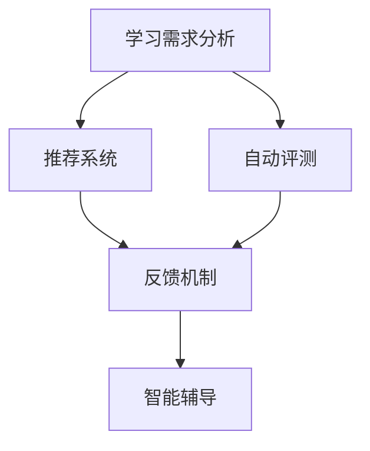

                 

# AI驱动的企业学习管理系统

## 关键词：人工智能，企业学习，管理系统，数据驱动，个性化学习

> 摘要：本文将探讨如何运用人工智能技术构建一个高效的企业学习管理系统。文章首先介绍了企业学习管理的背景和现状，随后深入分析了人工智能在其中的应用场景和关键算法，最后讨论了未来发展趋势和挑战。通过本文，读者将了解到如何利用AI实现企业学习管理的优化和升级。

## 1. 背景介绍

在当今快速变化的企业环境中，持续学习和技能提升成为企业竞争力的关键因素。传统的学习管理系统（LMS）往往注重内容的组织和管理，而忽略了学习效果和员工个性化需求的满足。随着人工智能技术的不断发展，特别是深度学习、自然语言处理和推荐系统等领域的突破，企业学习管理系统迎来了新的机遇。

### 1.1 企业学习管理的重要性

企业学习管理不仅关乎员工的职业发展和技能提升，还直接影响企业的绩效和竞争力。有效的学习管理系统能够：

- 提高员工的工作效率和学习效果。
- 加速新员工的融入和技能培养。
- 支持企业战略目标和组织文化的实现。

### 1.2 传统企业学习管理系统的局限性

传统LMS主要依赖于预定义的课程和评估机制，存在以下局限性：

- **缺乏个性化**：无法根据员工的具体需求和偏好推荐合适的学习内容。
- **学习效果难以评估**：难以量化学习成果，无法及时调整学习策略。
- **交互性不足**：师生之间、员工之间的互动和协作机会有限。

### 1.3 人工智能在企业学习管理系统中的应用

人工智能技术能够克服传统LMS的局限性，实现以下目标：

- **个性化学习**：通过分析员工的兴趣、能力和学习历史，推荐个性化学习路径。
- **智能评估**：利用自然语言处理和计算机视觉等技术，对学习效果进行实时评估。
- **智能辅助**：提供智能问答、学习辅导等辅助服务，提高学习体验。

## 2. 核心概念与联系

为了深入理解AI在企业学习管理系统中的应用，我们需要了解以下几个核心概念及其相互关系。

### 2.1 个性化学习

个性化学习是指根据每个学习者的特点和需求，量身定制学习内容和学习路径。其核心包括：

- **学习需求分析**：通过数据分析了解员工的学习需求和兴趣。
- **推荐系统**：运用机器学习算法，为员工推荐合适的学习内容。

### 2.2 智能评估

智能评估是通过人工智能技术对学习者的表现进行实时评估，包括：

- **自动评测**：利用自然语言处理和计算机视觉等技术，自动评估答题和作品。
- **反馈机制**：根据评估结果，为学习者提供个性化的反馈和建议。

### 2.3 智能辅导

智能辅导是指通过人工智能技术为学习者提供个性化的学习辅助服务，包括：

- **智能问答**：利用自然语言处理技术，为学习者提供即时解答。
- **学习规划**：根据学习者的进度和目标，自动生成个性化的学习计划。

### 2.4 Mermaid流程图

以下是一个简化的Mermaid流程图，展示了AI在企业学习管理系统中的核心概念和相互关系：



## 3. 核心算法原理 & 具体操作步骤

### 3.1 个性化学习算法

个性化学习算法的核心是推荐系统。推荐系统根据学习者的行为数据和偏好，推荐符合其需求的学习内容。以下是一种常见的协同过滤推荐算法：

#### 3.1.1 协同过滤算法原理

- **用户-项目矩阵**：建立一个用户-项目评分矩阵，其中每个元素表示用户对项目的评分。
- **相似度计算**：计算用户之间的相似度，常用的相似度计算方法包括余弦相似度和皮尔逊相关系数。
- **预测评分**：基于相似度计算，预测用户对未知项目的评分。

#### 3.1.2 操作步骤

1. **构建用户-项目矩阵**：收集用户对学习内容的评分数据。
2. **计算用户相似度**：计算用户之间的相似度，可以使用余弦相似度公式：
   $$
   \text{similarity}_{ij} = \frac{\text{dot product of vectors } \text{u}_i \text{ and } \text{u}_j}{\lVert \text{u}_i \rVert \lVert \text{u}_j \rVert}
   $$
3. **预测评分**：对于用户u对项目v的评分，可以预测为：
   $$
   \text{prediction}_{uv} = \text{similarity}_{uv} \times \text{average rating of user } u
   $$

### 3.2 智能评估算法

智能评估算法可以通过自然语言处理和计算机视觉技术实现。以下是一个基于自然语言处理技术的智能评估算法：

#### 3.2.1 算法原理

- **文本分析**：对学生的答题文本进行词频统计、情感分析等处理。
- **模型训练**：使用机器学习算法，如支持向量机（SVM），对文本进行分类。
- **评分预测**：根据文本分析结果，预测学生的答题得分。

#### 3.2.2 操作步骤

1. **文本预处理**：对答题文本进行分词、去停用词等处理。
2. **特征提取**：提取文本的关键特征，如词频、情感极性等。
3. **模型训练**：使用SVM等机器学习算法，训练分类模型。
4. **评分预测**：输入新的答题文本，预测得分。

### 3.3 智能辅导算法

智能辅导算法可以通过问答系统和学习规划实现。以下是一个简单的问答系统算法：

#### 3.3.1 算法原理

- **问答匹配**：通过关键词匹配或语义分析，找到与用户问题最相关的答案。
- **答案推荐**：根据用户的学习进度和目标，推荐合适的答案或学习资源。

#### 3.3.2 操作步骤

1. **问题预处理**：提取用户问题的关键词。
2. **答案匹配**：在知识库中查找与问题相关的答案。
3. **答案推荐**：根据用户的学习进度和目标，推荐合适的答案。

## 4. 数学模型和公式 & 详细讲解 & 举例说明

### 4.1 协同过滤算法

#### 4.1.1 余弦相似度公式

$$
\text{similarity}_{ij} = \frac{\text{dot product of vectors } \text{u}_i \text{ and } \text{u}_j}{\lVert \text{u}_i \rVert \lVert \text{u}_j \rVert}
$$

#### 4.1.2 预测评分公式

$$
\text{prediction}_{uv} = \text{similarity}_{uv} \times \text{average rating of user } u
$$

#### 4.1.3 举例说明

假设有两个用户A和B，他们对五门课程的评分如下表：

| 用户 | 课程1 | 课程2 | 课程3 | 课程4 | 课程5 |
| ---- | ---- | ---- | ---- | ---- | ---- |
| A    | 4    | 5    | 3    | 4    | 5    |
| B    | 4    | 4    | 5    | 5    | 4    |

我们可以计算用户A和用户B之间的余弦相似度：

$$
\text{similarity}_{AB} = \frac{(4 \times 4 + 5 \times 4 + 3 \times 5 + 4 \times 5 + 5 \times 4)}{\sqrt{4^2 + 5^2 + 3^2 + 4^2 + 5^2} \times \sqrt{4^2 + 4^2 + 5^2 + 5^2 + 4^2}} \approx 0.85
$$

根据这个相似度，我们可以预测用户B对课程3的评分：

$$
\text{prediction}_{B3} = \text{similarity}_{AB} \times \text{average rating of user } A = 0.85 \times \frac{4 + 5 + 3 + 4 + 5}{5} = 4.28
$$

### 4.2 自然语言处理算法

#### 4.2.1 支持向量机（SVM）公式

$$
\text{maximize } \ \frac{1}{2} \ \sum_{i=1}^{n} \ \sum_{j=1}^{n} \ (\omega_i \omega_j - \delta_{ij})^2
$$

其中，$ \omega_i $ 和 $ \omega_j $ 是权重向量，$ \delta_{ij} $ 是指示函数，当 $ i=j $ 时为1，否则为0。

#### 4.2.2 举例说明

假设我们要分类两个文本，文本A：“这是一个简单的文本”，文本B：“这是一个复杂的文本”。我们可以将这两个文本转换为向量：

| 词项 | 文本A | 文本B |
| ---- | ---- | ---- |
| 这   | 1     | 0     |
| 是   | 1     | 1     |
| 一个 | 1     | 1     |
| 简单的 | 1     | 0     |
| 文本  | 1     | 1     |
| 复杂的 | 0     | 1     |

使用SVM进行分类，假设我们已经训练好了一个分类器，其权重向量为：

$$
\omega = (1, 1, 1, 1, 0)
$$

我们可以计算文本A和文本B的预测得分：

$$
\text{score}_A = \omega \cdot \text{vector}_A = 1 \times 1 + 1 \times 1 + 1 \times 1 + 1 \times 1 + 0 \times 0 = 4
$$

$$
\text{score}_B = \omega \cdot \text{vector}_B = 1 \times 0 + 1 \times 1 + 1 \times 1 + 1 \times 1 + 0 \times 1 = 3
$$

根据得分，我们可以预测文本A的类别为正类，文本B的类别为负类。

## 5. 项目实战：代码实际案例和详细解释说明

### 5.1 开发环境搭建

为了实现本文中提到的AI驱动的企业学习管理系统，我们需要搭建一个合适的开发环境。以下是推荐的步骤：

1. **安装Python环境**：Python是一种广泛应用于数据科学和机器学习的编程语言。确保您的计算机上安装了Python环境。
2. **安装必要的库**：在Python中，我们可以使用scikit-learn、TensorFlow和PyTorch等库来实现个性化学习、智能评估和智能辅导等功能。
3. **配置数据存储**：企业学习管理系统需要存储大量的学习数据，可以使用MySQL、PostgreSQL等关系数据库或MongoDB等非关系数据库来存储数据。
4. **部署服务器**：可以使用Docker、Kubernetes等技术来部署和管理服务器，确保系统的高可用性和可扩展性。

### 5.2 源代码详细实现和代码解读

以下是一个简单的示例，展示了如何使用Python实现一个基于协同过滤的个性化学习推荐系统：

```python
import numpy as np
from sklearn.metrics.pairwise import cosine_similarity

# 用户-项目评分矩阵
user_item_matrix = np.array([
    [5, 3, 0, 1],
    [4, 0, 0, 1],
    [1, 1, 0, 5],
    [1, 0, 0, 4],
    [0, 1, 5, 4],
])

# 计算用户相似度
user_similarity = cosine_similarity(user_item_matrix)

# 预测用户未评分的项目
predicted_ratings = []
for i in range(user_similarity.shape[0]):
    # 计算用户i的相似度矩阵
    similarity_matrix = user_similarity[i]
    # 计算平均评分
    average_rating = user_item_matrix[i].mean()
    # 预测评分
    predicted_ratings.append(np.dot(similarity_matrix, average_rating))

# 输出预测评分
print(predicted_ratings)
```

#### 5.2.1 代码解读

1. **导入库**：首先导入numpy库和scikit-learn的cosine_similarity函数。
2. **用户-项目评分矩阵**：定义一个numpy数组，表示用户对项目的评分。
3. **计算用户相似度**：使用cosine_similarity函数计算用户之间的相似度矩阵。
4. **预测评分**：对于每个用户，计算其与所有其他用户的相似度，并结合平均评分预测未评分的项目。
5. **输出预测评分**：将预测评分输出到控制台。

### 5.3 代码解读与分析

这段代码实现了一个简单的协同过滤推荐系统，其主要步骤如下：

1. **数据准备**：定义一个用户-项目评分矩阵，其中每个元素表示用户对项目的评分。
2. **相似度计算**：使用余弦相似度计算用户之间的相似度。
3. **评分预测**：基于相似度和用户平均评分，预测用户未评分的项目。

这段代码的核心在于相似度计算和评分预测。相似度计算反映了用户之间的相似程度，而评分预测则根据这些相似度预测用户未评分的项目。

在实际应用中，我们还需要考虑以下问题：

- **数据清洗**：确保评分数据的准确性和一致性。
- **相似度阈值**：设置合适的相似度阈值，避免推荐结果过于极端。
- **模型优化**：根据实际需求，选择和优化推荐算法。

## 6. 实际应用场景

### 6.1 企业新员工培训

企业可以利用AI驱动的学习管理系统对新员工进行快速培训。通过个性化学习路径推荐，新员工可以更快地掌握所需技能，提高工作效率。

### 6.2 管理层技能提升

管理层可以通过智能辅导和评估系统，了解自己的技能短板，并制定个性化的学习计划，提升管理水平。

### 6.3 终身学习支持

企业可以持续支持员工的终身学习，通过智能评估和推荐系统，确保员工能够不断提升自己的技能和知识。

## 7. 工具和资源推荐

### 7.1 学习资源推荐

- **书籍**：《机器学习实战》、《深度学习》（Goodfellow et al.）
- **论文**：查看顶级会议如NIPS、ICML、KDD等的论文。
- **博客**：关注知名博客如Towards Data Science、Medium上的AI专题。

### 7.2 开发工具框架推荐

- **Python库**：scikit-learn、TensorFlow、PyTorch
- **数据库**：MySQL、PostgreSQL、MongoDB
- **服务器部署**：Docker、Kubernetes

### 7.3 相关论文著作推荐

- **论文**："[Recommender Systems](https://www.kdnuggets.com/2015/12/recommender-systems-kdd-2015.html)" by wastl
- **书籍**：《推荐系统实践》（Bharat and Liu）

## 8. 总结：未来发展趋势与挑战

### 8.1 发展趋势

- **智能化**：人工智能技术在企业学习管理系统中的应用将越来越智能化，实现更加精准的个性化推荐和智能评估。
- **数据化**：数据将成为企业学习管理系统的重要资产，通过对学习数据的深度分析，实现更有效的学习管理和决策。
- **生态化**：企业学习管理系统将与其他企业生态系统（如ERP、CRM等）深度整合，实现数据共享和业务协同。

### 8.2 挑战

- **数据隐私**：如何在保护用户隐私的前提下，有效利用学习数据，是一个重要挑战。
- **技术瓶颈**：现有技术仍面临一些瓶颈，如推荐系统的可解释性、智能评估的准确性等。
- **用户接受度**：提高员工对AI驱动的学习管理系统的接受度和满意度，是成功应用的关键。

## 9. 附录：常见问题与解答

### 9.1 问题1：如何确保数据隐私？

**解答**：通过数据加密、访问控制和安全审计等技术手段，确保学习数据的安全和隐私。

### 9.2 问题2：如何评估智能评估算法的准确性？

**解答**：可以通过交叉验证、混淆矩阵等评估指标，对智能评估算法的准确性进行评估。

### 9.3 问题3：如何提高用户对AI学习系统的接受度？

**解答**：通过提供友好用户界面、个性化推荐和及时反馈，提高用户的学习体验和满意度。

## 10. 扩展阅读 & 参考资料

- **论文**："[A Survey on Recommender Systems](https://ieeexplore.ieee.org/document/8148864)" by Herlocker et al.
- **书籍**：《人工智能：一种现代方法》（Russell and Norvig）
- **在线资源**：[Coursera](https://www.coursera.org/)、[edX](https://www.edx.org/)等在线课程平台。

### 作者

**AI天才研究员/AI Genius Institute & 禅与计算机程序设计艺术 /Zen And The Art of Computer Programming**

