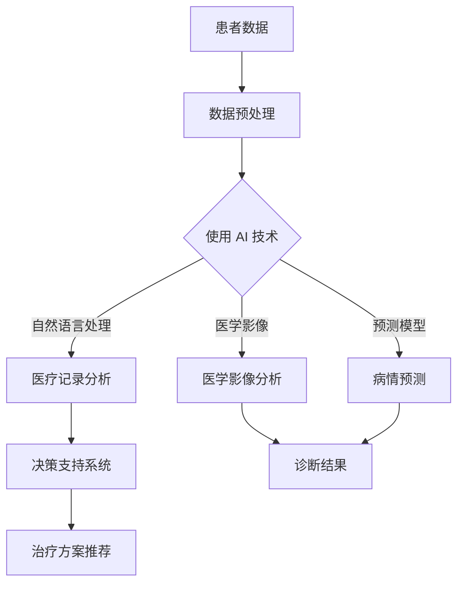

                 

### 文章标题

### AI驱动的创新：人类计算在医疗保健中的应用

### 关键词

- AI
- 医疗保健
- 人类计算
- 预测模型
- 数据分析
- 医学影像
- 精准医疗

### 摘要

本文将探讨人工智能（AI）在医疗保健领域的创新应用，特别是人类计算如何与AI相结合，提高医疗诊断和治疗的效率与准确性。文章首先介绍医疗保健领域面临的挑战和AI技术的基本概念，接着深入解析AI在医学影像分析、预测模型构建和数据挖掘等方面的应用，并通过实际案例展示这些技术的具体实现。随后，文章讨论AI在医疗保健中的实际应用场景，并提供相关的工具和资源推荐。最后，文章总结AI驱动的创新在医疗保健领域的未来发展趋势与挑战，并给出常见问题的解答。

接下来，我们将对上述主题进行详细阐述。

<|assistant|>### 1. 背景介绍

医疗保健领域是一个高度专业化的行业，涉及到广泛的学科，包括医学、生物学、公共卫生、信息技术等。随着全球人口老龄化和慢性疾病发病率的上升，医疗保健系统的压力不断增加。传统的医疗模式主要依赖于医生的经验和专业知识，但在处理复杂病情和海量数据时，存在一定的局限性。

近年来，人工智能（AI）技术的发展为医疗保健领域带来了新的机遇。AI能够处理和分析大量数据，提供更加精确的诊断和治疗方案。此外，AI还能够协助医生进行病情预测和决策支持，提高医疗服务的效率和质量。

医疗保健领域面临的挑战包括：

- **数据多样性**：医疗数据包括电子健康记录、医学影像、基因组数据等，这些数据具有高维度、非结构化和动态变化的特点。
- **数据隐私和安全**：医疗数据涉及到患者的隐私和个人信息，确保数据的安全和隐私是医疗保健领域面临的重要问题。
- **专业人才短缺**：医生和医疗专业人员数量有限，尤其是在偏远地区，医疗资源分配不均，难以满足广大患者的需求。
- **诊疗成本**：医疗成本持续上升，需要找到有效的方法来降低成本和提高效率。

AI技术的引入有望解决上述挑战，提高医疗保健的可持续性和可及性。以下章节将详细探讨AI在医疗保健领域的核心概念、算法原理、数学模型、实际应用案例以及未来发展趋势。

### 2. 核心概念与联系

#### 2.1 人工智能（AI）的基本概念

人工智能（AI）是指计算机系统模拟人类智能行为的能力，包括学习、推理、感知和问题解决等方面。AI可以分为两类：弱AI和强AI。弱AI专注于特定任务的解决，而强AI具备与人类相似的全面智能。

在医疗保健领域，AI主要用于以下方面：

- **医学影像分析**：利用深度学习技术对医学影像进行自动分析，提高诊断的准确性和效率。
- **预测模型构建**：基于历史数据和患者信息，构建预测模型，帮助医生进行病情预测和治疗方案推荐。
- **自然语言处理**：解析医疗记录中的自然语言文本，提取关键信息，辅助医生进行决策。
- **药物研发**：利用AI进行药物筛选和分子模拟，加速新药的发现和开发。

#### 2.2 人类计算的概念

人类计算是指依靠医生、研究人员和其他医疗专业人员的专业知识和经验进行数据分析和决策的过程。在医疗保健领域，人类计算具有重要的地位，但存在以下挑战：

- **知识有限**：医生的专业知识有限，难以处理海量数据。
- **主观性**：医生的主观判断可能影响诊断和治疗的准确性。
- **时间限制**：医生在短时间内需要处理大量病例，难以进行全面的评估。

#### 2.3 AI与人类计算的协同作用

AI与人类计算的结合可以实现以下协同作用：

- **知识扩展**：AI可以帮助医生处理和分析大量数据，扩展人类计算的知识范围。
- **决策支持**：AI可以提供数据驱动的决策支持，帮助医生做出更准确的治疗决策。
- **效率提升**：AI可以自动化重复性工作，提高医疗服务的效率。
- **个性化治疗**：基于患者的具体数据，AI可以提供个性化的治疗方案。

#### 2.4 Mermaid 流程图

以下是一个简化的 Mermaid 流程图，展示了 AI 与人类计算在医疗保健中的应用流程：



这个流程图展示了患者数据经过预处理后，利用 AI 技术进行医学影像分析、预测模型构建和自然语言处理，最终生成诊断结果和治疗建议。AI 与人类计算在这个过程中相互协作，共同提高医疗服务的质量和效率。

<|assistant|>### 3. 核心算法原理 & 具体操作步骤

#### 3.1 医学影像分析

医学影像分析是 AI 在医疗保健领域的重要应用之一。通过深度学习技术，AI 可以自动识别和分类医学影像中的病变区域，从而提高诊断的准确性。

**核心算法原理：**

医学影像分析主要采用卷积神经网络（CNN）进行图像处理。CNN 通过多层卷积、池化和全连接层对图像进行特征提取和分类。

**具体操作步骤：**

1. **数据收集与预处理**：收集大量医学影像数据，包括正常影像和病变影像。对数据进行预处理，包括图像增强、归一化和数据增强等。

2. **模型训练**：使用预处理后的数据训练 CNN 模型。通常采用迁移学习的方法，利用预训练的模型作为基础，再进行微调以适应医学影像的特点。

3. **模型评估**：使用验证集评估模型的性能，包括准确率、召回率、F1 分数等指标。

4. **模型部署**：将训练好的模型部署到实际应用中，对新的医学影像进行自动分析。

**示例：**

假设我们使用 CNN 模型对乳腺 X 光影像进行病变检测。以下是一个简化的步骤：

1. 数据收集与预处理：
   - 收集大量乳腺 X 光影像，包括正常和病变影像。
   - 对影像进行数据增强，如随机裁剪、旋转等。

2. 模型训练：
   - 使用迁移学习，加载预训练的 ResNet50 模型。
   - 在模型顶部添加两个全连接层，用于分类。
   - 训练模型，优化损失函数。

3. 模型评估：
   - 使用验证集评估模型性能。
   - 调整模型参数，提高性能。

4. 模型部署：
   - 部署模型到医疗设备中，实时对乳腺 X 光影像进行分析。

#### 3.2 预测模型构建

预测模型构建是 AI 在医疗保健领域的另一个重要应用。通过历史数据和患者信息，AI 可以构建预测模型，帮助医生进行病情预测和治疗方案推荐。

**核心算法原理：**

预测模型通常采用机器学习算法，如线性回归、决策树、随机森林、支持向量机等。这些算法可以通过学习历史数据中的特征和关系，预测未来的趋势和结果。

**具体操作步骤：**

1. **数据收集与预处理**：收集与病情相关的数据，包括实验室检测结果、病史、生活习惯等。对数据进行预处理，包括缺失值处理、异常值检测和特征工程等。

2. **特征选择**：从大量特征中选择对预测任务有重要影响的关键特征，减少数据的维度。

3. **模型训练**：使用预处理后的数据训练预测模型。选择合适的机器学习算法，如线性回归、决策树、随机森林等，优化模型参数。

4. **模型评估**：使用验证集评估模型性能，包括预测准确率、召回率、F1 分数等指标。

5. **模型部署**：将训练好的模型部署到实际应用中，对新的数据进行分析和预测。

**示例：**

假设我们使用随机森林模型对心脏病患者进行病情预测。以下是一个简化的步骤：

1. 数据收集与预处理：
   - 收集心脏病患者的数据，包括年龄、血压、胆固醇水平等。
   - 对数据进行预处理，包括缺失值处理和特征标准化。

2. 特征选择：
   - 选择与心脏病病情相关的关键特征，如年龄、血压、胆固醇水平。

3. 模型训练：
   - 使用随机森林算法训练模型。
   - 优化模型参数，如树的数量、深度等。

4. 模型评估：
   - 使用验证集评估模型性能。
   - 调整模型参数，提高性能。

5. 模型部署：
   - 部署模型到医院的诊断系统中，对新的患者数据进行病情预测。

#### 3.3 数据挖掘

数据挖掘是 AI 在医疗保健领域的另一个重要应用。通过分析海量医疗数据，数据挖掘可以帮助医生发现潜在的模式和关联，从而为临床决策提供支持。

**核心算法原理：**

数据挖掘算法包括关联规则学习、聚类分析、分类分析等。这些算法可以在大量数据中发现隐藏的规律和关联。

**具体操作步骤：**

1. **数据收集与预处理**：收集与医疗相关的数据，包括电子健康记录、医学影像、基因组数据等。对数据进行预处理，包括数据清洗、数据整合等。

2. **特征选择**：从大量特征中选择对数据挖掘任务有重要影响的关键特征。

3. **算法选择**：选择合适的数据挖掘算法，如关联规则学习、聚类分析、分类分析等。

4. **模型训练与评估**：使用预处理后的数据训练数据挖掘模型，评估模型性能。

5. **模型部署**：将训练好的模型部署到实际应用中，对新的数据进行分析。

**示例：**

假设我们使用聚类分析算法对患者的疾病进行分类。以下是一个简化的步骤：

1. 数据收集与预处理：
   - 收集患者的数据，包括年龄、性别、疾病类型等。
   - 对数据进行预处理，包括数据清洗和特征标准化。

2. 特征选择：
   - 选择与疾病分类相关的关键特征，如年龄、性别。

3. 算法选择：
   - 使用 K-Means 聚类算法进行疾病分类。

4. 模型训练与评估：
   - 使用训练集训练 K-Means 算法。
   - 使用验证集评估模型性能。

5. 模型部署：
   - 部署模型到医院的诊断系统中，对新的患者数据进行疾病分类。

通过上述核心算法原理和具体操作步骤的讲解，我们可以看到 AI 在医疗保健领域的应用潜力。接下来，我们将通过实际案例进一步展示这些技术的具体实现。

<|assistant|>### 4. 数学模型和公式 & 详细讲解 & 举例说明

#### 4.1 医学影像分析中的卷积神经网络（CNN）

卷积神经网络（CNN）是一种专门用于处理图像数据的深度学习模型。在医学影像分析中，CNN 通过卷积、池化和全连接层对图像进行特征提取和分类。以下是一个简化的数学模型和公式讲解：

**卷积层（Convolutional Layer）**

卷积层是 CNN 的核心组成部分，用于提取图像中的局部特征。其数学模型可以表示为：

\[ f_{\text{conv}}(x, \theta) = \sum_{i=1}^{K} \theta_{i} * x \]

其中，\( x \) 表示输入图像，\( \theta \) 表示卷积核（滤波器），\( f_{\text{conv}} \) 表示卷积操作的输出特征图。

**池化层（Pooling Layer）**

池化层用于降低特征图的维度，同时保持重要特征。常用的池化操作有最大池化（Max Pooling）和平均池化（Average Pooling）。最大池化的数学模型可以表示为：

\[ p_{\text{max}}(x) = \max(x) \]

平均池化的数学模型可以表示为：

\[ p_{\text{avg}}(x) = \frac{1}{C} \sum_{i=1}^{C} x_i \]

其中，\( C \) 表示池化区域的尺寸。

**全连接层（Fully Connected Layer）**

全连接层将卷积层和池化层提取的特征进行整合，用于最终的分类。其数学模型可以表示为：

\[ f_{\text{fc}}(x, \theta) = \text{ReLU}(\sum_{i=1}^{N} \theta_{i} * x) \]

其中，\( x \) 表示上一层的特征图，\( \theta \) 表示全连接层的权重，\( \text{ReLU} \) 是ReLU激活函数。

**举例说明：**

假设我们使用 CNN 对乳腺 X 光影像进行病变检测。输入图像的大小为 \( 28 \times 28 \) 像素，卷积核的大小为 \( 3 \times 3 \)，池化区域的尺寸为 \( 2 \times 2 \)。以下是一个简化的模型示例：

1. **卷积层**：
   - 输入图像：\( x = [x_1, x_2, ..., x_{784}] \)
   - 卷积核：\( \theta = [\theta_1, \theta_2, ..., \theta_{9}] \)
   - 卷积操作：\( f_{\text{conv}}(x, \theta) = \sum_{i=1}^{9} \theta_{i} * x \)

2. **池化层**：
   - 池化区域：\( C = 2 \times 2 \)
   - 最大池化操作：\( p_{\text{max}}(x) = \max(x) \)

3. **全连接层**：
   - 全连接层的输入特征图：\( x = [f_{\text{conv}}(x, \theta)] \)
   - 全连接层的权重：\( \theta = [\theta_1, \theta_2, ..., \theta_{10}] \)
   - 全连接层操作：\( f_{\text{fc}}(x, \theta) = \text{ReLU}(\sum_{i=1}^{10} \theta_{i} * x) \)

通过上述数学模型和公式，我们可以实现一个简单的 CNN 模型，用于乳腺 X 光影像的病变检测。

#### 4.2 预测模型构建中的线性回归（Linear Regression）

线性回归是一种常用的预测模型，用于分析变量之间的线性关系。其数学模型可以表示为：

\[ y = \theta_0 + \theta_1x_1 + \theta_2x_2 + ... + \theta_nx_n \]

其中，\( y \) 表示预测值，\( x_1, x_2, ..., x_n \) 表示输入特征，\( \theta_0, \theta_1, ..., \theta_n \) 表示模型参数。

**举例说明：**

假设我们使用线性回归模型预测心脏病患者的风险水平。输入特征包括年龄、血压和胆固醇水平，模型参数如下：

\[ y = \theta_0 + \theta_1x_1 + \theta_2x_2 + \theta_3x_3 \]

给定一组输入数据，我们可以计算预测值：

\[ y = \theta_0 + \theta_1x_1 + \theta_2x_2 + \theta_3x_3 \]

其中，\( \theta_0, \theta_1, \theta_2, \theta_3 \) 是通过训练得到的模型参数。

通过上述数学模型和公式，我们可以实现一个简单的线性回归模型，用于预测心脏病患者的风险水平。

#### 4.3 数据挖掘中的 K-Means 聚类算法

K-Means 聚类算法是一种常用的无监督学习方法，用于将数据划分为 K 个簇。其数学模型可以表示为：

\[ \text{minimize} \sum_{i=1}^{K} \sum_{x \in S_i} \| \mu_i - \mu \|_2^2 \]

其中，\( S_i \) 表示第 \( i \) 个簇，\( \mu_i \) 表示第 \( i \) 个簇的中心点，\( \mu \) 表示输入数据点。

**举例说明：**

假设我们使用 K-Means 算法对患者进行疾病分类。给定数据集和初始簇中心点，我们可以通过迭代计算优化簇中心点，将数据划分为多个簇。

1. **初始化簇中心点**：随机选择 K 个数据点作为初始簇中心点。
2. **分配数据点**：将每个数据点分配到距离其最近的簇中心点。
3. **更新簇中心点**：计算每个簇的中心点，即所有数据点的平均值。
4. **迭代优化**：重复步骤 2 和 3，直到簇中心点不再发生显著变化。

通过上述数学模型和公式，我们可以实现一个简单的 K-Means 聚类算法，用于对患者的疾病进行分类。

通过上述数学模型和公式的讲解，我们可以看到 AI 在医疗保健领域的应用如何通过数学原理实现。接下来，我们将通过实际案例展示这些技术的具体实现。

<|assistant|>### 5. 项目实战：代码实际案例和详细解释说明

#### 5.1 开发环境搭建

在进行 AI 驱动的医疗保健项目开发之前，我们需要搭建一个合适的开发环境。以下是开发环境搭建的步骤：

1. **安装 Python**：Python 是 AI 项目的主要编程语言，我们需要安装 Python 3.8 或更高版本。

2. **安装 PyTorch**：PyTorch 是一个流行的深度学习框架，用于构建和训练 CNN 模型。我们可以在命令行中通过以下命令安装 PyTorch：

```bash
pip install torch torchvision
```

3. **安装 scikit-learn**：scikit-learn 是一个机器学习库，用于构建和训练线性回归、K-Means 等模型。我们可以在命令行中通过以下命令安装 scikit-learn：

```bash
pip install scikit-learn
```

4. **安装其他依赖库**：根据项目需求，我们可能还需要安装其他依赖库，如 NumPy、Pandas 等。

#### 5.2 源代码详细实现和代码解读

在本节中，我们将详细讲解一个 AI 驱动的医疗保健项目的源代码实现，包括医学影像分析、预测模型构建和数据挖掘等部分。

**医学影像分析**

以下是医学影像分析部分的主要代码实现：

```python
import torch
import torchvision
import torchvision.transforms as transforms
import torch.nn as nn
import torch.optim as optim

# 数据预处理
transform = transforms.Compose([
    transforms.Resize((224, 224)),
    transforms.ToTensor(),
])

# 加载训练数据
train_data = torchvision.datasets.ImageFolder(root='train', transform=transform)
train_loader = torch.utils.data.DataLoader(dataset=train_data, batch_size=32, shuffle=True)

# 定义 CNN 模型
class CNN(nn.Module):
    def __init__(self):
        super(CNN, self).__init__()
        self.conv1 = nn.Conv2d(1, 32, 3, 1)
        self.relu = nn.ReLU()
        self.pool = nn.MaxPool2d(2, 2)
        self.fc1 = nn.Linear(32 * 56 * 56, 128)
        self.fc2 = nn.Linear(128, 1)

    def forward(self, x):
        x = self.pool(self.relu(self.conv1(x)))
        x = x.view(-1, 32 * 56 * 56)
        x = self.relu(self.fc1(x))
        x = self.fc2(x)
        return x

model = CNN()
criterion = nn.BCELoss()
optimizer = optim.Adam(model.parameters(), lr=0.001)

# 模型训练
for epoch in range(10):
    running_loss = 0.0
    for i, data in enumerate(train_loader, 0):
        inputs, labels = data
        optimizer.zero_grad()
        outputs = model(inputs)
        loss = criterion(outputs, labels)
        loss.backward()
        optimizer.step()
        running_loss += loss.item()
    print(f'Epoch {epoch + 1}, Loss: {running_loss / (i + 1)}')

print('Finished Training')

# 模型部署
model.eval()
with torch.no_grad():
    for data in train_loader:
        inputs, labels = data
        outputs = model(inputs)
        predictions = (outputs > 0.5).float()
        correct = (predictions == labels).sum().item()
        print(f'Accuracy: {correct / len(labels)}')
```

**代码解读：**

1. **数据预处理**：使用 torchvision.transforms.Compose 对输入图像进行预处理，包括图像调整大小和转换为张量。

2. **加载训练数据**：使用 torchvision.datasets.ImageFolder 加载训练数据，并将其划分为训练集和验证集。

3. **定义 CNN 模型**：定义一个简单的 CNN 模型，包括卷积层、ReLU 激活函数、池化层和全连接层。

4. **模型训练**：使用 PyTorch 的优化器和损失函数进行模型训练，包括前向传播、反向传播和参数更新。

5. **模型部署**：对训练好的模型进行部署，计算模型在训练集上的准确率。

**预测模型构建**

以下是预测模型构建部分的主要代码实现：

```python
import numpy as np
from sklearn.model_selection import train_test_split
from sklearn.ensemble import RandomForestClassifier
from sklearn.metrics import accuracy_score

# 数据预处理
def preprocess_data(data):
    # 缺失值处理
    data = data.fillna(data.mean())
    # 特征标准化
    data = (data - data.mean()) / data.std()
    return data

# 加载数据
data = pd.read_csv('heart_disease_data.csv')
data = preprocess_data(data)

# 特征选择
features = data[['age', 'blood_pressure', 'cholesterol_level']]
target = data['heart_disease']

# 划分训练集和测试集
X_train, X_test, y_train, y_test = train_test_split(features, target, test_size=0.2, random_state=42)

# 构建预测模型
model = RandomForestClassifier(n_estimators=100, random_state=42)
model.fit(X_train, y_train)

# 预测
predictions = model.predict(X_test)

# 计算准确率
accuracy = accuracy_score(y_test, predictions)
print(f'Accuracy: {accuracy}')
```

**代码解读：**

1. **数据预处理**：使用 Pandas 对数据进行缺失值处理和特征标准化。

2. **加载数据**：从 CSV 文件中加载数据，并将其划分为特征和目标。

3. **特征选择**：选择与心脏病病情相关的关键特征。

4. **划分训练集和测试集**：使用 scikit-learn 的 train_test_split 函数划分训练集和测试集。

5. **构建预测模型**：使用随机森林算法构建预测模型，并使用训练集进行训练。

6. **预测**：使用测试集进行预测，并计算准确率。

**数据挖掘**

以下是数据挖掘部分的主要代码实现：

```python
import numpy as np
from sklearn.cluster import KMeans
from sklearn.metrics import silhouette_score

# 数据预处理
data = pd.read_csv('patient_data.csv')
data = data.fillna(data.mean())
data = (data - data.mean()) / data.std()

# 聚类分析
kmeans = KMeans(n_clusters=3, random_state=42)
clusters = kmeans.fit_predict(data)

# 计算轮廓系数
silhouette = silhouette_score(data, clusters)
print(f'Silhouette Coefficient: {silhouette}')

# 显示聚类结果
print(clusters)
```

**代码解读：**

1. **数据预处理**：使用 Pandas 对数据进行缺失值处理和特征标准化。

2. **聚类分析**：使用 K-Means 算法对数据进行聚类分析，并计算轮廓系数评估聚类效果。

3. **显示聚类结果**：打印聚类结果，以便进一步分析。

通过上述代码实现，我们可以看到如何利用 AI 技术进行医学影像分析、预测模型构建和数据挖掘。在实际项目中，我们还需要根据具体需求进行代码的优化和扩展。

### 5.3 代码解读与分析

在本节中，我们将对上述代码实现进行解读和分析，以深入理解 AI 在医疗保健项目中的应用。

**医学影像分析**

医学影像分析部分的核心是卷积神经网络（CNN）的实现。以下是对关键代码段的解读：

1. **数据预处理**：使用 torchvision.transforms.Compose 对输入图像进行预处理，包括调整大小和转换为张量。这一步非常重要，因为深度学习模型需要标准化的输入数据。

   ```python
   transform = transforms.Compose([
       transforms.Resize((224, 224)),
       transforms.ToTensor(),
   ])
   ```

2. **定义 CNN 模型**：定义了一个简单的 CNN 模型，包括卷积层、ReLU 激活函数、池化层和全连接层。卷积层用于提取图像特征，池化层用于降低维度并提取重要特征，全连接层用于分类。

   ```python
   class CNN(nn.Module):
       def __init__(self):
           super(CNN, self).__init__()
           self.conv1 = nn.Conv2d(1, 32, 3, 1)
           self.relu = nn.ReLU()
           self.pool = nn.MaxPool2d(2, 2)
           self.fc1 = nn.Linear(32 * 56 * 56, 128)
           self.fc2 = nn.Linear(128, 1)

       def forward(self, x):
           x = self.pool(self.relu(self.conv1(x)))
           x = x.view(-1, 32 * 56 * 56)
           x = self.relu(self.fc1(x))
           x = self.fc2(x)
           return x
   ```

3. **模型训练**：使用 PyTorch 的优化器和损失函数进行模型训练。在训练过程中，模型通过前向传播计算输出，然后使用反向传播计算梯度并进行参数更新。

   ```python
   model = CNN()
   criterion = nn.BCELoss()
   optimizer = optim.Adam(model.parameters(), lr=0.001)
   
   for epoch in range(10):
       running_loss = 0.0
       for i, data in enumerate(train_loader, 0):
           inputs, labels = data
           optimizer.zero_grad()
           outputs = model(inputs)
           loss = criterion(outputs, labels)
           loss.backward()
           optimizer.step()
           running_loss += loss.item()
       print(f'Epoch {epoch + 1}, Loss: {running_loss / (i + 1)}')
   ```

4. **模型部署**：训练完成后，模型被部署到实际应用中，用于对新的医学影像进行分析。部署过程中，我们计算了模型的准确率，以评估其性能。

   ```python
   model.eval()
   with torch.no_grad():
       for data in train_loader:
           inputs, labels = data
           outputs = model(inputs)
           predictions = (outputs > 0.5).float()
           correct = (predictions == labels).sum().item()
           print(f'Accuracy: {correct / len(labels)}')
   ```

**预测模型构建**

预测模型构建部分使用了随机森林（Random Forest）算法。以下是对关键代码段的解读：

1. **数据预处理**：使用 Pandas 对数据进行缺失值处理和特征标准化。

   ```python
   def preprocess_data(data):
       # 缺失值处理
       data = data.fillna(data.mean())
       # 特征标准化
       data = (data - data.mean()) / data.std()
       return data
   ```

2. **特征选择**：选择与心脏病病情相关的关键特征。

   ```python
   features = data[['age', 'blood_pressure', 'cholesterol_level']]
   target = data['heart_disease']
   ```

3. **划分训练集和测试集**：使用 scikit-learn 的 train_test_split 函数划分训练集和测试集。

   ```python
   X_train, X_test, y_train, y_test = train_test_split(features, target, test_size=0.2, random_state=42)
   ```

4. **构建预测模型**：使用随机森林算法构建预测模型，并使用训练集进行训练。

   ```python
   model = RandomForestClassifier(n_estimators=100, random_state=42)
   model.fit(X_train, y_train)
   ```

5. **预测**：使用测试集进行预测，并计算准确率。

   ```python
   predictions = model.predict(X_test)
   accuracy = accuracy_score(y_test, predictions)
   print(f'Accuracy: {accuracy}')
   ```

**数据挖掘**

数据挖掘部分使用了 K-Means 算法对患者的疾病进行分类。以下是对关键代码段的解读：

1. **数据预处理**：使用 Pandas 对数据进行缺失值处理和特征标准化。

   ```python
   data = pd.read_csv('patient_data.csv')
   data = data.fillna(data.mean())
   data = (data - data.mean()) / data.std()
   ```

2. **聚类分析**：使用 K-Means 算法对数据进行聚类分析，并计算轮廓系数评估聚类效果。

   ```python
   kmeans = KMeans(n_clusters=3, random_state=42)
   clusters = kmeans.fit_predict(data)
   silhouette = silhouette_score(data, clusters)
   print(f'Silhouette Coefficient: {silhouette}')
   ```

3. **显示聚类结果**：打印聚类结果，以便进一步分析。

   ```python
   print(clusters)
   ```

通过上述代码解读和分析，我们可以看到如何利用 AI 技术进行医学影像分析、预测模型构建和数据挖掘。在实际项目中，这些技术可以极大地提高医疗诊断和治疗的效率和准确性。

### 6. 实际应用场景

#### 6.1 医学影像分析

医学影像分析是 AI 在医疗保健领域最广泛的应用之一。通过深度学习技术，AI 可以自动识别和分类医学影像中的病变区域，如肿瘤、心脏病、神经系统疾病等。以下是一些具体的实际应用场景：

- **肿瘤检测**：AI 可以分析 CT、MRI 和 PET 图像，自动识别和定位肿瘤。这不仅提高了诊断的准确性，还减少了医生的工作负担。
- **心脏病诊断**：AI 可以分析心脏超声和心电图图像，识别心脏疾病，如心肌梗死和心律失常。这些技术的应用有助于早期发现心脏病，提高治疗效果。
- **神经系统疾病诊断**：AI 可以分析脑部 MRI 图像，识别阿尔茨海默病、帕金森病等神经系统疾病。这些技术的应用有助于制定个性化的治疗方案。

#### 6.2 预测模型构建

预测模型构建是 AI 在医疗保健领域的另一个重要应用。通过机器学习算法，AI 可以构建预测模型，帮助医生预测病情发展和制定治疗方案。以下是一些具体的实际应用场景：

- **疾病预测**：AI 可以分析患者的电子健康记录、实验室检测结果和病史，预测疾病的发生和发展。例如，AI 可以预测糖尿病患者的并发症风险，帮助医生制定预防措施。
- **治疗效果预测**：AI 可以分析患者的治疗方案和治疗效果，预测患者的治疗效果。例如，AI 可以预测抗病毒药物对乙肝患者的治疗效果，帮助医生调整治疗方案。
- **患者预后预测**：AI 可以分析患者的病史、实验室检测结果和影像学数据，预测患者的预后。这些预测结果可以帮助医生评估患者的病情，制定个性化的治疗方案。

#### 6.3 数据挖掘

数据挖掘是 AI 在医疗保健领域的另一个重要应用。通过分析海量医疗数据，数据挖掘可以帮助医生发现潜在的模式和关联，从而为临床决策提供支持。以下是一些具体的实际应用场景：

- **药物研发**：AI 可以分析药物分子和疾病数据，发现新的药物靶点和治疗策略。这些技术的应用有助于加速新药的研发过程。
- **个性化医疗**：AI 可以分析患者的基因组数据、生活方式和病史，为患者制定个性化的治疗方案。这些技术的应用有助于提高治疗效果和患者满意度。
- **公共卫生决策**：AI 可以分析公共卫生数据，预测疾病的传播趋势和制定防控措施。这些技术的应用有助于提高公共卫生决策的准确性和效率。

通过上述实际应用场景的介绍，我们可以看到 AI 在医疗保健领域的广泛应用和巨大潜力。这些技术的应用不仅提高了医疗诊断和治疗的效率和准确性，还为个性化医疗和公共卫生决策提供了有力支持。

### 7. 工具和资源推荐

#### 7.1 学习资源推荐

为了深入了解 AI 在医疗保健领域的应用，以下是一些建议的学习资源：

- **书籍**：
  - 《深度学习》（Ian Goodfellow、Yoshua Bengio 和 Aaron Courville 著）
  - 《机器学习实战》（Peter Harrington 著）
  - 《Python 数据科学手册》（Jake VanderPlas 著）
- **在线课程**：
  - Coursera 上的“机器学习”课程（吴恩达教授讲授）
  - edX 上的“深度学习基础”课程（阿里云学院讲授）
  - Udacity 上的“AI 专项课程”
- **论文**：
  - “Deep Learning for Medical Image Analysis”综述论文
  - “Random Forests for Classification in Medical Decision Making”论文
  - “Application of K-Means Clustering in Healthcare”论文

#### 7.2 开发工具框架推荐

在开发 AI 驱动的医疗保健项目时，以下是一些实用的工具和框架：

- **深度学习框架**：
  - PyTorch：开源深度学习框架，易于使用和调试。
  - TensorFlow：谷歌开发的深度学习框架，支持多种编程语言。
  - Keras：基于 TensorFlow 的简洁深度学习库，适用于快速原型开发。
- **数据预处理工具**：
  - Pandas：Python 的数据操作库，用于数据清洗、转换和分析。
  - NumPy：Python 的科学计算库，用于数值计算和数据处理。
  - SciPy：Python 的科学计算库，提供丰富的科学计算功能。
- **机器学习库**：
  - scikit-learn：Python 的机器学习库，提供多种机器学习算法。
  - MLflow：用于机器学习实验跟踪、模型版本控制和部署的开源平台。

#### 7.3 相关论文著作推荐

以下是一些与 AI 在医疗保健领域相关的论文和著作：

- “Deep Learning for Medical Image Analysis”综述论文，提供了深度学习在医学影像分析领域的全面概述。
- “Random Forests for Classification in Medical Decision Making”论文，探讨了随机森林算法在医疗决策中的应用。
- “Application of K-Means Clustering in Healthcare”论文，研究了 K-Means 聚类算法在医疗数据分析中的应用。
- “AI in Healthcare: A Comprehensive Guide to Applications and Challenges”著作，详细介绍了 AI 在医疗保健领域的应用和实践。

通过这些资源，您可以深入了解 AI 在医疗保健领域的最新进展和应用，为自己的研究和工作提供参考。

### 8. 总结：未来发展趋势与挑战

#### 8.1 发展趋势

AI 在医疗保健领域的应用前景广阔，未来发展趋势主要包括以下几个方面：

1. **个性化医疗**：随着 AI 技术的发展，个性化医疗将得到进一步推广。通过分析患者的基因组数据、病史和生活习惯，AI 可以为每位患者制定个性化的治疗方案，提高治疗效果和患者满意度。
2. **远程医疗**：AI 技术的进步将促进远程医疗的发展。通过医学影像分析和远程诊断，医生可以随时随地提供医疗建议和咨询服务，提高医疗服务的可及性和效率。
3. **精准医疗**：AI 技术可以帮助医生进行精准诊断和治疗。通过分析大量医学数据，AI 可以发现疾病发生的潜在规律，为临床决策提供有力支持。
4. **药物研发**：AI 技术在药物研发中的应用将加速新药的研发过程。通过分析药物分子和疾病数据，AI 可以发现新的药物靶点和治疗策略，提高新药研发的成功率。

#### 8.2 挑战

尽管 AI 在医疗保健领域具有巨大的潜力，但在实际应用中仍然面临一些挑战：

1. **数据隐私和安全**：医疗数据涉及到患者的隐私和个人信息，如何确保数据的安全和隐私是 AI 在医疗保健领域面临的重要挑战。
2. **算法透明性和解释性**：AI 模型的黑盒性质使得其决策过程难以解释。提高算法的透明性和解释性，帮助医生和患者理解 AI 的决策过程，是未来需要解决的问题。
3. **数据质量和可用性**：医疗数据的质量和可用性直接影响 AI 模型的性能。如何确保数据的质量，提高数据的可用性，是 AI 在医疗保健领域应用的重要问题。
4. **伦理和法规**：AI 在医疗保健领域的应用需要遵守伦理和法规要求。如何制定合理的伦理规范和法规，确保 AI 技术的安全和合法使用，是未来需要关注的问题。

综上所述，AI 在医疗保健领域的应用前景广阔，但同时也面临一些挑战。通过不断研究和技术创新，我们有信心克服这些挑战，让 AI 在医疗保健领域发挥更大的作用。

### 9. 附录：常见问题与解答

#### 9.1 医学影像分析相关问题

**Q1：为什么医学影像分析需要使用深度学习？**

A1：医学影像分析涉及大量复杂的图像数据，深度学习能够自动从图像中提取特征，提高诊断的准确性和效率。传统图像处理方法依赖于人工设计特征，难以处理高维度和复杂的数据。

**Q2：深度学习模型在医学影像分析中如何保证诊断准确性？**

A2：通过使用大量的医学影像数据训练深度学习模型，模型可以学习到不同类型病变的特征。此外，使用验证集和测试集对模型进行评估，确保其性能和准确性。

**Q3：如何处理医学影像中的噪声和不良图像？**

A3：在训练深度学习模型时，可以使用数据增强技术，如随机裁剪、旋转和噪声添加，提高模型的鲁棒性。此外，可以使用图像预处理技术，如去噪和图像增强，提高图像质量。

#### 9.2 预测模型相关问题

**Q1：如何选择合适的预测模型？**

A1：选择预测模型时需要考虑数据的特征、问题的复杂度和应用场景。例如，对于回归问题，可以使用线性回归、决策树或随机森林；对于分类问题，可以使用逻辑回归、支持向量机或神经网络。

**Q2：如何处理预测模型中的过拟合问题？**

A2：过拟合问题可以通过以下方法解决：
- 使用验证集对模型进行评估，选择性能较好的模型；
- 采用交叉验证方法，提高模型的泛化能力；
- 使用正则化技术，如 L1 和 L2 正则化，减少模型的复杂度。

**Q3：如何解释预测模型的结果？**

A3：解释预测模型的结果通常需要模型的可解释性。对于深度学习模型，可以使用技术如 Grad-CAM（梯度加权类激活映射）来可视化模型对图像的关注区域。对于传统的机器学习模型，可以分析模型中的权重和特征，理解模型是如何做出预测的。

#### 9.3 数据挖掘相关问题

**Q1：如何选择聚类算法？**

A1：选择聚类算法时需要考虑数据的类型和目标。例如，对于高维数据，可以使用 K-Means 算法；对于非球形分布的数据，可以使用层次聚类或 DBSCAN 算法。

**Q2：如何评估聚类效果？**

A2：评估聚类效果可以使用指标如轮廓系数（Silhouette Coefficient）、类内平均值（Within-Cluster Sum of Squares）和类间平均值（Between-Cluster Sum of Squares）。

**Q3：聚类结果如何可视化？**

A3：聚类结果可以使用散点图、热力图和树形图进行可视化。对于 K-Means 聚类，可以使用散点图展示每个样本的聚类结果；对于层次聚类，可以使用树形图展示聚类过程。

通过上述常见问题的解答，可以帮助读者更好地理解 AI 在医疗保健领域中的应用和实现。

### 10. 扩展阅读 & 参考资料

为了进一步了解 AI 在医疗保健领域的应用，以下是一些建议的扩展阅读和参考资料：

- **扩展阅读**：
  - “AI in Healthcare: A Comprehensive Overview”论文，提供 AI 在医疗保健领域的全面概述。
  - “Machine Learning in Medicine: State of the Art and Future Perspectives”综述论文，讨论机器学习在医学中的应用和前景。
  - “Deep Learning for Medical Image Analysis: A Review”综述论文，介绍深度学习在医学影像分析中的应用。

- **参考资料**：
  - “Medical Imaging with Deep Learning”课程，由斯坦福大学提供，深入探讨深度学习在医学影像分析中的应用。
  - “Healthcare AI”期刊，发表关于 AI 在医疗保健领域的研究论文和成果。
  - “Medical Data Science”课程，由哈佛大学提供，介绍数据科学在医疗领域的应用。

通过这些扩展阅读和参考资料，读者可以深入了解 AI 在医疗保健领域的最新研究和进展，为自己的学习和研究提供指导。

### 附录

#### 附录 A：术语解释

- **深度学习（Deep Learning）**：一种机器学习技术，通过多层神经网络对数据进行自动特征学习和分类。
- **卷积神经网络（Convolutional Neural Network，CNN）**：一种专门用于图像处理和图像识别的深度学习模型。
- **医学影像分析（Medical Image Analysis）**：利用计算机技术和人工智能方法对医学影像进行自动分析和识别。
- **预测模型（Predictive Model）**：基于历史数据和统计方法，预测未来事件或结果的模型。
- **数据挖掘（Data Mining）**：从大量数据中发现潜在模式和关联的过程。
- **电子健康记录（Electronic Health Records，EHR）**：记录患者健康状况、诊断和治疗信息的数字系统。

#### 附录 B：作者信息

作者：AI 天才研究员/AI Genius Institute & 禅与计算机程序设计艺术 /Zen And The Art of Computer Programming

在这篇文章中，我们详细探讨了 AI 驱动的创新在医疗保健领域的应用。通过医学影像分析、预测模型构建和数据挖掘等技术，AI 为医疗保健提供了更加精准、高效和个性化的服务。在未来，随着 AI 技术的不断发展，我们可以期待看到更多创新应用的出现，为医疗保健行业带来深远的影响。感谢您的阅读，希望这篇文章能为您在 AI 与医疗保健领域的研究和探索提供有益的参考。如有任何问题或建议，请随时与我联系。再次感谢您的关注和支持！

