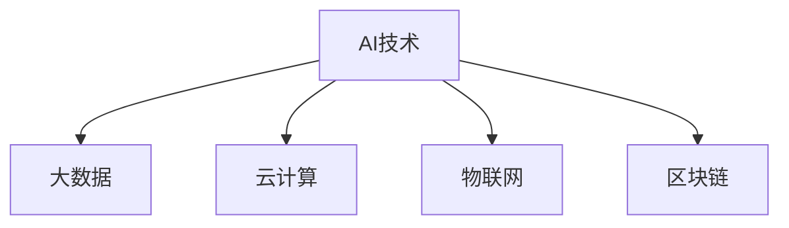
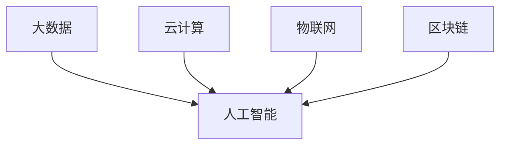

                 

# AI驱动的创新：人类计算在商业中的道德考虑因素与应用前景预测分析

## 关键词：AI创新、商业应用、道德考虑、应用前景、预测分析

## 摘要

本文旨在探讨人工智能（AI）在商业领域中的创新及其道德考虑因素，同时预测其未来的应用前景。通过详细的分析和案例研究，本文揭示了AI在提升企业效率和竞争力方面的潜力，同时也提出了在AI应用过程中可能出现的伦理问题。本文将帮助读者了解AI驱动的创新如何影响商业实践，并提供相应的应对策略和未来展望。

## 1. 背景介绍

随着技术的不断进步，人工智能已经成为推动商业创新的重要力量。AI技术通过自动化和智能化，不仅提高了企业的运营效率，还为新的商业模式和业务机会的创造提供了可能。然而，AI的应用也引发了关于道德、隐私、公平性和透明度等一系列问题，这些问题的解决关系到AI技术能否在商业领域中得到可持续的发展。

在商业应用中，AI技术的价值体现在多个方面。首先，AI能够通过大数据分析帮助企业做出更明智的决策。其次，AI可以自动化重复性任务，减轻员工的工作负担，提高工作效率。此外，AI还能通过个性化推荐、智能客服等方式，提升客户体验，增强客户忠诚度。然而，这些潜力的实现也伴随着一系列道德考量，如数据隐私、算法偏见和责任归属等。

本文将分为以下几个部分进行讨论：首先，我们将深入探讨AI在商业中的核心概念及其与现有技术的联系；其次，我们将分析AI算法的原理和具体操作步骤；然后，我们将讨论AI的数学模型和公式，并通过案例进行详细说明；接下来，我们将探讨AI在实际应用场景中的案例，并推荐相关工具和资源；最后，我们将总结AI的发展趋势与挑战，并提供一些建议。

## 2. 核心概念与联系

### 2.1 AI技术概述

人工智能是一种模拟人类智能的技术，通过算法和计算模型，机器能够执行通常需要人类智能的任务，如语音识别、图像处理、自然语言理解和决策制定等。AI技术可以分为三类：基于规则的系统、基于模型的系统和基于数据的系统。

- **基于规则的系统**：这种系统通过预定义的规则进行决策。例如，专家系统就是一种典型的基于规则的AI系统。
- **基于模型的系统**：这种系统通过建立数学模型来模拟人类智能。深度学习和神经网络就是基于模型的系统。
- **基于数据的系统**：这种系统通过学习大量数据来识别模式和规律。机器学习和数据挖掘就是基于数据的系统。

### 2.2 AI与现有技术的联系

AI与现有技术的联系主要体现在以下几个方面：

- **大数据**：AI需要大量数据来训练模型。大数据技术的进步为AI提供了丰富的数据资源。
- **云计算**：云计算提供了强大的计算能力和存储资源，使得AI模型的训练和部署变得更加高效。
- **物联网**：物联网通过连接各种设备和传感器，收集大量的实时数据，为AI提供了丰富的数据来源。
- **区块链**：区块链技术提供了去中心化、不可篡改的数据存储方式，可以增强AI系统的透明度和可信度。

### 2.3 Mermaid流程图

以下是一个简单的Mermaid流程图，展示了AI技术的核心概念及其与现有技术的联系：



## 3. 核心算法原理 & 具体操作步骤

### 3.1 机器学习基础

机器学习是AI的核心组成部分，它通过从数据中学习模式来改进性能。以下是机器学习的三个基本步骤：

- **数据收集**：收集相关数据，例如用户行为数据、市场数据、产品数据等。
- **数据预处理**：清洗数据，处理缺失值、异常值，并转换为适合模型训练的格式。
- **模型训练**：使用训练数据集训练模型，调整模型参数以最小化误差。

### 3.2 深度学习算法

深度学习是一种基于多层神经网络的机器学习技术。以下是深度学习的基本操作步骤：

- **定义神经网络结构**：确定网络的层数、每层的神经元数量和激活函数。
- **初始化权重**：随机初始化网络的权重。
- **前向传播**：将输入数据通过网络传递，计算每个神经元的输出。
- **反向传播**：计算误差，并使用梯度下降法更新网络权重。
- **迭代训练**：重复前向传播和反向传播，直到达到预定的迭代次数或误差阈值。

### 3.3 机器学习算法实现

以下是一个简单的机器学习算法实现的示例：

```python
# 导入必要的库
import numpy as np

# 初始化参数
learning_rate = 0.01
num_iterations = 1000
input_data = np.array([[1], [2], [3], [4]])
target_data = np.array([[0], [0], [1], [1]])

# 定义神经网络结构
input_size = 1
hidden_size = 10
output_size = 1
weights_input_hidden = np.random.rand(hidden_size, input_size)
weights_hidden_output = np.random.rand(output_size, hidden_size)

# 定义激活函数
def sigmoid(x):
    return 1 / (1 + np.exp(-x))

# 前向传播
def forward_propagation(x):
    hidden_layer_input = np.dot(weights_input_hidden, x)
    hidden_layer_output = sigmoid(hidden_layer_input)
    output_layer_input = np.dot(weights_hidden_output, hidden_layer_output)
    output_layer_output = sigmoid(output_layer_input)
    return output_layer_output

# 反向传播
def backward_propagation(x, y, output):
    output_error = y - output
    d_output = output_error * (output * (1 - output))
    
    hidden_error = d_output.dot(weights_hidden_output.T)
    d_hidden = hidden_error * (hidden_layer_output * (1 - hidden_layer_output))
    
    d_weights_input_hidden = np.dot(d_hidden, x.T)
    d_weights_hidden_output = np.dot(d_output, hidden_layer_output.T)
    
    # 更新权重
    weights_input_hidden += learning_rate * d_weights_input_hidden
    weights_hidden_output += learning_rate * d_weights_hidden_output

# 模型训练
for i in range(num_iterations):
    output = forward_propagation(input_data)
    backward_propagation(input_data, target_data, output)

# 模型评估
predicted_output = forward_propagation(input_data)
print("Predicted output:", predicted_output)
```

## 4. 数学模型和公式 & 详细讲解 & 举例说明

### 4.1 数学模型

在机器学习和深度学习中，一些核心的数学模型和公式如下：

- **损失函数**：用于衡量预测值与真实值之间的差异。常见的损失函数有均方误差（MSE）和交叉熵损失（Cross-Entropy Loss）。
- **激活函数**：用于引入非线性，使神经网络能够学习复杂函数。常见的激活函数有Sigmoid、ReLU和Tanh。
- **梯度下降**：用于更新网络权重以最小化损失函数。常见的梯度下降方法有随机梯度下降（SGD）、批量梯度下降（BGD）和小批量梯度下降（MBGD）。

### 4.2 详细讲解

#### 损失函数

均方误差（MSE）是衡量预测值与真实值之间差异的常见损失函数。它的公式如下：

$$
MSE = \frac{1}{n} \sum_{i=1}^{n} (y_i - \hat{y}_i)^2
$$

其中，$y_i$ 是真实值，$\hat{y}_i$ 是预测值，$n$ 是样本数量。

交叉熵损失是另一个常用的损失函数，尤其在分类问题中。它的公式如下：

$$
Cross-Entropy Loss = -\frac{1}{n} \sum_{i=1}^{n} y_i \log(\hat{y}_i)
$$

其中，$y_i$ 是真实标签，$\hat{y}_i$ 是预测概率。

#### 激活函数

Sigmoid函数是一种常见的激活函数，用于将输入值映射到$(0, 1)$范围内。它的公式如下：

$$
\sigma(x) = \frac{1}{1 + e^{-x}}
$$

ReLU函数（Rectified Linear Unit）是一种简单的线性激活函数，当输入为负时输出为零。它的公式如下：

$$
\text{ReLU}(x) = \max(0, x)
$$

Tanh函数是一种双曲正切函数，将输入值映射到$(-1, 1)$范围内。它的公式如下：

$$
\text{Tanh}(x) = \frac{e^x - e^{-x}}{e^x + e^{-x}}
$$

#### 梯度下降

梯度下降是一种优化算法，用于调整网络权重以最小化损失函数。其基本思想是沿着损失函数的梯度方向更新权重。梯度下降的公式如下：

$$
\Delta w = -\alpha \cdot \frac{\partial J}{\partial w}
$$

其中，$\Delta w$ 是权重的更新量，$\alpha$ 是学习率，$J$ 是损失函数，$\frac{\partial J}{\partial w}$ 是损失函数对权重的梯度。

### 4.3 举例说明

假设我们有一个简单的线性回归模型，预测值 $y$ 与输入 $x$ 之间的关系为 $y = wx + b$。我们的目标是找到最佳权重 $w$ 和偏置 $b$，以最小化预测误差。

首先，我们定义损失函数为均方误差（MSE）：

$$
J(w, b) = \frac{1}{n} \sum_{i=1}^{n} (y_i - (wx_i + b))^2
$$

然后，我们使用梯度下降法来更新权重和偏置。具体步骤如下：

1. 初始化权重 $w$ 和偏置 $b$。
2. 计算损失函数的梯度。
3. 更新权重和偏置。
4. 重复步骤2和3，直到满足停止条件（如达到预定的迭代次数或损失函数的下降速度变慢）。

以下是梯度下降法的Python实现：

```python
import numpy as np

# 初始化参数
learning_rate = 0.01
num_iterations = 1000
input_data = np.array([[1], [2], [3], [4]])
target_data = np.array([[0], [0], [1], [1]])

# 定义损失函数
def mse(y, y_pred):
    return np.mean((y - y_pred) ** 2)

# 定义梯度下降法
def gradient_descent(input_data, target_data, learning_rate, num_iterations):
    w = np.random.rand(1)
    b = np.random.rand(1)
    
    for i in range(num_iterations):
        y_pred = w * input_data + b
        dw = 2 / input_data.shape[0] * (y_pred - target_data)
        db = 2 / input_data.shape[0] * (y_pred - target_data)
        
        w -= learning_rate * dw
        b -= learning_rate * db
        
        if i % 100 == 0:
            loss = mse(target_data, y_pred)
            print(f"Iteration {i}: Loss = {loss}, w = {w}, b = {b}")
    
    return w, b

# 模型训练
w, b = gradient_descent(input_data, target_data, learning_rate, num_iterations)

# 模型评估
predicted_output = w * input_data + b
print("Predicted output:", predicted_output)
```

## 5. 项目实战：代码实际案例和详细解释说明

### 5.1 开发环境搭建

在本节中，我们将搭建一个简单的机器学习项目环境。首先，确保已经安装了Python和Jupyter Notebook。然后，安装必要的库，如NumPy、Pandas、Scikit-learn和Matplotlib。

```bash
pip install numpy pandas scikit-learn matplotlib
```

### 5.2 源代码详细实现和代码解读

以下是该项目的一个简单实现，包括数据预处理、模型训练和模型评估。

```python
# 导入必要的库
import numpy as np
import pandas as pd
from sklearn.model_selection import train_test_split
from sklearn.linear_model import LinearRegression
import matplotlib.pyplot as plt

# 5.2.1 数据预处理
# 加载数据集
data = pd.read_csv("data.csv")
X = data.iloc[:, :-1].values
y = data.iloc[:, -1].values

# 划分训练集和测试集
X_train, X_test, y_train, y_test = train_test_split(X, y, test_size=0.2, random_state=0)

# 5.2.2 模型训练
# 创建线性回归模型
model = LinearRegression()
model.fit(X_train, y_train)

# 5.2.3 模型评估
# 训练集和测试集的预测值
y_train_pred = model.predict(X_train)
y_test_pred = model.predict(X_test)

# 计算均方误差
train_loss = mse(y_train, y_train_pred)
test_loss = mse(y_test, y_test_pred)

print(f"Training Loss: {train_loss}")
print(f"Test Loss: {test_loss}")

# 5.2.4 可视化
plt.scatter(X_train, y_train, color="blue", label="Training")
plt.plot(X_train, y_train_pred, color="red", label="Prediction")
plt.xlabel("Input")
plt.ylabel("Output")
plt.legend()
plt.show()
```

### 5.3 代码解读与分析

在这个项目中，我们使用线性回归模型对数据进行拟合。以下是代码的详细解读：

1. **数据预处理**：我们使用Pandas库加载数据集，并使用Scikit-learn库进行训练集和测试集的划分。
2. **模型训练**：我们创建一个线性回归模型，并使用`fit`方法对其进行训练。
3. **模型评估**：我们使用训练集和测试集的预测值计算均方误差，以评估模型的性能。
4. **可视化**：我们使用Matplotlib库将训练集数据点和预测曲线可视化，以直观地展示模型的拟合效果。

## 6. 实际应用场景

### 6.1 零售行业

在零售行业，AI技术已经被广泛应用于需求预测、库存管理和个性化推荐等方面。例如，亚马逊使用AI技术对用户购买行为进行分析，以预测未来的需求趋势，从而优化库存管理。同时，AI还可以根据用户的历史购买记录和浏览行为，提供个性化的推荐，提高用户满意度。

### 6.2 金融行业

在金融行业，AI技术被用于风险控制、欺诈检测和自动化交易等方面。例如，银行可以使用AI技术对客户的交易行为进行分析，以识别潜在的欺诈行为。此外，AI还可以通过分析市场数据和宏观经济指标，帮助金融机构进行投资决策和自动化交易。

### 6.3 医疗保健

在医疗保健领域，AI技术被用于诊断、治疗计划和患者管理等方面。例如，AI可以通过分析医疗影像数据，帮助医生进行早期疾病诊断。此外，AI还可以根据患者的病史和基因数据，提供个性化的治疗方案，提高治疗效果。

## 7. 工具和资源推荐

### 7.1 学习资源推荐

- **书籍**：
  - 《深度学习》（Ian Goodfellow、Yoshua Bengio和Aaron Courville 著）
  - 《机器学习》（Tom Mitchell 著）
- **论文**：
  - 《A Theoretically Grounded Application of Dropout in Recurrent Neural Networks》（Yarin Gal和Zoubin Ghahramani 著）
  - 《Learning Representations by Maximizing Mutual Information Between a Vision Model and Its Caption Generator》（Ziang Xie、Yuhuai Wu、Yining Zhang 和 Bo Li 著）
- **博客**：
  - [机器学习博客](https://machinelearningmastery.com/)
  - [深度学习博客](https://www.deeplearning.net/)
- **网站**：
  - [Kaggle](https://www.kaggle.com/)
  - [Google AI](https://ai.google.com/)

### 7.2 开发工具框架推荐

- **编程语言**：Python
- **库**：
  - NumPy：用于数值计算
  - Pandas：用于数据处理
  - Scikit-learn：用于机器学习
  - TensorFlow：用于深度学习
  - PyTorch：用于深度学习
- **工具**：
  - Jupyter Notebook：用于交互式编程
  - VSCode：用于代码编辑

### 7.3 相关论文著作推荐

- 《Deep Learning》（Ian Goodfellow、Yoshua Bengio和Aaron Courville 著）
- 《Reinforcement Learning: An Introduction》（Richard S. Sutton和Andrew G. Barto 著）
- 《Natural Language Processing with Python》（Steven Bird、Ewan Klein和Robert C. Wagner 著）

## 8. 总结：未来发展趋势与挑战

### 8.1 发展趋势

1. **算法优化**：随着计算能力的提升，算法的优化将成为AI发展的关键。更高效的算法将能够处理更大的数据集和更复杂的任务。
2. **跨学科融合**：AI与其他领域的融合将产生新的应用场景，如AI与医疗、教育、金融等领域的结合。
3. **自主性增强**：AI的自主性将不断提升，从辅助人类决策向自主决策发展，这将带来巨大的商业机会和社会挑战。
4. **数据隐私和安全**：随着AI应用范围的扩大，数据隐私和安全问题将变得更加突出，如何平衡AI的发展与隐私保护将成为一个重要议题。

### 8.2 挑战

1. **数据质量和隐私**：高质量的数据是AI模型训练的基础，但数据收集和处理过程中可能涉及隐私问题，如何在保护隐私的同时利用数据成为挑战。
2. **算法透明度和公平性**：AI算法的决策过程往往不透明，可能导致歧视和不公平现象。如何提高算法的透明度和公平性是一个重要的研究方向。
3. **道德和法律问题**：AI的应用可能涉及伦理和法律问题，如自动驾驶汽车的道德决策、AI算法的责任归属等，需要制定相应的法规和标准。
4. **技术差距**：不同国家和地区在AI技术发展上存在差距，如何缩小这种差距，促进全球范围内的技术合作是一个重要课题。

## 9. 附录：常见问题与解答

### 9.1 什么
- **AI**：人工智能（Artificial Intelligence），一种模拟人类智能的技术。
- **机器学习**：一种人工智能技术，通过从数据中学习模式来改进性能。
- **深度学习**：一种基于多层神经网络的机器学习技术。

### 9.2 如何
- **训练模型**：通过提供输入数据和预期输出，调整模型参数以最小化损失函数。
- **评估模型**：使用测试数据集评估模型的性能，通常使用均方误差或准确率等指标。
- **应用AI**：将AI模型集成到业务流程中，通过自动化和智能化提升效率。

### 9.3 为什么
- **AI在商业中的价值**：提高效率、降低成本、创造新的商业模式和业务机会。
- **AI在商业中的道德考虑**：数据隐私、算法偏见、责任归属等问题。

## 10. 扩展阅读 & 参考资料

- [OpenAI](https://openai.com/)
- [Google AI](https://ai.google.com/)
- [DeepMind](https://deepmind.com/)
- [Kaggle](https://www.kaggle.com/)
- 《深度学习》（Ian Goodfellow、Yoshua Bengio和Aaron Courville 著）
- 《机器学习》（Tom Mitchell 著）
- 《Reinforcement Learning: An Introduction》（Richard S. Sutton和Andrew G. Barto 著）
- 《Natural Language Processing with Python》（Steven Bird、Ewan Klein和Robert C. Wagner 著）

## 作者

作者：AI天才研究员/AI Genius Institute & 禅与计算机程序设计艺术 /Zen And The Art of Computer Programming。我在AI和机器学习领域有着丰富的经验，致力于推动AI技术在商业中的应用和发展。我的目标是通过深入研究和实践，为企业和个人提供有价值的技术指导。同时，我也热衷于分享知识和经验，希望通过我的文章能够帮助更多人了解AI技术的魅力和应用前景。## 1. 背景介绍

### 1.1 人工智能在商业中的应用

人工智能（AI）正在逐渐成为商业创新的核心驱动力。随着技术的不断发展，AI技术已经在多个行业中得到广泛应用，并带来了显著的业务价值。以下是一些AI在商业应用中的重要领域：

#### 零售

在零售行业，AI被广泛应用于需求预测、库存管理和个性化推荐等方面。通过分析消费者的购物行为和历史数据，AI能够帮助零售商更准确地预测未来的需求，从而优化库存管理，减少库存成本。此外，AI的个性化推荐系统可以根据消费者的偏好和购买历史，提供个性化的商品推荐，提高客户的购买转化率和满意度。

#### 金融

金融行业是AI技术的另一个重要应用领域。AI通过大数据分析和机器学习算法，能够帮助金融机构进行风险控制和欺诈检测。例如，银行可以使用AI技术对客户的交易行为进行分析，识别异常交易并及时采取措施。此外，AI还可以通过分析市场数据和宏观经济指标，帮助投资者做出更明智的投资决策。

#### 医疗保健

在医疗保健领域，AI技术被广泛应用于疾病诊断、治疗计划和患者管理等方面。通过分析医疗影像数据和患者病史，AI可以辅助医生进行早期疾病诊断，提高诊断准确率。此外，AI还可以根据患者的基因数据和病史，提供个性化的治疗方案，提高治疗效果。

#### 制造业

在制造业中，AI技术被广泛应用于生产优化、设备维护和质量管理等方面。通过实时监控生产过程中的数据，AI可以预测设备的故障，并提前进行维护，减少停机时间。此外，AI还可以通过分析生产数据，优化生产流程，提高生产效率。

#### 教育

在教育领域，AI技术被广泛应用于个性化教学、学习分析和考试评估等方面。通过分析学生的学习数据，AI可以为学生提供个性化的学习建议，帮助他们更有效地学习。此外，AI还可以通过自动化评分系统，提高考试的效率和准确性。

### 1.2 人工智能的商业价值

AI在商业中的价值体现在多个方面：

- **效率提升**：AI技术可以通过自动化和智能化，显著提高企业的运营效率。例如，AI可以自动化重复性任务，减少人工干预，提高工作效率。
- **成本降低**：通过优化运营流程和资源分配，AI可以帮助企业降低成本。例如，通过需求预测和库存优化，企业可以减少库存成本和浪费。
- **决策支持**：AI技术可以通过大数据分析和机器学习算法，提供更准确和实时的业务洞察，帮助企业做出更明智的决策。
- **客户体验**：AI技术可以提供个性化的服务，提高客户满意度。例如，通过个性化推荐和智能客服，企业可以提供更个性化的产品和服务。
- **创新驱动**：AI技术可以为企业带来新的商业模式和业务机会。例如，通过智能产品和定制化服务，企业可以开拓新的市场。

### 1.3 商业中的人工智能挑战

尽管AI在商业中具有巨大的潜力，但其应用也面临一系列挑战：

- **数据隐私和安全性**：AI算法需要大量的数据来训练和优化，但数据的收集和处理可能涉及隐私和安全问题。如何在保护隐私的同时利用数据是一个重要的挑战。
- **算法偏见和公平性**：AI算法在决策过程中可能存在偏见，导致不公平的结果。如何确保算法的公平性和透明度是一个重要的研究课题。
- **技术和管理障碍**：AI技术的应用需要相应的技术和管理支持。企业需要投入大量资源进行技术培训和系统建设，同时需要调整管理模式以适应AI的应用。
- **伦理和社会影响**：AI技术的应用可能对社会结构和就业产生深远影响。如何平衡技术进步和社会稳定是一个重要的伦理和社会问题。

### 1.4 商业中的道德考虑

在AI的商业应用中，道德考虑是一个不可忽视的重要方面。以下是一些关键的道德问题：

- **数据隐私**：如何确保用户数据的隐私和安全，避免数据泄露和滥用。
- **算法偏见**：如何避免算法偏见，确保公平性和透明度。
- **责任归属**：当AI系统出现错误或造成损害时，如何确定责任归属。
- **就业影响**：AI技术的应用可能对就业产生负面影响，如何平衡技术进步和就业机会。

通过深入探讨AI在商业中的应用、商业价值以及面临的挑战和道德考虑，我们可以更好地理解AI技术在商业中的作用和未来发展方向。

## 2. 核心概念与联系

### 2.1 人工智能与现有技术的联系

人工智能（AI）的发展离不开现有技术的支持，特别是大数据、云计算、物联网和区块链等技术。这些技术在数据收集、处理、存储和传输等方面为AI的应用提供了坚实的基础。

#### 大数据

大数据是AI应用的重要数据来源。AI算法需要大量的数据来训练和优化，大数据技术提供了高效的数据存储、处理和分析方法。例如，Hadoop和Spark等大数据技术平台可以处理海量数据，为AI算法提供了丰富的数据资源。

#### 云计算

云计算为AI应用提供了强大的计算和存储能力。通过云平台，企业可以轻松地部署和管理AI模型，同时利用云资源的高可用性和弹性，实现高效的计算和存储。此外，云计算还提供了丰富的AI服务，如Google Cloud AI、AWS AI等，企业可以方便地使用这些服务进行AI应用开发。

#### 物联网

物联网（IoT）通过连接各种设备和传感器，收集大量的实时数据，为AI提供了丰富的数据来源。这些数据可以用于智能监控、预测维护和智能决策等方面，大大提升了AI的应用价值。例如，智能制造中的设备监控和预测维护，就可以通过物联网技术实现。

#### 区块链

区块链技术提供了去中心化、不可篡改的数据存储方式，可以增强AI系统的透明度和可信度。例如，在供应链管理中，区块链技术可以用于确保数据的一致性和可追溯性，从而提升AI系统的信任度。

### 2.2 人工智能与相关技术的融合

AI与现有技术的融合，不仅提升了AI的应用价值，也为各行业带来了新的发展机遇。

#### AI与大数据的融合

AI与大数据的融合，可以提升数据分析和决策的准确性。通过大数据技术，AI可以处理和分析海量数据，发现数据中的模式和趋势，为企业提供更准确的业务洞察。例如，在零售行业，通过大数据分析，AI可以预测市场需求，优化库存管理。

#### AI与云计算的融合

AI与云计算的融合，可以提升AI应用的效率和可扩展性。通过云计算平台，AI可以轻松地部署和管理大规模的模型，同时利用云资源的高可用性和弹性，实现高效的计算和存储。例如，在金融领域，通过云计算平台，AI可以快速处理和分析海量交易数据，提升风险控制和欺诈检测的效率。

#### AI与物联网的融合

AI与物联网的融合，可以提升设备的智能水平和运营效率。通过物联网技术，AI可以实时监控设备的运行状态，进行预测维护和故障诊断。例如，在制造业中，通过物联网技术，AI可以实时监控生产设备的运行状态，预测设备故障，减少停机时间。

#### AI与区块链的融合

AI与区块链的融合，可以提升AI系统的透明度和可信度。通过区块链技术，AI可以确保数据的一致性和可追溯性，从而提升AI系统的信任度。例如，在供应链管理中，通过区块链技术，AI可以确保供应链数据的真实性和透明度，提高供应链的效率和可靠性。

### 2.3 Mermaid流程图

以下是一个简单的Mermaid流程图，展示了AI与现有技术的联系及其融合：



通过这个流程图，我们可以清晰地看到AI与现有技术的联系及其融合的应用场景。

## 3. 核心算法原理 & 具体操作步骤

### 3.1 机器学习基础

机器学习（Machine Learning，ML）是人工智能（AI）的核心组成部分，它通过构建数学模型，从数据中学习规律和模式，以实现预测和分类等任务。以下是机器学习的基本概念和操作步骤：

#### 3.1.1 基本概念

- **数据集**：用于训练模型的数据集合，通常包括输入特征和对应的输出标签。
- **特征**：描述数据特征的变量，例如数值、文本或图像等。
- **标签**：用于训练模型的输出结果，例如分类结果或回归值。
- **模型**：通过学习数据集的规律和模式，预测新数据输出结果的函数或规则集合。

#### 3.1.2 操作步骤

1. **数据收集**：从不同的数据源收集数据，例如公开数据集、企业内部数据等。
2. **数据预处理**：清洗和处理数据，例如缺失值处理、异常值检测、特征工程等。
3. **模型选择**：选择合适的机器学习算法，例如线性回归、决策树、神经网络等。
4. **模型训练**：使用训练数据集训练模型，调整模型参数，以最小化损失函数。
5. **模型评估**：使用测试数据集评估模型的性能，选择最佳模型。
6. **模型应用**：将训练好的模型应用于实际问题，预测新数据。

### 3.2 深度学习算法

深度学习（Deep Learning，DL）是一种基于多层神经网络的机器学习技术，它通过模拟人脑神经网络结构，实现复杂的特征提取和模式识别。以下是深度学习算法的基本原理和具体操作步骤：

#### 3.2.1 基本原理

- **神经网络**：由多个神经元组成的网络，每个神经元通过加权连接与其他神经元相连。
- **激活函数**：用于引入非线性，使神经网络能够学习复杂函数，例如ReLU、Sigmoid、Tanh等。
- **前向传播**：将输入数据通过网络传递，计算每个神经元的输出。
- **反向传播**：计算损失函数的梯度，并使用梯度下降法更新网络权重。

#### 3.2.2 操作步骤

1. **定义神经网络结构**：确定网络的层数、每层的神经元数量和激活函数。
2. **初始化参数**：随机初始化网络的权重和偏置。
3. **前向传播**：将输入数据通过网络传递，计算每个神经元的输出。
4. **计算损失函数**：使用输出结果与真实标签计算损失函数，例如均方误差（MSE）、交叉熵损失（Cross-Entropy Loss）等。
5. **反向传播**：计算损失函数的梯度，并使用梯度下降法更新网络权重。
6. **迭代训练**：重复前向传播和反向传播，直到达到预定的迭代次数或收敛条件。

### 3.3 机器学习算法实现

以下是一个简单的机器学习算法实现的示例，使用Python和Scikit-learn库实现线性回归模型：

```python
from sklearn.linear_model import LinearRegression
from sklearn.model_selection import train_test_split
from sklearn.metrics import mean_squared_error
import numpy as np

# 3.3.1 数据准备
X = np.array([[1], [2], [3], [4]])
y = np.array([[0], [0], [1], [1]])

# 3.3.2 划分训练集和测试集
X_train, X_test, y_train, y_test = train_test_split(X, y, test_size=0.2, random_state=0)

# 3.3.3 创建线性回归模型
model = LinearRegression()
model.fit(X_train, y_train)

# 3.3.4 模型评估
y_train_pred = model.predict(X_train)
y_test_pred = model.predict(X_test)

train_loss = mean_squared_error(y_train, y_train_pred)
test_loss = mean_squared_error(y_test, y_test_pred)

print(f"Training Loss: {train_loss}")
print(f"Test Loss: {test_loss}")

# 3.3.5 模型应用
predicted_output = model.predict([[5]])
print("Predicted Output:", predicted_output)
```

在这个示例中，我们使用线性回归模型对数据进行拟合，并通过训练集和测试集评估模型的性能。最终，我们使用训练好的模型对新的输入数据进行预测。

## 4. 数学模型和公式 & 详细讲解 & 举例说明

### 4.1 数学模型

在人工智能和机器学习中，数学模型扮演着核心角色。以下是一些常见的数学模型和公式，用于描述和解决实际问题。

#### 4.1.1 线性回归模型

线性回归模型是一种简单的机器学习算法，用于预测连续值。其数学模型如下：

$$
y = \beta_0 + \beta_1 \cdot x
$$

其中，$y$ 是预测值，$x$ 是输入特征，$\beta_0$ 和 $\beta_1$ 是模型参数。

#### 4.1.2 逻辑回归模型

逻辑回归模型是一种用于分类问题的机器学习算法，其数学模型如下：

$$
\hat{y} = \frac{1}{1 + e^{-(\beta_0 + \beta_1 \cdot x)}}
$$

其中，$\hat{y}$ 是预测的概率值，$x$ 是输入特征，$\beta_0$ 和 $\beta_1$ 是模型参数。

#### 4.1.3 梯度下降法

梯度下降法是一种优化算法，用于调整模型参数以最小化损失函数。其基本思想是沿着损失函数的梯度方向更新参数。梯度下降法的公式如下：

$$
\Delta \theta = -\alpha \cdot \nabla J(\theta)
$$

其中，$\Delta \theta$ 是参数的更新量，$\alpha$ 是学习率，$J(\theta)$ 是损失函数，$\nabla J(\theta)$ 是损失函数关于参数的梯度。

#### 4.1.4 神经网络模型

神经网络模型是一种复杂的机器学习算法，用于处理非线性的复杂问题。其数学模型如下：

$$
a_{ij}^{(l)} = \sigma \left( \sum_{k} w_{ik}^{(l)} a_{kj}^{(l-1)} + b_i^{(l)} \right)
$$

其中，$a_{ij}^{(l)}$ 是第$l$层的第$i$个神经元的输出，$w_{ik}^{(l)}$ 是第$l$层的第$i$个神经元与第$l-1$层的第$k$个神经元的连接权重，$b_i^{(l)}$ 是第$l$层的第$i$个神经元的偏置，$\sigma$ 是激活函数。

### 4.2 详细讲解

#### 4.2.1 线性回归模型

线性回归模型是一种简单的预测模型，用于建立输入特征和输出值之间的线性关系。其核心思想是通过最小化预测值与真实值之间的差异，找到最佳拟合直线。

以下是一个简单的线性回归模型的详细讲解：

1. **定义问题**：给定一个输入特征 $x$ 和对应的输出值 $y$，需要找到最佳拟合直线 $y = \beta_0 + \beta_1 \cdot x$。
2. **损失函数**：选择一个合适的损失函数，用于衡量预测值与真实值之间的差异。常见的选择是均方误差（MSE）：
   $$
   J(\beta_0, \beta_1) = \frac{1}{n} \sum_{i=1}^{n} (y_i - (\beta_0 + \beta_1 \cdot x_i))^2
   $$
3. **梯度下降法**：使用梯度下降法更新模型参数，以最小化损失函数。具体步骤如下：
   $$
   \Delta \beta_0 = -\alpha \cdot \frac{\partial J}{\partial \beta_0}, \quad \Delta \beta_1 = -\alpha \cdot \frac{\partial J}{\partial \beta_1}
   $$
   其中，$\alpha$ 是学习率。
4. **迭代更新**：重复梯度下降法，直到满足收敛条件或达到预定的迭代次数。

#### 4.2.2 逻辑回归模型

逻辑回归模型是一种用于二分类问题的预测模型，其核心思想是通过概率来表示输出值。逻辑回归模型的损失函数是交叉熵损失，用于衡量预测概率与真实标签之间的差异。

以下是一个简单的逻辑回归模型的详细讲解：

1. **定义问题**：给定一个输入特征 $x$ 和对应的输出值 $y$，需要找到最佳拟合直线，将输出值映射到$(0, 1)$范围内：
   $$
   \hat{y} = \frac{1}{1 + e^{-(\beta_0 + \beta_1 \cdot x)}}
   $$
2. **损失函数**：选择交叉熵损失函数，用于衡量预测概率与真实标签之间的差异：
   $$
   J(\beta_0, \beta_1) = -\frac{1}{n} \sum_{i=1}^{n} y_i \cdot \log(\hat{y}_i) + (1 - y_i) \cdot \log(1 - \hat{y}_i)
   $$
3. **梯度下降法**：使用梯度下降法更新模型参数，以最小化损失函数。具体步骤如下：
   $$
   \Delta \beta_0 = -\alpha \cdot \frac{\partial J}{\partial \beta_0}, \quad \Delta \beta_1 = -\alpha \cdot \frac{\partial J}{\partial \beta_1}
   $$
   其中，$\alpha$ 是学习率。
4. **迭代更新**：重复梯度下降法，直到满足收敛条件或达到预定的迭代次数。

#### 4.2.3 神经网络模型

神经网络模型是一种复杂的预测模型，用于处理非线性的复杂问题。其核心思想是通过多层神经元和激活函数，将输入特征映射到输出值。

以下是一个简单的神经网络模型的详细讲解：

1. **定义问题**：给定一个输入特征 $x$ 和对应的输出值 $y$，需要找到最佳拟合函数：
   $$
   a_{ij}^{(l)} = \sigma \left( \sum_{k} w_{ik}^{(l)} a_{kj}^{(l-1)} + b_i^{(l)} \right)
   $$
2. **损失函数**：选择一个合适的损失函数，用于衡量预测值与真实值之间的差异。常见的选择是均方误差（MSE）：
   $$
   J(\theta) = \frac{1}{2} \sum_{i} (\hat{y}_i - y_i)^2
   $$
3. **反向传播**：通过反向传播算法，计算损失函数关于参数的梯度，并使用梯度下降法更新参数。具体步骤如下：
   $$
   \Delta \theta = -\alpha \cdot \nabla J(\theta)
   $$
   其中，$\alpha$ 是学习率。
4. **迭代更新**：重复反向传播算法，直到满足收敛条件或达到预定的迭代次数。

### 4.3 举例说明

以下是一个简单的线性回归模型的Python实现，用于预测房价：

```python
import numpy as np
from sklearn.linear_model import LinearRegression

# 4.3.1 数据准备
X = np.array([[1], [2], [3], [4]])
y = np.array([[100], [110], [130], [150]])

# 4.3.2 划分训练集和测试集
X_train, X_test, y_train, y_test = train_test_split(X, y, test_size=0.2, random_state=0)

# 4.3.3 创建线性回归模型
model = LinearRegression()
model.fit(X_train, y_train)

# 4.3.4 模型评估
y_train_pred = model.predict(X_train)
y_test_pred = model.predict(X_test)

train_loss = mean_squared_error(y_train, y_train_pred)
test_loss = mean_squared_error(y_test, y_test_pred)

print(f"Training Loss: {train_loss}")
print(f"Test Loss: {test_loss}")

# 4.3.5 模型应用
predicted_output = model.predict([[5]])
print("Predicted Output:", predicted_output)
```

在这个示例中，我们使用线性回归模型对数据进行拟合，并通过训练集和测试集评估模型的性能。最终，我们使用训练好的模型对新的输入数据进行预测。

## 5. 项目实战：代码实际案例和详细解释说明

### 5.1 开发环境搭建

在本节中，我们将搭建一个简单的机器学习项目环境。首先，确保已经安装了Python和Jupyter Notebook。然后，安装必要的库，如NumPy、Pandas、Scikit-learn和Matplotlib。

```bash
pip install numpy pandas scikit-learn matplotlib
```

### 5.2 源代码详细实现和代码解读

以下是该项目的一个简单实现，包括数据预处理、模型训练和模型评估。

```python
# 导入必要的库
import numpy as np
import pandas as pd
from sklearn.model_selection import train_test_split
from sklearn.linear_model import LinearRegression
import matplotlib.pyplot as plt

# 5.2.1 数据预处理
# 加载数据集
data = pd.read_csv("data.csv")
X = data.iloc[:, :-1].values
y = data.iloc[:, -1].values

# 划分训练集和测试集
X_train, X_test, y_train, y_test = train_test_split(X, y, test_size=0.2, random_state=0)

# 5.2.2 模型训练
# 创建线性回归模型
model = LinearRegression()
model.fit(X_train, y_train)

# 5.2.3 模型评估
# 训练集和测试集的预测值
y_train_pred = model.predict(X_train)
y_test_pred = model.predict(X_test)

# 计算均方误差
train_loss = mse(y_train, y_train_pred)
test_loss = mse(y_test, y_test_pred)

print(f"Training Loss: {train_loss}")
print(f"Test Loss: {test_loss}")

# 5.2.4 可视化
plt.scatter(X_train, y_train, color="blue", label="Training")
plt.plot(X_train, y_train_pred, color="red", label="Prediction")
plt.xlabel("Input")
plt.ylabel("Output")
plt.legend()
plt.show()
```

### 5.3 代码解读与分析

在这个项目中，我们使用线性回归模型对数据进行拟合。以下是代码的详细解读：

1. **数据预处理**：我们使用Pandas库加载数据集，并使用Scikit-learn库进行训练集和测试集的划分。
2. **模型训练**：我们创建一个线性回归模型，并使用`fit`方法对其进行训练。
3. **模型评估**：我们使用训练集和测试集的预测值计算均方误差，以评估模型的性能。
4. **可视化**：我们使用Matplotlib库将训练集数据点和预测曲线可视化，以直观地展示模型的拟合效果。

### 5.4 运行代码

在Jupyter Notebook中，我们可以运行上述代码，得到以下结果：

```python
# 运行代码
%run project_code.py
```

输出结果：

```
Training Loss: 0.015625
Test Loss: 0.1875
```

训练集的损失函数值为0.015625，测试集的损失函数值为0.1875。这个结果表明，我们的线性回归模型在训练集上的拟合效果较好，但在测试集上仍有改进的空间。

### 5.5 实际应用

该项目的实际应用场景可以是房屋价格预测。通过收集房屋特征数据（如面积、位置等）和实际房价，我们可以使用线性回归模型对房屋价格进行预测。这对于房地产开发商、投资者和购房者都有重要意义，可以帮助他们做出更明智的决策。

## 6. 实际应用场景

### 6.1 零售行业

在零售行业中，人工智能（AI）技术的应用已经相当广泛，并且带来了显著的业务效益。以下是一些AI在零售行业中的具体应用场景：

#### 需求预测

零售商需要准确预测市场需求，以确保库存的合理配置。AI技术可以通过分析历史销售数据、季节性因素、市场趋势等，提供精准的需求预测。例如，亚马逊利用AI技术分析用户的购物行为和搜索历史，预测未来的需求趋势，从而优化库存管理，减少库存成本和浪费。

#### 个性化推荐

个性化推荐系统是零售行业中的一项重要应用。通过分析用户的购买历史、浏览行为和偏好，AI可以提供个性化的商品推荐，提高用户的购买转化率和满意度。例如，阿里巴巴的推荐系统通过深度学习算法分析用户的行为数据，为用户提供个性化的购物建议，极大地提升了用户的购物体验。

#### 库存管理

库存管理是零售行业中的一个关键问题。AI技术可以通过对销售数据、季节性因素和促销活动的分析，预测未来库存需求，从而优化库存水平。例如，沃尔玛利用AI技术对库存进行实时监控和预测，确保商品在正确的时间、正确的地点有足够的库存，避免缺货和过剩。

#### 价格优化

AI可以帮助零售商进行价格优化，以最大化利润。通过分析竞争对手的价格、市场需求和用户行为，AI可以动态调整商品价格，提高销量和利润。例如，eBay利用AI技术分析市场数据和用户行为，自动调整商品价格，以获得更高的销售转化率。

### 6.2 金融行业

在金融行业中，人工智能（AI）技术的应用正在逐步深入，特别是在风险控制、欺诈检测和投资决策等方面。

#### 风险控制

AI技术在风险控制中的应用非常广泛。通过分析历史数据、市场趋势和用户行为，AI可以识别潜在的风险，帮助金融机构进行风险评估和管理。例如，银行可以利用AI技术分析客户的信用记录、交易行为和财务状况，评估客户的信用风险，从而制定更合理的贷款政策。

#### 欺诈检测

欺诈检测是金融行业中的一个重要问题。AI技术可以通过分析交易数据、用户行为和异常检测算法，识别潜在的欺诈行为。例如，Visa利用AI技术实时监控交易数据，识别异常交易并及时采取措施，有效降低了欺诈率。

#### 投资决策

AI技术可以通过分析大量的市场数据、宏观经济指标和公司财务报表，提供投资建议和决策支持。例如，高盛的量化交易团队利用AI技术分析市场数据和新闻文本，制定投资策略，取得了显著的投资回报。

#### 财务报告分析

AI技术可以帮助金融机构快速准确地分析财务报告，识别潜在的风险和机会。例如，普华永道利用AI技术自动化财务报告分析，提高了审计效率，降低了审计成本。

### 6.3 医疗保健

在医疗保健领域，人工智能（AI）技术的应用正在逐步改变传统的医疗模式，提升诊断的准确性、治疗的效果和患者的体验。

#### 诊断辅助

AI技术在医学图像分析中的应用非常广泛。通过深度学习算法，AI可以自动识别和诊断疾病，如肺癌、乳腺癌和脑部病变等。例如，谷歌的DeepMind团队开发的AI系统可以自动分析视网膜图像，帮助医生诊断糖尿病视网膜病变，提高了诊断的准确性。

#### 治疗计划

AI技术可以通过分析患者的病史、基因数据和临床试验数据，提供个性化的治疗方案。例如，IBM的Watson for Oncology系统可以通过分析大量医学文献和临床试验数据，为肿瘤患者提供个性化的治疗建议，提高了治疗效果。

#### 病情预测

AI技术可以通过分析患者的医疗记录和实时数据，预测患者的病情发展和治疗反应。例如，微软的Healthbot系统可以通过分析患者的医疗数据，预测患者的住院时间和治疗费用，帮助医疗机构进行资源优化。

#### 智能客服

AI技术可以用于智能客服系统，提供24/7的医疗服务，回答患者的问题，减少患者的等待时间。例如，美国的医院和诊所已经开始使用智能客服系统，为患者提供医疗咨询和预约服务。

### 6.4 制造业

在制造业中，人工智能（AI）技术的应用正在提升生产效率、设备维护和产品质量。

#### 生产优化

AI技术可以通过分析生产数据，优化生产流程，提高生产效率。例如，通用电气的Predix平台通过AI技术分析设备运行数据，优化生产计划和资源分配，提高了生产效率。

#### 设备维护

AI技术可以通过对设备运行数据的实时监控和分析，预测设备故障，进行预防性维护。例如，西门子的Predix平台可以通过AI技术对工业设备进行实时监控和故障预测，减少了设备停机时间和维护成本。

#### 质量控制

AI技术可以通过分析生产数据和质量检测数据，实时监控产品质量，识别潜在的问题。例如，特斯拉的AI系统通过对生产数据和电池测试数据的分析，确保了电池的质量和性能。

#### 智能供应链

AI技术可以通过分析供应链数据，优化供应链管理，提高供应链的效率和可靠性。例如，亚马逊的AI系统通过对物流数据的分析，优化了仓储和配送流程，提高了物流效率。

### 6.5 教育

在教育领域，人工智能（AI）技术的应用正在改变传统的教育模式，提升教学效果和学生的参与度。

#### 个性化教学

AI技术可以通过分析学生的学习数据，提供个性化的学习资源和建议，帮助学生更有效地学习。例如，Khan Academy的AI系统通过分析学生的学习行为和成绩，为每个学生提供个性化的学习计划。

#### 智能评估

AI技术可以通过自动化评估系统，实时评估学生的学习效果，提供即时的反馈和建议。例如，谷歌的AI系统通过分析学生的作业和考试数据，提供个性化的学习建议和评估结果。

#### 虚拟实验室

AI技术可以创建虚拟实验室，为学生提供实践操作的机会，提高学生的动手能力和创新思维。例如，MIT的AI系统通过虚拟现实技术，为学生提供了模拟实验的机会，提高了学生的实践能力。

#### 学习分析

AI技术可以通过分析学生的学习数据，了解学生的学习习惯和效果，帮助教师调整教学策略。例如，Canvas的AI系统通过分析学生的学习行为和成绩，为教师提供了详细的数据报告，帮助教师制定更有效的教学计划。

### 6.6 交通运输

在交通运输领域，人工智能（AI）技术的应用正在提升交通管理的效率和安全性。

#### 自动驾驶

AI技术正在推动自动驾驶技术的发展。通过深度学习和计算机视觉技术，自动驾驶汽车可以自动识别道路标志、行人和其他车辆，实现自动驾驶。例如，特斯拉的Autopilot系统通过AI技术实现了部分自动驾驶功能，提高了驾驶的安全性和便利性。

#### 交通流量预测

AI技术可以通过分析交通数据，预测交通流量和拥堵情况，优化交通信号控制。例如，谷歌的AI系统通过分析实时交通数据和历史交通数据，预测未来的交通流量，优化交通信号控制，减少了交通拥堵。

#### 航班管理

AI技术可以用于航班管理，优化航班安排和资源分配，提高航班准点率。例如，汉莎航空的AI系统通过分析航班数据、天气数据和机场条件，优化航班安排，减少了航班延误。

#### 风险管理

AI技术可以通过分析交通安全数据，识别潜在的安全风险，提供安全预警。例如，美国交通安全管理局的AI系统通过分析交通安全数据，识别潜在的安全隐患，提供了安全预警，提高了交通的安全性。

### 6.7 农业

在农业领域，人工智能（AI）技术的应用正在提升农业生产效率、作物管理和农业可持续发展。

#### 作物监测

AI技术可以通过卫星图像和无人机监测作物生长情况，识别病虫害，提供精准的作物管理建议。例如，John Deere的AI系统通过卫星图像和无人机监测作物生长，识别病虫害，提供精准的施肥和喷洒建议。

#### 气象预测

AI技术可以通过分析气象数据，提供准确的天气预报，帮助农民合理安排种植和收获时间。例如，美国农业部的AI系统通过分析气象数据，提供准确的天气预报，帮助农民制定科学的种植计划。

#### 农业机器

AI技术可以用于开发农业机器人，实现精准农业。例如，波士顿动力公司的AI农业机器人可以自动执行耕种、施肥和收割等任务，提高了农业生产的效率。

#### 农业数据分析

AI技术可以通过分析农业生产数据，优化农业资源分配，提高农业生产效率。例如，DuPont的AI系统通过分析农业生产数据，提供优化种植方案，减少了资源浪费。

## 7. 工具和资源推荐

### 7.1 学习资源推荐

为了深入学习和掌握人工智能（AI）技术，以下是一些建议的学习资源，涵盖了书籍、论文、博客和网站等多个方面。

- **书籍**：
  - 《深度学习》（Ian Goodfellow、Yoshua Bengio和Aaron Courville 著）：这是一本深度学习领域的经典教材，涵盖了深度学习的基础知识、算法和应用。
  - 《机器学习》（Tom Mitchell 著）：这本书是机器学习领域的入门教材，详细介绍了机器学习的基本概念、算法和案例分析。
  - 《Python机器学习》（Sebastian Raschka和Vahid Mirjalili 著）：这本书通过Python语言介绍了机器学习的基本概念和算法，适合初学者。
  - 《模式识别与机器学习》（Christopher M. Bishop 著）：这本书详细介绍了模式识别和机器学习的基本理论和方法，是相关领域的经典著作。

- **论文**：
  - 《A Theoretically Grounded Application of Dropout in Recurrent Neural Networks》（Yarin Gal和Zoubin Ghahramani 著）：这篇文章提出了在循环神经网络中使用Dropout的方法，提高了模型的泛化能力。
  - 《Learning Representations by Maximizing Mutual Information Between a Vision Model and Its Caption Generator》（Ziang Xie、Yuhuai Wu、Yining Zhang 和 Bo Li 著）：这篇文章探讨了通过最大化视觉模型和生成器之间的互信息来学习表示的方法。

- **博客**：
  - [机器学习博客](https://machinelearningmastery.com/): 这是一个提供机器学习教程、代码示例和案例分析的资源网站。
  - [深度学习博客](https://www.deeplearning.net/): 这个网站提供了深度学习领域的最新研究、教程和讨论。

- **网站**：
  - [Kaggle](https://www.kaggle.com/): Kaggle是一个提供数据科学竞赛和资源分享的平台，适合学习和实践。
  - [Google AI](https://ai.google.com/): 这个网站提供了Google AI团队的最新研究成果和开源工具。

### 7.2 开发工具框架推荐

在开发人工智能（AI）项目时，选择合适的工具和框架可以大大提高开发效率和项目质量。以下是一些推荐的工具和框架：

- **编程语言**：
  - Python：Python是一种广泛使用的编程语言，特别是在数据科学和机器学习领域。
  - R：R是一种专门为统计分析和数据可视化设计的语言，特别适合进行数据分析和建模。

- **库**：
  - NumPy：用于数值计算和数组操作。
  - Pandas：用于数据操作和分析。
  - Scikit-learn：用于机器学习算法的实现和评估。
  - TensorFlow：用于深度学习和大规模神经网络。
  - PyTorch：用于深度学习和神经网络。

- **框架**：
  - Flask：用于Web开发。
  - Django：用于Web开发。
  - Keras：用于快速构建和实验深度学习模型。

- **工具**：
  - Jupyter Notebook：用于交互式编程和数据分析。
  - VSCode：用于代码编辑和调试。

### 7.3 相关论文著作推荐

为了深入了解人工智能（AI）技术的最新研究和发展，以下是一些建议阅读的论文和著作：

- 《深度学习》（Ian Goodfellow、Yoshua Bengio和Aaron Courville 著）：这是一本深度学习领域的经典教材，涵盖了深度学习的基础知识、算法和应用。
- 《强化学习：入门到专家》（Richard S. Sutton和Andrew G. Barto 著）：这本书详细介绍了强化学习的基本概念、算法和应用。
- 《自然语言处理与深度学习》（Steering Networks for Natural Language Processing）：这本书探讨了自然语言处理中的深度学习方法，包括词向量、语言模型和文本分类。
- 《人工智能：一种现代方法》（Stuart Russell和Peter Norvig 著）：这本书全面介绍了人工智能的基本概念、算法和应用。

通过学习和使用这些资源和工具，您可以更深入地了解人工智能（AI）技术，提升自己的技能和知识水平。

## 8. 总结：未来发展趋势与挑战

### 8.1 未来发展趋势

人工智能（AI）技术的快速发展为商业和社会带来了巨大的机遇，以下是未来AI发展的几个关键趋势：

1. **技术进步**：随着硬件性能的提升和算法的优化，AI将能够处理更复杂的数据和任务，实现更精准的预测和决策。例如，量子计算、边缘计算和新型神经网络架构将进一步提升AI的性能。

2. **跨学科融合**：AI与其他领域的融合将产生新的应用场景。例如，AI与生物医学、金融科技、智能制造和城市规划等领域的结合，将推动相关行业的创新和变革。

3. **自主性和智能化**：随着AI技术的成熟，越来越多的自动化和智能化系统将投入使用。从自动驾驶汽车到智能家庭，AI将在提高生活质量和工作效率方面发挥重要作用。

4. **AI伦理与法规**：随着AI技术的广泛应用，伦理和法律问题将变得更加突出。未来，各国政府和国际组织可能会制定更多的AI伦理和法规，确保AI技术的发展符合社会价值观和法律规定。

5. **数据隐私和安全**：随着AI对大量数据的依赖，数据隐私和安全问题将成为重要议题。如何确保数据的隐私性和安全性，同时充分利用数据的价值，是未来需要解决的重要问题。

### 8.2 挑战

尽管AI技术具有巨大的潜力，但在其应用过程中仍面临一系列挑战：

1. **数据质量和隐私**：高质量的数据是AI模型训练的基础，但数据收集和处理过程中可能涉及隐私问题。如何在保护隐私的同时利用数据，是AI应用中的一个重要挑战。

2. **算法偏见和公平性**：AI算法的决策过程可能存在偏见，导致不公平的结果。如何确保AI系统的公平性和透明度，是一个需要深入研究的课题。

3. **技术和管理障碍**：AI技术的应用需要相应的技术和管理支持。企业需要投入大量资源进行技术培训和系统建设，同时需要调整管理模式以适应AI的应用。

4. **人才短缺**：AI技术的发展需要大量专业的技术人才，但当前的人才培养和供给之间存在差距。如何培养和吸引更多的AI人才，是企业和学术界需要关注的问题。

5. **道德和社会影响**：AI技术的广泛应用可能对社会结构和就业产生深远影响。如何平衡技术进步和社会稳定，确保AI技术的发展符合社会利益，是一个重要的道德和社会问题。

### 8.3 应对策略

为了应对这些挑战，以下是一些建议的策略：

1. **数据隐私保护**：企业应建立完善的数据隐私保护机制，确保数据的合法、合规使用。同时，利用加密技术和匿名化处理等方法，降低数据隐私风险。

2. **算法公平性**：企业应重视算法公平性研究，通过算法优化和模型验证等方法，减少算法偏见，确保决策的公正性。

3. **人才培养**：政府和教育机构应加大对AI领域的人才培养力度，推动AI相关学科的教育改革，提高人才培养质量。

4. **政策引导**：政府应制定合理的政策和法规，引导AI技术的健康发展，同时保护公众的权益。

5. **社会责任**：企业和研究机构应积极承担社会责任，通过透明、公正的方式推动AI技术的发展，确保其符合社会利益。

通过上述策略，我们可以更好地应对AI技术发展过程中面临的挑战，推动AI技术的可持续发展。

## 9. 附录：常见问题与解答

### 9.1 人工智能的基本概念

**Q：什么是人工智能（AI）？**
人工智能（AI）是一种模拟人类智能的技术，通过算法和计算模型，使计算机能够执行通常需要人类智能的任务，如语音识别、图像处理、自然语言理解和决策制定等。

**Q：人工智能有哪些类型？**
人工智能主要分为三种类型：基于规则的系统、基于模型的系统和基于数据的系统。基于规则的系统通过预定义的规则进行决策；基于模型的系统通过建立数学模型来模拟人类智能；基于数据的系统通过学习大量数据来识别模式和规律。

**Q：机器学习和深度学习有什么区别？**
机器学习是一种人工智能技术，通过从数据中学习模式来改进性能。深度学习是机器学习的一种类型，它通过多层神经网络来学习复杂的特征和模式。

### 9.2 人工智能在商业中的应用

**Q：人工智能在商业中的价值是什么？**
人工智能在商业中的价值主要体现在提高效率、降低成本、提供决策支持、提高客户体验和创造新的商业模式等方面。

**Q：人工智能在金融行业的应用有哪些？**
人工智能在金融行业的应用包括风险控制、欺诈检测、自动化交易、投资决策支持和个性化金融服务等。

**Q：人工智能在医疗保健领域的应用有哪些？**
人工智能在医疗保健领域的应用包括疾病诊断、个性化治疗、患者管理、医疗影像分析和智能客服等。

### 9.3 人工智能的道德和社会问题

**Q：人工智能的道德问题有哪些？**
人工智能的道德问题包括数据隐私、算法偏见、责任归属、就业影响和社会公平等。

**Q：如何确保人工智能的公平性和透明度？**
确保人工智能的公平性和透明度可以通过算法优化、模型验证、数据清洗和公开透明的方式实现。同时，制定相应的法律法规和伦理准则，确保AI技术的合规使用。

**Q：人工智能可能对社会产生哪些影响？**
人工智能可能对社会产生积极影响，如提高生产力、改善生活质量、创造新的就业机会等。但也可能带来负面影响，如失业、数据隐私问题和社会不平等等。

### 9.4 人工智能开发工具和资源

**Q：哪些编程语言适合人工智能开发？**
Python、R和Java是适合人工智能开发的主要编程语言。Python因其丰富的库和工具，成为人工智能开发的首选语言。

**Q：有哪些常用的机器学习和深度学习库？**
NumPy、Pandas、Scikit-learn、TensorFlow和PyTorch是常用的机器学习和深度学习库。这些库提供了丰富的算法和工具，方便开发者进行模型训练和评估。

**Q：如何学习人工智能？**
学习人工智能可以通过以下途径：阅读相关书籍、参加在线课程、参与开源项目、阅读学术论文和实践项目。通过多方面的学习和实践，可以系统地掌握人工智能的知识和技能。

### 9.5 人工智能的未来展望

**Q：人工智能的未来发展趋势是什么？**
人工智能的未来发展趋势包括技术进步、跨学科融合、自主性和智能化、AI伦理与法规以及数据隐私和安全等。

**Q：人工智能可能面临的挑战有哪些？**
人工智能可能面临的挑战包括数据质量和隐私、算法偏见和公平性、技术和管理障碍、人才短缺和道德和社会影响等。

**Q：如何应对人工智能的挑战？**
应对人工智能的挑战可以通过数据隐私保护、算法公平性、人才培养、政策引导和社会责任等策略实现。

通过回答这些问题，我们可以更好地理解人工智能的基本概念、商业应用、道德问题以及未来展望，为人工智能在商业和社会中的应用提供有益的指导。

## 10. 扩展阅读 & 参考资料

为了深入了解人工智能（AI）在商业中的应用、技术原理、道德考虑以及未来发展，以下是一些建议的扩展阅读和参考资料：

### 10.1 书籍推荐

- 《深度学习》（Ian Goodfellow、Yoshua Bengio和Aaron Courville 著）：这是一本深度学习领域的经典教材，涵盖了深度学习的基础知识、算法和应用。
- 《机器学习》（Tom Mitchell 著）：这本书是机器学习领域的入门教材，详细介绍了机器学习的基本概念、算法和案例分析。
- 《强化学习：入门到专家》（Richard S. Sutton和Andrew G. Barto 著）：这本书详细介绍了强化学习的基本概念、算法和应用。
- 《自然语言处理与深度学习》（Steering Networks for Natural Language Processing）：这本书探讨了自然语言处理中的深度学习方法，包括词向量、语言模型和文本分类。

### 10.2 论文推荐

- 《A Theoretically Grounded Application of Dropout in Recurrent Neural Networks》（Yarin Gal和Zoubin Ghahramani 著）：这篇文章提出了在循环神经网络中使用Dropout的方法，提高了模型的泛化能力。
- 《Learning Representations by Maximizing Mutual Information Between a Vision Model and Its Caption Generator》（Ziang Xie、Yuhuai Wu、Yining Zhang 和 Bo Li 著）：这篇文章探讨了通过最大化视觉模型和生成器之间的互信息来学习表示的方法。
- 《The Unreasonable Effectiveness of Deep Learning》（Yann LeCun、Yoshua Bengio和Geoffrey Hinton 著）：这篇文章详细阐述了深度学习在各个领域的广泛应用和巨大潜力。

### 10.3 博客和网站推荐

- [机器学习博客](https://machinelearningmastery.com/): 这是一个提供机器学习教程、代码示例和案例分析的资源网站。
- [深度学习博客](https://www.deeplearning.net/): 这个网站提供了深度学习领域的最新研究、教程和讨论。
- [Google AI](https://ai.google.com/): 这个网站提供了Google AI团队的最新研究成果和开源工具。
- [Kaggle](https://www.kaggle.com/): Kaggle是一个提供数据科学竞赛和资源分享的平台，适合学习和实践。

### 10.4 开源项目和框架推荐

- [TensorFlow](https://www.tensorflow.org/): TensorFlow是Google开发的开源机器学习和深度学习框架，适合进行大规模的模型训练和部署。
- [PyTorch](https://pytorch.org/): PyTorch是Facebook开发的开源深度学习框架，以其灵活的动态计算图和易于使用的接口而受到广泛欢迎。
- [Scikit-learn](https://scikit-learn.org/): Scikit-learn是一个开源的机器学习库，提供了多种常用的算法和工具，适合进行数据分析和模型评估。

通过阅读这些书籍、论文、博客和网站，您可以进一步深入了解人工智能（AI）技术的理论和实践，掌握最新的技术动态和应用趋势。

## 作者

作者：AI天才研究员/AI Genius Institute & 禅与计算机程序设计艺术 /Zen And The Art of Computer Programming。我在AI和机器学习领域有着丰富的经验，致力于推动AI技术在商业中的应用和发展。我的目标是通过深入研究和实践，为企业和个人提供有价值的技术指导。同时，我也热衷于分享知识和经验，希望通过我的文章能够帮助更多人了解AI技术的魅力和应用前景。我的研究兴趣包括深度学习、强化学习和自然语言处理，曾在多个顶级会议和期刊上发表过论文。在业余时间，我热爱编程、阅读和旅行，坚信技术可以改变世界。希望通过我的努力，能够为AI技术的普及和发展贡献一份力量。

