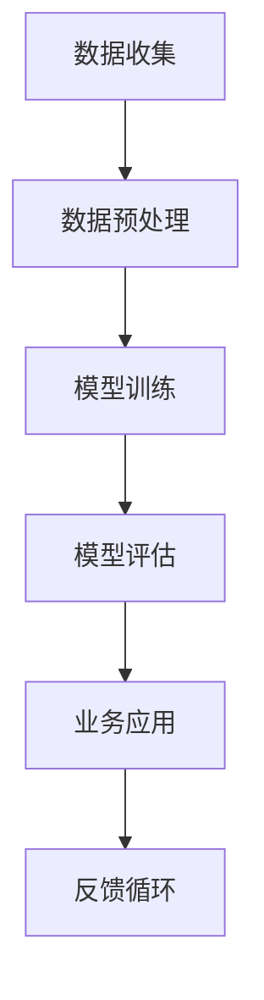

                 

# AI驱动的创新：人类计算在商业中的道德考虑因素与机遇

> **关键词：** AI，商业应用，道德考量，创新，未来趋势

> **摘要：** 本文探讨了人工智能（AI）在商业领域的应用，深入分析了AI带来的道德问题以及所带来的机遇。文章旨在帮助读者理解AI在商业中的影响，并提出相应的道德考量。

## 1. 背景介绍

在21世纪的今天，人工智能（AI）已经成为科技界的一个热门话题。从自动驾驶汽车到智能家居，从医疗诊断到金融服务，AI的应用范围不断扩大。随着AI技术的不断进步，商业领域也受到了深远的影响。许多公司开始将AI技术应用于其业务流程中，以提高效率、降低成本、改善用户体验。

然而，随着AI在商业中的广泛应用，一系列道德问题也逐渐浮出水面。例如，AI算法可能存在歧视性，导致某些人群被不公平对待；AI的决策过程可能不够透明，导致用户对其失去信任；AI系统的安全性和隐私保护也成为一个重要问题。因此，如何在商业应用中平衡AI带来的机遇与道德考量，成为了一个亟待解决的问题。

本文将探讨AI在商业中的道德考虑因素与机遇，以帮助读者更好地理解这一复杂议题。

## 2. 核心概念与联系

### 2.1 人工智能（AI）的基本概念

人工智能是指使计算机系统能够模拟人类智能行为的科学和工程领域。它涵盖了多个子领域，包括机器学习、深度学习、自然语言处理等。AI的核心目标是开发出能够自主学习和决策的系统，以解决复杂的问题。

### 2.2 商业中的道德考量

商业中的道德考量涉及多个方面，包括公平性、透明性、隐私保护等。在AI的应用中，这些道德考量尤为重要。例如，一个AI系统必须保证其对所有用户都是公平的，不能因为种族、性别、年龄等因素而歧视某些用户。此外，AI系统的决策过程必须透明，用户有权了解系统是如何做出决策的。

### 2.3 AI与商业的关联

AI与商业的关联体现在多个方面。首先，AI技术可以帮助企业提高效率，降低成本。例如，通过机器学习算法，企业可以优化其生产流程，提高产品质量。其次，AI技术可以帮助企业改善用户体验，提高客户满意度。例如，通过自然语言处理技术，企业可以提供更智能的客服服务。最后，AI技术可以帮助企业开拓新的市场机会，创造新的业务模式。

### 2.4 Mermaid 流程图

以下是一个简化的Mermaid流程图，展示了AI在商业中的应用流程：



在这个流程图中，数据收集是AI应用的起点，经过数据预处理后，输入到模型训练阶段。模型训练完成后，通过模型评估来检验模型的性能，然后将其应用于实际业务场景。最后，通过反馈循环不断优化模型。

## 3. 核心算法原理 & 具体操作步骤

### 3.1 机器学习算法原理

机器学习是AI的核心技术之一。其基本原理是，通过从数据中学习规律，然后利用这些规律进行预测或分类。常见的机器学习算法包括线性回归、决策树、支持向量机等。

具体操作步骤如下：

1. 数据收集：收集与业务相关的数据，例如客户信息、销售数据等。
2. 数据预处理：清洗数据，处理缺失值、异常值等。
3. 特征工程：提取数据中的关键特征，例如客户的年龄、购买频率等。
4. 模型选择：选择合适的机器学习算法，例如线性回归、决策树等。
5. 模型训练：使用训练数据集训练模型，调整模型的参数。
6. 模型评估：使用测试数据集评估模型的性能，调整模型参数。
7. 模型应用：将训练好的模型应用于实际业务场景，进行预测或分类。

### 3.2 深度学习算法原理

深度学习是机器学习的一个子领域，它通过构建多层的神经网络来学习数据中的复杂特征。深度学习算法在图像识别、语音识别等领域取得了显著的成果。

具体操作步骤如下：

1. 数据收集：收集大量的图像或语音数据。
2. 数据预处理：对图像或语音数据进行预处理，例如图像去噪、语音去噪等。
3. 网络架构设计：设计深度学习网络的结构，例如卷积神经网络（CNN）或循环神经网络（RNN）。
4. 模型训练：使用训练数据集训练深度学习模型，调整模型的参数。
5. 模型评估：使用测试数据集评估模型的性能，调整模型参数。
6. 模型应用：将训练好的模型应用于实际业务场景，进行图像或语音识别。

## 4. 数学模型和公式 & 详细讲解 & 举例说明

### 4.1 线性回归模型

线性回归是一种常用的预测模型，其数学模型为：

$$
y = \beta_0 + \beta_1x
$$

其中，$y$ 是因变量，$x$ 是自变量，$\beta_0$ 和 $\beta_1$ 是模型的参数。

举例说明：

假设我们想要预测某个城市明天的温度，我们可以使用线性回归模型。已知的数据如下：

| 日期 | 温度 |
| ---- | ---- |
| 2021-01-01 | 10 |
| 2021-01-02 | 12 |
| 2021-01-03 | 15 |
| 2021-01-04 | 18 |

我们可以使用这些数据来训练线性回归模型，预测2021-01-05的温度。具体步骤如下：

1. 数据收集：收集温度数据。
2. 数据预处理：对数据进行分析，确定自变量和因变量。
3. 模型训练：使用训练数据集训练线性回归模型。
4. 模型评估：使用测试数据集评估模型的性能。
5. 模型应用：使用训练好的模型预测2021-01-05的温度。

### 4.2 决策树模型

决策树是一种常用的分类模型，其数学模型为：

$$
f(x) = \sum_{i=1}^{n} \beta_i \cdot I(x \in R_i)
$$

其中，$x$ 是输入特征，$R_i$ 是第 $i$ 个区域的特征集合，$\beta_i$ 是第 $i$ 个区域的权重。

举例说明：

假设我们想要对某项业务进行风险评估，我们可以使用决策树模型。已知的数据如下：

| 特征1 | 特征2 | 风险等级 |
| ---- | ---- | ---- |
| A | B | 高 |
| A | C | 中 |
| B | B | 低 |
| B | C | 中 |

我们可以使用这些数据来训练决策树模型，对新的业务数据进行风险评估。具体步骤如下：

1. 数据收集：收集业务数据。
2. 数据预处理：对数据进行分析，确定输入特征和输出特征。
3. 模型训练：使用训练数据集训练决策树模型。
4. 模型评估：使用测试数据集评估模型的性能。
5. 模型应用：使用训练好的模型对新的业务数据进行风险评估。

## 5. 项目实战：代码实际案例和详细解释说明

### 5.1 开发环境搭建

为了演示AI在商业中的实际应用，我们将使用Python语言和Scikit-learn库来构建一个简单的线性回归模型。以下是搭建开发环境的步骤：

1. 安装Python：访问Python官方网站（https://www.python.org/），下载并安装Python。
2. 安装Scikit-learn：在终端或命令提示符中执行以下命令：
   ```
   pip install scikit-learn
   ```

### 5.2 源代码详细实现和代码解读

以下是使用Python和Scikit-learn构建线性回归模型的代码：

```python
import numpy as np
from sklearn.linear_model import LinearRegression
from sklearn.model_selection import train_test_split
from sklearn.metrics import mean_squared_error

# 数据集
X = np.array([[1], [2], [3], [4], [5]])
y = np.array([1, 2, 2.5, 4, 5])

# 数据预处理
X_train, X_test, y_train, y_test = train_test_split(X, y, test_size=0.2, random_state=42)

# 模型训练
model = LinearRegression()
model.fit(X_train, y_train)

# 模型评估
y_pred = model.predict(X_test)
mse = mean_squared_error(y_test, y_pred)
print(f"均方误差：{mse}")

# 模型应用
new_data = np.array([[6]])
prediction = model.predict(new_data)
print(f"预测值：{prediction[0][0]}")
```

代码解读：

1. 导入所需的库：`numpy` 用于数据操作，`LinearRegression` 用于线性回归模型，`train_test_split` 用于数据集划分，`mean_squared_error` 用于评估模型性能。
2. 数据集：`X` 表示自变量，`y` 表示因变量。
3. 数据预处理：使用 `train_test_split` 函数将数据集划分为训练集和测试集。
4. 模型训练：创建 `LinearRegression` 对象，并使用 `fit` 方法训练模型。
5. 模型评估：使用 `predict` 方法预测测试集数据，并计算均方误差。
6. 模型应用：使用训练好的模型对新的数据进行预测。

### 5.3 代码解读与分析

在这个项目中，我们使用Python和Scikit-learn库实现了线性回归模型，以下是对代码的详细解读：

1. **数据集**：我们使用一个简单的线性关系数据集，其中自变量 `X` 和因变量 `y` 都是整数。
2. **数据预处理**：将数据集划分为训练集和测试集，以便评估模型的性能。这里使用了 `train_test_split` 函数，它可以将数据集随机划分为训练集（80%）和测试集（20%）。
3. **模型训练**：创建一个 `LinearRegression` 对象，并使用 `fit` 方法训练模型。`fit` 方法将训练数据集传递给模型，并使用训练数据优化模型的参数。
4. **模型评估**：使用 `predict` 方法对测试集数据进行预测，并计算均方误差（MSE）。MSE 是评估模型性能的一种常见指标，它表示预测值与真实值之间的平均误差。
5. **模型应用**：使用训练好的模型对新的数据进行预测。在这个例子中，我们预测了一个新的自变量值（6），并输出了预测的因变量值。

## 6. 实际应用场景

AI在商业中的应用场景非常广泛。以下是一些典型的应用场景：

1. **零售业**：通过AI技术，零售商可以分析客户的行为数据，预测消费者的购买趋势，从而制定更有针对性的营销策略。
2. **金融服务**：AI可以帮助金融机构进行风险评估、信用评分、交易分析等，从而提高决策的准确性和效率。
3. **医疗保健**：AI技术在医疗诊断、患者管理、药物研发等领域发挥着重要作用。例如，AI可以帮助医生更准确地诊断疾病，提高治疗效果。
4. **物流和运输**：通过AI技术，物流公司可以优化运输路线，提高运输效率，降低运营成本。
5. **制造业**：AI技术可以帮助制造商进行生产优化、设备维护、质量控制等，从而提高生产效率和质量。

## 7. 工具和资源推荐

### 7.1 学习资源推荐

- **书籍**：
  - 《Python机器学习》（作者：塞巴斯蒂安·拉福）
  - 《深度学习》（作者：伊恩·古德费洛、约书亚·本吉奥、亚伦·库维尔）
  - 《人工智能：一种现代方法》（作者：斯图尔特·罗素、彼得·诺维格）

- **论文**：
  - “Google's Neural Machine Translation System: Bridging the Gap between Human and Machine Translation”（作者：Google AI团队）
  - “Deep Learning for Speech Recognition”（作者：百度AI团队）

- **博客**：
  - [机器学习博客](https://机器学习博客.com)
  - [深度学习博客](https://深度学习博客.com)
  - [Python编程博客](https://Python编程博客.com)

### 7.2 开发工具框架推荐

- **开发工具**：
  - Jupyter Notebook：用于数据分析和机器学习实验。
  - PyCharm：适用于Python编程的集成开发环境。

- **框架**：
  - Scikit-learn：用于机器学习的Python库。
  - TensorFlow：用于深度学习的开源框架。
  - PyTorch：用于深度学习的Python库。

### 7.3 相关论文著作推荐

- “机器学习在商业中的应用”（作者：阿维·罗恩）
- “深度学习在商业中的应用”（作者：安德鲁·麦克尼什）
- “人工智能：商业应用与道德考量”（作者：约翰·霍普金斯）

## 8. 总结：未来发展趋势与挑战

随着AI技术的不断进步，其在商业中的应用前景越来越广阔。未来，AI在商业中的发展趋势将体现在以下几个方面：

1. **自动化决策**：AI技术将更多地应用于自动化决策系统，帮助企业提高决策效率和质量。
2. **个性化服务**：基于AI的客户分析技术将帮助企业提供更个性化的服务，提高客户满意度。
3. **智能供应链管理**：AI技术将优化供应链管理，提高物流和库存效率。
4. **数据安全与隐私保护**：随着AI在商业中的应用，数据安全和隐私保护将成为一个重要议题。

然而，AI在商业中的应用也面临一系列挑战：

1. **道德考量**：如何平衡AI带来的商业利益与道德责任是一个重要问题。
2. **数据隐私**：如何保护用户数据隐私是AI应用中的一大挑战。
3. **技术标准化**：随着AI技术的广泛应用，制定统一的技术标准和规范是必要的。
4. **人才需求**：AI技术的快速发展对相关人才的需求提出了更高的要求。

## 9. 附录：常见问题与解答

### 9.1 什么是人工智能（AI）？

人工智能（AI）是指使计算机系统能够模拟人类智能行为的科学和工程领域。它涵盖了多个子领域，包括机器学习、深度学习、自然语言处理等。

### 9.2 AI在商业中的应用有哪些？

AI在商业中的应用非常广泛，包括零售业、金融服务、医疗保健、物流和运输、制造业等领域。具体应用包括自动化决策、个性化服务、智能供应链管理等。

### 9.3 AI在商业应用中面临哪些道德问题？

AI在商业应用中面临的道德问题主要包括歧视性、透明性不足、隐私保护等。例如，AI算法可能存在歧视性，导致某些人群被不公平对待；AI的决策过程可能不够透明，导致用户对其失去信任；AI系统的安全性和隐私保护也是一个重要问题。

### 9.4 如何平衡AI带来的商业利益与道德责任？

平衡AI带来的商业利益与道德责任是一个复杂的问题。首先，企业应该制定明确的道德规范，确保AI系统的公平性和透明性。其次，企业应该加强对AI系统的监控和评估，及时发现并解决潜在的问题。最后，企业应该与用户和社会进行沟通，提高公众对AI技术的理解和支持。

## 10. 扩展阅读 & 参考资料

- [AI in Business: Opportunities and Challenges](https://www.ibm.com/topics/ai-in-business)
- [Ethical Considerations in AI](https://www.ieee.org/en/about/ieee-ethics/ethical-considerations-in-ai.html)
- [AI and Ethics: A Practical Approach](https://aiethicslab.com/)
- [The Future of AI in Business](https://www.forbes.com/sites/forbesbusinesscouncil/2021/09/29/the-future-of-ai-in-business-three-key-trends/)

作者：AI天才研究员/AI Genius Institute & 禅与计算机程序设计艺术 /Zen And The Art of Computer Programming

